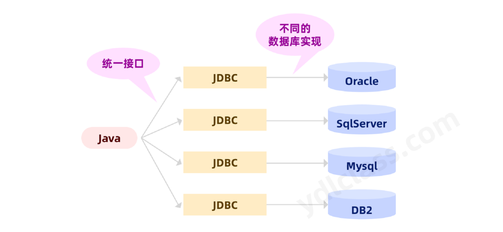

---
# 当前页面内容标题
title: JDBC
# 当前页面图标
icon: database
# 分类
category:
  - JDBC
  - MySQL
# 标签
tag:
  - JDBC
  - MySQL
sticky: false
# 是否收藏在博客主题的文章列表中，当填入数字时，数字越大，排名越靠前。
star: false
# 是否将该文章添加至文章列表中
article: false
# 目录顺序
order: 10
# 是否将该文章添加至时间线中
timeline: false
---

> [!TIP]
>
> 课程视频教程链接：<https://www.bilibili.com/video/BV1eU4y117tx>

## 第一章 jdbc 概述

1、JDBC（Java DataBase Connectivity），即 Java 数据库连接技术。它是一套用于访问【关系型数据库】的应用程序 API，由一组用 Java 语言编写的【类和接口】组成。


2、jdbc 是一种规范，它由 Sum 公司（Oracle）提供了一套完整的**接口**。JDBC 规范提供的接口存在于 java\.sql 包中，如下：


3、不同的数据库厂商只需要【按照 jdbc 规范】提供的 api 接口进行各自的实现，程序员只需要【面向接口和规范】编程，不需要关心具体的实现。

不同数据库的底层技术不同，不少数据库还是闭源的，源代码不公开的。Sun 公司不可能为所有数据库提供具体实现，只能提供一套统一的接口规范。



4、Mysql 提供的【JDBC 实现】称为 Mysql Connector,不同的数据库版本需要使用不同的 Connector。实际开发时根据数据库版本、JDK 版本、选择不同的 Connector。

| Connector 版本 | MySQL 版本    | JDK 版本       |
| -------------- | ------------- | -------------- |
| 8.0            | 5.6, 5.7, 8.0 | JDK 8.0 或更高 |
| 5.1            | 5.6, 5.7      | JDK 5.0 或更高 |

Mysql Connector 可以在下边的网址中进行下载：（当然我们的群辉中也有）

```http
https://developer.aliyun.com/mvn/search
```


## 第二章 获取连接

JDBC 中定义了操作数据库的各种接口和类型，以下章节可能会使用到，如下：

| 接口              | 作用                                       |
| ----------------- | ------------------------------------------ |
| Driver            | 驱动接口                                   |
| DriverManager     | 工具类，用于管理驱动，可以获取数据库的链接 |
| Connection        | 表示 Java 与数据库建立的连接对象（接口）   |
| PreparedStatement | 发送 SQL 语句的工具                        |
| ResultSet         | 结果集，用于获取查询语句的结果             |

我们使用 java 代码获取 mysql 连接时需要以下三个要素：

### 一 、驱动

#### 1、Driver 接口介绍

`java.sql.Driver` 接口是所有【驱动程序】需要实现的接口。这个接口是提供给数据库厂商使用的，不同数据库厂商提供不同的实现。

在程序中不需要直接去访问实现了 Driver 接口的类，而是由驱动程序管理器类(`java.sql.DriverManager`)去调用这些 Driver 实现。

不同的厂商提供了不同的驱动，如下：

```java
- Oracle的驱动：oracle.jdbc.driver.OracleDriver
- mySql 的驱动：com.mysql.cj.jdbc.Driver | com.mysql.jdbc.Driver
```

将上述 jar 包拷贝到 Java 工程的一个目录中，习惯上新建一个 lib 文件夹，不同的 idea 有不同的操作。

#### 2、加载与注册驱动

- 加载驱动：我们需要将数据的的驱动实现类加载到 JVM 中，实现这个目的我们可以使用 Class 类的静态方法 forName()，向其传递要加载的驱动的类名 Class.forName(“com.mysql.cj.jdbc.Driver”)。当然，理论上你 new 一个也行，第一次主动使用一个类就会触发类的加载。这里【为什么不 new】我们先卖一个关子。

```java
Class clazz = Class.forName("com.mysql.cj.jdbc.Driver");
```

- 创建驱动：

```java
Driver driver = (Driver) clazz.newInstance();
```

- 注册驱动：DriverManager 类是驱动程序管理器类，负责管理驱动程序。使用 `DriverManager.registerDriver(com.mysql.cj.jdbc.Driver)`来注册驱动。

```java
DriverManager.registerDriver(driver);
```

### 二、URL

1、URL 用于标识一个被注册的驱动程序，从而建立到数据库的连接。

2、URL 的标准由三部分组成，各部分间用冒号分隔：

- 协议：java 的连接 URL 中的协议总是 jdbc 。
- 子协议：子协议用于标识一个数据库驱动程序。
- 子名称：一种标识【数据库】的方法。子名称作用是为了【定位数据库】。其包含【主机名】(对应服务端的 ip 地址)，【端口号】，【数据库名】。

3、MySQL 的连接 URL 编写方式：

- **jdbc:mysql://主机名称:mysql 服务端口号/数据库名称?参数=值&参数=值**。
- 最简单的写法：`jdbc:mysql://localhost:3306/ydlclass`。
- 带参数的写法：`jdbc:mysql://localhost:3306/ydlclass?key1=value1&key2=value2`
- mysql8.0 后必需要加上 **"serverTimezone=UTC"**，指定当前服务器所处的时区。（也要看 jdbc 的版本）

```http
serverTimezone=Asia/Shanghai
```

我们也可以使用 UTC（世界统一时间），但是这个时间和中国的时间差八小时（东八区），所以我们可以这样写：

```http
serverTimezone=GMT%2B8（%2B相当于“+”号）
```


通常一个高版本的 mysql 的 url 还会包含以下三个参数：

```http
useUnicode=true&characterEncoding=utf8&useSSL=false
```

1、useUnicode=true&characterEncoding=UTF-8 的作用是：指定字符的编码、解码格式。

比如：若 mysql 数据库用到 是 GBK 编码方式，而项目数据用的是 UTF-8 编码方式。这时如果添加了"useUnicode=true&characterEncoding=UTF-8"，则在存取数据时根据 mysql 和项目的编码方式将数据进行相应的格式转化。即：

（1）存数据

数据库在存放项目数据的时候会先用 UTF-8 格式将数据解码成字节码，然后再将解码后的字节码重新使用 GBK 编码，并存放到数据库中。

（2）取数据

在数据库中取数据的时候，数据库会先将数据库中的数据按 GBK 格式解码成字节码，然后再将解码后的字节码重新按 UTF-8 格式编码数据，最后再将数据返回给客户端。

2、MySQL5.7 之后要加上 useSSL=false，mysql5.7 以及之前的版本则不用进行添加 useSSL=false，会默认为 false。

- useSSL=true：就是一般通过证书或者令牌进行安全验证
- useSSL=false：就是通过账号密码进行连接
- SSL 协议提供服务主要：
  认证用户服务器，确保数据发送到正确的服务器； .
  加密数据，防止数据传输途中被窃取使用；
  维护数据完整性，验证数据在传输过程中是否丢失；

完整的 url:

```http
jdbc:mysql://localhost:3306/ydlclass?serverTimezone=GMT%2B8&useUnicode=true&characterEncoding=utf8&&useSSL=false
```

**小知识：**

- Oracle 的连接 URL 编写方式：**jdbc:oracle:thin:@主机名称:oracle 服务端口号:数据库名称**
  - `jdbc:oracle:thin:@localhost:1521:ydlclass`

- SQLServer 的连接 URL 编写方式：**jdbc:sqlserver://主机名称:sqlserver 服务端口号:DatabaseName=数据库名称** 
  - `jdbc:sqlserver://localhost:1433:DatabaseName=ydlclass`

### 三、用户名和密码

可以调用 DriverManager 类的 `getConnection()` 方法建立到数据库的连接，此方法需要传递三个参数：

- url：`jdbc:mysql://localhost:3306/ydlclass?useUnicode=true&characterEncoding=utf8&&useSSL=false&serverTimezone=GMT%2B8`
- username：root （mysql 数据库的用户名）
- password：root （mysql 数据库的密码）

### 四、获取连接

#### 1、完整写法

按照以上的逻辑我们可以写出如下的代码：

```java
@Test
public void testConnection1() throws Exception{
    //1.数据库连接的4个基本要素：
    String url = "jdbc:mysql://127.0.0.1:3306/test?useUnicode=true&characterEncoding=utf8&useSSL=false&serverTimezone=Asia/Shanghai";
    String user = "root";
    String password = "root";
    //8.0之后名字改了  com.mysql.cj.jdbc.Driver
    String driverName = "com.mysql.cj.jdbc.Driver";

    //2.实例化Driver
    Class clazz = Class.forName(driverName);
    Driver driver = (Driver) clazz.newInstance();
    //3.注册驱动
    DriverManager.registerDriver(driver);
    //4.获取连接
    Connection conn = DriverManager.getConnection(url, user, password);
    System.out.println(conn);
}
```

>  [!TIP]
>
> #### 解决 java.sql.SQLNonTransientConnectionException: Public Key Retrieval is not allowed
>
> 在使用 Java 的 JDBC 驱动（如 MySQL Connector/J）连接 MySQL 数据库时，可能会遇到 `java.sql.SQLNonTransientConnectionException: Public key retrieval is not allowed` 错误。这通常是由于 MySQL 默认的身份验证插件 `caching_sha2_password` 引起的。
>
> 示例
>
> ```java
> String url = "jdbc:mysql://localhost:3306/testdb?useSSL=false&allowPublicKeyRetrieval=true&serverTimezone=UTC";
> Connection conn = DriverManager.getConnection(url, "username", "password");
> ```
>
> ##### 解决方案
>
> ###### 1. 修改 JDBC URL
> 
> 在数据库连接字符串中添加 `allowPublicKeyRetrieval=true` 参数，使客户端能够从服务器检索公钥。
>
> ```java
> String url = "jdbc:mysql://localhost:3306/databasename?useSSL=false&allowPublicKeyRetrieval=true";
> ```
>
> ###### 2. 切换身份验证插件
>
> 将用户的插件从 `caching_sha2_password` 切换为 `mysql_native_password`。
>
> ```sql
> ALTER USER 'username'@'host' IDENTIFIED WITH mysql_native_password BY 'password';
> FLUSH PRIVILEGES;
> ```
>
> ###### 3. 更新 MySQL JDBC 驱动
>
> 确保 **MySQL Connector/J** 的版本是最新的（建议使用 8.x 版本）。
>
> ###### 4. 启用 SSL 加密
>
> 启用 SSL 参数以避免客户端直接检索公钥。
>
> ```java
> String url = "jdbc:mysql://hostname:3306/databasename?useSSL=true&requireSSL=true";
> ```
>
> ###### 5. 调整服务器设置（开发环境使用）
>
> 在 MySQL 配置文件中添加以下配置，强制使用 `mysql_native_password` 作为默认认证插件。
>
> ```ini
> [mysqld]
> 
> default_authentication_plugin=mysql_native_password
> ```
>
> 然后重启 MySQL 服务：
>
> `sudo systemctl restart mysql`
>
> 通过以上方法，可以解决 *Public key retrieval is not allowed* 错误，确保成功连接到 MySQL 数据库。

#### 2、静态代码块

事实上我们可以写的更简单：

```java
@Test
public void testConnection2() throws Exception{
    //1.数据库连接的4个基本要素：
    String url = "jdbc:mysql://127.0.0.1:3306/test?useUnicode=true&characterEncoding=utf8&useSSL=false&serverTimezone=Asia/Shanghai";
    String user = "root";
    String password = "root";
    String driverName = "com.mysql.cj.jdbc.Driver";

    //2.加载驱动 （①实例化Driver ②注册驱动）
    Class.forName(driverName);

    //3.获取连接
    Connection conn = DriverManager.getConnection(url, user, password);
    System.out.println(conn);
}
```

我们可以看一下，mysql 给我们的驱动的源码中有如下代码：

```java
package com.mysql.cj.jdbc;
public class Driver extends NonRegisteringDriver implements java.sql.Driver {
    public Driver() throws SQLException {
    }

    static {
        try {
            DriverManager.registerDriver(new Driver());
        } catch (SQLException var1) {
            throw new RuntimeException("Can't register driver!");
        }
    }
}
```

只要，这个类被加载，就会将自己注册给 DriverManager。

#### 3、spi 机制

当然我们还可以更简单，如下：

```java
@Test
public void testConnection3() throws Exception{
    //1.数据库连接的4个基本要素：
    String url = "jdbc:mysql://127.0.0.1:3306/test?useUnicode=true&characterEncoding=utf8&useSSL=false&serverTimezone=Asia/Shanghai";
    String user = "root";
    String password = "root";
    String driverName = "com.mysql.cj.jdbc.Driver";

    //3.获取连接
    Connection conn = DriverManager.getConnection(url, user, password);
    System.out.println(conn);
}
```

这就不得不提一下 spi 机制，我们仅仅是引入了这个 jar 包，他为什么会自动加载呢？

SPI 全称 *Service Provider Interface*，是 Java 提供的一套用来被第三方实现或者扩展的 API，它可以用来启用框架扩展和替换组件。


SPI 实际上是 “基于接口的编程＋策略模式＋配置文件” 组合实现的动态加载机制。

当前场景下的执行逻辑是：


其中通过 SPI 机制加载的逻辑是？

1、第一次主动使用 DriverManager（调用静态方法 getConnection）的时候会加载这个类。

我们在 getConnection 方法中跟踪，发现在方法 ensureDriversInitialized 中有如下代码，这段代码就是使用 spi 机制加载实现了 Driver 接口的类：

```java
ServiceLoader<Driver> loadedDrivers = ServiceLoader.load(Driver.class);
```

2、SPI 机制工作，他会在 classpath 中寻找 META-INF/services/目录下的所有文件，并加载所有名称为 java.sql.Driver 的文件，因为上一步已经告诉我们加载的目标接口对应的实现类。


3、将文件内所对应的实现类的名字使用反射进行加载。

4、加载 `com.mysql.cj.jdbc.Driver` 又会触发他的静态代码块被调用。

```java
package com.mysql.cj.jdbc;
public class Driver extends NonRegisteringDriver implements java.sql.Driver {
    public Driver() throws SQLException {
    }

    static {
        try {
            DriverManager.registerDriver(new Driver());
        } catch (SQLException var1) {
            throw new RuntimeException("Can't register driver!");
        }
    }
}
```

#### 4、配置文件

事实上，我们将 url、driverName、username 和 password 全部写死在代码中是有问题的，如果我们将来想换数据库，想换密码等就必须重新写代码、重新编译。

- 一个程序一旦打包完成，部署完成，重新编译是个很麻烦的事情。
- 相同的代码可能还要部署在不同的环境，比如测试有测试环境、生产有生产环境、开发有开发环境，每个环境的数据源都是不一样的，不能混着用。

```java
@Test
public void testConnection4() throws Exception{
    //1.数据库连接的4个基本要素：
    InputStream in = TestUser.class.getClassLoader().getResourceAsStream("jdbc.config");
    Properties properties = new Properties();
    properties.load(in);

    String url = properties.getProperty("url");
    String user = properties.getProperty("user");
    String password = properties.getProperty("password");
    String driverName = properties.getProperty("driverName");

    //2.加载驱动 （①实例化Driver ②注册驱动）
    Class.forName(driverName);

    //3.获取连接
    Connection conn = DriverManager.getConnection(url, user, password);
    System.out.println(conn);
}

}
```

## 第三章 常用 api

### 一、操作和访问数据库

一个数据库连接就是一个 Socket 连接，数据库连接被用于向数据库服务器发送命令和 SQL 语句，并接受数据库服务器返回的结果。

在 `java.sql` 包中有 3 个接口分别定义了对数据库的调用的不同方式：

- **Statement**：用于执行静态 SQL 语句并返回它所生成结果的对象。
- **PreparedStatement**：语句被预编译并存储在此对象中，可以使用此对象多次高效地执行该语句。
- **CallableStatement**：用于执行 SQL 存储过程

### 二、Statement

通过调用 Connection 对象的 `createStatement()` 方法创建该对象。该对象用于执行静态的 SQL 语句，并且返回执行结果。

Statement 接口中定义了下列方法用于执行 SQL 语句：

```sql
int excuteUpdate(String sql)：执行更新操作INSERT、UPDATE、DELETE
ResultSet executeQuery(String sql)：执行查询操作SELECT
```

**小问题：**

但是使用 Statement 操作数据表存在弊端：

- 问题一：存在拼串操作，繁琐
- 问题二：存在 SQL 注入问题（后边会单独讲解）

准备一张用户表：

```sql
DROP TABLE IF EXISTS `user`;
CREATE TABLE `user`  (
  `id` int(11) NOT NULL,
  `username` varchar(50)  NOT NULL,
  `password` varchar(50)  NOT NULL,
  `birthday` date NULL DEFAULT NULL,
  PRIMARY KEY (`id`) USING BTREE
)
```

#### 1、体会增删改代码

```java
@Test
public void testInsert() throws Exception {

    //1.数据库连接的4个基本要素：
    String url = "jdbc:mysql://127.0.0.1:3306/ydlclass?&characterEncoding=utf8&serverTimezone=Asia/Shanghai";
    String user = "root";
    String password = "root";
    String driverName = "com.mysql.cj.jdbc.Driver";
    String sql = "insert into user values(1,'itnanls','12','1991-07-14')";

    //2.实例化Driver
    Class clazz = Class.forName(driverName);
    Driver driver = (Driver) clazz.newInstance();
    //3.注册驱动
    DriverManager.registerDriver(driver);
    //4.获取连接
    Connection conn = DriverManager.getConnection(url, user, password);

    Statement statement = conn.createStatement();
    int affectedRows = statement.executeUpdate(sql);
    System.out.println(affectedRows);
}
```

executeUpdate 方法的返回值，在源码中的解释如下：Returns:

- the row count for SQL Data Manipulation Language (DML) statements
- 0 for SQL statements that return nothing

意思就是，返回 DML 语句执行的受影响行数，如果没有任何操作则返回 0。

其实 navicat 同样拥有这个返回值：


比如，我们插入一行，最后就会返回 1。


#### 2、体会查询代码

Java 与 SQL 数据类型转换表

| Java 类型                       | SQL 类型        |
| ------------------------------- | --------------- |
| boolean                         | BIT             |
| byte                            | TINYINT         |
| short                           | SMALLINT        |
| int                             | INTEGER         |
| long                            | BIGINT          |
| String                          | CHAR,VARCHAR... |
| byte                            | BINARY          |
| java.sql.Date（日期，没有时间） | DATE            |
| java.sql.Time（只有时间）       | TIME            |
| java.sql.Timestamp              | TIMESTAMP       |


代码实现：

```java
@Test
public void testQuery() throws Exception {

    //1.数据库连接的4个基本要素：
    String url = "jdbc:mysql://127.0.0.1:3306/ydlclass?useUnicode=true&characterEncoding=utf8&useSSL=false&serverTimezone=Asia/Shanghai";
    String user = "root";
    String password = "root";
    String driverName = "com.mysql.cj.jdbc.Driver";
    String sql = "select id,username,password,birthday from user";

    //2.实例化Driver
    Class clazz = Class.forName(driverName);
    Driver driver = (Driver) clazz.newInstance();
    //3.注册驱动
    DriverManager.registerDriver(driver);
    //4.获取连接
    Connection conn = DriverManager.getConnection(url, user, password);

    Statement statement = conn.createStatement();
    ResultSet resultSet = statement.executeQuery(sql);
    resultSet.next();
    int id = resultSet.getInt("id");
    String username = resultSet.getString("username");
    String pwd = resultSet.getString("password");
    String birthday = resultSet.getString("birthday");
    System.out.println("id="+id);
    System.out.println("username=" + username);
    System.out.println("password=" + pwd);
    System.out.println("birthday=" + birthday);

    resultSet.next();
    id = resultSet.getInt("id");
    username = resultSet.getString("username");
    pwd = resultSet.getString("password");
    birthday = resultSet.getString("birthday");
    System.out.println("id=" + id);
    System.out.println("username=" + username);
    System.out.println("password=" + pwd);
    System.out.println("birthday=" + birthday);
}
```

#### 3、代码优化

##### （1）资源的释放

数据库连接（Connection）是非常稀有的资源，用完后必须马上释放，如果 Connection 不能及时正确的关闭，可能会导致系统宕机。Connection 的使用原则是【尽量晚创建，尽量早的释放】。

我们可以通过如下命令，查看当前 mysql 默认支持的最大连接数，这里仅仅是 151，当然我们可以根据自己服务器的配置进行设置，但不能超过 16384，我们也不会设置这么大，当连接过多服务器就会有过高负荷，甚至可能崩溃。


我们可以选择在 finally 中关闭连接，保证即使其他代码出现异常，资源也一定能被关闭。

代码如下：

```java
@Test
public void testQuery2() {

    //1.数据库连接的4个基本要素：
    String url = "jdbc:mysql://127.0.0.1:3306/ydlclass?useUnicode=true&characterEncoding=utf8&useSSL=false&serverTimezone=Asia/Shanghai";
    String user = "root";
    String password = "root";
    String driverName = "com.mysql.cj.jdbc.Driver";
    String sql = "select id,username,password,birthday from user";

    //2.实例化Driver
    //抽离资源，方便合理关闭
    Connection conn = null;
    Statement statement = null;
    ResultSet resultSet = null;
    //手动处理异常
    try {
        Class clazz = Class.forName(driverName);
        Driver driver = (Driver) clazz.newInstance();
        //3.注册驱动
        DriverManager.registerDriver(driver);
        //4.获取连接
        conn = DriverManager.getConnection(url, user, password);

        statement = conn.createStatement();
        resultSet = statement.executeQuery(sql);
        //使用遍历获取数据
        while (resultSet.next()){
            int id = resultSet.getInt("id");
            String username = resultSet.getString("username");
            String pwd = resultSet.getString("password");
            String birthday = resultSet.getString("birthday");
            System.out.println("id="+id);
            System.out.println("username=" + username);
            System.out.println("password=" + pwd);
            System.out.println("birthday=" + birthday);
        }

    } catch (Exception exception) {
        exception.printStackTrace();
    }finally {
        //关闭资源
        if(conn != null){
            try {
                conn.close();
            } catch (SQLException e) {
                e.printStackTrace();
            }
        }
        if(statement != null){
            try {
                statement.close();
            } catch (SQLException e) {
                e.printStackTrace();
            }
        }
        if(resultSet != null){
            try {
                resultSet.close();
            } catch (SQLException e) {
                e.printStackTrace();
            }
        }
    }
}
```

#### 4、公共代码提取

1、不管哪里要操作数据库都要获取连接，所以我们可以将获取连接的代码提取出来！

2、不管哪里都要关闭资源，我么同样可以将关闭资源进行统一抽离。

```java
public class DBUtil {
    public static Connection getConnection(){

        String url = "jdbc:mysql://127.0.0.1:3306/ydlclass?useUnicode=true&characterEncoding=utf8&useSSL=false&serverTimezone=Asia/Shanghai";
        String user = "root";
        String password = "root";
        String driverName = "com.mysql.cj.jdbc.Driver";

        Connection conn = null;
        try {
            Class clazz = Class.forName(driverName);
            Driver driver = (Driver) clazz.newInstance();
            //3.注册驱动
            DriverManager.registerDriver(driver);
            //4.获取连接
            conn = DriverManager.getConnection(url, user, password);
        }catch (Exception e){
            e.printStackTrace();
        }
        return conn;
    }

    public static void closeAll(Connection connection, Statement statement, ResultSet rs){
       if(connection != null){
           try {
               connection.close();
           } catch (SQLException e) {
               e.printStackTrace();
           }
       }
       if(statement != null){
           try {
               statement.close();
           } catch (SQLException e) {
               e.printStackTrace();
           }
       }
       if( rs != null ){
           try {
               rs.close();
           } catch (SQLException e) {
               e.printStackTrace();
           }
       }
    }


}
@Test
public void testQuery3() {

    String sql = "select id,username,password,birthday from user";

    Connection conn = null;
    Statement statement = null;
    ResultSet resultSet = null;
    //手动处理异常
    try {
        conn = DBUtil.getConnection();
        statement = conn.createStatement();
        resultSet = statement.executeQuery(sql);
        //使用遍历获取数据
        while (resultSet.next()){
            int id = resultSet.getInt("id");
            String username = resultSet.getString("username");
            String pwd = resultSet.getString("password");
            String birthday = resultSet.getString("birthday");
            System.out.println("id="+id);
            System.out.println("username=" + username);
            System.out.println("password=" + pwd);
            System.out.println("birthday=" + birthday);
        }
    } catch (Exception exception) {
        exception.printStackTrace();
    }finally {
        DBUtil.closeAll(conn,statement,resultSet);
    }
}
```

#### 5、sql 注入问题

**SQL 注入**：是利用某些系统没有对用户输入的数据进行充分的检查，而在用户输入数据中注入非法的 SQL 语句段或命令（如：`SELECT user, password FROM user_table WHERE user='a' OR 1 = ' AND password = ' OR '1' = '1')` ，从而利用系统的 SQL 引擎完成恶意行为的做法。

从代码的角度上看，上述的 SQL 本质上就是一个字符串，所以会有攻击者使用一些特殊技巧完成一些操作，想方设法绕开我们的逻辑，下边的例子就能很好的说明这个问题。

我们可以写一个小的程序，

1、输入用户名和密码

2、根据用户名和密码查询用户

3、查询到用户返回登陆成功，否则显示登陆失败。

代码很简单，如下：

```java
public static void main(String[] args) {
    Scanner scanner = new Scanner(System.in);
    System.out.println("请输入用户名：");
    String username = scanner.nextLine();
    System.out.println("请输入密码：");
    String password = scanner.nextLine();

    String sql = "select id,username,password from `user` where username = '" +username +"' and password = '" + password + "'";
    System.out.println(sql);
    Connection connection;
    Statement statement;
    ResultSet rs;
    try {
        connection = DBUtil.getConnection();
        statement = connection.createStatement();
        rs = statement.executeQuery(sql);
        if(rs.next()){
            System.out.println("用户："+username+"，登陆成功！");
            return;
        }
        System.out.println("用户："+username+"，登陆失败！");

    } catch (SQLException e){
        e.printStackTrace();
    }

}
```

输入正确的用户名和密码，登陆成功：


输入错误的用户名和密码，登陆失败：


使用 sql 注入，登陆成功：


### 三、PreparedStatement 的使用

#### 1、mysql 预编译

（1）什么是 MySQL 的预编译？

通常我们发送一条 SQL 语句给 MySQL 服务器时，MySQL 服务器每次都需要对这条 SQL 语句进行校验、解析等操作。

我们可还曾记得这张图：


但是有很多情况下，我们的【一条 SQL 语句】可能需要反复的执行，每次执行可能仅仅是传递的参数不同而已，类似于这样的 SQL 语句如果每次都需要进行校验、解析等操作，未免太过于浪费性能了，因此产生了 SQL 语句的预编译。

所谓【预编译】就是将一些灵活的参数值以占位符?的形式给代替掉，我们把参数值给抽取出来，把 SQL 语句进行模板化。让 MySQL 服务器执行相同的 SQL 语句时，不需要在校验、解析 SQL 语句上面花费重复的时间。

（2） 如何使用预编译？

```sql
-- 定义一个预编译语句
prepare name from statement;
```

第一步：定义预编译 SQL 语句：

```sql
prepare statement from 'select * from user where id=?';
```

第二步：设置参数值：

```sql
set @id=1;
```

第三步：执行预编译 SQL 语句：

```sql
execute statement using @id;
```

如果是多个参数使用逗号隔开：

```sql
prepare statement from 'select * from user where id=? and username = ?';
set @id=1,@username='zs';
execute statement using @id , @username;
```

#### 2、使用 PreparedStatement

- 通过调用 Connection 对象的 【preparedStatement(String sql)】方法获取 PreparedStatement 对象
- PreparedStatement 接口是 Statement 的子接口，它表示一条【预编译】过的 SQL 语句
- PreparedStatement 对象所代表的 SQL 语句中的参数用问号(?)来表示，调用 PreparedStatement 对象的 setXxx() 方法来设置这些参数。

```java
@Test
public void testQuery3()  {

    // 1、定义资源
    Connection connection = null;
    ResultSet resultSet = null;
    PreparedStatement statement = null;
    String sql = "select * from user where id = ?";

    try {
        // 获取连接
        connection = DBUtil.getConnection();
        // 获取使用预编译的statement
        statement = connection.prepareStatement(sql);
        statement.setInt(1,1);
        // 获取结果集
        resultSet = statement.executeQuery();
        // 封装结果
        List<User> users = new ArrayList<>();
        while (resultSet.next()){
            User user = new User();
            int id = resultSet.getInt(1);
            String username = resultSet.getString(2);
            String password = resultSet.getString(3);
            Date date = resultSet.getDate(4);
            user.setId(id);
            user.setUsername(username);
            user.setPassword(password);
            user.setDate(date);
            users.add(user);
        }
        System.out.println(users);
    } catch (SQLException e){
        e.printStackTrace();
    } finally {
        // 关闭资源
        DBUtil.closeAll(connection,statement,resultSet);
    }

}
```

**事实上：**

默认使用 PreparedStatement 是【不能执行预编译】的，这需要在 url 中给出 useServerPrepStmts=true 参数（MySQL Server 4.1 之前的版本是不支持预编译的，而 Connector/J 在 5.0.5 以后的版本，默认是没有开启预编译功能的），url 参数如下：

```http
useServerPrepStmts=true&cachePrepStmts=true
```

> [!NOTE]
>
> 当使用不同的 PreparedStatement 对象来执行相同的 SQL 语句时，还是会出现编译两次的现象，这是因为驱动没有缓存编译后的函数 key，会二次编译。如果希望缓存编译后函数的 key，那么就要设置 cachePrepStmts 参数为 true，如上 url 的参数。

url 添加了参数之后才能保证 mysql 驱动先把 SQL 语句发送给服务器进行预编译，然后在执行 executeQuery()时只是把参数发送给服务器。

执行流程如下：


为了查看效果，我们不妨打开 mysql 的通用查询日志：

```sql
show VARIABLES like '%general_log%'
SET GLOBAL general_log=1
```

执行成功后，查看日志，发现执行的 sql 语句依然是普通的 sql：


将 url 增加参数之后，再次执行，发现日志如下，确实开启了预编译：


#### 3、防止 sql 注入

使用 PreparedStatement 可以防止 SQL 注入，其根本原因是因为 mysql 已经对使用了占位符的 sql 语句进行了预编译，执行计划中的条件已经确定，不能额外在添加其他条件，从而避免了 sql 注入。

代码如下：

```java
public static void main(String[] args) {
    Scanner scanner = new Scanner(System.in);
    System.out.println("请输入用户名：");
    String username = scanner.nextLine();
    System.out.println("请输入密码：");
    String password = scanner.nextLine();

    String sql = "select id,username,password from `user` where username = ? and password = ?";
    System.out.println(sql);
    Connection connection;
    PreparedStatement statement;
    ResultSet rs;
    try {
        connection = DBUtil.getConnection();
        statement = connection.prepareStatement(sql);
        statement.setString(1,username);
        statement.setString(2,password);
        rs = statement.executeQuery();
        if(rs.next()){
            System.out.println("用户："+username+"，登陆成功！");
            return;
        }
        System.out.println("用户："+username+"，登陆失败！");

    } catch (SQLException e){
        e.printStackTrace();
    }
}
```

输入正确的密码，登陆成功：


输入错误的密码，登陆失败：


尝试进行 sql 注入，注入失败：


```sql
select id,username,password from `user` where username = 'jerry' and password = '12ww\' or 1 = \'1'
```

**小结，PreparedStatement 有一下有点：**

1、sql 的可读性更强，参数更加灵活更加面向对象，不再是简单的拼接字符串。

2、sql 会进行预编译，性能高，可以进行重复利用。

3、sql 的预编译同样可以防止 sql 注入。

#### 4、使用 PreparedStatement 实现增、删、改操作

```java
//通用的增、删、改操作（体现一：增、删、改 ； 体现二：针对于不同的表）
public void update(String sql,Object ... args){
    Connection conn = null;
    PreparedStatement ps = null;
    try {
        //1.获取数据库的连接
        conn = DBUtilsUtils.getConnection();

        //2.获取PreparedStatement的实例 (或：预编译sql语句)
        ps = conn.prepareStatement(sql);
        //3.填充占位符
        for(int i = 0;i < args.length;i++){
            ps.setObject(i + 1, args[i]);
        }

        //4.执行sql语句
        ps.execute();
    } catch (Exception e) {

        e.printStackTrace();
    }finally{
        //5.关闭资源
        DBUtilsUtils.closeResource(conn, ps);
    }
}
/**
 * @author itnanls(微信)
 * 我们的服务： 一路陪跑，顺利就业
 */
public interface UserDao {

    /**
     * 插入数据
     * @param user 用户实例
     * @return 受影响的行数
     */
    int insertUser(User user);

    /**
     * 根据id删除用户
     * @param id 要删除的id
     * @return 受影响的行数
     */
    int deleteUser(int id);

    /**
     * 修改用户
     * @param user 带修改的用户
     * @return 受影响的行数
     */
    int updateUser(User user);

    /**
     * 根据id查询用户
     * @param id id
     * @return 结果
     */
    User selectUser(int id);

    /**
     * 查询所有的用户
     * @return 结果
     */
    List<User> selectAllUser();

}
public class UserDaoImpl implements UserDao {

    @Override
    public int insertUser(User user) {
        // 1、定义资源
        Connection connection = null;
        PreparedStatement statement = null;
        String sql = "insert into user (username,password,birthday) values (?,?,?)";

        try {
            // 获取连接
            connection = DBUtil.getConnection();
            connection.setAutoCommit(false);
            // 获取statement
            statement = connection.prepareStatement(sql);
            statement.setString(1, user.getUsername());
            statement.setString(2, user.getPassword());
            statement.setDate(3, user.getDate());
            // 获取结果集

            int i = statement.executeUpdate();
            connection.commit();
            return i;
        } catch (SQLException e) {
            e.printStackTrace();
            try {
                connection.rollback();
            } catch (SQLException ex) {
                ex.printStackTrace();
            }
            return -1;
        } finally {
            // 关闭资源
            DBUtil.closeAll(connection, statement, null);
        }
    }

    @Override
    public int deleteUser(int id) {
        // 1、定义资源
        Connection connection = null;
        PreparedStatement statement = null;
        String sql = "delete from user where id = ?";

        try {
            // 获取连接
            connection = DBUtil.getConnection();
            // 获取statement
            statement = connection.prepareStatement(sql);
            statement.setInt(1,id);
            // 获取结果集
            return statement.executeUpdate();
        } catch (SQLException e) {
            e.printStackTrace();
            return -1;
        } finally {
            // 关闭资源
            DBUtil.closeAll(connection, statement, null);
        }
    }

    @Override
    public int updateUser(User user) {
        // 1、定义资源
        Connection connection = null;
        PreparedStatement statement = null;
        String sql = "update user set username=?,password=?,birthday=? where id =?";

        try {
            // 获取连接
            connection = DBUtil.getConnection();
            // 获取statement
            statement = connection.prepareStatement(sql);
            statement.setString(1,user.getUsername());
            statement.setString(2,user.getPassword());
            statement.setDate(3,user.getDate());
            statement.setInt(4,user.getId());

            // 获取结果集
            return statement.executeUpdate();
        } catch (SQLException e) {
            e.printStackTrace();
            return -1;
        } finally {
            // 关闭资源
            DBUtil.closeAll(connection, statement, null);
        }
    }

    @Override
    public User selectUser(int id) {
        // 1、定义资源
        Connection connection = null;
        ResultSet resultSet = null;
        PreparedStatement statement = null;
        String sql = "select `id`,`username`,`password`,`birthday` from `user` where `id` = ?";

        try {
            // 获取连接
            connection = DBUtil.getConnection();
            // 获取statement
            statement = connection.prepareStatement(sql);
            statement.setInt(1,id);
            // 获取结果集
            resultSet = statement.executeQuery();
            // 封装结果
            User user = new User();
            if (resultSet.next()){
                String username = resultSet.getString("username");
                String password = resultSet.getString("password");
                Date date = resultSet.getDate("birthday");
                user.setId(id);
                user.setUsername(username);
                user.setPassword(password);
                user.setDate(date);
            }
            return user;
        } catch (SQLException e){
            e.printStackTrace();
            return null;
        } finally {
            // 关闭资源
            DBUtil.closeAll(connection,statement,resultSet);
        }
    }

    @Override
    public List<User> selectAllUser() {
        // 1、定义资源
        Connection connection = null;
        ResultSet resultSet = null;
        PreparedStatement statement = null;
        String sql = "select `id`,`username`,`password`,`birthday` from `user`";
        List<User> users = new ArrayList<>();
        try {
            // 获取连接
            connection = DBUtil.getConnection();
            // 获取statement
            statement = connection.prepareStatement(sql);
            // 获取结果集
            resultSet = statement.executeQuery();
            // 封装结果
            while (resultSet.next()){
                User user = new User();
                int id = resultSet.getInt(1);
                String username = resultSet.getString(2);
                String password = resultSet.getString(3);
                Date date = resultSet.getDate(4);
                user.setId(id);
                user.setUsername(username);
                user.setPassword(password);
                user.setDate(date);
                users.add(user);
            }
        } catch (SQLException e){
            e.printStackTrace();
        } finally {
            // 关闭资源
            DBUtil.closeAll(connection,statement,resultSet);
        }
        return users;

    }
}
```

## 第四章 数据库事务

### 一、事务处理

事务处理可以用来维护数据库的完整性，保证成批的 SQL 语句要么全部执行，要么全部不执行。在 jdbc 中的事务是使用 connection 的 commit 方法和 rollback 方法来管理的。

在 jdbc 中事务的默认提交时机，如下：

- 当一个连接对象被创建时，默认情况下是【自动提交事务】，每次执行一个 SQL 语句时，如果执行成功，就会向数据库自动提交，此操作不能回滚。
- 关闭数据库连接，数据就会【自动提交】。如果多个操作（多条 sql 语句），每个操作使用的是自己单独的连接（connection），则无法保证事务。【同一个事务】的【多个操作】必须在【同一个连接】下。

在 jdbc 中使用使用的基本步骤：

1. 调用 Connection 对象的 `setAutoCommit(false)` 以取消自动提交事务
2. 在所有的 SQL 语句都成功执行后，调用 `commit() `方法提交事务
3. 在出现异常时，调用 `rollback()`方法回滚事务
4. 若此时 Connection 没有被关闭，还可能被重复使用，则需要恢复其自动提交状态 `setAutoCommit(true)`

没有事务：

因为想要保证多个操作使用的是同一个连接，我们首先能想到的就是将连接作为参数进行传递，如下修改 transfer 方法：

```java
@Override
public int transfer(int id,int money,Connection connection) {
    // 1、定义资源
    //        Connection connection = null;
    PreparedStatement statement = null;
    String sql = "update `user` set balance = balance + ? where id =?";

    try {
        // 获取statement
        statement = connection.prepareStatement(sql);
        statement.setInt(1,money);
        statement.setInt(2,id);
        // 获取结果集
        return statement.executeUpdate();
    } catch (SQLException e) {
        e.printStackTrace();
        return -1;
    } finally {
        // 关闭资源
        DBUtil.closeAll(null, statement, null);
    }
}
```

转账业务可以做如下处理：

```java
@Override
public Boolean transferAccount(int formId, int toId, int money) {

    Connection connection = DBUtil.getConnection();

    try {
        connection.setAutoCommit(false);
        userDao.transfer(formId,money,connection);
        //            int i = 1/0;
        userDao.transfer(toId,-money,connection);
        connection.commit();
    }catch (SQLException e){
        e.printStackTrace();
        try {
            connection.rollback();
        } catch (SQLException ex) {
            ex.printStackTrace();
        }
    } finally {
        DBUtil.closeAll(connection,null,null);
    }

    return null;
}
```

但事实上，所有的方法里传递一个 connection 对象，不是一个好的选择，我们知道一个业务通常是在一个线程中执行的，那么我们多个方法的共享变量能不能方法线程中呢，我们学习过的 threadlocal 就可以解决这个问题：


修改 DBUtil 获取连接的逻辑：

1. 优先从 threadLocal 中获取
2. 如果没有，则创建一个，并且放在 threadLocal

```java
public class DBUtil {

    private static ThreadLocal<Connection> threadLocal = new ThreadLocal<>();

    public static Connection getConnection(){
        // 首先从threadLocal中获取
        Connection conn = threadLocal.get();
        // 如果没有就创建
        if(conn == null) {
            try {
                // 1、定义要素
                Properties properties = new Properties();
                properties.load(Thread.currentThread().getContextClassLoader().getResourceAsStream("jdbc.properties"));

                // 2、加载驱动，实例化驱动
                Class<?> driverName = Class.forName(properties.getProperty("driverName"));
                Constructor<?> constructor = driverName.getConstructor();
                Driver driver = (Driver) constructor.newInstance();

                // 3、注册驱动
                DriverManager.registerDriver(driver);
                //4、 获取连接
                conn = DriverManager.getConnection(properties.getProperty("url"), properties.getProperty("username"), properties.getProperty("password"));
                if (conn == null) {
                    throw new RuntimeException("连接获取异常！");
                }
                // 创建完成以后，加入threadLocal
                threadLocal.set(conn);
            } catch (IOException | ClassNotFoundException | NoSuchMethodException | InstantiationException | IllegalAccessException | InvocationTargetException | SQLException e) {
                e.printStackTrace();
                throw new RuntimeException("链接获取异常！");
            }
        }
        return conn;

    }
}
```

并创建一个事务类，用来处理事务：

```java
public class Transaction {
    /**
     * 开启事务
     */
    public static void begin() {
        Connection connection = DBUtil.getConnection();
        try {
            connection.setAutoCommit(false);
        } catch (SQLException e) {
            e.printStackTrace();
        }
    }

    /**
     * 提交的方法
     */
    public static void commit() {
        Connection connection = DBUtil.getConnection();
        try {
            connection.commit();
        } catch (SQLException e) {
            e.printStackTrace();
        }
    }

    public static void rollback() {
        Connection connection = DBUtil.getConnection();
        try {
            connection.rollback();
        } catch (SQLException e) {
            e.printStackTrace();
        }

    }

    public static void close() {
        Connection connection = DBUtil.getConnection();
        try {
            connection.setAutoCommit(true);
            connection.close();
            // 关闭连接之后再删除线程中的连接
            DBUtil.threadLocal.remove();
        } catch (SQLException e) {
            e.printStackTrace();
        }
    }
}
```

转账的业务逻辑就编程了如下代码：

```java
@Override
public Boolean transferAccount(int formId, int toId, int money) {

    Transaction.begin();
    try {

        userDao.transfer(formId,money);
        userDao.transfer(toId,-money);

        Transaction.commit();
        return true;
    } catch (Exception e){
        e.printStackTrace();
        Transaction.rollback();
    } finally {
        Transaction.close();
    }
    return false;
}
```

在我们需要关闭资源的时候也需要处理一下 threadlocal 的数据：

```java
// 关闭所有的资源
public static void closeAll(Connection connection, Statement statement, ResultSet resultSet){
    if(connection != null) {
        try {
            connection.close();
            // 当连接关闭一定要清除threadLocal内保存的连接
            DBUtil.threadLocal.remove();
        } catch (SQLException e) {
            e.printStackTrace();
        }
    }
}
```

## 第五章 数据库连接池

我们思考一个问题，一个 QQ 连上了服务器，对服务器而言就是建立了一个连接，这是有代价的。我们常常听说，同时在线人数太多，会导致服务崩溃，就是这么个道理。同理，我们的 connection 也是一种【稀有资源】，频繁的无节制的创建

那通常我们有什么解决方案呢？

有的人可能会这样想，我们能不能使用单例设计模式，保证服务器中仅仅只有一个连接，这样连接就不会被大量创建，但是这样效率太低了，不管是我们 java 的多线程，还是 mysql 为了提升并行度而做出的大量工作都将没有意义。

所以合理的操作应该是，将服务器的连接数量限定一下，最多不能超过多少，超过了就排队，这里就要使用我们的连接池技术了。

### 一、连接池概述

#### 1、 JDBC 数据库连接池的必要性

传统的 jdbc 开发形式存在的问题:

- 普通的 JDBC 数据库连接使用【DriverManager】来获取，每次向数据库建立连接的时候都要将 【Connection】加载到内存中，再验证用户名和密码（保守估计需要花费 0.05s ～ 1s 的时间）。
- 需要【数据库连接】的时候，就向数据库申请一个，执行完成后再【断开连接】。这样的方式将会消耗大量的资源和时间。数据库的连接资源并没有得到很好的重复利用。若同时有几百人甚至几千人在线，频繁的进行数据库连接操作将占用很多的系统资源，严重的甚至会造成服务器的崩溃。
- 对于每一次数据库连接，使用完后都得断开。否则，如果程序出现异常而未能关闭，将会导致数据库系统中的内存泄漏，最终将导致重启数据库。（回忆：何为 Java 的内存泄漏？）
- 这种开发方式不能控制【被创建的连接对象数】，系统资源会被毫无顾及的分配出去，如连接过多，也可能导致内存泄漏，服务器崩溃。

#### 2、 数据库连接池技术

为解决传统开发中的数据库连接问题，可以采用数据库连接池技术。

- 数据库连接池的基本思想：就是为数据库连接建立一个“缓冲池”。预先在缓冲池中放入一定数量的连接，当需要建立数据库连接时，只需从“缓冲池”中取出一个，使用完毕之后再放回去。
- 数据库连接池负责分配、管理和释放数据库连接，它允许应用程序【重复使用一个现有的数据库连接】，而不是重新建立一个。
- 数据库连接池在初始化时将【创建一定数量】的数据库连接放到连接池中。无论这些连接是否被使用，连接池都将一直保证至少拥有一定量的连接数量。连接池的【最大数据库连接数】限定了这个连接池能占有的最大连接数，当应用程序向连接池请求的连接数超过最大连接数量时，这些请求将被加入到等待队列中。

#### 3、数据库连接池技术的优点

（1）资源重用

由于数据库连接得以重用，避免了频繁创建，释放连接引起的大量性能开销。在减少系统消耗的基础上，另一方面也增加了系统运行环境的平稳性。

（2）更快的系统反应速度

数据库连接池在初始化过程中，往往已经创建了若干数据库连接置于连接池中备用。此时连接的初始化工作均已完成。对于业务请求处理而言，直接利用现有可用连接，避免了数据库连接初始化和释放过程的时间开销，从而减少了系统的响应时间。

（3）新的资源分配手段

对于多应用共享同一数据库的系统而言，可在应用层通过数据库连接池的配置，实现某一应用最大可用数据库连接数的限制，避免某一应用独占所有的数据库资源。

（4）统一的连接管理，避免数据库连接泄漏

在较为完善的数据库连接池实现中，可根据预先的占用超时设定，强制回收被占用连接，从而避免了常规数据库连接操作中可能出现的资源泄漏。

#### 4、 多种开源的数据库连接池

【DataSource】通常被称为【数据源】，它包含【连接池】和【连接池管理组件】两个部分，习惯上也经常把 DataSource 称为连接池。

【DataSource】用来取代 DriverManager 来获取 Connection，获取速度快，同时可以大幅度提高数据库访问速度。DataSource 同样是 jdbc 的规范，针对不通的连接池技术，我们可以有不同的实现。

特别注意：

- 数据源和数据库连接不同，数据源无需创建多个，它是产生数据库连接的工厂，通常情况下，一个应用只需要一个数据源，当然也会有多数据源的情况。
- 当数据库访问结束后，程序还是像以前一样关闭数据库连接：conn.close(); 但 conn.close()并没有关闭数据库的物理连接，它仅仅把数据库连接释放，归还给了数据库连接池。

### 二、连接池技术

#### 1、Druid（德鲁伊）

Druid 是阿里巴巴开源平台上一个数据库连接池实现，它结合了 C3P0、DBCP、Proxool 等 DB 池的优点，同时加入了【日志监控】，可以很好的监控 DB 池连接和 SQL 的执行情况，可以说是针对监控而生的 DB 连接池，**可以说是目前最好的连接池之一。**

git 地址：

```http
https://github.com/alibaba/druid
```

使用德鲁伊需要引入一下 jar 包，我们可以从下边的网站下载：

```java
https://developer.aliyun.com/mvn/search
druid-1.1.17.jar
@Test
public void testConn() throws SQLException {
    // 1、创建数据源
    DruidDataSource dataSource = new DruidDataSource();
    dataSource.setDriverClassName("com.mysql.cj.jdbc.Driver");
    dataSource.setUrl("jdbc:mysql://127.0.0.1:3306/ydlclass?serverTimezone=Asia/Shanghai&useUnicode=true&characterEncoding=utf8&useSSL=false");
    dataSource.setUsername("root");
    dataSource.setPassword("root");

    Connection connection = dataSource.getConnection();
    System.out.println(connection);

}

public class TestDruid {
    public static void main(String[] args) throws Exception {
        Properties pro = new Properties();   pro.load(TestDruid.class.getClassLoader().getResourceAsStream("druid.properties"));
        DataSource ds = DruidDataSourceFactory.createDataSource(pro);
        Connection conn = ds.getConnection();
        System.out.println(conn);
    }
}
```

配置文件为：【druid.properties】

```properties
druid.driverClassName=com.mysql.cj.jdbc.Driver
druid.url=jdbc:mysql://127.0.0.1:3306/ydlclass?serverTimezone=Asia/Shanghai&useUnicode=true&characterEncoding=utf8&useSSL=false
druid.username=root
druid.password=root
druid.initialSize=10
druid.minIdle=20
druid.maxActive=50
druid.maxWait=500

# 1、初始化时建立物理连接的个数 默认10
# 2、最小连接池数量  默认20
# 2、最大连接池数量  默认50
# 3、获取连接时最大等待时间，单位毫秒。
```

我们可以使用 500 个线程对 druid 进行测试，看看连接池的使用情况：

```java
@Test
public void testConn2() throws SQLException, IOException, InterruptedException {
    // 1、创建数据源
    DruidDataSource dataSource = new DruidDataSource();
    Properties properties = new Properties();
    properties.load(Thread.currentThread().getContextClassLoader().getResourceAsStream("druid.properties"));
    dataSource.configFromPropety(properties);
    for (int i = 0; i < 500; i++) {
        new Thread(()->{
            try {
                Connection connection = dataSource.getConnection();
                // 执行一段时间
                Thread.sleep(new Random().nextInt(1000));
                connection.close();
            }catch (SQLException | InterruptedException e){
                e.printStackTrace();
            }
        }).start();
    }

    Thread.sleep(6000);

    System.out.println(dataSource);
}
```

测试结果：

```json
{
  "CreateTime":"2022-08-21 18:23:07",
  "ActiveCount":0,
  "PoolingCount":50,
  "CreateCount":50,
  "DestroyCount":0,
  "CloseCount":500,
  "ConnectCount":500,
  "..."
}
```

#### 2、关闭资源

使用了数据库连接池之后，同样需要关闭连接资源，调用的方法是一样的：

```java
connection.close()
```

但是此时关闭的逻辑会发生改变，使用德鲁伊连接池获取的【连接】是德鲁伊独自实现的，方法签名如下：

```java
public class DruidPooledConnection extends PoolableWrapper implements javax.sql.PooledConnection, Connection
```

我们大致翻阅源码，得知，在该实现的 close 方法中有如下的代码段，也就意味着此时的 close 不会真正的【关闭连接】，而是【回收连接】。

```java
recycle()  ---->   dataSource.recycle(this);
```

#### 3、 Hikari（光）

HiKariCP 是数据库连接池的一个后起之秀，日语中“光”的意思，号称历史上最快的数据库连接池，可以完美地 PK 掉其他连接池，是一个高性能的 JDBC 连接池，在后边学习的 springboot 中默认集成了该连接池，他是由日本人[Brett Wooldridge](https://github.com/brettwooldridge)开发。

git 地址：

```http
https://github.com/brettwooldridge/HikariCP
```

我们需要引入以下 jar 包：

```http
HikariCP-5.0.1.jar
#下载地址 https://developer.aliyun.com/mvn/search
```

执行过程中会告诉你缺少 slf4j 的 jar 包，我们可以去官网下载：

```http
https://www.slf4j.org/
```

HiKari 的基本使用方法如下：

```java
public class TestHiKari {

    @Test
    public void getConnection() throws SQLException {
        // 创建数据源
        HikariDataSource dataSource = new HikariDataSource();
        // 配置数据源
        dataSource.setUsername("root");
        dataSource.setPassword("root");
        dataSource.setJdbcUrl("jdbc:mysql://127.0.0.1:3306/ydlclass?serverTimezone=Asia/Shanghai&useUnicode=true&characterEncoding=utf8&useSSL=false");
        dataSource.setDriverClassName("com.mysql.cj.jdbc.Driver");
        dataSource.getConnection();
    }

    @Test
    public void getConnection2() throws SQLException {
        // 创建数据源
        // 默认不是classpath，/
        this.getClass().getResourceAsStream("");
        // 默认就是classpath
        this.getClass().getClassLoader().getResourceAsStream("");
        HikariConfig hikariConfig = new HikariConfig("/hikari.properties");
        HikariDataSource dataSource = new HikariDataSource(hikariConfig);

        System.out.println(dataSource.getConnection());
    }
}
```

配置文件如下：

```properties
jdbcUrl=jdbc:mysql://localhost:3306/ydlclass?useUnicode=true&characterEncoding=utf8&useSSL=false&serverTimezone=Asia/Shanghai
username=root
password=root
driverClassName=com.mysql.cj.jdbc.Driver

idleTimeout=600000
connectionTimeout=30000
minimumIdle=10
maximumPoolSize=60

# 1、保持连接的最大时长，比如连接多了，最小连接数不够用，就会继续创建，比如又创建了10个，如果这时没有了业务，超过该设置的时间，新创建的就会被关闭
# 2、连接的超时时间
# 3、连接池最少的连接数
# 4、连接池最大的连接数
```

> [!NOTE]
>
> 还有一些老牌的连接池我们就不学了，逻辑都一样：
>
> （1） C3P0 数据库连接池（太老了，不学）
>
> （2） DBCP 数据库连接池（太老了，不学）
>
> 有了数据源之后，我们可以将 DBUtil 的获取连接方式修改如下：
>
> ```java
> public class DBUtil {
> 
>     private final static ThreadLocal<Connection> threadLocal = new ThreadLocal<>();
> 
>     // 创建数据源
>     private final static DataSource dataSource;
>     // 初始化
>     static {
>         HikariConfig hikariConfig = new HikariConfig("/hikari.properties");
>         dataSource = new HikariDataSource(hikariConfig);
>     }
> 
>     public static Connection getConnection(){
>         // 首先从threadLocal中获取
>         Connection conn = threadLocal.get();
>         // 如果没有就创建
>         if(conn == null) {
>             try{
>                 conn = dataSource.getConnection();
>                 if (conn == null) {
>                     throw new RuntimeException("连接获取异常！");
>                 }
>                 // 创建完成以后，加入threadLocal
>                 threadLocal.set(conn);
>             } catch (SQLException e) {
>                 e.printStackTrace();
>                 throw new RuntimeException("链接获取异常！");
>             }
>         }
>         return conn;
> 
>     }
> 
>         // 关闭所有的资源
>     public static void closeAll(Connection connection, Statement statement, ResultSet resultSet){
>         if(connection != null) {
>             try {
>                 connection.close();
>                 DBUtil.threadLocal.remove();
>             } catch (SQLException e) {
>                 e.printStackTrace();
>             }
>         }
> 
>         if(statement != null) {
>             try {
>                 statement.close();
>             } catch (SQLException e) {
>                 e.printStackTrace();
>             }
>         }
> 
>         if(resultSet != null) {
>             try {
>                 resultSet.close();
>             } catch (SQLException e) {
>                 e.printStackTrace();
>             }
>         }
>     }
> 
> }
> ```

## 第六章、通用 DAO 的设计

在 dao 层下的所有的类中会有很多重复性的工作，我们可以封装一个父类或者工具类来完成此类重复工作，我们称之为 BaseDAO。

### 一、入门级 basedao

```java
public class BaseDaoImpl {

    // 写一个通用的insert
    public static <T> int insert(T t){
        // 1、定义资源
        Connection connection = null;
        PreparedStatement statement = null;
        // sql需要拼接，需要获取传入的实例的字段
        // insert into user (username,password,birthday) values (?,?,?)
        Class<?> target = t.getClass();
        StringBuilder sb = new StringBuilder("insert into ");
        sb.append(target.getSimpleName().toLowerCase(Locale.ROOT)).append(" (");
        // insert into user
        Field[] fields = t.getClass().getDeclaredFields();
        for (int i = 0; i < fields.length; i++) {
            sb.append(fields[i].getName());
            if(i != fields.length-1){
                sb.append(",");
            }
        }
        // insert into user (username,password,birthday
        sb.append(") values (");
        for (int i = 0; i < fields.length; i++) {
            sb.append("?");
            if(i != fields.length-1){
                sb.append(",");
            }
        }
        sb.append(");");
        System.out.println(sb);

        try {
            // 获取连接
            connection = DBUtil.getConnection();
            // 获取statement
            statement = connection.prepareStatement(sb.toString());

            // 获取结果集
            for (int i = 1; i <= fields.length; i++) {
                fields[i-1].setAccessible(true);
                statement.setObject(i,fields[i-1].get(t));
            }

            return statement.executeUpdate();
        } catch (SQLException | IllegalAccessException e) {
            e.printStackTrace();
            return -1;
        } finally {
            // 关闭资源
            DBUtil.closeAll(connection, statement, null);
        }

    }

    public static void main(String[] args) {
        BaseDaoImpl.insert(new User(1,"jerry","qwe",new Date(new java.util.Date().getTime())));
        BaseDaoImpl.insert(new Teacher(1,"张三"));
    }

}
```

这里要注意 closeAll 方法是否释放了 threadLocal 的连接：

```java
public static void closeAll(Connection connection, Statement statement, ResultSet resultSet){
    if(connection != null) {
        try {
            connection.close();
            DBUtil.threadLocal.remove();
        } catch (SQLException e) {
            e.printStackTrace();
        }
    }
}
```

### 二、大神级 basedao

```java
/**
 * @author itnanls(微信)
 * 我们的服务： 一路陪跑，顺利就业
 */
public class BaseDaoImpl<T> implements BaseDao<T> {

    // 写一个通用的insert
    public int insert(T t) {
        // 1、定义资源
        Connection connection = null;
        PreparedStatement statement = null;
        // sql需要拼接，需要获取传入的实例的字段
        // insert into user (username,password,birthday) values (?,?,?)
        Class<?> target = t.getClass();
        StringBuilder sb = new StringBuilder("insert into ");
        sb.append(target.getSimpleName().toLowerCase(Locale.ROOT)).append(" (");
        // insert into user
        Field[] fields = t.getClass().getDeclaredFields();
        for (int i = 0; i < fields.length; i++) {
            sb.append(fields[i].getName());
            if (i != fields.length - 1) {
                sb.append(",");
            }
        }
        // insert into user (username,password,birthday
        sb.append(") values (");
        for (int i = 0; i < fields.length; i++) {
            sb.append("?");
            if (i != fields.length - 1) {
                sb.append(",");
            }
        }
        sb.append(");");
        System.out.println(sb);

        try {
            // 获取连接
            connection = DBUtil.getConnection();
            // 获取statement
            statement = connection.prepareStatement(sb.toString());
            // 替换占位符
            for (int i = 1; i <= fields.length; i++) {
                fields[i - 1].setAccessible(true);
                statement.setObject(i, fields[i - 1].get(t));
            }

            return statement.executeUpdate();
        } catch (SQLException | IllegalAccessException e) {
            e.printStackTrace();
            return -1;
        } finally {
            // 关闭资源
            DBUtil.closeAll(connection, statement, null);
        }

    }

    // 写一个通用的delete,可以根据任意一个字段删除
    public int delete(String fieldName, String value, Class target) {
        // 1、定义资源
        Connection connection = null;
        PreparedStatement statement = null;
        // sql需要拼接，需要获取传入的实例的字段
        // delete from user where id = 1
        StringBuilder sb = new StringBuilder("delete from ");
        // 我们做了简单处理，复杂逻辑不去判断
        sb.append(target.getSimpleName().toLowerCase(Locale.ROOT)).append(" where ")
                .append(fieldName).append(" = ?");
        Field[] fields = target.getDeclaredFields();
        // 判断传入的字段名字是否正确
        boolean match = Arrays.stream(fields).anyMatch(item ->
                item.getName().toLowerCase(Locale.ROOT)
                        .equals(fieldName.toLowerCase(Locale.ROOT)));
        if(!match) throw new RuntimeException("您传入的字段非法！");

        System.out.println(sb);

        try {
            // 获取连接
            connection = DBUtil.getConnection();
            // 获取statement
            statement = connection.prepareStatement(sb.toString());
            // 只支持一个占位符
            statement.setObject(1, value);
            return statement.executeUpdate();
        } catch (SQLException e) {
            e.printStackTrace();
            return -1;
        } finally {
            // 关闭资源
            DBUtil.closeAll(connection, statement, null);
        }

    }


    // 写一个通用的queryById
    public T queryById(int id,Class target) {
        // 1、定义资源
        Connection connection = null;
        PreparedStatement statement = null;
        // sql需要拼接，需要获取传入的实例的字段
        // insert into user (username,password,birthday) values (?,?,?)
        StringBuilder sb = new StringBuilder("select ");
        // insert into user
        Field[] fields = target.getDeclaredFields();
        for (int i = 0; i < fields.length; i++) {
            sb.append(fields[i].getName());
            if (i != fields.length - 1) {
                sb.append(",");
            }
        }
        sb.append(" from ").append(target.getSimpleName().toLowerCase(Locale.ROOT))
                .append(" where id = ?");
        System.out.println(sb);

        try {
            // 获取连接
            connection = DBUtil.getConnection();
            // 获取statement
            statement = connection.prepareStatement(sb.toString());

            statement.setObject(1,id);

            // 获取结果集
            ResultSet resultSet = statement.executeQuery();

            if (resultSet.next()){
                // 创建一个对象
                Constructor constructor = target.getConstructor();
                Object instance = constructor.newInstance();
                for (int i = 0; i < fields.length; i++) {
                    fields[i].setAccessible(true);
                    fields[i].set(instance,resultSet.getObject(fields[i].getName()));
                }
                return (T)instance;
            }
            return null;
        } catch (SQLException | IllegalAccessException | InstantiationException | InvocationTargetException | NoSuchMethodException e) {
            e.printStackTrace();
            return null;
        } finally {
            // 关闭资源
            DBUtil.closeAll(connection, statement, null);
        }

    }

    public ArrayList<T> queryAll(Class target) {
        // 1、定义资源
        Connection connection = null;
        PreparedStatement statement = null;
        // sql需要拼接，需要获取传入的实例的字段
        // insert into user (username,password,birthday) values (?,?,?)
        StringBuilder sb = new StringBuilder("select ");
        // insert into user
        Field[] fields = target.getDeclaredFields();
        for (int i = 0; i < fields.length; i++) {
            sb.append(fields[i].getName());
            if (i != fields.length - 1) {
                sb.append(",");
            }
        }
        sb.append(" from ").append(target.getSimpleName().toLowerCase(Locale.ROOT));
        System.out.println(sb);

        try {
            // 获取连接
            connection = DBUtil.getConnection();
            // 获取statement
            statement = connection.prepareStatement(sb.toString());

            // 获取结果集
            ResultSet resultSet = statement.executeQuery();

            ArrayList<T> list = new ArrayList<>();

            while (resultSet.next()){
                // 创建一个对象
                Constructor constructor = target.getConstructor();
                Object instance = constructor.newInstance();
                for (int i = 0; i < fields.length; i++) {
                    fields[i].setAccessible(true);
                    fields[i].set(instance,resultSet.getObject(fields[i].getName()));
                }
                list.add((T)instance);
            }
            return list;
        } catch (SQLException | IllegalAccessException | InstantiationException | InvocationTargetException | NoSuchMethodException e) {
            e.printStackTrace();
            return null;
        } finally {
            // 关闭资源
            DBUtil.closeAll(connection, statement, null);
        }

    }


    // 写一个通用的update
    public int update(T t) {
        // 1、定义资源
        Connection connection = null;
        PreparedStatement statement = null;
        // sql需要拼接，需要获取传入的实例的字段
        // update user set username=?,password=? where id = ?
        Class<?> target = t.getClass();
        StringBuilder sb = new StringBuilder("update ");
        sb.append(target.getSimpleName().toLowerCase(Locale.ROOT)).append(" set ");
        // update user set
        Field[] fields = t.getClass().getDeclaredFields();
        for (int i = 1; i < fields.length; i++) {
            sb.append(fields[i].getName()).append(" = ?");
            if (i != fields.length - 1) {
                sb.append(",");
            }
        }
        // update user set username=?,password=?
        sb.append(" where ").append(fields[0].getName()).append(" = ?");
        System.out.println(sb);

        try {
            // 获取连接
            connection = DBUtil.getConnection();
            // 获取statement
            statement = connection.prepareStatement(sb.toString());
            // 替换占位符
            for (int i = 1; i < fields.length; i++) {
                fields[i].setAccessible(true);
                statement.setObject(i, fields[i].get(t));
            }
            fields[0].setAccessible(true);
            statement.setObject(fields.length,fields[0].get(t));

            return statement.executeUpdate();
        } catch (SQLException | IllegalAccessException e) {
            e.printStackTrace();
            return -1;
        } finally {
            // 关闭资源
            DBUtil.closeAll(connection, statement, null);
        }
    }

}
```

为了更加灵活的实现，我们可以将接口也定义出来：

```java
public interface BaseDao<T> {
    /**
     * 定义统一的插入方法
     * @param t 实例
     * @return rows
     */
    int insert(T t);

    /**
     * 定义统一的删除方法
     * @param fieldName 删除的字段名字
     * @param value 值
     * @param target 目标类型
     * @return rows
     */
    int delete(String fieldName, String value, Class target);

    /**
     * 根据id查询结果
     * @param id
     * @param target
     * @return
     */
    T queryById(int id,Class target);

    /**
     * 查询所有结果
     * @param id
     * @param target
     * @return
     */
    ArrayList<T> queryAll(Class target);

    /**
     * 通用的更新操作
     * @param t
     * @return
     */
    int update(T t);
}
```

以后有新的表需要实现基本增删改查操作，只需要按如下的内容编写即可：

```java
public interface StudentDao extends BaseDao<Student> {
}

public class StudentDaoImpl extends BaseDaoImpl<Student> implements StudentDao {
}
```

### 三、作业

（代码在我们的群辉中）

1、创建一个用户表，实现注册和登录。

2、创建一个商品表（编号，名字，价格），用户可以查看商品信息，并选择购买的商品

3、创建一个订单表（编号，用户名字，商品编号，数量，总价），用户选择了购买的商品和数量生成订单。
