---
# 当前页面内容标题
title: MySQL进阶
# 当前页面图标
icon: MySQL
# 分类
category:
  - SQL
  - MySQL
# 标签
tag:
  - SQL
  - MySQL
  - 进阶
sticky: false
# 是否收藏在博客主题的文章列表中，当填入数字时，数字越大，排名越靠前。
star: false
# 是否将该文章添加至文章列表中
article: false
# 目录顺序
order: 2
# 是否将该文章添加至时间线中
timeline: false
---

> [!TIP]
>
> 课程视频教程链接：<https://www.bilibili.com/video/BV1eU4y117tx>

## 第一章 mysql 架构

### 一、mysql 的系统架构

#### 1、 数据库和数据库实例

在 MySQL 的学习研究中，存在几个非常容易混淆的概念，即【数据库】、【数据库软件】和【数据库实例】：

- 数据库：按照数据结构来组织、存储和管理数据的仓库，通常由数据库管理系统进行管理。
- 数据库管理软件（RDBMS）：就是我们说的数据库管理系统软件，他强调软件。
- 数据库实例：启动数据库软件，在内存中运行一个独立进程，用来操作数据，这个正在运行的进程就是一个数据库实例，理论上可以在一台电脑上启动多个数据库实例，当然要监听在不同的端口。

#### 2、MySQL 架构

复杂的架构是为了更好的工作，架构中的每一个角色都可以高效的单独处理一类事件，辅助整个系统的流畅运行，举个例子：

每天有很多人拜访市长，为了能合理的给市长安排拜访工作，需要对拜访流程做出复杂设计，比如先要在门卫处做身份认证、由传达室负责接通电话确认是否可以访问、市长办公室负责接待、你可能需要排队等候、你的事情如果办公室就能解决可能就不用见市长了，最后轮到你了，你才能见上市长，整个拜访流程就是设计的架构。

对于 MySQL 来说，虽然经历了多个版本迭代（MySQL 5.5, MySQL 5.6, MySQL 5.7, MySQL 8）,但每次的迭代，都是基于 MySQL 基架的，MySQL 基架大致包括如下几大模块组件，如下图：

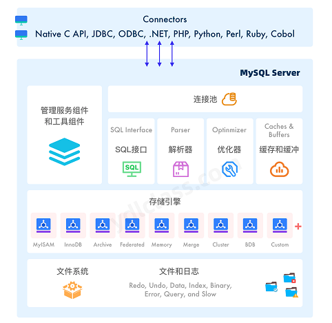

**（1）MySQL 向外提供的交互接口（Connectors）**

Connectors 组件，是 MySQL 向外提供的交互组件，如 java, dotnet, php 等语言可以通过该组件来操作 SQL 语句，实现与 SQL 的交互。通过**客户端/服务器**通信协议与 MySQL 建立连接。MySQL 客户端与服务端的通信方式是 “ 半双工 ”。对于每一个 MySQL 的连接，时刻都有一个线程状态来标识这个连接正在做什么。

**（2）管理服务组件和工具组件(Management Service & Utilities)**

提供 MySQL 的各项服务组件和管理工具，如备份(Backup)，恢复(Recovery)，安全管理(Security)等功能。

**（3）连接池组件(Connection Pool)**

负责监听客户端向 MySQL Server 端的各种请求，接收请求，转发请求到目标模块。每个成功连接 MySQL Server 的客户请求都会被创建或分配一个线程，该线程负责客户端与 MySQL Server 端的通信，接收客户端发送的命令，传递服务端的结果信息等。

**（4）SQL 接口组件(SQL Interface)**

接收用户 SQL 命令，如 DML, DDL 和存储过程等，并将最终结果返回给用户。

**（5）查询分析器组件(Parser)**

首先分析 SQL 命令语法的合法性，并进行抽象语法树解析，如果 sql 有语法错误，会抛出异常信息。

**（6）优化器组件（Optimizer）**

对 SQL 命令按照标准流程进行优化分析，mysql 会按照它认为的最优方式进行优化，选用成本最小的执行计划。

**（7）缓存主件（Caches & Buffers）**

缓存和缓冲组件，这里边的内容我们后边会详细的讲解。

**（8）MySQL 存储引擎**

MySQL 属于关系型数据库，而关系型数据库的存储是以表的形式进行的，对于表的创建，数据的存储，检索，更新等都是由 MySQL 存储引擎完成的。

MySQL 存储引擎在 MySQL 中扮演着重要角色。研究过 SQL Server 和 Oracle 的读者可能很清楚，这两种数据库的存储引擎只有一个，而 MySQL 的存储引擎种类比较多，如 MyIsam 存储引擎，InnoDB 存储引擎和 Memory 存储引擎。

因为 mysql 本身就是开源的，他允许第三方基于 MySQL 骨架，开发适合自己业务需求的存储引擎。从 MySQL 存储引擎种类上来说，可以分为官方存储引擎和第三方存储引擎，比较常用的存储引擎包括 InnoDB 存储引擎，MyIsam 存储引擎和 Momery 存储引擎。

**查询流程大致如下：**

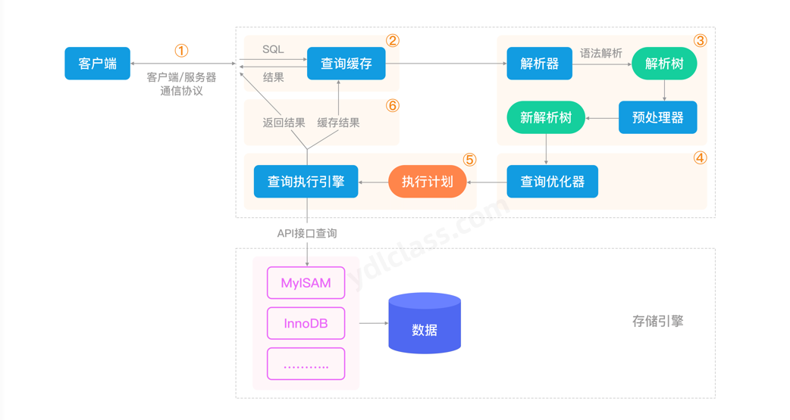

**小问题：MySQL8.0 为什么取消了查询缓存？**

**【MySQL 缓存机制】** 简单的说就是缓存 sql 文本及查询结果，如果运行完全相同的 SQL，服务器直接从缓存中取到结果，而不需要再去解析和执行 SQL。但如果表中任何数据或是结构发生改变，包括 INSERT、UPDATE、DELETE、TRUNCATE、ALTER TABLE、DROP TABLE 或 DROP DATABASE 等，那么使用这个表的所有缓存查询将不再有效，查询缓存中相关条目被清空。缓存是对系统性能优化的重要手段。但是有经验的 DBA 都建议生产环境中把 MySQL Query Cache 关闭。MySQL8.0 更是直接取消了查询缓存，其原因有下：

- MySQL 会对每条接收到的 SELECT 类型的查询进行 hash 计算，然后查找这个查询的缓存结果是否存在。虽然 hash 计算和查找的效率已经足够高了，一条查询语句所带来的开销可以忽略，但一旦涉及到高并发，有成千上万条查询语句时，hash 计算和查找所带来的开销就必须重视了。
- 查询语句的字符大小写、空格或者注释的不同，Query Cache 都会认为是不同的查询（因为他们的 hash 值会不同）。
- 当向某个表写入数据的时候，必须将和这个表相关的所有缓存设置为失效，如果缓存内容很多，则消耗也会很大，可能使系统僵死，因为这个操作是靠全局锁操作来保护的。

当然还有一些其他原因，我们学习的过程中慢慢体会。

### 二、目录结构

#### 1、windows 中的目录

在 mysql 启动的时候，会从【安装目录】加载软件数据，在运行过程中，会从【数据目录】中读取数据。这两个目录我们不要放在一起，避免重新安装软件导致数据丢失。

##### （1） mysql 安装目录

默认安装目录：`C:\Program Files\MySQL`

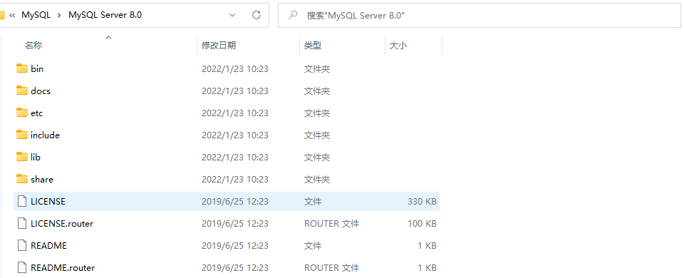

- `bin` 目录：用于放置一些可执行的工具文件，如 `mysql.exe`、`mysqld.exe`、`mysqlshow.exe` 等。
- `include` 目录：用于放置一些头文件，如：`mysql.h`、`mysql_ername.h` 等。
- `lib` 目录：用于放置一系列库文件。

##### （2）数据文件目录（重要）

默认数据目录：`C:\ProgramData\MySQL\MySQL Server 8.0`，注意 ProgramData 是一个隐藏目录，需要设置为【显示隐藏文件】：


**data 目录**：用于放置一些日志文件以及数据库。

我们发现在 data 目录保存的是我们的真是的数据，每个数据库一个文件夹：


每张表又是一个独立的文件，不同的存储引擎的文件存储方式不同，


- my.ini 的部分截图如下：
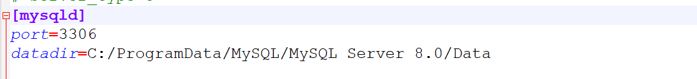

配置文件很重要，所谓配置文件就是配置一下你的 mysql 让他成为你想要的的样子，这里可以配置大量的信息，我们放在文档最后的附录。

#### 2、linux 中的文件目录

linux 的各项目录可以在我们安装时自由选定，我们选取一个云服务器，看看里边的 mysql 的目录结构：

（1）我们可以通过配置文件查看当前 mysql 的一些基本信息，linux 中的配置文件在 `/etc` 目录 ，名称为 `my.cnf`，如下：

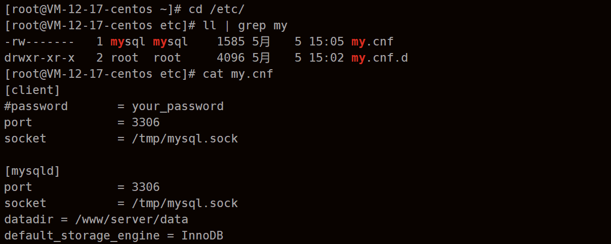

（2）`bin` 目录，一些可执行文件，包括


**bin 目录工具汇总：**

MySQL 服务器端工具

- **mysqld**：SQL 后台保护程序(MySQL 服务器进程)。该程序必须运行之后。客户端才能通过连接服务器端程序访问和操作数据库。
- **mysqld_safe**：MySQL 服务脚本。mysql_safe 增加了一些安全特性，如当出现错误时重启服务器，向错误日志文件写入运行时间信息。
- **mysql.server**：MySQL 服务启动服本。调用 mysqld_safe 来启动 MySQL 服务。
- **mysql_multi**：服务器启动脚本，可以启动或停止系统上安装的多个服务。
- **myiasmchk**：用来描述、检查、优化和维护 MyISAM 表的实用工具。
- **mysqlbu**：MySQL 缺陷报告脚本。它可以用来向 MySQL 邮件系统发送缺陷报告。
- **mysql_install_db**：用于默认权限创建 MySQ 授权表。通常只是在系统上首次安装 MySQL 时执行一次。

MySQL 客户端工具

- **mysql**：交互式输入 SQL 语句或从文件以批处理模式执行 SQL 语句来操作数据库管理系统，就是我们的客户端。
- **mysqldump**：将 MySQL 数据库转储到一个文件，可以用来备份数据库。
- **mysqladmin**：用来检索版本、进程、以及服务器的状态信息。
- **mysqlbinlog**：用于从二进制日志读取语句。在二进制日志文件中包含执行的语句，可用来帮助系统从崩溃中恢复。
- **mysqlcheck**：检查、修复、分析以及优化表的表维护。
- **mysqlhotcopy**：当服务器在运行时，快速备份 MyISAM 或 ISAM 表的工具。
- **mysql import**：使用 load data infile 将文本文件导入相关表的客户程序。
- **perror**：显示系统或 MySQL 错误代码含义的工具。
- **myisampack**：压缩 MyISAP 表，产生更小的只读表。
- **mysaqlaccess**：检查访问主机名、用户名和数据库组合的权限。

mysql 是一个很常用的【mysql 客户端工具】，我们可以使用一下命令连接本机或者远程的 mysql 服务：

```shell
mysql -h 124.220.197.17 -P 3306 -uroot -p
```

> [!TIP]
>
> 我们看到在配置文件中有一个 socket 的配置，socket 即 Unix 域套接字文件，在类 unix 平台，客户端连接 MySQL 服务端的方式有两种，分别是 TCP/IP 方式与 socket 套接字文件方式。Unix 套接字文件连接的速度比 TCP/IP 快，但是只能连接到同一台计算机上的服务器使用。通过设置 socket 变量可配置套接字文件路径及名称，默认值为 /tmp/mysql.sock。本地客户端的连接默认会使用到该文件：
>
> ```shell
> mysql -uroot -p -S /tmp/mysql.sock
> ```
>
> 如果 `mysql.sock` 文件误删的话，就需要重启 mysql 服务
>
> 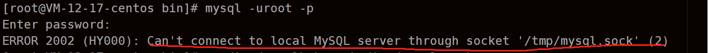

接着给大家介绍一个【数据备份工具】，mysqldump 可以用来实现轻量级的【快速迁移或恢复数据库】。 mysqldump 是将数据表导成 SQL 脚本文件，在不同的 MySQL 版本之间升级时相对比较合适，这也是最常用的备份方法。mysqldump 一般在数据量很小的时候（几个 G）可以用于 备份。当数据量比较大的情况下，就不建议用 mysqldump 工具进行备份了。下边我们简单的使用 mysqldump 工具进行备份数据，命令如下：

```sql
-- 备份一个表
mysqldump -u root -p ydlclass ydl_user  > ~/dump.txt
-- 备份一个数据库
mysqldump -u root -p ydlclass  > ~/dump.txt
-- 备份所有数据库
mysqldump -u root -p --all-databases > dump.txt

备份完成之后使用
```

恢复数据，使用 mysql 指令：

```sql
mysql -u root -p ydl < ~/dump.txt
```

（3）数据库文件，该文件我们同样可以自由指定，该文件夹包含了日志文件，以及我们的数据文件，这些在后边的课程中会详细介绍：


### 三、字符集和排序规则

mysql 支持大量的字符集，但是我们通常使用的是 utf8，`show collation` 命令可以查看 mysql 支持的所有的排序规则和字符集，如下所示部分：

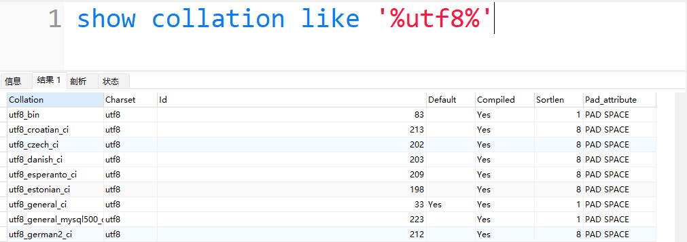

由上图可知，一种字符集对应的很多比较规则。

举个例子：

- **utf8-polish-ci**，表示 utf-8 的字符集的波兰语的比较规则，ci 代表忽略大小写。
- **utf8-general-ci**，就是通用的忽略大小写的 utf8 字符集比较规则。
- **utf8mb4_0900_ai_ci** 中的 0900 指的是 Unicode 9.0 的规范，后边的后缀代表不区分重音也不区分大小写，他是 utf8mb4 字符集一个新的通用排序归则。

| 后缀  | 英文               | 描述                       |
| ----- | ------------------ | -------------------------- |
| \_ai  | accent insensitive | 不区分重音（è，é，ê 和 ë） |
| \_as  | accent sensitive   | 区分重音                   |
| \_ci  | case insensitive   | 不区分大小写               |
| \_cs  | case sensitive     | 区分大小写                 |
| \_bin | binary             | 以二进制的形式进行比较     |

utf8 和 utf8mb4 的区别：

- utf8mb3(utf-8)：使用 1~3 个字节表示字符，utf8 默认就是 utf8mb3。
- utf8mb4：使用 1~4 个字节表示字符，他是 utf8 的超集，甚至可以存储很多【emoji 表情 😀😃😄😁😆】，mysql8.0 已经默认字符集设置为 utf8mb4。

【字符集】和【比较规则】可以作用在全局、数据库、表、甚至是列级别：

全局：

mysql 提供两个变量，进行全局设置。【character_set_server】和【collate_server】对全局的字符集和排序规则进行设置。这两个设置可以在配置文件中修改。

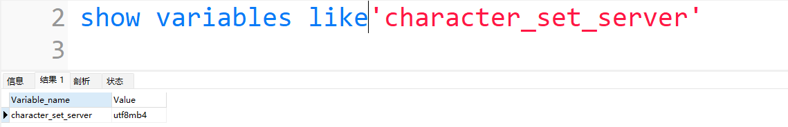

在创建表时，可以对数据库、表、列指定字符集和排序规则：

```sql
-- 指定数据库
create database 数据库名 character set 字符集  collate 比较规则
--
create table 表名(
 列名 列类型
) character set 字符集 collate 比较规则

create table 表名(
 列名 列类型 [character set 字符集] [collate 比较规则]
)
```

### 四、mysql 修改配置的方法

在 mysql 中变量分为全局变量和会话变量，我们一一讲解：

#### 1、全局变量

（1）查看全局变量

我们查看一个全局变量 wait_timeout 的值（这个值代表，客户端和服务器的连接不生交互后多久自动断开连接），语法如下：

```sql
show global variables like '%wait_timeout%';
select @@global.wait_timeout;
```

（2）设置全局变量方法 1，修改配置文件, 然后重启 mysqld：

```sql
# vi /etc/my.cnf
[mysqld]
wait_timeout=10000
# service mysqld restart
```

（3）设置全局变量方法 2（推荐），在命令行里通过 SET 来设置：

如果要修改全局变量, 必须要显示指定"GLOBAL"或者"@@global."，同时必须要有 SUPER 权限.：

```sql
set global wait_timeout=10000;
set @@global.wait_timeout=10000;
```

然后查看设置是否成功:

```sql
show global variables like 'wait_timeout'
select @@global.wait_timeout
```

#### 2、当前会话的变量

如果要修改会话变量值, 可以指定"SESSION"或者"@@session."或者"@@"或者"LOCAL"或者"@@local.", 或者什么都不使用。语法语法：

```sql
mysql> set wait_timeout=10000;
mysql> set session wait_timeout=10000;
mysql> set local wait_timeout=10000;
mysql> set @@wait_timeout=10000;
mysql> set @@session.wait_timeout=10000;
mysql> set @@local.wait_timeout=10000;
```

然后查看设置是否成功:

```sql
mysql> select @@wait_timeout;
mysql> select @@session.wait_timeout;
mysql> select @@local.wait_timeout;
mysql> show variables like 'wait_timeout';
mysql> show local variables like 'wait_timeout';
mysql> show session variables like 'wait_timeout';
```

### 五、内置数据库

- **mysql**：这个库很重要，他是 mysql 的核心数据库，负责存储数据库的用户、权限设置、关键字等 mysql 自己需要使用，控制和管理的信息。
- **information_schema**：这个数据库维护了数据库其他表的一些描述性信息，也称为元数据。比如，当前有哪些表，哪些视图，哪些触发器，哪些列等。
- **performation_schema**：这个数据库用来存储 mysql 服务器运行过程中的一些状态信息，是做性能监控的。比如最近执行了什么 sql 语句，内存使用情况等
- **sys**：结合 **information_schema** 和 **performation_schema** 的数据，能更方便的了解 mysql 服务器的性能信息。

## 第二章 I/O 和存储

**谈谈性能**：mysql 通常决定了一个系统的性能瓶颈，执行一条 sql 的成本主要在于以下两个方面：

- I/O 成本：我们经常使用的 MyIsam 和 InnoDB 存储引擎都是将数据存储在磁盘上，当查询表中的记录时，需要先将数据加载到内存中，然后进行操作，这个从磁盘到内存的加载过程损耗的时间成为 I/O 成本。
- CPU 成本：读取记录以及检测记录是否满足对应的搜索条件、对结果集进行排序等这些操作所消耗的时间称之为 CPU 成本。

本章节我们聊一聊 I/O 成本。

### 一、IO 成本

我们想想要了解 mysql 的 I/O 成本，就需要知道计算机的磁盘是怎么工作的。

#### 1、磁盘的结构


##### （1）盘片、片面和磁头

硬盘中一般会有多个【盘片】组成，每个盘片包含【两个面】，每个盘面都对应的有一个【读/写磁头】。受到硬盘整体体积和生产成本的限制，盘片数量都受到限制，一般都在 5 片以内。盘片的编号【自下向上】从 0 开始，如最下边的盘片有 0 面和 1 面，再上一个盘片就编号为 2 面和 3 面。

结构示意图，如图：

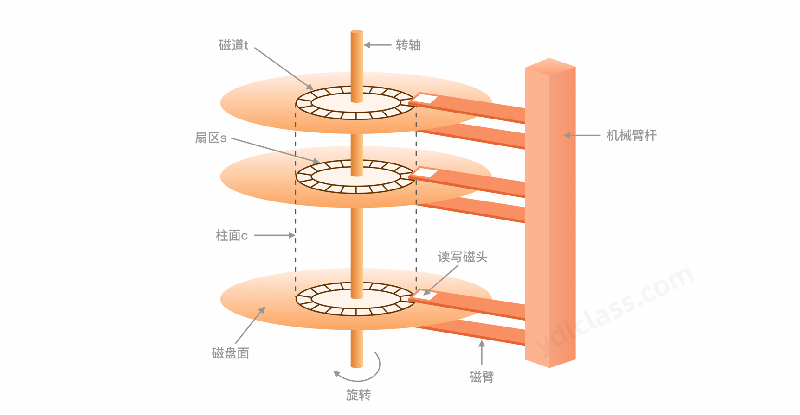

##### （2）扇区和磁道

下图显示的是一个盘面，盘面中一圈圈灰色同心圆为一条条磁道，从圆心向外画直线，可以将磁道划分为若干个弧段，每个磁道上一个弧段被称之为一个扇区（图践绿色部分）。扇区是磁盘的最小组成单元，通常是 512 字节。（由于不断提高磁盘的大小，部分厂商设定每个扇区的大小是 4096 字节）；


##### （3）磁头和柱面

硬盘通常由重叠的一组盘片构成，每个盘面都被划分为数目相等的磁道，并从外缘的“0”开始编号，具有相同编号的磁道形成一个圆柱，称之为磁盘的柱面。磁盘的柱面数与一个盘面上的磁道数是相等的。由于每个盘面都有自己的磁头，因此，盘面数等于总的磁头数。 如下图

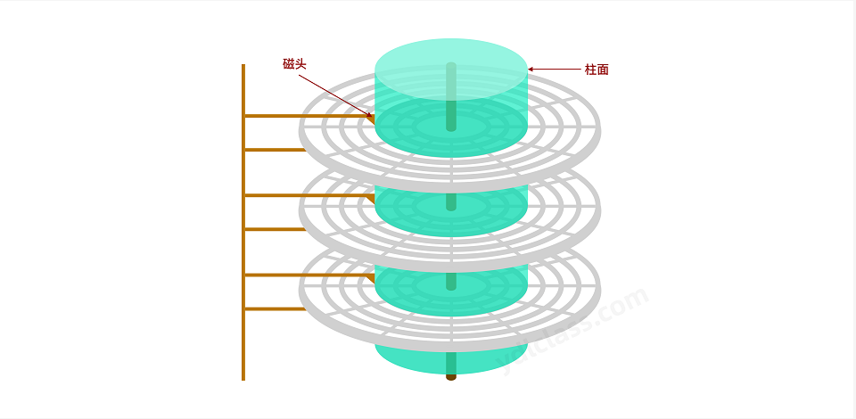

#### 2、磁盘容量计算

存储容量 ＝ 磁头数 × 磁道(柱面)数 × 每道扇区数 × 每扇区字节数

图 3 中磁盘是一个 3 个圆盘 6 个磁头，7 个柱面（每个盘片 7 个磁道） 的磁盘，图 3 中每条磁道有 12 个扇区，所以此磁盘的容量为：

存储容量 $6 * 7 * 12 * 512 = 258048$

> [!TIP]
>
> 有些【古老硬盘】每个磁道的扇区数一样，外圈的密度小，内圈的密度大，每圈可存储的数据量是一样的。现在的硬盘数据的密度都一致，这样磁道的周长越长，扇区就越多，存储的数据量就越大。

#### 3、磁盘读取响应时间

1. 寻道时间：磁头从开始移动到数据所在磁道所需要的时间，寻道时间越短，I/O 操作越快，目前磁盘的平均寻道时间一般在 3－15ms，一般都在 10ms 左右。
2. 旋转延迟：盘片旋转将请求数据所在扇区移至读写磁头下方所需要的时间，旋转延迟取决于磁盘转速。普通硬盘一般都是 7200rpm，大概一圈 8ms，慢的 5400rpm。
3. 数据传输时间：完成传输所请求的数据所需要的时间。
   小结一下：从上面的指标来看、其实最重要的、或者说、我们最关心的应该只有两个：寻道时间；旋转延迟。

读写一次磁盘信息所需的时间可分解为：寻道时间、延迟时间、传输时间。为提高磁盘传输效率，软件程序应着重考虑减少寻道时间和延迟时间。

下图是计算机硬件延迟的对比图，供大家参考：


#### 4、交换单位

【块】是操作系统中最小的逻辑存储单位，他是虚拟出来的一个单位。操作系统与磁盘打交道的最小单位是磁盘块。每个块可以包括 2、4、8、16、32、64…2 的 n 次方个扇区。

**为什么存在磁盘块？**

- 读取方便：由于扇区的容量比较小，数目众多，在寻址时比较困难，所以操作系统就将相邻的扇区组合在一起，形成一个块，再对块进行整体的操作。
- 分离对底层的依赖：操作系统忽略对底层物理存储结构的设计。通过虚拟出来磁盘块的概念，在系统中认为块是最小的单位。

**扇区、块/簇、page 的关系：**

1. 扇区： 硬盘的最小读写单元
2. 块/簇： 是操作系统针对硬盘读写的最小单元
3. page： 是内存与操作系统之间操作的最小单元

$$
\textbf{扇区} \leq \textbf{块/簇} \leq \textbf{page}
$$

#### 5、局部性原理与磁盘预读

由于存储介质的特性，磁盘本身存取就【比主存慢很多】，再加上机械运动耗费，磁盘的存取速度往往是主存的【十万分之一】，因此为了提高效率，要【尽量减少磁盘 I/O】。也是因为这个原因，磁盘往往不是严格的【按需读取】，而是每次都会预读，即使只需要一个字节，磁盘也会从这个位置开始，顺序向后读取一定长度的数据放入内存。这样做的理论依据是计算机科学中著名的**局部性原理**。

**局部性原理（空间局部性）**，当一个数据被用到时，其附近的数据也通常会马上被使用，程序运行期间所需要的数据通常比较集中。

由于磁盘【顺序读取】的效率很高（不需要寻道时间，只需很少的旋转时间），因此对于具有局部性的程序来说，预读可以提高 I/O 效率。

预读的长度一般为【页（page）】的整倍数（在许多操作系统中，页得大小通常为 4k）。当程序要读取的数据不在主存中时，会触发一个缺页异常，此时系统会向磁盘发出读盘信号，磁盘会找到数据的起始位置并向后连续读取一页或几页载入内存中，然后异常返回，程序继续运行。

### 二、数据存储

对于 mysql 而言，数据是存储在文件系统中的，不同的存储存储引擎会有不同的文件格式和组织形式，我们还是以 InnoDB 为例给大家讲解。

#### 1、InnoDB 数据存储

对于 InnoDB 而言，数据是存储在表空间（文件空间 file space）内的，表空间是一个抽象的概念，他对应着硬盘上的一个或多个文件，如下图：


表空间存储数据的单位是【页】，我们可以这样类比，一个表空间就是个大大的本子，本子里是一页页的数据（innodb 是以页为单位进行数据存储的），常用页面类型有很多，不同类型的页面可以存放【不同类型的数据】，这里不展开讲解，暂时统称为【数据页】、他的通用部分如下，每一页大概占用 16k 的空间：


- file header：记录页面的一些通用信息，比如当前页的校验和、页号、上页号、下页号、所属表空间等。
- file trailer：主要的工作是检验页是否完整。
- 表空间中的每一个页，都有一个页号（File_PAGE_OFFSET），我们可以通过这个页号在表空间快速定位到指定的页面。这个页号由 4 个字节组成，也就是 32 位，所有最多能存放 2 的 32 次方页，如果按照一页 16k 计算，一个表空间最大支持【64TB】的数据。整体的排列中页是连续的，但是页有上下指针，不连续的页也能组成链表。

表空间的示意图如下：

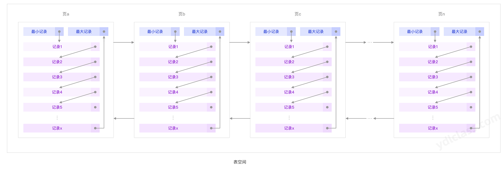

表空间可以分为系统表空间、独立表空间等：

##### （1）系统表空间（The System Tablespace）

- 系统表空间包含了很多【公共数据】，比如 InnoDB 的数据字典，回滚信息、系统事物信息、二次写缓冲等，老版本的 mysql 表中的数据也会存储在系统表空间。
- 系统表空间是一个共享的表空间因为它是被多个表共享的。
- 该空间的数据文件通过参数【innodb_data_file_path】控制，默认值是 `ibdata1:12M:autoextend`（文件名为 ibdata1、12MB、自动扩展）。
- 当然系统表空间也可以通过配置，修改文件的名称和个数。文件如下图：


相关变量的设置：

```sql
-- 如果1代表开启，0代表关闭
show variables like'innodb_file_per_table'
-- 设置对应的变量
set global innodb_file_per_table=0;
-- 查看系统表空间的配置
show variables like "innodb_data_file_path";
-- 配置文件的配置
innodb_data_file_path=data1:512M;data2:512M:autoextend
```

##### （2）独立表空间（File-Per-Table Tablespaces）

- 独立表空间是默认开启的，在 5.6.6 以后，Innodb 不在默认将各个表的数据存储在【系统表空间】当中，而是会为每一个表建立一个独立表空间，innodb 存储引擎的独立表空间为【.ibd】文件。
- 如果启用了【innodb_file_per_table】参数，需要注意的是每张表的表空间内存放的只是【数据】、【索引】和【插入缓冲 Bitmap 页】，其他数据如：回滚信息、系统事物信息、二次写缓冲（Double write buffer）等还是放在原来的系统表空间内。
- 同时说明了一个问题：即使启用了【innodb_file_per_table】参数，系统表空间还是会不断的增加其大小的。


##### （3）其他类型的表空间

除了以上两种表空间，，innodb 还提供了很多其他类型的表空间，比如通用表空间，undolog 表空间、临时表空间等，这里不在赘述。

> [!TiP]
>
> **MyIsam 数据存储**
>
> MyIsam 没有表空间的概念，他会在目录中产生 2 个文件【.MYD】（数据文件）、【 .MYI】（索引文件）三个文件。
>
> 

---

> [!CAUTION]
>
> 在 5.7 以前【数据文件】和【表信息文件】是分开的，相互独立的。会多一个【.frm】文件，8.0 之后进行了合并。

#### 2、组织结构

- 区（extent）：每一个表空间保存了大量的页，为了更好的管理这些页面，Innodb 提出了【区】的概念，对于 16k 的页，连续 64 个页就是一个区，大概 1M 的空间，每一个表空间都是由若干个连续的区组成的，每 256 个区被划分为一组。
- 段（Segment）：分为索引段，数据段，回滚段等后边会将，段是为了区分不同的数据类型，相同的段存的数据类型是一致的。一个段包含 256 个区(256M 大小)。

innodb 表空间结构如下图所示：

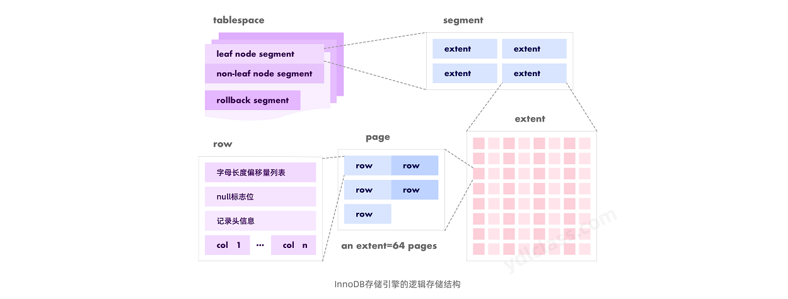

#### 2、Row Format(行记录格式)

- 一个表的【行记录格式】决定表中行的【物理存储模式】，决定了【DQL】和【DML】的操作性能。越多的行被匹配进独立的磁盘页，sql 的性能会更好一些，需要的缓存及 io 操作就越少。
- 一条完整的信息记录分为：【记录的额外信息】和【记录的真实数据】两大部分，就如同一箱苹果里的苹果分为包装和苹果一样。
- 我们可以通过命令 `SHOW TABLE STATUS LIKE 'table_name'` 来查看当前表使用的行格式，其中 row_format 就代表了当前使用的行记录结构类型。

指定行格式的语法如下：

```sql
-- 创建数据表时,显示指定行格式
CREATE TABLE 表名 (列的信息) ROW_FORMAT=行格式名称;
-- 创建数据表时,修改行格式
ALTER TABLE 表名 ROW_FORMAT=行格式名称;

-- 具体如下：
CREATE TABLE `ydl_user`  (
  `user_id` bigint NOT NULL AUTO_INCREMENT COMMENT '用户ID',
  `user_name` varchar(30) CHARACTER SET utf8mb4 COLLATE utf8mb4_0900_ai_ci NOT NULL COMMENT '用户账号',
  ....
  PRIMARY KEY (`user_id`) USING BTREE
) ROW_FORMAT = DYNAMIC;
```

##### **（1）COMPACT**

【compact 行记录】是在 MySQL 5.0 时被引入的，其设计目标是能高效存放数据。Compact 行记录以如下方式进行存储：


- 第一个部分是一个非 NULL【变长字段长度列表】。这个其实很好理解，我们的数据类型除了定长的 char、int 还有不定长的如 varchar、text 等，变长列的真实长度就保存在这个部分，他是按照列的顺序【逆序放置】的。当列的长度小于 255 字节，如（varchar(50)），用 1 字节表示；若大于 255 个字节（varchar(600)），用 2 个字节表示，这其实也就说明了为什么**varchar 的最大长度是 65536**。
- 第二个部分是【NULL 标志位】，他指示了当前行数据中哪些为 null 值，用一个 bitmap 表示。举一个例子：假如该标志位为 06(二进制：00000110)则表示第二三列（可以为空的列）的数据为 NULL。需要注意的是，NULL 值标志位仅仅针对可以为【NULL 的字段】，如果某个字段被定义为 not null，那么这个字段就不会进入 NULL 值标志位的 BitMap 中，这样可以节省很多空间，NULL 值标志位也是逆序排列，占用空间按照字节数高位补零，如有九个字段可以为空（00000001 01010101）。
- 第三部分为记录头信息（record header），固定占用 5 个字节（40 位），每位的含义见下表：

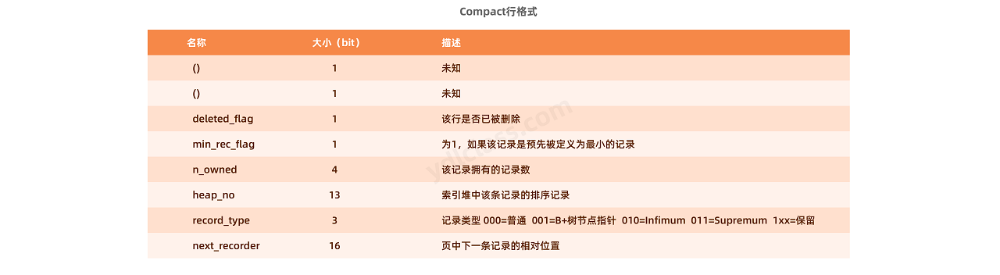

- 第四部分就是实际存储的每个列的数据了，需要特别注意的是，NULL 不占该部分任何数据，即 NULL 除了占有 NULL 标志位，实际存储不占有任何空间。Innodb 存储变长列（VARCHAR, VARBINARY, BLOB, TEXT）的前 768 字节，剩下的部分存储在溢出页中。固定长度列，超过 768 字节的视为变长列。内部存储前 768 字节，20 字节指针存储列的溢出页的地址，所以长度为 768+20 字节。

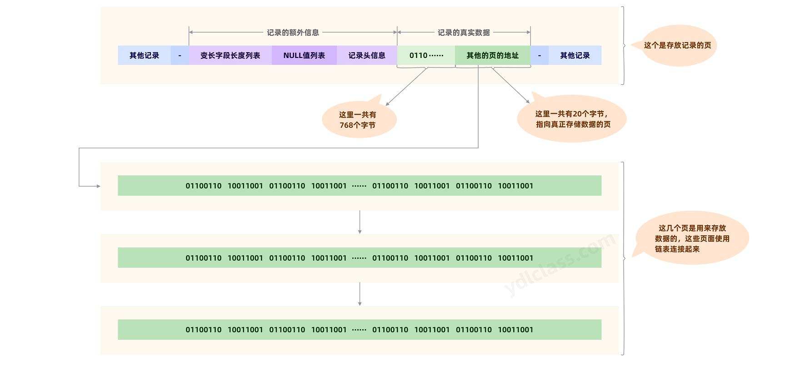

> [!WARNING]
>
> 另外有一点需要注意的是，每行数据除了用户定义的列外，**还有两个隐藏列，事务 ID 列和回滚指针列**，分别为 6 个字节和 7 个字节的大小。若 InnoDB 表没有定义 Primary Key，每行还会增加一个【6 字节的 RowID 列】。

**例子**：我们不妨举一个例子，看看硬盘的存储格式，以下表为准：

```sql
create table test (
　　t1 varchar(10),
　　t2 varchar(10),
　　t3 char(10),
　　t4 varchar(10)
) engine=innodb row_format=compact;

insert into row_test values('a','bb','bb','ccc');
insert into row_test values('d','ee','ee','fff');
insert into row_test values('d',NULL,NULL,'fff');
```

节选对应的【真实的表空间】中的的二进制结构表示：

```bash
03 02 01 00 00 00 10 00
2c 00 00 00 00 2b 68 00  00 00 00 06 05 80 00 00
00 32 01 10 61 62 62 62  62 20 20 20 20 20 20 20
20 63 63 63 03 02 01 00  00 00 18 00 2b 00 00 00
00 02 01 00 00 00 00 0f  62 c9 00 00 01 b2 01 10
64 65 65 65 65 20 20 20  20 20 20 20 20 66 66 66
03 01 06 00 00 20 ff 98  00 00 00 00 02 02 00 00
00 00 0f 67 cc 00 00 01  b6 01 10 64 66 66 66
```

第一行整理如下，需要注意，我们有三个变长列 varchar：

```sql
03 02 01 // 变长字段长度列表，逆序，t4列长度为3，t2列长度为2，t1列长度为1
00 // NULL标志位，第一行没有NULL值
00 00 10 00 2c // 记录头信息，固定5字节长度
00 00 00 00 2b 68 // RowID我们建的表没有主键，因此会有RowID，固定6字节长度
00 00 00 00 06 05 // 事务ID，固定6个字节
80 00 00 00 32 01 10 // 回滚指针，固定7个字节
61 // t1数据'a'
62 62 // t2'bb'
62 62 20 20 20 20 20 20 20 20 // t3数据'bb'  Ox20十进制是32对应ascii码是空字符
63 63 63 // t4数据'ccc'
```

第二行整理如下：

```shell
03 02 01 // 变长字段长度列表，逆序，t4列长度为3，t2列长度为2，t1列长度为1
00 // NULL标志位，第二行没有NULL值
00 00 18 00 2b // 记录头信息，固定5字节长度
00 00 00 00 02 01 // RowID我们建的表没有主键，因此会有RowID，固定6字节长度
00 00 00 00 0f 62 // 事务ID，固定6个字节
c9 00 00 01 b2 01 10 // 回滚指针，固定7个字节
64 // t1数据'd'
65 65 // t2数据'ee'
65 65 20 20 20 20 20 20 20 20 // t3数据'ee'
66 66 66 // t4数据'fff'
```

第三行整理如下：

```sql
03 01 // 变长字段长度列表，逆序，t4列长度为3，t1列长度为1
06 // 00000110 NULL标志位，t2和t3列为空
00 00 20 ff 98  // 记录头信息，固定5字节长度
00 00 00 00 02 02 // RowID我们建的表没有主键，因此会有RowID，固定6字节长度
00 00 00 00 0f 67 // 事务ID，固定6个字节
cc 00 00 01 b6 01 10 // 回滚指针，固定7个字节
64 // t1数据'd'
66 66 66 // t4数据'fff'
```

##### （2）REDUNDANT

【Redundant】是 MySQL 5.0 版本之前 InnoDB 的行记录存储方式。Redundant 行记录以如下方式存储：


从上图可以看到，Redundant 行格式如下：

1. 第一个部分保存了【字段长度偏移列表】，这个部分保存了该行数据所有列，包括隐藏列的长度偏移量。举一个例子说明一下偏移，假如第一个字段长度为 x，第二个字段长度为 y，那么列表中第一个字段就是 x，第二个字段就是 x+y。这个偏移列表是按照列的顺序【逆序排列】。
2. 第二个部分为记录头信息【record header】，Redundant 行格式固定占用 6 个字节（48 位），每位的含义如下图：有几个标志位我们可以注意一下，n_fields 值代表一行中列的数量，占用 10 位，这也很好地解释了为什么 MySQL【一个行支持最多的列为 1023】。

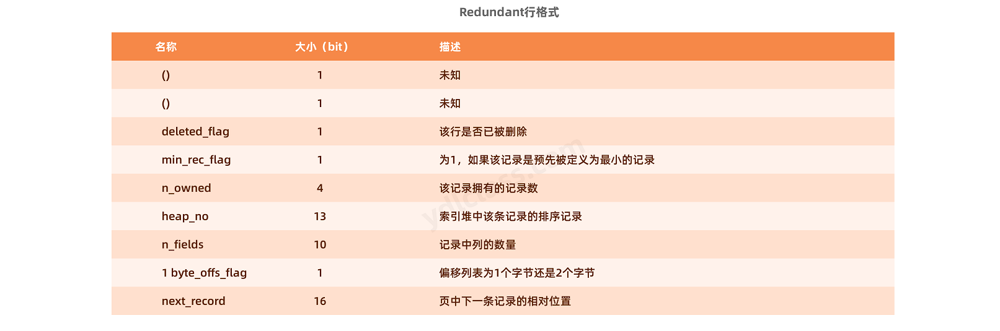

3.第三个部分就是实际存储的每个列的数据了。

**null 值的存储**，在【字段长度列表】的每个字段长度最高位标记 1 表示这个字段为 NULL。

- 对于一字节存储，通过【最高位标记字段】判断是否为 NULL，如果为 NULL，则最高位为 1，否则为 0。剩下的 7 位用来存储数据，所以最多是 127。
- 对于两字节存储，通过【最高位标记字段】判断是否为 NULL，第二位标记这条记录是否在同一页，如果在则为 0，如果不在则为 1，这其实就涉及到了后面要说的溢出页。剩下的 14 位表示长度，所以最多是 16383。
- 在这种类型的行格式中，无论字段是否为 NULL，或者长度是多少，**char(M) 都会占用 M \* 字节编码最大长度那么多字节**。为 NULL 的话，填充的是 0x00，不为 NULL，长度不够的情况下，末尾补充 0x20。 对于 varchar 来说，NULL 还是不占用空间的。

**小结：**

compact 格式比 redundant 存储空间大约减少 20%。如果受限于 cache 命中和磁盘速度，compact 格式会快一些，若受限于 CPU 速度，compact 格式会慢一些。

##### （3）DYNAMIC

InnoDB Plugin 引入了两种新的文件格式（file format，可以理解为新的页格式），对于以前支持的 Compact 和 Redundant 格式将其称为 Antelope 文件格式，新的文件格式称为 Barracuda。Barracuda 文件格式下拥有两种新的行记录格式 Compressed 和 Dynamic 两种。

新的两种格式对于存放 BLOB 的数据采用了完全的行溢出的方式，在数据页中只存放 20 个字节的指针，实际的数据都存放在 BLOB Page 中，而之前的 Compact 和 Redundant 两种格式会存放 768 个前缀字节。mysql8.0 默认此格式。


##### （4）COMPRESSED

基于 dynamic 格式，支持表和索引数据压缩。compressed 行格式采用 dynamic 相同的页外存储细节，同时，存储在其中的行数据会以 zlib 的算法进行压缩，因此对于 BLOB、TEXT、VARCHAR 这类大长度类型的数据能进行非常有效的存储。

## 第三章 缓冲池 buffer pool

我们在之前的章节中已经介绍过了，innodb 中的数据是以【页】的形式存储在磁盘上的表空间内，但是我们一再强调过，【磁盘的速度】和【内存】相比简直不值一提，而【内存的速度】和【cpu 的速度】同样不可同日而语，对于数据库而言，I/O 成本永远是不可忽略的一项成本，我们不妨思考下面的小问题：

**小问题：一个全表扫描会产生有多少次磁盘 I/O?**

```sql
select * from user where id between 10 and 1000;
```

- 访问 id 为 1 的数据，需要访问当前表空间的第一行数据，一次 I/O
- 访问 id 为 2 的数据，需要访问当前表空间的第二行数据，两次 I/O
- 访问 id 为 3 的数据，需要访问当前表空间的第三行数据，三次 I/O......

我们发现 id 为 1，2，3...的数据都在同一个【数据页】，这会导致一个严重的问题，一次简单的查询，会访问【同一个页很多次】，可能产生很几百次 I/O 操作。所以为了解决快如闪电的【cpu】，和慢如蜗牛的【磁盘】之间的矛盾，innodb 设计了 buffer pool，有了缓存之后我们的执行过程如下：

- 访问 id 为 1 的数据，需要访问当前表空间的第一行数据，缓存当前页，一次 I/O
- 访问 id 为 2 的数据，需要访问当前表空间的第二行数据，从缓存获取，无需 I/O
- 访问 id 为 3 的数据，需要访问当前表空间的第三行数据，从缓存获取，无需 I/O......

Innodb 引擎会在 mysql 启动的时候，向操作系统申请一块连续的空间当做 buffer pool，空间的大小由变量 `innodb_buffer_pool_size` 确定，我这台电脑他使用了 8G，你的可能是 128M。（单位是 kb）

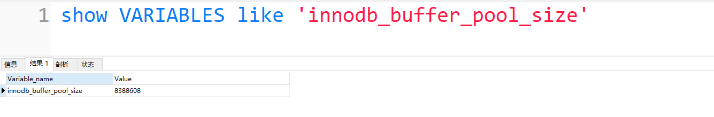

这个缓冲区的大小可以结合自己服务器的性能而定，这就明白了内存大的好处了吧。

### 一、内部结构

整个 buffer pool 是由缓冲页和控制块组成的：

- **缓冲页**：buffer pool 中存放的【数据页】我们称之为【缓冲页】，和磁盘上的数据页是一一对应的，都是 16KB，缓冲页的数据，是从磁盘上加载到 buffer pool 当中的一个完整页。
- **控制块**：他是缓冲页【描述信息】，这一块区域保存的是数据页所属的表空间号，数据页编号，数据页地址，以及一些链表相关的节点信息等，每个控制块大小是缓存页的 5%左右，大约是 800 个字节。

其内部结构如下，buffer pool 的前一部分存储【控制块】，后一部分存储【缓冲页】，如果中间有未被利用的空间，就叫他【内存碎片】吧：

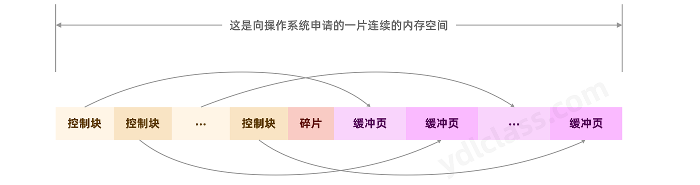

> [!TIP]
>
> **buffer pool 的初始化**
>
> 数据库会在启动的时候，按照配置中的 Buffer Pool 大小，去向操作系统申请一块内存，作为 Buffer Pool 的内存区域，然后会按照默认的缓存页的的大小【16KB】以及对应的【800 个字节左右】的【控制块】的大小，在 Buffer Pool 中划分出一个一个的缓存页和一个一个与其对应的描述数据（控制块）。此时的 buffer pool 像一个干净的本子，没有书写任何内容。

### 二、free 链

刚初始化的 buffer pool，内存中都是【空白的缓冲页】，但是随着时间的推移，程序在执行过程中会不断的有新的页被缓存起来，那怎么来判断哪些缓冲页是【闲置状态】，可以被使用呢，此时就需要【控制块来进行标记和管理】了。innodb 在设计之初，会将所有【空闲的缓冲页】所对应的【控制块】作为一个个的节点，形成一个链表，这个链表就是 free 链，翻译过来就是空闲链表，如下图：

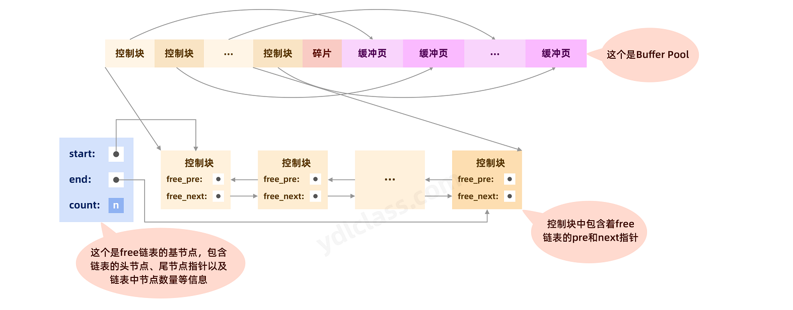

由上图可知，free 链表是一个双向链表，链表上除了控制块以外，还有一个基础节点，存储了 free 链有多少个描述信息块，也就是有多少个空闲的缓存页，以及指向链表头尾的指针。

当我们加载数据的时候，会从 free 链中找到空闲的缓存页，把数据页的【表空间号和数据页】号写入【控制块】。

加载数据到缓存页后，会把缓存页对应的控制块从 free 链表中移除。

#### 1、怎么知道数据页是否被缓存？

我们已经有了 free 链表用来【保存空闲的页】，但是，当下一次访问时，要如何知道当前要访问的页是不是已经被缓存了，最直观的思路就是将 buffer poll 里的缓存数据【全部遍历一遍】。显然，这要做并不合理，本来设计 buffer pool 是为了提升效率，如果有人将 buffer pool 配置的很大，比如 32 个 G，那扫描这一片区域的功夫都可以喝一杯茶了，反而成了累赘。

事实上，使用【表空间号+页号】就可以确定一个唯一的页，那么我们能不能设计一个 hash 表，使用【表空间号+页】号当做 key，使用【控制块地址】做 value，每次查询的时候只需要通过 key 进行查找即可，大家都知道 hash 的时间复杂度是 O(1)，这样就能迅速定位缓存的页。（和 hashmap 很像）

结合我们的 free 链表，查询/缓存一个页的流程大致如下：

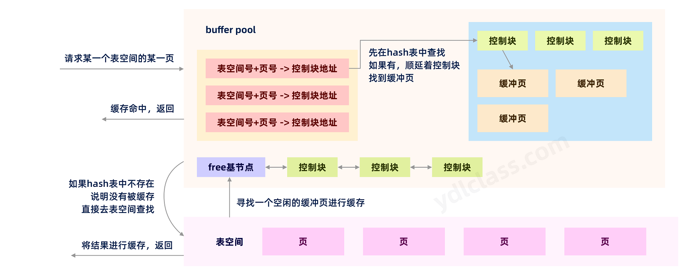

### 三、flush 链表

#### 1、脏页

在 sql 的执行过程中，无论是增删改查，都是优先在 buffer pool 中进行的，这样可以极大的保证执行效率。但是同样会有一个问题，假如我们对缓存页的某些数据进行了修改（执行了一条 update 语句），就会导致 buffer pool 中的缓冲页和磁盘的数据页【数据不一致】，那么此时的缓冲页就称之为【脏页】。当然，这也就说明了，脏页的数据是要刷到磁盘上的。

我在看极客时间的专栏时，有一位老师的比喻很不错，在古代的酒楼中记账是个技术活，可能经常会有赊账行为。每次记账、赊账都会将相关记录记录在账本之上。但是当饭点高峰期，记账数据巨大，张三仗着自己的岳父是县令大人又来赊账一笔，掌柜一时间太忙没有时间翻阅账本，查看张三的历史记录，所以单独使用一个小黑板，记了一笔张三今天赊账 10 两银子，一会李四来赊账，再在上面记上一笔。等过了饭点，有时间了，再将记录誊抄至账本，计算张三和李四的总赊账额度，其实就是这么个原理。

#### 2、链表结构

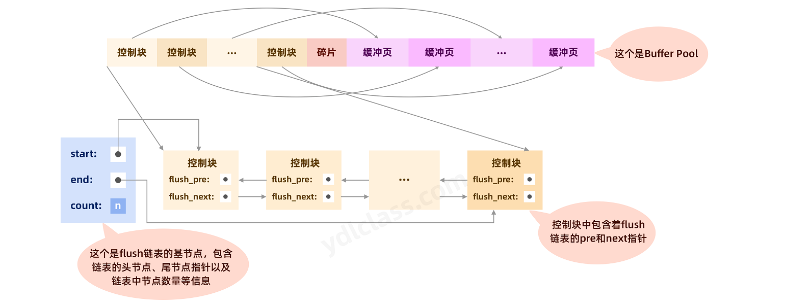

- flush 链表同样是一个双向链表，链表结点是被【修改过的缓存页】的控制块。
- 和 free 链表一样，flush 链表也有一个基础结点，链接首尾结点，并存储了有多少个控制块。

#### 3、刷盘时机

后台会有专门的线程每隔一段时间就把 flush 链表中的脏页刷入磁盘中，刷新的速率取决与当前系统是否繁忙。在这样的机制下，万一系统奔溃，是会产生数据不一致的问题的，没有刷入磁盘的数据就会丢失，而 mysql 通过日志系统解决了这个问题，以后的章节会详细讲解。

### 四、LRU 链表

#### 1、概述

内存是有限的，buffer pool 更是有限的，缓存只是数据的中转站，当我们的数据量很大以后，buffer pool 其实是仅仅能容纳很少一部分数据，所以 buffer pool 的容量很有可能被使用殆尽，如果此时我们还想继续缓存数据页那该怎么办？

合理的做法就是，当需要更多的空间缓存【新的数据页】的时候，我们将最近使用最少的【缓冲页淘汰掉】就可以了，这就是典型的 LRU（Least Recently Used）算法，我们在讲 java 的时候也手动实现过基于 linkedhashmap 的 LRU 算法。对于 innodb 而言，则是通过【LRU 链表】来完成此功能的，他的结构和上边讲的 free 链表、flush 链表基本相同，只是负责的功能不同而已。

于是，一个简单的思路诞生了，当客户端访问一条数据时，会加载对应的数据页到 buffer pool，并会将缓冲页对应的控制块放置到【LRU 链表的首位】。一旦 buffer pool 被占满，则从链表的末端开始淘汰数据，这是最简单的实现。

#### 2、优化

但是，实际的在使用场景中，我们需要对原有的 LRU 链表进行优化，因为他在一下场景可能会出现一些问题：

- 数据页预读：我们在讲多线程的时候是讲过【预读性原理】（当一个应用在访问一个数据时，很有可能会继续访问和他相邻的数据），cpu 的高级缓冲区读取主存的数据也不是一个字节一个字节的读取，而是一下子会读取一个【缓存行】。同理，innodb 从磁盘读取数据，也不一定是一页页读取，当 mysql 读取当前需要的页时，如果觉得后续操作会使用【附近的页】，就会将他们一起缓存到 buffer pool，这样的作用是为了提升效率。但是，这也会导致大量的使用频率并不高的数据放置在 LRU 链表头部，反而将一些真正的【热点数据】淘汰。
- 全表扫描：一条【`select \* from user`】 语句，会直接将一张表的全表数据缓存，并全部放在 LRU 链表头部，一样会淘汰很多热点数据。

所以，innodb 对该链表进行了优化，将【LRU 链表】分成了两个区域，分为【热数据区】和【冷数据区】，默认情况下冷数据区占了总链表的 37%，机构如下：

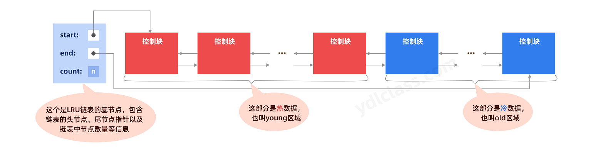

> [!TIP]
>
> 一个 select 语句可能会多次访问一个页，因为你有【很多数据是保存在同一个页内】的。对于一个全表扫描的语句，每访问一条数据，就会访问一次相关的页，所以缓存确实能极大的提升效率：
>
> - 对于预读的数据页，会在第一次访问时放入 old 区域，如果在 sql 执行的过程中访问相邻数据时，再次访问访问到该数据页，则把他加入如热数据区。
> - 【大表的全表扫描】是个使用频率很低的操作（小表怎么操作都无所谓），但是如果按照上边的操作，首先全表数据会被放在【old 区】，全表扫描必然会因为访问相邻数据而产生第二次、第三次、甚至数百次的访问，也就以为着这些页面会被全部放在 young 区。为了解决这个问题，INnodb 提供了这样一个参数【innodb_old_blocks_time】，默认是 1s，他的执行流程大致如下：1、页被首次访问时会记录访问的时间戳。2、以后访问都和首次访问的时间进行对比，如果时间大于 1s，就讲当前页放入 yong 区。3、一个 sql 的扫描一个页的时间，哪怕在慢也不会低于 1s，这样就解决了一个全表扫秒而导致全表成为热点数据的问题。
>
> 也就意味着，热点数据要求首次访问时间和最后一次访问时间的时间差不能低于 1s。
>
> 
>
> 使用以下的语句，可以查看 innodb 当前的状态：
>
> ```sql
> show engine innodb status;
>
> Total large memory allocated 8585216                  # 为innodb 分配的总内存数(byte)
> Dictionary memory allocated 446370                    #为innodb数据字典分配的内存数(byte)
> Buffer pool size   512                                #innodb_buffer_pool的大小(page)
> Free buffers       101                                #innodb_buffer_pool lru列表中的空闲页面数量
> Database pages     277                                #innodb_buffer_pool lru列表中的非空闲页面数
> Old database pages 0                                  #innodb_buffer_pool old子列表的页面数量
> Modified db pages  273                                #innodb_buffer_pool 中脏页的数量
> Pending reads      1                                  #挂起读的数量
> Pending writes: LRU 0, flush list 0, single page 0    #挂起写的数量
> Pages made young 0, not young 0
> 0.00 youngs/s, 0.00 non-youngs/s
> Pages read 8002054, created 766955, written 4652116
> 0.00 reads/s, 0.00 creates/s, 0.00 writes/s
> Buffer pool hit rate 993 / 1000, young-making rate 0 / 1000 not 0 / 1000
> Pages read ahead 0.00/s, evicted without access 0.00/s, Random read ahead 0.00/s
> LRU len: 277, unzip_LRU len: 0
> I/O sum[22009]:cur[1940], unzip sum[0]:cur[0]
> ```

## 第四章 MySQL 临时表

### 一、临时表简介

MySQL 临时表在很多场景中都会用到，比如用户自己创建的临时表用于【保存临时数据】，以及 MySQL 内部在执行【复杂 SQL】时，需要借助临时表进行【分组、排序、去重】等操作，临时表具有一下几个特点：

1）临时表不能通过 `show tables` 查看，在服务器重启之后，所有的临时表将全部被销毁。

2）临时表是每个进程独享的，当前进程（客户端）创建的临时表，其他进程（客户端）是查不到临时表里面的数据的，所以不同客户端可以创建同名的临时表。

### 二、临时表分类

#### 1、外部临时表

通过 create temporary table 语句创建的临时表为外部临时表，创建语句如下：

```sql
create temporary table temp_table(
 id int,
 name varchar(10)
) ENGINE = InnoDB;
insert into temp_table values (1,'1');

select * from temp_table ;

-- 删除临时表
DROP TEMPORARY TABLE table_name;
```

#### 2、内部临时表

【内部临时表】用来存储某些操作的【中间结果】，这些操作可能包括在【优化阶段】或者【执行阶段】，这种内部表对用户来说是不可见的。通常在执行复杂 SQL 语句时，比如 group by，distinct，union 等语句时，MySQL 内部将使用【自动生成的临时表】，以辅助 SQL 的执行。我们可以使用执行计划查看，如果一条 sql 语句的执行计划中【列 extra】结果为 Using temporary，那么也就说明这个查询要使用到临时表。执行计划，我们后边会详细讲解。

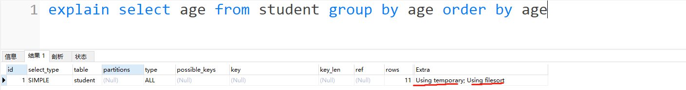

#### 3、group by 执行流程

这个例子中我们使用，课程【mysql 入门】中的一张学生表，执行以下 sql，统计各个年龄的人数，并按照年龄大学排序：

```sql
select age,count(*) from student group by age order by age
```

**他的执行流程如下：**

（1）创建一个内部临时表，有两列，一列是 `age`，一列是 `count(\*)`。

（2）全表扫描【原始表】（聚簇索引会在后边的内容讲解），每扫描一条数据进行一次判断，第一种情况，这条数据的年龄在临时表中不存在，则将年龄填入，count 列填 1。第二种情况，该条数据在临时表中存在，则将 count 列加 1。临时表的存在是为了辅助计算。

（3）对临时表的数据按照年龄进行排序。

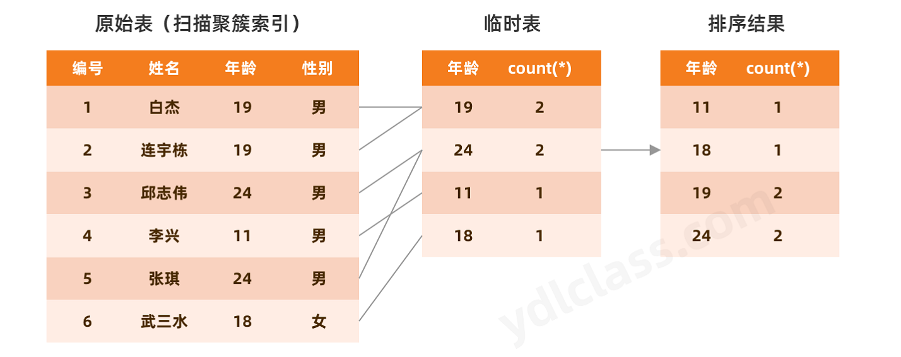

#### 4、内部临时表创建时机

**MySQL 在以下几种情况会创建临时表，大家也要思考为什么会产生临时表：**

1、使用 GROUP BY 分组，且分组字段没有索引时。

2、使用 DISTINCT 查询。

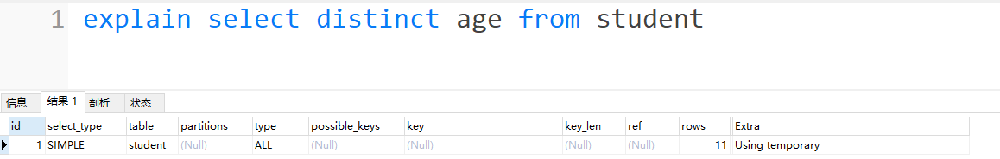

3、使用 UNION 进行结果合并，辅助去重。

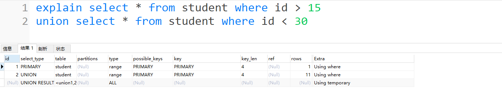

注意：【union all】不会使用零时表，因为他不需要去重

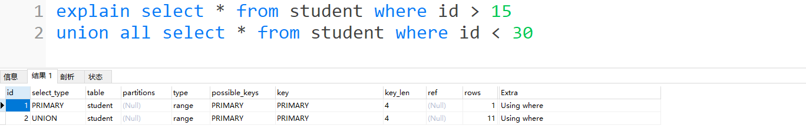

复杂的 sql 中很容易产生临时表，这需要大家在工作中不断的学习和积累。

> [!TIP]
>
> 其实临时表还可以分为【内存临时表】和【磁盘临时表】。内存临时表使用 memery 引擎（Memory 引擎不支持 BOLB 和 TEXT 类型），磁盘临时表默认使用 innodb 引擎。在以下几种情况下，会创建磁盘临时表：
>
> 1、数据表中包含 BLOB/TEXT 列；
>
> 2、在 GROUP BY 或者 DSTINCT 的列中有超过 512 字符的字符类型列；
>
> 3、在 SELECT、UNION、UNION ALL 查询中，存在最大长度超过 512 的列（对于字符串类型是 512 个字符，对于二进制类型则是 512 字节）；

## 第五章 MySQL 事务

### 一、事务简介

首先给大家举一个例子：我们有如下的销售业务，一个销售业务可能包含很多步骤，比如记录订单、添加积分、管理库存、扣减金额等等，每一个操作都可能对应一条或多条 sql 语句，但是这个业务却是不可分割的，不能下了订单，不扣减库存。此时我们就需要事务来统一管理这个业务当中的一系列 sql 语句了。

（1）在 MySQL 中只有使用了 Innodb 数据库引擎的数据库或表才支持事务。

（2）事务处理可以用来维护数据库的完整性，保证成批的 SQL 语句要么全部执行，要么全部不执行。

### 二、事务分类

#### 1、显式事务和隐式事务

（1）mysql 的事务可以分为【显式事务】和【隐式事务】。默认的事务是隐式事务，由变量【autocommit】控制。隐式事务的环境下，我们每执行一条 sql 都会【自动开启和关闭】事务，变量如下：

```sql
SHOW VARIABLES LIKE 'autocommit';
```


（2）显式事务由我们【自己控制】事务的【开启，提交，回滚】等操作，我们创建一个表，同时展示事务的基础语法，如下：

```sql
create database ydlTrx;
use ydlTrx;
-- UNSIGNED代表无符号数，不能是负数
create table user(
 id int primary key auto_increment,
 name VARCHAR(20),
 balance DECIMAL(10,2) UNSIGNED
);

insert into user VALUES (1,'楠哥',200);
insert into user VALUES (2,'楠哥老婆',50000);

-- 转账业务，必须都成功，或者都失败，所以不能一句一句执行，万一执行了一半，断电了咋办
-- 所以要编程一个整体
-- 都成功
-- 开启事务;
start transaction;
UPDATE user set balance = balance - 200 where id = 1;
UPDATE user set balance = balance + 200 where id = 2;
-- 提交事务
commit;

-- 都失败
start transaction;
UPDATE user set balance = balance - 200 where id = 1;
UPDATE user set balance = balance + 200 where id = 2;
-- 回滚事务
rollback;
```

我们可以使用 `begin` 或 `start transaction` 开启一个事务，使用 `commit` 提交事务，使用 `rollback` 回滚当前事务。

#### 2、只读事务和读写事务

我们可以使用 read only 开启只读事务，开启只读事务模式之后，事务执行期间任何【insert】或者【update】语句都是不允许的，具体语法如下：

```sql
start transaction read only
select * from ....
select * from ....
commit;
```

有人可能会问，这样和不开事务有什么区别呢？这个在下边学了隔离级别就知道了。

#### 3、保存点

我们可以使用 savepoint 关键字在事务执行中新建【保存点】，之后可以使用 rollback 向任意保存点回滚。

```sql
start transaction;
UPDATE user set balance = balance - 200 where id = 1;
savepoint a;
UPDATE user set balance = balance + 200 where id = 2;
rollback to a;
```

> [!CAUTION]
>
> Mysql 是不支持嵌套事务的，开启一个事务的情况下，若再开启一个事务，会隐式的提交上一个事务：
>
> ```sql
> start transaction;
> UPDATE user set balance = balance - 200 where id = 1;
>     start transaction;    -- 这里会自动将第一个事务提交
>     UPDATE user set balance = balance + 200 where id = 2;
>     commit;
> -- 回滚事务
> rollback;
> ```

### 三、事务四大特征（ACID）

#### 1、原子性（Atomicity）

一个事务（transaction）中的所有操作，**要么全部完成，要么全部不完成**，不会结束在中间某个环节。如果事务在执行过程中发生错误，会被回滚（Rollback）到事务开始前的状态，就像这个事务从来没有执行过一样，这个很好理解。

#### 2、一致性（Consistency）

在事务【开始之前和结束以后】，数据库的完整性没有被破坏，数据库状态应该与业务规则保持一致。**举一个例子**：A 向 B 转账，不可能 A 扣了钱，B 却没有收到，也不可能 A 和 B 的总金额，在事务前后发生变化，产生数据不一致。其他的三个特性都在为他服务。

#### 3、隔离性（Isolation）

数据库【允许多个并发事务同时对其数据进行读取和修改】，隔离性可以防止多个事务在并发修改共享数据时产生【数据不一致】的现象，这里要联想到我们学习过的多线程。

事务隔离级别分为不同等级，包括读未提交（Read uncommitted）、读提交（read committed）、可重复读（repeatable read）和串行化（Serializable），后续会详细讲。

#### 4、持久性（Durability）

事务处理结束后，对数据的修改就是永久的，即便系统故障也不会丢失。

### 四、事务隔离级别

对于数据库的四大特性中的【隔离级别】是比较难理解的，我们在本小结中详细介绍。

在多个事务【并发操作】相同的表数据时，为了让多个事务都可以得到正确的结果，不会因为互相的交叉操作产生干扰，同时还要保证一定的执行效率，故而提出了不同的隔离级别。

**隔离级别分类如下，在不同的隔离级别下可能产生不同的问题，如脏读、不可重复度、幻读等，我们会在后边的课程中一一讲解：**

| 隔离级别                     | 脏读 | 不可重复读 | 幻读 | 解决方案                                       |
| ---------------------------- | ---- | ---------- | ---- | ---------------------------------------------- |
| Read uncommitted（读未提交） | √    | √          | √    |                                                |
| Read committed（读已提交）   | ×    | √          | √    | undo log                                       |
| Repeatable read（可重复读）  | ×    | ×          | √    | MVCC 版本控制+间隙锁（mysql 的 rr 不存在幻读） |
| Serializable（串行化）       | ×    | ×          | ×    |                                                |

注意：传统意义上的 rr 级别是存在幻读问题的，但是 mysql 的 rr 级别不存在。

**在 mysql 中查看和设置【事务的隔离级别】，语法如下：**

```sql
-- 查看全局和当前事务的隔离级别
SELECT @@global.transaction_isolation, @@transaction_isolation_isolation;
show variables like 'transaction_isolation';
--5.7   tx_isolation
--8.0   transaction_isolation

-- 设置下一个事务的隔离级别
SET transaction isolation level read uncommitted;
SET transaction isolation level read committed;
set transaction isolation level repeatable read;
SET transaction isolation level serializable;
-- 设置当前会话的隔离级别
SET session transaction isolation level read uncommitted;
SET session transaction isolation level read committed;
set session transaction isolation level repeatable read;
SET session transaction isolation level serializable;
-- 设置全局事务的隔离级别
SET GLOBAL transaction isolation level read uncommitted;
SET GLOBAL transaction isolation level read committed;
set GLOBAL transaction isolation level repeatable read;
SET GLOBAL transaction isolation level serializable;


其中，SESSION 和 GLOBAL 关键字用来指定修改的事务隔离级别的范围：
SESSION：表示修改的事务隔离级别将应用于当前 session（当前 cmd 窗口）内的所有事务；
GLOBAL：表示修改的事务隔离级别将应用于所有 session（全局）中的所有事务，且当前已经存在的 session 不受影响；
如果省略 SESSION 和 GLOBAL，表示修改的事务隔离级别将应用于当前 session 内的下一个还未开始的事务。
```

#### 1、读未提交（RU）

【ru 隔离级别】说的简单一点就是，一个事务可以读取其他【未提交的事务】修改的数据，这种隔离级别最低，一般情况下，数据库隔离级别都要高于该级别，该隔离级别下，可能会存在脏读、不可重复度，幻读的问题。

**脏读**：指的是一个事务读到了其他事务未提交的数据，未提交意味着这些数据可能会回滚，读到的数据不一定准确。

**案例：**

楠哥发工资了，老婆让楠哥把工资打到他老婆的账号上，但是该事务并未提交，就让老婆去查看，老婆一看真的打了钱了，高高兴兴关了网页，此时楠哥急中生智进行回滚，钱瞬间回来，一次蒙混了一个月工资。所以楠哥老婆看到的数据我们称之为“脏数据”。

第一步：使用两个窗口，开启两个事务，且将隔离级别设置为 RU。

```sql
use ydlTrx;
SET transaction isolation level read uncommitted;
```

第二步：楠哥，给转账老婆转账 10000 元，但是不提交。

```sql
start transaction;
UPDATE user set balance = balance - 10000 where id = 1;
UPDATE user set balance = balance + 10000 where id = 2;
```

第三部步：楠哥通知老婆进行查账，确实读取到了楠哥未提交事务修改的数据。

```sql
start transaction;
select * from user where id = 2;
commit;
```

第四步：老婆查账结束，楠哥来一个回马枪，对自己的事务进行回滚操作。

```sql
rollback;
```

第五步：楠哥老婆某天查账，突然发现，哎，怎么少了一万。

```sql
start transaction;
select * from user where id = 2;
commit;
```

#### 2、读已提交（RC）

【RC 读已提交】说的是当前事务只能读到别的事物已经提交的数据，该隔离级别可能会产生不可重复读和幻读。

【不可重复读】的官方解释是：【一个事务】（A 事务）修改了【另一个未提交事务】（B 事务）读取过的数据。那么 B 事务【再次读取】，会发现两次读取的数据不一致。也就是说在一个原子性的操作中一个事务两次读取相同的数据，却不一致，一行数据不能重复被读取。主要是【update】语句，会导致不可重复读。

**案例：**

楠哥拿着工资卡去消费，系统读取到卡里确实有 10200 元，而此时她的老婆也正好在网上转账，把楠哥工资卡的 2000 元转到另一账户，并在 楠哥之前提交了事务，当楠哥扣款时，系统检查到楠哥的工资卡和上次读取的不一样了，楠哥十分纳闷，明明卡里有钱，为何......

第一步：将事务的隔离级别设置为 RC。

```sql
SET transaction isolation level read committed;
```

第二步：楠哥准备去消费了，检查存款显示有余额，贼高兴。

```sql
start transaction;
select * from user where id = 1;
```

第三步：楠哥老婆在楠哥没有提交事务的时候，进行了一笔转账，并且提交了事务。

```sql
start transaction;
UPDATE user set balance = balance + 500 where id = 2;
UPDATE user set balance = balance - 500 where id = 1;
commit;
```

第四步：楠哥再次查账，同一个事务里，发现钱少了。

```sql
select * from user where id = 1;
```

当隔离级别设置为 Read committed 时，避免了脏读，但是可能会造成不可重复读。

大多数数据库的默认级别就是 Read committed，比如 Sql Server , Oracle。如何解决不可重复读这一问题，请看下一个隔离级别。

#### 3、可重复读（RR）

学习完不可重复读，理解【可重复读】就简单多了，他的意思是，同一个事务中发出同一个 SELECT 语句【两次或更多次】，那么产生的结果数据集总是相同的，在 RR 隔离级别中可能出现幻读。

> **幻读**：一个事务按照某些条件进行查询，事务提交前，有另一个事务插入了满足条件的其他数据，再次使用相同条件查询，却发现多了一些数据，就像出现了幻觉一样。幻读主要针对针对 delete 和 insert 语句。

不可重复读强调的是两次读取的数据【内容不同】，幻读前调的是两次读取的【行数不同】。

**案例**

楠哥的老婆在银行部门工作，她时常通过银行内部系统查看楠哥的账户信息。有一天，她正在查询到楠哥账户信息时发现楠哥只有一个账户，心想这家伙应该没有私房钱。此时楠哥在另外一家分行又开了一个账户，准备存私房钱。同时，楠哥老婆在同一个事务中又一次查询，结果显示出的楠哥账户居然多了一个，真实奇怪。

第一步：将数据库的隔离级别设置为 RR。

```sql
set transaction isolation level repeatable read;
```

第二步：楠哥开启事务。

```sql
start transaction;
```

第三步：老婆查账户。

```sql
start transaction;
select * from user where name = '楠哥';
```

第四步：楠哥趁机开户，并提交事务。

```sql
insert into user values(3,'楠哥',10000);
commit;
```

第五步：老婆再查询并打印，应该发现楠哥多了一个账户，但是没有，并没有出现幻读。

```sql
select * from user where name = '楠哥';
```

**注意**：在 mysql 中的 RR 隔离级别中，innodb 使用 mvcc+锁帮我们解决了绝大部分的幻读情况，

上边的例子稍微修改一下，我们就能看到幻读现象了。

第一步：将数据库的隔离级别设置为 RR。

```sql
set transaction isolation level repeatable read;
```

第二步：楠哥开启事务。

```sql
start transaction;
```

第三步：老婆查账户。

```sql
start transaction;
select * from user where name = '楠哥';
```

第四步：楠哥趁机开户，并提交事务。

```sql
insert into user values(3,'楠哥',10000);
commit;
```

第五步：老婆好心给所有的账户充值 100，再查询并打印，结果发现楠哥多了一个账户，出现幻读。

```sql
-- 先给所有的账户钱充值一百
UPDATE user set balance = balance + 100;
select * from user where name = '楠哥';
```

这里边的原理过于复杂，目前我们先卖个关子，等我们学完【锁和 mvcc】以后回来在看，就能明白了。

#### 4、串行化

- 事务 A 和事务 B，事务 A 在操作数据库时，事务 B 只能排队等待
- 这种隔离级别很少使用，吞吐量太低，用户体验差
- 这种级别可以避免“幻读”，每一次读取的都是数据库中真实存在数据，事务 A 与事务 B 串行，而不并发。

第一步：修改数据库的隔离级别

```sql
SET transaction isolation level serializable;
```

第一步：楠哥执行查询操作

```sql
begin;
select * from user;
```

第二步：楠哥老婆执行查询操作

```sql
begin;
select * from user;
```

第三部：楠哥老婆想执行一个删除操作，发现事务被阻塞了，需要等待

```sql
delete from user where id = 9;
```

第四部：楠哥这边一提交，老婆那边就能操作了

```sql
commit;
```

## 第六章 索引

学习本章节内容，我们最好能模拟一个数据量比较大的环境，我使用 nodejs 模拟了 600 多万条数据，大家可自行下载：

数据库表如下：

```sql
SET NAMES utf8mb4;
SET FOREIGN_KEY_CHECKS = 0;

-- ----------------------------
-- Table structure for user
-- ----------------------------
DROP TABLE IF EXISTS `user`;
CREATE TABLE `user`  (
  `user_id` bigint NOT NULL AUTO_INCREMENT COMMENT '用户ID',
  `user_name` varchar(30) CHARACTER SET utf8mb4 COLLATE utf8mb4_0900_ai_ci NOT NULL COMMENT '用户账号',
  `nick_name` varchar(30) CHARACTER SET utf8mb4 COLLATE utf8mb4_0900_ai_ci NOT NULL COMMENT '用户昵称',
  `email` varchar(50) CHARACTER SET utf8mb4 COLLATE utf8mb4_0900_ai_ci NULL DEFAULT '' COMMENT '用户邮箱',
  `sex` varchar(2) CHARACTER SET utf8mb4 COLLATE utf8mb4_0900_ai_ci NULL DEFAULT '1' COMMENT '用户性别（0男 1女 2未知）',
  `avatar` varchar(100) CHARACTER SET utf8mb4 COLLATE utf8mb4_0900_ai_ci NULL DEFAULT '' COMMENT '头像地址',
  `password` varchar(100) CHARACTER SET utf8mb4 COLLATE utf8mb4_0900_ai_ci NULL DEFAULT '' COMMENT '密码',
  `login_ip` varchar(128) CHARACTER SET utf8mb4 COLLATE utf8mb4_0900_ai_ci NULL DEFAULT '' COMMENT '最后登录IP',
  `login_date` datetime NULL DEFAULT NULL COMMENT '最后登录时间',
  `text` text CHARACTER SET utf8mb4 COLLATE utf8mb4_0900_ai_ci NULL COMMENT '测试文本',
  PRIMARY KEY (`user_id`) USING BTREE
) ENGINE = InnoDB AUTO_INCREMENT = 2 CHARACTER SET = utf8mb4 COLLATE = utf8mb4_0900_ai_ci COMMENT = '用户信息表' ROW_FORMAT = DYNAMIC;

SET FOREIGN_KEY_CHECKS = 1;
```

我这里使用 nodejs（后边会学）的脚本导入了 600 万条数据，用来模拟，脚本如下，大家也可以在我们网站自行获取：

```javascript
// 引入依赖
const mysql = require("mysql2/promise");
const Mock = require("mockjs");

// 创建连接池（使用 promise）
const pool = mysql.createPool({
  host: "192.168.182.128",
  port: 3306,
  user: "root",
  password: "mysql_KTcCmf",
  database: "testDB",
  waitForConnections: true,
  connectionLimit: 60, // 最大连接数
  queueLimit: 0,
  multipleStatements: false, // 安全起见关闭多语句执行
});

// 延时函数（用于控制并发）
function delay(ms) {
  return new Promise((resolve) => setTimeout(resolve, ms));
}

// 插入数据函数（带事务）
async function insertData(index) {
  const connection = await pool.getConnection();

  try {
    await connection.beginTransaction(); // 开启事务

    const fields = [
      "userName",
      "nickName",
      "email",
      "sex",
      "loginIp",
      "loginDate",
      "password",
      "avatar",
      "text",
    ];
    let content = "";

    for (let i = 0; i < 100; i++) {
      const user = Mock.mock({
        userName: "@name(true)",
        nickName: "@cname()",
        email: "@email()",
        sex: () =>
          Math.random() <= 0.999 ? (Math.random() > 0.5 ? "男" : "女") : "未知",
        loginIp: "@ip()",
        loginDate: "@datetime()",
        password: "@word(5, 10)",
        avatar: "@url()",
        text: "@cparagraph(30)",
      });

      let values = "(";
      fields.forEach((key) => {
        // 使用 escape 防止 SQL 注入
        const escapedValue = connection.escape(user[key]);
        values += `${escapedValue},`;
      });
      values = values.slice(0, -1) + ")";

      content += values + ",";
    }

    content = content.slice(0, -1); // 删除最后的逗号

    const sql = `
      INSERT INTO user 
      (user_name, nick_name, email, sex, login_ip, login_date, password, avatar, text) 
      VALUES ${content}
    `;

    await connection.query(sql);
    await connection.commit(); // 提交事务
    console.log(`第 ${index} 批数据插入成功`);
  } catch (error) {
    await connection.rollback(); // 出错回滚
    console.error(`第 ${index} 批数据插入失败：`, error.message);
  } finally {
    connection.release(); // 释放连接回连接池
  }
}

// 主函数：控制并发插入
async function main() {
  const totalBatches = 60000; // 总共插入批次
  const batchSize = 100; // 每次并发执行多少个插入任务
  const delayBetweenBatches = 200; // 每批之间延迟（毫秒）

  // 记录开始时间
  const startTime = Date.now();

  for (let i = 0; i < totalBatches; i += batchSize) {
    const batchPromises = [];

    for (let j = 0; j < batchSize && i + j < totalBatches; j++) {
      batchPromises.push(insertData(i + j));
    }

    await Promise.all(batchPromises);
    console.log(`已完成第 ${i + batchSize} 批插入`);

    if (i + batchSize < totalBatches) {
      console.log(`等待 ${delayBetweenBatches} 毫秒后继续...`);
      await delay(delayBetweenBatches);
    }
  }

  // 记录结束时间
  const endTime = Date.now();
  const duration = endTime - startTime; // 单位：毫秒

  // 格式化为分钟和秒
  const minutes = Math.floor(duration / 60000);
  const seconds = ((duration % 60000) / 1000).toFixed(0);

  console.log("全部数据插入完成！");
  console.log(`总共耗时：${minutes} 分 ${seconds} 秒`);
}

// 启动主函数
main();
```

对应的 sql 文件也准备好了，文件大小 1.18G，大家可以自行下载：


准备工作做好之后，我们就可以深入的去学习这些知识了。

```sql
SELECT COUNT(*) FROM user; -- 28.360s (共6881000条)
SELECT * FROM user WHERE user_id = 1000000; -- 0.296s
SELECT * FROM user WHERE user_name = 'Sandra Cynthia Jones'; -- 34.160s
```

### 一、数据结构

一方面 mysql 的数据是存储在磁盘上的，另一方面还要满足对日常操作如【增删改查】的高效稳定的支持，我们当然可以采用更好的硬件来提升性能，但是选用合适的数据结构也很关键，innodb 采用的是一种名为【b+树】的数据结构。

我们之前已经学习过 innodb 中的数据是以【行】为单位，存在一个个大小为 16k 的【页】中，刚才的 b+树的作用就是按照一个的组织形式，将所有的【页】组织关联起来。

#### 1、B树

我们要了解【B+树】，首先要了解一下【B-树】，这里的 B 表示 balance( 平衡的意思)，B-树是一种【多路自平衡的搜索树】，它类似普通的平衡二叉树，不同的一点是 B-树允许每个节点有更多的子节点。下图是 B-树的简化图.

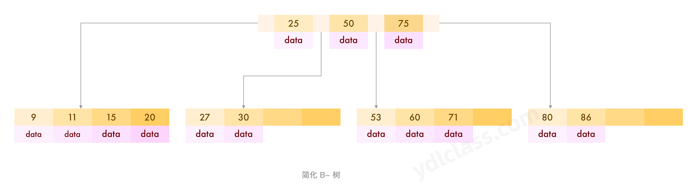

B-树有如下特点:

1. 所有键值分布在整颗树中；
2. 任何一个关键字出现且只出现在一个结点中；
3. 搜索有可能在非叶子结点结束；
4. 在关键字全集内做一次查找，性能逼近二分查找；

#### 2、B+树

【B+树】是【B-树】的变体，也是一种多路搜索树, 它与 B树的不同之处在于:

1. 所有关键字存储在叶子节点
2. 为所有叶子结点增加了一个双向指针

简化 B+树，如下图：

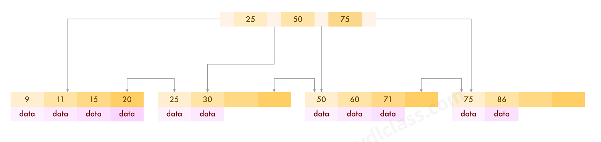

#### 3、选型缘由

**问题一：为什么在 b-树或 b+树中选择？**

- mysql 数据模型更适合用这类数据结构，一条数据中通常包含【id】+【其他列数据】，我们可以很轻松的根据 id 组织一颗 B+树。
- 我们知道 innodb 使用【页】（这是 inndb 管理数据的最小单位）保存数据，一页（16k），b+树中的每个节点都是一页数据。

**问题二：为什么选择 B+树？**

- 相同的空间，不存放【整行数据】就能存【更多的 id】，b+树能使每个节点能检索的【范围更大、更精确，极大的减少了 I/O 操作，保证 b+树的层高较低，通常 3 到 4 层的层高就能支持百万级别的访问】。
- Mysql 是一种关系型数据库，【区间访问】是很常见的一种情况，B+树叶节点增加的双向指针，加强了区间访问性，可使用在范围区间查询的情况。

#### 4、发现索引

我们发现当使用 id 去查询数据时，效率很高，因为使用 id 可以利用 B+树的特性，加速查询，请看以下两条 sql 的执行效率：

```sql
select * from ydl_user where id = 1                              -- 使用时间0.011s
select * from ydl_user where email = 'm.szi@xwsrnhp.pl'          -- 使用时间4.284s
```

我们发现，查询相同的记录，使用【id 列】比使用【emil 列】快了 389 倍，原因如下：

- 使用 id 列可以利用 B+树的特性，由上自下查询。
- 使用 email 列只能从叶子节点进行【全表扫描】，一个一个的比较。

那么如果我想提升使用其他字段的查询效率，应该怎么做呢？

首先，我们应该想到的思路就是，按照这个逻辑再给其他的字段也创建一个这样的结构不就好了，如下：

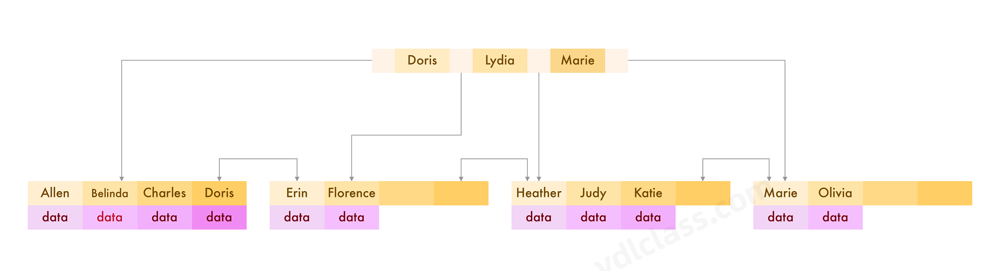

但是我们会发现，如果我们不断的创建类似的结构，数据会保存很多次，1 个 G 的数据可以膨胀为 5G 甚至 10G，所以我们可以进行优化，在叶子节点中只【保存 id】而不保存全部数据，查到 id 后再【回表】（回到原来的结构中根据 id 进行查询）查询整条记录，其结构如下：

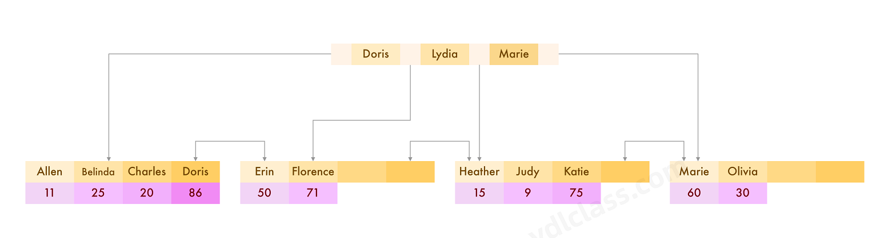

其实这就是我们日常工作中经常创建的【索引】。

### 二、索引的分类和创建

#### 1、聚簇索引和非聚簇索引

我们在上边的例子中，【主键和数据】共存的索引被称之为【聚簇索引】，其他的，比如我们使用【姓名列+主键】建立的索引，可以称为【非聚簇索引】，或者【辅助索引】，或者【二级索引】，同时聚簇索引只有在 innodb 引擎中才存在，而在 myIsam 中是不存在的，如下图：

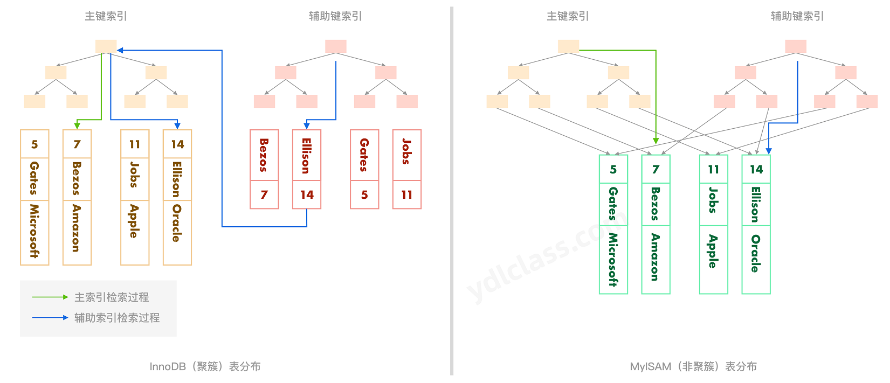

InnoDB 使用的是【聚簇索引】，他会将【主键】组织到一棵 B+树中，而【行数据】就储存在叶子节点上，若使用 `where id = 14` 这样的条件查找主键，则按照 B+树的检索算法即可查找到对应的叶节点，之后获得行数据。

若对 Name 列进行条件搜索，且 name 列已建立【索引】，则需要两个步骤：

- 第一步在辅助索引 B+树中检索 Name，到达其叶子节点获取对应的主键。
- 第二步使用主键在主索引 B+树中再执行一次 B+树检索操作，最终到达叶子节点即可获取整行数据。（重点在于通过其他键需要建立辅助索引）

如下图：

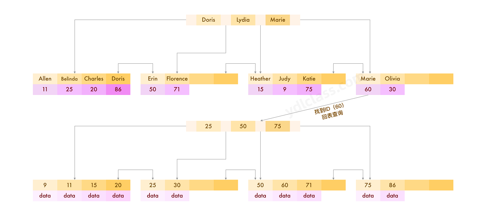

MyIsam 使用的是【非聚簇索引】，非聚簇索引的两棵 B+树看上去没什么不同，节点的结构完全一致只是存储的内容不同而已，主键索引 B+树的节点存储了主键，辅助键索引 B+树存储了辅助列。表数据存储在独立的地方，这两颗 B+树的叶子节点都使用一个【地址指向真正的表数据】，对于表数据来说，这两个键没有任何差别。由于索引树是独立的，通过辅助键检索无需访问主键的索引树。

> [!TIP]
>
> - 聚簇索引【默认使用主键】，如果表中没有定义主键，InnoDB 会选择一个【唯一且非空】的列代替。如果没有这样的列，InnoDB 会隐式定义一个主键【类似 oracle 中的 RowId】rowid 来作为聚簇索引的列。
> - 如果涉及到大数据量的排序、全表扫描、count 之类的操作的话，还是 MyIsam 占优势些，因为索引所占空间小，这些操作是需要在内存中完成的。

**小问题：主键为什么建议使用自增 id?**

- 主键最好不要使用 uuid，因为 uuid 的值太过离散，不适合排序且可能出现新增加记录的 uuid，会插入在索引树中间的位置，出现页分裂，导致索引树调整复杂度变大，消耗更多的时间和资源。
- 聚簇索引的数据的物理存放顺序与索引顺序是一致的，即：只要索引是相邻的，那么对应的数据一定也是相邻地存放在磁盘上的。如果主键不是自增 id，它会不断地调整数据的物理地址、分页，当然也有其他一些措施来减少这些操作，但却无法彻底避免。但如果是自增的 id，它只需要一 页一页地写，索引结构相对紧凑，磁盘碎片少，效率也高。

本章节中讲述了聚簇索引和二级键索引，对于【二级索引】而言，根据其不同的特性，我们又可以分为普通索引、唯一索引、复合索引等，接下来会一一讲解。

#### 2、普通索引 （常规索引）(normal)

就是普普通通的索引，没有什么特殊要求，理论上任何列都可以当做普通索引，创建方式如下：

**第一步**：创建索引前先执行下列语句，观察执行时间：

```sql
select * from user where user_name ='Dorothy William Harris';  -- 整个执行时间为32.248s
```

**第二步**：创建 user_name 列的索引：

```sql
create index idx_user_name on user(user_name);   -- 整个索引创建时间为40.053s
```

**结论**：创建索引是一个很费时间的操作。

**第三步**：再次执行下列语句

```sql
select * from ydl_user where user_name ='Dorothy William Harris';   -- 执行时间0.332s
```

**结论**：创建索引后，我们的执行效率提升了 138 倍。

**第四步**：删除索引

```sql
drop index idx_user_name on ydl_user;
```

其他创建索引的方法，如下：

（1）创建 email 列的索引，索引可以截取 length 长度，只使用这一列的前几个字符

```sql
create index idx_email on user(email(5));     --执行时间32.570s
```

> [!IMPORTANT]
>
> 有的列【数据量比较大】，使用前几个字符就能【很快标识】出来一行数据，那我们就可以使用这种方式建立索引，比如我们的邮箱，邮箱很多后缀是相同的我们完全可以忽略。
>
> （2）使用修改表的方式添加索引
>
> ```sql
> alter table user add index idx_email (email);
> ```
>
> （3）建表时时，同时创建索引
>
> ```sql
> create table tbl_name(
>     tid int,
>     tname varchar(20),
>     gender varchar(1),
>     index [indexName] (fieldName(length))
> )
> ```

#### 3、唯一索引（UNIQUE ）

对列的要求：索引列的值不能重复

创建表的同时，创建索引：

```sql
create table tbl_name(
    tid int,
    tname varchar(20),
    gender varchar(1),
    unique index unique_index_tname (tname)
)
```

独立的 sql 语句创建索引，我们的邮箱，用户名就应该创建唯一索引，姓名就应该是普通索引：

```sql
create unique index idx_email on user(email);
```

通过 alter 语句添加索引：

```sql
ALTER table mytable ADD UNIQUE [ux_indexName] (username(length))
```

唯一索引和主键的区别：

- 唯一索引列允许空值，而主键列不允许为空值。
- 主键列在创建时，已经默认为非空值 + 唯一索引了。
- 主键可以被其他表引用为外键，而唯一索引不能。
- 一个表最多只能创建一个主键，但可以创建多个唯一索引。
- 主键更适合那些不容易更改的唯一标识，如自动递增列、身份证号等。

唯一约束和唯一索引的区别：

- 唯一约束和唯一索引，都可以实现列数据的唯一，列值可以为 null。
- 创建唯一约束，会自动创建一个同名的唯一索引，该索引不能单独删除，删除约束会自动删除索引。唯一约束是通过唯一索引来实现数据唯一。
- 创建一个唯一索引，这个索引就是独立的索引，可以单独删除。
- 如果一个列上想有约束和索引，且两者可以单独的删除。可以先建唯一索引，再建同名的唯一约束。

#### 4、多个二级索引的组合使用

**记住一点**：mysql 在执行查询语句的时候一般只会使用【一个索引】，除非是使【用 or 连接的两个索引列】会产生索引合并。

我们针对某电商平台的检索功能做了优化，添加了三个索引，三个字段分别为【品牌】、【价格】、【销量】这三个的索引结构如下:

**（1）品牌的索引结构：**


**（2）价格的索引结构：**

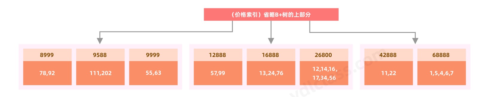

**（3）销量的索引结构：**

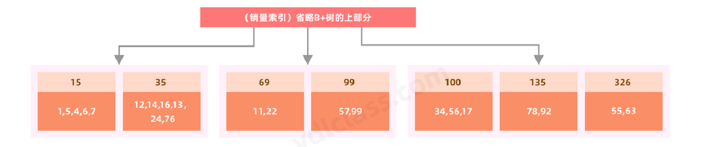

针对以上的索引我们进行如下的查询，分析检索过程：

1. 我们要检索品牌为阿玛尼（Armani）的包包
   - **第一步**：通过【品牌索引】检索出所有阿玛尼的商品 id，回表查询，得到结果。
   - **结论**：会使用一个索引。
2. 我们要检索名称为阿玛尼（Armani），价格在 1 万到 3 万之间的包包查询的步骤如下：
   - **第一步**：通过【品牌索引】检索出所有阿玛尼的商品 id。
   - **第二步**：直接回表扫描，根据剩余条件检索结果。
   - **结论**：只会使用第一个索引。
3. 我们要检索名称为阿玛尼（Armani），价格为 26800，且销量在 50 以上的包包查询的步骤如下：
   - **第一步**：通过【品牌索引】检索出所有阿玛尼的商品 id，进行缓存。
   - **第二步**：直接回表扫描，根据剩余条件检索结果。
   - **结论**：只会使用第一个索引。
4. 我们要检索名称为阿玛尼（Armani）或名称为 LV 的包包
   - **第一步**：通过【品牌索引】检索出所有阿玛尼的商品 id，得到结果。
   - **结论**：我们经常听说，有 or 索引会失效，但是像这样的【type =‘Armani’ or type = ‘LV’】并不会，他相当于一个 in 关键字，会使用一个索引。
5. 我们要检索名称为阿玛尼（Armani）或价格大于 8000 的包包
   - **第一步**：通过【品牌索引】检索出所有阿玛尼的商品 id，进行缓存。
   - **第二步**：通过【价格索引】检索出价格在 5 万到 7 万之间的商品 id，这是一个连接条件带有【or 的查询】，所以需要和上一步的结果进行【并集】，得到结果。
   - **结论**：这个过程叫【索引合并】当检索条件有 or 但是所有的条件都有索引时，索引不失效，可以走【两个索引】。
6. 我们要检索名称为阿玛尼（Armani），且价格大于 8000，且【产地（该列无索引）】在北京的包包
   - **第一步**：通过【品牌索引】检索出所有阿玛尼的商品 id。
   - **第二步**：直接回表扫描，根据剩余条件检索结果。
   - **结论**：只会使用第一个索引。
7. 我们要检索名称为阿玛尼（Armani）或价格大于 8000，或【产地（该列无索引）】在北京的包包
   - **第一步**：优化器发现【产地列】无索引，同时连接的逻辑是【or】没有办法利用【索引】优化，只能全表扫描，索引失效。
   - **结论**：发生全表扫描，索引失效，条件中有没建立索引的列，同时关联条件是 or。

#### 5、复合索引（联合索引）重要

当【查询语句】中包含【多个查询条件，且查询的顺序基本保持一致】时，我们推荐使用复合索引，索引的【组合使用】效率是低于【复合索引】的。

比如：我们经常按照 A 列、B 列、C 列进行查询时，通常的做法是建立一个由三个列共同组成的【复合索引】而不是对每一个列建立【普通索引】。

创建联合索引的方式如下：

```sql
alert table test add idx_a1_a2_a3 table (a1,a2,a3)
-- 28.531s
create index idx_user_nick_name on ydl_user(user_name,nick_name,email(7));
```

复合索引的结构如下，复合索引会优先按照第一列排序，第一列相同的情况下会按照第二列排序，以此类推，如下图：

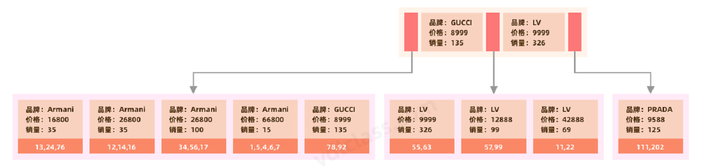

我们不妨把上边的图，转化为下边的表格，看起来会好一些：

| 品牌   | 价格  | 销量 | id        |
| ------ | ----- | ---- | --------- |
| Armani | 16800 | 35   | 13,24,76  |
| Armani | 26800 | 35   | 12,14,16  |
| Armani | 26800 | 100  | 34,56,17  |
| Armani | 68888 | 15   | 1,4,5,6,7 |
| GUCCI  | 8999  | 135  | 78,92     |
| LV     | 9999  | 326  | 55,63     |
| LV     | 12888 | 99   | 57,99     |
| LV     | 42888 | 69   | 11,22     |
| PRADA  | 9588  | 125  | 111,202   |

认真阅读了上边的介绍和图形，我们再次思考以下几个问题：

1. 我们要检索名称为阿玛尼（Armani）的包包
   - **第一步**：通过【品牌索引】检索出所有阿玛尼的商品 id，回表查询，得到结果。
   - **结论**：会使用第一部分索引。
2. 我们要检索名称为阿玛尼（Armani），价格在 1 万到 3 万之间的包包查询的步骤如下：
   - **第一步**：通过【品牌索引】检索出所有阿玛尼的叶子节点。
   - **第二步**：在【满足上一步条件的叶子节点中】查询价格在 1 万到 3 万之间的包包的列，查询出对应的 id，回表查询列数据。
   - **结论**：会使用复合索引的两个部分。
3. 我们要检索名称为阿玛尼（Armani）或价格大于 8000 的包包
   - **第一步**：优化器发现我们并没有一个【价格列】的单独的二级索引，此时要查询价格大于 8000 的包，必须进行全表扫描。
   - **结论**：但凡查询的条件中没有【复合索引的第一部分】，索引直接【失效】，全表扫描。
4. 我们要检索名称为阿玛尼（Armani），且价格大于 8000，且【产地（该列无索引）】在北京的包包
   - **第一步**：通过【品牌索引】检索出所有阿玛尼的叶子节点。
   - **第二步**：在【满足上一步条件的叶子节点中】查询价格大于 8000 元的包包的叶子节点。
   - **第三步**：因为【产地列】无索引，但是是【and】的关系，我们只需要将上一步得到的结果回表查询，在这个很小的范围内，检索产地是不是北京即可。
   - **结论**：可以使用复合索引的两个部分。
5. 我们要检索名称为阿玛尼（Armani）和 LV 之间，价格为在 1 万到 3 万的包包查询的步骤如下：
   - **第一步**：通过【品牌索引】检索出所有阿玛尼和 LV 的所有叶子节点。
   - **第二步**：我们本想在第一步的结果中，快速定位价格的范围，但是发现一个问题，由于第一步不是等值查询，会导致后边的结果不连续，必须对【上一步的结果】全部遍历，才能拿到对应的结果。
   - **结论**：只会使用复合索引的第一个部分，这个就引出了【复合索引中特别重要的一个概念】-【最左前缀原则】。

> [!IMPORTANT]
>
> **最左前缀原则：**
>
> （1）最左前缀匹配原则，非常重要的原则，mysql 会一直向右匹配直到遇到范围查询（>、<、between、like）就停止匹配，比如 `a = 1 and b = 2 and c > 3 and d = 4` ，如果建立 `(a,b,c,d)` 顺序的联合索引，d 是用不到索引的，如果建立 `(a,b,d,c)` 的索引则都可以用到，a,b,d 的顺序可以任意调整。
>
> （2）`=` 和 `in` 可以乱序，比如 `a = 1 and b < 2 and c = 3` ，咱们建立的索引就可以是 `(a,c,b)` 或者 `(c,a,b)`。

---

> [!NOTE]
>
> 覆盖索引，不需要回表查询
>
> ```sql
> CREATE INDEX idx_user_nick on user(user_name,nick_name,email);
> 
> -- 更高
> select nick_name, email from user select user_name='Gary Jose Hall';
> -- 结果是需要回表查询的
> select * from user select user_name='Gary Jose Hall';
> ```

**思考**：为什么联合索引的性能会比索引的组合使用效率高。

#### 6、全文索引（FULLTEXT）

做全文检索（不如百度的搜索功能）使用的索引，但是这种场景，我们有更好的替代品，如：_ElacticSearch_，所以实际使用不多，只当了解。

使用 `like + %` 实现的模糊匹配有点类似全文索引。但是对于大量的文本数据检索，全文索引比 `like + %` 快 N 倍，速度不是一个数量级，但是全文索引可能存在【精度问题】。同时普通索引在使用 like 时如果 % 放在首位，索引会失效。

> 全文索引的版本支持

1. _MySQL 5.6_ 以前的版本，只有 MyIsam 存储引擎支持全文索引。
2. _MySQL 5.6_ 及以后的版本，MyIsam 和 InnoDB 存储引擎均支持全文索引。
3. 只有字段的数据类型为 char、varchar、text 及其系列才可以建全文索引。

> 使用全文索引的注意

1. 使用全文索引前，搞清楚版本支持情况。
2. 全文索引比 `like + %` 快 N 倍，但是可能存在精度问题。
3. 如果需要全文索引的是大量数据，建议先添加数据，再创建索引。
4. 对于中文，可以使用 _MySQL 5.7.6_ 之后的版本，或者第三方插件。

（1）创建表时创建全文索引

```sql
create table ydlclass_user (
    ..
    FULLTEXT KEY fulltext_text(text)
)
```

（2）在已存在的表上创建全文索引

```sql
create fulltext index fulltext_text on ydlclass_user(text);
```

本次创建用时 143s：

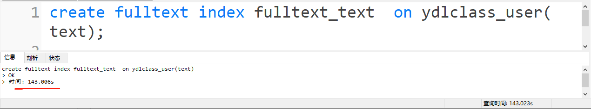

（3）通过 SQL 语句 ALTER TABLE 创建全文索引

```sql
alter table ydlclass_user add fulltext index fulltext_text(text);
```

（4）直接使用 DROP INDEX 删除全文索引

```sql
drop index fulltext index on ydlclass_user;
```

（5）全文检索的语法

```sql
select * from ydlclass_user where match(text) against('高号便法还历只办二主厂向际');
```

#### 8、hash 索引

hash 索引是 Memory 存储引擎的默认方式，而且只有 memory 引擎支持 hash 索引，memory 的数据是放在内存中的，一旦服务关闭，表中的数据就会丢失，我们可以使用如下的 sql 创建一张表:

```sql
CREATE TABLE `hash_user`  (
  `user_id` bigint(20) NOT NULL AUTO_INCREMENT COMMENT '用户ID',
  `user_name` varchar(30) CHARACTER SET utf8mb4 COLLATE utf8mb4_0900_ai_ci NOT NULL COMMENT '用户账号',
  ......
) ENGINE = Memory CHARACTER SET = utf8mb4 COLLATE = utf8mb4_0900_ai_ci COMMENT = '用户信息表' ROW_FORMAT = Dynamic;
```

合理的使用 memory 引擎可以极大的提升性能，针对 memory 引擎的特点重启丢失），我们最好在其中存储一些公共的、常用的、不经常发生改变的数据，比如一些字典数据、配置数据等。同时，这些数据最好持久化在一些其他的地方，比如配置文件、其他的表，在程序启动的时候，主动的进行加载，我们可以使用如下 sql，将一张表的数据加载到内存中：

```sql
insert into hash_user select * from ydl_user where user_id < 2000000;
```

我们在执行的过程种，可能有如下错误：


他告诉我，这个表使用的内存满了，放不下了，我们只需要调节下边两个参数，修改配置文件重启即可：

```ini
tmp_table_size = 4096M
max_heap_table_size = 4096M
```

基础工作完成，写几个 sql 语句尝试一下，我们发现真的一个字：快。

我们执行一下的 sql

```sql
select * from hash_user where email = 'i.jnoyelrsg@rpnglcvh.museum'  -- 0.189s
```

创建一个 hash 索引

```sql
create index hash_idx_user_name using hash on hash_user(email);
```

再次查询

```sql
select * from hash_user where email = 'i.jnoyelrsg@rpnglcvh.museum'  -- 0.017s
```

也有不错的效果。

关于 hash 索引需要了解的几点：

- hash 是一种 key-value 形式的数据结构。实现一般是数组+链表的结构，通过 hash 函数计算出 key 在数组中的位置，然后如果出现 hash 冲突就通过链表来解决。当然还有其他的解决 hash 冲突的方法。hash 这种数据结构是很常用的，比如我们系统使用 HashMap 来构建热点数据缓存，存取效率很好。
- 即使是相近的 key，hash 的取值也完全没有规律，索引 hash 索引不支持范围查询。
- hash 索引存储的是 hash 值和行指针，所以通过 hash 索引查询数据需要进行两次查询（首先查询行的位置，然后找到具体的数据）。
- hash 索引查询数据的前提就是计算 hash 值，也就是要求 key 为一个能准确指向一条数据的 key，所以对于 like 等一类的匹配查询是不支持的。
- 只要是只需要做等值比较查询，而不包含排序或范围查询的需求，都适合使用哈希索引。

#### 7、空间索引（SPATIAL）

MySQL 在 5.7 之后的版本支持了空间索引，而且支持 OpenGIS 几何数据模型。这是在地理位置领域使用的一种索引，其他场景用的很少，所以不需要深入学习。

### 三、explain 的用法

explain 关键字可以模拟 MySQL 优化器执行 SQL 语句，可以很好的分析 SQL 语句或表结构的性能瓶颈。

explain 的使用很简单，只需要在目标 sql 前加上这个关键字就可以了：

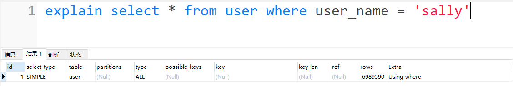

**执行 explain 会产生以下 11 列内容，如下：**

| 列号 | 列            | 说明                                                                                                   |
| ---- | ------------- | ------------------------------------------------------------------------------------------------------ |
| 1    | id            | select 查询的序列号，包含一组数字，表示查询中执行 select 子句或操作表的顺序                            |
| 2    | select_type   | 查询类型                                                                                               |
| 3    | table         | 正在访问哪个表                                                                                         |
| 4    | partitions    | 匹配的分区                                                                                             |
| 5    | type          | /访问的类型                                                                                            |
| 6    | possible_keys | 显示可能应用在这张表中的索引，一个或多个，但不一定实际使用到                                           |
| 7    | key           | 实际使用到的索引，如果为 NULL，则没有使用索引                                                          |
| 8    | key_len       | 表示索引中使用的字节数，可通过该列计算查询中使用的索引的长度                                           |
| 9    | ref           | 显示索引的哪一列被使用了，如果可能的话，是一个常数，哪些列或常量被用于查找索引列上的值                 |
| 10   | rows          | 根据表统计信息及索引选用情况，大致估算出找到所需的记录所需读取的行数 filtered //查询的表行占表的百分比 |
| 11   | filtered      | 查询的表行占表的百分比                                                                                 |
| 12   | Extra         | 包含不适合在其它列中显示但十分重要的额外信息                                                           |

#### 1、id 字段

select 查询的序列号，包含一组数字，表示查询中执行 select 子句或操作表的顺序

（1） id 相同

id 如果相同，可以认为是一组，执行顺序从上至下，如下查询语句：

```sql
explain select * from student s, scores sc where s.id = sc.s_id
```


（2） id 不同

如果是子查询，id 的序号会递增，id 的值越大优先级越高，越先被执行例子

```sql
explain select * from student where age > (
 select age from student where name = '连宇栋'
);
```


（3）id 部分相同部分不同

id 如果相同，可以认为是一组，从上往下顺序执行在所有组中，id 值越大，优先级越高，越先执行例子：

```sql
explain
select * from student s, scores sc where s.id = sc.s_id
union
select * from student s, scores sc where s.id = sc.s_id;
```

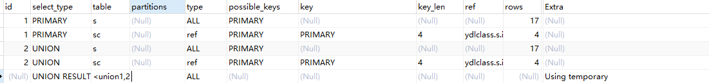

#### 2、select_type 字段

**（1）SIMPLE**

简单查询，不包含子查询或 Union 查询的 sql 语句。

**（2）PRIMARY**

查询中若包含任何复杂的子部分，最外层查询则被标记为主查询。

**（3） SUBQUERY**

在 select 或 where 中包含子查询。

**（4）UNION**

若第二个 select 出现在 uion 之后，则被标记为 UNION。

**（6）UNION RESULT**

从 UNION 表获取结果的合并操作。

#### 3、type 字段

最好到最差备注：掌握以下 10 种常见的即可 

> NULL>system>const>eq_ref>ref>ref_or_null>index_merge>range>index>ALL

**（1）NULL**

MySQL 能够在优化阶段分解查询语句，在执行阶段用不着再访问表或索引，比如通过 id 没有找到例子：

```sql
explain select min(id) from student;
```


**（2）system**

表只有一行记录（等于系统表），这是 const 类型的特列，平时不大会出现，可以忽略，我也没有实测出来。

```sql
explain select * from mysql.proxies_priv
```

我实测一个只有一行记录的系统表，同样是 all。

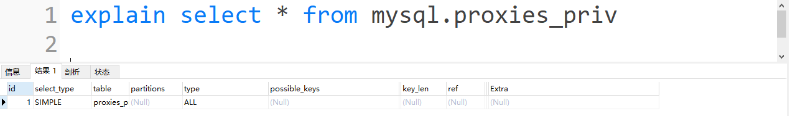

**（3） const**

表示通过索引一次就找到了，const 用于比较 primary key 或 uique 索引，因为只匹配一行数据，所以很快，如主键置于 where 列表中，MySQL 就能将该查询转换为一个常量例子：

```sql
explain select * from student where id = 1;
```


**4. eq_ref**

唯一性索引扫描，对于每个索引键，表中只有一条记录与之匹配，常见于主键或唯一索引扫描例子：

被驱动表使用主键索面，结果唯一

```sql
explain select * from scores sc left join student s on s.id = sc.s_id
```


**5. ref**

非唯一性索引扫描，返回匹配某个单独值的所有行，本质上也是一种索引访问，返回所有匹配某个单独值的行，然而可能会找到多个符合条件的行，应该属于查找和扫描的混合体例子：

```sql
explain select * from student where name = '白杰'
explain select * from student s left join scores sc on s.id = sc.s_id
```


**6. ref_or_null**

类似 ref，但是可以搜索值为 NULL 的行例子：

```sql
explain select * from student s where name = '白杰' or name is null
```


**7. index_merge**

表示使用了索引合并的优化方法例子：

```sql
explain select * from student where id = 1 or name ='李兴';
```


**8. range**

只检索给定范围的行，使用一个索引来选择行，key 列显示使用了哪个索引一般就是在你的 where 语句中出现 between、<>、in 等的查询。例子：

```sql
explain select * from student where id between 4 and 7;
```


**9. index**（全索引扫描）

Full index Scan，Index 与 All 区别：index 只遍历索引树，通常比 All 快因为索引文件通常比数据文件小，也就是虽然 all 和 index 都是读全表，但 index 是从索引中读取的，而 all 是从硬盘读的。例子：

```sql
explain select name from student;
```

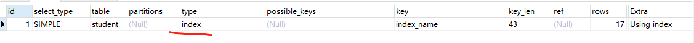

**10. ALL**（全表扫）

Full Table Scan，将遍历全表以找到匹配行例子：

```sql
explain select * from student;
```


#### 4、table 字段

表示数据来自哪张表

#### 5、possible_keys 字段

显示可能应用在这张表中的索引，一个或多个查询涉及到的字段若存在索引，则该索引将被列出，但不一定被实际使用

#### 6、key 字段

实际使用到的索引，如果为 NULL，则没有使用索引查询中若使用了覆盖索引（查询的列刚好是索引），则该索引仅出现在 key 列表

#### 7、key_len 字段

表示索引中使用的字节数，可通过该列计算查询中使用的索引的长度在不损失精确度的情况下，长度越短越好 key_len 显示的值为索引字段最大的可能长度，并非实际使用长度即 key_len 是根据定义计算而得，不是通过表内检索出的

#### 8、ref 字段

哪些列或常量被用于查找索引列上的值

#### 9、rows 字段

根据表统计信息及索引选用情况，大致估算出找到所需的记录所需读取的行数

#### 10、partitions 字段

匹配的分区

#### 11、filtered 字段

它指返回结果的行占需要读到的行(rows 列的值)的百分比

#### 12、Extra 字段

该列包含不适合在其它列中显示，但十分重要的额外信息，我们列举几个例子：

**（1）Using filesort**

只要使用非索引字段排序，就会出现这样的内容。

**（2）Using temporary**

使用了临时表保存中间结果，MySQL 在对结果排序时使用临时表，常见于排序 order by 和分组查询 group by 例子：

**（3）Using where**

使用了 where 条件例子：

**（4）impossible where**

where 子句的值总是 false，不能用来获取任何数据：

```sql
explain select * from student where name = '白洁' and name = '李兴';
```


**（5）Select tables optimized away**

SELECT 操作已经优化到不能再优化了（MySQL 根本没有遍历表或索引就返回数据了）例子：

```sql
explain select min(id) from student;
```


**（6）no matching row in const table**

```sql
explain select * from student where id < 100 and id > 200;
```


### 三、使用索引的问题

设计好 MySql 的索引可以让你的数据库飞起来。但是，不合理的创建索引同样会产生很多问题？我们在设计 MySql 索引的时候有一下几点注意：

#### 1、哪些情况下适合建索引

- 频繁作为 where 条件语句查询的字段
- 关联字段需要建立索引
- 分组，排序字段可以建立索引
- 统计字段可以建立索引，例如 count()，max()等

**小案例**：还记得在学习临时表时，分析过 group by 的执行流程吗（分组字段没有索引）？有了索引之后的分组执行流程如下：

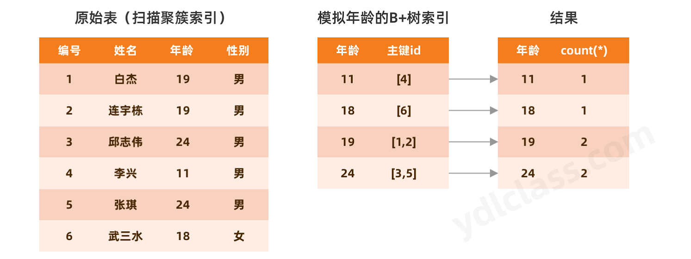

直接使用索引信息，统计每个组的人数，直接返回。

#### 2、哪些情况下不适合建索引

- 频繁更新的字段不适合建立索引
- where 条件中用不到的字段不适合建立索引
- 表数据可以确定比较少的不需要建索引
- 数据重复且发布比较均匀的的字段不适合建索引（唯一性太差的字段不适合建立索引），例如性别，真假值
- 参与列计算的列不适合建索引，索引会失效

#### 3、能用复合索引的要使用复合索引

#### 4、null 值也是可以走索引的，他被处理成最小值放在 b+树的最左侧

#### 5、使用短索引

对字符串的列创建索引，如果可能，应该指定一个前缀长度。例如，如果有一个 CHAR(255)的 列，如果在前 10 个或 20 个字符内，多数值是惟一的，那么就不要对整个列进行索引。短索引不仅可以提高查询速度而且可以节省磁盘空间和 I/O 操作。

#### 6，排序的索引问题

mysql 查询只使用一个索引，因此如果 where 子句中已经使用了索引的话，那么 order by 中的列是不会使用索引的。因此数据库默认排序可以符合要求的情况下不要使用排序操作；尽量不要包含多个列的排序，如果需要，最好给这些列创建复合索引。

#### 7、MySQL 索引失效的几种情况

- 如果条件中有 or，即使其中有条件带索引也不会使用走索引，除非全部条件都有索引
- 复合索引不满足最左原则就不能使用全部索引
- like 查询以%开头
- 存在列计算

```sql
explain select * from student where age = (18-1)
```

- 如果 mysql 估计使用全表扫描要比使用索引快，则不使用索引，比如结果的量很大
- 存在类型转化

```sql
-- 索引不失效
explain select * from student where age = '18'
explain select * from ydl_user where login_date = '2008-05-31 17:20:54'
-- 索引失效 本来是字符串，你使用数字和他比较
explain select * from student where gander = 1
```

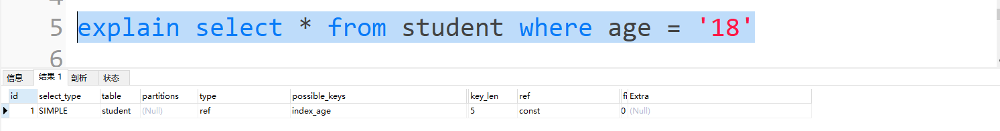


## 第七章 锁机制

锁是为了保证数据库中数据的一致性，使各种【共享资源】在被访问时变得【有序】而设计的一种规则。

MysQL 中不同的存储引擎支持不同的锁机制。 InoDB 支持【行锁】，有时也会升级为表锁，MyIsam 只支持表锁。

- 【表锁】的特点就是开销小、加锁快，不会出现死锁。锁粒度大，发生锁冲突的概率小，并发度相对低。
- 【行锁】的特点就是开销大、加锁慢，会出现死锁。锁粒度小，发生锁冲突的概率高，并发度高。今天我们讲锁主要从 InnoDB 引擎来讲，因为它既支持行锁、也支持表锁。

### 一、InnoDB 的锁类型

InnoDB 的锁类型主要有读锁(共享锁)、写锁(排他锁)、意向锁和 MDL 锁。

#### 1、s 锁

读锁（共享锁，shared lock）简称 S 锁。一个事务获取了一个数据行的读锁，其他事务也能获得该行对应的读锁，但不能获得写锁，即一个事务在读取一个数据行时，其他事务也可以读，但不能对该数行增删改的操作。

> [!NOTE]
>
> 读锁是共享锁，多个事务可以同时持有，当有一个或多个事务持有共享锁时，被锁的数据就不能修改。

简而言之：就是可以多个事务读，但只能一个事务写。

读锁是通过【select.... lock in share mode】语句给被读取的行记录或行记录的范围上加一个读锁,让其他事务可以读，但是要想申请加写锁，那就会被阻塞。

事务一：

```sql
begin;
select * from ydl_student where id = 1 lock in share mode;
```

事务二：

```sql
begin;
update ydl_student set score = '90' where id = 1;
```

卡住了，说明程序被阻塞，确实加了锁。

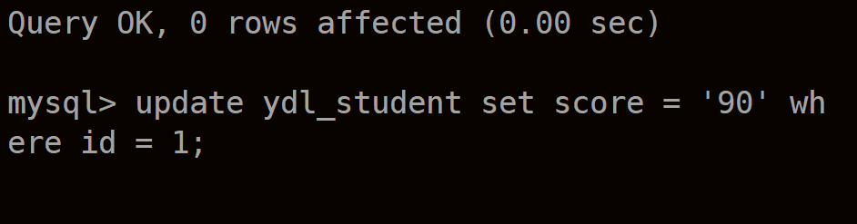

s 锁是可以被多个事务同时获取的，我们在两个不同的事务中分别对同一行数据加上 s 锁，结果都可以成功，如下图：

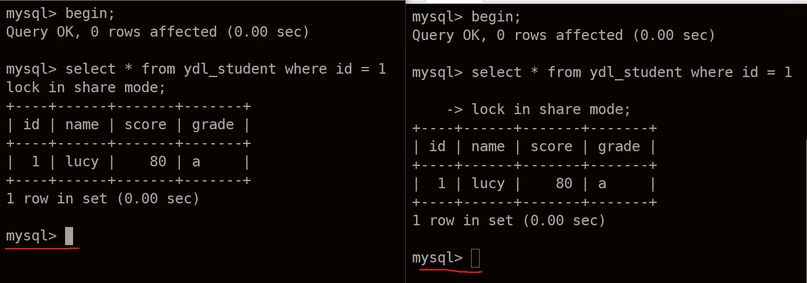

#### 2、x 锁

写锁，也叫排他锁，或者叫独占所，简称 x 锁（exclusive）。一个事务获取了一个数据行的写锁，既可以读该行的记录，也可以修改该行的记录。但其他事务就不能再获取该行的其他任何的锁，包括 s 锁，直到当前事务将锁释放。【这保证了其他事务在当前事务释放锁之前不能再修改数据】。

> [!NOTE]
>
> 写锁是独占锁，只有一个事务可以持有，当这个事务持有写锁时，被锁的数据就不能被其他事务修改。

（1）一些 DML 语句的操作都会对行记录加写锁。

事务一：

```sql
begin;
update ydl_student set score = '90' where id = 1;
```

事务二：

```sql
begin;
update ydl_student set score = '88' where id = 1;
```

卡住了，说明程序被阻塞，确实加了锁。但是，我们发现其他事务还能读，有点不符合逻辑，这是应为 mysql 实现了 MVCC 模型，后边会详细介绍。

（2）比较特殊的就是 `select for update`，它会对读取的行记录上加一个写锁，那么其他任何事务不能对被锁定的行上加任何锁了，要不然会被阻塞。

事务一：

```sql
begin;
select * from ydl_student where id = 1 for update;
```

事务二：

```sql
begin;
update teacher set name = 'lucy2' where id = 1;
```

卡住了，说明加了锁了。

（3）x 锁是只能被一个事务获取，我们在两个不同的事务中分别对同一行数据加上 x 锁，发现后者会被阻塞，如下图：

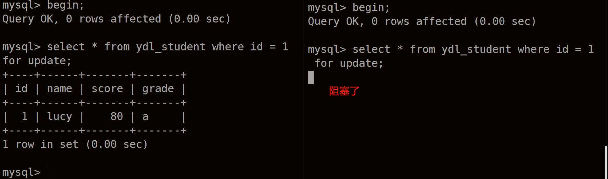

#### 3、记录锁（Record Lock）

记录锁就是我们常说的行锁，只有 innodb 才支持，我们使用以下四个案例来验证记录锁的存在：

（1）两个事务修改【同一行】记录，该场景下，where 条件中的列不加索引。

事务一：

```sql
begin;
update ydl_student set score = '77' where name = 'jack';
```

事务二：

```sql
begin;
update ydl_student set score = '80' where name = 'jack';
```

发现事务二卡住了，只有事务一提交了，事务二才能继续执行，很明显，这一行数据被【锁】住了。

（2）两个事务修改同表【不同行】记录，此时 where 条件也不加索。

事务一：

```sql
begin;
update ydl_student set score = '76' where name = 'hellen';
```

事务二：

```sql
begin;
update ydl_student set score = '66' where name = 'jack';
```

现事务二卡住了，只有事务一提交了，事务二才能继续执行，很明显，表被【锁】住了。

（3）两个事务修改【同一行】记录，where 条件加索引

事务一：

```sql
begin;
update ydl_student set score = '99' where name = 'jack';
```

事务二：

```sql
begin;
update ydl_student set score = '79' where name = 'jack';
```

现事务二卡住了，只有事务一提交了，事务二才能继续执行，很明显，这一行数据被【锁】住了。

（4）两个事务修改同表【不同行】记录，此时 where 条件加索。

事务一：

```sql
begin;
update ydl_student set score = '77' where name = 'hellen';
```

事务二：

```sql
begin;
update ydl_student set score = '77' where name = 'jack';
```

发现都可以顺利修改，说明锁的的确是行。

**证明**：行锁是加在索引上的，这是标准的行级锁。

#### 4、间隙锁（GAP Lock）

间隙锁帮我们解决了 mysql 在 rr 级别下的一部分幻读问题。间隙锁锁定的是记录范围，不包含记录本身，也就是不允许在某个范围内插入数据。

间隙锁生成的条件：

1、A 事务使用 where 进行范围检索时未提交事务，此时 B 事务向 A 满足检索条件的范围内插入数据。

2、where 条件必须有索引。

第一步把 teacher 表的 id 的 4 改成 8

事务一：

```sql
begin;
select * from ydl_student where id between 3 and 7 lock in share mode;
```

事务二：

```sql
begin;
insert into ydl_student values (5,'tom',66,'d');
```

发现卡住了，第一个事务会将 id 在 3 到 7 之间的数据全部锁定，不允许在缝隙间插入。

事务三：

```sql
begin;
insert into ydl_student values (11,'tom',66,'d');
```

插入一个 id 为 11 的数据，竟然成功了，因为 11 不在事务一的检索的范围。

#### 5、记录锁和间隙锁的组合（next-key lock）

**临键锁**，是**记录锁与间隙锁的组合**，它的封锁范围，既包含【索引记录】，又包含【索引区间】。

**注：**临键锁的主要目的，也是为了避免**幻读**(Phantom Read)。如果把事务的隔离级别降级为 RC，临键锁则也会失效。

#### 6、MDL 锁

_MySQL 5.5_ 引入了 meta data lock，简称 MDL 锁，用于保证表中元数据的信息。在会话 A 中，表开启了查询事务后，会自动获得一个 MDL 锁，会话 B 就不可以执行任何 DDL 语句，不能执行为表中添加字段的操作，会用 MDL 锁来保证数据之间的一致性。

元数据就是描述数据的数据，也就是你的表结构。意识是在你开启了事务之后获得了意向锁，其他事务就不能更改你的表结构。MDL 锁都是为了防止在事务进行中，执行 DDL 语句导致数据不一致。

#### 7、死锁问题

发生死锁的**必要条件**有 4 个，分别为互斥条件、不可剥夺条件、请求与保持条件和循环等待条件：

- **互斥条件**，在一段时间内，计算机中的某个资源只能被一个进程占用。此时，如果其他进程请求该资源，则只能等待。
- **不可剥夺条件**，某个进程获得的资源在使用完毕之前，不能被其他进程强行夺走，只能由获得资源的进程主动释放。
- **请求与保持条件**，进程已经获得了至少一个资源，又要请求其他资源，但请求的资源已经被其他进程占有，此时请求的进程就会被阻塞，并且不会释放自己已获得的资源。
- **循环等待条件**，系统中的进程之间相互等待，同时各自占用的资源又会被下一个进程所请求。例如有进程 A、进程 B 和进程 C 三个进程，进程 A 请求的资源被进程 B 占用，进程 B 请求的资源被进程 C 占用，进程 C 请求的资源被进程 A 占用，于是形成了循环等待条件，如图 1-7 所示。

我模拟了一个死锁场景，如下：

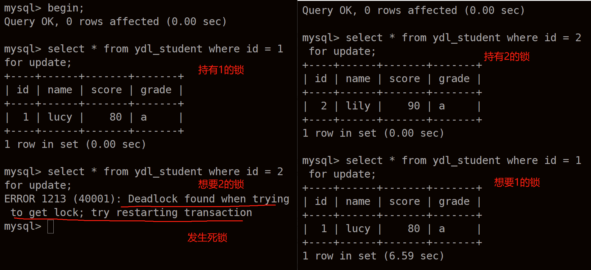

InnoDB 使用的是行级锁，在某种情况下会产生死锁问题，所以 InnoDB 存储引擎采用了一种叫作**等待图**（wait-for graph）的方法来自动检测死锁，如果发现死锁，就会自动回滚一个事务。

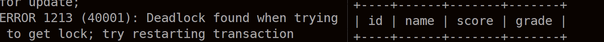

**在 MySQL 中，通常通过以下几种方式来避免死锁。**

- 尽量让数据表中的数据检索都通过索引来完成，避免无效索引导致行锁升级为表锁。
- 合理设计索引，尽量缩小锁的范围。
- 尽量减少查询条件的范围，尽量避免间隙锁或缩小间隙锁的范围。
- 尽量控制事务的大小，减少一次事务锁定的资源数量，缩短锁定资源的时间。如果一条 SQL 语句涉及事务加锁操作，则尽量将其放在整个事务的最后执行。

### 二、表锁

1、对于 InnoDB 表，在绝大部分情况下都应该使用【行级锁】，因为事务和行锁往往是我们之所以选择 InnoDB 表的理由。但在个另特殊事务中，也可以考虑使用表级锁。

- 第一种情况是：事务需要更新【大部分或全部数据】，表又比较大，如果使用默认的行锁，不仅这个事务执行效率低，而且可能造成其他事务长时间锁等待和锁冲突，这种情况下可以考虑使用表锁来提高该事务的执行速度。
- 第二种情况是：事务涉及多个表，比较复杂，很可能引起死锁，造成大量事务回滚。这种情况也可以考虑一次性锁定事务涉及的表，从而避免死锁、减少数据库因事务回滚带来的开销。

2、在 InnoDB 下 ，主动上表锁的方式如下：

```sql
lock tables teacher write,student read;
select * from teacher;
commit;
unlock tables;
```

使用时有几点需要额外注意：

- 使用【LOCK TALBES】虽然可以给 InnoDB 加表级锁，但必须说明的是，表锁不是由 InnoDB 存储引擎层管理的，而是由其上一层Ｍ ySQL Server 负责的，仅当 `autocommit=0`、`innodb_table_lock=1`（默认设置）时，InnoDB 层才能感知 MySQL 加的表锁，ＭySQL Server 才能感知 InnoDB 加的行锁，这种情况下，InnoDB 才能自动识别涉及表级锁的死锁；否则，InnoDB 将无法自动检测并处理这种死锁。
- 在用 `LOCAK TABLES` 对 InnoDB 加锁时要注意，事务结束前，不要用 `UNLOCAK TABLES` 释放表锁，因为 `UNLOCK TABLES` 会隐含地提交事务；`COMMIT` 或 `ROLLBACK` 不能释放用 `LOCAK TABLES` 加的表级锁，必须用 `UNLOCK TABLES` 释放表锁。
- 表锁的力度很大，慎用。

### 三、从另一个角度区分锁的分类

#### 1、乐观锁

乐观锁大多是基于数据【版本记录机制】实现，一般是给数据库表增加一个"version"字段。

读取数据时，将此版本号一同读出，

更新时，对此版本号加一。此时将提交数据的版本数据与数据库表对应记录的当前版本信息进行比对，如果提交的数据版本号大于数据库表当前版本号，则予以更新，否则认为是过期数据。

事务一：

```sql
select * from ydl_student where id = 1;
```

事务二：

```sql
select * from ydl_student where id = 1;
update ydl_student set score = 99,version = version + 1 where id = 1 and version = 1;
commit;
```

事务一：

```sql
update ydl_student set score = 100,version = version + 1 where id = 1 and version = 1;
commit;
```

发现更新失败，应为版本号被事务二、提前修改了，这使用了不加锁的方式，实现了一个事务修改期间，禁止其他事务修改的能力。

#### 2、悲观锁

> _总有刁民想害朕_

悲观锁依靠数据库提供的锁机制实现。MySQL 中的共享锁和排它锁都是悲观锁。数据库的增删改操作默认都会加排他锁，而查询不会加任何锁。此处不赘述。

## 第八章 日志系统

mysql 给我们提供了很多有用的日志，这是 mysql 服务层给我们提供的：

| 日志类型     | 写入日志的信息                                               |
| ------------ | ------------------------------------------------------------ |
| 二进制日志   | 记录了对 MySQL 数据库执行更改的所有操作                      |
| 慢查询日志   | 记录所有执行时间超过 `long_query_time` 秒的所有查询或不使用索引的查询 |
| 错误日志     | 记录在启动，运行或停止 mysqld 时遇到的问题                   |
| 通用查询日志 | 记录建立的客户端连接和执行的语句                             |
| 中继日志     | 从复制主服务器接收的数据更改                                 |

### 一、bin log 日志

#### 1、概述

二进制日志（binnary log）以【事件形式】记录了对 MySQL 数据库执行更改的所有操作。

binlog 记录了所有数据库【表结构】变更（例如 CREATE、ALTER TABLE…）以及【表数据】修改（INSERT、UPDATE、DELETE…）的二进制日志。不会记录 SELECT 和 SHOW 这类操作，因为这类操作对数据本身并没有修改，但可以通过查询通用日志来查看 MySQL 执行过的所有语句。

binlog 是 mysql server 层维护的，跟采用何种引擎没有关系，记录的是所有的更新操作的日志记录。binlog 是在事务最终 commit 前写入的。我们执行 SELECT 等不涉及数据更新的语句是不会记 binlog 的，而涉及到数据更新则会记录。要注意的是，对支持事务的引擎如 innodb 而言，必须要提交了事务才会记录 binlog。

binlog 文件写满后，会自动切换到下一个日志文件继续写，而不会覆盖以前的日志，这个也区别于 redo log，redo log 是循环写入的，即后面写入的可能会覆盖前面写入的。

binlog 有两个常用的使用场景：

- 主从复制：我们会专门有一个章节代领大家搭建一个主从同步的两台 mysql 服务。
- 数据恢复：通过 mysqlbinlog 工具来恢复数据。

mysql8 中的 binlog 默认是开启的，5.7 默认是关闭的，可以通过参数 log\_bin 控制：

#### 2、数据恢复

（1）确认 binlog 开启，log_bin 变量的值为 ON 代表 binlog 是开启状态：

```sql
show variables like '%log_bin%';
```

（2）为了防止干扰，我们 flush 刷新 log 日志，自此刻会产生一个新编号的 binlog 日志文件：

```sql
flush logs;
```

（3）查看所有 binlog 日志列表：

```sql
show master logs;
```


（4）查看 master 状态，即最后(最新)一个 binlog 日志的编号名称，及其最后一个操作事件 pos 结束点(Position)值，这一步可有可无：


（5）执行 sql

先创建表，并插入一些数据：

```sql
DROP TABLE IF EXISTS ydl_student;
CREATE TABLE `ydl_student` (
  `id` int(11) NOT NULL,
  `name` varchar(255) DEFAULT NULL,
  `score` int(255) DEFAULT NULL,
  `grade` varchar(255) DEFAULT NULL,
  PRIMARY KEY (`id`)
) ENGINE=InnoDB DEFAULT CHARSET=utf8mb4;
INSERT INTO `ydl_student`(`id`, `name`, `score`, `grade`) VALUES (1, 'lucy', 80, 'a');
INSERT INTO `ydl_student`(`id`, `name`, `score`, `grade`) VALUES (2, 'lily', 90, 'a');
INSERT INTO `ydl_student`(`id`, `name`, `score`, `grade`) VALUES (3, 'jack', 60, 'c');
INSERT INTO `ydl_student`(`id`, `name`, `score`, `grade`) VALUES (4, 'hellen', 40, 'd');
INSERT INTO `ydl_student`(`id`, `name`, `score`, `grade`) VALUES (5, 'tom', 60, 'c');
INSERT INTO `ydl_student`(`id`, `name`, `score`, `grade`) VALUES (6, 'jerry', 10, 'd');
INSERT INTO `ydl_student`(`id`, `name`, `score`, `grade`) VALUES (7, 'sily', 20, 'd');
```

执行删除操作，假装误删除，直接全部删除也可以，把表删了都行，一样的道理：

```sql
delete from ydl_student where id in (3,5);
```

（6）查看 binlog 日志，我们因为刷新了日志，所以本次操作都会在最新的日志文件上：

因为 binlog 的日志文件是二进制文件，不能用文本编辑器直接打开，需要用特定的工具来打开，MySQL 提供了 mysqlbinlog 来帮助我们查看日志文件内容：

```shell
# 查看全部的日志信息
/www/server/mysql/bin/mysqlbinlog -v mysql-bin.000008
# 指定位置范围
/usr/bin/mysqlbinlog -v mysql-bin.000013 --start-position=0 --stop-position=986
# 指定时间范围
/usr/bin/mysqlbinlog -v mysql-bin.000013 --start-datetime="2022-06-01 11:18:00" --stop-datetime="2022-06-01 12:18:00"
```

真实的情况下，我们的日志文件比较复杂，内容比较多使用时间范围查询后任然可能需要花费时间去排查问题，这里我们找到了误删除的位置：

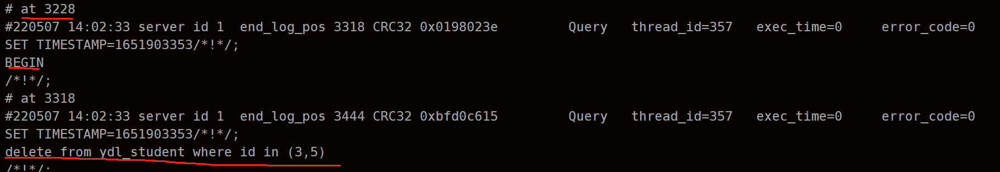

（7）执行恢复，通过上一步的操作，我们找到了删除的位置 3228（即第二个红框），执行下面的语句：

```shell
/www/server/mysql/bin/mysqlbinlog -v mysql-bin.000008 --stop-position=3228 -v | mysql -uroot -p
```

（8）至此，数据已完全恢复了：


binlog 的数据恢复的本质，就是将之前执行过的 sql，从开始到指定位置全部执行一遍，如果报错【当前表已经存在】，就将数据库的表删除，重新恢复。

#### 3、格式分类

binlog 有三种格式， 使用变量 `binlog_format` 查看当前使用的是哪一种：

- **Statement(Statement-Based Replication,SBR)**: 每一条会修改数据的 SQL 都会记录在 binlog 中。
- **Row(Row-Based Replication,RBR)**: 不记录 SQL 语句上下文信息，仅保存哪条记录被修改。
- **Mixed(Mixed-Based Replication,MBR)**: Statement 和 Row 的混合体，当前默认的选项，5.7 中默认 row。

我们举一个例子来说明 row 和 statement 的区别，在下面的插入语句中我们有一个函数 `uuid()`，如果日志文件仅仅保存 sql 语句，下一次执行的结果可能不一致，所以 Row 格式的文件，他保存的是具体哪一行，修改成了什么数据，记录的是数据的变化，不是简单的 sql：

```sql
insert into ydl_student values (8,UUID(),45,'d');
```

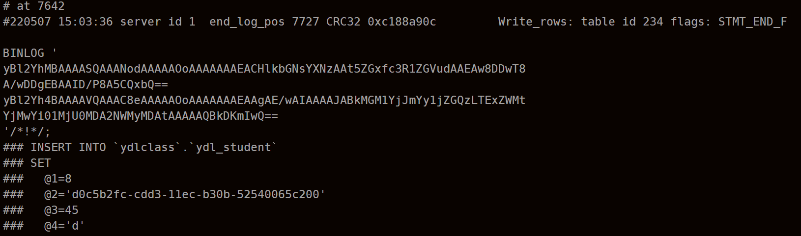

Statement 和 row 的优劣

- Statement 模式只记录执行的 SQL，不需要记录每一行数据的变化，因此极大的减少了 binlog 的日志量，避免了大量的 IO 操作，提升了系统的性能。
- 由于 Statement 模式只记录 SQL，而如果一些 SQL 中 包含了函数，那么可能会出现执行结果不一致的情况。比如说 uuid() 函数，每次执行的时候都会生成一个随机字符串，在 master 中记录了 uuid，当同步到 slave 之后，再次执行，就得到另外一个结果了。所以使用 Statement 格式会出现一些数据一致性问题。
- 从 _MySQL5.1.5_ 版本开始，binlog 引入了 Row 格式，Row 格式不记录 SQL 语句上下文相关信息，仅仅只需要记录某一条记录被修改成什么样子了。
- 不过 Row 格式也有一个很大的问题，那就是日志量太大了，特别是批量 update、整表 delete、alter 表等操作，由于要记录每一行数据的变化，此时会产生大量的日志，大量的日志也会带来 IO 性能问题。

#### 4、日志格式

- binlog 文件以一个值为 0Xfe62696e 的魔数开头，这个魔数对应 0xfebin。
- binlog 由一系列的 binlog event 构成。每个 binlog event 包含 header 和 data 两部分。

- header 部分提供的是 event 的公共的类型信息，包括 event 的创建时间，服务器等等。
- data 部分提供的是针对该 event 的具体信息，如具体数据的修改。

常见的事件类型有：

- **FORMAT_DESCRIPTION_EVENT**：该部分位于整个文件的头部，每个 binlog 文件都必定会有唯一一个该 event
- **WRITE_ROW_EVENT**：插入操作。
- **DELETE_ROW_EVENT**：删除操作。
- **UPDATE_ROW_EVENT**：更新操作。记载的是一条记录的完整的变化情况，即从**前量**变为**后量**的过程
- **ROTATE_EVENT**：Binlog 结束时的事件，用于说明下一个 binlog 文件。

一个 event 的结构如下，我们在恢复数据的时候已经看到了：


- 每个日志的最后都包含一个 rotate event 用于说明下一个 binlog 文件。
- binlog 索引文件是一个文本文件，其中内容为当前的 binlog 文件列表，比如下面就是一个 mysql-bin.index 文件的内容。


#### 5、binlog 刷盘

二进制日志文件并不是每次写的时候同步到磁盘。因此当数据库所在操作系统发生宕机时，可能会有最后一部分数据没有写入二进制日志文件中，这给恢复和复制带来了问题。
​ 参数 `sync_binlog=[N]` 表示每写多少次就同步到磁盘。如果将 N 设为 1，即 sync_binlog=1 表示采用同步写磁盘的方式来写二进制日志，这时写操作不使用操作系统的缓冲来写二进制日志。（备注：该值默认为 0，采用操作系统机制进行缓冲数据同步）。

#### 6、binlog 实现主从同步

数据库单点部署的问题：

- 服务器宕机，会导致业务停顿，影响客户体验。
- 服务器损坏，数据丢失，不能及时备份，造成巨大损失。
- 读写操作都在同一台服务器，在并发量大的情况下性能存在瓶颈。

那么我们就可以使用 mysql 的 binlog 搭建一个一主多从的 mysql 集群服务。这样的服务可以帮助我们异地备份数据、进行读写分离，提高系统的可用性。

##### **（1） 主从复制工作原理剖析**

- Master 数据库只要发生变化，立马记录到 Binary log 日志文件中
- Slave 数据库启动一个 I/O thread 连接 Master 数据库，请求 Master 变化的二进制日志
- Slave I/O 获取到的二进制日志，保存到自己的 Relay log 日志文件中。
- Slave 有一个 SQL thread 定时检查 Realy log 是否变化，变化那么就更新数据

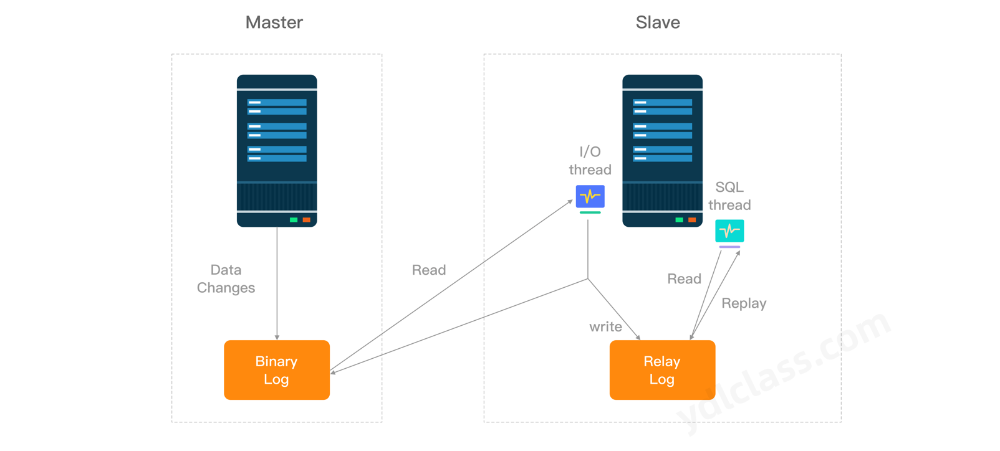

##### **（2）怎么配置 mysql 主从复制**

---

环境准备

安装两个 mysql，使用 vmvare 安装两个 linux 系统就可以：

```sql
mysql1(master): 42.192.181.133:3306
mysql2(slave): 124.220.197.17:3306
```

mysql 配置文件配

mysql1（master）: 配置文件设置，开启 bin_log（已经开启的可以忽略）且需要配置一个 server-id

```ini
# mysql master1 config
[mysqld]
server-id = 1            # 节点ID，确保唯一

# log config
log-bin = master-bin     #开启mysql的binlog日志功能
```

mysql2（slave）: 需要开启中继日志

```ini
[mysqld]
server-id=2
relay-log=mysql-relay-bin
replicate-wild-ignore-table=mysql.%
replicate-wild-ignore-table=sys.%
replicate-wild-ignore-table=information_schema.%
replicate-wild-ignore-table=performance_schema.%
```

重启两个 mysql，让配置生效。

**第三步 在 master 数据库创建复制用户并授权**

1.进入 master 的数据库，为 master 创建复制用户

```sql
CREATE USER 'repl'@'124.220.197.17' IDENTIFIED BY 'Root12345_';
```

2.赋予该用户复制的权利

```sql
grant replication slave on *.* to 'repl'@'124.220.197.17'
FLUSH PRIVILEGES;
```

3.查看 master 的状态

```shell
show master status;
mysql> show master status;
+------------------+----------+--------------+------------------+-------------------+
| File             | Position | Binlog_Do_DB | Binlog_Ignore_DB | Executed_Gtid_Set |
+------------------+----------+--------------+------------------+-------------------+
| mysql-bin.000005      120|              | mysql            |                   |
+------------------+----------+--------------+------------------+-------------------+
1 row in set (0.00 sec)
```

4.配置从库

```properties
CHANGE MASTER TO
MASTER_HOST = '42.192.181.133',
MASTER_USER = 'repl',
MASTER_PASSWORD = 'Root12345_',
MASTER_PORT = 3306,
MASTER_LOG_FILE='mysql-bin.000020',
MASTER_LOG_POS=2735,
MASTER_HEARTBEAT_PERIOD = 10000;

# MASTER_LOG_FILE与主库File 保持一致
# MASTER_LOG_POS=120 , #与主库Position 保持一致
```

解释：`MASTER_HEARTBEAT_PERIOD` 表示心跳的周期。当 `MASTER_HEARTBEAT_PERIOD` 时间之内，master 没有 binlog event 发送给 slave 的时候，就会发送心跳数据给 slave。

5.启动从库 slave 进程

```shell
mysql> start slave;
Query OK, 0 rows affected (0.04 sec)
```

6.查看是否配置成功

```sql
show slave status \G;
```

- **Slave_IO_Running**：从库的 IO 线程，用来接收 master 发送的 binlog，并将其写入到中继日志 relag log
- **Slave_SQL_Running**：从库的 SQL 线程，用来从 relay log 中读取并执行 binlog。
- **Slave_IO_Running**、**Slave_SQL_Running**：这两个进程的状态需全部为 YES，只要有一个为 NO，则复制就会停止。
- **Master_Log_File**：要同步的主库的 binlog 文件名。
- **Read_Master_Log_Pos**：已同步的位置，即同步的 binlog 文件内的字节偏移量，该值会随着主从同步的进行而不断地增长。
- **Relay_Log_File**：从库的中继日志文件，对接收到的主库的 binlog 进行缓冲。从库的 SQL 线程不断地从 relay log 中读取 binlog 并执行。
- **Relay_Log_Pos**：relay log 中已读取的位置偏移量。
- **Seconds_Behind_Master**: 主从同步延时, 值为 0 为正常情况，正值表示已经出现延迟，数字越大从库落后主库越多。

7.在主库创建一个数据库、创建一张表，执行一些 sql 语句进行测试。

##### （3）可能遇到的问题

在配置 mysql 主从复制的时候可能出现一下错误：

```shell
Fatal error: The slave I/O thread stops because master and slave have equal MySQL server UUIDs; these UUIDs must be different for replication to work.
```

**原因**

如果你使用了两台虚拟机，一主一从，从库的 mysql 是直接克隆的。在 mysql 5.6 的复制引入了 uuid 的概念，各个复制结构中的 server_uuid 得保证不一样，但是查看到直接克隆 data 文件夹后 server_uuid 是相同的。

**解决**

找到 data 文件夹下的 auto.cnf 文件，修改里面的 server_uuid 值，保证各个 db 的 server_uuid 不一样，重启 db 即可。

```bash
cd /www/server/data
```

修改 server_uuid 的值


使用

```sql
select uuid();
```

生成一个 uuid 即可，重启数据库。

### 二、其他日志

#### 1、通用查询日志，默认关闭

MySQL 通用查询日志，它是记录建立的客户端连接和执行的所有 DDL 和 DML 语句(不管是成功语句还是执行有错误的语句)，默认情况下，它是不开启的。请注意，它也是一个文本文件。

可以通过以下的 sql 查看查询日志的状态：

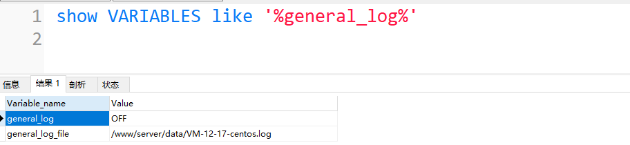

使用以下命令开启通用查询日志，一般不开启，这是为了测试，当然也可以修改配置文件，重启服务：

```shell
# 在全局模式下，开启通用查询日志，1表示开启，0表示关闭
SET global general_log=1;
```

开启后，我们随便执行 sql 语句之后，你会发现 data 目录多了以下文件：


使用 more 命令查看该文件：

```bash
more VM-12-17-centos.log
```

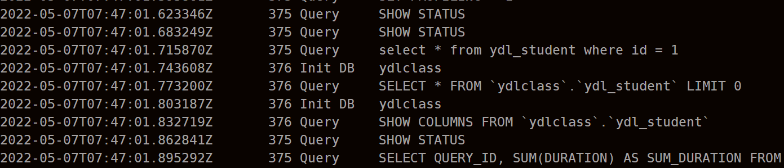

#### 2、慢查询日志

当前版本慢查询日志默认是开启的，有的版本是关闭的，使用如下命令查看慢查询日志的状态：

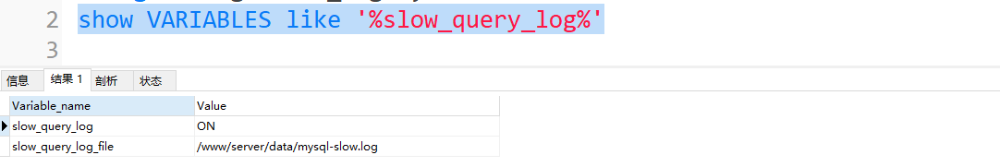

那么，何为慢？mysql 通过一个变量 ‘long_query_time’ 来确定 sql 慢不慢，执行时间大于该值就会被记录在慢查询日志中，默认是 3s：

```sql
show variables like 'long_query_time'
```


以下是【慢查询日志】的记录文本：

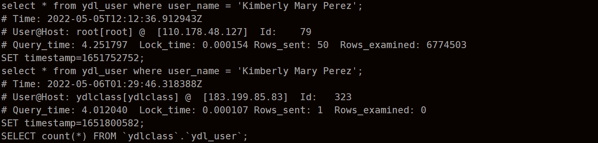

#### 3、错误日志

错误日志（Error Log）主要记录 MySQL 服务器启动和停止过程中的信息、服务器在运行过程中发生的故障和异常情况等。一旦发生 mysql 服务无法启动、程序崩溃一定要记得去查询错误日志：

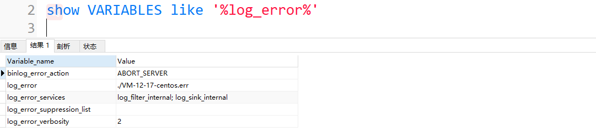

我们随便人为一个错误导致他无法启动，重新启动 mysql 命令如下：

```shell
service mysqld restart
systemctl mysqld restart
```

我们将 inndb 的系统表空间文件重命名，重新启动 mysql 服务，发生问题：

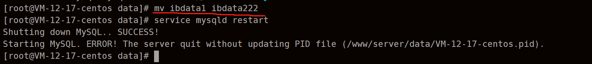

查询错误日志，寻找蛛丝马迹：

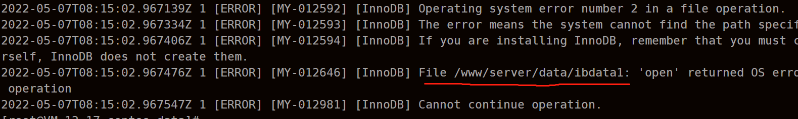

修改回正确的名字，重新启动成功：


### 三、redo log 日志

接下来的两个日志，是 innodb 为解决不同问题而引出的两类日志文件。

redo log（重做日志）的设计主要是为了防止因系统崩溃而导致的数据丢失，其实解决因系统崩溃导致数据丢失的思路如下：

1、每次提交事务之前，必须将所有和当前事务相关的【buffer pool 中的脏页】刷入磁盘，但是，这个效率比较低，可能会影响主线程的效率，产生用户等待，降低响应速度，因为刷盘是 I/O 操作，同时一个事务的读写操作也不是顺序读写。

2、把当前事务中修改的数据内容在日志中记录下来，日志记录是顺序写，性能很高。其实 mysql 就是这么做的，这个日志被称为 redo log。执行事务中，每执行一条语句，就可能有若干 redo 日志，并按产生的顺序写入磁盘，redo 日志占用的空间非常小，当 redo log 空间满了之后又会从头开始以循环的方式进行覆盖式的写入。

redo log 的格式比较简单，包含一下几个部分：

- type：该日志的类型，在 5.7 版本中，大概有 53 种不同类型的 redo log，占用一个字节
- space id：表空间 id
- page number：页号
- data：日志数据

#### 1、MTR

在 innodb 执行任务时，有很多操作，必须具有原子性，我们把这一类操作称之为 MIni Transaction，我们以下边的例子为例：

在我们向 B+树中插入一条记录的时候，需要定位这条数据将要插入的【数据页】，因为插入的位置不同，可能会有以下情况：

1、待插入的页拥有【充足的剩余空间】，足以容纳这条数据，那就直接插入就好了，这种情况需要记录一条【MLOG_COMP_REC_INSERT 类型】的 redo 日志就好了，这种情况成为乐观插入。

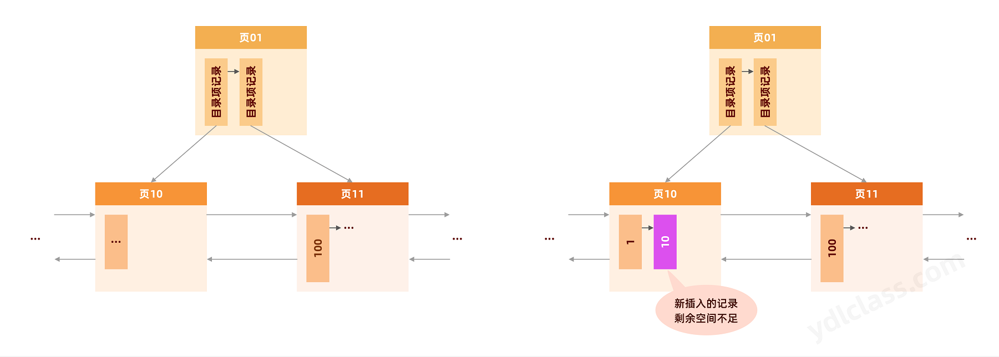

2、待插入的页【剩余空间不足】以容纳该条记录，这样就比较麻烦了，必须进行【页分裂】了。必须新建一个页面，将原始页面的数据拷贝一部分到新页面，然后插入数据。这其中对应了好几个操作，必须记录多条 rede log，包括申请新的数据页、修改段、区的信息、修改各种链表信息等操作，需要记录的 redo log 可能就有二三十条，但是本次操作必须是一个【原子性操作】，在记录的过程中，要全部记录，要么全部失败，这种情况就被称之为一个 MIni Transaction（最小事务）。

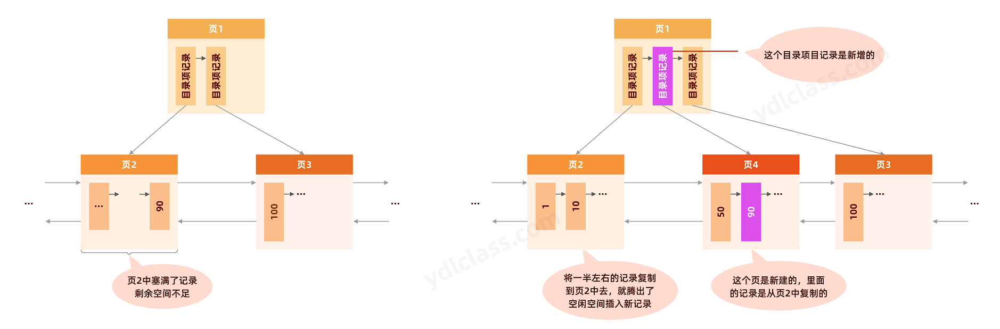

**（1）MTR 的按组写入**

对于一个【MTR】操作必须是原子的，为了保证原子性，innodb 使用了组的形式来记录 redo 日志，在恢复时，要么这一组的的日志全部恢复，要么一条也不恢复。innodb 使用一条类型为 MLO_MULTI_REC_END 类型的 redo log 作为组的结尾标志，在系统崩溃恢复时只有解析到该项日志，才认为解析到了一组完整的 redo log，否则直接放弃前边解析的日志。


**（2）单条 redolog 的标识方法**

有些操作只会产生一条 redo log，innodb 是通过【类型标识】的第一个字符来判断，这个日志是单一日志还是组日志，如下图：


**（3）事务、sql、MTR、redolog 的关系如下**

- 一个事务包含一条或多条 sql
- 一条 sql 包含一个或多个 MTR
- 一个 MTR 包含一个或多个 redo log

#### 2、log buffer

任何可能产生大量 I/O 的操作，一般情况下都会设计【缓冲层】，mysql 启动时也会向操作系统申请一片空间作为 redo log 的【缓冲区】，innodb 使用一个变量 `buf_free` 来标记下一条 redo log 的插入位置（标记偏移量），log buffer 会在合适的时机进行刷盘：

- log buffer 空间不足。logbuffer 的容量由 `innodb_log_buffer_size` 指定，当写入 log buffer 的日志大于容量的 50%，就会进行刷盘。
- 提交事务时，如果需要实现崩溃恢复，保证数据的持久性，提交事务时必须提交 redo log，当然你也可以为了效率不去提交，可以通过修改配置文件设置该项目。
- 后台有独立线程大约每隔一秒会刷新盘一次。
- 正常关闭服务器。
- 做 checkpoint 时，后边会讲。

有缓冲就可能存在数据不一致，咱们接着往下看。

#### 3、checkpoint

redo log 日志文件容量是有限的，需要循环使用，redo log 的作用仅仅是为了在崩溃时恢复脏页数据使用的，如果脏页已经刷到磁盘上，其对应的 redo log 也就没用了，他也就可以被重复利用了。**checkpoint 的作用就是用来标记哪些旧的 redo log 可以被覆盖。**

我们已经知道，判断 redo log 占用的磁盘空间是否可以被重新利用的标志就是，对应的脏页有没有被刷新到磁盘。为了实现这个目的，我们需要了解一下下面几个记录值的作用：

**（1）lsn**

**lsn(log sequence number)** 是一个全局变量。mysql 在运行期间，会不断的产生 redo log，日志的量会不断增加，innodb 使用 lsn 来记录当前总计写入的日志量，lsn 的初始值不是 0，而是 8704，原因未知。系统在记录 lsn 时是按照【偏移量】不断累加的。**lsn 的值越小说明 redo log 产生的越早。**

每一组 redo log 都有一个唯一的 lsn 值和他对应，你可以理解为 lsn 是 redo log 的年龄。

**（2）flush_to_disk_lsn**

`flush_to_disk_lsn` 也是一个全局变量，表示已经刷入磁盘的 redo log 的量，他小于等于 lsn，举个例子：

1、将 redo log 写入 log buffer，lsn 增加，假如：$8704+1024 = 9728$，此时 `flush_to_disk_lsn` 不变。

2、刷如 512 字节到磁盘，此时 $flush\_to\_disk\_lsn=8704+512=9256$。

如果两者数据相同，说明已经全部刷盘。

**（3）flush 链中的 lsn**

其实要保证数据不丢失，核心的工作是要将 buffer pool 中的脏页进行刷盘，但是刷盘工作比较损耗性能，需要独立的线程在后台静默操作。

回顾一下 flush 链，当第一次修改某个已经加载到 buffer pool 中的页面时，他会变成【脏页】，会把他放置在 flush 链表的头部，flush 链表是按照第一次修改的时间排序的。再第一次修改缓冲页时，会在【缓冲页对应的控制块】中，记录以下两个属性：

- **oldest_modification**：**第一次**修改缓冲页时，就将【修改该页面的第一组 redo log 的 lsn 值】记录在对应的控制块。
- **newest_modification**：**每一次**修改缓冲页时，就将【修改该页面的最后组 redo log 的 lsn 值】记录在对应的控制块。

既然 flush 链表是按照修改日期排序的，那么也就意味着，`oldest_modification` 的值也是有序的。

**（4）checkpoint 过程**

执行一个 check point 可以分为两个步骤

**第一步**：计算当前 redo log 文件中可以被覆盖的 redo 日志对应的 lsn 的值是多少：

1、flush 链是按照第一次修改的时间排序的，当然控制块内的【oldest_modification】记录的 lsn 值也是有序的。

2、我们找到 flush 链表的头节点上的【oldest_modification】所记录的 lsn 值，也就找到了一个可以刷盘的最大的 lsn 值，小于这个值的脏页，肯定已经刷入磁盘。

3、所有小于这个 lsn 值的 redo log，都可以被覆盖重用。

4、将这个 lsn 值赋值给一个全局变量 `checkpoint_lsn`，他代表可以被覆盖的量。

**第二步**：将 `checkpoint_lsn` 与对应的 redo log 日志文件组偏移量以及此次 checkpoint 的编号（`checkpoint_no` 也是一个变量，记录了 checkpoint 的次数）全部记录在日志文件的管理信息内。

#### 4、一个事务的执行流程

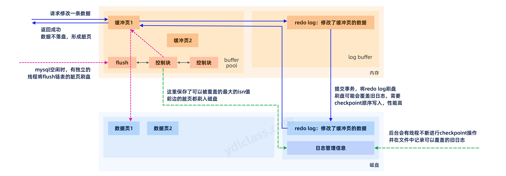

主线程：

1. 客户端访问 mysql 服务，在 buffer pool 中进行操作（如果目标页不在缓冲区，需要加载进入缓冲区），此时会形成脏页。
2. 记录 redo log，可能产生很多组日志，redo log 优先记录在缓冲区，会在提交事务前刷盘。
3. 刷盘时根据 checkpoint 的结果，选择可以使用的日志空间进行记录。
4. 成功后即可返回，此时数据不会落盘，这个过程很多操作只在内存进行，只需要记录 redo log（顺序写），所以速度很快。

线程 1：

1. 不断的对 flush 链表的脏页进行刷盘，对响应时间没有过高要求。

线程 2：

1. 不断的进行 checkpoin 操作，保证 redo log 可以及时写入。

#### 5、系统崩溃的影响

（1）**log buffer 中的日志丢失**，log buffer 中的日志会在每次事务前进行刷盘，如果在事务进行中崩溃，事务本来就需要回滚。

（2）**buffer pool 中的脏页丢失**，崩溃后可以通过 redo log 恢复，通过 checkpoint 操作，我们可以确保，内存中脏页对应的记录都会在 redo log 日志中存在。

redo log 保证了崩溃后，数据不丢失，但是一个事务进行中，如果一部分 redo log 已经刷盘，那么系统会将本应回滚的数据同样恢复，为了解决回滚的问题，innodb 提出了 undo log。

### 四、undo log 日志

#### 1、概述

undo log（也叫撤销日志或者回滚日志），他的主要作用是为了实现回滚操作。同时，他是 MVCC 多版本控制的核心模块。undo log 保存在共享表空间【ibdata1 文件】中。

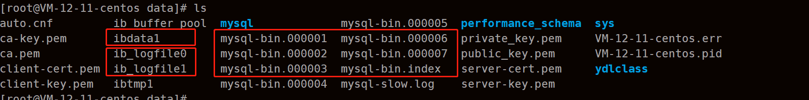

**注意**：MySQL 8.0 以后 undolog 有了独立的表空间：


在讲 undo log 之前需要先了解行数据中的两个隐藏列：

#### 2、事务 id（trx_id）

我们已经讲过，在 innodb 的行数据中，会自动添加两个隐藏列，一个是【trx_id】，一个是【roll_pointer】，本章节会详细介绍这两列的具体作用，如果该表中没有定义主键，也没有定义【非空唯一】列，则还会生成一个隐藏列【row_id】，这个我们之间也讲过，是为了生成聚簇索引使用的。

事务 id 是一个自增的全局变量，如果一个【事务】对任意表做了【增删改】的操作，那么 innodb 就会给他分配一个独一无二的事务 id。

**冷知识：**

- 事务 id 保存在一个全局变量【MAX_TRX_ID】上，每次事务需要分配事务 id，就会从这个全局变量中获取，然后自增 1。
- 该变量每次自增到 256 的倍数会进行一个落盘（保存在表空间页号为 5 的页面中），发生服务停止或者系统崩溃后，再起启动服务，会读取这个数字，然后再加 256。这样做既保证不会有太多 I/O 操作，还能保证 id 的有序增长。比如：读到 256 进行落盘，后来有涨到 302，突然崩溃了，下次启动后，第一个事务的 id 就是 256+256=512，保证新的事务 id 一定大。

#### 3、roll_pointer

undo log 在记录日志时是这样记录的，每次修改数据，都会将修改的数据标记一个【新的版本】，同时，这个版本的数据的地址会保存在修改之前的数据的 roll_pointer 列中，如下：


#### 4、分类

当我们对数据库的数据进行一个操作时必须记录之前的信息，将来才能【悔棋】，如下：

- 插入一条数据时，至少要把这条数据的主键记录下来，以后不想要了直接根据主键删除。
- 删除一条数据时，至少要把这个数据所有的内容全部记录下来，以后才能全量恢复。但事实上不需要，每行数据都有一个 delete_flag，事务中将其置 1，记录 id，如需要回滚根据 id 复原即可，提交事务后又 purge 线程处理垃圾。
- 修改一条数据时，至少要将修改前后的数据都保存下来。

innodb 将 undo log 分为两类：

- 一类日志只记录插入类型的操作（insert）
- 一类日志只记录修改类型的操作（delete，update）

什么分为这两类呢？

- 插入型的记录不需要记录版本，事务提交以后这一片空间就可以重复利用了。
- 修改型的必须将每次修改作为一个版本记录下来，即使当前事务已经提交，也不一定能回收空间，应为其他事务可能在用。

#### 5、物理存储结构

undo log 同样是以页的形式进行存储的，多个页是使用链表的形式进行管理，针对【普通表和临时表】，【插入型和修改型】的数据，一个事务可能会产生以下四种链表：

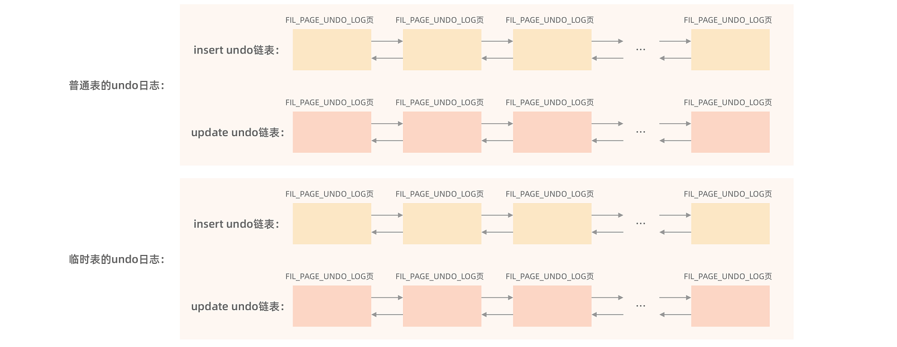

这是物理存储模型，分成四种类型，是为了更好的管理。

#### 6、记录流程

1. 开启事务，执行【增删改】时获得【事务 id】。
2. 在系统表空间中第 5 号页中，分配一个回滚段，回滚段是轮动分配的，比如，当前事务使用第 5 个回滚段，下个事务就使用第 6 个。【回滚段】是一个【数据页】，里边划分了 1024 个 undo slot，用来存储日志链表的头节点地址。
3. 在当前回滚段的 cached 链表（回收可复用的）和空闲 solt 中，找到一个可用的 slot，找不到就报错。
4. 创建或复用一个 undo log 页，作为 first undo page，并把他的地址写入 undo solt 中。

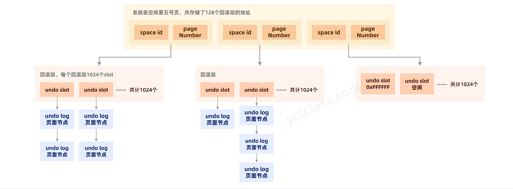

#### 7、回滚过程

1. 服务再次启动时，通过表空间 5 号页面定位到 128 个回滚段的位置，
2. 遍历所有的 slot，找到所有状态不为空闲的 slot，并且通过 undolog 的标记为找到现在活跃（未提交）的所有的事务 id
3. 根据 undo log 的记录，将数据全部回滚

## 第九章、隔离级别和 MVCC

【MVCC】，全称 _Multi-Version Concurrency Control_，即【多版本并发控制】。MVCC 在 MySQL InnoDB 中的实现主要是为了提高数据库的并发性能，用更好的方式去处理【读-写冲突】，做到即使有【读写冲突】时，也能做到不加锁，非阻塞并发读，学习 mvcc 之前我们需要学习一些新的概念。

### 一、Read View（读视图）

在学习 MVCC 多版本并发控制之前，我们必须先了解一下，什么是 MySQL InnoDB 下的【当前读】和【快照读】，我们都知道 undo log 会记录一个事务对一条数据的所有修改，并形成版本链：

- **当前读**：像 select lock in share mode（锁）、 select for update、 update、insert、delete（排他锁）这些操作都是【当前读】，他读取的是记录的【最新版本】，读取时还要保证其他【并发事务】不能修改当前记录，会对读取的记录进行加锁。
- **快照读**：像不加锁的 select 操作就是快照读，即不加锁的【非阻塞读】；快照读的前提是【隔离级别不是串行级别】，串行级别下的快照读会【退化成当前读】，顾名思义，快照读读取的是【快照】，他是通过 readView 实现的。

#### 1、实现原理

Read View 就是事务进行【快照读】的时候生产的【读视图】(Read View)，在该事务【执行快照读】的那一刻，会生成数据库系统当前的一个快照。

**注意：**【快照】不是说将数据库复制一份，【Read View】的主要作用是做【可见性判断】， 快照的实现逻辑是通过 undo log 的【版本链】，配合一些【参数】，比如事务 id，来确定当前事务可以读取的版本。

#### 2、readView 的结构

举一个列子，当前有事务 id 为 12、13、14、16、20 的五个事务，他们在同时修改一条数据，此时，事务 13 发生读取行为，在【事务 13】读取之前【事务 14】已经提交，当前场景下，将产生一个 readview 如下：

一个 readView 就是一个【结构体】，你甚至可以理解成为 java 里的实例（readview）和属性，包含属性如下：

- **m_ids**：生成该 readview 时，当前系统中【活跃的事务】id 列表。对于当前案例，因为 14 已经提交，就不活跃了，所以该变量的值为[12,13,16,20]。
- **min_trx_id**：当前系统【活跃事务】中最小的【事务 id】，他也是 m_ids 的最小值，当前案例的值就是 12。
- **max_trx_id**：当前系统中计划分配给下一个事务的 id，他可能是 m_ids 的最大值+1，也可能比他大。当前案例值假设为 22。
- **creator_trx_id**：生成这个 readView 的事务 id，当前案例的值为 12。

以上 readview 配合 undo log 就可以形成一个【快照】，那他是怎么读取的呢？

### 二、快照读原理解析

在一个事务读取数据时，会根据当前数据形成一个 readview，读取时会按照以下逻辑进行读取：

- 如果【被访问数据的事务 trx_id】和 readView 中的【creator_trx_id 值】相同，意味着自己在访问自己修改过的记录，当然可以被访问。
- 如果【被访问数据的事务 trx_id】小于 readView 中的【min_trx_id】值，说明生成这个版本数据的事务，在生成 readview 前已经提交，这样的数据也可以访问。
  **通俗一点**：这个数据之前被其他的事务修改过，但是事务已经提交，所以这个版本的数据是可以使用的，这样不会产生脏读。
- 如果【被访问数据的事务 trx_id】大于等于 readView 中的 max_trx_id 值，说明生成这个版本数据的事务，是在生成 readview 后开启，这样的数据不应该被访问。
  **通俗一点**：你读取数据之后，有人修改了当前数据，那人家后边修改的数据，你也不能读。
- 如果【被访问数据的事务 trx_id】如果在 min_trx_id 和 max_trx_id 范围内，则需要判断是不是在【m_ids】中（目的是判断这个数据是不是已经提交）。如果在，说明生成这个版本的事务还是活跃的，没有提交的事务产生的数据当然不能读，如果不在，说明事务已经提交，该数据可以被访问。
  **通俗一点**：这个数据被现在活跃的其他事务正在修改中，读取时要看此时这个事务是不是已经提交，目的也是为了不要读取别人未提交的事务。

我们用下边的案例来看一下这个过程：

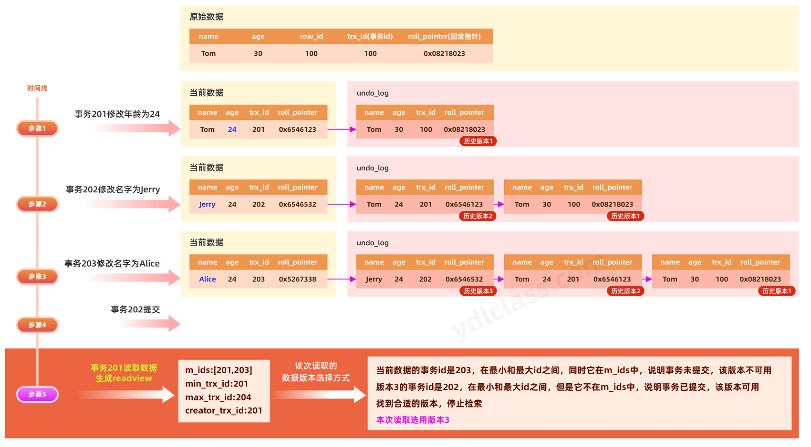

### 三、解决脏读和不可重复读

对于 RU 隔离级别的事务来说，由于可以读取到未提交的事务，所有直接读取【最新的记录】（当前读）就可以，对于 serializable 的事务来说，必须使用加锁的方式来访问。

#### 1、解决脏读

先思考一个问题，脏读指的是在当前事务中读取到了其他事务未提交的数据，那解决的思路是什么：

**（1）没有 undo+mvcc**

一个事务读取了数据之后，立马给这个数据加写锁，不允许其他事务进行修改，这是加锁解决脏读。

**（2）使用 undo+mvcc**

所有事务对数据的修改，记录成版本链，使用 readview 进行版本选择，每个事务只能读取满足条件的数据，这个过程不需要加锁。

使用 mvcc 很好的解决了【读写操作】的并发执行，而且采用了无锁机制。

#### 2、解决不可重复读

[RC](#_2、读已提交-rc) 和 [RR](#_1、读未提交-ru) 两个隔离级别解决不可重复读是通过生成 readview 时间不同

**（1）RC 隔离级别**，同一个事务中【每次读取数据时都生成一个新的 ReadView】，两次读取时，如果中间有其他事务进行提交，可能会生成两个不同的 readview，导致当前事务中，两次读取的数据不一致，这就是不可重复读。具体的执行流程如下：

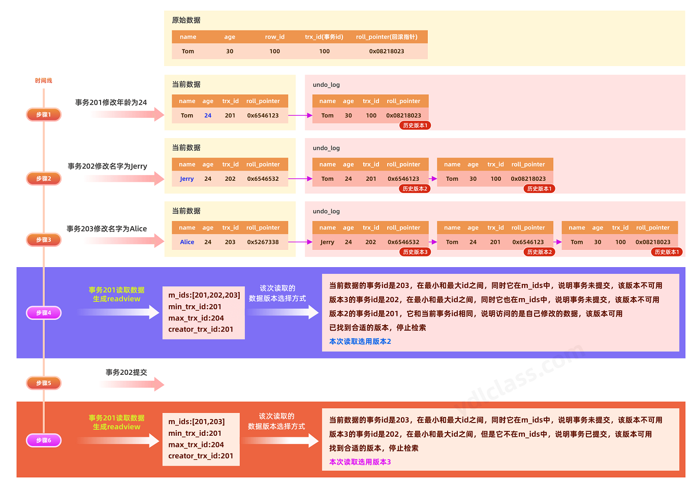

**（2）RR 隔离级别**，同一个事务中【只在第一次读取数据时生成一个 ReadView】，以后这个事务中一直使用这个 readview，那么同一个事务中就能保证多次读取的数据是一致的，具体的执行流程如下：

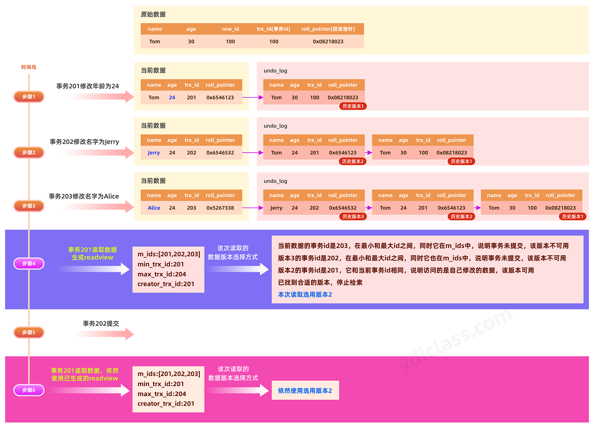

#### 3、解决幻读

它是通过间隙锁实现的，一旦锁定某一个范围的数据，就会对这个范围的数据加锁，间隙锁保证我们**不能在这个范围内插入新的数据。**

## 第十章 其他知识

### 一、触发器

与表有关的数据对象，在满足某种条件的时候，被动执行的 SQL 语句。

#### 1、触发器的特性

1. 有 begin、end 的结构体（多条 sql 语句）
2. 需要指定触发的条件：`INSERT`，`UPDATE`，`DELETE`
3. 有指定的触发时间：`BEFORE`，`AFTER`

#### 2、触发器的创建

- 单条业务逻辑的触发器创建

```sql
/*
CREATE TRIGGER 触发器名称 BEFORE|AFTER INSERT|UPDATE|DELETE ON 表名
FOR EACH ROW 业务逻辑
*/
#当b_user表中插入数据后，b_log表中也插入一条数据
CREATE TRIGGER trigger_insert AFTER INSERT ON b_user
FOR EACH ROW INSERT INTO b_log(字段) VALUES('插入数据')
```

- 多条业务逻辑的触发器

```sql
/*
DELIMITER $
CREATE TRIGGER 触发器名称 BEFORE|AFTER INSERT|UPDATE|DELETE ON 表名
FOR EACH ROW
BIGIN
INSERT...;
UPDATE...;
END;$
*/
#在b_user表中插入数据前，b_log表中插入2条数据
DELIMITER $
CREATE TRIGGER trigger_ insert_before BEFORE INSERT ON b_user
FOR EACH ROW
BEGIN
INSERT INTO b_log(comments,name) values('insert1' ，NEW.name);
INSERT INTO b_log(comments,name) values('insert2' , NEW.name) ;
END;$
```

**总结**

- `BEFORE`|`AFTER INSERT` 用于获取将要插入的数据
- `BEFORE`|`AFTER UPDATE`|`DELETE` 用于获取已经修改或删除的数据

#### 3、删除触发器

```sql
DROP TRIGGER 触发器名称
```

### 二、存储过程

#### 1、 变量

##### 1.1 系统变量

由 mysql 数据库管理系统提供的，变量名称固定，可以修改和查看值，分为**全局变量**和**会话变量**

**全局变量**：当 mysql 服务没有重启时，我们可以查看和修改的变量

**会话变量**：和 MySQL 连接形成的会话，生命周期在整个会话过程中

全局变量用 global 修饰，会话变量用 session 修饰，通常 session 可以省略

- 查看系统变量

```sql
SHOW GLOBAL variables; -- 查看全局变量
SHOW SESSION variables; -- 查看会话变量
SHOW variables; -- 查看会话变量
SHOW GLOBAL variables like '%dir%'; -- 模糊查询环境变量
SELECT @@datadir; -- 查看全局系统变量
SELECT @@session_track_transaction_info;
```

- 修改系统变量

```sql
SHOW GLOBAL variables like 'autocommit'; -- 全局系统变量中为自动提交事务
SET GLOBAL autocommit=0; -- 将全局的自动提交的事务改为手动提交
SHOW SESSION variables link 'autocommit'; -- 查看会话变量中自动提交事务
SET SESSION autocommit=0; -- 将会话变量中自动提交的事务改为手动提交
SET @@session.autocommit=1;
SET @@global.autocommit=1;
```

**全局变量**在修改后，在不同的会话中都会立即生效，但是在重新启动 mysql 服务后，全局变量会恢复为默认值，如果想让全局变量依旧有效，需要去修改.ini 文件（MySQL 配置文件）

**会话变量**在修改后只对当前会话有效。一般在开发过程中修改会话变量。如：字符编码格式等可以在 ini 文件中进行设置

##### 1.2 用户变量

MySQL 允许用户自定义变量，分为用户变量和局部变量

- 用户变量作用域：当前会话有效

```sql
#设置方式1，先去声明并初始化用户变量，赋值操作既可以使用=进行赋值，也可以使用:=进行赋值
SET @变量名=值;
SET @变量名:=值;
SELECT @变量名:=值;
#设置方式2
SELECT 字段 into @变量名 FROM 表名;
```

- 局部变量作用域：在 begin end 的结构体中，声明必须是 begin end 结构体的第一句

```sql
#声明方式，必须在begin后面从第一行开始
DECLARE 变量名 类型;
DECLARE 变量名 类型 DEFAULT 值;

#局部变量的赋值
SET 变量名:=值;
SELECT @变量名:=值;
SELECT 字段 into 变量名 FROM 表名;
```

#### 2、存储过程的创建

存储过程是一组已经预先编译好的 sql 语句的集合，理解为批处理语句（增加流程控制语句），一般在复杂逻辑中才会使用存储过程

- 存储过程的优点

- 提供了代码的可用性
- 简化了数据库操作，将业务逻辑的细节隐藏在存储过程中
- 减少了编译次数，减少了网络 IO 的次数，从而提高操作效率

- 存储过程的创建

```sql
/*
DELIMITER $
CREATE PROCEDURE 存储过程的名称(参数列表)
BEGIN
局部变量的定义
多条sql语句
流程控制语句
END;$
*/
```

如果存储过程中只有一条 SQL 语句可以省略 BEGIN END 参数列表

| 参数模式 | 形参名称 | 参数类型                                           |
| -------- | -------- | -------------------------------------------------- |
| IN       | username | mysql 数据库中的数据类型（数值型，字符型，日期型） |
| OUT      | pwd      | mysql 数据库中的数据类型（数值型，字符型，日期型） |
| INOUT    | xxx      | mysql 数据库中的数据类型（数值型，字符型，日期型） |

IN：声明该参数是一个输入姓参数（类似于 java 中的形参）OUT：声明该参数为一个输出型参数（类似于 java 中的返回值），在一个存储过程中可以定义多个 out 类型的参数 INOUT：声明该参数可以为输入型参数，也可以为输出型参数

- 存储过程调用
- 存储过程演示

- 无参的存储过程
- 带有 IN 模式参数的存储过程
- 多个带有 IN 参数的存储过程
- 带 IN，OUT 参数的存储过程
- 删除存储过程
- 查看存储过程
- 修改存储过程

```sql
CALL 存储过程的名称(实参列表)
-- 实参列表中包含由输出类型的参数
#用于向b_user表中插入2条数据
DELIMITER $
CREATE PROCEDURE pro_insert()
BEGIN
INSERT INTO b_user(name,sex) VALUES('1','1');
INSERT INTO b_user(name,sex) VALUES('2','2');
END;$

CALL pro_insert();
#用于向b_user插入2条数据，性别由客户输入
DELIMITER $
CREATE PROCEDURE pro_insert2(IN sex CHAR(1))
BEGIN
INSERT INTO b_user(name,sex) VALUES('1',sex);
INSERT INTO b_user(name,sex) VALUES('2',sex);
END;$

CALl pro_insert2('男');
#用于向b_user插入2条数据，用户名和密码由客户输入
DELIMITER $
CREATE PROCEDURE pro_insert3(IN name VARCHAR(10),IN sex VARCHAR(20))
BEGIN
INSERT INTO b_user(name,sex) VALUES(name,sex);
INSERT INTO b_user(name,sex) VALUES(name,sex);
END;$

CALL pro_insert2('uname','男');
#判断用户登录，如果用户名和密码输入正确登录成功，否则登录失败
#根据输入的用户名和密码作为条件去b_user表中查询，如果查询总行数==1，则认为登录成功，让result返回登录成功，否则登录失败
DELIMITER $
CREATE PROCEDURE pro_login(IN name VARCHAR(20),IN pwd VARCHAR(20),OUT result VARCHAR(20))
BEGIN
DECLARE total INT DEFAULT 0;-- 用于存放查询总行数
select count(*) from b_user u where u.name=name and u.pwd=pwd;-- 将查询结果赋值给total局部变量
SET result:=IF(total=1,'登录成功','登录失败');
END;$
#存储过程如何执行
-- 解决判断，使用自定义变量
SET @result:='';
CAll pro_login('李四','123',@result);
select @result;
DROP PROCEDURE 存储过程名称
SHOW CREATE PROCEDURE 存储过程名称;
DROP
CREATE
```

##### 2.1 流程控制语句

选择结构

- IF 函数

- 功能：三目运算
- 语法：IF(逻辑表达式，表达式 1，表达式 2)

- IF 结构

- 功能：实现多路选择
- 注意：只能用在 BEGIN END 结构体中

```sql
/*
IF 逻辑表达式 THEN 语句1;
ELSEIF 逻辑表达式2 THEN 语句2;
...
ELSE 语句n;
END IF;
*/
```

- CASE 结构

- 等值选择

```sql
CASE 字段|变量|表达式
WHEN 值 THEN 值|语句
WHEN 值 THEN 值
...
ELSE 值
END
```

- 不等值选择

```sql
CASE
WHEN 逻辑表达式 THEN 语句1
...
ELSE 语句n
END
```

循环结构

- WHILE

```sql
/*
WHILE 逻辑表达式 DO
循环体
END WHILE;
*/
#需求：创建存储过程，输入一个值，返回1到该值的和
#分析：一个输入参数，一个返回值，在结构体中，从1循环到输入的值，求和
DELIMITER //
CREATE PROCEDURE pro_sum(IN input INT,OUT total INT)
BEGIN
DECLARE i INT DEFAULT 1;
DECLARE sum_ INT DEFAULT 0;
WHILE i<=input do
SET sum_=sum_+i;
SET i=i+1;
END WHILE;
SET totle:=sum_;
END;//

SET @result=0;
CALL por_sun(10,@result);
SELECT @result;
```

- LOOP

```sql
#Loopnaem是定义的循环名称，为了跳出循环时指定跳出的循环
loopname:LOOP;
 IF 逻辑表达式 THEN
 LEAVE loopname; -- 跳出当前指定的循环，类似于java中的break
 END IF;
END LOOP;

DElIMITER //
CREATE PROCEDURE pro_sum_loop(IN input INT,OUT total INT)
BEGIN
DECLARE i INT DEFAULT 1;
DECLARE sum_ INT DEFAULT 0;
a:LOOP;
SET sum_:=sum_+i;
SET i:=i+1;
IF i>input THEN
LEAVE a;
END IF;
END LOOP;
SET total:=sum_;
END;//

SET @result=0;
CALL por_sum_loop(10,@result);
SELECT @result;
```

- REPEAT

```sql
REPEAT
循环体
UNTIL 逻辑表达式 -- 当满足逻辑表达式，跳出循环
END REPEAT;

DELIMITER //
CREATE PROCEDURE pro_sum_loop(IN input INT,OUT total INT)
BEGIN
DECLARE i INT DEFAULT 1;
DECLARE sum_ INT DEFAULT 0;
REPEAT
SET sum_:=sum_+i;
SET i:=i+1
UNTIL i>input
END REPEAT;
SET total:=sum_;
END;//

SET @result=0;
CALL por_sum_loop(10,@result);
SELECT @result;
```

### 三、存储函数

函数也是一组预先编译好的 sql 的集合，基本和存储过程相似

**函数和存储过程的区别**

1. 存储过程可以有 0 个，1 个或多个返回值，适用于 insert、update、delete 操作
2. 函数只能有一个返回值，适用于在处理数据以后，返回一个已知的结果

#### 1、创建函数

```sql
CREATE FUNCTION 函数名称(参数列表) RETURNS 返回类型 BINLOG参数
BEGIN
函数体
END
```

**参数列表**：参数名称 参数类型

**BINLOG 参数**

- **NO SQL**：函数体中没有 sql 语句， 也不会改参数
- **READS SQL DATE**：函数体中存在 sql 语句，但是整个数据是只读的，不会修改数据
- **MODIFIES SQL DATE** ：函数体中存在 SQL 语句，并且会修改数据
- **CONTAINS SQL**：函数体中包含有 SQL 语句

**函数体**：在函数体汇总必须包含 return 语句，将 return 放在函数体最后一行执行

```sql
#写一个函数，用于求两数之和
DELIMITER //
CREATE FUNCTION sum_(input1 INT,input2 INT) RETURNS INT NO SQL
BEGIN
return input1+input2;
END;//
```

#### 2、使用函数

```sql
SELECT 函数名(参数列表);
```

#### 3、查看函数

```sql
SHOW CREATE FUNCTION 函数名;
```

#### 4、删除函数

```sql
DROP FUNCTION 函数名;
```

### 四、定时任务

#### 1、查看定时策略是否开启

```sql
show variables like '%event_sche%';
```

开启定时策略：

```sql
set global event_scheduler=1;
```

#### 2、创建定时任务

```sql
create event run_event
on schedule every 1 minute
on completion preserve disable
do call test_procedure ();
```

1. `create event day_event`：是创建名为 `run_event` 的事件。
2. 创建周期定时的规则，意思是每分钟执行一次。
3. `on completion preserve disable` 是表示创建后并不开始生效。
4. `do call test_procedure ()`是该 `event(事件)` 的操作内容。

#### 3、定时任务操作

1、查看定期任务

```sql
SELECT event_name,event_definition,interval_value,interval_field,status
FROM information_schema.EVENTS;
```

2、开启或关闭定时任务

```sql
alter event run_event on completion preserve enable;//开启定时任务
alter event run_event on completion preserve disable;//关闭定时任务
```

#### 4、定时规则

1、周期执行–关键字 EVERY
单位有：second、minute、hour、day、week(周)、quarter(季度)、month、year

```sql
on schedule every 1 week //每周执行1次
```

2、在具体某个时间执行–关键字 AT

```sql
on schedule at current_timestamp()+interval 5 day //5天后执行
on schedule at '2019-01-01 00:00:00' //在2019年1月1日，0点整执行
```

3、在某个时间段执行–关键字 STARTS ENDS

```sql
on schedule every 1 day starts current_timestamp()+interval 5 day ends current_timestamp()+interval 1 month //5天后开始每天都执行执行到下个月底
on schedule every 1 day ends current_timestamp()+interval 5 day //从现在起每天执行，执行5天
```

## 附录

1、配置文件的举例

```ini
#[client]
#MySQL默认密码
#password=88888888
[mysqld]
#MySQL以什么用户运行
#user=mysql
#MySQL运行在哪个端口
#port=3306
#改参数指定了安装MySQL的安装路径，填写全路径可以解决相对路径所造成的问题
#basedir
#指定MySQL的数据库文件放在什么路径下
datadir=/usr/local/mysql/data
#mysql以socket方式运行的sock文件位置
socket=/usr/local/mysql/mysql.sock
#是否支持符号链接，即数据库或表可以存储在my.cnf中指定datadir之外的分区或者目录，为0不开启
symbolic-links=0
#服务器使用的字符集
character-set-server=utf8
#默认存储引擎
default-storage-engine=INNODB
#表示默认将日志文件存入文件，默认值是'FILE'
#如果时候log-output=TABLE表示将日志存入数据库，这样日志信息就会被写入到mysql.slow_log表中
log-output=FILE
#1开启，0关闭 将所有到达MySQL Server的SQL语句记录下来
general-log=0
#设置日志文件保存位置
general_log_file="JOYWANG.log"
#慢查询日志是否开启1,0
slow-query-log=1
#慢查询日志文件保存
slow_query_log_file="JOYWANG-slow.log"
#慢查询日志设置时间单位秒 S
long_query_time=10
#是否启用错误日志的功能和错误日志的存储位置
log-error="JOYWANG.err"
#如果不设置则server-id是根据服务器ip地址后2位生成的，默认0或1
#当配置MySQL复制时，是必填项，用来区分复制拓扑中的各个实例
server-id=1
#限制导入和导出的目录权限NULL表示禁止、如果是文件目录，允许该目录下文件（测试子目录不行）、如果为空则表示不限制目录，一定要有等号，否则mysql无法启动
secure-file-priv=
#最大并发连接数，mysql会为每个连接提供缓冲区，会开销越多的内存，所以要适当的调整该值，不能盲目的提高设置值
max_connections=151
#指定高速缓存的大小，每当MySQL访问一个表时，如果在表缓冲区中还有空间，该表就被打开并放入其中，这样可以更快地访问表内容单位M
table_open_cache=2000
#增加一张临时表大小，提高查询速度
tmp_table_size=16M
#线程池缓存大小，当客户端断开连接后，将当前线程缓存起来，当在接到新的连接请求时快速响应，无需创建新的线程
thread_cache_size=10
#MySQL重建索引时允许使用的临时文件最大大小
MyIsam_max_sort_file_size=100G
#设置在REPAIR TABLE，或者用 CREATE INDEX 创建索引或 ALTER TABLE 的过程中排序索引所分配的缓冲区大小。可设置范围4Bytes 至 4GB，默认为8MB。
MyIsam_sort_buffer_size=8M
#指定索引缓冲区的大小，决定了索引处理的速度，尤其是索引读的速度，建议设置成物理内存的1/4，甚至物理内存的30%-40%，如果设置太大，系统就会频繁的换页，降低系统性能
key_buffer_size=8M
#MySQL读入缓冲区大小，对表进行顺序扫描的请求将分配一个读入缓冲区，MySQL会为它分配一段内存缓冲区。read_buffer_size变量控制这一缓冲区的大小。如果对表的顺序扫描请求非常频繁，并且你认为频繁扫描进行得太慢，可以通过增加该变量值以及内存缓冲区大小提高其性能。
read_buffer_size=0
#参数用在sort查询之后 ，以保证获取以顺序的方式获取到查询的数据。如果你有很多order by 查询语句，增长这值能够提升性能
read_rnd_buffer_size=0
#0：log buffer将每秒一次地写入log file中，并且log file的flush(刷到磁盘)操作同时进行。该模式下在事务提交的时候，不会主动触发写入磁盘的操作。
#1：每次事务提交时MySQL都会把log buffer的数据写入log file，并且flush(刷到磁盘)中去，该模式为系统默认。
#2：每次事务提交时MySQL都会把log buffer的数据写入log file，但是flush(刷到磁盘)操作并不会同时进行。该模式下，MySQL会每秒执行一次 flush(刷到磁盘)操作。
innodb_flush_log_at_trx_commit=1
#确保有足够大的日志缓冲区来保存脏数据在被写入到日志文件之前
innodb_log_buffer_size=1M
#指定表数据和索引存储的空间，可以是一个或者多个文件。最后一个数据文件必须是自动扩充的，也只有最后一个文件允许自动扩充。这样，当空间用完后，自动扩充数据文件就会自动增长（以8MB为单位）以容纳额外的数据。例如： innodb_data_file_path=/disk1/ibdata1:900M;/disk2/ibdata2:50M:autoextend两个数据文件放在不同的磁盘上。数据首先放在ibdata1中，当达到900M以后，数据就放在ibdata2中。一旦达到50MB，ibdata2将以 8MB为单位自动增长。如果磁盘满了，需要在另外的磁盘上面增加一个数据文件。
innodb_data_file_path=/disk1/ibdata1:900M;/disk2/ibdata2:50M:autoextend
#这是InnoDB最重要的设置，对InnoDB性能有决定性的影响。默认的设置只有8M，所以默认的数据库设置下面InnoDB性能很差。在只有InnoDB存储引擎的数据库服务器上面，可以设置60-80%的内存。更精确一点，在内存容量允许的情况下面设置比InnoDB tablespaces大10%的内存大小。
innodb_buffer_pool_size=8M
#放置表空间数据的目录，默认在mysql的数据目录，设置到和MySQL安装文件不同的分区可以提高性能。
innodb_data_home_dir=
#该参数决定了recovery speed。太大的话recovery就会比较慢，太小了影响查询性能，一般取256M可以兼顾性能和recovery的速度
innodb_log_file_size=48M
#该参数设定了事务提交时内存中log信息的处理。
1) =1时，在每个事务提交时，日志缓冲被写到日志文件，对日志文件做到磁盘操作的刷新。Truly ACID。速度慢。
2) =2时，在每个事务提交时，日志缓冲被写到文件， 但不对日志文件做到磁盘操作的刷新。只有操作系统崩溃或掉电才会删除最后一秒的事务，不然不会丢失事务。
3) =0时， 日志缓冲每秒一次地被写到日志文件，并且对日志文件做到磁盘操作的刷新。任何mysqld进程的崩溃会删除崩溃前最后一秒的事务
innodb_flush_logs_at_trx_commit=2
#设置InnoDB同步IO的方式：
) Default – 使用fsync（）。
2) O_SYNC 以sync模式打开文件，通常比较慢。
3) O_DIRECT，在Linux上使用Direct IO。可以显著提高速度，特别是在RAID系统上。避免额外的数据复制和double buffering（mysql buffering 和OS buffering）。
innodb_flush_method=Default
#InnoDB kernel最大的线程数。
1) 最少设置为(num_disks+num_cpus)*2。
2) 可以通过设置成1000来禁止这个限制
innodb_thread_concurrency=25
#此配置项作用主要是当tablespace 空间已经满了后，需要MySQL系统需要自动扩展多少空间，每次tablespace 扩展都会让各个SQL 处于等待状态。增加自动扩展Size可以减少tablespace自动扩展次数。
innodb_autoextend_increment=64
#可以开启多个内存缓冲池，把需要缓冲的数据hash到不同的缓冲池中，这样可以并行的内存读写。
innodb_buffer_pool_instances=8
#这个参数设置为一种tickets,默认是5000，我也不清楚到底它代表多久，从官方文档来看它和事物处理的行数有关，大事物需要处理的行数自然更多，小事物当然也就越少至少我们可以想成获得CPU的时间，干活期间他会不断减少，如果减少到0，这个线程将被提出innodb层次，进入前面说的等待队列，当然也就在队尾部了，这里假设有一个小的事物正在排队进入innodb层，又或者它已经进入了innodb层没有获得CPU时间轮片，突然一个大的事物tickets耗尽被提出了innodb层，那么这个小事物就自然而然能够获得CPU轮片干活，而小事物执行非常快，执行完成后，另外的事物又能尽快的获得CPU干活，不会由于OS线程调度不均匀的问题而造成的小事物饥饿问题，这很好理解。也就是前面我说的与其依赖OS的调度策略不如自己设置一种规则，让用到了一定时间轮片的线程先处于睡眠态放弃CPU的使用
innodb_concurrency_tickets=5000
innodb_old_blocks_time=1000
innodb_open_files=300
innodb_stats_on_metadata=0
#可以存储每个InnoDB表和它的索引在它自己的文件中。
innodb_file_per_table=1
#如果应用程序可以运行在READ-COMMITED隔离级别，做此设定会有一定的性能提升。
transaction-isolation=READ-COMITTED
#这个参数用来表示 页读取到mid位置后，需要等待多久才会被加入到LRU列表的热端。使LRU列表中的热点数据不被刷出
innodb_checksum_algorithm=0
#MySQL暂时停止回答新请求之前的短时间内多少个请求可以被存在堆栈中
back_log=80
flush_time=0
#如果按照检索的性能方式来细分，那么无论是两表 INNER JOIN 还是多表 INNER JOIN，都大致可以分为以下几类：1.JOIN KEY 有索引，主键2.JOIN KEY 有索引， 二级索引3.JOIN KEY 无索引；JOIN BUFFER 是 MySQL 用来缓存以上第二、第三这两类 JOIN 检索的一个 BUFFER 内存区域块。
join_buffer_size=256K
#可以增大此值以便于server端接收更大的SQL
max_allowed_packet=4M
#同一主机最大连续请求错误次数，如果还没成功建立连接，mysql服务器会组织这台主机后续的所有请求
max_connect_errors=100
#限制mysqld能打开文件的最大数
open_files_limit=4161
#一个connection级参数，在每个connection第一次需要使用这个buffer的时候，一次性分配设置的内存
sort_buffer_size=256K
#就是控制总frm文件的数量，还是个hash表，内部维护。如果打开的表实例的数量超过了table_definition_cache设置，LRU机制将开始标记表实例以进行清除，并最终将它们从数据字典缓存中删除。简单通俗点frm文件有多少，就设置多少了
table_definition_cache=1400
#指定基于行的二进制日志事件的最大大小
binlog_row_event_max_size=8K
#本参数用于主从库中配置从库大于0作用为每个命令之后刷盘，小与0作为为永不刷盘，默认均为1000
sync_master_info=10000
#这个参数和sync_binlog是一样的，当设置为1时，slave的I/O线程每次接收到master发送过来的binlog日志都要写入系统缓冲区，然后刷入relay log中继日志里，这样是最安全的，因为在崩溃的时候，你最多会丢失一个事务，但会造成磁盘的大量I/O。当设置为0时，并不是马上就刷入中继日志里，而是由操作系统决定何时来写入，虽然安全性降低了，但减少了大量的磁盘I/O操作。这个值默认是0，可动态修改，建议采用默认值。
sync_relay_log=10000
#这个参数和sync_relay_log参数一样，当设置为1时，slave的I/O线程每次接收到master发送过来的binlog日志都要写入系统缓冲区，然后刷入relay-log.info里，这样是最安全的，因为在崩溃的时候，你最多会丢失一个事务，但会造成磁盘的大量I/O。当设置为0时，并不是马上就刷入relay-log.info里，而是由操作系统决定何时来写入，虽然安全性降低了，但减少了大量的磁盘I/O操作。这个值默认是0，可动态修改，建议采用默认值
sync_relay_log_info=10000
#参数不可动态修改，必须重启数据库
#1:存储在磁盘是小写，比较时不区分大小写
#2:存储为给定的大小写但是比较时是小写
#0:存储为给定的大小写和比较时区分大小写的
lower_case_table_names = 1
#ONLY_FULL_GROUP_BY：归于GROUP BY聚合操作，如果在SELECT中的列，没有在GROUP BY中出现，那么这个SQL是不合法的，因为列不在GROUP BY从句中
#NO_AUTO_VALUE_ON_ZERO：该值影响自增常烈的插入。默认设置下，插入0或者NULL代表生成下一个自增长值。如果用户希望插入的值为0，而该列又是自增长的，那么这个选项就有用了
#STRICT_TRANS_TABLES：如果一个值不能插入到一个事物中，则中断当前操作，对非事物不做限制
#NO_ZERO_IN_DATE：在严格模式下，不允许日期和月份为零
#NO_ZERO_DATE：mysql不允许插入零日期，插入零日期会抛出错误而不是警告
#ERROR_FOR_DIVISION_BY_ZERO：在insert或update过程中，如果数据被清除，则产生错误而非警告。如果未给出该模式，那么数据被清除时Mysql返回NULL
#NO_AUTO_CREATE_USER：禁止GRANT创建密码为空的用户
#NO_ENGINE_SUBSTITUTION：如果需要的存储引擎被禁用或未编译，那么抛出错误。不设置此值时，用默认的存储引擎替代，并抛出一个异常
#PIPES_AS_CONCAT：将“||”是为字符串的链接操作符而非运算符，这和Oracle数据库是一样是，也和字符串的拼接函数Concat相类似
#ANSI_QUOTES：不能用双引号来引用字符串，因为它被解释为识别符
sql_mode=STRICT_TRANS_TABLES,NO_ZERO_IN_DATE,NO_ZERO_DATE,ERROR_FOR_DIVISION_BY_ZERO,NO_AUTO_CREATE_USER,NO_ENGINE_SUBSTITUTION
```
