---
# 当前页面内容标题
title: Redis 进阶
# 当前页面图标
icon: redis
# 分类
category:
  - NoSQL
  - Redis
# 标签
tag:
  - NoSQL
  - Redis
  - 入门
sticky: false
# 是否收藏在博客主题的文章列表中，当填入数字时，数字越大，排名越靠前。
star: false
# 是否将该文章添加至文章列表中
article: false
# 目录顺序
order: 2
# 是否将该文章添加至时间线中
timeline: false
---

**课程目标**(面试、运维)

- 能够理解 Redis 的持久化

- 能够理解 Redis 的主从复制架构
- 能够理解 Redis 的 Sentinel 架构
- 能够理解 Redis cluster 集群架构
- redis 缓存常见面试题
- 常见问题

## 第一章 Redis 的持久化

由于 redis 是一个内存数据库，所有的数据都是保存在内存当中的，内存当中的数据极易丢失，所以 redis 的数据持久化就显得尤为重要，在 redis 当中，提供了两种数据持久化的方式，分别为 **RDB** 以及 **AOF**，且 Redis 默认开启的数据持久化方式为 RDB 方式。

### 1、RDB 持久化方案

#### 1.1 介绍

Redis 会定期保存数据快照至一个 rbd 文件中，并在启动时自动加载 rdb 文件，恢复之前保存的数据。


可以在配置文件中配置 Redis 进行快照保存的时机：

```bash
save [seconds] [changes]
```

意为在 seconds 秒内如果发生了 changes 次数据修改，则进行一次 RDB 快照保存，例如

```bash
save 60 100
save 600 500
```

会让 Redis 每 60 秒检查一次数据变更情况，如果发生了 100 次或以上的数据变更，则进行 RDB 快照保存。可以配置多条 save 指令，让 Redis 执行多级的快照保存策略。Redis 默认开启 RDB 快照。也可以通过 SAVE 或者 BGSAVE 命令手动触发 RDB 快照保存。SAVE 和 BGSAVE 两个命令都会调用 rdbSave 函数，但它们调用的方式各有不同：

- SAVE 直接调用 rdbSave ，阻塞 Redis 主进程，直到保存完成为止。在主进程阻塞期间，服务器不能处理客户端的任何请求。
- BGSAVE 则 fork 出一个子进程，子进程负责调用 rdbSave ，并在保存完成之后向主进程发送信号，通知保存已完成。 Redis 服务器在 BGSAVE 执行期间仍然可以继续处理客户端的请求。

#### 1.2 RDB 方案优点

1. 对性能影响最小。如前文所述，Redis 在保存 RDB 快照时会 fork 出子进程进行，几乎不影响 Redis 处理客户端请求的效率。
2. 每次快照会生成一个完整的数据快照文件，所以可以辅以其他手段保存多个时间点的快照（例如把每天 0 点的快照备份至其他存储媒介中），作为非常可靠的灾难恢复手段。
3. 使用 RDB 文件进行数据恢复比使用 AOF 要快很多。

#### 1.3 RDB 方案缺点

1. 快照是定期生成的，所以在 Redis crash 时或多或少会丢失一部分数据
2. 如果数据集非常大且 CPU 不够强（比如单核 CPU），Redis 在 fork 子进程时可能会消耗相对较长的时间，影响 Redis 对外提供服务的能力

#### 1.4 RDB 配置

1. 修改 redis 的配置文件

```bash
cd
/export/server/redis-6.2.6/
vim  redis.conf
# 第 行
save  900 1
save  300 10
save  60 10000
save 5 1
```

这三个选项是 redis 的配置文件默认自带的存储机制。表示每隔多少秒，有多少个 key 发生变化就生成一份 `dump.rdb` 文件，作为 redis 的快照文件

例如：save 60 10000 表示在 60 秒内，有 10000 个 key 发生变化，就会生成一份 redis 的快照

1. 重新启动 redis 服务

每次生成新的 `dump.rdb` 都会覆盖掉之前的老的快照

```bash
ps -ef | grep redis
 bin/redis-cli -h 192.168.200.131 shutdown
 bin/redis-server redis.conf
```

### 2、AOF 持久化方案

#### 2.1 介绍

采用 AOF 持久方式时，Redis 会把每一个写请求都记录在一个日志文件里。在 Redis 重启时，会把 AOF 文件中记录的所有写操作顺序执行一遍，确保数据恢复到最新。

#### 2.2 开启 AOF

AOF 默认是关闭的，如要开启，进行如下配置：

```bash
# 第594行
  appendonly  yes
```

#### 2.3 配置 AOF

AOF 提供了三种 fsync 配置：always/everysec/no，通过配置项[appendfsync]指定：

1. **appendfsync no**：不进行 fsync，将 flush 文件的时机交给 OS 决定，速度最快
2. **appendfsync always**：每写入一条日志就进行一次 fsync 操作，数据安全性最高，但速度最慢
3. **appendfsync everysec**：折中的做法，交由后台线程每秒 fsync 一次

#### 2.4 AOF rewrite

随着 AOF 不断地记录写操作日志，因为所有的写操作都会记录，所以必定会出现一些无用的日志。大量无用的日志会让 AOF 文件过大，也会让数据恢复的时间过长。不过 Redis 提供了 AOF rewrite 功能，可以重写 AOF 文件，只保留能够把数据恢复到最新状态的最小写操作集。

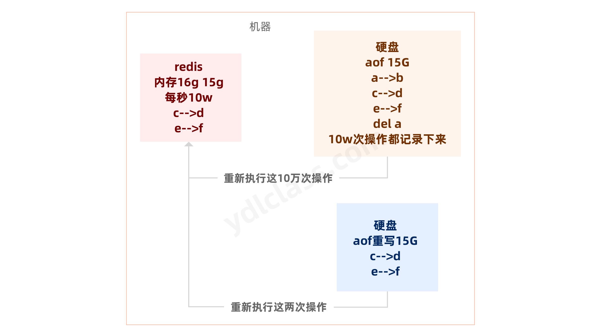

AOF rewrite 可以通过 BGREWRITEAOF 命令触发，也可以配置 Redis 定期自动进行：

```bash
auto-aof-rewrite-percentage 100
  auto-aof-rewrite-min-size 64mb
```

- Redis 在每次 AOF rewrite 时，会记录完成 rewrite 后的 AOF 日志大小，当 AOF 日志大小在该基础上增长了 100%后，自动进行 AOF rewrite 32m--->10 万-->64M--->40M--100 万--80--》50M-->>100m
- auto-aof-rewrite-min-size 最开始的 AOF 文件必须要触发这个文件才触发，后面的每次重写就不会根据这个变量了。该变量仅初始化启动 Redis 有效。

#### 2.5 AOF 优点

1. 最安全，在启用 appendfsync 为 always 时，任何已写入的数据都不会丢失，使用在启用 appendfsync everysec 也至多只会丢失 1 秒的数据
2. AOF 文件在发生断电等问题时也不会损坏，即使出现了某条日志只写入了一半的情况，也可以使用 redis-check-aof 工具轻松修复
3. AOF 文件易读，可修改，在进行某些错误的数据清除操作后，只要 AOF 文件没有 rewrite，就可以把 AOF 文件备份出来，把错误的命令删除，然后恢复数据。

#### 2.6 AOF 的缺点

1. AOF 文件通常比 RDB 文件更大
2. 性能消耗比 RDB 高
3. 数据恢复速度比 RDB 慢

Redis 的数据持久化工作本身就会带来延迟，需要根据数据的安全级别和性能要求制定合理的持久化策略：

- AOF + fsync always 的设置虽然能够绝对确保数据安全，但每个操作都会触发一次 fsync，会对 Redis 的性能有比较明显的影响
- AOF + fsync every second 是比较好的折中方案，每秒 fsync 一次
- AOF + fsync never 会提供 AOF 持久化方案下的最优性能

使用 RDB 持久化通常会提供比使用 AOF 更高的性能，但需要注意 RDB 的策略配置

### 3、RDB or AOF

每一次 RDB 快照和 AOF Rewrite 都需要 Redis 主进程进行 fork 操作。fork 操作本身可能会产生较高的耗时，与 CPU 和 Redis 占用的内存大小有关。根据具体的情况合理配置 RDB 快照和 AOF Rewrite 时机，避免过于频繁的 fork 带来的延迟。

Redis 在 fork 子进程时需要将内存分页表拷贝至子进程，以占用了 24GB 内存的 Redis 实例为例，共需要拷贝 48MB 的数据。在使用单 Xeon 2.27Ghz 的物理机上，这一 fork 操作耗时 216ms。

本人以前的公司，最后的从机上，rdb aof 都开启。

## 第二章 Redis 事务

### 1、Redis 事务简介

Redis 事务的本质是一组命令的集合。事务支持一次执行多个命令，一个事务中所有命令都会被序列化。在事务执行过程，会按照顺序串行化执行队列中的命令，其他客户端提交的命令请求不会插入到事务执行命令序列中。


**总结说：Redis 事务就是一次性、顺序性、排他性的执行一个队列中的一系列命令**

- **Redis 事务没有隔离级别的概念**

批量操作在发送 EXEC 命令前被放入队列缓存，并不会被实际执行，也就不存在事务内的查询要看到事务里的更新，事务外查询不能看到。

- **Redis 不保证原子性**

Redis 中，单条命令是原子性执行的，但事务不保证原子性，且没有回滚。事务中任意命令执行失败，其余的命令仍会被执行。

一个事务从开始到执行会经历以下三个阶段：

- 第一阶段：开始事务
- 第二阶段：命令入队
- 第三阶段：执行事务

Redis 事务相关命令：

- MULTI

开启事务，redis 会将后续的命令逐个放入队列中，然后使用 EXEC 命令来原子化执行这个命令队列

- EXEC

执行事务中的所有操作命令

- DISCARD

取消事务，放弃执行事务块中的所有命令

- WATCH

监视一个或多个 key，如果事务在执行前，这个 key（或多个 key）被其他命令修改，则事务被中断，不会执行事务中的任何命令

- UNWATCH

取消 WATCH 对所有 key 的监视

### 2、 Redis 事务演示

**1.** MULTI 开始一个事务：给 k1、k2 分别赋值，在事务中修改 k1、k2，执行事务后，查看 k1、k2 值都被修改。

```bash
192.168.200.131:6379> set key1 v1
OK
192.168.200.131:6379> set key2 v2
OK
192.168.200.131:6379> multi
OK
192.168.200.131:6379(TX)> set key1 11
QUEUED
192.168.200.131:6379(TX)> set key2 22
QUEUED
192.168.200.131:6379(TX)> exec
1) OK
2) OK
192.168.200.131:6379> get key1
"11"
192.168.200.131:6379> get key2
"22"
192.168.200.131:6379>
```

**2.** 事务失败处理：语法错误（编译器错误），在开启事务后，修改 k1 值为 11，k2 值为 22，但 k2 语法错误，最终导致事务提交失败，k1、k2 保留原值。

```bash
192.168.200.131:6379> set key1 v1
OK
192.168.200.131:6379> set key2 v2
OK
192.168.200.131:6379> multi
OK
192.168.200.131:6379(TX)> set key1 11
QUEUED
192.168.200.131:6379(TX)> sets key2 22
(error) ERR unknown command `sets`, with args beginning with: `key2`, `22`,
192.168.200.131:6379(TX)> exec
(error) EXECABORT Transaction discarded because of previous errors.
192.168.200.131:6379> get key1
"v1"
192.168.200.131:6379> get key2
"v2"
192.168.200.131:6379>
```

3.Redis 类型错误（运行时错误），在开启事务后，修改 k1 值为 11，k2 值为 22，但将 k2 的类型作为 List，在运行时检测类型错误，最终导致事务提交失败，此时事务并没有回滚，而是跳过错误命令继续执行， 结果 k1 值改变、k2 保留原值。

```bash
192.168.200.131:6379> set key1 v1
OK
192.168.200.131:6379> set key2 v2
OK
192.168.200.131:6379> multi
OK
192.168.200.131:6379(TX)> set key1 11
QUEUED
192.168.200.131:6379(TX)> lpush key2 22
QUEUED
192.168.200.131:6379(TX)> exec
1) OK
2) (error) WRONGTYPE Operation against a key holding the wrong kind of value
192.168.200.131:6379> get key1
"11"
192.168.200.131:6379> get key2
"v2"
192.168.200.131:6379>
```

4 **DISCARD**取消事务

```bash
192.168.200.131:6379> set key1 v1
OK
192.168.200.131:6379> set key2 v2
OK
192.168.200.131:6379> multi
OK
192.168.200.131:6379> set key1 v1
QUEUED
192.168.200.131:6379> set key2 v2
QUEUED
192.168.200.131:6379> discard
OK
192.168.200.131:6379> get key1
"v1"
192.168.200.131:6379> get key2
"v2"
```

### 3、为什么 Redis 不支持事务回滚？

多数事务失败是由语法错误或者数据结构类型错误导致的，语法错误说明在命令入队前就进行检测的，而类型错误是在执行时检测的，Redis 为提升性能而采用这种简单的事务，这是不同于关系型数据库的，特别要注意区分。Redis 之所以保持这样简易的事务，完全是为了保证高并发下的核心问题——**性能**。

## 第三章 数据删除与淘汰策略

### 1、过期数据

#### **1.1 Redis 中的数据特征**

Redis 是一种内存级数据库，所有数据均存放在内存中，内存中的数据可以通过 TTL 指令获取其状态

TTL 返回的值有三种情况：正数，-1，-2

- **正数**：代表该数据在内存中还能存活的时间
- **-1**：永久有效的数据
- -**2** ：已经过期的数据 或被删除的数据 或 未定义的数据

**删除策略就是针对已过期数据的处理策略**，已过期的数据是真的就立即删除了吗？其实也不是，我们会有多种删除策略，是分情况的，在不同的场景下使用不同的删除方式会有不同效果，这也正是我们要将的数据的删除策略的问题。

#### 1.2 时效性数据的存储结构

在 Redis 中，如何给数据设置它的失效周期呢？数据的时效在 redis 中如何存储呢？看下图：

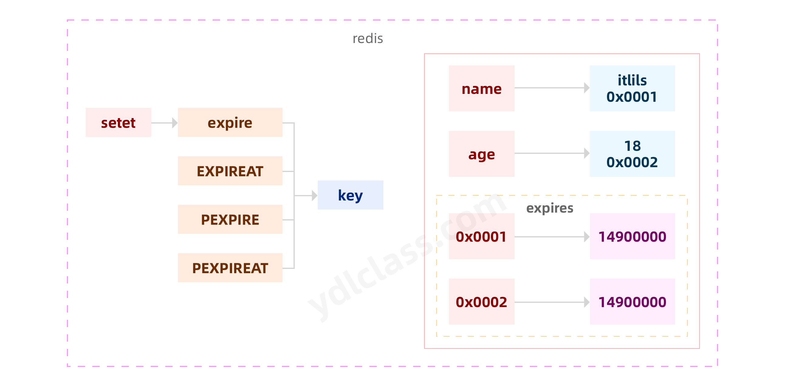

过期数据是一块独立的存储空间，Hash 结构，field 是内存地址，value 是过期时间，保存了所有 key 的过期描述，在最终进行过期处理的时候，对该空间的数据进行检测， 当时间到期之后通过 field 找到内存该地址处的数据，然后进行相关操作。

### 2、数据删除策略

#### 2.1 数据删除策略的目标

在内存占用与 CPU 占用之间寻找一种平衡，顾此失彼都会造成整体 redis 性能的下降，甚至引发服务器宕机或 内存泄露

针对过期数据要进行删除的时候都有哪些删除策略呢？

- 1.定时删除
- 2.惰性删除
- 3.定期删除

#### 2.2 定时删除

创建一个定时器，当 key 设置有过期时间，且过期时间到达时，由定时器任务立即执行对键的删除操作

- **优点**：节约内存，到时就删除，快速释放掉不必要的内存占用
- **缺点**：CPU 压力很大，无论 CPU 此时负载量多高，均占用 CPU，会影响 redis 服务器响应时间和指令吞吐量
- **总结**：用处理器性能换取存储空间（拿时间换空间）


#### 2.3 惰性删除

数据到达过期时间，不做处理。等下次访问该数据时，我们需要判断

1. 如果未过期，返回数据
2. 发现已过期，删除，返回不存在

- **优点**：节约 CPU 性能，发现必须删除的时候才删除
- **缺点**：内存压力很大，出现长期占用内存的数据
- **总结**：用存储空间换取处理器性能（拿时间换空间）

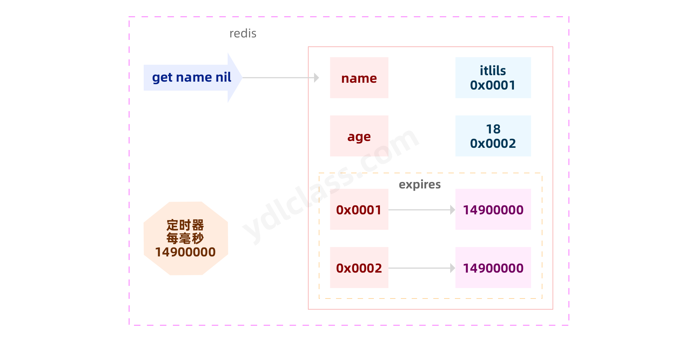

#### 2.4 定期删除

定时删除和惰性删除这两种方案都是走的极端，那有没有折中方案？

我们来讲 redis 的定期删除方案：

- Redis 启动服务器初始化时，读取配置 server.hz 的值，默认为 10
- 每秒钟执行 `server.hz` 次 **serverCron()**-------->**databasesCron()**--------->**activeExpireCycle()**
- **activeExpireCycle()** 对每个 expires[*] 逐一进行检测，每次执行耗时：250ms/server.hz
- 对某个 expires[*] 检测时，随机挑选 W 个 key 检测

```markdown
如果 key 超时，删除 key

如果一轮中删除的 key 的数量>W\*25%，循环该过程

如果一轮中删除的 key 的数量 ≤W*25%，检查下一个 expires[*]，0-15 循环

W 取值=ACTIVE_EXPIRE_CYCLE_LOOKUPS_PER_LOOP 属性值
```

- 参数 current_db 用于记录 `activeExpireCycle()` 进入哪个 `expires[*]` 执行
- 如果 `activeExpireCycle()` 执行时间到期，下次从 current_db 继续向下执行

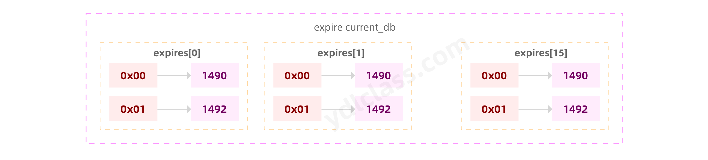

总的来说：定期删除就是周期性轮询 redis 库中的时效性数据，采用随机抽取的策略，利用过期数据占比的方式控制删除频度

- **特点 1**：CPU 性能占用设置有峰值，检测频度可自定义设置
- **特点 2**：内存压力不是很大，长期占用内存的冷数据会被持续清理
- **总结**：周期性抽查存储空间（随机抽查，重点抽查）

#### 2.5 删除策略对比

1：定时删除：

```markdown
节约内存，无占用,
不分时段占用 CPU 资源，频度高,
拿时间换空间
```

2：惰性删除：

```markdown
内存占用严重
延时执行，CPU 利用率高
拿空间换时间
```

3：定期删除：

```markdown
内存定期随机清理
每秒花费固定的 CPU 资源维护内存
随机抽查，重点抽查
```

### 3、数据淘汰策略（逐出算法）-面试

#### 3.1 淘汰策略概述

什么叫数据淘汰策略？什么样的应用场景需要用到数据淘汰策略？

当新数据进入 redis 时，如果内存不足怎么办？在执行每一个命令前，会调用`freeMemoryIfNeeded()` 检测内存是否充足。如果内存不满足新加入数据的最低存储要求，redis 要临时删除一些数据为当前指令清理存储空间。清理数据的策略称为逐出算法。

注意：逐出数据的过程不是 100% 能够清理出足够的可使用的内存空间，如果不成功则反复执行。当对所有数据尝试完毕， 如不能达到内存清理的要求，将出现错误信息如下

```shell
(error) OOM command not allowed when used memory >'maxmemory'
```

#### 3.2 策略配置

影响数据淘汰的相关配置如下：

1：最大可使用内存，即占用物理内存的比例，默认值为 0，表示不限制。生产环境中根据需求设定，通常设置在 50%以上

```properties
maxmemory ?mb
```

2：每次选取待删除数据的个数，采用随机获取数据的方式作为待检测删除数据

```properties
maxmemory-samples count
```

3：对数据进行删除的选择策略

```properties
maxmemory-policy policy
```

那数据删除的策略 policy 到底有几种呢？一共是**3 类 8 种**

**第一类**：检测易失数据（可能会过期的数据集 server.db[i].expires ） 同一个库

```properties
volatile-lru：挑选最近最少使用的数据淘汰      least recently used
volatile-lfu：挑选最近使用次数最少的数据淘汰   least frequently used
volatile-ttl：挑选将要过期的数据淘汰
volatile-random：任意选择数据淘汰
```


**第二类**：检测全库数据（所有数据集 server.db[i].dict ）

```properties
allkeys-lru：挑选最近最少使用的数据淘汰
allkeLyRs-lfu：：挑选最近使用次数最少的数据淘汰
allkeys-random：任意选择数据淘汰，相当于随机
```

**第三类**：放弃数据驱逐

```properties
no-enviction（驱逐）：禁止驱逐数据(redis4.0中默认策略)，会引发OOM(Out Of Memory)
```

注意：这些策略是配置到哪个属性上？怎么配置？如下所示

```properties
maxmemory-policy volatile-lru
```

**数据淘汰策略配置依据**

使用 INFO 命令输出监控信息，查询缓存 hit 和 miss 的次数，根据业务需求调优 Redis 配置

## 第四章 Redis 的主从复制架构

### 1、主从复制简介

#### 1.1 高可用

首先我们要理解互联网应用因为其独有的特性我们演化出的**三高**架构

- 高并发应用要提供某一业务要能支持很多客户端同时访问的能力，我们称为并发，高并发意思就很明确了
- 高性能性能带给我们最直观的感受就是：速度快，时间短
- 高可用

**可用性**：一年中应用服务正常运行的时间占全年时间的百分比，如下图：表示了应用服务在全年宕机的时间


我们把这些时间加在一起就是全年应用服务不可用的时间，然后我们可以得到应用服务全年可用的时间

4 小时 27 分 15 秒+11 分 36 秒+2 分 16 秒=4 小时 41 分 7 秒=16867 秒

1 年=365*24*60\*60=31536000 秒

可用性=（31536000-16867）/31536000\*100%=99.9465151%

业界可用性目标**5 个 9，即 99.999%**，即服务器年宕机时长低于 315 秒，约 5.25 分钟

支付宝

Amazon 半天宕机 全球 60% 云服务器上

#### 1.2 主从复制概念

知道了三高的概念之后，我们想：你的“Redis”是否高可用？那我们要来分析单机 redis 的风险与问题

问题 1.机器故障

- 现象：硬盘故障、系统崩溃
- 本质：数据丢失，很可能对业务造成灾难性打击
- 结论：基本上会放弃使用 redis.

问题 2.容量瓶颈

- 现象：内存不足，从 16G 升级到 64G，从 64G 升级到 128G，无限升级内存
- 本质：穷，硬件条件跟不上
- 结论：放弃使用 redis

结论：

为了避免单点 Redis 服务器故障，准备多台服务器，互相连通。将数据复制多个副本保存在不同的服务器上，连接在一起，并保证数据是同步的。即使有其中一台服务器宕机，其他服务器依然可以继续提供服务，实现 Redis 的高可用，同时实现数据冗余备份。

多台服务器连接方案：

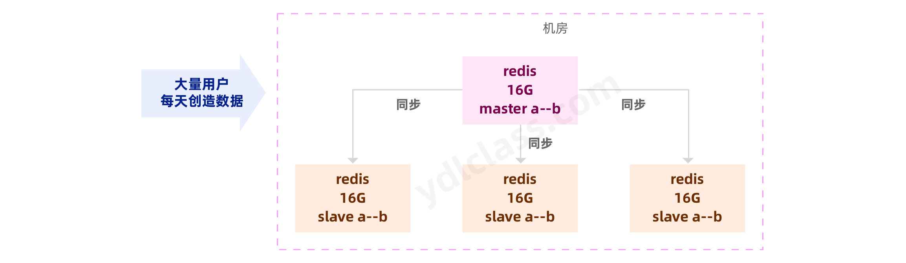

- 提供数据方：**master**

主服务器，主节点，主库主客户端

- 接收数据方：**slave**

从服务器，从节点，从库

从客户端

- 需要解决的问题：

数据同步（master 的数据复制到 slave 中）

这里我们可以来解释主从复制的概念：

**概念：主从复制即将 master 中的数据即时、有效的复制到 slave 中**

**特征**：一个 master 可以拥有多个 slave，一个 slave 只对应一个 master

**职责**：master 和 slave 各自的职责不一样

master:

```markdown
写数据
执行写操作时，将出现变化的数据自动同步到 slave
读数据（可忽略）
```

slave:

```markdown
读数据
写数据（禁止）
```

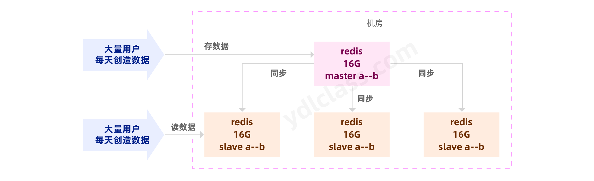

#### 1.3 主从复制的作用

- 读写分离：master 写、slave 读，提高服务器的读写负载能力
- 负载均衡：基于主从结构，配合读写分离，由 slave 分担 master 负载，并根据需求的变化，改变 slave 的数 量，通过多个从节点分担数据读取负载，大大提高 Redis 服务器并发量与数据吞吐量
- 故障恢复：当 master 出现问题时，由 slave 提供服务，实现快速的故障恢复
- 数据冗余：实现数据热备份，是持久化之外的一种数据冗余方式
- 高可用基石：基于主从复制，构建哨兵模式与集群，实现 Redis 的高可用方案

### 2、主从复制工作流程

主从复制过程大体可以分为 3 个阶段

- 建立连接阶段（即准备阶段）
- 数据同步阶段
- 命令传播阶段（反复同步）


而命令的传播其实有 4 种，分别如下：

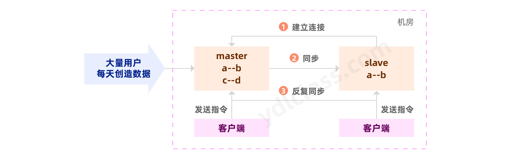

#### 2.1 主从复制的工作流程（三个阶段）

阶段一：建立连接

建立 slave 到 master 的连接，使 master 能够识别 slave，并保存 slave 端口号

流程如下：

1. 步骤 1：设置 master 的地址和端口，保存 master 信息
2. 步骤 2：建立 socket 连接
3. 步骤 3：发送 ping 命令（定时器任务）
4. 步骤 4：身份验证
5. 步骤 5：发送 slave 端口信息

至此，主从连接成功！

当前状态：

slave：保存 master 的地址与端口

master：保存 slave 的端口

总体：之间创建了连接的 socket

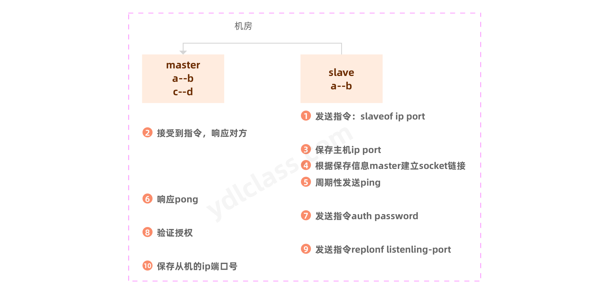

**master 和 slave 互联**

接下来就要通过某种方式将 master 和 slave 连接到一起

方式一：客户端发送命令

```properties
slaveof masterip masterport
```

方式二：启动服务器参数

```properties
redis-server --slaveof masterip masterport
```

方式三：服务器配置（**主流方式**）

```properties
slaveof masterip masterport
```

slave 系统信息

```properties
master_link_down_since_seconds
masterhost & masterport
```

master 系统信息

```properties
uslave_listening_port(多个)
```

**主从断开连接**

断开 slave 与 master 的连接，slave 断开连接后，不会删除已有数据，只是不再接受 master 发送的数据

```properties
slaveof no one
```

**授权访问**

master 客户端发送命令设置密码

```properties
requirepass password
```

master 配置文件设置密码

```properties
config set requirepass password
config get requirepass
```

slave 客户端发送命令设置密码

```properties
auth password
```

slave 配置文件设置密码

```properties
masterauth password
```

slave 启动服务器设置密码

```properties
redis-server –a password
```

阶段二：数据同步

- 在 slave 初次连接 master 后，复制 master 中的所有数据到 slave
- 将 slave 的数据库状态更新成 master 当前的数据库状态

同步过程如下：

1. 步骤 1：请求同步数据
2. 步骤 2：创建 RDB 同步数据
3. 步骤 3：恢复 RDB 同步数据
4. 步骤 4：请求部分同步数据
5. 步骤 5：恢复部分同步数据

至此，数据同步工作完成！

当前状态：

slave：具有 master 端全部数据，包含 RDB 过程接收的数据

master：保存 slave 当前数据同步的位置

总体：之间完成了数据克隆

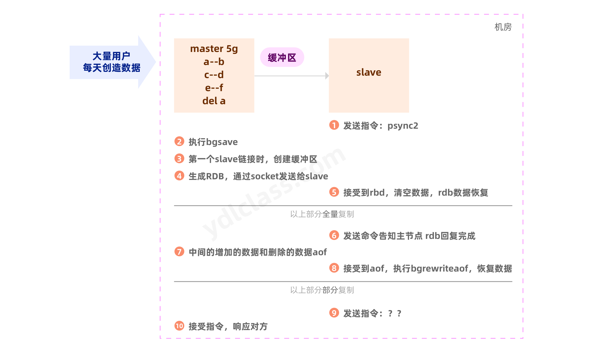

**数据同步阶段 master 说明**

1：如果 master 数据量巨大，数据同步阶段应避开流量高峰期，避免造成 master 阻塞，影响业务正常执行

2：复制缓冲区大小设定不合理，会导致数据溢出。如进行全量复制周期太长，进行部分复制时发现数据已经存在丢失的情况，必须进行第二次全量复制，致使 slave 陷入死循环状态。

```properties
repl-backlog-size ?mb
```

1. master 单机内存占用主机内存的比例不应过大，建议使用 50%-70%的内存，留下 30%-50%的内存用于执 行 bgsave 命令和创建复制缓冲区

**数据同步阶段 slave 说明**

1. 为避免 slave 进行全量复制、部分复制时服务器响应阻塞或数据不同步，建议关闭此期间的对外服务

```properties
slave-serve-stale-data yes|no
```

1. 数据同步阶段，master 发送给 slave 信息可以理解 master 是 slave 的一个客户端，主动向 slave 发送命令
2. 多个 slave 同时对 master 请求数据同步，master 发送的 RDB 文件增多，会对带宽造成巨大冲击，如果 master 带宽不足，因此数据同步需要根据业务需求，适量错峰
3. slave 过多时，建议调整拓扑结构，由一主多从结构变为树状结构，中间的节点既是 master，也是 slave。注意使用树状结构时，由于层级深度，导致深度越高的 slave 与最顶层 master 间数据同步延迟较大，数据一致性变差，应谨慎选择

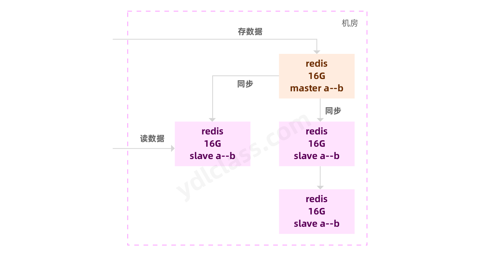

**生产环境**：一开始，想好 redis 架构，一开始就把 n 主 m 从的 redis 服务都启动起来。

阶段三：命令传播

- 当 master 数据库状态被修改后，导致主从服务器数据库状态不一致，此时需要让主从数据同步到一致的状态，同步的动作称为**命令传播**
- master 将接收到的数据变更命令发送给 slave，slave 接收命令后执行命令

**命令传播阶段的部分复制**

命令传播阶段出现了断网现象：

网络闪断闪连：忽略

短时间网络中断：部分复制

长时间网络中断：全量复制

这里我们主要来看部分复制，部分复制的三个核心要素

1. 服务器的运行 id（run id）
2. 主服务器的复制积压缓冲区
3. 主从服务器的复制偏移量

- 服务器运行 ID（runid）

```markdown
概念：服务器运行 ID 是每一台服务器每次运行的身份识别码，一台服务器多次运行可以生成多个运行 id

组成：运行 id 由 40 位字符组成，是一个随机的十六进制字符
例如：fdc9ff13b9bbaab28db42b3d50f852bb5e3fcdce

作用：运行 id 被用于在服务器间进行传输，识别身份
如果想两次操作均对同一台服务器进行，必须每次操作携带对应的运行 id，用于对方识别

实现方式：运行 id 在每台服务器启动时自动生成的，master 在首次连接 slave 时，会将自己的运行 ID 发送给 slave，
slave 保存此 ID，通过 info Server 命令，可以查看节点的 runid
```

- 复制缓冲区

```markdown
概念：复制缓冲区，又名复制积压缓冲区，是一个先进先出（FIFO）的队列，用于存储服务器执行过的命令，每次传播命令，master 都会将传播的命令记录下来，并存储在复制缓冲区
复制缓冲区默认数据存储空间大小是 1M
当入队元素的数量大于队列长度时，最先入队的元素会被弹出，而新元素会被放入队列
作用：用于保存 master 收到的所有指令（仅影响数据变更的指令，例如 set，select）

数据来源：当 master 接收到主客户端的指令时，除了将指令执行，会将该指令存储到缓冲区中
```


复制缓冲区内部工作原理：

组成

- 偏移量概念：一个数字，描述复制缓冲区中的指令字节位置分类：

- master 复制偏移量：记录发送给所有 slave 的指令字节对应的位置（多个）
- slave 复制偏移量：记录 slave 接收 master 发送过来的指令字节对应的位置（一个）

- 作用：同步信息，比对 master 与 slave 的差异，当 slave 断线后，恢复数据使用数据来源：

- master 端：发送一次记录一次
- slave 端：接收一次记录一次

- 字节值

工作原理

- 通过 offset 区分不同的 slave 当前数据传播的差异
- master 记录已发送的信息对应的 offset
- slave 记录已接收的信息对应的 offset

#### 2.2 流程更新(全量复制/部分复制)

我们再次的总结一下主从复制的三个阶段的工作流程：

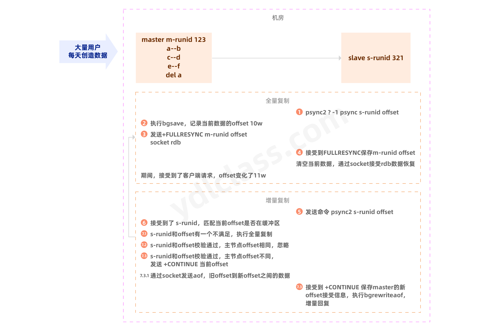

#### 2.3 心跳机制

什么是心跳机制？

进入命令传播阶段候，master 与 slave 间需要进行信息交换，使用心跳机制进行维护，实现双方连接保持在线

master 心跳：

- 内部指令：PING
- 周期：由 repl-ping-slave-period 决定，默认 10 秒
- 作用：判断 slave 是否在线
- 查询：INFO replication 获取 slave 最后一次连接时间间隔，lag 项维持在 0 或 1 视为正常

slave 心跳任务

- 内部指令：REPLCONF ACK {offset}
- 周期：1 秒
- 作用 1：汇报 slave 自己的复制偏移量，获取最新的数据变更指令
- 作用 2：判断 master 是否在线

心跳阶段注意事项：

- 当 slave 多数掉线，或延迟过高时，master 为保障数据稳定性，将拒绝所有信息同步

```properties
min-slaves-to-write 2
min-slaves-max-lag 8
```

slave 数量少于 2 个，或者所有 slave 的延迟都大于等于 8 秒时，强制关闭 master 写功能，停止数据同步

- slave 数量由 slave 发送 REPLCONF ACK 命令做确认
- slave 延迟由 slave 发送 REPLCONF ACK 命令做确认

至此：我们可以总结出完整的主从复制流程：

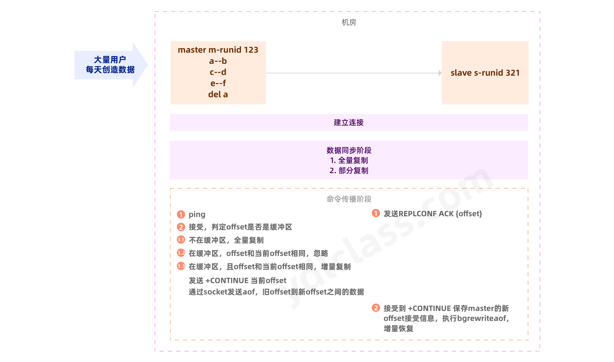

### 3、搭建主从架构

#### 3.1 背景

真实的生产环境，主从部署在不同的物理地方

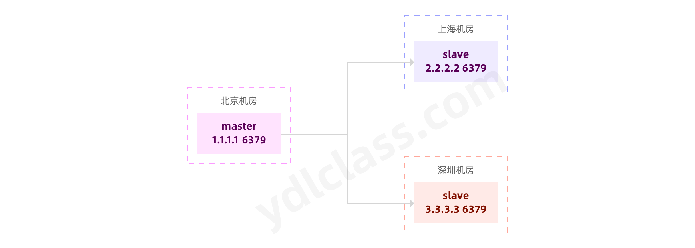

教学


#### 3.2 操作

1 复制两套 redis redis6380 redis 6381

```bash
cp redis-6.2.6/ redis6380
cp redis-6.2.6/ redis6381
```

2 分别修改配置文件：

```bash
port 6380
pidfile /var/run/redis_6380.pid
logfile "/export/server/redis6380/log/redis.log"
dir /export/server/redis6380/data
port 6381
pidfile /var/run/redis_6381.pid
logfile "/export/server/redis6381/log/redis.log"
dir /export/server/redis6381/data
```

3**启动**：

```bash
./bin/redis-server redis.conf slaveof 192.168.200.131 6379
```

4 效果

登陆 6380

```bash
./bin/redis-cli -h 192.168.200.131 -p 6380
info
```

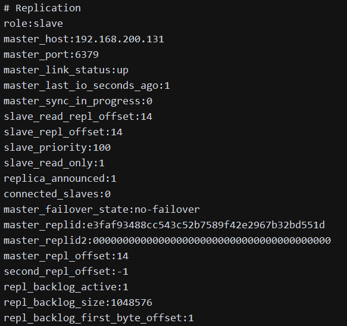

5 测试

1 主节点写数据，从节点获取数据


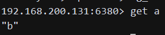

2 从节点不能写数据

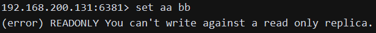

### 4、主从复制常见问题-架构师

#### 4.1 频繁的全量复制

- 伴随着系统的运行，master 的数据量会越来越大，一旦 master 重启，runid 将发生变化，会导致全部 slave 的全量复制操作

内部优化调整方案：

1：master 内部创建 master_replid 变量，使用 runid 相同的策略生成，长度 41 位，并发送给所有 slave

2：在 master 关闭时执行命令 shutdown save，进行 RDB 持久化,将 runid 与 offset 保存到 RDB 文件中

```markdown
repl-id repl-offset

通过 redis-check-rdb 命令可以查看该信息
```

3：master 重启后加载 RDB 文件，恢复数据，重启后，将 RDB 文件中保存的 repl-id 与 repl-offset 加载到内存中

```markdown
master_repl_id=repl master_repl_offset =repl-offset

通过 info 命令可以查看该信息
```

作用：本机保存上次 runid，重启后恢复该值，使所有 slave 认为还是之前的 master

- 第二种出现频繁全量复制的问题现象：网络环境不佳，出现网络中断，slave 不提供服务

问题原因：复制缓冲区过小，断网后 slave 的 offset 越界，触发全量复制

最终结果：slave 反复进行全量复制

解决方案：修改复制缓冲区大小

```properties
repl-backlog-size 20mb
```

建议设置如下：

1.测算从 master 到 slave 的重连平均时长 second 10s

2.获取 master 平均每秒产生写命令数据总量 write_size_per_second 10w

3.最优复制缓冲区空间 = 2 *second* write_size_per_second 10w\*10b 20mb

#### 4.2 频繁的网络中断

- 问题现象：master 的 CPU 占用过高 或 slave 频繁断开连接

问题原因

```markdown
slave 每 1 秒发送 REPLCONFACK 命令到 master

当 slave 接到了慢查询时（keys \* ，hgetall 等），会大量占用 CPU 性能

master 每 1 秒调用复制定时函数 replicationCron()，比对 slave 发现长时间没有进行响应
```

最终结果：master 各种资源（输出缓冲区、带宽、连接等）被严重占用

解决方案：通过设置合理的超时时间，确认是否释放 slave

```properties
repl-timeout seconds
```

该参数定义了超时时间的阈值（默认 60 秒），超过该值，释放 slave

- 问题现象：slave 与 master 连接断开

问题原因

```markdown
master 发送 ping 指令频度较低

master 设定超时时间较短

ping 指令在网络中存在丢包
```

解决方案：提高 ping 指令发送的频度

```properties
repl-ping-slave-period seconds
```

超时时间 repl-time 的时间至少是 ping 指令频度的 5 到 10 倍，否则 slave 很容易判定超时

#### 4.3 数据不一致

问题现象：多个 slave 获取相同数据不同步

问题原因：网络信息不同步，数据发送有延迟

解决方案

```markdown
优化主从间的网络环境，通常放置在同一个机房部署，如使用阿里云等云服务器时要注意此现象
拉专线。vpn。4m 10 万 2 万/年
监控主从节点延迟（通过 offset）判断，如果 slave 延迟过大，暂时屏蔽程序对该 slave 的数据访问
slave-serve-stale-data yes|no
```

开启后仅响应 info、slaveof 等少数命令（慎用，除非对数据一致性要求很高）

## 第五章 Redis 中的 Sentinel 架构

### 1、哨兵简介

#### 1.1 哨兵概念

首先我们来看一个业务场景：如果 redis 的 master 宕机了，此时应该怎么办？

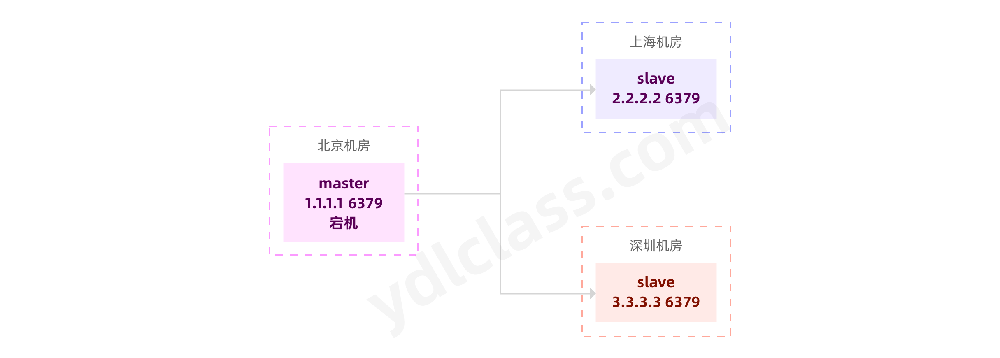

那此时我们可能需要从一堆的 slave 中重新选举出一个新的 master，那这个操作过程是什么样的呢？这里面会有什么问题出现呢？


要实现这些功能，我们就需要 redis 的哨兵，那哨兵是什么呢？

**哨兵**

哨兵(sentinel) 是一个分布式系统，用于对主从结构中的每台服务器进行**监控**，当出现故障时通过**投票**机制**选择**新的 master 并将所有 slave 连接到新的 master。

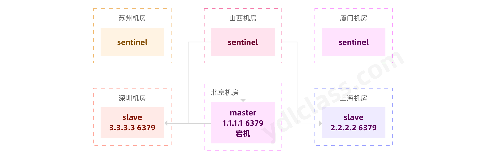

#### 1.2 哨兵作用

哨兵的作用：

- 监控：监控 master 和 slave 不断的检查 master 和 slave 是否正常运行 master 存活检测、master 与 slave 运行情况检测
- 通知（提醒）：当被监控的服务器出现问题时，向其他（哨兵间，客户端）发送通知
- **自动故障转移**：断开 master 与 slave 连接，选取一个 slave 作为 master，将其他 slave 连接新的 master，并告知客户端新的服务器地址

注意：哨兵也是一台 redis 服务器，只是不提供数据相关服务，通常哨兵的数量配置为单数

### 2、启用哨兵

配置哨兵

- 配置一拖二的主从结构（利用之前的方式启动即可）
- 配置三个哨兵（配置相同，端口不同），参看 sentinel.conf

端口号

1：设置哨兵监听的主服务器信息， sentinel_number 表示参与投票的哨兵数量

```properties
sentinel monitor master_name  master_host master_port  sentinel_number
```

2：设置判定服务器宕机时长，该设置控制是否进行主从切换

```properties
sentinel down-after-milliseconds master_name million_seconds
```

3：设置故障切换的最大超时时长

```properties
sentinel failover-timeout master_name million_seconds
```

4：设置主从切换后，同时进行数据同步的 slave 数量，数值越大，要求网络资源越高，数值越小，同步时间越长

```properties
sentinel parallel-syncs master_name sync_slave_number
```

- 启动哨兵

```properties
redis-sentinel filename
```

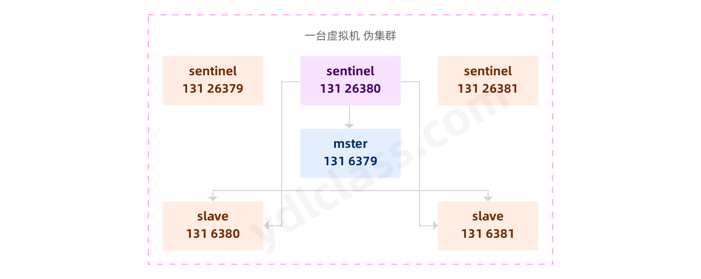

### 3、搭建哨兵

1copy 出三份 redis 运行包

```bash
cp -R redis6380 sentinel26379
cp -R redis6380 sentinel26380
cp -R redis6380 sentinel26381
```

2 分别修改 sentinel.conf

```bash
port 26379
daemonize yes
pidfile "/var/run/redis-sentinel26379.pid"
logfile "/export/server/sentinel26379/log/log.log"
dir "/export/server/sentinel26379/data"
sentinel monitor mymaster 192.168.200.131 6379 2

sentinel resolve-hostnames no
sentinel announce-hostnames no
```

3 分别启动 sentinel

```bash
./bin/redis-sentinel sentinel.conf
```

4 链接 sentinel

```bash
./bin/redis-cli -h 192.168.200.131 -p 26379
```

5 查看状态

```bash
info
```

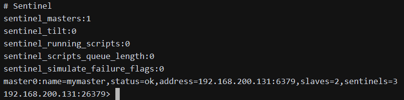

6 尝试故障迁移 杀掉主


登陆 6380 info


7 尝试 6379 恢复


登陆 6380 info


### 4、java 代码链接 sentinel

#### 4.1 原生

1. 在 创建一个新的类 ReidsSentinelTest
2. 构建 JedisPoolConfig 配置对象
3. 创建一个 HashSet，用来保存哨兵节点配置信息（记得一定要写端口号）
4. 构建 JedisSentinelPool 连接池
5. 使用 sentinelPool 连接池获取连接

```java
package com.ydlclass.redis;

import org.testng.annotations.AfterTest;
import org.testng.annotations.BeforeTest;
import org.testng.annotations.Test;
import redis.clients.jedis.Jedis;
import redis.clients.jedis.JedisPoolConfig;
import redis.clients.jedis.JedisSentinelPool;

import java.util.HashSet;
import java.util.Set;

/**
 * @Created by IT李老师
 * 公主号 “IT李哥交朋友”
 * 个人微 itlils
 */
public class ReidsSentinelTest {
    JedisSentinelPool jedisSentinelPool;

    //1. 在 创建一个新的类 ReidsSentinelTest
    //2. 构建JedisPoolConfig配置对象
    //3. 创建一个HashSet，用来保存哨兵节点配置信息（记得一定要写端口号）
    //4. 构建JedisSentinelPool连接池
    //5. 使用sentinelPool连接池获取连接
    @BeforeTest
    public void beforeTest(){
        //创建jedis连接池
        JedisPoolConfig config=new JedisPoolConfig();
        //最大空闲连接
        config.setMaxIdle(10);
        //最小空闲连接
        config.setMinIdle(5);
        //最大空闲时间
        config.setMaxWaitMillis(3000);
        //最大连接数
        config.setMaxTotal(50);

        Set<String> sentinels=new HashSet<>();
        sentinels.add("192.168.200.131:26379");
        sentinels.add("192.168.200.131:26380");
        sentinels.add("192.168.200.131:26381");

        jedisSentinelPool= new JedisSentinelPool("mymaster",sentinels,config);
    }

    @Test
    public void keysTest(){
        Jedis jedis = jedisSentinelPool.getResource();
        Set<String> keys = jedis.keys("*");
        for (String key : keys) {
            System.out.println(key);
        }
    }

    @AfterTest
    public void afterTest(){
        jedisSentinelPool.close();
    }

}
```

#### 4.2 springboot

```yaml
spring:
  application:
    name: redis-op-springboot
  data:
    redis:
      sentinel:
        nodes: localhost:26379,localhost:26380,localhost:26381
        master: mymaster
```

### 5、哨兵工作原理-面试

哨兵在进行主从切换过程中经历三个阶段

- 监控
- 通知
- 故障转移

#### 5.1 监控

用于同步各个节点的状态信息


- 获取各个 sentinel 的状态（是否在线）
- 获取 master 的状态

```markdown
master 属性
prunid
prole：master
各个 slave 的详细信息
```

- 获取所有 slave 的状态（根据 master 中的 slave 信息）

```markdown
slave 属性
prunid
prole：slave
pmaster_host、master_port
poffset
```

其内部的工作原理具体如下：


#### 5.2 通知

sentinel 在通知阶段要不断的去获取 master/slave 的信息，然后在各个 sentinel 之间进行共享，具体的流程如下：


#### 5.3 故障转移

当 master 宕机后 sentinel 是如何知晓并判断出 master 是真的宕机了呢？我们来看具体的操作流程


当 sentinel 认定 master 下线之后，此时需要决定更换 master，那这件事由哪个 sentinel 来做呢？这时候 sentinel 之间要进行选举，如下图所示：


在选举的时候每一个人手里都有一票，而每一个人的又都想当这个处理事故的人，那怎么办？大家就开始抢，于是每个人都会发出一个指令，在内网里边告诉大家我要当选举人，比如说现在的 sentinel1 和 sentinel4 发出这个选举指令了，那么 sentinel2 既能接到 sentinel1 的也能接到 sentinel4 的，接到了他们的申请以后呢，sentinel2 他就会把他的一票投给其中一方，投给谁呢？谁先过来我投给谁，假设 sentinel1 先过来，所以这个票就给到了 sentinel1。那么给过去以后呢，现在 sentinel1 就拿到了一票，按照这样的一种形式，最终会有一个选举结果。对应的选举最终得票多的，那自然就成为了处理事故的人。需要注意在这个过程中有可能会存在失败的现象，就是一轮选举完没有选取，那就会接着进行第二轮第三轮直到完成选举。

接下来就是由选举胜出的 sentinel 去从 slave 中选一个新的 master 出来的工作，这个流程是什么样的呢？

首先它有一个在服务器列表中挑选备选 master 的原则

- 不在线的 OUT
- 响应慢的 OUT
- 与原 master 断开时间久的 OUT
- 优先原则 优先级
  offset
  runid

选出新的 master 之后，发送指令（ sentinel ）给其他的 slave：

- 向新的 master 发送 slaveof no one
- 向其他 slave 发送 slaveof 新 masterIP 端口

**总结**：故障转移阶段

1. 发现问题，主观下线与客观下线
2. 竞选负责人
3. 优选新 master
4. 新 master 上任，其他 slave 切换 master，原 master 作为 slave 故障恢复后连接

## 第六章 Redis cluster 集群

现状问题：业务发展过程中遇到的峰值瓶颈

- redis 提供的服务 OPS 可以达到 10 万/秒，当前业务 OPS 已经达到 10 万/秒
- 内存单机容量达到 256G，当前业务需求内存容量 1T
- 使用集群的方式可以快速解决上述问题

### 1、集群简介

集群就是使用网络将若干台计算机联通起来，并提供统一的管理方式，使其对外呈现单机的服务效果

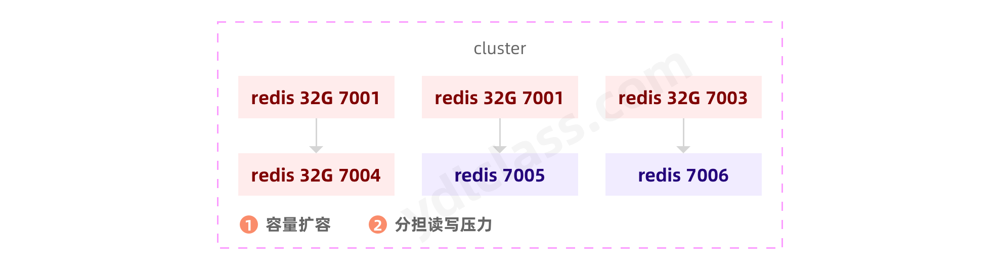

**集群作用：**

- 分散单台服务器的访问压力，实现负载均衡
- 分散单台服务器的存储压力，实现可扩展性
- 降低单台服务器宕机带来的业务灾难

### 2、Cluster 集群结构设计

**数据存储设计：**

1. 通过算法设计，计算出 key 应该保存的位置
2. 将所有的存储空间计划切割成 16384 份，每台主机保存一部分注意：每份代表的是一个存储空间，不是一个 key 的保存空间
3. 将 key 按照计算出的结果放到对应的存储空间

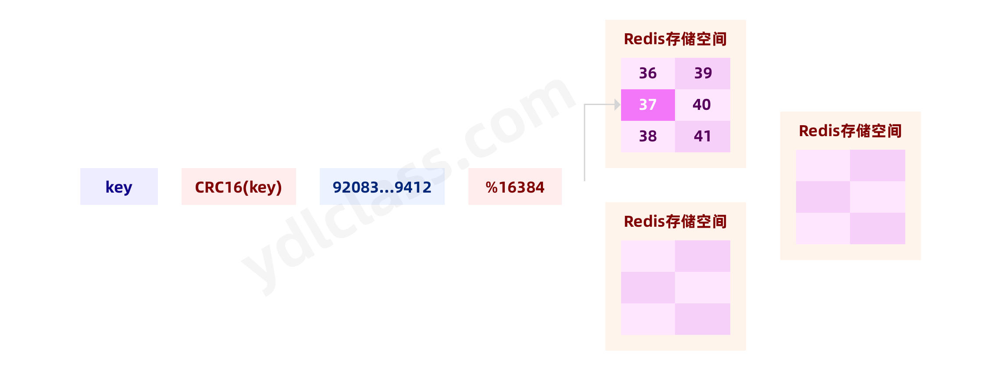

那 redis 的集群是如何增强可扩展性的呢？譬如我们要增加一个集群节点

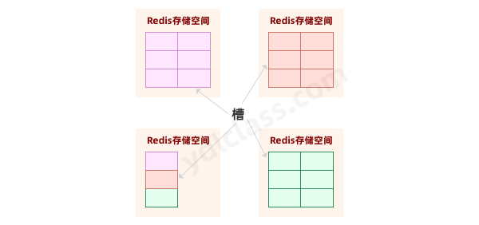

当我们查找数据时，集群是如何操作的呢？

- 各个数据库相互通信，保存各个库中槽的编号数据
- 一次命中，直接返回
- 一次未命中，告知具体位置

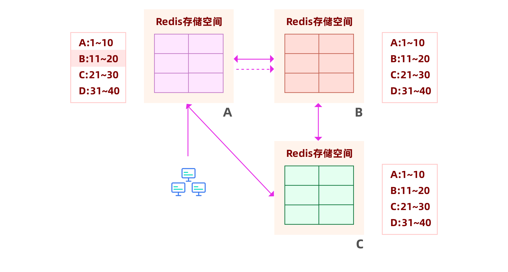

### 3、Cluster 集群结构搭建

首先要明确的几个要点：

- 配置服务器（3 主 3 从）
- 建立通信（Meet）
- 分槽（Slot）
- 搭建主从（master-slave）

1.创建 6 个 redis 单体服务 7001-7006。修改 redis.conf

```bash
port 7001
bind 192.168.200.131
protected-mode no
daemonize yes
pidfile /var/run/redis_7001.pid
logfile "/export/server/redis7001/log/redis.log"
dir /export/server/redis7001/data/
appendonly yes
cluster-enabled yes
cluster-config-file nodes-7001.conf
cluster-node-timeout 15000
```

2.让六台机器组成集群

```bash
redis-cli --cluster create 192.168.200.131:7001 192.168.200.131:7002 192.168.200.131:7003 192.168.200.131:7004 192.168.200.131:7005 192.168.200.131:7006 --cluster-replicas 1
```

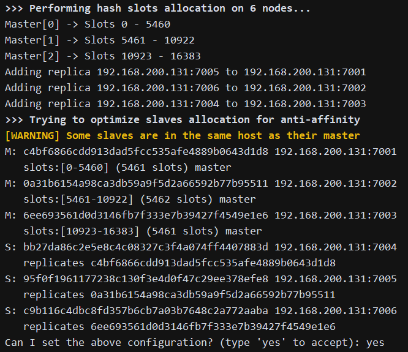

输入 yes

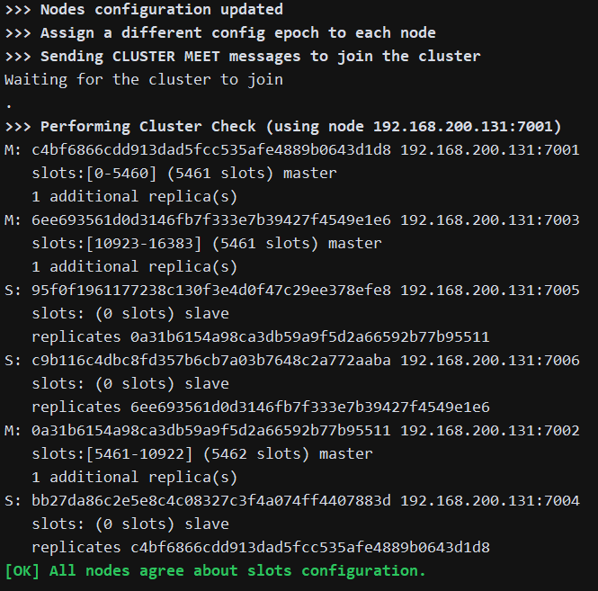

> [!TIP]
>
> #### Redis 错误 This instance has cluster support disabled
>
> Redis 的集群模式需要在启动 Redis 实例时进行相应的配置。如果出现错误信息”This instance has cluster support disabled”，则表示当前 Redis 实例没有启用集群支持。
>
> ```bash
> cluster-enabled yes
> ```
>
> OR
>
> ```bash
> redis-server --cluster-enabled yes
> ```
>
> OR **使用 Redis Sentinel**
>
> Redis Sentinel 是一种监控和自动故障转移解决方案，也可以用于启用集群支持。通过在 Redis Sentinel 配置文件中设置相应的选项，可以启用集群支持。然后启动 Redis Sentinel。

客户端连接 cluster

```bash
./redis-cli -c -h 192.168.200.131 -p 7001
```

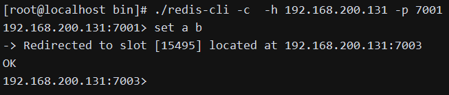

设置值，跳转到正确的服务器上。

**Cluster 配置**

- 是否启用 cluster，加入 cluster 节点

```properties
cluster-enabled yes|no
```

- cluster 配置文件名，该文件属于自动生成，仅用于快速查找文件并查询文件内容

```properties
cluster-config-file filename
```

- 节点服务响应超时时间，用于判定该节点是否下线或切换为从节点

```properties
cluster-node-timeout milliseconds
```

- master 连接的 slave 最小数量

```properties
cluster-migration-barrier min_slave_number
```

**Cluster 节点操作命令**

- 查看集群节点信息

```properties
cluster nodes
```

- 更改 slave 指向新的 master

```properties
cluster replicate master-id
```

- 发现一个新节点，新增 master

```properties
cluster meet ip:port
```

- 忽略一个没有 solt 的节点

```properties
cluster forget server_id
```

- 手动故障转移

```properties
cluster failover
```

**集群操作命令：**

- 创建集群

```properties
redis-cli –-cluster create masterhost1:masterport1 masterhost2:masterport2  masterhost3:masterport3 [masterhostn:masterportn …] slavehost1:slaveport1  slavehost2:slaveport2 slavehost3:slaveport3 -–cluster-replicas n
```

注意：master 与 slave 的数量要匹配，一个 master 对应 n 个 slave，由最后的参数 n 决定

master 与 slave 的匹配顺序为第一个 master 与前 n 个 slave 分为一组，形成主从结构

- 添加 master 到当前集群中，连接时可以指定任意现有节点地址与端口

```properties
redis-cli --cluster add-node new-master-host:new-master-port now-host:now-port
```

- 添加 slave

```properties
redis-cli --cluster add-node new-slave-host:new-slave-port master-host:master-port --cluster-slave --cluster-master-id masterid
```

- 删除节点，如果删除的节点是 master，必须保障其中没有槽 slot

```properties
redis-cli --cluster del-node del-slave-host:del-slave-port del-slave-id
```

- 重新分槽，分槽是从具有槽的 master 中划分一部分给其他 master，过程中不创建新的槽

```properties
redis-cli --cluster reshard new-master-host:new-master:port --cluster-from src-  master-id1, src-master-id2, src-master-idn --cluster-to target-master-id --  cluster-slots slots
```

注意：将需要参与分槽的所有 masterid 不分先后顺序添加到参数中，使用，分隔

指定目标得到的槽的数量，所有的槽将平均从每个来源的 master 处获取

- 重新分配槽，从具有槽的 master 中分配指定数量的槽到另一个 master 中，常用于清空指定 master 中的槽

```properties
redis-cli --cluster reshard src-master-host:src-master-port --cluster-from src-  master-id --cluster-to target-master-id --cluster-slots slots --cluster-yes
```

### 4、java 操作

1. 原生

JedisCluster

```bash
/**
 * @author talentestors
 * @version 1.0
 * @since 2025.10.21
 **/
public class RedisClusterTest {

 @AutoClose
 private static JedisCluster jedisCluster;

 @BeforeAll
 public static void init() {
  JedisCluster.Builder jClusterBuilder = new JedisCluster.Builder();
  HashSet<HostAndPort> nodes = HashSet.newHashSet(6);
  for (int i = 0; i < 6; i++) {
   nodes.add(new HostAndPort("localhost", 7001 + i));
  }
  jClusterBuilder.nodes(nodes);
  GenericObjectPoolConfig<Connection> config = new GenericObjectPoolConfig<>();
  // 最大空闲连接数
  config.setMaxIdle(32);
  // 最小空闲连接数
  config.setMinIdle(1);
  // 最大空闲时间
  config.setMaxWait(Duration.ofMinutes(1));
  // 最大连接数
  config.setMaxTotal(500);
  jClusterBuilder.poolConfig(config);
  jedisCluster = jClusterBuilder.build();
 }

 @Test
 public void addTest() {
  jedisCluster.set("cluster_test_key", "cluster_test_value");
  String value = jedisCluster.get("cluster_test_key");
  System.out.println("Retrieved value: " + value);
 }

}
```

2. springboot

配置文件

```bash
spring:
  data:
    redis:
      cluster:
        nodes:
            - localhost:7001
            - localhost:7002
            - localhost:7003
            - localhost:7004
            - localhost:7005
            - localhost:7006
      jedis:
        pool:
          max-active: 1000
          max-idle: 1
          min-idle: 1
          max-wait: -1
      timeout: 100000
      database: 0
```

## 第七章 Redis 高频面试题

### 1、缓存预热

**场景**：“宕机”

服务器启动后迅速宕机

**问题排查**：

1.请求数量较高，大量的请求过来之后都需要去从缓存中获取数据，但是缓存中又没有，此时从数据库中查找数据然后将数据再存入缓存，造成了短期内对 redis 的高强度操作从而导致问题

2.主从之间数据吞吐量较大，数据同步操作频度较高

**解决方案：**

- 前置准备工作：

  1.日常例行统计数据访问记录，统计访问频度较高的热点数据

  2.利用 LRU 数据删除策略，构建数据留存队列例如：storm 与 kafka 配合

- 准备工作：

  1.将统计结果中的数据分类，根据级别，redis 优先加载级别较高的热点数据

  2.利用分布式多服务器同时进行数据读取，提速数据加载过程

  3.热点数据主从同时预热

- 实施：

  4.使用脚本程序固定触发数据预热过程

  5.如果条件允许，使用了 CDN（内容分发网络），效果会更好


**总的来说**：缓存预热就是系统启动前，提前将相关的缓存数据直接加载到缓存系统。避免在用户请求的时候，先查询数据库，然后再将数据缓存的问题！用户直接查询事先被预热的缓存数据！

### 2、缓存雪崩

**场景**：数据库服务器崩溃，一连串的场景会随之儿来

1.系统平稳运行过程中，忽然数据库连接量激增

2.应用服务器无法及时处理请求

3.大量 408，500 错误页面出现

4.客户反复刷新页面获取数据

5.数据库崩溃

6.应用服务器崩溃

7.重启应用服务器无效

8.Redis 服务器崩溃

9.Redis 集群崩溃

10.重启数据库后再次被瞬间流量放倒

**问题排查**：

1.在一个较短的时间内，缓存中较多的 key 集中过期

2.此周期内请求访问过期的数据，redis 未命中，redis 向数据库获取数据

3.数据库同时接收到大量的请求无法及时处理

4.Redis 大量请求被积压，开始出现超时现象

5.数据库流量激增，数据库崩溃

6.重启后仍然面对缓存中无数据可用

7.Redis 服务器资源被严重占用，Redis 服务器崩溃

8.Redis 集群呈现崩塌，集群瓦解

9.应用服务器无法及时得到数据响应请求，来自客户端的请求数量越来越多，应用服务器崩溃

10.应用服务器，redis，数据库全部重启，效果不理想

总而言之就两点：短时间范围内，大量 key 集中过期

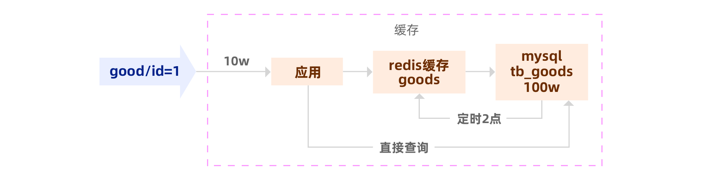

**解决方案**

- 思路：

  1.更多的页面静态化处理

  2.构建多级缓存架构

Nginx 缓存+redis 缓存+ehcache 缓存

3.检测 Mysql 严重耗时业务进行优化

对数据库的瓶颈排查：例如超时查询、耗时较高事务等

4.灾难预警机制

监控 redis 服务器性能指标

CPU 占用、CPU 使用率

内存容量

查询平均响应时间

线程数

5.限流、降级

短时间范围内牺牲一些客户体验，限制一部分请求访问，降低应用服务器压力，待业务低速运转后再逐步放开访问

- 落地实践：

  1.LRU 与 LFU 切换

  2.数据有效期策略调整

根据业务数据有效期进行分类错峰，A 类 90 分钟，B 类 80 分钟，C 类 70 分钟

过期时间使用固定时间+随机值的形式，稀释集中到期的 key 的数量

3.超热数据使用永久 key

4.定期维护（自动+人工）

对即将过期数据做访问量分析，确认是否延时，配合访问量统计，做热点数据的延时

5.加锁：慎用！

**总的来说**：缓存雪崩就是瞬间过期数据量太大，导致对数据库服务器造成压力。如能够有效避免过期时间集中，可以有效解决雪崩现象的 出现（约 40%），配合其他策略一起使用，并监控服务器的运行数据，根据运行记录做快速调整。

### 3、缓存击穿

**场景**：还是数据库服务器崩溃，但是跟之前的场景有点不太一样

1.系统平稳运行过程中

2.数据库连接量瞬间激增

3.Redis 服务器无大量 key 过期

4.Redis 内存平稳，无波动

5.Redis 服务器 CPU 正常

6.数据库崩溃

**问题排查：**

1.Redis 中某个 key 过期，该 key 访问量巨大

2.多个数据请求从服务器直接压到 Redis 后，均未命中

3.Redis 在短时间内发起了大量对数据库中同一数据的访问

总而言之就两点：单个 key 高热数据，key 过期

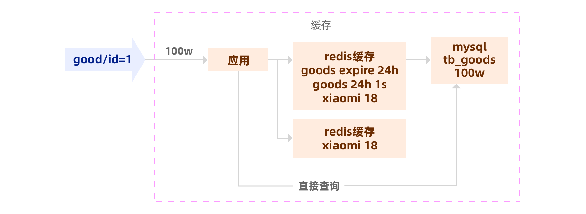

**解决方案**：

1.预先设定

以电商为例，每个商家根据店铺等级，指定若干款主打商品，在购物节期间，加大此类信息 key 的过期时长 注意：购物节不仅仅指当天，以及后续若干天，访问峰值呈现逐渐降低的趋势

2.现场调整

监控访问量，对自然流量激增的数据延长过期时间或设置为永久性 key

3.后台刷新数据

启动定时任务，高峰期来临之前，刷新数据有效期，确保不丢失

4.二级缓存

设置不同的失效时间，保障不会被同时淘汰就行

5.加锁

分布式锁，防止被击穿，但是要注意也是性能瓶颈，慎重！

**总的来说**：缓存击穿就是单个高热数据过期的瞬间，数据访问量较大，未命中 redis 后，发起了大量对同一数据的数据库访问，导致对数 据库服务器造成压力。应对策略应该在业务数据分析与预防方面进行，配合运行监控测试与即时调整策略，毕竟单个 key 的过 期监控难度较高，配合雪崩处理策略即可。

### 4、缓存穿透

**场景**：数据库服务器又崩溃了，跟之前的一样吗？

1.系统平稳运行过程中

2.应用服务器流量随时间增量较大

3.Redis 服务器命中率随时间逐步降低

4.Redis 内存平稳，内存无压力

5.Redis 服务器 CPU 占用激增

6.数据库服务器压力激增

7.数据库崩溃

**问题排查：**

1.Redis 中大面积出现未命中

2.出现非正常 URL 访问


**问题分析**：

- 获取的数据在数据库中也不存在，数据库查询未得到对应数据
- Redis 获取到 null 数据未进行持久化，直接返回
- 下次此类数据到达重复上述过程
- 出现黑客攻击服务器

**解决方案**：

1.缓存 null

对查询结果为 null 的数据进行缓存（长期使用，定期清理），设定短时限，例如 30-60 秒，最高 5 分钟

2.白名单策略

提前预热各种分类数据 id 对应的 bitmaps，id 作为 bitmaps 的 offset，相当于设置了数据白名单。当加载正常数据时放行，加载异常数据时直接拦截（效率偏低）

使用布隆过滤器（有关布隆过滤器的命中问题对当前状况可以忽略）

2.实施监控

实时监控 redis 命中率（业务正常范围时，通常会有一个波动值）与 null 数据的占比

非活动时段波动：通常检测 3-5 倍，超过 5 倍纳入重点排查对象

活动时段波动：通常检测 10-50 倍，超过 50 倍纳入重点排查对象

根据倍数不同，启动不同的排查流程。然后使用黑名单进行防控（运营）

4.key 加密

问题出现后，临时启动防灾业务 key，对 key 进行业务层传输加密服务，设定校验程序，过来的 key 校验

例如每天随机分配 60 个加密串，挑选 2 到 3 个，混淆到页面数据 id 中，发现访问 key 不满足规则，驳回数据访问。

**总的来说**：缓存击穿是指访问了不存在的数据，跳过了合法数据的 redis 数据缓存阶段，每次访问数据库，导致对数据库服务器造成压力。通常此类数据的出现量是一个较低的值，当出现此类情况以毒攻毒，并及时报警。应对策略应该在临时预案防范方面多做文章。

无论是黑名单还是白名单，都是对整体系统的压力，警报解除后尽快移除。

### 5、Redis 的命名规范

- 使用统一的命名规范

- 一般使用业务名(或数据库名)为前缀，用冒号分隔，例如，业务名:表名:id。
- 例如：shop:usr:msg_code（电商:用户:验证码）

- 控制 key 名称的长度，不要使用过长的 key

- 在保证语义清晰的情况下，尽量减少 Key 的长度。有些常用单词可使用缩写，例如，user 缩写为 u，messages 缩写为 msg。

- 名称中不要包含特殊字符

- 包含空格、单双引号以及其他转义字符

### 6、性能指标监控

redis 中的监控指标如下：

- 性能指标：Performance

响应请求的平均时间:

```properties
latency
```

平均每秒处理请求总数

```properties
instantaneous_ops_per_sec
```

缓存查询命中率（通过查询总次数与查询得到非 nil 数据总次数计算而来）

```properties
hit_rate(calculated)
```

- 内存指标：Memory

当前内存使用量

```properties
used_memory
```

内存碎片率（关系到是否进行碎片整理）

```properties
mem_fragmentation_ratio
```

为避免内存溢出删除的 key 的总数量

```properties
evicted_keys
```

基于阻塞操作（BLPOP 等）影响的客户端数量

```properties
blocked_clients
```

- 基本活动指标：Basic_activity

当前客户端连接总数

```properties
connected_clients
```

当前连接 slave 总数

```properties
connected_slaves
```

最后一次主从信息交换距现在的秒

```properties
master_last_io_seconds_ago
```

key 的总数

```properties
keyspace
```

- 持久性指标：Persistence

当前服务器最后一次 RDB 持久化的时间

```properties
rdb_last_save_time
```

当前服务器最后一次 RDB 持久化后数据变化总量

```properties
rdb_changes_since_last_save
```

- 错误指标：Error

被拒绝连接的客户端总数（基于达到最大连接值的因素）

```properties
rejected_connections
```

key 未命中的总次数

```properties
keyspace_misses
```

主从断开的秒数

```properties
master_link_down_since_seconds
```

要对 redis 的相关指标进行监控，我们可以采用一些用具：

- CloudInsight Redis
- Prometheus
- Redis-stat
- Redis-faina
- RedisLive
- zabbix

也有一些命令工具：

- benchmark

测试当前服务器的并发性能

```properties
redis-benchmark [-h ] [-p ] [-c ] [-n <requests]> [-k ]
```

范例 1：50 个连接，10000 次请求对应的性能

```properties
redis-benchmark
```

范例 2：100 个连接，5000 次请求对应的性能

```properties
redis-benchmark -c 100 -n 5000
```


- redis-cli monitor：启动服务器调试信息

```properties
monitor
slowlog：慢日志
```

获取慢查询日志

```properties
slowlog [operator]
```

get：获取慢查询日志信息

len：获取慢查询日志条目数

reset：重置慢查询日志

相关配置

```properties
slowlog-log-slower-than 1000 #设置慢查询的时间下线，单位：微妙
slowlog-max-len 100 #设置慢查询命令对应的日志显示长度，单位：命令数
```

## 第八章 常见问题

make: cc：命令未找到，make: \*\*\* [adlist.o] 错误 127

解决方法：安装 gcc，命令如下：

```bash
yum install gcc
```

Redis 编译错误 Killing still running Redis server 4966

```bash
Killing still  running Redis server 4966   Killing still running Redis server 4971   Killing still running Redis server 4976   Killing still running Redis server 4978   Killing still running Redis server 4980   Killing still running Redis server 4983   Killing still running Redis server 4990   Killing still running Redis server 4991   Killing still running Redis server 4998   Killing still running Redis server 5001   Killing still running Redis server 5014   Killing still running Redis server 5134   Killing still running Redis server 5187   Killing still running Redis server 5208   Killing still running Redis server 5224   Killing still running Redis server 5253   Killing still running Redis server 5265   make[1]: *** [test] Error 1   make[1]: Leaving directory  `/opt/redis/redis-6.2.6/src'   make: *** [test] Error 2
```

解决方案：

```bash
vim tests/integration/replication-2.tc
```

将 after 1000 修改为 after 10000

after 是 tcl 脚本中的命令，表示延迟程序执行或者在后台执行命令。

MISCONF Redis is configured to save RDB snapshots

异常信息：

```bash
redis.clients.jedis.exceptions.JedisDataException:  MISCONF Redis is configured to save RDB snapshots, but is currently not able  to persist on disk. Commands that may modify the data set are disabled.  Please check Redis logs for details about the error.
```

解决方案：

因为强制关闭 Redis 快照导致不能持久化。可以使用 kill -9 再次强制关闭掉 redis，然后在重新启动。

Connection error: Connection refused

修改配置文件 `/etc/redis.conf`，并注释掉 `bind 127.0.0.1` 这一行

Connection: Connection error: The remote host closed the connection

修改配置文件 `/etc/redis.conf`，将 protected-mode 为 no。

Node 192.168.200.131:7002 is not empty. Either the node already knows other nodes (check with CLUSTER NODES) or contains some key in database 0.

1. 先将 redis 进程干掉 `ps -ef | grep redis kill pid`
2. 将每个节点下 `aof`、`rdb`、`nodes.conf` 本地备份文件删除,`redis.conf` `appendfilename` ；
3. 之后再执行脚本，成功执行；
