---
# 当前页面内容标题
title: Redis 基础
# 当前页面图标
icon: redis
# 分类
category:
  - NoSQL
  - Redis
# 标签
tag:
  - NoSQL
  - Redis
  - 入门
sticky: false
# 是否收藏在博客主题的文章列表中，当填入数字时，数字越大，排名越靠前。
star: false
# 是否将该文章添加至文章列表中
article: false
# 目录顺序
order: 1
# 是否将该文章添加至时间线中
timeline: false
---

> [!TIP]
>
> 课程视频教程链接：<https://www.bilibili.com/video/BV1qq4y1x79a>

**课程目标**

- 能够掌握 Redis 不同数据类型操作
- 能够使用 Java API 操作 Redis
- 能够理解 Redis 的两种持久化方式

## 第一章 NoSQL 数据库发展历史简介

### 1、 Web 的历史发展历程

web1.0 时代简介

- web 1.0 是以编辑为特征，网站提供给用户的内容是网站编辑进行编辑处理后提供的，用户阅读网站提供的内容
- 这个过程是网站到用户的**单向行为**
- web1.0 时代的代表站点为新浪，搜狐，网易三大门户


性能要求：基本上就是一些简单的静态页面渲染，不会涉及太多复杂业务逻辑，功能简单单一，基本上服务器性能不会有太大压力


web2.0 时代简介

- 更注重用户的**交互**作用，用户既是网站内容的消费者（浏览者），也是网站内容的制造者
- 加强了网站与用户之间的**互动**，网站内容基于用户提供（微博、天涯社区、自媒体） 大数据推荐
- 网站的诸多功能也由用户参与建设，实现了网站与用户双向的交流与参与
- 用户在 web2.0 网站系统内拥有自己的数据，并完全基于 WEB，所有功能都能通过浏览器完成。

性能要求：

- 随着 Web2.0 时代到来，用户访问量大幅提升，同时产生大量用户数据。加上后来移动设备普及，所有的互联网平台都面临了巨大的性能挑战。**数据库服务器压力越来越大**
- 如何应对数据库的压力成为的关键。不管任何应用，数据始终是核心。传统关系型数据库根本无法承载较高的并发，此时人们就开始**用 Redis 当成缓存，来缓解数据库的压力**


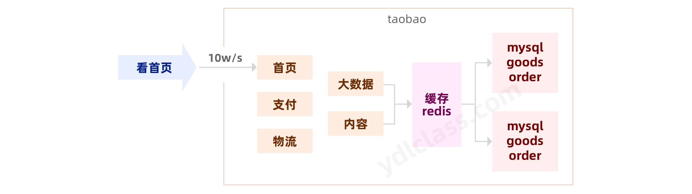

### 2、什么是 NoSQL

- NoSQL 最常见的解释是"non-relational"， 很多人也说它是"Not Only SQL"
- NoSQL 仅仅是一个概念，泛指非关系型的数据库
- 区别于关系数据库，它们不保证关系数据的 ACID 特性
- NoSQL 是一项全新的数据库革命性运动，提倡运用非关系型的数据存储，相对于铺天盖地的关系型数据库运用，这一概念无疑是一种全新的思维的注入

### 3、NoSQL 的特点 关系型数据库的补充

应用场景：

- 高并发的读写：10w/s
- 海量数据读写
- 高可扩展性：不限制语言、lua 脚本增强
- 速度快

不适用场景：

- 需要事务支持
- 基于 sql 的结构化查询存储，处理复杂的关系，需要即席查询（用户自定义查询条件的查询）政府银行金融项目，还是使用关系型数据库。oracle

### 4、NoSQL 数据库

memcache

- 很早出现的 NoSql 数据库
- 数据都在内存中，一般不持久化
- 支持简单的 key-value 模式
- 一般是作为缓存数据库辅助持久化的数据库

redis 介绍

- 几乎覆盖了 Memcached 的绝大部分功能
- 数据都在内存中，支持持久化，主要用作备份恢复
- 除了支持简单的 key-value 模式，还支持多种数据结构的存储，比如
  list、set、hash、zset 等。
- 一般是作为缓存数据库辅助持久化的数据库
- 现在市面上用得非常多的一款内存数据库

mongoDB 介绍

- 高性能、开源、模式自由(schema free)的文档型数据库
- 数据都在内存中， 如果内存不足，把不常用的数据保存到硬盘
- 虽然是 key-value 模式，但是对 value（尤其是 json）提供了丰富的查询功能
- 支持二进制数据及大型对象
- 可以根据数据的特点替代 RDBMS，成为独立的数据库。或者配合 RDBMS，存储特定的数据。

列式存储 HBase 介绍

HBase 是 **Hadoop** 项目中的数据库。它用于需要对大量的数据进行随机、实时读写操作的场景中。HBase 的目标就是处理数据量非常庞大的表，可以用普通的计算机处理超过 10 亿行数据，还可处理有数百万列元素的数据表。

## 第二章 Redis 介绍

redis 官网地址：<https://redis.io/>

中文网站：<https://redis.ac.cn/docs/latest/>

> Redis 源码中文注释：<https://github.com/CN-annotation-team/redis7.0-chinese-annotated>
>
> Redis 7.0.5 版本——中文注释，持续更新！欢迎参与本项目！🍭🍭🍭

### 1、Redis 的基本介绍

- Redis 是当前比较热门的 NoSQL 系统之一
- 它是一个开源的、使用 ANSI C 语言编写的 **key-value** 存储系统（区别于 MySQL 的二维表格形式存储）
- 和 Memcache 类似，但很大程度补偿了 Memcache 的不足，Redis 数据都是缓存在计算机**内存**中，不同的是，Memcache 只能将数据缓存到内存中，无法自动定期写入硬盘，这就表示，一断电或重启，内存清空，数据丢失

### 2、Redis 的应用场景

#### 2.1 取最新 N 个数据的操作

比如典型的取网站最新文章，可以将最新的 5000 条评论 ID 放在 Redis 的 List 集合中，并将超出集合部分从数据库获取

#### 2.2 排行榜应用，取 TOP N 操作

这个需求与上面需求的不同之处在于，前面操作以时间为权重，这个是以某个条件为权重，比如按顶的次数排序，可以使用 Redis 的 sorted set，将要排序的值设置成 sorted set 的 score，将具体的数据设置成相应的 value，每次只需要执行一条 ZADD 命令即可。

#### 2.3 需要精准设定过期时间的应用

比如可以把上面说到的 sorted set 的 score 值设置成过期时间的时间戳，那么就可以简单地通过过期时间排序，定时清除过期数据了，不仅是清除 Redis 中的过期数据，你完全可以把 Redis 里这个过期时间当成是对数据库中数据的索引，用 Redis 来找出哪些数据需要过期删除，然后再精准地从数据库中删除相应的记录。

#### 2.4 计数器应用

Redis 的命令都是原子性的，你可以轻松地利用 INCR，DECR 命令来构建计数器系统。

#### 2.5 Uniq 操作，获取某段时间所有数据排重值

这个使用 Redis 的 set 数据结构最合适了，只需要不断地将数据往 set 中扔就行了，set 意为集合，所以会自动排重。

#### 2.6 实时系统，反垃圾系统

通过上面说到的 set 功能，你可以知道一个终端用户是否进行了某个操作，可以找到其操作的集合并进行分析统计对比等。没有做不到，只有想不到。

#### 2.7 缓存

将数据直接存放到内存中，性能优于 Memcached，数据结构更多样化。

### 3、Redis 的特点

- 高效性 （内存）

- Redis 读取的速度是 30w 次/s，写的速度是 10w 次/s

- 原子性 (主逻辑线程是单线程)

- Redis 的所有操作都是原子性的，同时 Redis 还支持对几个操作全并后的原子性执行。 pipline

- 支持多种数据结构

- string（字符串） a->b 配置 color--> red
- list（列表） a->list 消息队列 msg--->`["hello","ydlclass","itlils"]`
- hash（哈希） a->map 购物车 1----->`["1"=>"剃须刀"，“2”=>“电脑”]`
- set（集合） a->set 去重 quchong-->`["北京"，“山西”，“河北“]`
- zset(有序集合) a->sorted set 排行榜 top10->`[”xx 拿了金牌,10“,"跑路了,9.5"]`

- 稳定性：持久化，主从复制（集群）
- 其他特性：支持过期时间，支持事务，消息订阅。

## 第三章 Redis 单机环境安装

### 1、Windows 版 Redis 安装（了解）

Windows 版的安装比较简单，解压 Redis 压缩包完成即安装完毕，安装的注意事项：

- 解压的目录不要有中文
- 目录结构层次不要太深
- 硬盘空间剩余空间最少要大于你的内存空间，建议 20G 以上

**Redis 目录结构：**

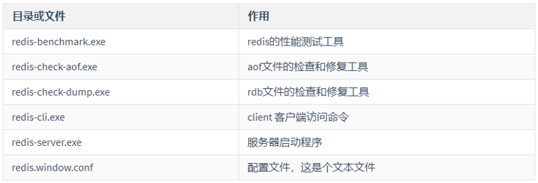

**Redis 服务启动与关闭：**

```text
1、启动服务器：cmd  redis-server.exe redis.windows.conf
2、默认端口号：6379
3、关闭服务器：直接关闭窗口
```

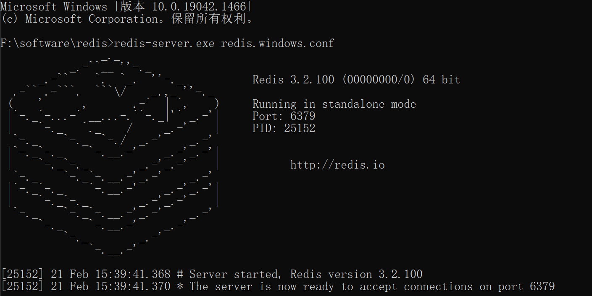

运行【**redis-cli.exe**】客户端：


redis 端口号 6379 来历：

光明版本：发明 redis 的人，可爱女儿。MERZ,九宫格---6379。 程序员的浪漫。

暗黑版本：MERZ 舞女--愚蠢。 发明者再愚蠢的人，也应该会使用 redis。

### 2、Linux 版 Redis 安装(运维)

#### 2.1 下载 redis 安装包

服务器执行以下命令下载 redis 安装包

```bash
cd /export/software
wget http://download.redis.io/releases/redis-6.2.6.tar.gz
```

#### 2.2 解压 redis 压缩包到指定目录

执行以下命令进行解压 redis

```bash
cd /export/software
tar -zxvf redis-6.2.6.tar.gz -C
```

#### 2.3 安装 C 程序运行环境

执行以下命令安装 C 程序运行环境

```bash
yum -y install gcc-c++
```

#### 2.4 安装较新版本的 tcl

下载安装较新版本的 tcl

使用压缩包进行安装

执行以下命令下载 tcl 安装包

```bash
cd /export/software
wget http://downloads.sourceforge.net/tcl/tcl8.6.1-src.tar.gz
# 解压tcl
tar -zxvf tcl8.6.1-src.tar.gz -C ../server/
# 进入指定目录
cd ../server/tcl8.6.1/unix/
./configure
make && make install
```

在线安装 tcl（推荐）

执行以下命令在线安装 tcl

```bash
yum -y install tcl
```

#### 2.5 编译 redis

执行以下命令进行编译：

```bash
cd /export/server/redis-6.2.6/
#或者使用命令 make 进行编译
make MALLOC=libc
make test && make install PREFIX=/export/server/redis-6.2.6
```

修改 redis 配置文件

执行以下命令修改 redis 配置文件

```bash
cd /export/server/redis-6.2.6/
mkdir -p /export/server/redis-6.2.6/log
mkdir -p /export/server/redis-6.2.6/data

vim redis.conf
# 修改第61行
bind localhost
# 修改第128行  后台
daemonize yes
# 修改第163行
logfile "/export/server/redis-6.2.6/log/redis.log"
# 修改第247行
dir /export/server/redis-6.2.6/data
```

#### 2.6 启动 redis

执行以下命令启动 redis

```bash
cd /export/server/redis-6.2.6/
bin/redis-server redis.conf
```

#### 2.7 关闭 redis

```bash
bin/redis-cli -h localhost shutdown
```

#### 2.8 连接 redis 客户端

执行以下命令连接 redis 客户端

```bash
cd /export/server/redis-6.2.6/
bin/redis-cli -h localhost
```

### 3、Redis Desktop Manager

一款基于 Qt5 的跨平台 Redis 桌面管理软件，支持：Windows 7+、Mac OS X 10.10+、 Ubuntu 14+，特点： C++ 编写，响应迅速，性能好。

```bash
下载地址：http://docs.redisdesktop.com/en/latest/install/#windows
```

安装客户端，连接 Redis 服务：


备注说明：Redis Desktoo Manager 老版本免费，新版本收费

## 第四章 Redis 的数据类型

redis 当中一共支持五种数据类型，分别是：

- string 字符串
- list 列表
- set 集合
- hash 表
- zset 有序集合

通过这五种不同的数据类型，可以实现各种不同的功能，也可以应用在各种不同的场景。

Redis 当中各种数据类型结构如下图：

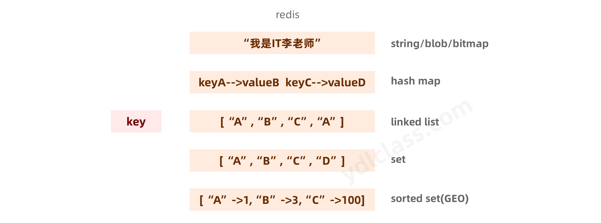

所有操作看官网：

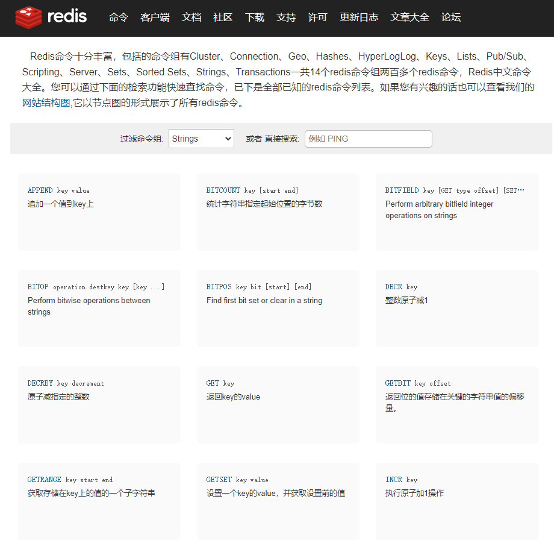

或者符合过人阅读习惯：[https://www.runoob.com/redis/redis-keys.html](redis_https:_www.runoob.com_redis_redis-keys)

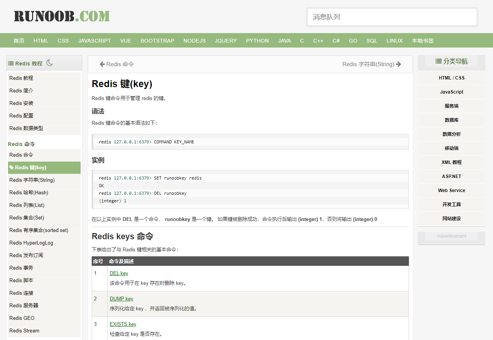

### 1、对字符串 string 的操作

下表列出了常用的 redis 字符串命令

| 序号 | 命令及描述                                                                                                                          | 示例                                                           |
| ---- | ----------------------------------------------------------------------------------------------------------------------------------- | -------------------------------------------------------------- |
| 1    | SET key value 设置指定 key 的值                                                                                                     | 示例：SET hello world                                          |
| 2    | GET key 获取指定 key 的值。                                                                                                         | 示例：GET hello                                                |
| 4    | GETSET key value 将给定 key 的值设为 value ，并返回 key 的旧值(old value)。                                                         | 示例：GETSET hello world2                                      |
| 5    | MGET key1 [key2..] 获取所有(一个或多个)给定 key 的值。                                                                              | 示例：MGET hello world                                         |
| 6    | SETEX key seconds value 将值 value 关联到 key ，并将 key 的过期时间设为 seconds (以秒为单位)。                                      | 示例：SETEX hello 10 world3                                    |
| 7    | SETNX key value 只有在 key 不存在时设置 key 的值。                                                                                  | 示例：SETNX ydlclass redisvalue                                |
| 9    | STRLEN key 返回 key 所储存的字符串值的长度。                                                                                        | 示例：STRLEN ydlclass                                          |
| 10   | MSET key value [key value ] 同时设置一个或多个 key-value 对。                                                                       | 示例：MSET ydlclass2 ydlclassvalue2 ydlclass3 ydlclassvalue3   |
| 12   | MSETNX key value key value 同时设置一个或多个 key-value 对，当且仅当所有给定 key 都不存在。                                         | 示例：MSETNX ydlclass4 ydlclassvalue4 ydlclass5 ydlclassvalue5 |
| 13   | PSETEX key milliseconds value 这个命令和 SETEX 命令相似，但它以毫秒为单位设置 key 的生存时间，而不是像 SETEX 命令那样，以秒为单位。 | 示例：PSETEX ydlclass6 6000 ydlclass6value                     |
| 14   | INCR key 将 key 中储存的数字值增一。                                                                                                | 示例： set ydlclass7 1 INCR ydlclass7 GET ydlclass7            |
| 15   | INCRBY key increment 将 key 所储存的值加上给定的增量值（increment）                                                                 | 示例：INCRBY ydlclass7 2 get ydlclass7                         |
| 16   | INCRBYFLOAT key increment 将 key 所储存的值加上给定的浮点增量值（increment）                                                        | 示例：INCRBYFLOAT ydlclass7 0.8                                |
| 17   | DECR key 将 key 中储存的数字值减一。                                                                                                | 示例： set ydlclass8 1 DECR ydlclass8 GET ydlclass8            |
| 18   | DECRBY key decrement key 所储存的值减去给定的减量值（decrement）                                                                    | 示例：DECRBY ydlclass8 3                                       |
| 19   | APPEND key value 如果 key 已经存在并且是一个字符串， APPEND 命令将指定的 value 追加到该 key 原来值（value）的末尾。                 | 示例：APPEND ydlclass8 hello                                   |

```bash
# 设置值 获取值
set ydlclass value
get ydlclass
# mset mget 一次性操作多组数据
mset ydlclass value ydlclass1 value1 ydlclass2 value2
mget ydlclass ydlclass1 ydlclass2
# 没有这个键我们才设置
setnx dlclass value
# 将key的值 加一，减一
incr stock
decr stock
5设置 a值存活时间5秒，值是b    验证码
setex a 5 b
```


### 2、对 hash 列表的操作

Redis hash 是一个 string 类型的 field 和 value 的映射表，hash 特别适合用于存储对象。

Redis 中每个 hash 可以存储 2 的 32 - 1 键值对（40 多亿）


下表列出了 redis hash 基本的相关命令：

| 序号 | 命令及描述                                                                                     | 示例                                                             |
| ---- | ---------------------------------------------------------------------------------------------- | ---------------------------------------------------------------- |
| 1    | HSET key field value 将哈希表 key 中的字段 field 的值设为 value 。                             | 示例：HSET key1 field1 value1                                    |
| 2    | HSETNX key field value 只有在字段 field 不存在时，设置哈希表字段的值。                         | 示例：HSETNX key1 field2 value2                                  |
| 3    | HMSET key field1 value1 [field2 value2 ] 同时将多个 field-value (域-值)对设置到哈希表 key 中。 | 示例：HMSET key1 field3 value3 field4 value4                     |
| 4    | HEXISTS key field 查看哈希表 key 中，指定的字段是否存在。                                      | 示例： HEXISTS key1 field4 HEXISTS key1 field6                   |
| 5    | HGET key field 获取存储在哈希表中指定字段的值。                                                | 示例：HGET key1 field4                                           |
| 6    | HGETALL key 获取在哈希表中指定 key 的所有字段和值                                              | 示例：HGETALL key1                                               |
| 7    | HKEYS key 获取所有哈希表中的字段                                                               | 示例：HKEYS key1                                                 |
| 8    | HLEN key 获取哈希表中字段的数量                                                                | 示例：HLEN key1                                                  |
| 9    | HMGET key field1 [field2] 获取所有给定字段的值                                                 | 示例：HMGET key1 field3 field4                                   |
| 10   | HINCRBY key field increment 为哈希表 key 中的指定字段的整数值加上增量 increment 。             | 示例： HSET key2 field1 1 HINCRBY key2 field1 1 HGET key2 field1 |
| 11   | HINCRBYFLOAT key field increment 为哈希表 key 中的指定字段的浮点数值加上增量 increment 。      | 示例：HINCRBYFLOAT key2 field1 0.8                               |
| 12   | HVALS key 获取哈希表中所有值                                                                   | 示例：HVALS key1                                                 |
| 13   | HDEL key field1 [field2] 删除一个或多个哈希表字段                                              | 示例： HDEL key1 field3 HVALS key1                               |

```bash
# 设置值 获取值
hset user username itlils
hset user age 18
hget user username
# 批量
hmset user1 username itnanls age 19
# 获取所有的键值对
hgetall user
# 获取所有小key
hkeys  user
# 获取所有值
HVALS user
# 删除
hdel user age
```

### 3、对 list 列表的操作

Redis 列表是简单的字符串列表，按照插入**顺序**排序。你可以添加一个元素到列表的头部（左边）或者尾部（右边）

一个列表最多可以包含 2 的 32 - 1 个元素 (4294967295, 每个列表超过 40 亿个元素)。

下表列出了列表相关的基本命令：

| **序号** | **命令及描述**                                                                                                                                                    | **示例**                                           |
| -------- | ----------------------------------------------------------------------------------------------------------------------------------------------------------------- | -------------------------------------------------- |
| 1        | **LPUSH key value1 [value2]** 将一个或多个值插入到列表头部                                                                                                        | 示例：LPUSH list1 value1 value2                    |
| 2        | **LRANGE key start stop** 查看 list 当中所有的数据                                                                                                                | 示例：LRANGE list1 0 -1                            |
| 3        | LPUSHX key value 将一个值插入到已存在的列表头部                                                                                                                   | 示例：LPUSHX list1 value3 LINDEX list1 0           |
| 4        | RPUSH key value1 [value2] 在列表中添加一个或多个值到尾部                                                                                                          | 示例： RPUSH list1 value4 value5 LRANGE list1 0 -1 |
| 5        | RPUSHX key value 为已存在的列表添加单个值到尾部                                                                                                                   | 示例：RPUSHX list1 value6                          |
| 6        | LINSERT key BEFORE\|AFTER pivot value 在列表的元素前或者后插入元素                                                                                                | 示例：LINSERT list1 BEFORE value3 beforevalue3     |
| 7        | LINDEX key index 通过索引获取列表中的元素                                                                                                                         | 示例：LINDEX list1 0                               |
| 8        | LSET key index value 通过索引设置列表元素的值                                                                                                                     | 示例：LSET list1 0 hello                           |
| 9        | LLEN key 获取列表长度                                                                                                                                             | 示例：LLEN list1                                   |
| 10       | LPOP key 移出并获取列表的第一个元素                                                                                                                               | 示例：LPOP list1                                   |
| 11       | RPOP key 移除列表的最后一个元素，返回值为移除的元素。                                                                                                             | 示例：RPOP list1                                   |
| 12       | BLPOP key1 [key2 ] timeout 移出并获取列表的第一个元素， 如果列表没有元素会阻塞列表直到等待超时或发现可弹出元素为止。                                              | 示例：BLPOP list1 2000                             |
| 13       | BRPOP key1 [key2 ] timeout 移出并获取列表的最后一个元素， 如果列表没有元素会阻塞列表直到等待超时或发现可弹出元素为止。                                            | 示例：BRPOP list1 2000                             |
| 14       | RPOPLPUSH source destination 移除列表的最后一个元素，并将该元素添加到另一个列表并返回                                                                             | 示例：RPOPLPUSH list1 list2                        |
| 15       | BRPOPLPUSH source destination timeout 从列表中弹出一个值，将弹出的元素插入到另外一个列表中并返回它； 如果列表没有元素会阻塞列表直到等待超时或发现可弹出元素为止。 | 示例：BRPOPLPUSH list1 list2 2000                  |
| 16       | LTRIM key start stop 对一个列表进行修剪(trim)，就是说，让列表只保留指定区间内的元素，不在指定区间之内的元素都将被删除。                                           | 示例：LTRIM list1 0 2                              |
| 17       | DEL key1 key2 删除指定 key 的列表                                                                                                                                 | 示例：DEL list2                                    |

```bash
# 设置值
lpush list1 1 2 3 4 1
rpush list1 6
# 查看数据
lrange list1 0 -1
# 移除数据
lpop list1
rpop list1
```


### 4、对 set 集合的操作

- Redis 的 Set 是 String 类型的**无序**集合。集合成员是**唯一**的，这就意味着集合中不能出现重复的数据
- Redis 中集合是通过哈希表实现的，所以添加，删除，查找的复杂度都是 O(1)。
- 集合中最大的成员数为 2 的 32 - 1 (4294967295, 每个集合可存储 40 多亿个成员)。

下表列出了 Redis 集合基本命令：

| **序号** | **命令及描述**                                                                      | **示例**                                             |
| -------- | ----------------------------------------------------------------------------------- | ---------------------------------------------------- |
| 1        | SADD key member1 [member2] 向集合添加一个或多个成员                                 | 示例：SADD set1 setvalue1 setvalue2                  |
| 2        | SMEMBERS key 返回集合中的所有成员                                                   | 示例：SMEMBERS set1                                  |
| 3        | SCARD key 获取集合的成员数                                                          | 示例：SCARD set1                                     |
| 4        | SDIFF key1 [key2] 返回给定所有集合的差集                                            | 示例： SADD set2 setvalue2 setvalue3 SDIFF set1 set2 |
| 5        | SDIFFSTORE destination key1 [key2] 返回给定所有集合的差集并存储在 destination 中    | 示例：SDIFFSTORE set3 set1 set2                      |
| 6        | SINTER key1 [key2] 返回给定所有集合的交集                                           | 示例：SINTER set1 set2                               |
| 7        | SINTERSTORE destination key1 [key2] 返回给定所有集合的交集并存储在 destination 中   | 示例：SINTERSTORE set4 set1 set2                     |
| 8        | SISMEMBER key member 判断 member 元素是否是集合 key 的成员                          | 示例：SISMEMBER set1 setvalue1                       |
| 9        | SMOVE source destination member 将 member 元素从 source 集合移动到 destination 集合 | 示例：SMOVE set1 set2 setvalue1                      |
| 10       | SPOP key 移除并返回集合中的一个随机元素                                             | 示例：SPOP set2                                      |
| 11       | SRANDMEMBER key [count] 返回集合中一个或多个随机数                                  | 示例：SRANDMEMBER set2 2                             |
| 12       | SREM key member1 [member2] 移除集合中一个或多个成员                                 | 示例：SREM set2 setvalue1                            |
| 13       | SUNION key1 [key2]] 返回所有给定集合的并集                                          | 示例：SUNION set1 set2                               |
| 14       | SUNIONSTORE destination key1 [key2] 所有给定集合的并集存储在 destination 集合中     | 示例：SUNIONSTORE set5 set1 set2                     |

```bash
# 添加数据
sadd set1 1 2 3 4 5
# 获取数据
smembers set1
# 获取成员数量
scard set1
# 业务 uv 当天登陆用户数
sadd uv:20220222 001 002 003 002
scard uv:20220222
```

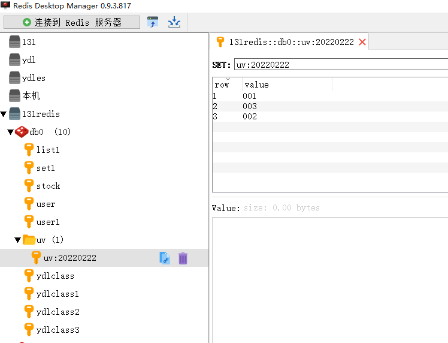

### 5、对 key 的操作

下表给出了与 Redis 键相关的基本命令：

| 序号 | 命令及描述                                                           | 示例                      |
| ---- | -------------------------------------------------------------------- | ------------------------- |
| 1    | DEL key 该命令用于在 key 存在时删除 key。                            | 示例：del ydlclass5       |
| 2    | DUMP key 序列化给定 key ，并返回被序列化的值。                       | 示例：DUMP key1           |
| 3    | EXISTS key 检查给定 key 是否存在。                                   | 示例：exists ydlclass     |
| 4    | EXPIRE key seconds 为给定 key 设置过期时间，以秒计。                 | 示例：expire ydlclass 5   |
| 6    | PEXPIRE key milliseconds 设置 key 的过期时间以毫秒计。               | 示例：PEXPIRE set3 3000   |
| 8    | KEYS pattern 查找所有符合给定模式( pattern)的 key 。                 | 示例：keys \*             |
| 10   | PERSIST key 移除 key 的过期时间，key 将持久保持。                    | 示例：persist set2        |
| 11   | PTTL key 以毫秒为单位返回 key 的剩余的过期时间。                     | 示例：pttl set2           |
| 12   | TTL key 以秒为单位，返回给定 key 的剩余生存时间(TTL, time to live)。 | 示例：ttl set2            |
| 13   | RANDOMKEY 从当前数据库中随机返回一个 key 。                          | 示例： randomkey          |
| 14   | RENAME key newkey 修改 key 的名称                                    | 示例：rename set5 set8    |
| 15   | RENAMENX key newkey 仅当 newkey 不存在时，将 key 改名为 newkey 。    | 示例：renamenx set8 set10 |
| 16   | TYPE key 返回 key 所储存的值的类型。                                 | 示例：type set10          |

```bash
# 删除
del user1
# 查看所有的key
keys *    # 生产环境下，别用
# 存在key
exists user1
# 存活时间
expire ydlclass 5
# 剩余存活时间   登陆续期
pttl user1
# 随机获取 key
randomkey
```

### 6、对 ZSet 的操作-重要（热搜）

- Redis 有序集合和集合一样也是 string 类型元素的集合,且不允许重复的成员
- 它用来保存需要排序的数据，例如排行榜，一个班的语文成绩，一个公司的员工工资，一个论坛的帖子等。
- 有序集合中，每个元素都带有 score（权重），以此来对元素进行排序
- 它有三个元素：key、member 和 score。以语文成绩为例，key 是考试名称（期中考试、期末考试等），member 是学生名字，score 是成绩。

- 互联网，微博热搜，最热新闻，统计网站 pv

| **#** | **命令及描述**                                                                                                    | **示例**                                                                                                                                                    |
| ----- | ----------------------------------------------------------------------------------------------------------------- | ----------------------------------------------------------------------------------------------------------------------------------------------------------- |
| 1     | ZADD key score1 member1 [score2 member2] 向有序集合添加一个或多个成员，或者更新已存在成员的分数                   | 向 ZSet 中添加页面的 PV 值 ZADD pv_zset 120 page1.html 100 page2.html 140 page3.html                                                                        |
| 2     | ZCARD key 获取有序集合的成员数                                                                                    | 获取所有的统计 PV 页面数量 ZCARD pv_zset                                                                                                                    |
| 3     | ZCOUNT key min max 计算在有序集合中指定区间分数的成员数                                                           | 获取 PV 在 120-140 在之间的页面数量 ZCOUNT pv_zset 120 140                                                                                                  |
| 4     | ZINCRBY key increment member 有序集合中对指定成员的分数加上增量 increment                                         | 给 page1.html 的 PV 值+1 ZINCRBY pv_zset 1 page1.html                                                                                                       |
| 5     | ZINTERSTORE destination numkeys key [key ...] 计算给定的一个或多个有序集的交集并将结果集存储在新的有序集合 key 中 | 创建两个保存 PV 的 ZSET： ZADD pv_zset1 10 page1.html 20 page2.html ZADD pv_zset2 5 page1.html 10 page2.html ZINTERSTORE pv_zset_result 2 pv_zset1 pv_zset2 |
| 7     | ZRANGE key start stop [WITHSCORES] 通过索引区间返回有序集合指定区间内的成员                                       | 获取所有的元素，并可以返回每个 key 对一个的 score ZRANGE pv_zset_result 0 -1 WITHSCORES                                                                     |
| 9     | ZRANGEBYSCORE key min max [WITHSCORES] [LIMIT] 通过分数返回有序集合指定区间内的成员                               | 获取 ZSET 中 120-140 之间的所有元素 ZRANGEBYSCORE pv_zset 120 140                                                                                           |
| 10    | ZRANK key member 返回有序集合中指定成员的索引                                                                     | 获取 page1.html 的 pv 排名（升序） ZRANK pv_zset page3.html                                                                                                 |
| 11    | ZREM key member [member ...] 移除有序集合中的一个或多个成员                                                       | 移除 page1.html ZREM pv_zset page1.html                                                                                                                     |
| 15    | ZREVRANGE key start stop [WITHSCORES] 返回有序集中指定区间内的成员，通过索引，分数从高到低                        | 按照 PV 降序获取页面 ZREVRANGE pv_zset 0 -1                                                                                                                 |
| 17    | ZREVRANK key member 返回有序集合中指定成员的排名，有序集成员按分数值递减(从大到小)排序                            | 获取 page2.html 的 pv 排名（降序） ZREVRANK pv_zset page2.html                                                                                              |
| 18    | ZSCORE key member 返回有序集中，成员的分数值                                                                      | 获取 page3.html 的分数值 ZSCORE pv_zset page3.html                                                                                                          |

```bash
# 添加
zadd pv 100 page1.html 200 page2.html 300 page3.html
# 查看
zcard pv
# 查询指定权重范围的成员数
ZCOUNT pv 150 500
# 增加权重
ZINCRBY pv 1 page1.html
# 交集
ZADD pv_zset1 10 page1.html 20  page2.html
ZADD pv_zset2 5 page1.html 10  page2.html
ZINTERSTORE pv_zset_result 2 pv_zset1  pv_zset2
# 成员的分数值
ZSCORE pv_zset page3.html
# 获取下标范围内的成员。 排序，默认权重由低到高
ZRANGE pv 0 -1
# 获取由高到低的几个成员（reverse）使用最多的
# 效率很高，因为本身zset就是排好序的。
ZREVRANGE key start stop
```

### 7、对位图 BitMaps 的操作

- 计算机最小的存储单位是位 bit，Bitmaps 是针对位的操作的，相较于 String、Hash、Set 等存储方式更加节省空间
- Bitmaps 不是一种数据结构，操作是基于 String 结构的，一个 String 最大可以存储 512M，那么一个 Bitmaps 则可以设置 2^32 个位
- Bitmaps 单独提供了一套命令，所以在 Redis 中使用 Bitmaps 和使用字符串的方法不太相同。可以**把 Bitmaps 想象成一个以位为单位的数组**，数组的每个单元**只能存储 0 和 1**，数组的下标在 Bitmaps 中叫做偏移量 offset
- BitMaps 命令说明：**将每个独立用户是否访问过网站存放在 Bitmaps 中， 将访问的用户记做 1， 没有访问的用户记做 0， 用偏移量作为用户的 id** 。unique:users:2022-04-05 0 1 0 0

#### 7.1 设置值

```bash
SETBIT key offset value
```

**setbit** 命令设置的 vlaue 只能是 **0** 或 **1** 两个值

- 设置键的第 offset 个位的值（从 0 算起），假设现在有 20 个用户，**uid=0，5，11，15，19** 的用户对网站进行了访问， 那么当前 Bitmaps 初始化结果如图所示
- 具体操作过程如下， **unique:users:2022-04-05**代表 2022-04-05 这天的独立访问用户的 Bitmaps

```bash
setbit unique:users:2022-04-05 0  1
 setbit unique:users:2022-04-05 5 1
 setbit unique:users:2022-04-05 11 1
 setbit unique:users:2022-04-05 15 1
 setbit unique:users:2022-04-05 19 1
```

- 很多应用的用户 id 以一个指定数字（例如 10000） 开头， 直接将用户 id 和 Bitmaps 的偏移量对应势必会造成一定的浪费， 通常的做法是每次做 setbit 操作时将用户 id 减去这个指定数字。10000000 10000005 10000011
- 在第一次初始化 Bitmaps 时， 假如偏移量非常大， 那么整个初始化过程执行会比较慢， 可能会造成 Redis 的阻塞。

#### 7.2 获取值

```bash
GETBIT key offset
```

获取键的第 offset 位的值（从 0 开始算），例：下面操作获取 id=8 的用户是否在 2022-04-05 这天访问过， 返回 0 说明没有访问过。

```bash
getbit unique:users:2022-04-05 8
```

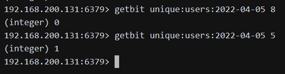

#### 7.3 获取 Bitmaps 指定范围值为 1 的个数

```bash
BITCOUNT key [start end]
```

例：下面操作计算 2022-04-05 这天的独立访问用户数量：

```bash
bitcount unique:users:2022-04-05
```

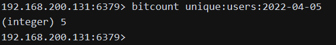

#### 7.4 Bitmaps 间的运算

```bash
BITOP operation destkey key [key, …]
```

bitop 是一个复合操作， 它可以做多个 Bitmaps 的 and（交集） 、 or（并集） 、 not（非） 、 xor（异或） 操作并将结果保存在 destkey 中。

需求：假设 2022-04-04 访问网站的 userid=1， 2， 5， 9， 如图 3-13 所示：

```bash
setbit unique:users:2022-04-04 1 1
setbit  unique:users:2022-04-04 2 1
setbit  unique:users:2022-04-04 5 1
setbit  unique:users:2022-04-04 9 1
```

例 1：下面操作计算出 2022-04-04 和 2022-04-05 两天都访问过网站的用户数量， 如下所示。

```bash
bitop and unique:users:and:2022-04-04_05  unique:users:2022-04-04 unique:users:2022-04-05
bitcount unique:users:and:2022-04-04_05
```

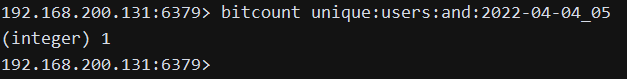

例 2：如果想算出 2022-04-04 和 2022-04-05 任意一天都访问过网站的用户数量（例如月活跃就是类似这种） ， 可以使用 or 求并集， 具体命令如下：

```bash
bitop or unique:users:or:2022-04-04_05  unique:users:2022-04-04 unique:users:2022-04-05
 bitcount unique:users:or:2022-04-04_05
```

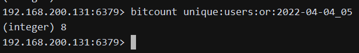

### 8、对 HyperLogLog 结构的操作

#### 8.1 应用场景

HyperLogLog 常用于大数据量的统计，比如页面访问量统计或者用户访问量统计。

要统计一个页面的访问量（PV），可以直接用 redis 计数器或者直接存数据库都可以实现，如果要统计一个页面的用户访问量（UV），一个用户一天内如果访问多次的话，也只能算一次，这样，我们可以使用 SET 集合来做，因为 SET 集合是有**去重**功能的，key 存储页面对应的关键字，value 存储对应的 userid，这种方法是可行的。但如果访问量较多，假如有几千万的访问量，这就麻烦了。为了统计访问量，要频繁创建 SET 集合对象。


Redis 实现 HyperLogLog 算法，HyperLogLog 这个数据结构的发明人 是 Philippe Flajolet（菲利普·弗拉若莱）教授。Redis 在 2.8.9 版本添加了 HyperLogLog 结构。

#### 8.2 UV 计算示例

```bash
node1.ydlclass.cn:6379> help @hyperloglog

PFADD  key element [element ...]
summary:  Adds the specified elements to the specified HyperLogLog.
since:  2.8.9

PFCOUNT  key [key ...]
summary:  Return the approximated cardinality（基数） of the set(s) observed by the HyperLogLog at  key(s).
since:  2.8.9

PFMERGE  destkey sourcekey [sourcekey ...]
summary:  Merge N different HyperLogLogs into a single one.
since:  2.8.9
```

Redis 集成的 HyperLogLog 使用语法主要有 pfadd 和 pfcount，顾名思义，一个是来添加数据，一个是来统计的。

为什么用 **pf**？

是因为 HyperLogLog 这个数据结构的发明人 是 Philippe Flajolet 教授 ，所以用发明人的英文缩写，这样容易记住这个语法了。

下面我们通过一个示例，来演示如何计算 uv。

```bash
node1.ydlclass.cn:6379> pfadd uv user1
(integer) 1
node1.ydlclass.cn:6379> keys *
1) "uv"
node1.ydlclass.cn:6379> pfcount uv
(integer) 1
node1.ydlclass.cn:6379> pfadd uv user2
(integer) 1
node1.ydlclass.cn:6379> pfcount uv
(integer) 2
node1.ydlclass.cn:6379> pfadd uv user3
(integer) 1
node1.ydlclass.cn:6379> pfcount uv
(integer) 3
node1.ydlclass.cn:6379> pfadd uv user4
(integer) 1
node1.ydlclass.cn:6379> pfcount uv
(integer) 4
node1.ydlclass.cn:6379> pfadd uv user5 user6  user7 user8 user9 user10
(integer) 1  node1.ydlclass.cn:6379> pfcount uv
(integer) 10
```

HyperLogLog 算法一开始就是为了大数据量的统计而发明的，所以很适合那种数据量很大，然后又没要求不能有一点误差的计算，HyperLogLog 提供不精确的去重计数方案，虽然不精确但是也不是非常不精确，标准误差是 0.81%，不过这对于页面用户访问量是没影响的，因为这种统计可能是访问量非常巨大，但是又没必要做到绝对准确，访问量对准确率要求没那么高，但是性能存储方面要求就比较高了，而 HyperLogLog 正好符合这种要求，不会占用太多存储空间，同时性能不错

**pfadd** 和 **pfcount** 常用于统计，需求：假如两个页面很相近，现在想统计这两个页面的用户访问量呢？这里就可以用 **pfmerge** 合并统计了，语法如例子：

```bash
node1.ydlclass.cn:6379> pfadd page1 user1 user2  user3 user4 user5
(integer) 1
node1.ydlclass.cn:6379> pfadd page2 user1 user2  user3 user6 user7
(integer) 1
node1.ydlclass.cn:6379> pfmerge page1+page2  page1 page2
OK
node1.ydlclass.cn:6379> pfcount page1+page2
(integer) 7
```

#### 8.3 HyperLogLog 为什么适合做大量数据的统计

- Redis HyperLogLog 是用来做基数统计的算法，HyperLogLog 的优点是，在输入元素的数量或者体积非常非常大时，计算基数所需的空间总是固定的、并且是很小的。
- 在 Redis 里面，每个 HyperLogLog 键只需要花费 12 KB 内存，就可以计算接近 2^64 个不同元素的基数。这和计算基数时，元素越多耗费内存就越多的集合形成鲜明对比。
- 但是，因为 HyperLogLog 只会根据输入元素来计算基数，而不会储存输入元素本身，所以 HyperLogLog 不能像集合那样，返回输入的各个元素。

什么是基数？

比如：数据集 {1, 3, 5, 7, 5, 7, 8}，那么这个数据集的基数集 {1, 3, 5, 7, 8}，基数（不重复元素）为 5。基数估计就是在误差可接受的范围内，快速计算基数。

## 第五章 Redis Java API 操作

Redis 不仅可以通过命令行进行操作，也可以通过 JavaAPI 操作，通过使用 Java API 来对 Redis 数据库中的各种数据类型操作。

### 1、创建 maven 工程并导入依赖

#### 1.1 创建 Maven 工程

| groupId    | com.ydlclass |
| ---------- | ------------ |
| artifactId | redis_op     |

#### 1.2 导入 POM 依赖

```xml
<dependencies>
    <dependency>
        <groupId>redis.clients</groupId>
        <artifactId>jedis</artifactId>
        <version>2.9.0</version>
    </dependency>
    <dependency>
        <groupId>junit</groupId>
        <artifactId>junit</artifactId>
        <version>4.12</version>
        <scope>test</scope>
    </dependency>
    <dependency>
        <groupId>org.testng</groupId>
        <artifactId>testng</artifactId>
        <version>6.14.3</version>
        <scope>test</scope>
    </dependency>
</dependencies>
<build>
    <plugins>
        <plugin>
            <groupId>org.apache.maven.plugins</groupId>
            <artifactId>maven-compiler-plugin</artifactId>
            <version>3.0</version>
            <configuration>
                <source>1.8</source>
                <target>1.8</target>
                <encoding>UTF-8</encoding>
                <!--    <verbal>true</verbal>-->
            </configuration>
        </plugin>
    </plugins>
</build>
```

### 2、创建包结构和类

1. 在 test 目录创建 `com.ydlclass.redis.api_test` 包结构
2. 创建 RedisTest 类

### 3、连接以及关闭 redis 客户端

因为后续测试都需要用到 Redis 连接，所以，我们先创建一个 JedisPool 用于获取 Redis 连接。此处，我们基于 TestNG 来测试各类的 API。使用 `@BeforeTest` 在执行测试用例前，创建 Redis 连接池。使用 `@AfterTest` 在执行测试用例后，关闭连接池。

实现步骤：

1. 创建 JedisPoolConfig 配置对象，指定最大空闲连接为 10 个、最大等待时间为 3000 毫秒、最大连接数为 50、最小空闲连接 5 个
2. 创建 JedisPool
3. 使用 `@Test` 注解，编写测试用例，查看 Redis 中所有的 key a) 从 Redis 连接池获取 Redis 连接 b) 调用 keys 方法获取所有的 key c) 遍历打印所有 key

```java
package com.ydlclass.redis.api_test;

import org.junit.After;
import org.testng.annotations.AfterTest;
import org.testng.annotations.BeforeTest;
import org.testng.annotations.Test;
import redis.clients.jedis.Jedis;
import redis.clients.jedis.JedisPool;
import redis.clients.jedis.JedisPoolConfig;

import java.util.List;
import java.util.Set;

/**
 * 1. 创建JedisPoolConfig配置对象，指定最大空闲连接为10个、最大等待时间为3000毫秒、最大连接数为50、最小空闲连接5个
 * 2. 创建JedisPool
 * 3. 使用@Test注解，编写测试用例，查看Redis中所有的key
 * a) 从Redis连接池获取Redis连接
 * b) 调用keys方法获取所有的key
 * c) 遍历打印所有key
 */
public class RedisTest {

    private JedisPool jedisPool;

    @BeforeTest
    public void beforeTest() {
        // JedisPoolConfig配置对象
        JedisPoolConfig config = new JedisPoolConfig();
        // 指定最大空闲连接为10个
        config.setMaxIdle(10);
        // 最小空闲连接5个
        config.setMinIdle(5);
        // 最大等待时间为3000毫秒
        config.setMaxWaitMillis(3000);
        // 最大连接数为50
        config.setMaxTotal(50);

        jedisPool = new JedisPool(config, "192.168.200.131", 6379);
    }

    @Test
    public void keysTest() {
        // 从Redis连接池获取Redis连接
        Jedis jedis = jedisPool.getResource();
        // 调用keys方法获取所有的key
        Set<String> keySet = jedis.keys("*");

        for (String key : keySet) {
            System.out.println(key);
        }
    }


    @AfterTest
    public void afterTest() {
        // 关闭连接池
        jedisPool.close();
    }
}
```

### 4、操作 string 类型数据

1. 添加一个 string 类型数据，key 为 pv，用于保存 pv 的值，初始值为 0
2. 查询该 key 对应的数据
3. 修改 pv 为 1000
4. 实现整形数据原子自增操作 +1
5. 实现整形该数据原子自增操作 +1000

```java
@Test
public void stringTest() {
    // 获取Jedis连接
    Jedis jedis = jedisPool.getResource();
    // 1.添加一个string类型数据，key为pv，用于保存pv的值，初始值为0
    jedis.set("pv", "0");
    // 2.查询该key对应的数据
    System.out.println("pv:" + jedis.get("pv"));
    // 3.修改pv为1000
    jedis.set("pv", "1000");
    // 4.实现整形数据原子自增操作 +1
    jedis.incr("pv");
    // 5.实现整形该数据原子自增操作 +1000
    jedis.incrBy("pv", 1000);
    System.out.println(jedis.get("pv"));
    // 将jedis对象放回到连接池
    jedis.close();
}
```

### 5、操作 hash 列表类型数据

1. 往 Hash 结构中添加以下商品库存 `a) iphone11 => 10000b) macbookpro => 9000`
2. 获取 Hash 中所有的商品
3. 新增 3000 个 macbookpro 库存
4. 删除整个 Hash 的数据

```java
@Test
public void testHash(){
    //从池子里哪一个连接
    Jedis jedis = jedisPool.getResource();
    //1. 往Hash结构中添加以下商品库存 goods
    //   a)   iphone13 => 10000
    //   b)   macbookpro => 9000
    jedis.hset("goods", "iphone13", "10000");
    jedis.hset("goods", "macbookpro", "9000");
    //2. 获取Hash中所有的商品
    Set<String> goods = jedis.hkeys("goods");
    for (String good : goods) {
        System.out.println(good);
    }
    //3. 新增3000个macbookpro库存
    //String hget = jedis.hget("goods", "macbookpro");
    //int stock=Integer.parseInt(hget)+3000;
    //jedis.hset("goods", "macbookpro", stock+"");
    jedis.hincrBy("goods", "macbookpro", 3000);
    String hget = jedis.hget("goods", "macbookpro");
    System.out.println(hget);
    //4. 删除整个Hash的数据
    jedis.del("goods");
}
```

### 6、操作 list 类型数据

1. 向 list 的左边插入以下三个手机号码：18511310002、18912301233、18123123314
2. 从右边移除一个手机号码
3. 获取 list 所有的值

```java
@Test
public void listTest() {
    // 获取Jedis连接
    Jedis jedis = jedisPool.getResource();
    // 1. 向list的左边插入以下三个手机号码：18511310001、18912301231、18123123312
    jedis.lpush("tel_list", "18511310001", "18912301231", "18123123312");
    // 2. 从右边移除一个手机号码
    jedis.rpop("tel_list");
    // 3. 获取list所有的值
    List<String> telList = jedis.lrange("tel_list", 0, -1);
    for (String tel : telList) {
        System.out.println(tel);
    }
    jedis.close();
}
```

### 7、操作 set 类型的数据

使用 set 来保存 uv 值，为了方便计算，将用户名保存到 uv 中。

1. 往一个 set 中添加页面 page1 的 uv，用户 user1 访问一次该页面
2. user2 访问一次该页面
3. user1 再次访问一次该页面
4. 最后获取 page1 的 uv 值

```java
@Test
public void setTest(){
    // 获取Jedis连接
    Jedis jedis = jedisPool.getResource();
    // 求UV就是求独立有多少个（不重复）
    // 1. 往一个set中添加页面 page1 的uv，用户user1访问一次该页面
    jedis.sadd("uv", "user1");
    // jedis.sadd("uv", "user3");
    // jedis.sadd("uv", "user1");
    // 2. user2访问一次该页面
    jedis.sadd("uv", "user2");
    // 3. user1再次访问一次该页面
    jedis.sadd("uv", "user1");
    // 4. 最后获取 page1的uv值
    System.out.println("uv:" + jedis.scard("uv"));
    jedis.close();
}
```

作业：

jedis 操作 bitmap，HyperLogLog。自己做一下。
