---
# 当前页面内容标题
title: Java Web
# 当前页面图标
icon: java
# 分类
category:
  - javaee
  - javaweb
# 标签
tag:
  - javaweb
sticky: false
# 是否收藏在博客主题的文章列表中，当填入数字时，数字越大，排名越靠前。
star: false
# 是否将该文章添加至文章列表中
article: false
# 目录顺序
order: 1
# 是否将该文章添加至时间线中
timeline: false
---

## 第一章 前端和后端的链接

### 一、 web 概念

这是百度百科的解释：

web（World Wide Web）即全球广域网，也称为万维网，它是一种基于超文本和HTTP的、全球性的、动态交互的、跨平台的分布式图形信息系统。是建立在Internet上的一种网络服务，为浏览者在Internet上查找和浏览信息提供了图形化的、易于访问的直观界面，其中的文档及超级链接将Internet上的信息节点组织成一个互为关联的网状结构。

万维网不等于互联网，万维网是互联网的一个应用，简单的理解万维网就是由大量的服务器，比如百度、比如淘宝、比如我们的元动力网站组成，用户可以通过在浏览器中使用网址（资源定位符）来获取网络资源。如果我们想开发一个web应用，就需要开发应用，并部署在服务器上，当然这个服务器可以被其他人访问。

#### 1、软件架构

```text
 C/S： 客户端/服务器端 ------------> QQ , 360 ...   client server
 B/S： 浏览器/服务器端 ------------> 京东， 网易 ， 淘宝   brower/server
```

#### 2、资源分类

1. **静态资源：** 所有用户访问后，得到的结果都是一样的，称为静态资源。静态资源可以直接被浏览器解析。如图片、视频等。
2. **动态资源:** 每个用户访问相同资源后，得到的结果可能不一样 , 称为动态资源。动态资源被访问后，需要先转换为静态资源，再返回给浏览器，通过浏览器进行解析。比如我们之前写的登录，不同的人登录后显示的用户名并不相同。

- 如：servlet,jsp,php,asp....

#### 3、常见的web服务器

##### （1）概念

1. 服务器：安装了服务器软件的计算机
2. 服务器软件：接收用户的请求，处理请求，做出响应
3. web服务器软件：接收用户的请求，处理请求，做出响应。

在web服务器软件中，可以部署web项目，让用户通过浏览器来访问这些项目

##### （2）常见服务器软件

> 动态服务器

- webLogic：oracle公司，大型的JavaEE服务器，支持JavaEE规范，收费的。
- webSphere：IBM公司，大型的JavaEE服务器，支持JavaEE规范，收费的。
- JBOSS：JBOSS公司的，大型的JavaEE服务器，支持JavaEE规范，收费的。
- Tomcat：Apache基金组织，中小型的JavaEE服务器，仅仅支持少量的JavaEE规范servlet/jsp。开源的，免费的。（300左右的并发）

> 静态的服务器

- Nginx：（代理，反向代理等）极高的并发 Nginx处理静态文件、索引文件，自动索引的效率非常高。当然除了当做高性能的静态服务器，它还有很多强大的功能，我们后边会有专项课程学习。

### 二、Hello World

我们已经学习了javase、mysql以及前端知识，jdbc负责java和持久层，那前端怎么和我们的java配合使用呢？

我们回想mysql的链接，不同的客户端通过url访问mysql，是通过套接字进行链接的：

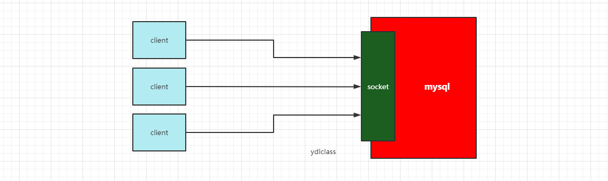

与此同时，我们的浏览器也是使用url访问网站的啊，我们不妨尝试一下，建立一个服务器监听在8888端口，

很明显，我们启动的服务是基于TCP协议的套接字:

```java
public static void main(String[] args) throws Exception {
        // 启动一个服务器
        ServerSocket serverSocket = new ServerSocket(8080);
        Socket accept = serverSocket.accept();
        // 获得输入流
        InputStream inputStream = accept.getInputStream();
        byte[] buf = new byte[1024];
        int len;
        while ((len = inputStream.read(buf)) != -1){
            System.out.print(new String(buf,0,len));
        }
        inputStream.close();;
        accept.close();
    }
```

我们打开一个浏览器，在浏览器中输入：


我们观察一下后台的输出：

```http
GET / HTTP/1.1
Host: 127.0.0.1:8888
Connection: keep-alive
Cache-Control: max-age=0
Upgrade-Insecure-Requests: 1
User-Agent: Mozilla/5.0 (Windows NT 10.0; WOW64) AppleWebKit/537.36 (KHTML, like Gecko) Chrome/78.0.3904.108 Safari/537.36
Sec-Fetch-User: ?1
Accept:text/html,application/xhtml+xml,application/xml;q=0.9,image/webp,image/apng,*/*;q=0.8,application/signed-exchange;v=b3
Sec-Fetch-Site: none
Sec-Fetch-Mode: navigate
Accept-Encoding: gzip, deflate, br
Accept-Language: zh-CN,zh;q=0.9
```

我们发现浏览器给我们发送了一系列的消息，当然我们现在可能看不懂。这其实就是一个报文，是浏览器传递给你的一些消息：比如这个`User-Agent`就是告诉服务器我是从什么样的客户端来的，Host就是这个消息的目标主机。

很明显，浏览器貌似也是通过socket和我们的服务器建立了TCP连接。

我们不妨把浏览器给我们发送的信息称之为`请求`，而这种请求的格式满足了http这样一个协议，在浏览器中我们打开百度后会显示对应的页面，是因为百度的服务器收到请求后会给浏览器响应，而我们刚才写的服务器，并没有对请求做出任何的响应。

这也就意味着，我们接收到http请求后，按照http协议的规范，书写http的响应，就能让浏览器做出相应的回应。

这里有一个最简单的响应报文：

```http
HTTP/1.1 200 OK
Content-Length: 39
Content-Type: text/html;charset=UTF-8

<h1 style=\"color:red\">hello server!<h1>
```

这个报文的意图很明显：

- 第一行：服务器告诉浏览器，我们这个请求成功了。
- 第二行和第三行：是服务器告诉浏览器，我们这个响应的类型是个网页，内容长度是39字符。
- 最后一行是具体的网页数据。

所以，我们的Java代码可以这样去写：

```java
public class Server {
    public static void main(String[] args) throws IOException {
        // 创建一个服务器监听在8888端口
        ServerSocket serverSocket = new ServerSocket(8888);
        Socket server = serverSocket.accept();
        OutputStream outputStream = server.getOutputStream();
        // 按照http协议的格式封装一个报文
        String response = "HTTP/1.1 200 OK\r\n" +
                "Content-Length: 39\r\n" +
                "Content-Type: text/html;charset=UTF-8\r\n\r\n" +
                "<h1 style=\"color:red\">hello server!<h1>";
        // 将报文写出给浏览器
        outputStream.write(response.getBytes());
        outputStream.flush();
        // 这个输出流不要着急关，因为突然的关闭会导致浏览器和服务器的连接断开
    }
}
```

我们再来从浏览器访问我们的服务器看看：

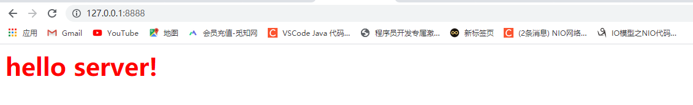

发现红色的hello server已经在浏览器上了。

### 三、深入HTTP协议

#### 1、HTTP协议简介

超文本传输协议（英文：**H**yper**T**ext **T**ransfer **P**rotocol，缩写：HTTP）是一种用于分布式、协作式和超媒体信息系统的**应用层协议**。HTTP是万维网的数据通信的基础，它和TCP/IP协议簇的其他协议一样，也是用于客户端和服务端的通信。

HTTP的发展是由蒂姆·伯纳斯-李于1989年在欧洲核子研究组织（CERN）所发起。HTTP的标准制定由万维网协会（World Wide Web Consortium，W3C）和互联网工程任务组（Internet Engineering Task Force，IETF）进行协调，最终发布了一系列的RFC，其中最著名的是1999年6月公布的 RFC 2616，定义了HTTP协议中现今广泛使用的一个版本——HTTP 1.1。

2014年12月，互联网工程任务组（IETF）的Hypertext Transfer Protocol Bis（httpbis）工作小组将HTTP/2标准提议递交至IESG进行讨论，于2015年2月17日被批准。 HTTP/2标准于2015年5月以RFC 7540正式发表，取代HTTP 1.1成为HTTP的实现标准。

注：什么是超文本

在互联网早期，我们输入的信息只能保存在本地，信息都是以文本的形式存在，但随着计算机的发展，人们不再满足与两台电脑之间的文字传输，还想要传输图片、音频、视频，甚至点击文字能实现超链接跳转，此时文本的语义就被扩大了，这种扩大后的文本就称之为超文本。

#### 2、HTTP协议概述

HTTP是一个客户端终端（用户）和服务器端（网站）**请求和应答**的标准协议。我们通过使用网页浏览器或者其它的工具发起HTTP请求，这个客户端为我们称之为用户代理程序（user agent），服务器上存储着一些资源，比如HTML文件和图像。我们称这个应答服务器为源服务器（origin server）。

通常，由HTTP客户端发起一个请求，此时创建一个到服务器指定端口（默认是80端口）的tcp连接。HTTP服务器则在那个端口监听客户端的请求。一旦收到请求，服务器会向客户端返回一个状态，比如"HTTP/1.1 200 OK"，以及返回的内容，如请求的文件、错误消息、或者其它信息。

#### 3、HTTP工作原理

以下是 HTTP 请求/响应的步骤：

1. 客户端连接到Web服务器。

 浏览器向 DNS 服务器请求解析该 URL 中的域名所对应的 IP 地址，一个HTTP客户端，通常是浏览器，与 Web服务器的HTTP端口（默认为80）建立一个TCP套接字连接。

1. 发送HTTP请求。

 通过【TCP套接字】，客户端向Web服务器发送一个文本的请求报文，一个请求报文由【请求行、请求头部、空行和请求数据】4部分组成。

2. 服务器接受请求并返回HTTP响应

 Web服务器【解析请求，定位请求资源】，然后将资源的复本写到TCP套接字，由客户端读取。一个响应由【状态行、响应头部、空行和响应数据】4部分组成。

3. 服务器释放连接TCP连接。

 若connection 模式为close，则服务器主动关闭TCP连接，客户端被动关闭连接，释放TCP连接。

 若connection 模式为keepalive，则该连接会保持一段时间，在该时间内可以继续接收请求。无论如何都会释放。

4. 客户端浏览器解析HTML内容

 客户端浏览器首先解析状态行，查看表明请求是否成功的状态代码。然后解析每一个响应头，响应头告知以下为若干字节的HTML文档和文档的字符集。客户端浏览器读取响应数据HTML，根据HTML的语法对其进行格式化，并在浏览器窗口中显示。

从以上的内容我们大致可以总结出以下几点：

1、Http是基于请求和响应的。

2、需要依托TCP协议进行三次握手连接、传输数据。

3、TCP的连接会被主动断开，并不是一直保持连接。

#### 4、HTTP报文格式

一个完整的HTTP协议的报文主要由以下三个部分组成：

1. 起始行（请求行、响应行）：起始行 start line : 描述请求或响应的基本信息。
2. 首部字段（请求头、响应头）：使用key-value的形式更加详细的说明报文。
3. 消息正文（请求体、响应体）：实际的传输数据，不一定是文本，也有可能是图片、音频、视频等二进制数据。

一个请求报文的格式如下：


一个响应的报文格式如下：

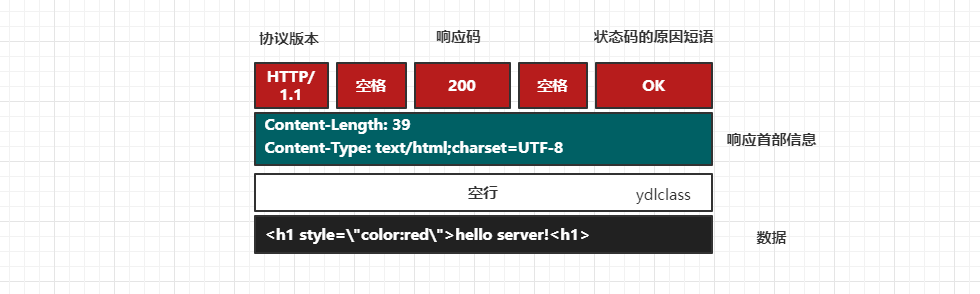

接下来我们一点一点拨开http的面纱。

##### （1）HTTP请求方法

 HTTP/1.1协议中共定义了八种方法（也叫“动作”）来以不同方式操作指定的资源，我们目前最常见的有两种一种get，另外一种叫post。

 请求的目的就是获取或操作资源，互联网的任何数据，我们都能称之为资源，数据库内的一条数据，一个网页，一个视频都是资源。请求的方法决定了我们怎么去操作这个资源。

> GET

向指定的资源发出“显示”请求。使用GET方法应该只用在读取数据，而不应当被用于产生“副作用”的操作中，常用语查询数据的请求。

> POST

向指定资源提交数据，请求服务器进行处理（例如提交表单或者上传文件）。数据被包含在请求本文中。这个请求可能会创建新的资源或修改现有资源，或二者皆有。常用于对数据的增删改操作。

> 请求方式: get与post请求（通过form表单我们自己写写看）

- GET提交的数据会放在URL之后，也就是请求行里面，以?分割URL和传输数据，参数之间以&相连，如EditBook?name=test1&id=123456.（请求头里面那个content-type做的这种参数形式，后面讲） POST方法是把提交的数据放在HTTP包的请求体中.
- GET提交的数据大小有限制（因为浏览器对URL的长度有限制），而POST方法提交的数据没有限制.
- GET与POST请求在服务端获取请求数据方式不同，就是我们自己在服务端取请求数据的时候的方式不同了，这句废话昂。

##### （2）URI

URI叫统一资源标识符 Uniform Resource Identifier，这是一个比较广的概念。

目前，我们有几种方式来表示本机或者网络的一个资源：

1. 通过【定位】的方式来标识资源，这种方式叫【统一资源定位符】，也就是我们说的【URL】（Uniform Resource Locator）。这种方式下我们可以这样表示一个资源，【<http://www.aaa.com/image/girl.png】。很明显URL和位置密切相关，一旦目标主机挂了，或者目标资源更换了位置，URL就失效了。>
2. 通过【命名】的方式来标识资源，这种方式叫【统一资源命名符】，也就是我们说的【URN】（Uniform Resource Name）。这种方式下每一个资源都有一个独立的资源名称，比如【DFAS12B12G3HJK1GHJ3G1HJG23G】，根据这个名字我们就能找到对应的资源，但是这种方式下，我们需要有一个解析器负责根据名字找到对应的资源位置，好处是不管资源怎么变动，我们都可以根据资源名字获取资源。

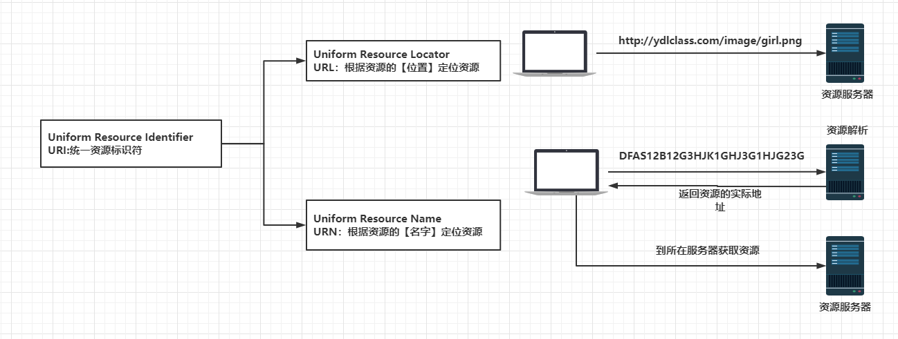

 但是事实上，理论上URN对我们更友好，但是互联网的资源这么多，专门为这么多资源搭建一个资源解析服务器也不太靠谱，所以我们见到的URI主要是以URL为主，可以说URL 约等于 URI。

我们不妨再回顾一下之前学过的URL格式：

超文本传输协议（HTTP）的统一资源定位符将从因特网获取信息的五个基本元素包括在一个简单的地址中：

- 协议：一般为http或https。
- URI：直接定位到对应的资源。
- 主机：通常为域名，有时为IP地址。
- 端口号：以数字方式表示，若为HTTP的默认值“:80”可省略，数字为0~65536。
- uri：以“/”字符区别路径中的每一个目录名称，根路径为‘/’。
- 查询：GET模式的窗体参数，以“?”字符为起点，每个参数以“&”隔开，再以“=”分开参数名称与数据，通常以UTF8的URL编码，避开字符冲突的问题。

```http
以http://www.ydlclass.com:80/news/index.html?id=250&age=1 为例, 其中：
```

【http】是协议；www\.xinzhi\.com】是服务器； 【80】，是服务器上的默认网络端口号，默认不显示； 【/news/index.html】，是路径（URI：直接定位到对应的资源）； 【?id=250&page=1】，是查询条件。 大多数网页浏览器不要求用户输入网页中“http://”的部分，因为绝大多数网页内容是超文本传输协议文件。 “80”是超文本传输协议文件的常用默认端口号，因此一般也不必写明。一般来说用户只要键入统一资源定位符的一部分

##### （3）响应码

- 1xx消息——请求已被服务器接收，继续处理
- 2xx成功——请求已成功被服务器接收、理解、并接受
- 3xx重定向——需要后续操作才能完成这一请求
- 4xx请求错误——请求含有词法错误或者无法被执行，客户端
- 5xx服务器错误——服务器在处理某个正确请求时发生错误，500

一些常见的响应码

|      |                       |                                                              |
| ---- | --------------------- | ------------------------------------------------------------ |
| 200  | OK                    | 从客户端发送的请求，服务端已经正常处理了。                   |
| 204  | No Content            | 服务端已经正常处理了,但是响应中没有实体，也不允许有实体。    |
| 301  | Moved Permanently     | 永久性，重定向。表示请求的资源已经拥有了新的uri，需要重新访问。 |
| 302  | Moved Temporarily     | 临时重定向。                                                 |
| 400  | Bad Request           | 请求报文中存在语法错去。                                     |
| 401  | Unauthorized          | 请求需要有通过HTTP请求的认证信息。                           |
| 403  | Forbidden             | 请求被阻止，可能因为某些权限问题，比如访问的文件没有权限等。 |
| 404  | Not Found             | 表示在服务器上没有你要找的资源                               |
| 500  | Internal server Error | 服务器执行程序出现异常                                       |

我们用一个简单的例子感受一下重定向：

```java
public class Server302 {
    public static void main(String[] args) throws IOException {
        // 创建一个服务器监听在8888端口
        ServerSocket serverSocket = new ServerSocket(8888);
        Socket server = serverSocket.accept();

            OutputStream outputStream = server.getOutputStream();
            // 按照http协议的格式封装一个可以重定向的报文
            String response = "HTTP/1.1 302 Moved Temporarily\r\n" +
                    "Location: https://www.baidu.com\r\n\r\n";
            // 将报文写出给浏览器
            outputStream.write(response.getBytes());
            outputStream.flush();
            // 这个输出流不要着急关，因为突然的关闭会导致浏览器和服务器的连接断开
    }
}
```

当我们访问 127.0.0.1:8888 时，发现网页居然打开了百度，就相当于自动给我们在浏览器输入 <http://www.baidu.com>，并按下了回车。

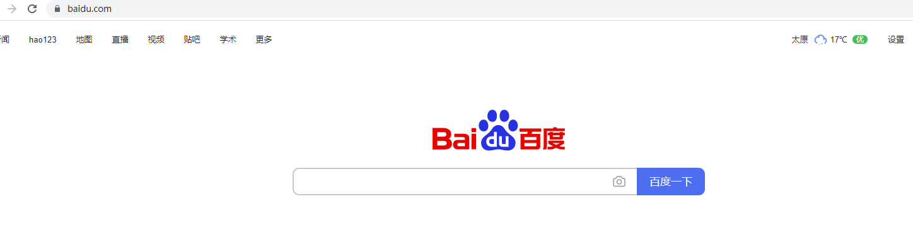

##### （3）http首部字段

 http首部字段是构成http报文的重要元素，它能起到传递额外重要信息的作用，首部信息一般会提供报文类型、编码和大小、认证信息，缓存策略等信息。

**不用记、不用记。**如果需要记忆和深入目前只有一个Content-Type

HTTP/1.1 规范定义了如下 47 种首部字段，分为四大类，我们大致预览一下，不能一一讲解，详情可以通过看书深入理解

1、通用首部字段 9个

| 首部字段名        | 说明                       |
| ----------------- | -------------------------- |
| Cache-Control     | 控制缓存的行为             |
| Connection        | 连接的管理                 |
| Date              | 创建报文的日期时间         |
| Pragma            | 报文指令                   |
| Trailer           | 报文末端的首部一览         |
| Transfer-Encoding | 指定报文主体的传输编码方式 |
| Upgrade           | 升级为其他协议             |
| Via               | 代理服务器的相关信息       |
| Warning           | 错误通知                   |

2、请求首部字段 共18个

| 首部字段名          | 说明                                          |
| ------------------- | --------------------------------------------- |
| Accept              | 用户代理可处理的媒体类型                      |
| Accept-Charset      | 优先的字符集                                  |
| Accept-Encoding     | 优先的内容编码                                |
| Accept-Language     | 优先的语言（自然语言）                        |
| AuthorizationWeb    | 认证信息                                      |
| Expect              | 期待服务器的特定行为                          |
| From                | 用户的电子邮箱地址                            |
| Host                | 请求资源所在服务器                            |
| If-Match            | 比较实体标记（ETag）                          |
| If-Modified-Since   | 比较资源的更新时间                            |
| If-None-Match       | 比较实体标记（与 If-Match 相反）              |
| If-Range            | 资源未更新时发送实体 Byte 的范围请求          |
| If-Unmodified-Since | 比较资源的更新时间（与If-Modified-Since相反） |
| Max-Forwards        | 最大传输逐跳数                                |
| Proxy-Authorization | 代理服务器要求客户端的认证信息                |
| Range               | 实体的字节范围请求                            |
| Referer             | 对请求中 URI 的原始获取方                     |
| TE                  | 传输编码的优先级                              |
| User-Agent          | 客户端程序的信息                              |

3、响应首部字段 共9个

| 首部字段名         | 说明                         |
| ------------------ | ---------------------------- |
| Accept-Ranges      | 是否接受字节范围请求         |
| Age                | 推算资源创建经过时间         |
| ETag               | 资源的匹配信息               |
| Location           | 令客户端重定向至指定URI      |
| Proxy-Authenticate | 代理服务器对客户端的认证信息 |
| Retry-After        | 对再次发起请求的时机要求     |
| Server             | HTTP服务器的安装信息         |
| Vary               | 代理服务器缓存的管理信息     |
| WWW-Authenticate   | 服务器对客户端的认证信息     |

4、实体首部字段 共10个

| 首部字段名       | 说明                         |
| ---------------- | ---------------------------- |
| Allow            | 资源可支持的HTTP方法         |
| Content-Encoding | 实体主体适用的编码方式       |
| Content-Language | 实体主体的自然语言           |
| Content-Length   | 实体主体的大小（单位：字节） |
| Content-Location | 替代对应资源的URI            |
| Content-MD5      | 实体主体的报文摘要           |
| Content-Range    | 实体主体的位置范围           |
| Content-Type     | 实体主体的媒体类型           |
| Expires          | 实体主体过期的日期时间       |
| Last-Modified    | 资源的最后修改日期时间       |

##### （4）http内容协商

 同一个web网页可能存在多个相同内容的网页，比如英文版和中文版，它们内容相同，语言却不同。当浏览器默认的语言不同，访问相同uri会出现不同结果，这种机制就是内容协商。

 内容协商机制是指客户端和服务器就响应的资源内容进行协商交涉，然后提供给客户端最合适的资源。内容协商会以响应资源的语言、字符集、编码等方式作为判断的标准。

 共有3种不同的方法可以决定服务器上哪个页面最适合客户端：**让客户端来选择、服务器自动判定、让中间代理来选。这3种技术分别称为客户端驱动的协商、服务器驱动的协商以及透明协商。**

> 客户端驱动

客户端发起请求，服务器发送可选项列表，客户端作出选择后再发送第二次请求。

- 优点：比较容易实现。
- 缺点：增加了时延，至少要发送两次请求，第一次请求获取资源列表，第二次获取选择的副本。

> 服务器驱动

服务器检查客户端的请求首部集并决定提供哪个版本的页面。

- 优点：比客户端驱动的协商要快。
- 缺点：首部集不匹配，服务器要做猜测。

> 透明协商

某个中间设备（通常是缓存代理）代表客户端进行协商。

- 优点：免除了web服务器的协商开销，比客户端驱动的协商要快。
- 缺点：HTTP并没有提供相应的规范。

其中，服务器驱动的解决方案应用较为广泛。

> 通用的内容协商首部集

客户端可以用下面列出的HTTP首部集发送用户的偏好信息：

- Accept：告知服务器发送何种媒体类型；
- Accept-Language：告知服务器发送何种语言；
- Accept-Charset：告知服务器发送何种字符集；
- Accept-Encoding：告知服务器采用何种编码。

【媒体类型】

 因特网上有数千种不同类型的数据，HTTP仔细地给每种要通过web传输的对象都打上了名为MIME类型（MIME type）的数据格式标签。最初设计MIME（Multipurpose Internet Mali Extension，多用途英特网邮件扩藏）是为了解决在不同的电子邮件系统之间搬移报文时存在的问题。MIME 在电子邮件系统中工作得非常好，因此 HTTP 也采纳了它，用它来描述并标记多媒体内容。

MIME 类型是一种文本标记，表示一种【主要的对象类型】和一个特定的【子类型】，中间由一条斜杠来分隔。

- HTML 格式的文本文档由【text/html】 类型来标记
- 普通的 ASCII 文本文档由 【text/plain】 类型来标
- JPEG 版本的图片为 【image/jpeg】 类型
- GIF 格式的图片为【image/gif】 类型
- Apple 的 QuickTime 电影为【video/quicktime 】类型
- 微软的 PowerPoint 演示文件为【application/vnd.ms-powerpoint】类型

当然还有很多很多.....

而我们以后见的最多的要数以下两种，这两种类型都是用来传递数据：

- application/json，学习了前端知识后，想必大家对json已经不再陌生了。
- application/x-www-form-urlencoded，我们之前都学习过表单，urlencoded格式，又叫 **form** 格式，它是一种表单格式。它使用键值对的方式进行表示，键和值之间用=，多个键值对之间用&

比如我们想在客户端和服务之间传递信息：

可以是这样的

```url
name=polo&age=35&smoke=false
```

也可以是

```json
{
  "name" :"polo",
  "age":35,
  "smoke":false
}
```

更多的mimeType可以查看：<https://www.w3school.com.cn/media/media_mimeref.asp>

【注意】这些首部与实体首部非常类似。不过，这两种首部的用途截然不同。

实体首部集像运输标签，它们描述了把报文从服务器传输给客户端的过程中必须的各种报文主体属性。

而内容协商首部集是由客户端发送给服务器用于交换偏好信息的，以便服务器可以从文档的不同版本中选择出最符合客户端偏好的那个来提供服务。

服务器用下面列出的实体首部集来匹配客户端的Accept首部集：

| Accept首部      | 实体首部         |
| --------------- | ---------------- |
| Accept          | Content-Type     |
| Accept-Language | Content-Language |
| Accept-Charset  | Content-Type     |
| Accept-Encoding | Content-Encoding |

目前为止，关于http协议的基础知识我们讲的差不多了，更多的知识会在后期的学习中不断的深入，我们不妨先将我们的小项目完善一下吧。

### 四、项目完善

本次项目的目的是实现一个小程序，在浏览器中输入URL能够打开一个文件夹下的html页面。

我们不妨将请求和响应封装成两个对象，毕竟字符串的操作实在是痛苦：

```java
/**
 * 将接收的请求报文转化为请求对象
 */
public class Request {

    private String protocol;
    // 请求方式
    private String type;
    // uri
    private String uri;
    // 请求头
    private Map<String,String> header = new HashMap<>();
    // 请求体
    private String body;

    public String getType() {
        return type;
    }

    public void setType(String type) {
        this.type = type;
    }


    public String getUri() {
        return uri;
    }

    public void setUri(String uri) {
        this.uri = uri;
    }

    public Map<String, String> getHeaders() {
        return header;
    }

    public void setHeaders(Map<String, String> header) {
        this.header = header;
    }

    public String getBody() {
        return body;
    }

    public void setBody(String body) {
        this.body = body;
    }

    public String getHeader(String key){
        return header.get(key);
    }

    public void addHeader(String key,String value){
        header.put(key,value);
    }

    public String getProtocol() {
        return protocol;
    }

    public void setProtocol(String protocol) {
        this.protocol = protocol;
    }
}
/**
 * 处理请求报文
 */
public class RequestHandler {

    /**
     * 将获取的请求报文封装成一个请求对象
     * @param requestMessage
     * @return
     */
    public static Request hand(String requestMessage){

        Request request = new Request();
        // 通过大量的截串获取对应信息
        String[] headerAndBody = requestMessage.split("\r\n\r\n");
        // 判断有没有请求体
        if(headerAndBody.length > 1){
            request.setBody(headerAndBody[1]);
        }
        // 将请求行和首部信息截取
        String[] lineAndHeader = headerAndBody[0].split("\r\n");
        String line = lineAndHeader[0];
        // 使用空格截取请求行信息
        String[] lines = line.split(" ");
        request.setType(lines[0]);
        request.setUri(lines[1]);
        request.setProtocol(lines[2]);
        // 遍历请求头
        for (int i = 1; i < lineAndHeader.length; i++) {
            String[] split = lineAndHeader[i].split(": ");
            request.addHeader(split[0],split[1]);
        }
        return request;
    }
}
```

响应：

```java
/**
 * 响应
 */
public class Response {

    // 协议
    private String protocol = "Http/1.1";
    // 响应码
    private String code = "200";
    // 信息
    private String message = "ok";
    // 响应头
    private Map<String,String> header = new HashMap<>();
    // 响应体
    private String body;

    public String getProtocol() {
        return protocol;
    }

    public void setProtocol(String protocol) {
        this.protocol = protocol;
    }

    public String getCode() {
        return code;
    }

    public void setCode(String code) {
        this.code = code;
    }

    public String getMessage() {
        return message;
    }

    public void setMessage(String message) {
        this.message = message;
    }

    public Map<String, String> getHeaders() {
        return header;
    }

    public void setHeaders(Map<String, String> header) {
        this.header = header;
    }

    public String getHeader(String key){
        return header.get(key);
    }

    public void addHeader(String key,String value){
        header.put(key,value);
    }

    public String getBody() {
        return body;
    }

    public void setBody(String body) {
        this.body = body;
    }
/**
 * @author itnanls(私信联系)
 * 处理响应的工具类
 */
public class ResponseHandler {

    // 定义我们网站的根目录
    public static final String BASE_PATH = "D:/www/";

    /**
     * 此方法用来生成一个响应的字符串
     * @param path
     * @return
     */
    public static String build(String path){
        String htmlPath = BASE_PATH + path;
        try ( FileInputStream fis = new FileInputStream(htmlPath)){
            // 使用输入流读取文件的内容
            String body = IOUtils.readString(fis);

            Response response = new Response();
            response.setBody(body);
            response.addHeader("Content-Type","text/html;charset=UTF-8");
            response.addHeader("Content-Length",Integer.toString(body.length()));

            return build(response);

        }catch (IOException e){
            e.printStackTrace();
        }
        return null;
    }


    // 将响应对象序列化成字符串报文
    public static String build(Response response){
        StringBuilder sb = new StringBuilder();
        sb.append(response.getProtocol()).append(" ")
                .append(response.getCode()).append(" ")
                .append(response.getMessage()).append("\r\n");
        for(Map.Entry<String,String> entry : response.getHeaders().entrySet()){
            sb.append(entry.getKey()).append(": ").append(entry.getValue()).append("\r\n");
        }

        if(response.getBody() != null){
            sb.append("\r\n").append(response.getBody());
        }
        return sb.toString();
    }
}
```

创建一个IO工具类负责从流中读取数据：

```java
public class IOUtils {

    // 读取流中的数据
    public static String readString(InputStream inputStream){
        try {
            int len;
            byte[] buffer = new byte[1024];
            StringBuilder sb = new StringBuilder();
            while (inputStream.available() > 0){
                len = inputStream.read(buffer);
                sb.append(new String(buffer,0,len));
            }
            return sb.toString();
        }catch (IOException e){
            e.printStackTrace();
        }
        return null;
    }
}
/**
 * 每个客户端的请求使用独立的线程处理
 * 当然你可以写成NIO的模式，只是比较复杂而已
 */
public class UserThread implements Runnable {

    private final Socket socket;

    public UserThread(Socket socket) {
        this.socket = socket;
    }

    @Override
    public void run() {
        try (InputStream inputStream = socket.getInputStream();
             OutputStream outputStream = socket.getOutputStream();
        ) {
            String requestMessage = IOUtils.readString(inputStream);
            Request request = RequestHandler.hand(requestMessage);
            String uri = request.getUri();
            // 按照http协议的响应格式封装响应报文
            // 浏览器除了发送我们的请求，还会发送/favicon.ico请求，用来获取网站图标
            // 我们把它排除掉，不处理
            if (!"/favicon.ico".equals(uri)){
                // 直接使用输出流输出到浏览器
                String response = ResponseHandler.build(uri);
                outputStream.write(response.getBytes());
            }

        } catch (IOException e) {
            e.printStackTrace();
        }
    }
}
public class Server {
    public static void main(String[] args) throws IOException {
        // 创建一个服务器监听在8888端口
        ServerSocket serverSocket = new ServerSocket(8888);
        ExecutorService executorService = Executors.newFixedThreadPool(100);
        while (true){
            Socket server = serverSocket.accept();
            executorService.submit(new UserThread(server));
        }
    }
}
```

### 五、处理其他请求

我们给项目做一个升级版本，做一个登录的功能，能和数据库交互。

我们在D:/www下新建一个登录的页面，如下：

```html
<!DOCTYPE html>
<html lang="en">
<head>
    <meta charset="UTF-8">
    <title>Document</title>
</head>
<body>
 <form action="/register.do" method="post">
    用户名：<input type="text" name="username" id="username" /> <br />
    密码：<input type="password" name="password" id="password" /><br />
    <input type="submit" value="注册" />
</form>   
</body>
</html>
```

我们首先拿个页面做注册，注册的本质就是插入一条数据，我们也是简单演示，其他额外的判断我们统统不做。

我们不妨先把数据层面的代码准备好：

首先，我们用最简单的方式搞一个获取连接的工具类，这里是为了简单的观察本质，所以我们也不用连接池，怎么简单怎么来。

```java
public class JDBCUtil {
    public static Connection getConnection(){
        // 1.数据库连接的4个基本要素：
        InputStream in = JDBCUtil.class.getClassLoader().getResourceAsStream("jdbc.properties");
        Properties properties = new Properties();
        try {
            properties.load(in);
        } catch (IOException e) {
            e.printStackTrace();
        }

        String url = properties.getProperty("url");
        String user = properties.getProperty("username");
        String password = properties.getProperty("password");

        //2.获取连接
        try {
            return DriverManager.getConnection(url, user, password);
        } catch (SQLException e) {
            e.printStackTrace();
        }
        return null;
    }
}
```

//User

```java
public class User implements Serializable {

    private static final Long serialVersionUID = 1L;

    private Integer id;
    private String username;
    private String password;
    .... 省略其他
}
```

// 注册的本质就是插入一条数据，登录的本质就是通过用户名获取用户比较密码，我们先将这两个方法准备好。

```java
public class UserDao {

    // 插入一个用户
    public void insertUser(User user){
        String sql = "insert into user (username,password)values(?,?)";
        try(Connection connection = JDBCUtil.getConnection();
            PreparedStatement preparedStatement = connection.prepareStatement(sql)) {
            preparedStatement.setString(1,user.getUsername());
            preparedStatement.setString(2,user.getPassword());
            preparedStatement.execute();
        } catch (SQLException e) {
            e.printStackTrace();
        }
    }

    // 根据用户名获取用户
    public User findUserByUsername(String username){
        String sql = "select id,username,password from user where username = ?";
        try(Connection connection = JDBCUtil.getConnection();
            PreparedStatement preparedStatement = connection.prepareStatement(sql)) {
            preparedStatement.setString(1,username);
            ResultSet resultSet = preparedStatement.executeQuery();
            if(resultSet.first()){
                User user = new User();
                user.setId(resultSet.getInt("id"));
                user.setUsername(resultSet.getString("username"));
                user.setPassword(resultSet.getString("password"));
                return user;
            }
        } catch (SQLException e) {
            e.printStackTrace();
        }
        return null;
    }
}
```

核心的问题来了，

当页面点击提交按钮实际上是发送一个post请求，从浏览器我们可以看得出来。

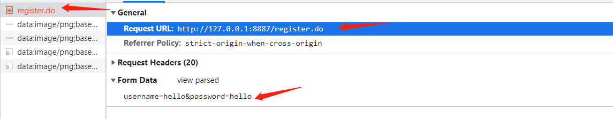

与此同时，后台也出现了问题：

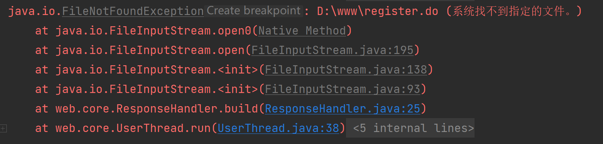

在处理注册信息的时候，还是以文件的方式去寻找了，但是我们不希望如此，

我们希望的是将来能有一个类去独立处理这个请求，那怎么办？

此时我们希望不同的请求能有不同的方式，

此时我们将响应的处理抽象成一个接口：

```java
public interface Servlet {

    /**
     * 这个方法专门用来处理请求和响应
     * @param request
     * @param response
     */
    void service(Request request,Response response);

}
```

将之前的RespsoneHandler改为HTMLRespsoneHandler，专门处理网页

```java
/**
 * @author itnanls(私信联系)
 * 处理响应的工具类
 */
public class HTMLResponseHandler implements ResponseHandler {

    private HTMLResponseHandler(){}

    private final static HTMLResponseHandler htmlResponseHandler
            = new HTMLResponseHandler();

    public static HTMLResponseHandler getInstance(){
        return htmlResponseHandler;
    }

    // 定义我们网站的根目录
    public static final String BASE_PATH = "D:/www/";

    /**
     * 此方法用来生成一个响应的字符串
     * @param request
     * @return
     */
    public String build(Request request){
        String htmlPath = BASE_PATH + request.getUri();
        try ( FileInputStream fis = new FileInputStream(htmlPath)){
            // 使用输入流读取文件的内容
            String body = IOUtils.readString(fis);

            Response response = new Response();
            response.setBody(body);
            response.addHeader("Content-Type","text/html;charset=UTF-8");
            response.addHeader("Content-Length",Integer.toString(body.getBytes().length));
           
            return response.buildMessage();

        }catch (IOException e){
            e.printStackTrace();
        }
        return null;
    }

}
```

于此同时，我们再创建一个：

```java
/**
 * @author itnanls(私信联系)
 * 处理响应的工具类
 */
public class DoResponseHandler implements ResponseHandler {

    private DoResponseHandler(){}

    private final static DoResponseHandler htmlResponseHandler
            = new DoResponseHandler();

    public static DoResponseHandler getInstance(){
        return htmlResponseHandler;
    }


    /**
     * 此方法用来生成一个响应的字符串
     * @param request
     * @return
     */
    public String build(Request request){
        // 我要根据不同的uri得到不同的处理结果
        // 我们需要一个统一的出来请求响应的工具，不妨起个名字叫servlet
        Servlet servlet = Container.ENV.get(request.getUri());
        Response response = new Response();
        servlet.service(request,response);
        return response.buildMessage();
    }
}
```

于是我们可以根据不同的请求处理不同的响应了：

```java
public class RegisterServlet implements Servlet{

    UserDao userDao = new UserDao();

    @Override
    public void service(Request request, Response response) {
        String username = request.getParameter("username");
        String password = request.getParameter("password");
        User user = new User(username,password);
        userDao.insertUser(user);
        response.setBody("成功");
        response.addHeader("Content-Type","text/plain;charset=UTF-8");
        response.addHeader("Content-Length",Integer.toString(response.getBody().getBytes().length));
    }
}
```

接下来就是登录了：

我们写一个登录的servlet来处理这个uri

```java
public class LoginServlet implements Servlet{

    UserDao userDao = new UserDao();

    @Override
    public void service(Request request, Response response) {
        String username = request.getParameter("username");
        User user = userDao.findUserByUsername(username);
        // 1、没有查询到用户
        // 2、查询到用户，但是密码不对
        if(user == null || user.getPassword().equals(request.getParameter("password"))){
            response.setBody("登陆失败");
            response.addHeader("Content-Type","text/html;charset=UTF-8");
            response.addHeader("Content-Length",Integer.toString(response.getBody().getBytes().length));
        } else {
            response.setBody("登陆成功");
            response.addHeader("Content-Type","text/html;charset=UTF-8");
            response.addHeader("Content-Length",Integer.toString(response.getBody().getBytes().length));
        }
    }
}
```

并且注册进去

```text
ENV.put("/login.do",new LoginServlet());
```

登录是成功了，但是登录没有状态，哪里能说明这个客户端登录成功了呢？

### 六、状态的保存

http本身是不保存状态的，啥意思？就是客户端到服务器的连接不是长时间保持的，一个连接断开后，下一个请求会建立新的tcp连接，服务器不会知道我们之前连接过，说的简单一点就是，你登录了但是服务器不知道。

所以推出了session和cookie机制

cookie是记录在浏览器端的一个字符串，是一段不超过4KB的小型文本数据，由一个名称（Name）、一个值（Value）和其它几个用于控制Cookie有效期、安全性、使用范围的可选属性组成，

session是保存在服务器端的一个对象，比如map。它们俩互相配合让服务器有了能识别客户端一些状态的能力，意思就是服务就能知道这个客户端有没有登录等。cookie就相当于通行证，session就是门房，进去时需要从门房识别一个身份。

> 创建过程：

1. 当浏览器第一次向客户端发送请求时，服务器会为它创建一个session，同时相应会加一个头（Set-Cookie: jsessionid=ewrwerwer123）
2. 浏览器察觉到这个响应头之后会将信息保存在cookie当中，以后访问这个网站的时候就会一直带着这个cookie。
3. 当下一个请求发起时，会带着这个cookie的信息，服务器通过查询id找的session，通过session内保存的信息，就能获得这个客户端的状态。


那我们继续改造：

我们先看看请求中有没有cookie

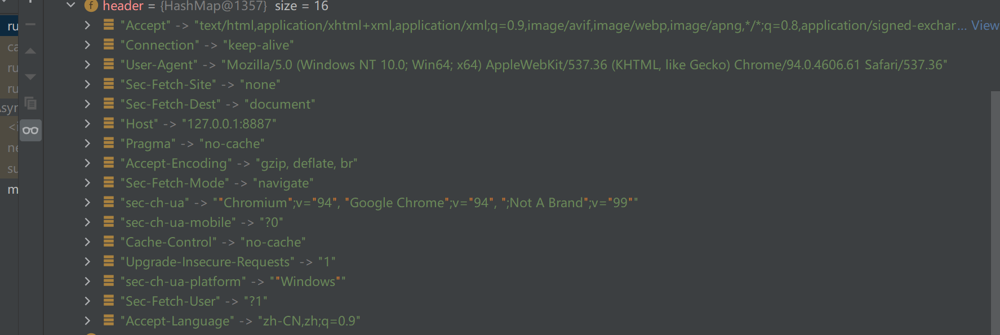

我们尝试给它加个cookie

目前代码多了，我们就在打开html的地方处理一下

```text
response.addHeader("set-Cookie", "jsessionid="+UUID.randomUUID());
```

重新观察

一次访问没有：


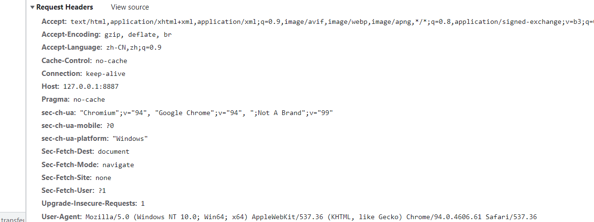

二次访问已经有了：

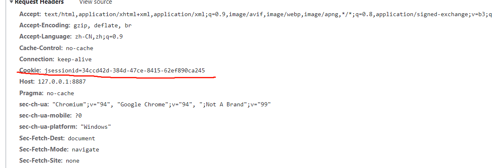

当然我们只是想在没有Cookie的创建：

```java
if(cookie == null || !cookie.contains("jsessionid")){
    response.addHeader("set-Cookie", "jsessionid="+UUID.randomUUID());
}
```

处理请求和响应事实上是一个很麻烦的工作，我们确实需要一个工具帮我们方便的处理请求和响应。

这样有了id，我们还需要给每个客户端分配一个柜子：

先搞一个大柜子，每个session我们就用map处理，不就是存一点数据嘛！

```text
public static final ConcurrentHashMap<String, Map<String,Object>> SESSIONS
            = new ConcurrentHashMap<>(8);
```

为每一个客户端分配一点点空间

```java
if(cookie == null || !cookie.contains("jsessionid")){
    String sessionId = UUID.randomUUID().toString();
    response.addHeader("set-Cookie", "jsessionid="+sessionId);
    Container.SESSIONS.put(sessionId,new HashMap<>());
} else {
    String id = cookie.split("=")[1];
    Map<String, Object> session = Container.SESSIONS.get(id);
    if(session == null)
        Container.SESSIONS.put(id,new HashMap<>());
}
```

登录之后我们就能搞点事情了：

在登录servlet中添加：

```java
String cookie = request.getHeader("Cookie");
if(cookie != null){
    String sessionId = cookie.split("=")[1];
    Map<String, Object> session = Container.SESSIONS.get(sessionId);
    session.put("user",user);
}
```

不妨我们再添加一个首页：

如果登录了就显示首页欢迎您：xxx，没有登录就显示首页两个字。

```java
public class IndexServlet implements Servlet {

    @Override
    public void service(Request request, Response response) {
        String cookie = request.getHeader("Cookie");
        if (cookie != null) {
            String sessionId = cookie.split("=")[1];
            Map<String, Object> session = Container.SESSIONS.get(sessionId);
            if (session != null &&  session.get("user") != null) {
                Object user = session.get("user");
                User u = (User) user;
                response.setBody("首页，欢迎您：" + u.getUsername());
                response.addHeader("Content-Type", "text/html;charset=UTF-8");
                response.addHeader("Content-Length", Integer.toString(response.getBody().getBytes().length));
                return;
            }

        }

        response.setBody("首页");
        response.addHeader("Content-Type", "text/html;charset=UTF-8");
        response.addHeader("Content-Length", Integer.toString(response.getBody().getBytes().length));

    }
}
ENV.put("/index.do",new IndexServlet());
```

我们的项目目前先到此为止，从这个项目中，我们体会了很多。

配置文件

```xml
<web-app>
    <data-source>
        <properties name="url">jdbc:mysql://127.0.0.1:3306/ydlclass?characterEncoding=utf8&amp;serverTimezone=Asia/Shanghai</properties>
        <properties name="username">root</properties>
        <properties name="password">root</properties>
        <properties name="driverName">com.mysql.cj.jdbc.Driver</properties>
    </data-source>
    
    <servlets>
        <servlet>
            <url>/user</url>
            <servlet-class>com.ydlclass.controller.UserServlet</servlet-class>
        </servlet>
        <servlet>
            <url>/login</url>
            <servlet-class>com.ydlclass.controller.LoginServlet</servlet-class>
        </servlet>
        <servlet>
            <url>/register</url>
            <servlet-class>com.ydlclass.controller.RegisterServlet</servlet-class>
        </servlet>
        <servlet>
            <url>/index</url>
            <servlet-class>com.ydlclass.controller.IndexServlet</servlet-class>
        </servlet>
    </servlets>
</web-app>
```

## 第二章 JAKARTAEE历史

### 一、历史渊源

#### 1、JavaEE

我们学习Java都知道Java是一门语言，它可以分为以下几个版本：

- JavaSE是指Java Standard Edition，Java标准版，就是一般Java程序的开发就可以(如桌面程序)，可以看作是JavaEE的子集。
- JavaEE是指Java Enterprise Edition，Java企业版，多用于企业级开发，包括web开发等等。也叫J2EE。
- JavaME是指Java Platform，Micro Edition。Java ME 为在移动设备和嵌入式设备（比如手机、PDA、电视机顶盒和打印机）上运行的应用程序提供一个健壮且灵活的环境。

其实，怎么理解这个事情呢，用一个最简单的例子。

 windows有基础的家庭版，是不是也有旗舰版，很明显旗舰版的功能要比家庭版强大，当然也更贵，你用盗版当我没说。当然它还有移动端的版本。

 其实就是这个道理，windows就好比Java语言，家庭版就好比Javase，旗舰版就好比Javaee，移动版就好比Javame。

 起初，SUN公司希望靠Javaee收版权费，但是受到Spring这些开源社区挑战之后，SUN公司又把它调整为一个半开源的版本，SUN公司找了一些联盟公司给它贡献组件，这个时期，SUN公司对外宣传Java EE是一套标准协议，他和他的联盟公司在这套协议下给大家贡献各种企业级框架。

 这就好比，有很多人在家庭版上开发了很多免费的程序，我们只要装上，功能比旗舰版还要强大。

 我们目前的理解就是Javaee是一个标准，定义了很多企业级开发的标准，说的简单一点就是，我写一些接口，大家可以按照我的规定写代码，这样我们的代码就能统一，扩展性就更好，但是标准是标准，做不做也是另一回事，我们不妨看几个Javeee的标准：

> 我们在这里列举几个常见的Javaee规范

1. JDBC（Java data base connectivity）：JDBC对程序员来讲是API，对实现与数据库连接的服务提供商而言是接口模型。
2. Servlet：Servlet是小服务程序的意思，JavaServlet就是一种小型的Java程序，一个servlet就是Java编程语言中的一个类。servlet和用户的通信采用请求/响应模式，用于动态响应客户机请求形式扩展了web服务器的功能，servlet全部由Java写成并且生成html。servlet和jsp结合使用，能提供更为强大的服务器功能。
3. JSP（Java Service Pages）：JSP是一种服务器端的编程技术，创建动态的，与平台无关构建基于Web的应用程序，是为了提供一种声明性的、以表示为中心的开发Servlet方法而设计的。它也是可移植的独立于平台或应用程序的方法来提供动态内容的有效方式，提供了方法来为web客户生成动态内容。提供了开发基于Servlet的动态内容的简单方法，并带有分离内容和显示逻辑的优点。
4. XML（Extensible Markup Language）：可扩展标记语言，标准通用标记语言的子集。Java提供了极好的技术支持和丰富的库来解析，修改或查询XML文档。
5. JNDI（Java naming and directoryinterface Java命名和目录接口）：包含大量的命名和目录服务，使用通用接口来访问不同种类的服务。
6. EJB（ Enterprise JavaBean）：EJB是JavaEE的一部分，定义了一个用于开发基于组件的企业多重应用程序的标准。
7. RMI （Remote method invoke ）：RMI调用远程对象上的方法，使用了序列化方式在客户端和服务端传递数据。
8. JavaMail：提供了一组抽象类定义构成一个邮件系统的对象，这些抽象类和接口支持消息存储、格式和传输的许多不同的实现，它是阅读，撰写和发送电子信息的可选包。
9. JMS（ Java Message Service）：JMS是Java消息服务应用程序接口，是一个Java平台中关于面向消息中间件的API，用于在两个应用程序之间，或分布式系统中发布消息，进行异步通信。

#### 2、JAKARTA EE

 大名鼎鼎的Apache是Java开源组织的殿堂，现如今包含了350多个开源项目。当时Apache组织里面有很多C语言开发的项目，Java还是一门小众语言。为了发展Java Web项目，一群有志之士聚集在一起，启动了Jakarta项目。

 后来，Java变得非常的火爆，以至于Jakarta项目囊括了众多基于Java语言的开源软件。最后，不得不把个别项目从Jakarta中独立出来，成为Apache软件基金会的顶级项目，例如：Struts，HttpClient，Tomcat，Ant，Maven，JMeter，Velocity，JMeter，Commons等。一直到2011年12月，在所有子项目都被迁移为独立项目后，Jakarta名称就不再使用了。

 2017 年 8 月，Oracle（甲骨文）决定将 Java EE（Java Enterprise Edition）移交给开源组织，但是附加条件是：不允许开源组织用 Java 的名号。最终，Eclipse基金会接手了Java EE。但是，在给项目命名的时候，Eclipse基金会一筹莫展。为了起出合适的名字，Eclipse决定开始民意投票，并给出了 "Jakarta EE" 和 "Enterprise Profile" 两个备选名字。最后，Jakarta 以 64.4% 的票数获胜。从此之后，Java EE 正式更名为 Jakarta EE（雅加达）。从这个民意归属来看，再次证明了，Jakarta 的影响是及其深远的。

 我们打开官网：<https://jakarta.ee/zh/about/，他是这么形容JAKARTA> EE的：


 其实，Java EE在中国从来没有大规模的流行过，Java EE在Web的代表核心就是EJB，现在根本没人用这个了。但是在Javaee中流行起来的几个标准流行至今，需要我们重点学习一下。

更多的标准我们可以看这里：<https://jakarta.ee/specifications/>

### 二、Tomcat

#### 1、简介

 Tomcat 服务器是一个免费的开放源代码的Web 应用服务器，Tomcat是Apache 软件基金会（Apache Software Foundation）的Jakarta 项目中的一个核心项目，由Apache、Sun 和其他一些公司及个人共同开发而成。由于有了Sun 的参与和支持，最新的【Servlet 和JSP 规范】总是能在Tomcat 中得到体现。因为Tomcat 技术先进、性能稳定，而且免费，因而深受Java 爱好者的喜爱并得到了部分软件开发商的认可，成为目前比较流行的Web 应用服务器。

 [Tomcat最初是由Sun的软件架构师](https://baike.baidu.com/item/软件架构师/3476994)詹姆斯·邓肯·戴维森开发的。后来他帮助将其变为开源项目，并由Sun贡献给[Apache软件基金会。由于大部分开源项目O'Reilly都会出一本相关的书，并且将其封面设计成某个动物的素描，因此他希望将此项目以一个动物的名字命名。因为他希望这种动物能够自己照顾自己，最终，他将其命名为Tomcat（英语公猫或其他雄性猫科动物）。而O'Reilly出版的介绍Tomcat的书籍（ISBN 0-596-00318-8）[1]的封面也被设计成了一个公猫的形象。而Tomcat的Logo兼吉祥物也被设计为一只公猫。

对于tomcat的版本和servlet和jsp标准，以及jdk的支持如下：

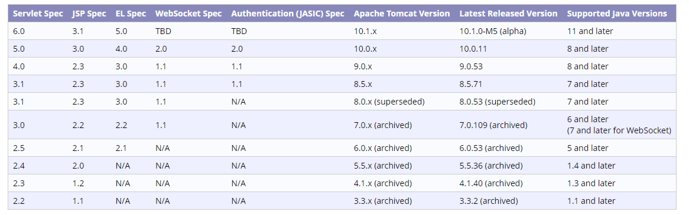

所以我们要注意的是，引入的包一定要匹配

#### 2、Tomcat 安装

> 下载

我们这里下载一个10.0版本，我们依然可以使用java8。

<https://tomcat.apache.org/download-10.cgi>

> 安装

将下载的 .zip 压缩包 ， 解压到系统的目录（建议是没有中文不带空格的目录）下即可。

#### 3、Tomcat 目录结构

Tomcat 的主要目录文件如下 ：

| **目录**    | **目录下文件**             | **说明**                                                     |
| ----------- | -------------------------- | ------------------------------------------------------------ |
| **bin**     | /                          | 存放Tomcat的启动、停止等批处理脚本文件                       |
|             | startup.bat , startup.sh   | 用于在windows和linux下的启动脚本                             |
|             | shutdown.bat , shutdown.sh | 用于在windows和linux下的停止脚本                             |
| **conf**    | /                          | 用于存放Tomcat的相关配置文件                                 |
|             | Catalina                   | 用于存储针对每个虚拟机的Context配置                          |
|             | context.xml                | 用于定义所有web应用均需加载的Context配置，如果web应用指定了自己的context.xml ，该文件将被覆盖 |
|             | catalina.properties        | Tomcat 的环境变量配置                                        |
|             | catalina.policy            | Tomcat 运行的安全策略配置                                    |
|             | logging.properties         | Tomcat 的日志配置文件， 可以通过该文件修改Tomcat 的日志级别及日志路径等 |
|             | server.xml                 | Tomcat 服务器的核心配置文件                                  |
|             | tomcat-users.xml           | 定义Tomcat默认的用户及角色映射信息配置                       |
|             | web.xml                    | Tomcat 中所有应用默认的部署描述文件， 主要定义了基础Servlet和MIME映射。 |
| **lib**     | /                          | Tomcat 服务器的依赖包                                        |
| **logs**    | /                          | Tomcat 默认的日志存放目录                                    |
| **webapps** | /                          | Tomcat 默认的Web应用部署目录                                 |
| **work**    | /                          | Web 应用JSP代码生成和编译的临时目录                          |

#### 4、Tomcat 启动停止

启动

```text
双击 bin/startup.bat 文件 ；
```

停止

```text
双击 bin/shutdown.bat 文件 ；
```

访问

```text
http://localhost:8080 
```

如果你能顺利打开这个页面就ok了：

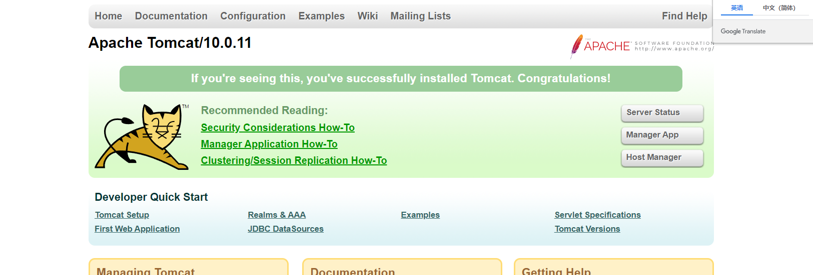

## 第三章 Web开发进阶

### 一、Tomcat 架构

#### 1、Http服务器请求处理

浏览器发给服务端的是一个HTTP格式的请求，HTTP服务器收到这个请求后，需要调用服务端程序来处理，所谓的服务端程序就是你写的Java类，一般来说不同的请求需要由不同的Java类来处理。

HTTP服务器不直接调用业务类，而是把请求交给容器来处理，容器通过Servlet接口调用业务类。因此Servlet接口和Servlet容器的出现，达到了HTTP服务器与业务类解耦的目的。而Servlet接口和Servlet容器这一整套规范叫作Servlet规范。Tomcat按照Servlet规范的要求实现了Servlet容器，同时它们也具有HTTP服务器的功能。作为Java程序员，如果我们要实现新的业务功能，只需要实现一个Servlet，并把它注册到Tomcat（Servlet容器）中，剩下的事情就由Tomcat帮我们处理了。

#### 2、Servlet容器工作流程

为了解耦，HTTP服务器不直接调用Servlet，而是把请求交给Servlet容器来处理，那Servlet容器又是怎么工作的呢？

当客户请求某个资源时，HTTP服务器会用一个ServletRequest对象把客户的请求信息封装起来，然后调用Servlet容器的service方法，Servlet容器拿到请求后，根据请求的URL和Servlet的映射关系，找到相应的Servlet，如果Servlet还没有被加载，就用反射机制创建这个Servlet，并调用Servlet的init方法来完成初始化，接着调用Servlet的service方法来处理请求，把ServletResponse对象返回给HTTP服务器，HTTP服务器会把响应发送给客户端。

### 二、Tomcat架构和执行流程

#### 1、首先介绍几个概念

Server：服务器，启动一个tomcat就是启动了一个服务器，一个Server可以有多个Service，一个Service可以有多个Connectior和Engine

Service：服务，一个server可以包含多个service 一个service维护多个Connector和一个Engine

Engine：叫引擎，也有资料叫Container，一个服务可以开一个引擎，就是一个公司可以有很多个门，不同身份的人从不同的门进，但是具体干活的就一个部门。引擎负责处理请求，不需要考虑请求链接，协议等。

Context：一个Context管理一个应用，其实就是我们写的程序。

Wrapper：每个都封装着一个Servlet（当然只局限于普通的Http请求）。

dns <www.ydl.com> ---> 127.0.0.1,www.ydl2.com--->127.0.0.1

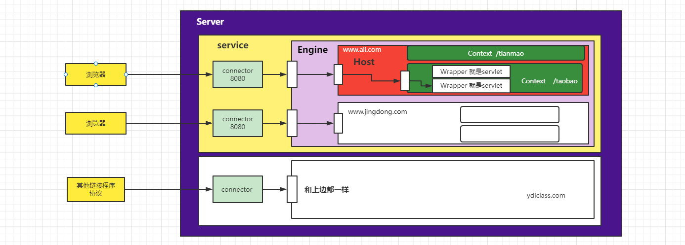

#### 2、Tomcat运行流程

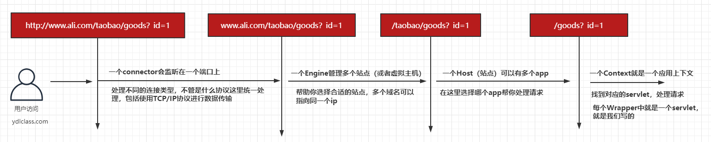

客户发送一个请求：<http://localhost:8080/test/index.html。请求被发送到本机端口8080后，执行流程如下：>

1. 被在那里侦听的Coyote HTTP/1.1 Connector获得,然后引擎负责处理请求，不需要考虑请求链接，协议等。
2. Connector把该请求交给它所在的Service的Engine来处理，并等待Engine的回应。
3. Engine获得请求localhost:8080/test/index.jsp，匹配它所有虚拟主机Host。
4. Engine匹配到名为localhost的Host(即使匹配不到也把请求交给该Host处理，因为该Host被定义为该Engine的默认主机)。
5. localhost Host获得请求/test/index.jsp，匹配它所拥有的所有Context。
6. Host匹配到路径为/test的Context(如果匹配不到就把该请求交给路径名为""的Context去处理)。
7. path="/test"的Context获得请求/index.jsp，在它的mapping table中寻找对应的servlet。
8. Context匹配到URL PATTERN为*.jsp的servlet，对应于JspServlet类，构造HttpServletRequest对象和HttpServletResponse对象，作为参数调用JspServlet的doGet或doPost方法。
9. Context把执行完了之后的HttpServletResponse对象返回给Host。
10. Host把HttpServletResponse对象返回给Engine。
11. Engine把HttpServletResponse对象返回给Connector。
12. Connector把HttpServletResponse对象返回给客户browser。

 我们在使用tomcat的时候可以不理会中间的实现的任何过程，专心于我们的业务代码的编写，不停的写servlet就行了，极大的提升了写代码的效率。

#### 3、Tomcat 服务器配置

 Tomcat 服务器的配置主要集中于 tomcat/conf 下的 catalina.policy、catalina.properties、context.xml、server.xml、tomcat-users.xml、web.xml 文件。

##### （1）server.xml

server.xml 是tomcat 服务器的核心配置文件，包含了Tomcat的 Servlet 容器（Catalina）的所有配置。由于配置的属性特别多，我们在这里主要讲解其中的一部分重要配置。

【Server】是server.xml的根元素，用于创建一个Server实例，默认使用的实现类是 org.apache.catalina.core.StandardServer。

```xml
<Server port="8005" shutdown="SHUTDOWN">
 ...
</Server>
```

port : Tomcat 监听的关闭服务器的端口。

shutdown： 关闭服务器的指令字符串。

【Connector】 用于创建链接器实例。默认情况下，server.xml 配置了两个链接器，一个支持HTTP协议，一个支持AJP协议。因此大多数情况下，我们并不需要新增链接器配置，只是根据需要对已有链接器进行优化。

```xml
<Connector port="8080" protocol="HTTP/1.1" connectionTimeout="20000" redirectPort="8443" />
```

属性说明：

1） port： 端口号，Connector 用于创建服务端Socket 并进行监听， 以等待客户端请求链接。如果该属性设置为 0，Tomcat将会随机选择一个可用的端口号给当前Connector 使用。

2） protocol ： 当前Connector 支持的访问协议。 默认为 HTTP/1.1 。

3） connectionTimeOut : Connector 接收链接后的等待超时时间， 单位为 毫秒。 -1 表示不超时。

完整的配置如下：

```xml
<Server port="8005" shutdown="SHUTDOWN">
  <Listener className="org.apache.catalina.startup.VersionLoggerListener" />
  <Listener className="org.apache.catalina.core.AprLifecycleListener" SSLEngine="on" />
  <Listener className="org.apache.catalina.core.JreMemoryLeakPreventionListener" />
  <Listener className="org.apache.catalina.mbeans.GlobalResourcesLifecycleListener" />
  <Listener className="org.apache.catalina.core.ThreadLocalLeakPreventionListener" />

  <GlobalNamingResources>

    <Resource name="UserDatabase" auth="Container"
              type="org.apache.catalina.UserDatabase"
              description="User database that can be updated and saved"
              factory="org.apache.catalina.users.MemoryUserDatabaseFactory"
              pathname="conf/tomcat-users.xml" />
  </GlobalNamingResources>


  <Service name="Catalina">

    <Connector port="8080" protocol="HTTP/1.1"
               connectionTimeout="20000"
               redirectPort="8443" />

    <Engine name="Catalina" defaultHost="localhost">

      <Realm className="org.apache.catalina.realm.LockOutRealm">
        <Realm className="org.apache.catalina.realm.UserDatabaseRealm"
               resourceName="UserDatabase"/>
      </Realm>

      <Host name="localhost"  appBase="webapps"
            unpackWARs="true" autoDeploy="true">

        <Valve className="org.apache.catalina.valves.AccessLogValve" directory="logs"
               prefix="localhost_access_log" suffix=".txt"
               pattern="%h %l %u %t &quot;%r&quot; %s %b" />

      </Host>
    </Engine>
  </Service>
</Server>
```

 我们能得知的信息是：有个默认的服务是Catalina，这个服务默认开放了8080端口的连接器，默认的引擎也叫Catalina，它管理一个默认的主机localhost，localhost的根目录是webapp。

不妨我们打开webapp，我们能看到这里边已经有了几个项目了。

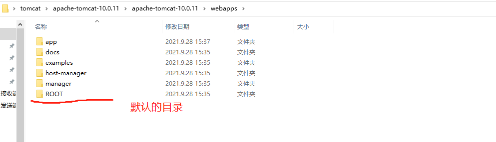

 这里边已经有了几个工程，这几个工程有管理工具，有例子程序，我们以后项目就可以放在这里。如果输入的后没有加项目名字，默认会进入ROOT，比如我们看到的首页就是ROOT中的工程。

 我们不妨在webapp中新建，app文件

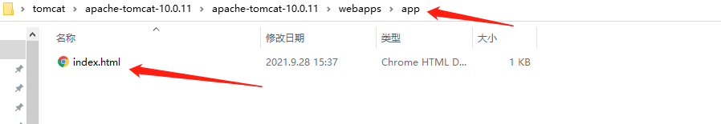

重新启动tomcat，访问localhost:8080/app/index.html

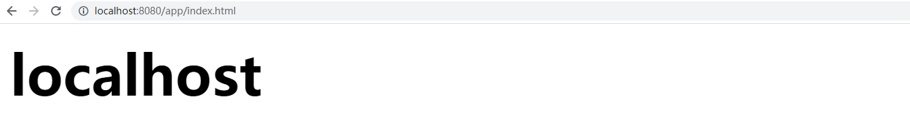

结果如下。

给一个service增加监听端口：

```xml
<Service name="Catalina">
    <Connector port="8080" protocol="HTTP/1.1"
               connectionTimeout="20000"
               redirectPort="8443" />

    <Connector port="9090" protocol="HTTP/1.1"
               connectionTimeout="20000"
               redirectPort="9443" />
    ...
</Service>
```

意思就是同时开了8080、9090以及8443和9443四个端口。这里只是测试，一般是没有必要的。

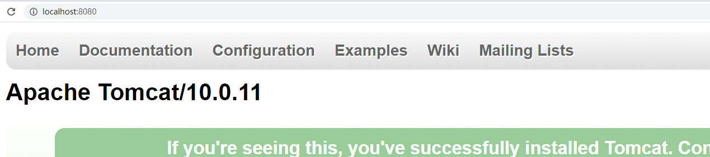

9090端口一样能打开，这就相当于给我们的服务开了好几个门，通过这几个门，数据都能进来。

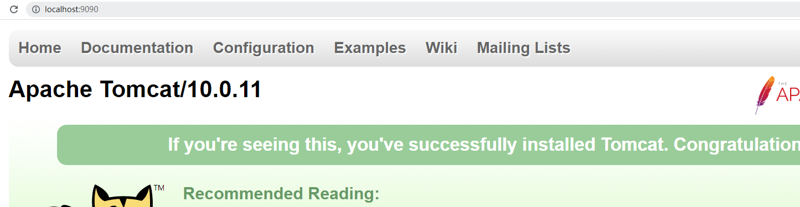

比如我们可以这样去操作：

我们在hosts文件中再配置一个主机域名

路径是：C:\Windows\System32\drivers\etc

受用notepad++修改hosts文件：

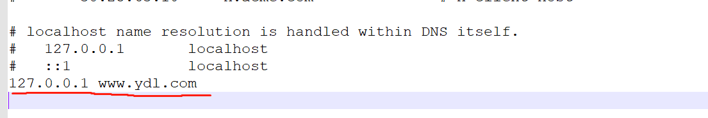

再给我们本机配置一个主机域名：这时不管是localhost还是www.ydl.com都会指向本机：

接着就该位置文件：

```xml
<Engine name="Catalina" defaultHost="localhost"> 
    <!-- 配置一个新的host指向d盘的目录 -->
    <Host name="www.ydl.com"  appBase="D:\\webapps"
          unpackWARs="true" autoDeploy="true">
    </Host>

    <!-- 原有的也是默认的host -->
    <Host name="localhost"  appBase="webapps"
          unpackWARs="true" autoDeploy="true">
        ...
    </Host>

</Engine>
```

当然我们在D盘下新建webapps，这只是个目录的名字，你可以在任何的地方，叫任何的名字：

我们新建目录app，并在app下新建index.html。

```html
<h1>www.ydl.com</h1>
```

启动tomcat，访问<http://www.ydl.com:8080/app/index.html>

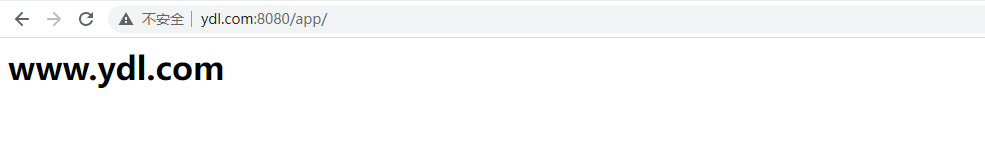

成功了，这里我们验证了多了主机域名。

#### 4、创建Javaweb项目

##### （1）创建项目

直接创建一个Java项目，我们自己尝试构建：

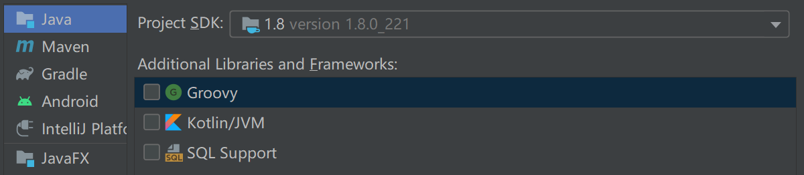

##### （2）创建名字

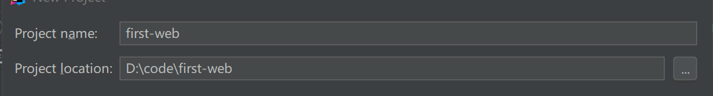

##### （3）项目结构

按照我的项目结构创建目录。

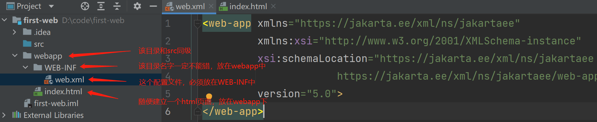

##### （4）构建web项目

进入项目构建的选项卡中：快捷键是 ctrl + shift + alt + s，也可以先点击file，再进入。

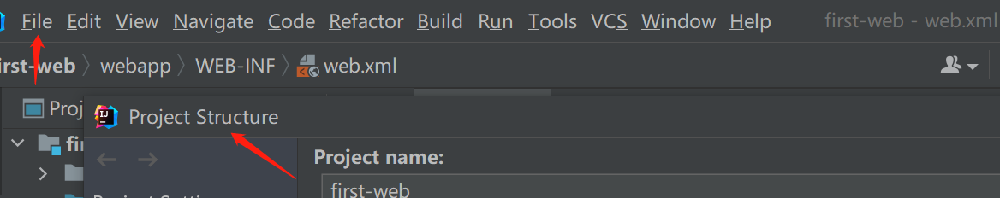

在facets选项中给项目添加特性：

点击加号，选择web，点击OK

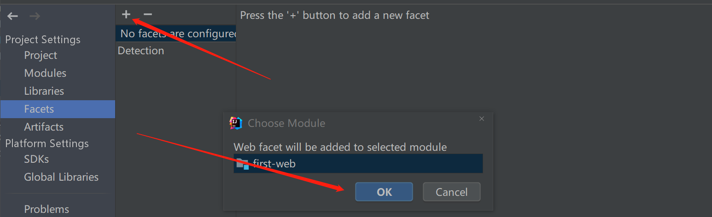

这个指的是我们的xml所在的位置，一定要修改正确


很明显，我这个不对，如果不对，就点击减号删除掉，点击加新增一个。

修改后：

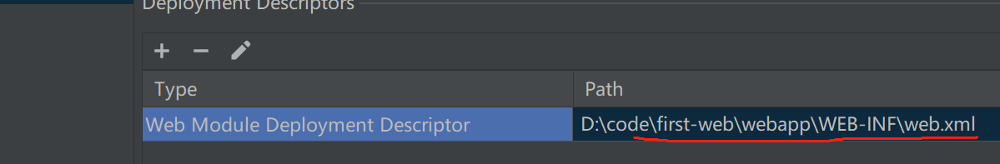

保证路径正确就行了，这个路径也要正确，如果不正确自行修改

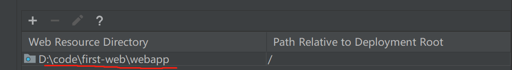

添加一个artifacts，

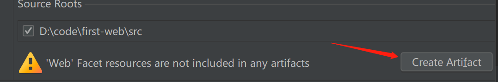

它会自动给你添加：

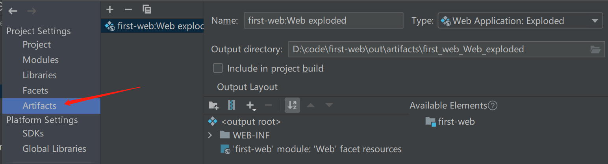

点击确定，配置完成。

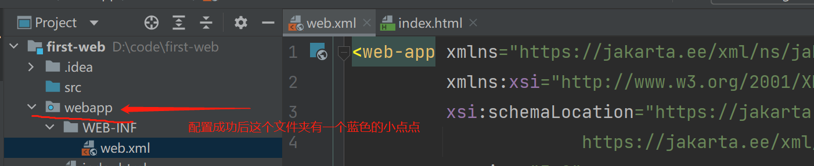

##### （5）配置web服务器（tomcat）

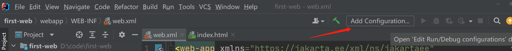

点击+ 选择 tomcat Server 选择local

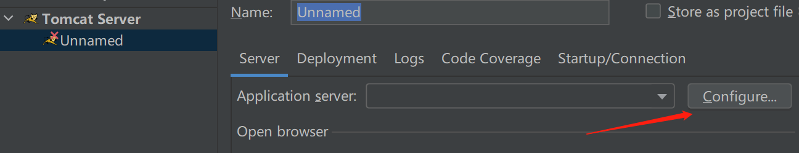

选择我们的tomcat10

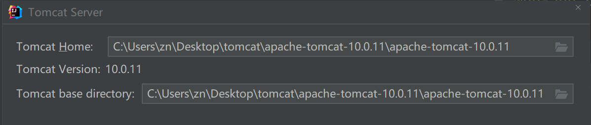

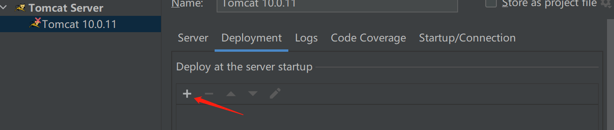

选择artfacts，讲我们的工程部署上去。

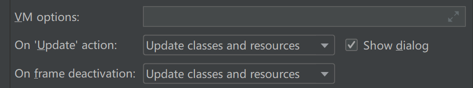

点击确定

#### （6）部署文件

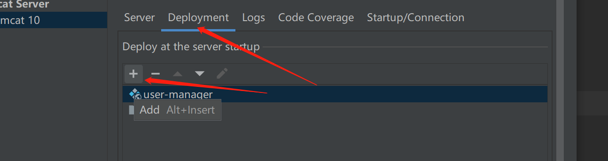

#### （7）启动

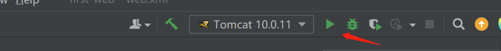

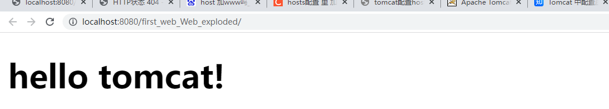

乱码修改：

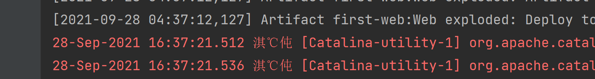

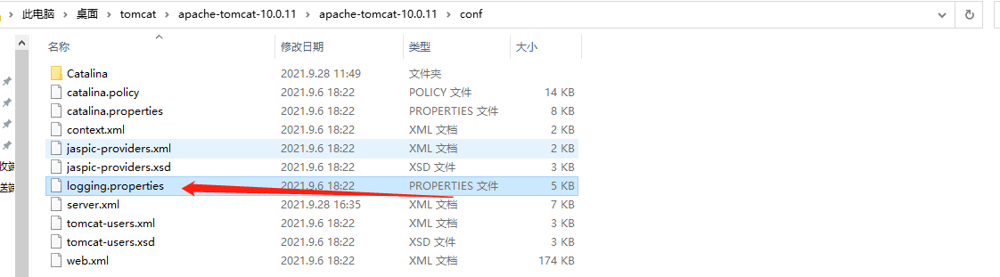

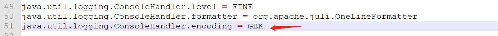

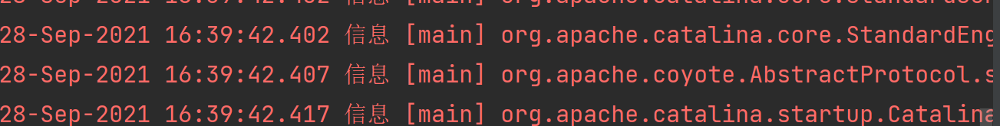

## 第四章 Servlet规范

### 一、Servlet概述

#### 1、 什么是 Servlet

 Servlet 是基于 Jakarta 技术的 Web 组件，由容器管理，可生成动态内容。与其他基于 Jakarta 技术的组件一样，servlet 是独立于平台的 Java 类，它们被编译为与平台无关的字节码，这些字节码可以动态加载到支持 Jakarta 技术的 Web 服务器中并由其运行。容器，有时也称为 servlet 引擎，是提供 servlet 功能的 Web 服务器扩展。Servlet 通过 servlet 容器实现的请求/响应范式与 Web 客户端交互。

#### 2、 什么是 Servlet 容器

 Servlet 容器是 Web 服务器或应用程序服务器的一部分，它提供发送请求和响应的网络服务、解码基于 MIME 的请求以及格式化基于 MIME 的响应。Servlet 容器还通过其生命周期包含和管理 Servlet。

Servlet 容器可以内置到主机 Web 服务器中，也可以通过该服务器的本机扩展 API 作为附加组件安装到 Web 服务器。Servlet 容器也可以内置于或可能安装在支持 Web 的应用程序服务器中。

 所有 Servlet 容器都必须支持 HTTP 作为请求和响应的协议，但可以支持其他基于请求/响应的协议，例如 HTTPS（基于 SSL 的 HTTP）。容器必须实现的 HTTP 规范的必需版本是 HTTP/1.1 和 HTTP/2。

 Java SE 8 是必须用来构建 Servlet 容器的底层 Java 平台的最低版本。

#### 3、 一个例子

以下是一个典型的事件序列：

1. 客户端（例如，Web 浏览器）访问 Web 服务器并发出 HTTP 请求。
2. 请求由 Web 服务器接收并传递给 Servlet 容器。Servlet 容器可以在与主机 Web 服务器相同的进程中运行，也可以在同一主机上的不同进程中运行，或者在与其处理请求的 Web 服务器不同的主机上运行。
3. Servlet 容器根据其Servlet 的配置确定调用哪个 Servlet，并使用代表请求和响应的对象调用它。
4. Servlet 使用请求对象来找出远程用户是谁、`POST`作为此请求的一部分发送的HTTP参数以及其他相关数据。Servlet 执行它编程的任何逻辑，并生成数据发送回客户端。它通过响应对象将此数据发送回客户端。
5. Servlet 处理完请求后，Servlet 容器会确保正确刷新响应，并将控制权返回给主机 Web 服务器。

#### 4、Servlet架构

下图展示了Servlet在Web应用程序中的位置：

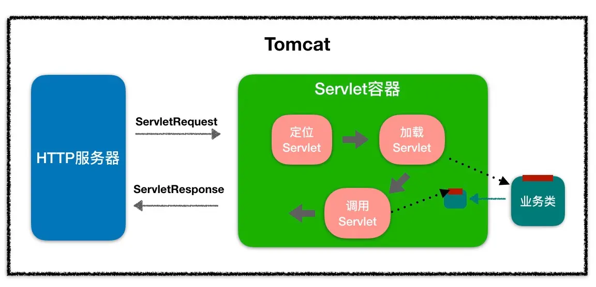img

### 二、Servlet核心技术

#### **1、Servlet加载时机**

 在默认情况下，当Web客户**第一次请求访问某个Servlet时，Web容器会创建这个Servlet的实例。** 当设置了web.xml中的子元素后，Servlet容器在启动Web应用时，将按照指定顺序创建并初始化这个Servlet。设置的数值**大于0**即可。例如：

```xml
<servlet>
    <servlet-name>HelloServlet</servlet-name>
    <servlet-class>com.ydlclass.servlet.HelloServlet</servlet-class>
    <load-on-startup>2</load-on-startup>
</servlet>
```

#### 2、Servlet的生命周期

先看与Servlet生命周期有关的三个方法：init(), service(), destroy(). Servlet生命周期可被定义为从创建直到毁灭的整个过程。以下是三个方法分别对应的Servlet过程：

- init()：Servlet进行初始化；
- service()：Servlet处理客户端的请求；
- destroy()：Servlet结束，释放资源；

在调用destroy()方法后，Servlet由JVM的垃圾回首器进行垃圾回收。

现在我们来详细讨论Servlet生命周期的方法：

> init()方法：

 Servlet被装载后，Servlet容器创建一个Servlet实例并且调用Servlet的init()方法进行初始化在Servlet生命周期中init()方法**只被调用一次**。

 当用户调用一个Servlet时，Servlet容器就会创建一个Servlet实例，**每一个用户请求都会产生一个新的线程**，init()方法简单的创建或加载一些数据，这些数据将会被用在Servlet的整个生命周期。

init()方法的定义如下：

```java
public void init() throws ServletException {
  // 初始化代码...
}
```

> service()方法：

 service()方法是执行实际任务的主要方法。Servlet 容器（即 Web 服务器）调用 service()方法来处理来自客户端（浏览器）的请求，并把格式化的响应写回给客户端。

 每次服务器接收到一个 Servlet 请求时，服务器会产生一个新的线程并调用服务。service()方法检查 HTTP 请求类型（GET、POST、PUT、DELETE 等），并在适当的时候调用doGet()、doPost()等方法。

service()的定义如下：

```java
public void service(ServletRequest request, ServletResponse response) 
    throws ServletException, IOException{
// service()代码...
}
```

> destroy()方法：

 destroy()方法只会被调用一次，在Servlet生命周期结束时被调用。destroy()方法可以让Servlet关闭数据库连接、停止后台、把cookie列表或点击计数器写入到磁盘，并执行其他类似的清理活动。 在调用destroy()方法之后，Servlet对象被标记为垃圾回收。

destroy()方法的定义如下所示：

```cpp
public void destroy() {
    // 终止化代码...
  }
```

**总结：**

- 在首次访问某个Servlet时，init()方法会被执行，而且也会执行service()方法。
- 再次访问时，只会执行service()方法，不再执行init()方法。
- 在关闭Web容器时会调用destroy()方法。

#### 3、实现一个Servlet

 当服务器接收到一个请求，就要有一个Servlet去处理这个请求，所以完成一个Servlet通常需要两步走。一方面要写一个java程序定义一个Servlet，另一方面要配置一下Servlet确定这个Servlet要处理哪一个请求。

##### **（1）创建Servlet的三种方式**

- 实现javax.servlet.Servlet接口。
- 继承javax.servlet.GenericServlet类。
- 继承javax.servlet.http.HttpServlet类。

我们在日常开发中一般会使用第三种方法来进行Servlet的创建，前两种方法理解即可。

**注意：**创建Servlet文件后，需要在web.xml文件中完成Servlet配置，才可以使用。

通过实现Servlet接口，这个接口定义了servlet的生命周期，所有的方法需要我们实现。

```java
public class UserServlet implements Servlet {
    @Override
    public void init(ServletConfig servletConfig) throws ServletException {
        
    }

    @Override
    public ServletConfig getServletConfig() {
        return null;
    }

    @Override
    public void service(ServletRequest servletRequest, ServletResponse servletResponse) throws ServletException, IOException {
        servletResponse.getWriter().print("<h1>hello servlet</h1>");
    }

    @Override
    public String getServletInfo() {
        return null;
    }

    @Override
    public void destroy() {

    }
}
```

GenericServlet

```java
public abstract class GenericServlet implements Servlet, ServletConfig, Serializable {
    private static final long serialVersionUID = 1L;
    private transient ServletConfig config;

    public GenericServlet() {
    }

    public void destroy() {
    }

    public String getServletInfo() {
        return "";
    }
    
    public void init() throws ServletException {
    }

    public abstract void service(ServletRequest var1, ServletResponse var2) throws ServletException, IOException;

    public String getServletName() {
        return this.config.getServletName();
    }
    
    ....
}
public class UserServlet extends GenericServlet {
    @Override
    public void service(ServletRequest servletRequest, ServletResponse servletResponse) throws ServletException, IOException {
        servletResponse.getWriter().print("<h1>hello servlet</h1>");
    }
}
```

Http只是会根据请求的类型进行特殊的调用

```java
//
// Source code recreated from a .class file by IntelliJ IDEA
// (powered by Fernflower decompiler)
//

package javax.servlet.http;

import java.io.IOException;
import java.lang.reflect.InvocationTargetException;
import java.lang.reflect.Method;
import java.text.MessageFormat;
import java.util.Enumeration;
import java.util.ResourceBundle;
import javax.servlet.DispatcherType;
import javax.servlet.GenericServlet;
import javax.servlet.ServletException;
import javax.servlet.ServletOutputStream;
import javax.servlet.ServletRequest;
import javax.servlet.ServletResponse;

public abstract class HttpServlet extends GenericServlet {


    protected void doGet(HttpServletRequest req, HttpServletResponse resp) throws ServletException, IOException {
        String protocol = req.getProtocol();
        String msg = lStrings.getString("http.method_get_not_supported");
        if (protocol.endsWith("1.1")) {
            resp.sendError(405, msg);
        } else {
            resp.sendError(400, msg);
        }

    }

    protected long getLastModified(HttpServletRequest req) {
        return -1L;
    }


    protected void doPost(HttpServletRequest req, HttpServletResponse resp) throws ServletException, IOException {
        String protocol = req.getProtocol();
        String msg = lStrings.getString("http.method_post_not_supported");
        if (protocol.endsWith("1.1")) {
            resp.sendError(405, msg);
        } else {
            resp.sendError(400, msg);
        }

    }

 // 还是会调用它，只是会根据请求的类型进行特殊的调用
    protected void service(HttpServletRequest req, HttpServletResponse resp) throws ServletException, IOException {
        String method = req.getMethod();
        long lastModified;
        if (method.equals("GET")) {
            lastModified = this.getLastModified(req);
            if (lastModified == -1L) {
                this.doGet(req, resp);
            } else {
                long ifModifiedSince;
                try {
                    ifModifiedSince = req.getDateHeader("If-Modified-Since");
                } catch (IllegalArgumentException var9) {
                    ifModifiedSince = -1L;
                }

                if (ifModifiedSince < lastModified / 1000L * 1000L) {
                    this.maybeSetLastModified(resp, lastModified);
                    this.doGet(req, resp);
                } else {
                    resp.setStatus(304);
                }
            }
        } else if (method.equals("HEAD")) {
            lastModified = this.getLastModified(req);
            this.maybeSetLastModified(resp, lastModified);
            this.doHead(req, resp);
        } else if (method.equals("POST")) {
            this.doPost(req, resp);
        } else if (method.equals("PUT")) {
            this.doPut(req, resp);
        } else if (method.equals("DELETE")) {
            this.doDelete(req, resp);
        } else if (method.equals("OPTIONS")) {
            this.doOptions(req, resp);
        } else if (method.equals("TRACE")) {
            this.doTrace(req, resp);
        } else {
            String errMsg = lStrings.getString("http.method_not_implemented");
            Object[] errArgs = new Object[]{method};
            errMsg = MessageFormat.format(errMsg, errArgs);
            resp.sendError(501, errMsg);
        }

    }
    
    ...

}
```

HttpServletRequest和ServletRequest都是接口

HttpServletRequest继承自ServletRequest

HttpServletRequest比ServletRequest多了一些针对于Http协议的方法。 例如：

getHeader()， getMethod() ， getSession()

### 三、Servlet的匹配规则

#### 1、四种匹配规则

##### （1） **精确匹配**

\<url-pattern>中配置的项必须与url完全精确匹配。

```xml
<servlet-mapping>
    <servlet-name>MyServlet</servlet-name>
    <url-pattern>/user/users.html</url-pattern>
    <url-pattern>/index.html</url-pattern>
    <url-pattern>/user/addUser</url-pattern>
</servlet-mapping>
```

当在浏览器中输入如下几种url时，都会被匹配到该servlet

<http://localhost:8080/appDemo/user/users.html>

<http://localhost:8080/appDemo/index.html> 　

<http://localhost:8080/appDemo/user/addUser>

注意：

<http://localhost:8080/appDemo/user/addUser?username=Tom&age=23> 会被匹配到MyServlet。

##### （2） 路径匹配

**以“/”字符开头，并以“/\*”结尾的字符串用于路径匹配**

```xml
<servlet-mapping>
    <servlet-name>MyServlet</servlet-name>
    <url-pattern>/user/*</url-pattern>
</servlet-mapping>
```

路径以/user/开始，后面的路径可以任意。比如下面的url都会被匹配。

- <http://localhost:8080/appDemo/user/users.html>
- <http://localhost:8080/appDemo/user/addUser>
- <http://localhost:8080/appDemo/user/bb//sdf/sdf/sdf/updateUser>

##### （3）扩展名匹配

**以“\*.”开头的字符串被用于扩展名匹配**

```xml
<servlet-mapping>
    <servlet-name>MyServlet</servlet-name>
    <url-pattern>*.jsp</url-pattern>
    <url-pattern>*.do</url-pattern>
</servlet-mapping>
```

则任何扩展名为jsp或action的url请求都会匹配，比如下面的url都会被匹配

- <http://localhost:8080/appDemo/user/users.jsp>
- <http://localhost:8080/appDemo/toHome.action>

##### （4） 缺省匹配

```xml
<servlet-mapping>
    <servlet-name>MyServlet</servlet-name>
    <url-pattern>/</url-pattern>
</servlet-mapping>
```

#### 2、匹配顺序

1. 精确匹配。

2. 路径匹配，先最长路径匹配，再最短路径匹配。

3. 扩展名匹配。

 **注意：使用扩展名匹配，前面就不能有任何的路径。**

4. 缺省匹配，以上都找不到Servlet，就用默认的Servlet，配置为<url-pattern>/</url-pattern>

#### 3、需要注意的问题

> 路径匹配和扩展名匹配无法同时设置

 匹配方法只有三种，要么是路径匹配（**以“/”字符开头，并以“/\*”结尾**），要么是扩展名匹配（**以“\*.”开头**），要么是精确匹配，三种匹配方法不能进行组合，不要想当然使用通配符。

- 如<url-pattern>/user/*.action</url-pattern>是非法的
- 另外注意：<url-pattern>/aa/*/bb</url-pattern>是精确匹配，合法，这里的*不是通配的含义

> "/*"和"/"含义并不相同

- “/*”属于路径匹配，并且可以匹配所有request，由于路径匹配的优先级仅次于精确匹配，所以“/*”会覆盖所有的扩展名匹配，很多404错误均由此引起，所以这是一种特别恶劣的匹配模式。
- “/”是servlet中特殊的匹配模式，切该模式有且仅有一个实例，优先级最低，不会覆盖其他任何url-pattern，只是会替换servlet容器的内建default servlet ，该模式同样会匹配所有request。

Tomcat在%CATALINA_HOME%\conf\web.xml文件中配置了默认的Servlet，配置代码如下:

```xml
<servlet>
        <servlet-name>default</servlet-name>
        <servlet-class>org.apache.catalina.servlets.DefaultServlet</servlet-class>
        <init-param>
            <param-name>debug</param-name>
            <param-value>0</param-value>
        </init-param>
        <init-param>
            <param-name>listings</param-name>
            <param-value>false</param-value>
        </init-param>
        <load-on-startup>1</load-on-startup>
    </servlet>
<servlet>
        <servlet-name>jsp</servlet-name>
        <servlet-class>org.apache.jasper.servlet.JspServlet</servlet-class>
        <init-param>
            <param-name>fork</param-name>
            <param-value>false</param-value>
        </init-param>
        <init-param>
            <param-name>xpoweredBy</param-name>
            <param-value>false</param-value>
        </init-param>
        <load-on-startup>3</load-on-startup>
 </servlet>
<servlet-mapping>
        <servlet-name>default</servlet-name>
        <url-pattern>/</url-pattern>
</servlet-mapping>

    <!-- The mappings for the JSP servlet -->
<servlet-mapping>
        <servlet-name>jsp</servlet-name>
        <url-pattern>*.jsp</url-pattern>
        <url-pattern>*.jspx</url-pattern>
</servlet-mapping>
```

- “/*”和“/”均会拦截静态资源的加载，需要特别注意

#### 4、举例

| 映射的URL    | 对应的Servlet |
| ------------ | ------------- |
| /hello       | servlet1      |
| /bbs/admin/* | servlet2      |
| /bbs/*       | servlet3      |
| *.jsp        | servlet4      |
| /            | servlet5      |

实际请求映射的结果

| 去掉上下文路径的剩余路径 | 处理请求的Servlet |
| ------------------------ | ----------------- |
| /hello                   | servlet1          |
| /bbs/admin/login         | servlet2          |
| /bbs/admin/index.jsp     | servlet2          |
| /bbs/display             | servlet3          |
| /bbs/index.jsp           | servlet3          |
| /bbs                     | servlet3          |
| /index.jsp               | servler4          |
| /hello/index.jsp         | servlet4          |
| /hello/index.html        | servlet5          |
| /news                    | servlet5          |

### 四、请求和响应

#### 1、请求-reques

##### **（1）request概述**

request是Servlet.service()方法的一个参数，类型为javax.servlet.http.HttpServletRequest。在客户端发出每个请求时，服务器都会创建一个request对象，并把请求数据封装到request中，然后再调用Servlet.service()方法时传递给service()方法，这说明在service()方法中可以通过request对象来获取请求数据。

request的功能可以分为以下几种：

- 封装了请求头数据；
- 封装了请求正文数据，如果是GET请求，那么就没有正文；
- request是一个域对象，可以把它当成Map来添加获取数据；
- request提供了请求转发和请求包含功能。（以后学习）

##### **（2）request获取请求头数据**

request与请求头相关的方法有：

- String getHeader(String name)：获取指定名称的请求头；
- Enumeration getHeaderNames()：获取所有请求头名称；
- int getIntHeader(String name)：获取值为int类型的请求头。

##### **（3）request获取请求相关的其它方法**

- request中还提供了与请求相关的其他方法，有些方法是为了我们更加便捷的方法请求头数据而设计，有些是与请求URL相关的方法。
- int getContentLength()：获取请求体的字节数，GET请求没有请求体，没有请求体返回-1；
- String getContentType()：获取请求类型，如果请求是GET，那么这个方法返回null；如果是POST请求，那么默认为application/x-www-form-urlencoded，表示请求体内容使用了URL编码；
- String getMethod()：返回请求方法，例如：GET
- Locale getLocale()：返回当前客户端浏览器的Locale。java.util.Locale表示国家和言语，这个东西在国际化中很有用；
- String getCharacterEncoding()：获取请求编码，如果没有setCharacterEncoding()，那么返回null，表示使用ISO-8859-1编码；
- void setCharacterEncoding(String code)：设置请求编码，只对请求体有效！注意，对于GET而言，没有请求体！！！所以此方法只能对POST请求中的参数有效！
- String getContextPath()：返回上下文路径，例如：/hello
- String getQueryString()：返回请求URL中的参数，例如：name=zhangSan
- String getRequestURI()：返回请求URI路径，例如：/hello/oneServlet
- StringBuffer getRequestURL()：返回请求URL路径，例如：<http://localhost/hello/oneServlet，即返回除了参数以外的路径信息；>
- String getServletPath()：返回Servlet路径，例如：/oneServlet
- String getRemoteAddr()：返回当前客户端的IP地址；
- String getRemoteHost()：返回当前客户端的主机名，但这个方法的实现还是获取IP地址；
- String getScheme()：返回请求协议，例如：http；
- String getServerName()：返回主机名，例如：localhost
- int getServerPort()：返回服务器端口号，例如：8080

> 案例：request.getRemoteAddr()：封IP

可以使用request.getRemoteAddr()方法获取客户端的IP地址，然后判断IP是否为禁用IP。

```java
String ip = request.getRemoteAddr();      
if(ip.equals("127.0.0.1")) {       
 response. getWriter().print("您的IP已被禁止！");      
} else {       
    response.getWriter().print("Hello!");      
}  
```

##### **（4）request获取请求参数**

最为常见的客户端传递参数方式有两种：

- 浏览器地址栏直接输入：一定是GET请求；
- 超链接：一定是GET请求；
- 表单：可以是GET，也可以是POST，这取决与<form>的method属性值。

> GET请求和POST请求的区别：

l GET请求：

- 请求参数会在浏览器的地址栏中显示，所以不安全；
- 请求参数长度限制长度在1K之内；
- GET请求没有请求体，无法通过request.setCharacterEncoding()来设置参数的编码；

l POST请求：

- 请求参数不会显示浏览器的地址栏，相对安全；
- 请求参数长度没有限制；

> 下面是使用request获取请求参数的API：

- String getParameter(String name)：通过指定名称获取参数值；

```java
public void doGet(HttpServletRequest  request, HttpServletResponse response)  throws ServletException,  IOException {      
    String v1 = request.getParameter("p1");      
    String v2 = request.getParameter("p2");      
    System.out.println("p1=" + v1);      
    System.out.println("p2=" + v2);    
}

public void doPost(HttpServletRequest  request, HttpServletResponse response) throws ServletException,  IOException {      
    String v1 = request.getParameter("p1");      
    String v2 = request.getParameter("p2");      
    System.out.println("p1=" + v1);     
    System.out.println("p2=" + v2);      
}  
```

- String[] getParameterValues(String name)：当多个参数名称相同时，可以使用方法来获取；

```java
public void doGet(HttpServletRequest  request, HttpServletResponse response)   throws ServletException,  IOException {      
    String[] names =  request.getParameterValues("name");                                 System.out.println(Arrays.*toString*(names));    
}
```

- Enumeration getParameterNames()：获取所有参数的名字；

```java
public void doPost(HttpServletRequest  request, HttpServletResponse response)  throws ServletException,  IOException {      
    Enumeration names =  request.getParameterNames();      
    while(names.hasMoreElements()) {       
        System.out.println(names.nextElement());      
    }    
}
```

- Map getParameterMap()：获取所有参数封装到Map中，其中key为参数名，value为参数值，因为一个参数名称可能有多个值，所以参数值是String[]，而不是String。

```java
Map<String,String[]> paramMap =  request.getParameterMap();      
for(String name : paramMap.keySet()) {       
    String[] values =  paramMap.get(name);       
    System.*out*.println(name + ": " + Arrays.*toString*(values));     
}
```

##### （5）请求转发-重要

请求转发表示由`多个Servlet共同来处理一个请求`。例如Servlet1来处理请求，然后Servlet1又转发给Servlet2来继续处理这个请求。

在AServlet中，把请求转发到BServlet：

```java
public class AServlet extends HttpServlet {    
    public void doGet(HttpServletRequest  request, HttpServletResponse response) throws ServletException,  IOException {      
        System.out.println("AServlet");     
        RequestDispatcher rd =  request.getRequestDispatcher("/BServlet");      
        rd.forward(request, response);    
    }  
}
public class BServlet extends HttpServlet {    
    public void doGet(HttpServletRequest  request, HttpServletResponse response)  throws ServletException,  IOException {      
        System.out.println("BServlet");    
    }  
} 
```

##### （6）request 域方法

一个请求会创建一个request对象，如果在一个请求中经历了多个Servlet，那么多个Servlet就可以使用request来共享数据。

下面是request的域方法：

- void setAttribute(String name, Object value)：用来存储一个对象，也可以称之为存储一个域属性，
- Object getAttribute(String name)：用来获取request中的数据，当前在获取之前需要先去存储才行，例如：String value = (String)request.getAttribute(“xxx”);，获取名为xxx的域属性；
- void removeAttribute(String name)：用来移除request中的域属性，如果参数name指定的域属性不存在，那么本方法什么都不做；
- Enumeration getAttributeNames()：获取所有域属性的名称；

域方法通常在进行重定向时使用，多个Servlet共享数据。

#### 2、响应-response

##### （1）response概述

 response是Servlet.service方法的一个参数，类型为javax.servlet.http.HttpServletResponse。

 在客户端发出每个请求时，服务器都会创建一个response对象，并传入给Servlet.service()方法。response对象是用来对客户端进行响应的，这说明在service()方法中使用response对象可以完成对客户端的响应工作。

response对象的功能分为以下四种：

- 设置响应头信息；
- 发送状态码；
- 设置响应正文；
- 重定向。

##### （2）response响应正文

response是响应对象，向客户端输出响应正文（响应体）可以使用response的响应流，repsonse一共提供了两个响应流对象：

- PrintWriter out = response.getWriter()：获取字符流，处理字符；
- ServletOutputStream out = response.getOutputStream()：获取字节流，处理文件；

注意，在一个请求中，不能同时使用这两个流！也就是说，要么你使用repsonse.getWriter()，要么使用response.getOutputStream()，但不能同时使用这两个流。不然会抛出IllegalStateException异常。

###### a、字符响应流

（1）字符编码

**重要：**在使用response.getWriter()时需要注意默认字符编码为ISO-8859-1，如果希望设置字符流的字符编码为utf-8，可以使用response.setCharaceterEncoding(“gbk”)来设置。这样可以保证输出给客户端的字符都是使用UTF-8编码的！

 但客户端浏览器并不知道响应数据是什么编码的！如果希望通知客户端使用UTF-8来解读响应数据，那么还是使用**response.setContentType("text/html;charset=utf-8")**方法比较好，

 因为这个方法不只会调用response.setCharaceterEncoding(“utf-8”)，还会设置content-type响应头，客户端浏览器会使用content-type头来解读响应数据。

（2）缓冲区

response.getWriter()是PrintWriter类型，所以它有缓冲区，缓冲区的默认大小为8KB。也就是说，在响应数据没有输出8KB之前，数据都是存放在缓冲区中，而不会立刻发送到客户端。当Servlet执行结束后，服务器才会去刷新流，使缓冲区中的数据发送到客户端。

如果希望响应数据马上发送给客户端：

- 向流中写入大于8KB的数据；
- 调用response.flushBuffer()方法来手动刷新缓冲区；

##### （3）设置响应头信息

可以使用response对象的setHeader()方法来设置响应头！使用该方法设置的响应头最终会发送给客户端浏览器！

- response.setHeader(“content-type”, “text/html;charset=utf-8”)：

设置content-type响应头，该头的作用是告诉浏览器响应内容为html类型，编码为utf-8。而且同时会设置response的字符流编码为utf-8，即response.setCharaceterEncoding(“utf-8”)；

- response.setHeader("Refresh","5; URL=<http://www.baidu.cn：5秒后自动跳转到百度主页。>

##### （4）设置状态码及其他方法

- response.setContentType("text/html;charset=utf-8")：等同于调用response.setHeader(“content-type”, “text/html;charset=utf-8”)；用它就行了。
- response.setCharacterEncoding(“utf-8”)：设置字符响应流的字符编码为utf-8；
- response.setStatus(200)：设置状态码；
- response.sendError(404, “您要查找的资源不存在”)：当发送错误状态码时，Tomcat会跳转到固定的错误页面去，但可以显示错误信息。

重定向和请求转发

##### （5）重定向，重要

> 什么是重定向

[当你访问http://www.sun.com时](http://www.sun.xn--com-t28f/)，你会发现浏览器地址栏中的URL会变成<http://www.oracle.com/us/sun/index.htm，这就是重定向了。>

重定向是服务器通知浏览器去访问另一个地址，即再发出另一个请求。

> 完成重定向

响应码为200表示响应成功，而响应码为302表示重定向。所以完成重定向的第一步就是设置响应码为302。

因为重定向是通知浏览器再第二个请求，所以浏览器需要知道第二个请求的URL，所以完成重定向的第二步是设置Location头，指定第二个请求的URL地址。

```java
compublic class AServlet extends HttpServlet {    
public void doGet(HttpServletRequest  request, HttpServletResponse response)  throws ServletException,  IOException {      
    response.setStatus(302);      
    response.setHeader("Location", "http://www.baidu.com");    
}  
}  
```

上面代码的作用是：当访问AServlet后，会通知浏览器重定向到百度主页。客户端浏览器解析到响应码为302后，就知道服务器让它重定向，所以它会马上获取响应头Location，然发出第二个请求。

> 便捷的重定向方

```java
public class AServlet extends HttpServlet {    
    public void doGet(HttpServletRequest  request, HttpServletResponse response)  throws ServletException,  IOException {      
        response.sendRedirect("http://www.baidu.com");    
    }  
}  
```

response.sendRedirect()方法会设置响应头为302，以设置Location响应头。

如果要重定向的URL是在同一个服务器内，那么可以使用相对路径，例如：

```java
public class AServlet extends HttpServlet {  
    public void doGet(HttpServletRequest  request, HttpServletResponse response)       throws ServletException,  IOException {      
    response.sendRedirect("/hello/BServlet");    
    }  
}  
```

重定向的URL地址为：<http://localhost:8080/hello/BServlet。>

> 重定向小结

- 重定向是两次请求，请求转发是一次
- 重定向的URL可以是其它应用，不局限于当前应用；
- 重定向的响应头为302，并且必须要有Location响应头；
- 重定向就不要再使用response.getWriter()或response.getOutputStream()输出数据，不然可能会出现异常。

#### 3、重定向和转发的区别

- 重定向是两次请求，转发是一个请求
- **重定向是浏览器的行为，请求转发是服务器行为**
- **重定向浏览器的地址会发生改变，转发不会**
- 重定向可以重定向到任何地址，转发只能在项目内转发

#### 4、session和cookie

 会话的概念：在计算机中，尤其是在网络应用中，称为“会话控制”。

 http是无状态的，它不保存状态，意思就是一个浏览器发的请求，随后就断开了，下一次发送请求就和上一次无关了。

 比如一个用户购买一个商品，第一次需要登录，如果再买一个时向服务器发送请求，服务器如果不知道是谁发的，那么他就得再登录一次，这显然是不合理的，于是就提出了cookie和session的概念。

 cookie是记录在浏览器端的一个字符串，它的大小不能超过4k，session是保存在服务器端的一个对象。它们两互相配合让服务器有了能识别客户端一些状态的能力，意思就是服务就能知道这个客户端有没有登录等。cookie就相当于通行证，session就是门房，进去时需要从门房识别一个身份。

##### （1）cookie

cookie是可以通过key和value构建的，我们可以给cookie添加一个有效期，单位是秒：

```text
Set-Cookie：customer=huangxp; path=/foo; domain=.ibm.com; expires= Wednesday, 22-OCT-05 23:12:40 GMT;
Cookie cookie = new Cookie("jsession", UUID.randomUUID().toString());
resp.addCookie(cookie);
```

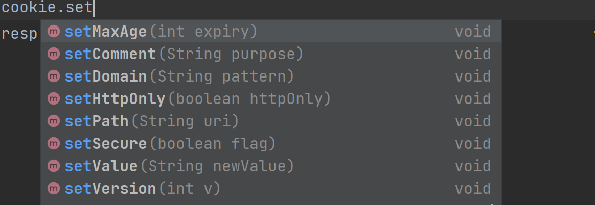

cookie除了key-value之外，还有一些字段用来控制cookie的行为：

> expires/Max-Age 字段

 为此cookie超时时间。若设置其值为一个时间，那么当到达此时间后，此cookie失效。不设置的话默认值是Session，当浏览器关闭(不是浏览器标签页，而是整个浏览器) 后，此cookie失效。

1、过期时间，定cookie的生命期。如果是正数单位是秒，如果是负数代表关闭浏览器失效，如果设置成零也就是将cookie失效。

2、具体是值是过期日期。如果想让cookie的存在期限超过当前浏览器会话时间，就必须使用这个属性。当过了到期日期时，浏览器就可以删除cookie文件，没有任何影响。

> Secure字段

设置是否只能通过https来传递此条cookie

- 安全，指定cookie的值通过网络如何在用户和WEB服务器之间传递。
- 这个属性的值或者是“secure”，或者为空。缺省情况下，该属性为空，也就是使用不安全的HTTP连接传递数据。如果一个 cookie 标记为secure，那么，它与WEB服务器之间就通过HTTPS或者其它安全协议传递数据。不过，设置了secure属性不代表其他人不能看到你机器本地保存的cookie。换句话说，把cookie设置为secure，只保证cookie与WEB服务器之间的数据传输过程加密，而保存在本地的cookie文件并不加密。如果想让本地cookie也加密，得自己加密数据。

> Http字段

cookie的httponly属性。若此属性为true，则只有在http请求头中会带有此cookie的信息，而不能通过document.cookie来访问此cookie。

- 如果在Cookie中设置了”HttpOnly”属性，那么通过后台程序读取，JS脚本将无法读取到Cookie信息，这样能有效的防止XSS攻击。
- 但是设置HttpOnly属性，Cookie盗窃的威胁并没有彻底消除，因为cookie还是有可能传递的过程中被监听捕获后信息泄漏。

> domain字段

- 域，指定关联的WEB服务器或域。
- 值是域名。这是对path路径属性的一个延伸。如果我们想让 dev.mycompany.com 能够访问bbs.mycompany.com 设置的 cookies，该怎么办? 我们可以把domain属性设置成 “mycompany.com”，并把path属性设置成 “/”。不能把 **cookies域属性设置成与设置它的服务器的所在域**不同的值。

> Path字段

path字段为可以访问此cookie的页面路径。 比如domain是abc.com，path是/test，那么只有/test路径下的页面可以读取此cookie。

- 路径，指定与cookie关联的WEB页。
- 值可以是一个目录，或者是一个路径。如果/head/index.html 建立了一个cookie，那么在/head/目录里的所有页面，以及该目录下面任何子目录里的页面都可以访问这个cookie。这就是说，在/head/stories/articles 里的任何页面都可以访问/head/index.html建立的cookie。但是，如果/zdnn/ 需要访问/head/index.html设置的cookies，该怎么办?这时，我们要把cookies的path属性设置成“/”。在指定路径的时候，凡是来自同一服务器，URL里有相同路径的所有WEB页面都可以共享cookies。现在看另一个例子：如果想让 /head/filters/ 和/head/stories/共享cookies，就要把path设成“/head”。

##### （2）session

创建时机：

服务器端第一次调用getSession()的时候会创建；(保存在服务器内存中)

```java
HttpSession session = req.getSession();
```

这也就意味着，调用这个方法的时候，会去获取session，如果获得了就获得了，如果不能获取则会执行以下操作：

- 在内存创建一个session，同时给这个session一个id
- 响应中加一个首部set-Cookie，带上这个id，这个默认的cookie，会在关闭浏览器时消除。

内存中的session不会一直存在，配置session的失效时间

```text
<session-config>
    <session-timeout>30</session-timeout>
</session-config>
```

#### 5、Servlet三大域对象

| 对象名称    | 对象的类型         |
| ----------- | ------------------ |
| request     | HttpServletRequest |
| session     | HttpSession        |
| application | ServletContext     |

怎么理解域对象，就是这几个对象都有自己管理的领域，我们之前学习过作用域，每一个变量都有自己的作用域。我们可以在这个域对象中保存一些数据，不同的域对象有自己不同的作用范围。

##### （1）request

生命周期：

- 创建：客户端向服务器发送一次请求,服务器就会创建request对象.
- 销毁：服务器对这次请求作出响应后就会销毁request对象.
- 有效：仅在当前请求中有效。

作用：可以在请求转发中传递数据。

##### （2）session

生命周期：

创建：服务器端第一次调用getSession()；(保存在服务器内存中)

销毁：

- 非正常关闭服务器(正常关闭session会序列化，再次启动服务器session会被反序列化)。
- session过期了默认30分钟。
- 手动调用session.invalidate()。

注意：关闭浏览器再次访问会找不到session的会话id而不是session被销毁了。

有效：用户打开浏览器会话开始，直到关闭浏览器会话才会结束。一次会话期间只会创建一个session对象。

作用：最典型的就是用户登录状态保存的。

##### （3）application

生命周期：

- 创建：服务器启动的时候,服务器为每个WEB应用创建一个属于该web项目的对象ServletContext类。
- 销毁：服务器关闭或者项目从服务器中移除的时候。
- 有效：此信息在整个服务器上被保留。

域对象的区别：

- request: 每一次请求都是一个新的request对象,如果在web组件之间需要共享同一个请求中的数据,只能使用请求转发。
- session: 每一次会话都是一个新的session对象,如果在一次会话中的多个请求之间需要共享数据,只能使用session。
- application: 应用对象,Tomcat启动到关闭,表示一个应用,在一个应用中有且只有一个application对象,作用于整个Web应用,可以实现多次会话之间的数据共享.

共同点：

1、设置作用域中的共享数据（保存数据）

作用域对象.setAttribute(String name,Object value);

2、获取作用域中的共享数据（获取数据）

Object value=作用域对象.getAttribute(String name);

3、删除作用域中的指定的共享数据（删除数据）

作用域对象.removeAttribute(String name);

## 第五章 JSP入门学习

### 一、JSP基础语法

#### 1、JSP模板元素

JSP页面中的HTML内容称之为JSP模版元素。JSP模版元素定义了网页的基本骨架，即定义了页面的结构和外观。

```jsp
<%@ page contentType="text/html;charset=UTF-8" language="java" %>
<html>
<head>
    <title>Title</title>
</head>
<body>
```

#### 2、JSP脚本片段

JSP脚本片断用于在JSP页面中编写多行Java代码（**在<%%>不能定义方法**）。语法：**<%多行java代码 %>**

例如：

```dart
<%
    int num = 0;
    num = ++num;
    out.println("num:" + num);
%>
```

注意：

1、JSP脚本片断中只能出现Java代码，不能出现其它模板元素， JSP引擎在翻译JSP页面中，会将JSP脚本片断中的Java代码原封不动地放到Servlet的_jspService方法中。

2、JSP脚本片断中的Java代码必须严格遵循Java语法，例如，每执行语句后面必须用分号（;）结束。

3、在一个JSP页面中可以有多个脚本片断，在两个或多个脚本片断之间可以嵌入文本、HTML标记和其他JSP元素。

4、多个脚本片断中的代码可以相互访问

#### 3、JSP表达式

JSP脚本表达式（expression）用于将程序数据输出到客户端，语法：**<%=变量或表达式 %>**

例如：

```jsp
<%=name %>
<%="123" %>
```

#### 4、JSP声明

 JSP页面中编写的所有代码，默认会被编译到servlet的_jspService方法中， 而Jsp声明中的java代码被翻译到_jspService方法的外面。语法：**<%！java代码 %>**

 JSP声明可用于定义JSP页面转换成的Servlet程序的静态代码块、成员变量和方法。

例如：

```csharp
<%!
static { 
    System.out.println("静态代码块"); 
}
 
private String name = "ydlclass";
 
public void TestFun(){
    System.out.println("成员方法！");
}
%>
<%
    TestFun();
    out.println("name:" + name);
%>
```

#### 5、JSP注释

在JSP中，注释有显式注释， 隐式注释，JSP自己的注释：

| 显式注释      | 直接使用HTML风格的注释：<!- - 注释内容- -> |
| ------------- | ------------------------------------------ |
| 隐式注释      | 直接使用JAVA的注释：//、/*……*/             |
| JSP自己的注释 | <%- - 注释内容- -%>                        |

区别：

HTML的注释在浏览器中查看源文件的时候是可以看得到的，而JAVA注释和JSP注释在浏览器中查看源文件时是看不到注释的内容的。

### 二、JSP原理

#### 1、jsp本质上是什么

 浏览器向服务器发请求，不管访问的是什么资源，其实都是在访问Servlet，所以当访问一个jsp页面时，其实也是在访问一个Servlet，服务器在执行jsp的时候，首先把jsp编译成一个Servlet，所以我们访问jsp时，其实不是在访问jsp，而是在访问jsp编译过后的那个Servlet。

**所以jsp的本质其实就是个html模板，编译器会根据模板生成对应的servlet。**

例如下面的代码：

```xml
<%@ page language="java" contentType="text/html; charset=UTF-8"
    pageEncoding="UTF-8"%>
<!DOCTYPE html PUBLIC "-//W3C//DTD HTML 4.01 Transitional//EN" "http://www.w3.org/TR/html4/loose.dtd">
<html>
<head>
<meta http-equiv="Content-Type" content="text/html; charset=UTF-8">
<title>Insert title here</title>
</head>
<body>
    <%!
    static { 
        System.out.println("静态代码块"); 
    }
 
    private String name = "ydl";
 
    public void TestFun(){
        System.out.println("成员方法！");
    }
    %>
    <%
        TestFun()；
    %>
</body>
</html>
```

 当我们通过浏览器访问index.jsp时，服务器首先将index.jsp翻译成一个index_jsp.class，在Tomcat服务器的work\Catalina\localhost\项目名\org\apache\jsp目录下可以看到index_jsp.class的源代码文件index_jsp.java。

 当然，如果我们在idea下启动tomcat，我们需要在这个目录中查看，你的电脑在哪里自行对照：

```url
C:\Users\zn\AppData\Local\JetBrains\IntelliJIdea2021.2\tomcat\dbaebc50-0a4c-46a3-98dd-dd58d5f7ab41\work\Catalina\localhost
```

 编译后的jsp是这个样子的：

```kotlin
package org.apache.jsp;
 
import javax.servlet.*;
import javax.servlet.http.*;
import javax.servlet.jsp.*;
 
public final class index_jsp extends org.apache.jasper.runtime.HttpJspBase
    implements org.apache.jasper.runtime.JspSourceDependent {
 
 // 这是jsp中的声明
    static { 
        System.out.println("静态代码块"); 
    }
 
    private String name = "XinZhi";
 
    public void TestFun(){
        System.out.println("成员方法！");
    }
    
  private static final javax.servlet.jsp.JspFactory _jspxFactory =
          javax.servlet.jsp.JspFactory.getDefaultFactory();
 
  private static java.util.Map<java.lang.String,java.lang.Long> _jspx_dependants;
 
  private volatile javax.el.ExpressionFactory _el_expressionfactory;
  private volatile org.apache.tomcat.InstanceManager _jsp_instancemanager;
 
  public java.util.Map<java.lang.String,java.lang.Long> getDependants() {
    return _jspx_dependants;
  }
 
  public javax.el.ExpressionFactory _jsp_getExpressionFactory() {
    if (_el_expressionfactory == null) {
      synchronized (this) {
        if (_el_expressionfactory == null) {
          _el_expressionfactory = _jspxFactory.getJspApplicationContext(getServletConfig().getServletContext()).getExpressionFactory();
        }
      }
    }
    return _el_expressionfactory;
  }
 
  public org.apache.tomcat.InstanceManager _jsp_getInstanceManager() {
    if (_jsp_instancemanager == null) {
      synchronized (this) {
        if (_jsp_instancemanager == null) {
          _jsp_instancemanager = org.apache.jasper.runtime.InstanceManagerFactory.getInstanceManager(getServletConfig());
        }
      }
    }
    return _jsp_instancemanager;
  }
 
  public void _jspInit() {
  }
 
  public void _jspDestroy() {
  }
 
  public void _jspService(final javax.servlet.http.HttpServletRequest request, final javax.servlet.http.HttpServletResponse response)
        throws java.io.IOException, javax.servlet.ServletException {
 
    final javax.servlet.jsp.PageContext pageContext;
    javax.servlet.http.HttpSession session = null;
    final javax.servlet.ServletContext application;
    final javax.servlet.ServletConfig config;
    javax.servlet.jsp.JspWriter out = null;
    final java.lang.Object page = this;
    javax.servlet.jsp.JspWriter _jspx_out = null;
    javax.servlet.jsp.PageContext _jspx_page_context = null;
 
 
    try {
      response.setContentType("text/html; charset=UTF-8");
      pageContext = _jspxFactory.getPageContext(this, request, response,
                null, true, 8192, true);
      _jspx_page_context = pageContext;
      application = pageContext.getServletContext();
      config = pageContext.getServletConfig();
      session = pageContext.getSession();
      out = pageContext.getOut();
      _jspx_out = out;
 
      out.write("\r\n");
      out.write("<!DOCTYPE html PUBLIC \"-//W3C//DTD HTML 4.01 Transitional//EN\" \"http://www.w3.org/TR/html4/loose.dtd\">\r\n");
      out.write("<html>\r\n");
      out.write("<head>\r\n");
      out.write("<meta http-equiv=\"Content-Type\" content=\"text/html; charset=UTF-8\">\r\n");
      out.write("<title>Insert title here</title>\r\n");
      out.write("</head>\r\n");
      out.write("<body>\r\n");
      out.write("\t");
      out.write('\r');
      out.write('\n');
      out.write('   ');
 
      // 这是我们写的脚本
      testFun();
      out.println("name:" + name);
    
      out.write("\r\n");
      out.write("</body>\r\n");
      out.write("</html>");
    } catch (java.lang.Throwable t) {
      if (!(t instanceof javax.servlet.jsp.SkipPageException)){
        out = _jspx_out;
        if (out != null && out.getBufferSize() != 0)
          try {
            if (response.isCommitted()) {
              out.flush();
            } else {
              out.clearBuffer();
            }
          } catch (java.io.IOException e) {}
        if (_jspx_page_context != null) _jspx_page_context.handlePageException(t);
        else throw new ServletException(t);
      }
    } finally {
      _jspxFactory.releasePageContext(_jspx_page_context);
    }
  }
}
```

 index_jsp这个类是继承org.apache.jasper.runtime.HttpJspBase这个类的，通过查看HttpJspBase源代码，可以知道HttpJspBase类是继承HttpServlet的，所以HttpJspBase类是一个Servlet，而index_jsp又是继承HttpJspBase类的，所以index_jsp类也是一个Servlet，所以当浏览器访问服务器上的index.jsp页面时，其实就是在访问index_jsp这个Servlet，index_jsp这个Servlet使用_jspService这个方法处理请求。

HttpJspBase源码如下：

```java
import java.io.IOException;
 
import javax.servlet.ServletConfig;
import javax.servlet.ServletException;
import javax.servlet.http.HttpServlet;
import javax.servlet.http.HttpServletRequest;
import javax.servlet.http.HttpServletResponse;
import javax.servlet.jsp.HttpJspPage;
import javax.servlet.jsp.JspFactory;
 
import org.apache.jasper.compiler.Localizer;
 
public abstract class HttpJspBase extends HttpServlet implements HttpJspPage{
   
    protected HttpJspBase() {
    }
 
    public final void init(ServletConfig config) 
    throws ServletException 
    {
        super.init(config);
    jspInit();
        _jspInit();
    }
    
    public String getServletInfo() {
    return Localizer.getMessage("jsp.engine.info");
    }
 
    public final void destroy() {
    jspDestroy();
    _jspDestroy();
    }
 
    /**
     * Entry point into service.
     */
    public final void service(HttpServletRequest request, HttpServletResponse response) 
    throws ServletException, IOException 
    {
        _jspService(request, response);
    }
    
    public void jspInit() {
    }
 
    public void _jspInit() {
    }
 
    public void jspDestroy() {
    }
 
    protected void _jspDestroy() {
    }
 
    public abstract void _jspService(HttpServletRequest request, 
                     HttpServletResponse response) 
    throws ServletException, IOException;
}
```

#### 2、_jspService方法

问题1：Jsp页面中的html排版标签是如何被发送到客户端的？

 浏览器接收到的这些数据，都是在_jspService方法中使用如下的代码输出给浏览器的。

```text
 out.write("<html>");
```

问题2：Jsp页面中的java代码服务器是如何执行的？

 在jsp中编写的java代码会被翻译到_jspService方法中去，当执行_jspService方法处理请求时，就会执行在jsp编写的java代码了，所以Jsp页面中的java代码服务器是通过调用_jspService方法处理请求时执行的。

#### 3、jsp在服务器的执行流程

**第一次执行：**

1. 客户端通过电脑连接服务器，因为请求是动态的，所以所有的请求交给WEB容器来处理
2. 在容器中找到需要执行的*.jsp文件
3. 之后*.jsp文件通过转换变为*.java文件
4. *.java文件经过编译后，形成*.class文件
5. 最终服务器要执行形成的*.class文件

**第二次执行：**

1. 因为已经存在了*.class文件，所以不再需要转换和编译的过程

**修改后执行：**

1. 源文件已经被修改过了，所以需要重新转换，重新编译。

### 三、JSP指令

#### 1、JSP指令标识的语法格式

```jsp
<%@ 指令名  属性1 = "属性1的值" 属性2 = "属性2的值" ....%>
```

- 指令名:用于指定指令名称 在JSP中包含page include taglib 这3种指令
- 属性: 用于指定指令属性名称 不同的指令包含不同的属性 在同一个指令中可以设置多个属性 各个属性之间用逗号或者空格隔开
- 属性值:用于指定属性的值

注意点:

> 指令标识<%@%>是一个完整的指令,不能够添加空格,但是便签中定义的属性与指令名之间是有空格的

#### 2、Page指令

page指令是JSP页面中最常见的指令,用于定义整个JSP页面的相关属性

> 语法格式

```xml
<%@ page  属性1 = "属性1的值" 属性2 = "属性2的值" ....%>
```

> page指令的相关属

**language属性**

用于设置整个JSP页面的使用的语言,目前只支持JAVA语言,改属性默认值是JAVA

```xml
<%@ page language="java" %>
```

**improt属性**

设置JSP导入的类包

```xml
<%@ page improt="java.util.*" %>
```

**pageEcoding属性**

这种JSP页面的编码格式,也就是指定文件编码

```jsp
<%@ page pageEncoding="GBK" %>
```

设置JSP页面的MIME类型和字符编码

```xml
<%@ page contentType ="text/html;charset=UTF-8" %>
```

**Sesssion属性**

设置页面是否使用HTTP的session会话对象.Boolen类型,默认值是true

```xml
<%@ page session ="false" %>
```

- session是JSP的内置对象之一

**autoFlush属性**

设置JSP页面缓存满时,是否自动刷新缓存,默认值是:true, 如果这种为false,则当页面缓存满时就会抛出异常

```xml
<%@ page autoFlush ="false" %>
```

**isErrorPage属性**

可以把当前页面设置成错误处理页面来处理另外jsp页面的错误

```xml
<%@ page isErrorPage ="true" %>
```

**errorPage属性**

指定当前jsp页面异常错误的另一个JSP页面,指定的JSP页面的isErrorPage属性必须为true,属性值是一个url字符串

```xml
<%@ page errorPage ="errorPage.jsp" %>
```

#### 3、include指令

include指令用于引入其它JSP页面，如果使用include指令引入了其它JSP页面，那么JSP引擎将把这两个JSP翻译成一个servlet。所以include指令引入通常也称之为静态引入。

语法：<%@ include file="relativeURL"%>

file属性用于指定被引入文件的路径。路径以"/"开头，表示代表当前web应用。

**注意细节**：

1. 被引入的文件必须遵循JSP语法。
2. 被引入的文件可以使用任意的扩展名，即使其扩展名是html，JSP引擎也会按照处理jsp页面的方式处理它里面的内容，为了见明知意，JSP规范建议使用.jspf（JSP fragments(片段)）作为静态引入文件的扩展名。
3. 由于使用include指令将会涉及到2个JSP页面，**并会把2个JSP翻译成一个servlet**，所以这2个JSP页面的指令不能冲突（除了pageEncoding和导包除外）。

### 四、JSP标签

#### 1、 Jsp标签分类

 1）内置标签（动作标签）： 不需要在jsp页面导入标签

 2）jstl标签： 需要在jsp页面中导入标签，这个后边我们单独讲

 3）自定义标签 ： 开发者自行定义，需要在jsp页面导入标签

JSP标签也称之为Jsp Action(JSP动作)元素，它用于在Jsp页面中提供业务逻辑功能，避免在JSP页面中直接编写java代码，造成jsp页面难以维护。

#### 2、 常用的内置标签

##### **（1）标签**一<jsp:include>

<jsp:include>标签用于把另外一个资源的输出内容插入进当前JSP页面的输出内容之中，这种在JSP页面执行时的引入方式称之为动态引入。

语法：``

| page  | 用于指定被引入资源的相对路径，它也可以通过执行一个表达式来获得。 |
| ----- | ------------------------------------------------------------ |
| flush | 指定在插入其他资源的输出内容时，是否先将当前JSP页面的已输出的内容刷新到客户端。 |

**标签与include指令的区别：**

<jsp:include>标签是动态引入， <jsp:include>标签涉及到的2个JSP页面会被翻译成2个servlet，这2个servlet的内容在执行时进行合并。 而include指令是静态引入，涉及到的2个JSP页面会被翻译成一个servlet，其内容是在源文件级别进行合并。

##### **（2）标签**<jsp:forward>和<jsp:param>

<jsp:forward>标签用于把请求转发给另外一个资源（服务器跳转，地址不变）。

```xml
<%--使用jsp:forward标签进行请求转发--%>
<jsp:forward page="/index2.jsp" >
    <jsp:param value="10086" name="num"/>
    <jsp:param value="10010" name="num2"/>
</jsp:forward>
```

### 五、JSP属性作用域

JSP中提供了四种属性范围（四大域对象），如下：

1. **当前页（pageContext）**：一个属性只能在一个页面中取得，跳转到其他页面无法取得。
2. **一次服务器请求（request）**：一个页面中设置的属性，只要经过了请求重定向之后的页面可以继续取得。
3. **一次会话（session）**：一个用户设置的内容，只要是与此用户相关的页面都可以访问（一个会话表示一个人，这个人设置的东西只要这个人不走，就依然有效），关了浏览器就不见了。
4. **上下文中（application）**：在整个服务器上设置的属性，所有人都可以访问。

 我们要知道的一点，对于域对象就像我们方法的作用域一样，我们把所有的变量都定义成全局的合适吗？全定义成局部的合适吗？显然是不合适，根据不同的场景选择不同的技术才是正确的。

 在我们的web项目中，一个请求可能会被转发给多个页面，一次会话可能产生多个请求，一个应用上下文又会有多个会话，域对象解决的问题就是在对象传递中的一个作用域的问题。

### 六、九大内置对象

九大内置对象，听起来特别唬人，我们也确实发现，在jsp中是可以直接使用某些对象的，那到底是为什么呢？

其实答案只有一个，我们在编译成servlet的时候就已经为我们准备好了这些对象，当然可以拿来即用啊：

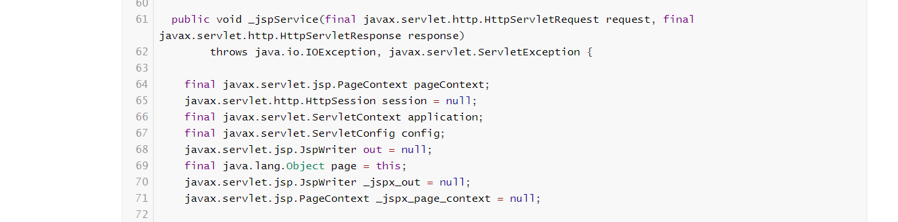

#### 1、 request 对象

 代表的是来自客户端的请求 , 客户端发送的请求封装在 request 对象中 , 通过它才能了解到用户的请求信息 , 然后作出响应 , 它是 HTTPServletRequest 的实例 , 作用域为 request ( 响应生成之前 )

**常用方法：**

```java
Object getAttribute(String name);               // 返回指定属性的属性值
void setAttribute(String key, Object value);    // 设置属性的属性值
Enumeration getAttributeNames();                // 返回所有可以用属性名的枚举
String getParameter(String name);               // 返回指定name的参数值
Enumeration getParameterNames();                // 返回可用参数名的枚举
String[] getParameterValues(String name);       // 返回包含参数name的所有制的数组
ServletInputStream geetInputStream();           // 得到请求体中一行的二进制流
BufferedReader getReader();                     // 返回解码过了的请求体


String getServerName();         // 返回接收请求的服务器主机名
int getServerPort();            // 返回服务器接收此请求所用的端口号
String getRemoteAddr();         // 返回发送请求的客户端的IP地址
String getRemoteHost();         // 返回发送请求的客户端主机名
String getRealPath();           // 返回一个虚拟路径的真实路径
String getCharacterEncoding();  // 返回字符编码方式
int geContentLength();          // 返回请求体的长度 ( 字节数 )
String getContentType();        // 返回请求体的MIME类型
String getProtocol();           // 返回请求用的协议类型以及版本号
String getScheme();             // 返回请求用的协议名称( 例如 : http  https  ftp )
```

#### 2、response 对象

 对象代表的是对客户端的响应 , 也就是说可以通过 response 对象来组织发送到客户端的数据 ; 但是由于组织方式比较底层 , 所以不建议初学者使用 , 需要向客户端发送文字时直接使用 ; 它是 HttpServletResponse 的实例 ; 作用域为 page ( 页面执行期 )

**常用方法：**

```java
String getCharacterEncoding();          // 返回响应用的是哪种字符编码
ServletOutputStream getOutputStream();  // 返回响应的一个二进制输出流
PrintWriter getWriter();                // 返回可以向客户端输出字符的一个对象
void setContentLength(int len);         // 设置响应头长度
void setContentType(String type);       // 设置响应的MIME类型
void sendRedirect(String location);     // 重新定向客户端的请求
```

#### 3、 session 对象

 指的是客户端与服务器的一次会话 , 从客户连接到服务器的一个 WebApplication 开始 , 直到客户端与服务器断开连接为止 ; 它是 HTTPSession 类的实例 , 作用域为 session ( 会话期 )

**常用方法：**

```java
long getCreationTime();         // 返回SESSION创建时间 
public String getId();          // 返回SESSION创建时JSP引擎为它设的惟一ID号 
long getLastAccessedTime();     // 返回此SESSION里客户端最近一次请求时间 
int getMaxInactiveInterval();   // 返回两次请求间隔多长时间此SESSION被取消(ms) 
String[] getValueNames();       // 返回一个包含此SESSION中所有可用属性的数组 
void invalidate();              // 取消SESSION，使SESSION不可用 
```

#### 4、out 对象

 out 对象是 JspWriter 类的实例,是向客户端输出内容常用的对象 ; 作用域为 page ( 页面执行期 )

**常用方法：**

```java
void clear();           // 清除缓冲区的内容 
void clearBuffer();     // 清除缓冲区的当前内容 
void flush();           // 清空流 
int getBufferSize();    // 返回缓冲区以字节数的大小，如不设缓冲区则为0 
int getRemaining();     // 返回缓冲区还剩余多少可用 
boolean isAutoFlush();  // 返回缓冲区满时，是自动清空还是抛出异常 
void close();           // 关闭输出流 
```

#### 5、page 对象

 page 对象就是指向当前 JSP 页面本身 , 有点像类中的 this 指针 , 它是 Object 类的实例 ; page 对象代表了正在运行的由 JSP 文件产生的类对象 , 不建议初学者使用 ; 作用域为 page ( 页面执行期 )

**常用方法：**

```java
class getClass();           // 返回此Object的类 
int hashCode();             // 返回此Object的hash码 
boolean equals(Object obj); // 判断此Object是否与指定的Object对象相等 
void copy(Object obj);      // 把此Object拷贝到指定的Object对象中 
Object clone();             // 克隆此Object对象 
String toString();          // 把此Object对象转换成String类的对象 
void notify();              // 唤醒一个等待的线程 
void notifyAll();           // 唤醒所有等待的线程 
void wait(int timeout);     // 使一个线程处于等待直到timeout结束或被唤醒 
void wait();                // 使一个线程处于等待直到被唤醒 
void enterMonitor();        // 对Object加锁 
void exitMonitor();         // 对Object开锁
```

#### 6、application 对象

 实现了用户间数据的共享 , 可存放全局变量 ; 它开始于服务器的启动 , 直到服务器的关闭 , 在此期间 , 此对象将一直存在 ; 这样在用户的前后连接或不同用户之间的连接中 , 可以对此对象的同一属性进行操作 ; 在任何地方对此对象属性的操作 , 都将影响到其他用户对此的访问 ; 服务器的启动和关闭决定了 application 对象的生命 ; 它是 ServletContext 类的实例 ; 作用域为 application

**常用方法：**

```java
Object getAttribute(String name);// 返回给定名的属性值 
Enumeration getAttributeNames();// 返回所有可用属性名的枚举 
void setAttribute(String name,Object obj);// 设定属性的属性值 
void removeAttribute(String name);// 删除一属性及其属性值 
String getServerInfo();// 返回JSP(SERVLET)引擎名及版本号 
String getRealPath(String path);// 返回一虚拟路径的真实路径 
ServletContext getContext(String uripath);// 返回指定WebApplication的application对象 
int getMajorVersion();// 返回服务器支持的Servlet API的最大版本号 
int getMinorVersion();// 返回服务器支持的Servlet API的最大版本号 
String getMimeType(String file);// 返回指定文件的MIME类型 
URL getResource(String path);// 返回指定资源(文件及目录)的URL路径 
InputStream getResourceAsStream(String path);// 返回指定资源的输入流 
RequestDispatcher getRequestDispatcher(String uripath);// 返回指定资源的RequestDispatcher对象
Servlet getServlet(String name);// 返回指定名的Servlet
Enumeration getServlets();// 返回所有Servlet的枚举
Enumeration getServletNames();// 返回所有Servlet名的枚举
void log(String msg);// 把指定消息写入Servlet的日志文件
void log(Exception exception,String msg);// 把指定异常的栈轨迹及错误消息写入Servlet的日志文件
void log(String msg,Throwable throwable);// 把栈轨迹及给出的Throwable异常的说明信息 写入Servlet的日志文件
```

#### 7、 pageContext 对象

 提供了对 JSP 页面内所有的对象及名字空间的访问 , 也就是说它可以访问到本页所在的 session , 也可以取本页面所在的 application 的某一属性值 , 它相当于页面中所有功能的集大成者。

**常用方法：**

```java
JspWriter getOut();// 返回当前客户端响应被使用的JspWriter流(out) 
HttpSession getSession();// 返回当前页中的HttpSession对象(session) 
Object getPage();// 返回当前页的Object对象(page) 
ServletRequest getRequest();// 返回当前页的ServletRequest对象(request) 
ServletResponse getResponse();// 返回当前页的ServletResponse对象(response) 
Exception getException();// 返回当前页的Exception对象(exception) 
ServletConfig getServletConfig();// 返回当前页的ServletConfig对象(config) 
ServletContext getServletContext();// 返回当前页的ServletContext对象(application)
void setAttribute(String name,Object attribute);// 设置属性及属性值 
void setAttribute(String name,Object obj,int scope);// 在指定范围内设置属性及属性值 
public Object getAttribute(String name);// 取属性的值 
Object getAttribute(String name,int scope);// 在指定范围内取属性的值 
public Object findAttribute(String name);// 寻找一属性,返回起属性值或NULL 
void removeAttribute(String name);// 删除某属性 
void removeAttribute(String name,int scope);// 在指定范围删除某属性 
int getAttributeScope(String name);// 返回某属性的作用范围 
Enumeration getAttributeNamesInScope(int scope);// 返回指定范围内可用的属性名枚举 
void release();// 释放pageContext所占用的资源 
void forward(String relativeUrlPath);// 使当前页面重导到另一页面 
void include(String relativeUrlPath);// 在当前位置包含另一文件 
```

#### 8、config 对象

 config 对象是在一个 Servlet 初始化时 , JSP 引擎向它传递信息用的 , 此信息包括 Servlet 初始化时所要用到的参数 ( 通过属性名和属性值构成 ) 以及服务器的有关信息 ( 通过传递一个 ServletContext 对象 ) ; 作用域为 page

**常用方法：**

```java
ServletContext getServletContext();// 返回含有服务器相关信息的ServletContext对象 
String getInitParameter(String name);// 返回初始化参数的值 
Enumeration getInitParameterNames();// 返回Servlet初始化所需所有参数的枚举
```

#### 9、exception 对象

 这是一个例外对象 , 当一个页面在运行过程中发生了例外 , 就产生这个对象 ; 如果一个JSP页面要应用此对象 , 就必须把 isErrorPage 设为true , 否则无法编译 ; 它实际上是 Throwable 的对象 ; 作用域为 page。

**常用方法：**

```java
String getMessage();// 返回描述异常的消息 
String toString();// 返回关于异常的简短描述消息 
void printStackTrace();// 显示异常及其栈轨迹 
Throwable FillInStackTrace();// 重写异常的执行栈轨迹
```

#### 10、总结

| 对象名      | 描述           | 类型                           | 作用域      |
| ----------- | -------------- | ------------------------------ | ----------- |
| request     | 请求对象       | javax.servlet.ServletRequest   | Request     |
| response    | 响应对象       | javax.servlet.SrvletResponse   | Page        |
| pageContext | 页面上下文对象 | javax.servlet.jsp.PageContext  | Page        |
| session     | 会话对象       | javax.servlet.http.HttpSession | Session     |
| application | 应用程序对象   | javax.servlet.ServletContext   | Application |
| out         | 输出对象       | javax.servlet.jsp.JspWriter    | Page        |
| config      | 配置对象       | javax.servlet.ServletConfig    | Page        |
| page        | 页面对象       | javax.lang.Object              | Page        |
| exception   | 例外对象       | javax.lang.Throwable           | Page        |

## 第六章 EL表达式和JSTL标签库

### 一、EL表达式

#### 1、特点

（1）是一个由java开发的工具包

（2）用于从特定域对象中读取数据，不能向域对象中写入。

（3）EL工具包自动存在Tomcat的lib中（el-api.jar），开发是可以直接使用，无需其他额外的包。

（4）标准格式 ： ${域对象别名.关键字} 到指定的域中获取相应关键字的内容，并将其写入到响应体。

#### 2、域对象

| jsp         | el               | 描述             |
| ----------- | ---------------- | ---------------- |
| application | applicationScope | 全局作用域对象   |
| session     | sessionScope     | 会话作用域       |
| request     | requestScope     | 请求作用域对象   |
| pageContext | pageScope        | 当前页作用域对象 |

**注：使用时可以省略域对象别名**

默认查找顺序： pageScope -> requestScope -> sessionScope -> applicationScope

**最好只在pageScope中省略**

注：对应案例

```jsp
<%@ page contentType="text/html;charset=UTF-8" language="java" %>
<html>
<head>
    <title>jsp</title>
</head>
<body>
  <%
    application.setAttribute("name","application");
    session.setAttribute("name","session");
    request.setAttribute("name","request");
    pageContext.setAttribute("name","pageContext");
  %>
  <br>--------------------使用java语言---------------------------<br>
  application中的值：<%= application.getAttribute("name") %> <br>
  session中的值：<%= session.getAttribute("name") %> <br>
  request中的值：<%= request.getAttribute("name") %> <br>
  pageContext中的值：<%= pageContext.getAttribute("name") %> <br>

  <br>--------------------使用EL表达式---------------------------<br>
  application中的值：${applicationScope.name} <br>
  session中的值：${sessionScope.name} <br>
  request中的值：${requestScope.name} <br>
  pageContext中的值：${pageScope.name} <br>

  <br>----------------使用EL表达式,省略域对象---------------------<br>
  application中的值：${name} <br>

</body>
</html>
```

#### 3、支持的运算

（1）数学运算

（2）比较运算 > gt < lt >= ge <= le == eq != !=

（3）逻辑预算 && || ！

注：对应案例

```jsp
<%@ page contentType="text/html;charset=UTF-8" language="java" %>
<html>
<head>
    <title>EL运算</title>
</head>
<body>
<%
    request.setAttribute("num1","12");
    request.setAttribute("num2","14");

    application.setAttribute("flag1",true);
    application.setAttribute("flag2",false);
%>
<br>--------------------使用java语言---------------------------<br>
<%
    String num1 = (String)request.getAttribute("num1");
    String num2 = (String)request.getAttribute("num2");
    int num3 = Integer.parseInt(num1) + Integer.parseInt(num2);
    
    boolean flag1 = (Boolean) application.getAttribute("flag1");
    boolean flag2 = (Boolean) application.getAttribute("flag2");
    boolean flag3 = flag1 && flag2;
    //输出方式一
    out.write(Boolean.toString(flag3));
%>
<!-- 输出方式二 -->
<h1><%=num3%></h1>

<br>--------------------使用EL表达式--------------------------<br>
<h1>${ requestScope.num1 + requestScope.num2 }</h1>
<h1>${ requestScope.num1 > requestScope.num2 }</h1>
<h1>${ applicationScope.flag1 && applicationScope.flag2 }</h1>

</body>
</html>
```

#### 4、EL表达式的缺陷

（1）只能读取域对象中的值，不能写入

（2）不支持if判断和控制语句

### 二、JSTL标签工具类

#### 1、基本介绍

（1） JSP Standrad Tag Lib jsp标准标签库

```html
核心标签      对java在jsp上基本功能进行封装，如 if while等    主要学习
sql标签      JDBC在jsp上的使用
xml标签      Dom4j在jsp上的使用
format标签   jsp文件格式转换
```

（4）使用原因：**使用简单，且在JSP编程当中要求尽量不出现java代码。**

#### 2、使用方式

（1）tomcat10 以前的导入依赖的jar包 jstl.jar standard.jar

下载地址<http://archive.apache.org/dist/jakarta/taglibs/standard/binaries/>

tomcat10以后使用 jakarta.servlet.jsp.jstl-2.0.0.jar

当然在tomcat10中也有这两个jar包，找到tomcat10中的例子程序：

```text
D:\javaweb\tomcat\apache-tomcat-10.0.11\apache-tomcat-10.0.11\webapps\examples\WEB-INF\lib
```

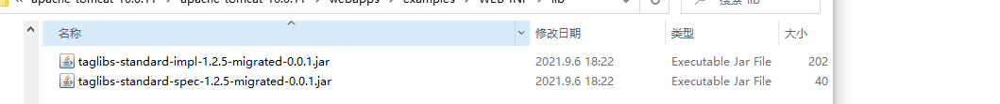

（2）在jsp中引入JSTL的core包依赖约束

```jsp
<%@ taglib prefix="c" uri="http://java.sun.com/jsp/jstl/core" %>
```

#### 3、重要标签的使用

##### （1） <c:set>

在JSP文件上设置域对象中的共享数据

```jsp
<%@ page contentType="text/html;charset=UTF-8" language="java" %>
<%@ taglib uri="http://java.sun.com/jsp/jstl/core" prefix="c"%>
<html>
<head>
    <title>  c:set  </title>
</head>
    <body>
        <!--
        相当于
        <%--  <%   --%>
        <%--   request.setAttribute("name","zhangsan");--%>
        <%--  %>  --%>
        -->
        <c:set scope="request" var="name" value="zhangsan" />
        通过JSTL标签添加的作用域中的值：${requestScope.name}   <br>
        <c:set scope="application" var="name" value="lisi" />
        通过JSTL标签添加的作用域中的值：${applicationScope.name}   <br>
        <c:set scope="request" var="name" value="wangwu" />
        通过JSTL标签添加的作用域中的值：${requestScope.name}   <br>
        <c:set scope="page" var="name" value="zhaoliu" />
        通过JSTL标签添加的作用域中的值：${pageScope.name}   <br>
    </body>
</html>
```

##### （2）<c:if >

控制哪些内容能够输出到响应体

```jsp
<%@ page contentType="text/html;charset=UTF-8" language="java" %>
<%@ taglib uri="http://java.sun.com/jsp/jstl/core" prefix="c" %>
<html>
<head>
    <title> c:if </title>
</head>
<body>
    <c:set scope="page" var="age" value="20"/>
    <br>------------------------------使用java语言-------------------------------------<br>
    <%
        if( Integer.parseInt((String)pageContext.getAttribute("age")) >= 18 ){
    %>
    输入：欢迎光临！
    <%  } else { %>
    输入：未满十八，不准入内！
    <%  }  %>
    <br>------------------------------使用JSTL标签-------------------------------------<br>

    <c:if test="${ age ge 18 }">
        输入：欢迎光临！
    </c:if>
    <c:if test="${ age lt 18 }">
        输入：未满十八，不准入内！
    </c:if>
</body>
</html>
```

##### （3）<c:choose>

在jsp中进行多分支判断，决定哪个内容写入响应体

```jsp
<%@ page contentType="text/html;charset=UTF-8" language="java" %>
<%@ taglib uri="http://java.sun.com/jsp/jstl/core" prefix="c" %>
<html>
<head>
    <title> c:choose </title>
</head>
<body>
    <c:set scope="page" var="age" value="6"/>
    <br>------------------------------使用java语言-------------------------------------<br>
    <%
        if( Integer.parseInt((String)pageContext.getAttribute("age")) == 18 ){
    %>
    输入：您今年成年了
    <%  } else if( Integer.parseInt((String)pageContext.getAttribute("age")) > 18 ){ %>
    输入：您已经成年了
    <%  }  else {%>
    输出：您还是个孩子
    <% } %>
    <br>------------------------------使用JSTL标签-------------------------------------<br>

    <c:choose>
        <c:when test="${age eq 18}">
            输入：您今年成年了
        </c:when>
        <c:when test="${age gt 18}">
            输入：您已经成年了
        </c:when>
        <c:otherwise>
            输入：您还是个孩子
        </c:otherwise>
    </c:choose>
</body>
</html>
```

##### （4）<c:forEach>

循环遍历

使用方式

```jsp
<c:forEach var="申明循环变量的名称" begin="初始化循环变量" 
           end="循环变量可以接受的最大值" step="循环变量的递增或递减值">
    *** step属性可以不写，默认递增1
    *** 循环变量默认保存在pageContext中
</c:forEach>
```

例子

```jsp
<%@ page import="com.zn.Student" %>
<%@ page import="java.util.List" %>
<%@ page import="java.util.ArrayList" %>
<%@ page import="java.util.Map" %>
<%@ page import="java.util.HashMap" %>
<%@ page contentType="text/html;charset=UTF-8" language="java" %>
<%@ taglib uri="http://java.sun.com/jsp/jstl/core" prefix="c" %>
<html>
<head>
    <title> c:forEach </title>
</head>
<body>
    <%
        pageContext.setAttribute("students",new ArrayList(){{
            add(new Student("s1","zhangsan",16));
            add(new Student("s2","lisi",19));
            add(new Student("s3","wangwu",15));
        }});
        pageContext.setAttribute("stuMap", new HashMap(){{
            put("m1",new Student("s1","zhangsan",16));
            put("m2",new Student("s2","lisi",18));
            put("m3",new Student("s3","wangwu",15));
        }});
    %>
    <br>------------------------使用java语言------------------------------<br>
    <table>
        <tr><td>学号</td><td>姓名</td><td>年龄</td></tr>
        <%
            List<Student> stus =            (ArrayList<Student>)pageContext.getAttribute("students");
            for (int i = 0; i < stus.size(); i++) {
        %>
          <tr><td><%=stus.get(i).getSid()%></td>
              <td><%=stus.get(i).getName()%></td>
              <td><%=stus.get(i).getAge()%></td>
          </tr>
        <% } %>
    </table>
    
    <br>----------------------使用JSTL标签读取list-----------------------<br>
    <table>
        <tr><td>学号</td><td>姓名</td><td>年龄</td></tr>
        <c:forEach var="student" items="${students}">
        <tr><td>${student.sid}</td>
            <td>${student.name}</td>
            <td>${student.age}</td>
        </tr>
        </c:forEach>
    </table>

    <br>---------------------使用JSTL标签读取map------------------------<br>
    <table>
        <tr><td>学号</td><td>姓名</td><td>年龄</td></tr>
        <c:forEach var="student" items="${stuMap}">
            <tr>
                <td>${student.key}</td>
                <td>${student.value.sid}</td>
                <td>${student.value.name}</td>
                <td>${student.value.age}</td>
            </tr>
        </c:forEach>
    </table>

    <br>--------------使用JSTL标签读取指定for循环-----------------------<br>
    <select>
      <c:forEach var="item" begin="1" end="10" step="1">
          <option> ${item} </option>
      </c:forEach>
    </select>

</body>
</html>
```

其中使用的java对象：

```java
public class Student {
    
    private String sid;
    private String name;
    private int age;

    public String getSid() {
        return sid;
    }

    public void setSid(String sid) {
        this.sid = sid;
    }

    public String getName() {
        return name;
    }

    public void setName(String name) {
        this.name = name;
    }

    public int getAge() {
        return age;
    }

    public void setAge(int age) {
        this.age = age;
    }

    public Student(String sid, String name, int age) {
        this.sid = sid;
        this.name = name;
        this.age = age;
    }
}
```

### 三、路径问题

在我们表示一个资源的位置的时候通常有两种方式，一个是绝对路径，一个是相对路径，我们学习html的时候已经学习过，今天重新回顾一下。

1. 绝对路径：从根目录为起点到某一个目录的路径； /C://aa/bb/a.txt
2. 相对路径：从一个目录为起点到另外一个的目录的路径。 ./b.txt b.txt

 同样我们获取一个网络资源的时候，一样可以使用这两种方式，使用绝对路径也就是url，我们就不必重新说了，但是使用相对路径的时候，我们需要掌握以下两个知识点。

1. 站点的根目录：浏览器而言，它的根目录就是站点根目录，可能是你磁盘上的任意一个文件夹，此时一个urlhttp://localhost:9999/可以映射到这个文件夹，这就代表了一个站点的根目录。
2. 项目的根目录：对于咱们的工程而言，服务端的根目录是项目根目录，其实在tomcat中，一个app就是一个独立的文件夹，相对于站点根目录，项目的根目录多了一个app的名字： <http://localhost:9999/study01/。>

`/`一般是指代某种情况下的根路径，在前端使用就指代站点根路径，在服务器中就是项目跟根路径。

所以一般情况下，

- 绝对路径是以/开头或者使用整体的url。
- 【重要】如果是在浏览器中访问就是站点根目录，如果是在java项目代码中使用就指项目根目录。
- 相对路径使用`./`或者`../`或者文件名开头，其中`./`代表当前文件夹，`../`代表上级文件夹。

以下几个场景中我们使用绝对路径需要注意：

1、在服务端进行请求转发，因为转发的过程在服务端进行，所以不需要加contextPath。

```text
req.getRequestDispatcher("/WEB-INF/pages/error.jsp").forward(req,resp);
```

2、在服务端进行重定向，大家要明白一点，重定向其实是在浏览器中具体执行的，所以必须加contextPath。

```text
response.sendRedirect(request.getContextPath() + "/login.jsp");
```

3、在浏览器端访问一个新的地址。

```html
<a href="/first_web/pages/index.jsp">前往主页</a>
```

4、在浏览器中访问静态资源

```html
<script src="/first_web/static/js/index.js"></script>
```

以下是我们通常的处理方案：

1、在jsp中定义好我们的basePath，这个路径是带有contextPath的。

2、在Head中指定， `<base href="<%=basePath%>">`。

3、在具体的地址处使用相对于contextPath的路径。

```jsp
<%@ page language="java" import="java.util.*" pageEncoding="UTF-8"%>
<%
   String path = request.getContextPath();
   String basePath = request.getScheme()+"://"+request.getServerName()+":"+request.getServerPort()+path+"/";
%>
<html>
<head>
   <title>image调用</title>
   <meta http-equiv="Content-Type" content="text/html; charset=UTF-8">   
   <base href="<%=basePath%>"> 
</head>
<body>
   <h1>图片访问</h1>
   <div>   
     
   </div>
</body>
</html>
```

以上结构中的图片真实的访问路径是： <http://localhost:8080/first_web/image/a.png>

### 四、错误页面和404页面

我们可以在web.xml中根据错误码和异常类型，配置不同异常情况下的错误页面。

```jsp
<error-page>
    <error-code>404</error-code>
    <location>/pages/404.jsp</location>
</error-page>

<error-page>
    <exception-type>java.lang.Exception</exception-type>
    <location>/pages/err.jsp</location>
</error-page>
```

## 第七章 Listener、Filter

### 一、观察者设计模式

**观察者模式（Observer）**，又叫**发布-订阅模式（Publish/Subscribe）**，定义对象间一种一对多的依赖关系，使得每当一个对象改变状态，则所有依赖于它的对象都会得到通知并自动更新。

#### 1、基本概念

- servlet是一种运行服务器端的java应用程序，它可以用来处理请求和响应。这是我们tomcat容器最重要的组成部分。
- filter称之为过滤器，不像Servlet，它不处理具体的业务逻辑，它是一个中间者，它能够按照具体的规则拦截我们的请求和响应，并执行响应的操作。
- listener叫监听器，它用来监听容器内的一些变化，如session的创建，销毁，servlet容器的创建销毁等。当这些内容变化产生时，监听器就要完成一些工作。这是观察者设计模式的典型使用场景。

#### 2、生命周期

**（1）servlet：**servlet的生命周期始于它被装入web服务器的内存时，并在web服务器终止或重新装入servlet时结束。servlet一旦被装入web服务器，一般不会从web服务器内存中删除，直至web服务器关闭或重新结束。

1. 装入：第一次访问，启动服务器时加载Servlet的实例；
2. 初始化：web服务器启动时或web服务器接收到请求时，或者两者之间的某个时刻启动。初始化工作有init（）方法负责执行完成；
3. 调用：从第一次到以后的多次访问，都是只调用doGet()或doPost()方法；
4. 销毁：停止服务器时调用destroy()方法，销毁实例。

**（2）filter：**一定要实现javax.servlet包的Filter接口的三个方法init()、doFilter()、destroy()，空实现也行

1. 启动服务器时加载过滤器的实例，并调用init()方法来初始化实例；
2. 每一次请求时都只调用方法doFilter()进行处理；
3. 停止服务器时调用destroy()方法，销毁实例。

**（3）listener：**类似于servlet和filter

servlet2.4规范中提供了8个listener接口，可以将其分为三类，分别如下：

- 第一类：与servletContext有关的listner接口。包括：ServletContextListener、ServletContextAttributeListener
- 第二类：与HttpSession有关的Listner接口。包括：HttpSessionListner、HttpSessionAttributeListener、HttpSessionBindingListener、 HttpSessionActivationListener；
- 第三类：与ServletRequest有关的Listener接口，包括：ServletRequestListner、ServletRequestAttributeListener

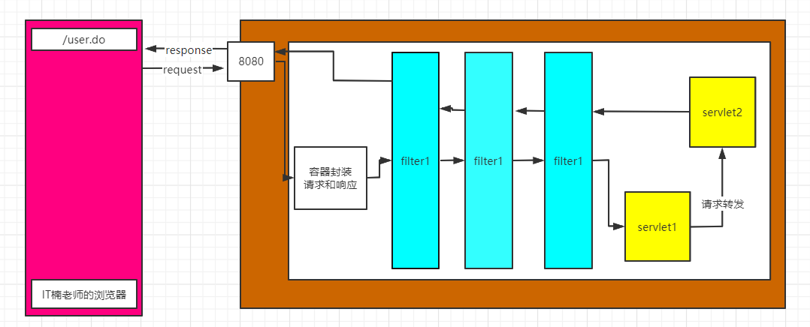

web.xml 的加载顺序是：context- param -> listener -> filter -> servlet

#### 3、使用方式

> listener：

这是一个统计在线人数的listener

```java
public class OnlineCountListener implements HttpSessionListener {

    // session被创建时调用
    @Override
    public void sessionCreated(HttpSessionEvent se) {
        System.out.println("一个session被创建");
        ServletContext application = se.getSession().getServletContext();
        Object visitCount = application.getAttribute("onlineCount");
        if(visitCount == null){
            application.setAttribute("onlineCount",1);
        } else {
            if(visitCount instanceof Integer){
                Integer count = (Integer) visitCount;
                application.setAttribute("onlineCount",count+1);
            } else {
                throw new RuntimeException("您的数据有误！");
            }
        }
    }

    @Override
    public void sessionDestroyed(HttpSessionEvent se) {
        System.out.println("一个session被销毁了");
        ServletContext application = se.getSession().getServletContext();
        Object visitCount = application.getAttribute("onlineCount");
        if(visitCount instanceof Integer){
            Integer count = (Integer) visitCount;
            application.setAttribute("onlineCount",Math.max(count - 1,0));
        } else {
            throw new RuntimeException("您的数据有误！");
        }
    }
}
```

这是一个统计访问次数的listener

```java
public class VisitCountListener implements ServletRequestListener {
    @Override
    public void requestInitialized(ServletRequestEvent sre) {
        ServletContext application = sre.getServletContext();
        Object visitCount = application.getAttribute("visitCount");
        if(visitCount == null){
            application.setAttribute("visitCount",1);
        } else {
            if(visitCount instanceof Integer){
                Integer count = (Integer) visitCount;
                application.setAttribute("visitCount",count+1);
            } else {
                throw new RuntimeException("您的数据有误！");
            }
        }
    }
}
```

配置项

```xml
<listener>
    <listener-class>com.ydlclass.VisitCountListener</listener-class>
    <listener-class>com.ydlclass.OnlineCountListener</listener-class>
</listener>
```

> Filter：

这是一个判断用户登录的过滤器：

```java
public class LoginFilter extends HttpFilter {
    @Override
    protected void doFilter(HttpServletRequest request, HttpServletResponse response, FilterChain chain) throws IOException, ServletException {

        //创建白名单
        List<String> witheNames = Arrays.asList(request.getContextPath() + "/login", request.getContextPath() + "/login.jsp");
        // 如果在白名单我就放行
        if (witheNames.contains(request.getRequestURI())) {
            chain.doFilter(request, response);
        } else {
            HttpSession session = request.getSession(false);
            // 有用户信息说明已经登录
            if (session != null && session.getAttribute("user") != null) {
                chain.doFilter(request, response);
            } else {
                response.sendRedirect(request.getContextPath() + "/login.jsp");
            }
        }
    }
} 
```

配置项：

```xml
<filter>
    <filter-name>LoginFilter</filter-name>
    <filter-class>com.ydlclass.LoginFilter</filter-class>
</filter>
<filter-mapping>
    <filter-name>LoginFilter</filter-name>
    <url-pattern>/*</url-pattern>
</filter-mapping>
```

注：Servlet我们不再多做解释。

## 第八章 编程式配置

### 一、servlet、filter、listener的配置

 xml是我们最常见的配置，tomcat在启动时会加载web.xml配置文件，根据配置文件的内容，初始化我们的servlet容器。加载我们的listener、filter、servlet组件等，很明显这是通过反射实例化这些对象。

 编程式的配置是将以往在配置文件中进行的配置以编程的方式在代码中直接配置，配置的方式以注解为主，tomcat在启动时会遍历class文件，收集相关的配置信息，加载组件，实例化组件。即使是编程式的配置，web.xml也不能删除，还有一些配置要在web.xml中进行配置的。

如果我们想使用注解进行配置，需要修改一个配置：

```xml
<web-app xmlns="https://jakarta.ee/xml/ns/jakartaee"
         xmlns:xsi="http://www.w3.org/2001/XMLSchema-instance"
         xsi:schemaLocation="https://jakarta.ee/xml/ns/jakartaee
                      https://jakarta.ee/xml/ns/jakartaee/web-app_5_0.xsd"
         version="5.0"
         metadata-complete="false">
</web-app>
```

 metadata-complete属性必须设置为false，不写这个属性默认就是false，如果是true，注解不生效。这个属性的含义是，我的配置元数据在这个xml中全不全，如果全了我就不扫描相关的类文件了。

定义Servlet

```java
@WebServlet(name = "myServlet",value = "/my", loadOnStartup = 1,
        initParams = {@WebInitParam(name = "name", value = "zhangsan"),
                @WebInitParam(name = "age", value = "13")
        }
)
public class MyServlet extends HttpServlet {
}
```

定义Filter

```java
@WebFilter("/*")
public class MyFilter extends HttpFilter {
    @Override
    protected void doFilter(HttpServletRequest request, HttpServletResponse response, FilterChain chain) throws IOException, ServletException {
        System.out.println("经过了过滤器");
        chain.doFilter(request,response);
    }
}
```

定义listener

```java
@WebListener
public class MySessionListener implements HttpSessionListener {
}
```

### 二、Resource

#### 1、JNDI入门

 JNDI（Java Naming and Directory Interface，Java 命名和目录接口）是一组在Java应用中访问命名服务和目录服务的API。其中，JavaEE要求Web容器（如：tomcat）必须实现JNDI规范。

 怎么理解这一项技术呢？我们可以给每个资源起一个名字，并且构建一成个目录结构，就好比linux系统当中的目录结构一样，这样我们就可以像访问文件这样`/usr/local/config/web.xml`，去访问一个资源，这个资源可以是任意我们可以用java定义的资源，比如我们的数据源。

 资源引用和资源定义的默认 JNDI 命名空间必须始终是*java:comp/env*，这就好比一个默认的文件夹。

 看这个图，我们怎么表示一个mysql的数据源呢？


`java:comp/env/dataSource/mysql` 这样是不是就行呢？

#### 2、JNDI应用：配置数据源

##### （1）在tomcat中新增命名服务

第一步：向tomcat安装目录下的lib中添加JDBC驱动程序

第二步：修改tomcat中config目录下的context.xml

```xml
<Context>

    <!-- Default set of monitored resources. If one of these changes, the    -->
    <!-- web application will be reloaded.                                   -->
    <WatchedResource>WEB-INF/web.xml</WatchedResource>
    <WatchedResource>WEB-INF/tomcat-web.xml</WatchedResource>
    <WatchedResource>${catalina.base}/conf/web.xml</WatchedResource>

    <!-- Uncomment this to enable session persistence across Tomcat restarts -->
    <!--
    <Manager pathname="SESSIONS.ser" />
	
    -->
 <Resource name="dataSource/mysql/prod"
              auth="Container"
              type="javax.sql.DataSource"
              driverClassName="com.mysql.cj.jdbc.Driver"
              url="jdbc:mysql://127.0.0.1:3306/ydlclass?characterEncoding=utf8&amp;serverTimezone=Asia/Shanghai"
              username="root" password="root"
              maxTotal="20" maxIdle="10"
              maxWaitMillis="10000" />

    <Resource name="dataSource/mysql/test"
              auth="Container"
              type="javax.sql.DataSource"
              driverClassName="com.mysql.cj.jdbc.Driver"
              url="jdbc:mysql://127.0.0.1:3306/boke?characterEncoding=utf8&amp;serverTimezone=Asia/Shanghai"
              username="root" password="root"
              maxTotal="20" maxIdle="10"
              maxWaitMillis="10000" />
</Context>
```

第三步，在代码中访问

```java
Context ctx = null;
try {
    ctx = new InitialContext();
    DataSource dataSource = (DataSource)ctx.lookup("java:comp/env/dataSource/mysql");
    System.out.println(dataSource);
} catch (Exception e) {
    e.printStackTrace();
}
```

##### （2）在当前工程下新增命名服务

第一步：向WEB-INF/lib目录下添加mysql驱动程序

第二步：在与WEB-INf同级的目录下新建META-INF/context.xml并配置

```xml
<?xml version="1.0" encoding="UTF-8"?>
<Context>
    <Resource name="dataSource/mysql/prod"
              auth="Container"
              type="javax.sql.DataSource"
              driverClassName="com.mysql.cj.jdbc.Driver"
              url="jdbc:mysql://127.0.0.1:3306/ydlclass?characterEncoding=utf8&amp;serverTimezone=Asia/Shanghai"
              username="root" password="root"
              maxTotal="20" maxIdle="10"
              maxWaitMillis="10000" />

    <Resource name="dataSource/mysql/test"
              auth="Container"
              type="javax.sql.DataSource"
              driverClassName="com.mysql.cj.jdbc.Driver"
              url="jdbc:mysql://127.0.0.1:3306/boke?characterEncoding=utf8&amp;serverTimezone=Asia/Shanghai"
              username="root" password="root"
              maxTotal="20" maxIdle="10"
              maxWaitMillis="10000" />

</Context>
```

##### （3）基础数据类型

```xml
<env-entry>
    <env-entry-name>baseUrl</env-entry-name>
    <env-entry-type>java.lang.String</env-entry-type>
    <env-entry-value>D://www/</env-entry-value>
</env-entry>
Context ctx = null;
try {
    ctx = new InitialContext();
    DataSource dataSource = (DataSource)ctx.lookup("java:comp/env/baseUrl");
    System.out.println(dataSource);
} catch (Exception e) {
    e.printStackTrace();
}
```

#### 3、使用JNDI好处

 以JNDI配置数据源为例，当数据源变更（如：更换数据库类型，更改用户名或密码，更改连接的URL等），只需要web服务器管理员去修改JNDI数据源的配置文件即可，不需要开发人员去修改程序代码，从一定程度上达到了程序解耦的目的。同时，不仅是数据源如此，对于程序使用其他外部资源的情况，也可以使用JNDI配置.

#### 4、@Resource

 使用@resource注解也可以类似将定义的JNDI资源，注入到变量当中，方法中就可以直接使用了，但是要注意，目前这能在Servlet中使用。

```java
@WebServlet("/")
public class MyServlet extends HttpServlet {

    @Resource(lookup="java:comp/env/baseUrl")
    DataSource dataSource;

    @Override
    protected void doGet(HttpServletRequest req, HttpServletResponse resp) throws ServletException, IOException {
        System.out.println(dataSource);
    }
}
```

### 三、postConstruct、preDestory

这两个注解提供了，servlet三个生命周期之外的两个回调函数。

```java
@WebServlet("/")
public class MyServlet extends HttpServlet {

    public MyServlet() {
        System.out.println("MyServlet------------");
    }

    @PostConstruct
    public void f1(){
        System.out.println("PostConstruct---------");
    }

    @PreDestroy
    public void f2(){
        System.out.println("PreDestroy---------");
    }

    @Override
    public void destroy() {
        System.out.println("destroy---------");
    }

    @Override
    public void init() throws ServletException {
        System.out.println("init---------");
    }

    @Override
    protected void doGet(HttpServletRequest req, HttpServletResponse resp) throws ServletException, IOException {
        System.out.println("doGet---------");
    }
}
```

执行顺序如下：

```text
[2021-10-09 10:10:23,235] Artifact javaweb9: Deploy took 515 milliseconds
MyServlet------------
PostConstruct---------
init---------
.....
destroy---------
PreDestroy---------
Disconnected from server
```

## 第九章 实战案例

 本章节的最后，我们写一个小程序回顾总结一下我们的知识：我们写一个用户管理模块实现对用户的增删改查。

大概实现以下功能即可：

1、登录注册，验证码、动态判断用户是否存在；

2、用户的增删改查，多表的联查。

在这个阶段一定要多多练习增删查改，这是我们的基本功，大型的项目我们放在以后的框架学习当中。

### 一、MVC架构

#### 1、简介

 MVC 模式（Model–view–controller）是软件工程中的一种**软件架构模式**，它把软件系统分为三个基本部分：**模型（Model）**、**视图（View）\**和\**控制器（Controller）**。

 MVC 模式的目的是实现一种动态的程序设计，简化后续对程序的修改和扩展，并且使程序某一部分的重复利用成为可能。除此之外，MVC 模式通过对复杂度的简化，使程序的结构更加直观。软件系统在分离了自身的基本部分的同时，也赋予了各个基本部分应有的功能。专业人员可以通过自身的专长进行相关的分组：

（1）控制器的作用是调用模型，将模型产生的数据传递给视图。并让相关视图去显示，即使我们的servlet部分。

（2）模型的作用是获取数据并处理数据。这就是业务数据和业务逻辑。

（3）视图的作用是将取得的数据进行组织、美化等，并最终向用户终端输出，就是我们的jsp部分。

在浏览器完整的展示一个页面需要视图模板和数据，视图层特通视图模板，模型层提供业务数据，而控制层负责协调两者。

#### 2、MVC模式的优点

1、低耦合

 通过将视图层和业务层分离，允许更改视图层代码而不必重新编译模型和控制器代码，同样，一个应用的业务流程或者业务规则的改变，只需要改动MVC的模型层（及控制器）即可。因为模型与控制器和视图相分离，所以很容易改变应用程序的数据层和业务规则。

2、重用性高

 随着技术的不断进步，当前需要使用越来越多的方式来访问应用程序了。MVC模式允许使用各种不同样式的视图来访问同一个服务端的代码，这得益于多个视图（如WEB（HTTP）浏览器或者无线浏览器（WAP））能共享一个模型。

 比如，用户可以通过电脑或通过手机来订购某样产品，虽然订购的方式不一样，但处理订购产品的方式（流程）是一样的。由于模型返回的数据没有进行格式化，所以同样的构件能被不同的界面（视图）使用。例如，很多数据可能用 HTML 来表示，但是也有可能用 WAP 来表示，而这些表示的变化所需要的是仅仅是改变视图层的实现方式，而控制层和模型层无需做任何改变。

 由于已经将数据和业务规则从表示层分开，所以可以最大化的进行代码重用了。另外，模型层也有状态管理和数据持久性处理的功能，所以，基于会话的购物车和电子商务过程，也能被Flash网站或者无线联网的应用程序所重用。

3、可维护性高

 分离视图层和业务逻辑层使得WEB应用更易于维护和修改。

4、有利软件工程化管理

 由于不同的组件（层）各司其职，每一层不同的应用会具有某些相同的特征，这样就有利于通过工程化、工具化的方式管理程序代码。控制器同时还提供了一个好处，就是可以使用控制器来联接不同的模型和视图，来实现用户的需求，这样控制器可以为构造应用程序提供强有力的手段。给定一些**可重用的**模型和视图，控制器可以根据用户的需求选择模型进行处理，然后选择视图将处理结果显示给用户。

### 二、代码重点

#### 1、编写基础代码

 代码量有一点大我们就不写了。但是在此过程中我们需要实现一个功能，就是当鼠标离开用户名的输入框时显示这个用户名能不能被注册，这是怎么实现的。


要实现这个功能必须保证两点：

1、页面不能刷新，页面一旦刷新，所有的内容都会重置；

2、blur事件一发生，主动去数据库查询有没有这个用户。

如果以上的效果不需要查询数据库其实很好实现，添加blur事件，修改dom即可。我们要学习的其实是怎么在事件的回掉函数中发送http请求而已，其实http请求只是个报文而已，java、js、postman，浏览器都是可以发送的。而在js中我们用的就是ajax这项技术。

#### 2、ajax

想一想有哪些功能我们无法实现:

- 无法在实现用户登录功能时，当用户输入邮箱地址显示用户对应的头像
- 无法在实现用户注册功能时，当用户输入邮箱或者用户名就提示是否存在
- 无法在实现留言板功能时，实时看到最新的用户留言
- 无法点击验证码实现更新

> 思考：为什么做不到这些呢？

在此之前，我们可以通过以下几种方式让浏览器发出对服务端的请求，获得服务端的数据：

- 地址栏输入地址，回车，刷新
- 特定元素的 href 或 src 属性
- 表单提交

这些方案都是我们无法通过或者很难通过代码的方式进行编程（对服务端发出请求并且接受服务端返回的响应），如果我们可以通过 JavaScript 直接发送网络请求，动态的去更新页面，那么 Web 的可能就会更多，随之能够实现的功能也会更多。

**AJAX (Asynchronous Javascript And XML)就是浏览器提供的一套 API，可以通过 JavaScript 调用，从而实现通过代码控制请求与响应。实现通过 JavaScript 进行网络编程。**

至于 **XML**：最早在客户端与服务端之间传递数据时所采用的数据格式就是 XML，现在已经不是了，我们用java。

##### （1）快速上手

AJAX API 中核心提供的是一个 `XMLHttpRequest` 类型，所有的 AJAX 操作都需要使用到这个类型。

使用 AJAX 的过程可以类比平常我们访问网页过程

```javascript
// 1. 创建一个 XMLHttpRequest 类型的对象 —— 相当于打开了一个浏览器
var xhr = new XMLHttpRequest()
// 2. 打开与一个网址之间的连接 —— 相当于在地址栏输入访问地址
xhr.open('GET', '/time')
// 3. 通过连接发送一次请求 —— 相当于回车或者点击访问发送请求
xhr.send(null)
// 4. 指定 xhr 状态变化事件处理函数 —— 相当于处理网页呈现后的操作
xhr.onreadystatechange = function () {
  // 通过 xhr 的 readyState 判断此次请求的响应是否接收完成
  if (this.readyState === 4) {
    // 通过 xhr 的 responseText 获取到响应的响应体
    console.log(this.responseText)
  }
}
```

> 注意：涉及到 AJAX 操作的页面不能使用文件协议访问（文件的方式访问）

由于 readystatechange事件（readyState）是在 `xhr` 对象状态变化时触发（不单是在得到响应时），也就意味着这个事件会被触发多次，所以我们有必要了解每一个状态值代表的含义：

| readyState | 状态描述         | 说明                                                      |
| ---------- | ---------------- | --------------------------------------------------------- |
| 0          | UNSENT           | 代理（XHR）被创建，但尚未调用 `open()` 方法。             |
| 1          | OPENED           | `open()` 方法已经被调用，建立了连接。                     |
| 2          | HEADERS_RECEIVED | `send()` 方法已经被调用，并且已经可以获取状态行和响应头。 |
| 3          | LOADING          | 响应体下载中， `responseText` 属性可能已经包含部分数据。  |
| 4          | DONE             | 响应体下载完成，可以直接使用 `responseText`。             |

> 时间轴

初始化建立连接接收到响应头响应体加载中加载完成

```javascript
var xhr = new XMLHttpRequest()
console.log(xhr.readyState)
// => 0
// 初始化 请求代理对象

xhr.open('GET', '/time')
console.log(xhr.readyState)
// => 1
// open 方法已经调用，建立一个与服务端特定端口的连接

xhr.send()

xhr.addEventListener('readystatechange', function () {
  switch (this.readyState) {
    case 2:
      // => 2
      // 已经接受到了响应报文的响应头

      // 可以拿到头
      // console.log(this.getAllResponseHeaders())
      console.log(this.getResponseHeader('server'))
      // 但是还没有拿到体
      console.log(this.responseText)
      break

    case 3:
      // => 3
      // 正在下载响应报文的响应体，有可能响应体为空，也有可能不完整

      // 在这里处理响应体不保险（不可靠）
      console.log(this.responseText)
      break

    case 4:
      // => 4
      // 一切 OK （整个响应报文已经完整下载下来了）

      // 这里处理响应体
      console.log(this.responseText)
      break
  }
})
```

通过理解每一个状态值的含义得出一个结论：一般我们都是在 `readyState` 值为 `4` 时，执行响应的后续逻辑。

```javascript
xhr.onreadystatechange = function () {
  if (this.readyState === 4) {
    // 后续逻辑......
  }
}
```

##### （2）具体用法

GET 请求

> 通常在一次 GET 请求过程中，参数传递都是通过 URL 地址中的 `?` 参数传递。

```javascript
var xhr = new XMLHttpRequest()
// GET 请求传递参数通常使用的是问号传参
// 这里可以在请求地址后面加上参数，从而传递数据到服务端
xhr.open('GET', '/delete?id=1')
// 一般在 GET 请求时无需设置响应体，可以传 null 或者干脆不传
xhr.send(null)
xhr.onreadystatechange = function () {
  if (this.readyState === 4) {
    console.log(this.responseText)
  }
}

// 一般情况下 URL 传递的都是参数性质的数据，而 POST 一般都是业务数据
```

> POST 请求过程中，都是采用请求体承载需要提交的数据。

```javascript
var xhr = new XMLHttpRequest()
// open 方法的第一个参数的作用就是设置请求的 method
xhr.open('POST', '/add')
// 设置请求头中的 Content-Type 为 application/x-www-form-urlencoded
// 标识此次请求的请求体格式为 urlencoded 以便于服务端接收数 据
xhr.setRequestHeader('Content-Type', 'application/x-www-form-urlencoded')
// 需要提交到服务端的数据可以通过 send 方法的参数传递
// 格式：name=zhangsan&age=18
xhr.send('name=zhangsan&age=18')
xhr.onreadystatechange = function () {
  if (this.readyState === 4) {
    console.log(this.responseText)
  }
}
```

##### （3）同步与异步

关于同步与异步的概念在生活中有很多常见的场景，举例说明。

> - 同步：一个人在同一个时刻只能做一件事情，在执行一些耗时的操作（不需要看管）不去做别的事，只是等待
> - 异步：在执行一些耗时的操作（不需要看管）去做别的事，而不是等待

`xhr.open()` 方法第三个参数要求传入的是一个 `bool` 值，其作用就是设置此次请求是否采用异步方式执行，默认为 `true`，如果需要同步执行可以通过传递 `false` 实现：

```javascript
console.log('before ajax')
var xhr = new XMLHttpRequest()
// 默认第三个参数为 true 意味着采用异步方式执行
xhr.open('GET', '/time', true)
xhr.send(null)
xhr.onreadystatechange = function () {
  if (this.readyState === 4) {
    // 这里的代码最后执行
    console.log('request done')
  }
}
console.log('after ajax')
```

如果采用同步方式执行，则代码会卡死在 `xhr.send()` 这一步：

```javascript
console.log('before ajax')
var xhr = new XMLHttpRequest()
// 同步方式
xhr.open('GET', '/time', false)
// // 同步方式 执行需要 先注册事件再调用 send，否则 readystatechange 无法触发
// xhr.onreadystatechange = function () {
//   if (this.readyState === 4) {
//     // 这里的代码最后执行
//     console.log('request done')
//   }
// }
xhr.send(null)
// 因为 send 方法执行完成 响应已经下载完成
console.log(xhr.responseText)
console.log('after ajax')
```

演示同步异步差异。

> 了解同步模式即可，切记不要使用同步模式。

至此，我们已经大致了解了 AJAX 所提供的基本 API 。

##### （4）这玩意复杂怎么简化

```javascript
function ajax(method, url, data, fun) {
    var xhr = new XMLHttpRequest()
    xhr.open(method, url)
    xhr.setRequestHeader("Content-Type", "application/x-www-form-urlencoded;charset=utf-8")
    xhr.send(data)

    xhr.addEventListener('readystatechange', function () {
        if (this.readyState === 4) {
            // 回调函数传入详情内容
            fun(this.responseText);
        }
    })
}
```

#### 3、使用ajax

##### （1）动态查看用户是否存在

怎么使用ajax呢？本次我们使用自己封装的ajax方法：

```java
let usernameInput = document.getElementById("username");
usernameInput.addEventListener("blur",function (){
    // 当发生了blur事件，就发送http请求
    ajax("POST","user/checkUserName","username=" + usernameInput.value,function (data){
        // 当后天给出响应yes就显示用户名存在
        if(data === "yes"){
            document.getElementById("msg").innerText = "用户名已经存在！"
        } else {
            document.getElementById("msg").innerText = "用户名可以使用！"
        }
    });
})
```

具体的查询的代码如下：

```java
@WebServlet("/user/checkUserName")
public class CheckUserNameServlet extends HttpServlet {

    UserService userService = new UserService();

    @Override
    protected void doPost(HttpServletRequest req, HttpServletResponse resp) throws ServletException, IOException {
        String username = req.getParameter("username");
        Boolean flag = userService.CheckUserName(username);
        PrintWriter writer = resp.getWriter();
        if (flag){
            writer.write("yes");
        } else {
            writer.write("no");
        }
    }
}
```

##### （2）验证码

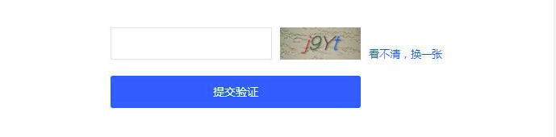

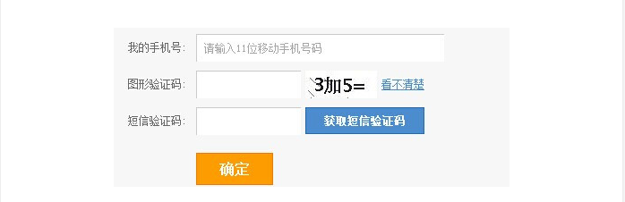


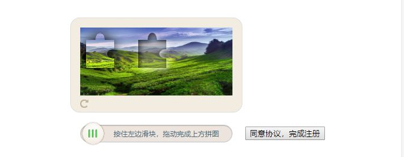

```java
/**
 * @author itnanls(微信)
 * 我们的服务： 一路陪跑，顺利就业
 */
@WebServlet("/user/verification")
public class IdentityServlet extends HttpServlet {

    private static final char[] chars={'0','1','2','3','4','5','6','7','8','9','A'};//自定义验证码池
    private final static Random random = new Random();

    //获取6位随机数，放在图片里
    private static String getRandomString(){
        StringBuilder buffer = new StringBuilder();
        for(int i = 0; i < 6; i++){
            buffer.append(chars[random.nextInt(chars.length)]);
        }
        return buffer.toString();
    }

    //获取随机的颜色
    private static Color getRandomColor(){
        return new Color(random.nextInt(255), random.nextInt(255), random.nextInt(255));
    }

    //返回某颜色的反色
    private static Color getReverseColor(Color c){
        return new Color(255 - c.getRed(), 255 - c.getGreen(), 255 - c.getBlue());
    }
    
    public void doGet(HttpServletRequest request, HttpServletResponse response)
            throws ServletException, IOException {

        //设置输出类型
        response.setContentType("image/jpeg");

        //随机字符串
        String verification = getRandomString();
        request.getSession(true).setAttribute("verification", verification);//放到session里

        //图片宽度
        int width = 100;
        //图片高度
        int height = 30;

        //随机颜色，用于背景色
        Color color = getRandomColor();
        //反色，用于前景色
        Color reverse = getReverseColor(color);
        //创建一个彩色图片
        BufferedImage bi = new BufferedImage(width, height, BufferedImage.TYPE_INT_RGB);
        //绘图对象
        Graphics2D g = bi.createGraphics();
        //设置字体
        g.setFont(new Font(Font.SANS_SERIF,Font.BOLD,16));
        //设置颜色
        g.setColor(color);
        //绘制背景
        g.fillRect(0, 0, width, height);
        g.setColor(reverse);
        //绘制随机字符
        g.drawString(verification, 18, 20);
        //画100个噪音点
        for(int i = 0; i < 50;i++){
            g.drawRect(random.nextInt(width), random.nextInt(height), 1, 1);
        }
        //转成JPEG格式
        ServletOutputStream out= response.getOutputStream();
        //编码器
        JPEGImageEncoder encoder= JPEGCodec.createJPEGEncoder(out);
        //对图片进行编码
        encoder.encode(bi);
        out.flush();
    }
}
```

在前端的显示我们这么处理：

```html
<div class="form-group">
    <label for="password">验证码：</label>
    <input type="password" class="form-control" id="verify" name="verify" placeholder="验证码">
    
</div>
```

除此之外我们还需要使用session进行配合：

```java
String verification = (String)session.getAttribute("verification");

resp.setHeader("Content-Type","text/plain;charset=utf-8");
if(!verification.equals(verify)){
    resp.getWriter().write("验证码错误");
    return;
}
```

#### 4、上传下载

上传的实质是从客户端的浏览器上传一个文件到服务器的磁盘上，下载反之，这个过程就是使用流来进行处理。

一个表单中一旦有了文件，就需要在form中新增 enctype="multipart/form-data" 属性。

```text
<form action="user/register" method="post" enctype="multipart/form-data">
```

此时，提交表单content-type就变成了， multipart/form-data：


而在servlet中也需要使用一个新的注解@MultipartConfig，具体代码如下：

```java
package com.ydlclass.controller;


@WebServlet("/upload")
@MultipartConfig
public class UploadServlet extends HttpServlet {

    @Override
    protected void doGet(HttpServletRequest req, HttpServletResponse resp) throws ServletException, IOException {
   
    }

    @Override
    protected void doPost(HttpServletRequest req, HttpServletResponse resp) throws ServletException, IOException {
        String name = req.getParameter("name");
        System.out.println(name);
        Part file = req.getPart("file");
        InputStream inputStream = file.getInputStream();
        if(inputStream != null) {
            String fileName = "E:\\test\\" + file.getSubmittedFileName();
            OutputStream outputStream = new FileOutputStream(fileName);
            long size = file.getSize();
            long currentSize = 0;
            int len;
            byte[] buf = new byte[1024];
            while ((len = inputStream.read(buf)) != -1) {
                outputStream.write(buf, 0, len);
                currentSize += len;
                int percent = (int) ((currentSize / (size + 0.0)) * 100);
                System.out.println(percent);
            }
            inputStream.close();
            outputStream.close();
        }
        resp.sendRedirect("/index.jsp");
    }
}
```

下载时需要几个首部信息配合使用：

```java
package com.ydlclass.controller;

import javax.servlet.ServletException;
import javax.servlet.ServletOutputStream;
import javax.servlet.annotation.WebServlet;
import javax.servlet.http.HttpServlet;
import javax.servlet.http.HttpServletRequest;
import javax.servlet.http.HttpServletResponse;
import java.io.FileInputStream;
import java.io.IOException;
import java.net.URLEncoder;


@WebServlet("/download")
public class DownLoadServlet extends HttpServlet {

    @Override
    protected void doGet(HttpServletRequest req, HttpServletResponse resp) throws ServletException, IOException {
        FileInputStream fileInputStream = new FileInputStream("E:\\test\\1.mp4");
        ServletOutputStream outputStream = resp.getOutputStream();
        // 支持中文名称文件,需要对header进行单独设置，不然下载的文件名会出现乱码或者无法显示的情况
        // String downloadFileName = new String(fileName .getBytes(), "ISO-8859-1");
        String downloadFileName = URLEncoder.encode("稻香","UTF-8");
        // 设置响应头，控制浏览器下载该文件
        resp.setHeader("Content-Disposition", "attachment;filename=" + downloadFileName);
        byte[] buffer = new byte[1024*5];
        int len;
        while ((len = fileInputStream.read(buffer)) != -1 ){
            outputStream.write(buffer,0,len);
        }
    }
}
```

#### 5、tomcat映射路径的配置方法

配置虚拟路径可以帮我们搭建一个简易的图片服务器，让我们上传的图片可以用url访问。

```html
<Context path="/xinzhi/image" docBase="D:\\img" debug="0" reloadbale="true"/>
```

path: Host的虚拟目录 docBase: 映射的物理目录的地址，可指定相对路径，相对appBase下，也可以指定绝对路径（例如：D:\Workes\testtomcat\WebRoot）。如果无此项则默认为appBase/ROOT 。

#### 6、分页

此处不赘述，可以看视频

### 三、项目打包

1、配置一个产品，我们的项目构建打包后就是一个产品

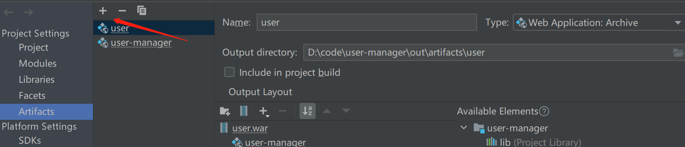

2、选择web application:archive，它会帮助我们制作一个war包。

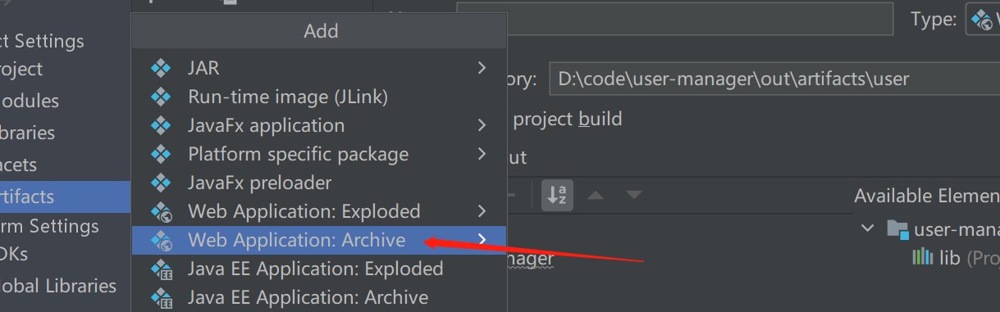

3、点击项目构建build

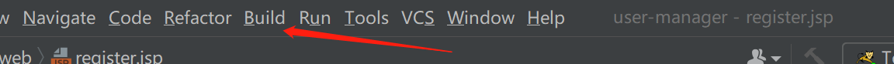

4、选择build artifact，点击build


5、最终的产品就会出现在out目录


6、将war包放在tomcat的webapp下启动即可。
