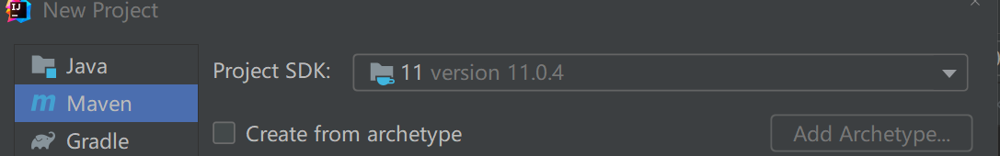
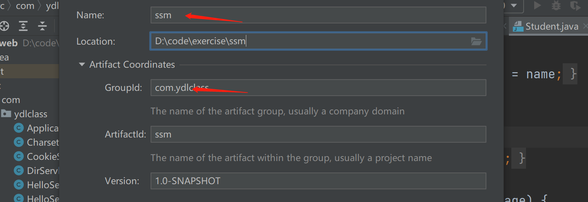
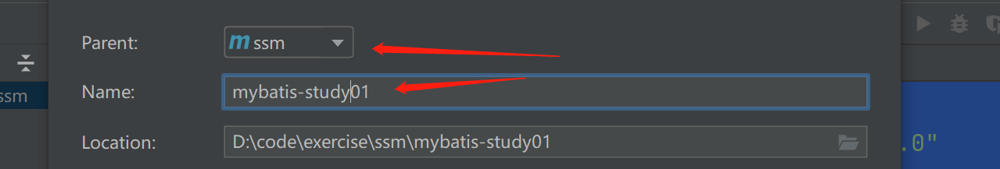
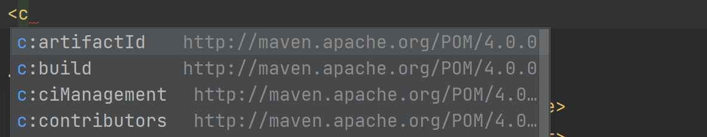
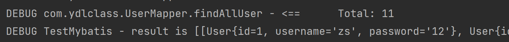
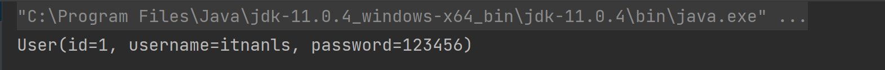
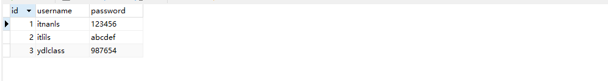
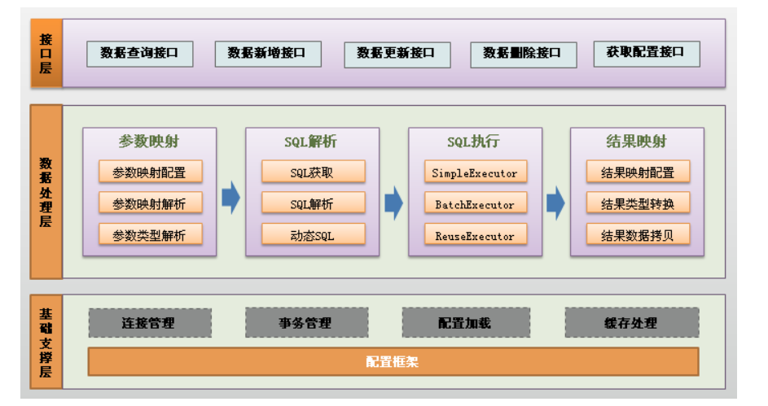

> [!TIP]
>
> 课程视频教程链接：<https://www.bilibili.com/video/BV11h411t7r2>

## 一、了解 MyBatis

### 1、历史（百度百科）

- MyBatis 本是 apache 的一个开源项目【iBatis】, 2010 年这个项目由 apache software foundation（Apache 软件基金会） 迁移到了 google code（谷歌的代码托管平台），并且改名为 MyBatis ，2013 年 11 月迁移到 Github。

### 2、作用 （百度百科）

- MyBatis 是一款优秀的持久层框架，它支持自定义 SQL、存储过程以及高级映射。MyBatis 免除了几乎所有的 JDBC 代码以及设置参数和获取结果集的工作。

### 3、说说持久化

持久化是将程序数据在持久状态和瞬时状态间转换的机制。通俗的讲，就是瞬时数据（比如内存中的数据，是不能永久保存的）持久化为持久数据（比如持久化至数据库中，能够长久保存）。

1. 程序产生的数据首先都是在内存。
2. 内存是不可靠的，一断电数据就没了。
3. 那可靠的存储地方是哪里？硬盘、U 盘、光盘等。
4. 我们的程序在运行时说的持久化通常就是指将内存的数据存在硬盘。

### 4、说说持久层

其实分层的概念已经谈到过：

- 业务是需要操作数据的
- 数据是在磁盘上的
- 具体业务调用具体的数据库操作，耦合度太高，复用性太差
- 将操作数据库的代码统一抽离出来，自然就形成了介于业务层和数据库中间的独立的层

### 5、聊聊 ORM

ORM，即 Object-Relational Mapping（对象关系映射），它的作用是在关系型数据库和业务实体对象之间作一个映射，这样，我们在具体的操作业务对象的时候，就不需要再去和复杂的 SQL 语句打交道，只需简单的操作对象的属性和方法。

- **jpa**（Java Persistence API）是 java 持久化规范，是 orm 框架的标准，主流 orm 框架都实现了这个标准。
- **hibernate**：全自动的框架，强大、复杂、笨重、学习成本较高，不够灵活，实现了 jpa 规范。Java Persistence API（Java 持久层 API）
- **MyBatis：**半自动的框架(懂数据库的人 才能操作) 必须要自己写 sql，不是依照的 jpa 规范实现的。

很多人青睐 MyBatis ，原因是其提供了便利的 SQL 操作，自由度高，封装性好…… JPA 对复杂 SQL 的支持不好，没有实体关联的两个表要做 join ，的确要花不少功夫。

### 6、MyBatis 的优点和缺点

- sql 语句与代码分离，存放于 xml 配置文件中：
 	- **优点**：便于维护管理，不用在 java 代码中找这些语句；
 	- **缺点**： JDBC 方式可以用打断点的方式调试，但是 MyBatis 调试比较复杂，一般要通过 log4j 日志输出日志信息帮助调试，然后在配置文件中修改。

- 用逻辑标签控制动态 SQL 的拼接：
 	- **优点**：用标签代替编写逻辑代码；
 	- **缺点**：拼接复杂 SQL 语句时，没有代码灵活，拼写比较复杂。不要使用变通的手段来应对这种复杂的语句。

- 查询的结果集与 java 对象自动映射：
 	- **优点**：保证名称相同，配置好映射关系即可自动映射或者，不配置映射关系，通过配置列名=字段名也可完成自动映射。
 	- **缺点**：对开发人员所写的 SQL 依赖很强。

- 编写原生 SQL：
 	- **优点**：接近 JDBC，比较灵活。
 	- **缺点**：对 SQL 语句依赖程度很高；并且属于半自动，数据库移植比较麻烦，比如 MySQL 数据库编程 Oracle 数据库，部分的 SQL 语句需要调整。

- 最重要的一点，使用的人多！公司需要！

## 二、搭建个环境

### 1、建立数据库

```sql
CREATE DATABASE `ssm`;
USE `ssm`;
DROP TABLE IF EXISTS `user`;
CREATE TABLE `user` (
`id` int(20) NOT NULL,
`username` varchar(30) DEFAULT NULL,
`password` varchar(30) DEFAULT NULL,
PRIMARY KEY (`id`)
) ENGINE=InnoDB DEFAULT CHARSET=utf8;

insert  into `user`(`id`,`username`,`password`) values (1,'itnanls','123456'),(2,'itlils','abcdef'),(3,'ydlclass','987654');
```

### 2、构建一个父工程

尝试学习聚合工程的规范，当然可以搭建独立的工程，我们选择一个比较新的 jdk 版本 11：





将父工程的打包方式修改成 pom，表示一个聚合工程：

```xml
<packaging>pom</packaging>
```

### 3、父工程的 maven 配置

```xml
<?xml version="1.0" encoding="UTF-8"?>
<project xmlns="http://maven.apache.org/POM/4.0.0"
         xmlns:xsi="http://www.w3.org/2001/XMLSchema-instance"
         xsi:schemaLocation="http://maven.apache.org/POM/4.0.0 http://maven.apache.org/xsd/maven-4.0.0.xsd">
    <modelVersion>4.0.0</modelVersion>

    <groupId>com.ydlclass</groupId>
    <artifactId>ssm</artifactId>
    <version>1.0-SNAPSHOT</version>
    <packaging>pom</packaging>

    <!-- 父模块用于约束版本信息 -->
    <properties>
        <maven.compiler.source>11</maven.compiler.source>
        <maven.compiler.target>11</maven.compiler.target>
        <junit.version>4.13.1</junit.version>
        <mybatis.version>3.5.7</mybatis.version>
        <mysql-connector-java.version>8.0.26</mysql-connector-java.version>
        <lombok.version>1.18.22</lombok.version>
    </properties>

    <dependencyManagement>
        <dependencies>
            <!-- 单元测试 -->
            <dependency>
                <groupId>junit</groupId>
                <artifactId>junit</artifactId>
                <version>${junit.version}</version>
                <scope>test</scope>
            </dependency>
            <!-- mybatis 核心 -->
            <dependency>
                <groupId>org.mybatis</groupId>
                <artifactId>mybatis</artifactId>
                <version>${mybatis.version}</version>
            </dependency>
            <!-- 数据库确定 -->
            <dependency>
                <groupId>mysql</groupId>
                <artifactId>mysql-connector-java</artifactId>
                <version>${mysql-connector-java.version}</version>
                <scope>runtime</scope>
            </dependency>
            <dependency>
                <groupId>org.projectlombok</groupId>
                <artifactId>lombok</artifactId>
                <version>${lombok.version}</version>
                <scope>provided</scope>
            </dependency>
        </dependencies>
    </dependencyManagement>

</project>
```

### 4、创建子模块



**pom**

```xml
<properties>
    <maven.compiler.source>11</maven.compiler.source>
    <maven.compiler.target>11</maven.compiler.target>
</properties>
<dependencies>
    <dependency>
        <groupId>junit</groupId>
        <artifactId>junit</artifactId>
        <scope>test</scope>
    </dependency>
    <dependency>
        <groupId>mysql</groupId>
        <artifactId>mysql-connector-java</artifactId>
        <scope>runtime</scope>
    </dependency>
    <dependency>
        <groupId>org.mybatis</groupId>
        <artifactId>mybatis</artifactId>
    </dependency>
    <dependency>
        <groupId>org.projectlombok</groupId>
        <artifactId>lombok</artifactId>
        <scope>provided</scope>
    </dependency>
</dependencies>

<!-- 处理资源被过滤问题 -->
<build>
    <plugins>
        <plugin>
            <groupId>org.apache.maven.plugins</groupId>
            <artifactId>maven-compiler-plugin</artifactId>
            <version>3.1</version>
            <configuration>
                <source>${maven.compiler.target}</source> <!-- 源代码使用的JDK版本 -->
                <target>${maven.compiler.target}</target> <!-- 需要生成的目标class文件的编译版本 -->
                <encoding>UTF-8</encoding><!-- 字符集编码 -->
            </configuration>
        </plugin>
    </plugins>
    <resources>
        <resource>
            <directory>src/main/java</directory>
            <includes>
                <include>**/*.properties</include>
                <include>**/*.xml</include>
            </includes>
            <filtering>false</filtering>
        </resource>
        <resource>
            <directory>src/main/resources</directory>
            <includes>
                <include>**/*.properties</include>
                <include>**/*.xml</include>
            </includes>
            <filtering>false</filtering>
        </resource>
    </resources>
</build>
```

### 5、回顾我们的 jdbc 代码

```java
@Test
public void testConnection1() throws Exception{
    //1.数据库连接的4个基本要素：
    String url = "jdbc:mysql://localhost:3306/ssm?characterEncoding=utf8&serverTimezone=Asia/Shanghai";
    String username = "root";
    String password = "root";
    //8.0之后名字改了  com.mysql.cj.jdbc.Driver
    String driverName = "com.mysql.cj.jdbc.Driver";

    //2.实例化Driver
    Class clazz = Class.forName(driverName);
    Driver driver = (Driver) clazz.newInstance();
    //3.注册驱动
    DriverManager.registerDriver(driver);
    //4.获取连接
    Connection conn = DriverManager.getConnection(url, username, password);

    PreparedStatement preparedStatement = conn.prepareStatement("select * from user where id = ?");
    preparedStatement.setInt(1,1);
    ResultSet resultSet = preparedStatement.executeQuery();

    // 处理结果集
    while (resultSet.next()){
        User user = new User();
        user.setId(resultSet.getInt("id"));
        user.setUsername(resultSet.getString("username"));
        user.setPassword(resultSet.getString("password"));
        System.out.println(user);
    }
}
```

### 6、编写 MyBatis 核心配置文件，mybatis-config.xml

有兴趣的自行深入研究。

1. **UNPOOLED**：不使用连接池的数据源
2. **POOLED**：使用连接池的数据源
3. **JNDI**：使用 JNDI 实现的数据源，我们在学习 JavaEE 的时候学习过了

配置文件我们从官网复制：<https://mybatis.org/mybatis-3/zh/getting-started.html>

```xml
<?xml version="1.0" encoding="UTF-8" ?>
<!DOCTYPE configuration
        PUBLIC "-//mybatis.org//DTD Config 3.0//EN"
        "http://mybatis.org/dtd/mybatis-3-config.dtd">
<configuration>
    <properties>
        <property name="driver" value="com.mysql.cj.jdbc.Driver"/>
        <property name="url" value="jdbc:mysql://localhost:3306/ssm?characterEncoding=utf8&amp;serverTimezone=Asia/Shanghai"/>
        <property name="username" value="root"/>
        <property name="password" value="root"/>
    </properties>

    <environments default="development">
        <environment id="development">
            <transactionManager type="JDBC"/>
            <dataSource type="POOLED">
                <property name="driver" value="${driver}"/>
                <property name="url" value="${url}"/>
                <property name="username" value="${username}"/>
                <property name="password" value="${password}"/>
            </dataSource>
        </environment>
    </environments>
</configuration>
```

小知识：

#### （1）DTD

DTD(Document Type Definition) 即文档类型定义，是一种 XML 约束模式语言，是 XML 文件的验证机制

**如下所示是公共 DTD 示例。**

```xml-dtd
<!DOCTYPE configuration
        PUBLIC "-//mybatis.org//DTD Config 3.0//EN"
        "http://mybatis.org/dtd/mybatis-3-config.dtd">
```

关于 DTD 的声明解释如下：

1、DTD 声明始终以!DOCTYPE 开头，空一格后跟着文档根元素的名称。

2、根元素名：configuration。所以每一个标签库定义文件都是以 taglib 为根元素的，否则就不会验证通过。

3、`PUBLIC "-//mybatis.org//DTD Config 3.0//EN"`，这是一个公共 DTD 的名称（私有的使用 SYSTEM 表示）。这个东西命名是有些讲究的。首先它是以 "-" 开头的，表示这个 DTD 不是一个标准组织制定的。（如果是 ISO 标准化组织批准的，以“ISO”开头）。接着就是双斜杠 “//”，跟着的是 DTD 所有者的名字，很明显这个 DTD 是 MyBatis 公司定的。接着又是双斜杠 “//”，然后跟着的是 DTD 描述的文档类型，可以看出这份 DTD 描述的是 DTD Config 3.0 的格式。再跟着的就是“//”和 ISO 639 语言标识符。

4、绿色的字"<http://mybatis.org/dtd/mybatis-3-config.dtd>"，表示这个DTD的位置。

疑问：是不是 xml 分析器都会到 `java.sun.com` 上去找这个 dtd 呢？答案是否定的，xml 分析器首先会以某种机制查找公共 DTD 的名称，查到了，则以此为标准，如果查不到，再到 DTD 位置上去找。

#### （2）XSD

文档结构描述 XML Schema Definition 缩写，这种文件同样可以用来定义我们 xml 文件的结构！

我们看看 pom 文件的 xml 头部：

```xml
<project xmlns="http://maven.apache.org/POM/4.0.0"
         xmlns:xsi="http://www.w3.org/2001/XMLSchema-instance"
         xsi:schemaLocation="http://maven.apache.org/POM/4.0.0 http://maven.apache.org/xsd/maven-4.0.0.xsd">
```

1、第一行的 xmlns 代表了一个 xml 文件中的一个命名空间，通常是一个唯一的字符串，一般使用一个 url，因为不会重复嘛。

它的语法如下：

```xml-dtd
xmlns:namespace-prefix="namespaceURI"
```

后边什么也不加，代表默认命名空间，我们在书写标签的时候不需要加任何前缀。

如果我将其改为：

```xml-dtd
xmlns:c="http://maven.apache.org/POM/4.0.0"
```



2、xmlns:xsi 定义了一个命名空间前缀 xsi 对应的唯一字符串 <http://www.w3.org/2001/XMLSchema-instance>。但这个 `xmlns:xsi` 在不同的 xml 文档中似乎都会出现。 这是因为， xsi 已经成为了一个业界默认的用于 XSD(（XML Schema Definition) 文件的命名空间。 而 XSD 文件（也常常称为 Schema 文件）是用来定义 xml 文档结构的。剩余两行的目的在于为我们的命名空间指定对应的 xsd 文件。

事实上我们这么写也是可以的：


上面这行的语法其实是， xsi:schemaLocation = "ns1url xsd1 ns2url xsd2”

XML Schema 相对于 DTD 的优点在于:

1. XML Schema 基于 XML，没有专门的语法。
2. XML Schema 可以像其他 XML 文件一样解析和处理。
3. XML Schema 比 DTD 提供了更丰富的数据类型。
4. XML Schema 提供可扩充的数据模型。
5. XML Schema 支持综合命名空间。
6. XML Schema 支持属性组。

### 7、编写实体类

**lombok**

平时的工作中写 setter 和 getter 以及 toString 方法是不是已经烦了，每次添加一个字段都要重新添加这些方法。

今天我们学习一个神器，从此再也不用写这些重复的代码了，它们在编译的时候动态的帮我们生成这些代码。

1. javac 对源代码进行分析，生成了一棵抽象语法树（AST）
2. 运行过程中调用实现了“JSR 269 API”的 Lombok 程序
3. 此时 Lombok 就对第一步骤得到的 AST 进行处理，找到 `@Data` 注解所在类对应的语法树（AST），然后修改该语法树（AST），增加 getter 和 setter 方法定义的相应树节点
4. javac 使用修改后的抽象语法树（AST）生成字节码文件，即给 class 增加新的节点（代码块）

1，首先，我们必须安装一个插件，否则编译的时候会报错，你没有写 setter 方法，又去调用它当然不能编译：


2、引入依赖，lombok 在编译的时候，会根据我们的注解动态生成我们需要的构造方法，setter 和 getter 等，运行的时候就没用了。所以 scope 选择 provided。

```xml
<!-- https://mvnrepository.com/artifact/org.projectlombok/lombok -->
<dependency>
    <groupId>org.projectlombok</groupId>
    <artifactId>lombok</artifactId>
    <version>1.18.16</version>
    <scope>provided</scope>
</dependency>
```

从今往后，只需要在对应的类上加上这几个注解，就能完成对应的编译工作

- `@AllArgsConstructor`：生成全参构造器。
- `@NoArgsConstructor`：生成无参构造器。
- `@Getter/@Setter`： 作用类上，生成所有成员变量的 getter/setter 方法；作用于成员变量上，生成该成员变量的 getter/setter 方法。可以设定访问权限及是否懒加载等。
- `@Data`：作用于类上，是以下注解的集合：`@ToString`、`@EqualsAndHashCode`、`@Getter`、@Setter、`@RequiredArgsConstructor`
- `@Log`：作用于类上，生成日志变量。针对不同的日志实现产品，有不同的注解。`@Slf4j`、`@Log4j`、`@Log4j2`、`@CommonsLog`、`@JBossLog`、`@Loggable` 等。

注解还有很多，自行学习。

```java
@Data
@AllArgsConstructor
@NoArgsConstructor
public class User implements Serializable {

    private static final Long serialVersionUID = 1L;

    private int id;
    private String username;
    private String password;
}
```

此时我们的 User 是不是变得很简洁呢？

我们随便写一个 main 方法，然后编译一下：

编译后的结果是这个样子的：

```java
public class User implements Serializable {
    private static final Long serialVersionUID = 1L;
    private int id;
    private String username;
    private String password;

    public static void main(String[] args) {
    }

    public int getId() {
        return this.id;
    }

    public String getUsername() {
        return this.username;
    }

    public String getPassword() {
        return this.password;
    }

    public void setId(int id) {
        this.id = id;
    }

    public void setUsername(String username) {
        this.username = username;
    }

    public void setPassword(String password) {
        this.password = password;
    }

    public boolean equals(Object o) {
        if (o == this) {
            return true;
        } else if (!(o instanceof User)) {
            return false;
        } else {
            User other = (User)o;
            if (!other.canEqual(this)) {
                return false;
            } else if (this.getId() != other.getId()) {
                return false;
            } else {
                Object this$username = this.getUsername();
                Object other$username = other.getUsername();
                if (this$username == null) {
                    if (other$username != null) {
                        return false;
                    }
                } else if (!this$username.equals(other$username)) {
                    return false;
                }

                Object this$password = this.getPassword();
                Object other$password = other.getPassword();
                if (this$password == null) {
                    if (other$password != null) {
                        return false;
                    }
                } else if (!this$password.equals(other$password)) {
                    return false;
                }

                return true;
            }
        }
    }

    protected boolean canEqual(Object other) {
        return other instanceof User;
    }

    public int hashCode() {
        int PRIME = true;
        int result = 1;
        int result = result * 59 + this.getId();
        Object $username = this.getUsername();
        result = result * 59 + ($username == null ? 43 : $username.hashCode());
        Object $password = this.getPassword();
        result = result * 59 + ($password == null ? 43 : $password.hashCode());
        return result;
    }

    public String toString() {
        int var10000 = this.getId();
        return "User(id=" + var10000 + ", username=" + this.getUsername() + ", password=" + this.getPassword() + ")";
    }

    public User(int id, String username, String password) {
        this.id = id;
        this.username = username;
        this.password = password;
    }

    public User() {
    }
}
```

我们发现，编译后注解没了，其他的都有了，自然运行时就能调用了呀！

## 三、日志配置

配置日志的一个重要原因是想在调试的时候能观察到 sql 语句的输出，能查看中间过程

### 1、标准日志实现

指定 MyBatis 应该使用哪个日志记录实现。如果此设置不存在，则会自动发现日志记录实现。

STD：standard out：输出

STDOUT_LOGGING：标准输出日志

```xml
<settings>
    <setting name="logImpl" value="STDOUT_LOGGING"/>
</settings>
```

这就好了，执行一下看看。

### 2、组合 logback 完成日志功能（扩展）

**使用步骤：**

1、导入 log4j 的包

```xml
<dependency>
    <groupId>ch.qos.logback</groupId>
    <artifactId>logback-classic</artifactId>
    <version>${logback.version}</version>
</dependency>
```

2、配置文件编写 log4j.properties

```xml
<?xml version="1.0" encoding="UTF-8"?>
<configuration>

    <property name="pattern" value="%d{yyyy-MM-dd HH:mm:ss} %c [%thread] %-5level %msg%n"/>
    <property name="log_dir" value="d:/logs" />

    <appender name="console" class="ch.qos.logback.core.ConsoleAppender">
        <target>System.out</target>
        <encoder class="ch.qos.logback.classic.encoder.PatternLayoutEncoder">
            <pattern>${pattern}</pattern>
        </encoder>
    </appender>

    <appender name="file" class="ch.qos.logback.core.FileAppender">
        <!--日志格式配置-->
        <encoder class="ch.qos.logback.classic.encoder.PatternLayoutEncoder">
            <pattern>${pattern}</pattern>
        </encoder>
        <!--日志输出路径-->
        <file>${log_dir}/sql.log</file>
    </appender>

    <root level="ALL">
        <appender-ref ref="console"/>
    </root>

    <logger name="mybatis.sql" level="debug" additivity="false">
        <appender-ref ref="console"/>
        <appender-ref ref="file"/>
    </logger>

</configuration>
```

3、setting 设置日志实现

```xml
<settings>
   <setting name="logImpl" value="SLF4J"/>
</settings>
```

## 四、CRUD 来一套

### 1、基本流程

```java
// 1、创建一个SqlSessionFactory的 建造者 ，用于创建SqlSessionFactory
// SqlSessionFactoryBuilder中有大量重载的build方法，可以根据不同的入参，进行构建
// 极大的提高了灵活性，此处使用【创建者设计模式】
SqlSessionFactoryBuilder builder = new SqlSessionFactoryBuilder();
// 2、使用builder构建一个sqlSessionFactory，此处我们基于一个xml配置文件
// 此过程会进行xml文件的解析，过程相对比较复杂
SqlSessionFactory sqlSessionFactory = builder.build(Thread.currentThread().getContextClassLoader().getResourceAsStream("mybatis-config.xml"));
// 3、通过sqlSessionFactory获取另一个session，此处使用【工厂设计模式】
SqlSession sqlSession = sqlSessionFactory.openSession();
```

1、创建一个 SqlSessionFactory 的 建造者 ，用于创建 SqlSessionFactory

2、使用 builder 构建一个 sqlSessionFactory，此处我们基于一个 xml 配置文件

3、通过 sqlSessionFactory 获取另一个 session，此处使用【工厂设计模式】

4、一个 sqlsession 就是一个会话，可以使用 sqlsession 对数据库进行操作，原理后边会讲。

其实第一次使用 sqlsession 我们可能会这么操作：

```java
try (SqlSession sqlSession = sqlSessionFactory.openSession();){
    List<Object> objects = sqlSession.selectList("select * from user");
}
```

#### （1）SqlSessionFactory

每个基于 MyBatis 的应用都是以一个 SqlSessionFactory 的实例为核心的。SqlSessionFactory 的实例可以通过 SqlSessionFactoryBuilder 获得。而 SqlSessionFactoryBuilder 则可以从 XML 配置文件或一个预先配置的 Configuration 实例来构建出 SqlSessionFactory 实例。

SqlSessionFactory 一旦被创建就应该在应用的运行期间一直存在，没有任何理由丢弃它或重新创建另一个实例。 使用 SqlSessionFactory 的最佳实践是在应用运行期间不要重复创建多次，多次重建 SqlSessionFactory 被视为一种代码“坏习惯”。因此 SqlSessionFactory 的最佳作用域是应用作用域。 有很多方法可以做到，最简单的就是使用单例模式。

#### （2）SqlSession

每个线程都应该有它自己的 SqlSession 实例。SqlSession 的实例不是线程安全的，因此是不能被共享的，所以它的最佳的作用域是请求或方法作用域。 绝对不能将 SqlSession 实例的引用放在一个类的静态域，甚至一个类的实例变量也不行。 也绝不能将 SqlSession 实例的引用放在任何类型的托管作用域中，比如 Servlet 框架中的 HttpSession。 换句话说，每次收到 HTTP 请求，就可以打开一个 SqlSession，返回一个响应后，就关闭它。 这个关闭操作很重要，为了确保每次都能执行关闭操作，你应该把这个关闭操作放到 finally 块中。 下面的示例就是一个确保 SqlSession 关闭的标准模式：

```java
try (SqlSession session = sqlSessionFactory.openSession()) {
  // 你的应用逻辑代码
}
```

在所有代码中都遵循这种使用模式，可以保证所有数据库资源都能被正确地关闭。

#### （3）测试

```java
private SqlSessionFactory sqlSessionFactory = null;
private static final Logger LOGGER = LoggerFactory.getLogger(TestMybatis.class);

@Before
public void build() {
    SqlSessionFactoryBuilder builder = new SqlSessionFactoryBuilder();
    sqlSessionFactory = builder.build(Thread.currentThread().getContextClassLoader().getResourceAsStream("mybatis-config.xml"));
}
```

当我们看到 sqlSession 有 selectList，delete，update 等方法时，我们会忍不住这样去使用。

```java
@Test
public void testSession(){
    try (SqlSession sqlSession = sqlSessionFactory.openSession();){
        List<Object> objects = sqlSession.selectList("select * from user");
        System.out.println(objects);
    }
}
```

但是这样确实是错误的。

```text
org.apache.ibatis.exceptions.PersistenceException:
### Error querying database.  Cause: java.lang.IllegalArgumentException: Mapped Statements collection does not contain value for select * from user
### Cause: java.lang.IllegalArgumentException: Mapped Statements collection does not contain value for select * from user
```

错误消息中显示 Mapped Statements collection does not contain value for select _from user，说是 mapper 的申明中没有 “select_ from user”，其实这里让你填的是一个申明。我们在源码注释中可以看到：】

```java
/**
* Retrieve a list of mapped objects from the statement key.
* @param <E> the returned list element type
* @param statement Unique identifier matching the statement to use.//与要使用的语句匹配的唯一标识符。
* @return List of mapped object
*/
<E> List<E> selectList(String statement);
```

说明这个还需要通过使用 sql 的一个标识符。在 MyBatis 中我们还需要一个 sql 的映射文件来给每一个 sql 语句定义一个唯一标识符，我们起名 `UserMapper.xml`，将这个文件放在 resources 文件夹下的 mapper 文件夹下：

```xml-dtd
<?xml version="1.0" encoding="UTF-8" ?>
<!DOCTYPE mapper
        PUBLIC "-//mybatis.org//DTD Mapper 3.0//EN"
        "http://mybatis.org/dtd/mybatis-3-mapper.dtd">
<mapper namespace="UserMapper">
    <select id="selectOne" resultType="com.ydlclass.User">
        select * from user where id = #{id}
    </select>
</mapper>
```

还需要讲这个配置文件注册到主配置文件中，在最后边添加如下代码：

```xml
<mappers>
    <mapper resource="mapper/UserMapper.xml"/>
</mappers>
```

我们会发现每一个 mapper 映射文件都有一个命名空间，从下边的用法来看我们能大致明白命名空间的作用。就如同我们国家可以有相同名字的县，但是加上市以后我们就能很轻松的区别两个县，这个市就是县的命名空间。

```java
try (SqlSession sqlSession = sqlSessionFactory.openSession();){
    List<Object> users = sqlSession.selectList("UserMapper.selectAll");
    LOGGER.debug("result is [{}]",objects);
}
```

我们得到了正确的结果：



当然不加命名空间也可，因为我们并没有其他重复的标识符，这个 selectOne 就是这条语句的标识符。

```java
try (SqlSession sqlSession = sqlSessionFactory.openSession();){
    List<Object> users = sqlSession.selectList("selectAll");
    LOGGER.debug("result is [{}]",objects);
}
```

#### （4）动态代理实现

但是 MyBatis 给我们提供了更好的解决方案，这种方案使用动态代理的技术实现，后边会详细讲。我们可以这样：

1、定义一个接口：

```java
public interface UserMapper {
    List<User> selectAll();
}
```

2、修改映射文件，让命名空间改为接口的权限定名，id 改为方法的名字

```xml
<mapper namespace="com.ydlclass.mapper.UserMapper">
    <select id="selectAll" resultType="com.ydlclass.entity.User">
        select * from user
    </select>
</mapper>
```

3、我们可以很简单的使用如下的方法操作：

```java
try (SqlSession sqlSession = sqlSessionFactory.openSession();){
    UserMapper mapper = sqlSession.getMapper(UserMapper.class);
    List<User> list = mapper.selectAll();
    LOGGER.debug("result is [{}]",list);
}
```

这样写起来简直不要太舒服，也确实拿到了对应的结果：


这里很明显使用了动态代理的方式，`sqlSession.getMapper(UserMapper.class);` 帮我们生成一个代理对象，该对象实现了这个接口的方法，具体的数据库操作比如建立连接，创建 statment 等重复性的工作交给框架来处理，唯一需要额外补充的就是 sql 语句了，xml 文件就是在补充这个描述信息，比如具体的 sql，返回值的类型等，框架会根据命名空间自动匹配对应的接口，根据 id 自动匹配接口的方法，不需要我们再做额外的操作。

接下来我们就把增删改查全部写一下，感受一下：

### 2、select（查询）

select 标签是 mybatis 中最常用的标签

1、在 UserMapper 中添加对应方法

```java
/**
 * 根据id查询用户
 *
 * @param id
 * @return
 */
User selectUserById(int id);
```

2、在 `UserMapper.xml` 中添加 Select 语句

```xml
<select id="selectUserById" resultType="com.ydlclass.entity.User"  parameterType="int">
    select id,username,password from user where id = #{id}
</select>
```

新的知识点，在映射文件中有一些属性：

- resultType：指定返回类型，查询是有结果的，结果啥类型，你得告诉我
- parameterType：指定参数类型，查询是有参数的，参数啥类型，你得告诉我
- id：指定对应的方法映射关系，就是你得告诉我你这 sql 对应的是哪个方法
- \#{id}：sql 中的变量，要保证大括号的变量必须在 User 对象里有
- \#{}：占位符，其实就是咱们的【**PreparedStatement**】处理这个变量，mybatis 会将它替换成?

除了`#{}`还有`${}`，看看有啥区别，面试常问

- \#{} 的作用主要是替换预编译语句(PrepareStatement)中的占位符? 【推荐使用】

```sql
INSERT INTO user (username) VALUES (#{username});
INSERT INTO user (username) VALUES (?);
```

- ${} 的作用是直接进行字符串替换

```sql
INSERT INTO user (username) VALUES ('${username}');
INSERT INTO user (username) VALUES ('楠哥');
```

3、测试类中测试

```java
try (SqlSession sqlSession = sqlSessionFactory.openSession();){
    UserMapper mapper = sqlSession.getMapper(UserMapper.class);
    User user = mapper.selectUserById(1);
    LOGGER.debug("the user is [{}]",user);
}
```

结果正确：



我们不妨把 session 的创建定义成一个方法：

```java
private static SqlSession open(){
    // 1、创建一个SqlSessionFactory的 建造者 ，用于创建SqlSessionFactory
    SqlSessionFactoryBuilder builder = new SqlSessionFactoryBuilder();
    // 2、使用builder构建一个sqlSessionFactory，此处我们基于一个xml配置文件
    SqlSessionFactory sqlSessionFactory = builder.build(Thread.currentThread().getContextClassLoader().getResourceAsStream("mybatis-config.xml"));
    // 3、通过sqlSessionFactory获取另一个session，此处使用【工厂设计模式】
    return sqlSessionFactory.openSession();
}
```

### 3、insert（插入）

insert 标签被用作插入操作

1、接口中添加方法

```java
/**
 * 新增user
 *
 * @param user
 * @return
 */
int addUser(User user);
```

2、xml 中加入 insert 语句

```xml
<insert id="addUser" parameterType="com.ydlclass.entity.User">
    insert into user (id,username,password) values (#{id},#{username},#{password})
</insert>
```

3、测试

```java
@Test
public void testAdd(){
    SqlSession sqlSession = open();
    UserMapper mapper = sqlSession.getMapper(UserMapper.class);
    int rows = mapper.addUser(new User(10, "lucy", "123"));
    LOGGER.debug("Affected rows: [{}]",rows);
    sqlSession.commit();
    sqlSession.close();
}
```

返回值是 1，你欣喜若狂，总以为就是这么简单，但事实是，数据库压根没有存进去：



注：增、删、改操作需要提交事务！在默认情况下 MySQL 的事务是自动提交的，而框架却默认设置成了手动提交，我们开启了事务，又没有去提交事务，结束后自然会回滚啊:

第一种方式，在 openSession 方法传入 true，就变成自动提交了：

```java
sqlSessionFactory.openSession(true);
```

第二种方式，我们手动提交，事实上我们肯定要手动提交事务：

```java
@Test
public void testAdd(){
    SqlSession sqlSession = open();
    UserMapper mapper = sqlSession.getMapper(UserMapper.class);
    int rows = mapper.addUser(new User(10, "lucy", "123"));
    LOGGER.debug("Affected rows: [{}]",rows);
    sqlSession.commit();
    sqlSession.close();
}
```

思考，如果参数没有传实体类而是传了多个参数，，能不能执行

比如数据库为 id，方式传入 userId

1、在 UserMapper 中添加对应方法

```java
/**
 * 新增用户
 * 
 * @param id
 * @param name
 * @param pws
 * @return
 */
int insertUser(int id,String name,String pws);
```

2、在 UserMapper.xml 中添加 Select 语句

```xml
<insert id="insertUser" parameterType="com.ydlclass.entity.User">
    insert into user (id,username,password) values (#{id},#{username},#{password})
</insert>
```

3、测试

```java
@Test
    public void testInsert(){
        SqlSession sqlSession = open();
        UserMapper mapper = sqlSession.getMapper(UserMapper.class);
        int rows = mapper.insertUser(10, "lucy", "123");
        LOGGER.debug("Affected rows: [{}]",rows);
        sqlSession.commit();
        sqlSession.close();
    }
```

出问题了

```text
Cause: org.apache.ibatis.binding.BindingException: Parameter 'id' not found. Available parameters are [arg2, arg1, arg0, param3, param1, param2]
```

这就无法映射了。

这就需要注解 `@Param` 了，这其实就是在做映射关系，xml 里的 \${username} 和方法中的 name 做映射：

```java
int insertUser(@Param("id") int id, @Param("username") String name,@Param("password") String pws);
```

此时又一次成功了：

```java
@Test
public void testInsert(){
    SqlSession sqlSession = open();
    UserMapper mapper = sqlSession.getMapper(UserMapper.class);
    int rows = mapper.insertUser(11, "lucy", "123");
    LOGGER.debug("Affected rows: [{}]",rows);
    sqlSession.commit();
    sqlSession.close();
}
```

所以我们遇到 mapper 中有多个参数时，一定要使用 `@Param` 注解，建立映射关系。

### 4、update（修改）

update 标签用于更新操作

1、写接口

```java
/**
 * 修改用户
 * @param user
 * @return
 */
int updateUser(User user);
```

2、写 SQL

```xml
<update id="updateUser" parameterType="com.ydlclass.entity.User">
    update user set username=#{username},password=#{password} where id = #{id}
</update>
```

3、测试

```java
@Test
public void testUpdate(){
    SqlSession sqlSession = open();
    UserMapper mapper = sqlSession.getMapper(UserMapper.class);
    int rows = mapper.updateUser(new User(11, "小微微", "123"));
    LOGGER.debug("Affected rows: [{}]",rows);
    sqlSession.commit();
    sqlSession.close();
}
```

### 5、delete（删除）

delete 标签用于做删除操作

1、写接口

```java
/**
* 删除一个用户
* @param id
* @return
*/
int deleteUser(int id);
```

2、写 SQL

```xml
<delete id="deleteUser" parameterType="int">
  delete from user where id = #{id}
</delete>
```

3、测试

```java
@Test
public void testDeleteUser(){
    SqlSession sqlSession = open();
    UserMapper mapper = sqlSession.getMapper(UserMapper.class);
    int affectedRows = mapper.deleteUser(5);
    LOGGER.debug("Affected rows: [{}]",affectedRows);
    sqlSession.commit();
    sqlSession.close();
}
```

### 6、模糊查询

方案一：在 Java 代码中拼串

```java
string name = “%IT%”;
list<name> names = mapper.getUserByName(name);
<select id=”getUsersByName”>
 select * from user where name like #{name}
</select>
```

方案二：在配置文件中拼接

```java
string name = “IT”;
list<User> users = mapper.getUserByName(name);
<select id=”getUsersByName”>
    select * from user where name like "%"#{name}"%"
</select>
```

为什么必须用双引号？

方案三：在配置文件中拼接

```xml
<select id=”getUsersByName”>
    select * from user where name like "%${name}%"
</select>
```

### 7、map 的使用

map 可以代替任何的实体类，所以当我们数据比较复杂时，可以适当考虑使用 map 来完成相关工作

1、写 sql

```xml
<select id="getUsersByParams" parameterType="java.util.HashMapmap">
    select id,username,password from user where username = #{name}
</select>
```

2、写方法

```java
/**
* 根据一些参数查询
* @param map
* @return
*/
List<User> getUsersByParams(Map<String,String> map);
```

3、测试

```java
@Test
public void findByParams() {
    UserMapper mapper = session.getMapper(UserMapper.class);
    Map<String,String> map = new HashMap<String, String>();
    map.put("name","磊磊哥");
    List<User> users = mapper.getUsersByParams(map);
    for (User user: users){
        System.out.println(user.getUsername());
    }
}
```

## 五、注解方式开发

```sql
DROP TABLE IF EXISTS `admin`;
CREATE TABLE `admin` (
`id` int(20) NOT NULL,
`username` varchar(30) DEFAULT NULL,
`password` varchar(30) DEFAULT NULL,
PRIMARY KEY (`id`)
) ENGINE=InnoDB DEFAULT CHARSET=utf8;

insert  into `admin`(`id`,`username`,`password`) values (1,'itnanls','123456'),(2,'itlils','abcdef'),(3,'小微','987654');
```

MyBatis 最初配置信息是基于 XML ,映射语句(SQL)也是定义在 XML 中的。而到 MyBatis 3 提供了新的基于注解的配置。不幸的是，Java 注解的的表达力和灵活性十分有限。最强大的 MyBatis 映射并不能用注解来构建，所以这里我们作为了解。

- sql 类型主要分成 :
- @Select：查询操作注解
- @Update：更新操作注解
- @Insert：插入操作注解  
- @Delete：删除操作注解

**注意：**利用注解开发就不需要 mapper.xml 映射文件了 .

### 1、接口中添加注解

```java
@Data
@AllArgsConstructor
@NoArgsConstructor
public class Admin {

    private static final Long serialVersionUID = 1L;

    private int id;
    private String username;
    private String password;
}
public interface AdminMapper {

    /**
     * 保存管理员
     * @param admin
     * @return
     */
    @Insert("insert into admin (username,password) values (#{username},#{password})")
    int saveAdmin(Admin admin);

    /**
     * 跟新管理员
     * @param admin
     * @return
     */
    @Update("update admin set username=#{username} , password=#{password} where id = #{id}")
    int updateAdmin(Admin admin);

    /**
     * 删除管理员
     * @param admin
     * @return
     */
    @Delete("delete from admin where id=#{id}")
    int deleteAdmin(int id);

    /**
     * 根据id查找管理员
     * @param id
     * @return
     */
    @Select("select id,username,password from admin where id=#{id}")
    Admin findAdminById(@Param("id") int id);

    /**
     * 查询所有的管理员
     * @return
     */
    @Select("select id,username,password from admin")
    List<Admin> findAllAdmins();

}
```

### 2、核心配置文件中配置

添加一个 mapper 的配置：

```xml
<mapper class="com.ydlclass.mapper.AdminMapper"/>
```

### 3、进行测试

```java
public class TestAdminMapper {

    @Test
    public void testSaveAdmin() {
        SqlSession session = open();
        AdminMapper mapper = session.getMapper(AdminMapper.class);
        Admin admin = new Admin(1,"微微姐","12345678");
        int affectedRows = mapper.saveAdmin(admin);
         LOGGER.debug("Affected rows: [{}]",affectedRows);
        session.commit();
        session.close();
    }

    @Test
    public void testUpdateAdmin() {
        SqlSession session = open();
        AdminMapper mapper = session.getMapper(AdminMapper.class);
        Admin user = new Admin(1,"磊磊哥","12345678");
        int affectedRows = mapper.updateAdmin(user);
        LOGGER.debug("Affected rows: [{}]",affectedRows);
        session.commit();
        session.close();
    }

    @Test
    public void testDeleteAdmin(){
        SqlSession session = open();
        AdminMapper mapper = session.getMapper(AdminMapper.class);
        int affectedRows = mapper.deleteAdmin(2);
        LOGGER.debug("Affected rows: [{}]",affectedRows);
        session.commit();
        session.close();
    }

    @Test
    public void testGetAdminById(){
        SqlSession session = open();
        AdminMapper mapper = session.getMapper(AdminMapper.class);
        Admin admin = mapper.findAdminById(1);
        LOGGER.debug("The admin is: [{}]",admin);
        session.commit();
        session.close();
    }

    @Test
    public void testGetAllAdmins(){
        SqlSession session = open();
        AdminMapper mapper = session.getMapper(AdminMapper.class);
        List<Admin> admins = mapper.findAllAdmins();
        LOGGER.debug("The admins is: [{}]",admin);
        session.commit();
        session.close();
    }

    private static SqlSession open(){
        // 1、创建一个SqlSessionFactory的 建造者 ，用于创建SqlSessionFactory
        SqlSessionFactoryBuilder builder = new SqlSessionFactoryBuilder();
        // 2、使用builder构建一个sqlSessionFactory，此处我们基于一个xml配置文件
        SqlSessionFactory sqlSessionFactory = builder.build(Thread.currentThread().getContextClassLoader().getResourceAsStream("mybatis-config.xml"));
        // 3、通过sqlSessionFactory获取另一个session，此处使用【工厂设计模式】
        return sqlSessionFactory.openSession();
    }

}
```

## 六、架构源码解析（选学）

### 1、架构讲解

Mybatis 的功能架构分为三层：



**API 接口层**：提供给外部使用的接口 API，开发人员通过这些本地 API 来操纵数据库。接口层一接收到调用请求就会调用数据处理层来完成具体的数据处理。

**数据处理层**：负责具体的 SQL 查找、SQL 解析、SQL 执行和执行结果映射处理等。它主要的目的是根据调用的请求完成一次数据库操作。

**基础支撑层**：负责最基础的功能支撑，包括连接管理、事务管理、配置加载和缓存处理，这些都是共用的东西，将他们抽取出来作为最基础的组件。为上层的数据处理层提供最基础的支撑。

### 2、核心成员

1. **Configuration：**MyBatis 所有的配置信息都保存在 Configuration 对象之中，配置文件中的大部分配置都会存储到该类中
2. **SqlSession：**作为 MyBatis 工作的主要顶层 API，表示和数据库交互时的会话，完成必要数据库增删改查功能
3. **Executor：**MyBatis 执行器，是 MyBatis 调度的核心，负责 SQL 语句的生成和查询缓存的维护
4. **StatementHandler：**封装了 JDBC Statement 操作，负责对 JDBC statement 的操作，如设置参数等
5. **ParameterHandler：**负责对用户传递的参数转换成 JDBC Statement 所对应的数据类型
6. **ResultSetHandler：**负责将 JDBC 返回的 ResultSet 结果集对象转换成 List 类型的集合
7. **TypeHandler：**负责 java 数据类型和 jdbc 数据类型(也可以说是数据表列类型)之间的映射和转换
8. **MappedStatement：**MappedStatement 维护一条<select|update|delete|insert>节点的封装
9. **SqlSource：**负责根据用户传递的 parameterObject，动态地生成 SQL 语句，将信息封装到 BoundSql 对象中，并返回
10. **BoundSql：**表示动态生成的 SQL 语句以及相应的参数信息


### 3、源码解读

#### （1）构建 session 工厂

```java
// 1、创建一个SqlSessionFactory的 建造者 ，用于创建SqlSessionFactory
// SqlSessionFactoryBuilder中有大量的重载的build方法，可以根据不同的入参，进行构建
// 极大的提高了灵活性，此处使用【创建者设计模式】
SqlSessionFactoryBuilder builder = new SqlSessionFactoryBuilder();
```

这是一个创建者设计模式的经典应用：

```java
// 使用builder构建一个sqlSessionFactory，此处我们基于一个xml配置文件
// 此过程会进行xml文件的解析，过程相对比较复杂
SqlSessionFactory sqlSessionFactory = builder.build(Thread.currentThread().getContextClassLoader().getResourceAsStream("mybatis-config.xml"));
```

源码部分：这里有众多的重载 build 方法，我们调用的 build 方法，会是如下大流程

```java
public SqlSessionFactory build(InputStream inputStream) {
    return build(inputStream, null, null);
}
public SqlSessionFactory build(InputStream inputStream, String environment, Properties properties) {
    try {
        XMLConfigBuilder parser = new XMLConfigBuilder(inputStream, environment, properties);
        return build(parser.parse());
    } catch (Exception e) {
    ....
}
```

从上边的 return 看，其实核心的代码又回归到了 build(parser.parse())这个构造器。

```java
public SqlSessionFactory build(Configuration config) {
    return new DefaultSqlSessionFactory(config);
}
```

其实，本质上，无论你做了多少工作，你使用 xml 也好，不使用 xml 也好，最终都是需要一个 Configuration 实例，这里保存了所有的配置项。

当然我们可以独立去使用 Configuration 类构造实例，不使用 xml。

例如：

```java
Configuration configuration = new Configuration();
// 创建一个数据源
PooledDataSource pooledDataSource = new PooledDataSource();
pooledDataSource.setDriver("com.mysql.cj.jdbc.Driver");
pooledDataSource.setUrl("jdbc:mysql://127.0.0.1:3306/ydlclass?characterEncoding=utf8&amp;serverTimezone=Asia/Shanghai");
pooledDataSource.setUsername("root");
pooledDataSource.setPassword("root");
Environment environment = new Environment("env",new JdbcTransactionFactory(),new PooledDataSource());
configuration.setEnvironment(environment);
```

等同于：

```xml
<configuration>
    <environments default="development">
        <environment id="development">
            <transactionManager type="JDBC"/>
            <dataSource type="POOLED">
                <property name="driver" value="com.mysql.cj.jdbc.Driver"/>
                <property name="url" value="jdbc:mysql://127.0.0.1:3306/ydlclass?characterEncoding=utf8&amp;serverTimezone=Asia/Shanghai"/>
                <property name="username" value="root"/>
                <property name="password" value="root"/>
            </dataSource>
        </environment>
    </environments>
</configuration>
```

xml 的解析过程就是将 xml 文件转化为 Configuration 对象，它在启动的时候执行，也就意味着修改配置文件就要重启。所以本环节的重点就到了。

#### （2）配置文件的解析

parser.parse()这个方法了，这就是在解析 xml 配置文件。

在 build 方法中我们看到了如下代码：

```java
XMLConfigBuilder parser = new XMLConfigBuilder(inputStream, environment, properties);
```

这一步就是构造一个解析器，根据我们的入参构建一个文档解析器。使用了 sax 进行 xml 的解析，我们在讲 JavaEE 的时候讲过。

当然，我们要把重点放在 parse()方法上：

```java
public Configuration parse() {
    ...省略不重要的代码
    //此处就是解析的核心代码
    parseConfiguration(parser.evalNode("/configuration"));
    return configuration;
}
```

咱们进入这个方法，慢慢分析，其中的内容很多，很明显看到这个方法就是在解析每一个标签。

```java
private void parseConfiguration(XNode root) {
    try {
        // 处理properties标签
        propertiesElement(root.evalNode("properties"));
        Properties settings = settingsAsProperties(root.evalNode("settings"));
        loadCustomVfs(settings);
        loadCustomLogImpl(settings);
  // 处理别名的标签
        typeAliasesElement(root.evalNode("typeAliases"));
        pluginElement(root.evalNode("plugins"));
        objectFactoryElement(root.evalNode("objectFactory"));
        objectWrapperFactoryElement(root.evalNode("objectWrapperFactory"));
        reflectorFactoryElement(root.evalNode("reflectorFactory"));
        settingsElement(settings);
        // read it after objectFactory and objectWrapperFactory issue #631
        // 处理environments标签
        environmentsElement(root.evalNode("environments"));
        databaseIdProviderElement(root.evalNode("databaseIdProvider"));
        typeHandlerElement(root.evalNode("typeHandlers"));
        // 处理mappers标签
        mapperElement(root.evalNode("mappers"));
    } catch (Exception e) {
        throw new BuilderException("Error parsing SQL Mapper Configuration. Cause: " + e, e);
    }
}
```

其实我们看到这里就大致明白了 MyBatis 解析 xml 的时机和方法了。从这里我们也能基本看出来一个配置文件内能使用的标签，以及书写标签的顺序，因为这个解析过程也是有顺序的，我们随便列出几个标签看看：

```xml
<!DOCTYPE configuration
        PUBLIC "-//mybatis.org//DTD Config 3.0//EN"
        "http://mybatis.org/dtd/mybatis-3-config.dtd">
<configuration>
    <properties>
        <property name="username" value="root"/>
    </properties>

    <settings>
        <setting name="" value=""/>
    </settings>
    <typeAliases>
        <typeAlias type="com.ydlclass.User" alias="user"/>
    </typeAliases>

    <environments default="development">
        <environment id="development">
            <transactionManager type="JDBC"/>
            <dataSource type="POOLED">
                <property name="driver" value="com.mysql.cj.jdbc.Driver"/>
                <property name="url" value="jdbc:mysql://127.0.0.1:3306/ydlclass?characterEncoding=utf8&amp;serverTimezone=Asia/Shanghai"/>
                <property name="username" value="root"/>
                <property name="password" value="root"/>
            </dataSource>
        </environment>
    </environments>
    <mappers>
        <mapper resource="userMapper.xml"/>
    </mappers>
</configuration>
```

#### （3）mapper 文件的解析过程

我们暂且忽略掉其他标签的处理，以 mappers 标签为例继续深入探索：

```java
private void mapperElement(XNode parent) throws Exception {
    if (parent != null) {
        // 循环遍历他的孩子节点
        for (XNode child : parent.getChildren()) {
            if ("package".equals(child.getName())) {
                // <package name="com.ydlclass"/>
                String mapperPackage = child.getStringAttribute("name");
                // 直接将包名加入配置项
                configuration.addMappers(mapperPackage);
            } else {

                String resource = child.getStringAttribute("resource");
                String url = child.getStringAttribute("url");
                String mapperClass = child.getStringAttribute("class");
                // 如果是resource属性,就通过resource获取资源并解析<mapper resource="userMapper.xml"/>
                if (resource != null && url == null && mapperClass == null) {
                    ErrorContext.instance().resource(resource);
                    InputStream inputStream = Resources.getResourceAsStream(resource);
                    XMLMapperBuilder mapperParser = new XMLMapperBuilder(inputStream, configuration, resource, configuration.getSqlFragments());
                    mapperParser.parse();
                // 如果是url属性,就通过url获取资源并解析 <mapper url="http://www.ydlclass.com/UserMapper.xml"/>
                } else if (resource == null && url != null && mapperClass == null) {
                    ErrorContext.instance().resource(url);
                    InputStream inputStream = Resources.getUrlAsStream(url);
                    XMLMapperBuilder mapperParser = new XMLMapperBuilder(inputStream, configuration, url, configuration.getSqlFragments());
                    mapperParser.parse();
                // 如果是url属性,就通过url获取资源并解析 <mapper class="com.ydlclass.UserMapper"/>
                } else if (resource == null && url == null && mapperClass != null) {
                    Class<?> mapperInterface = Resources.classForName(mapperClass);
                    // 注册一个mapper
                    configuration.addMapper(mapperInterface);
                } else {
                    throw new BuilderException("A mapper element may only specify a url, resource or class, but not more than one.");
                }
            }
        }
    }
}
```

这里就是想尽办法，获取 mapper 的配置信息，然后做下一步处理，其实无论是哪一种方式都是会在 Configuration 的 mapperRegistry （mapper 注册器中）注册一个 mapper。其实就是将 mapper 的 class 信息放在一个名为 knownMappers 的 hashmap 中，以便后续使用。当然他的值一个一个代理工厂，这个玩意能帮我们获取一个 mapper 的代理对象，更详细的后续说。

```java
private final Map<Class<?>, MapperProxyFactory<?>> knownMappers = new HashMap<>();
```

对于 package 属性

直接将包名注册到配置中，然后调用 MapperRegistry 的 addMappers 方法，通过扫描文件的方式将这个包底下的 class 添加进 kownMappers 中。

```java
public void addMappers(String packageName) {
    mapperRegistry.addMappers(packageName);
  }
public void addMappers(String packageName) {
    addMappers(packageName, Object.class);
}
public void addMappers(String packageName, Class<?> superType) {
    ResolverUtil<Class<?>> resolverUtil = new ResolverUtil<>();
    resolverUtil.find(new ResolverUtil.IsA(superType), packageName);
    Set<Class<? extends Class<?>>> mapperSet = resolverUtil.getClasses();
    for (Class<?> mapperClass : mapperSet) {
        addMapper(mapperClass);
    }
}
public <T> void addMapper(Class<T> type) {
    mapperRegistry.addMapper(type);
  }
```

我们可以从 MapperRegistry 中看到，addMapper 的整个过程。

```java
public <T> void addMapper(Class<T> type) {
    if (type.isInterface()) {
      if (hasMapper(type)) {
        throw new BindingException("Type " + type + " is already known to the MapperRegistry.");
      }
      boolean loadCompleted = false;
      try {
        knownMappers.put(type, new MapperProxyFactory<>(type));
       ...省略不重要的代码
    }
  }
```

我们可以聊一聊 MapperProxyFactory 这个类了，它持有一个接口和一个 methodCache，这个接口当然是为了生成代理对象使用的类。

```java
public class MapperProxyFactory<T> {

  private final Class<T> mapperInterface;
  private final Map<Method, MapperMethodInvoker> methodCache = new ConcurrentHashMap<>();

  public MapperProxyFactory(Class<T> mapperInterface) {
    this.mapperInterface = mapperInterface;
  }

  public Class<T> getMapperInterface() {
    return mapperInterface;
  }

  public Map<Method, MapperMethodInvoker> getMethodCache() {
    return methodCache;
  }

  @SuppressWarnings("unchecked")
  protected T newInstance(MapperProxy<T> mapperProxy) {
    return (T) Proxy.newProxyInstance(mapperInterface.getClassLoader(), new Class[] { mapperInterface }, mapperProxy);
  }

  public T newInstance(SqlSession sqlSession) {
    final MapperProxy<T> mapperProxy = new MapperProxy<>(sqlSession, mapperInterface, methodCache);
    return newInstance(mapperProxy);
  }

}
```

在创建对象的时候创建了一个 MapperProxy：

```java
public T newInstance(SqlSession sqlSession) {
    final MapperProxy<T> mapperProxy = new MapperProxy<>(sqlSession, mapperInterface, methodCache);
    return newInstance(mapperProxy);
}
```

MapperProxy 就是我们的 InvocationHandler，也是创建代理对象必须的，其中的核心方法是 invoke，会在调用代理对象的方法时调用：

```java
public class MapperProxy<T> implements InvocationHandler, Serializable {

    private static final long serialVersionUID = -4724728412955527868L;
    private static final int ALLOWED_MODES = MethodHandles.Lookup.PRIVATE | MethodHandles.Lookup.PROTECTED
        | MethodHandles.Lookup.PACKAGE | MethodHandles.Lookup.PUBLIC;
    private static final Constructor<Lookup> lookupConstructor;
    private static final Method privateLookupInMethod;
    private final SqlSession sqlSession;
    private final Class<T> mapperInterface;
    private final Map<Method, MapperMethodInvoker> methodCache;

    public MapperProxy(SqlSession sqlSession, Class<T> mapperInterface, Map<Method, MapperMethodInvoker> methodCache) {
        this.sqlSession = sqlSession;
        this.mapperInterface = mapperInterface;
        this.methodCache = methodCache;
    }

    @Override
    public Object invoke(Object proxy, Method method, Object[] args) throws Throwable {
        try {
            if (Object.class.equals(method.getDeclaringClass())) {
                return method.invoke(this, args);
            } else {
                return cachedInvoker(method).invoke(proxy, method, args, sqlSession);
            }
        } catch (Throwable t) {
            throw ExceptionUtil.unwrapThrowable(t);
        }
    }
```

核心方法当然是 invoke 了，将来调用代理对象的方法，其实就是在执行此方法。

#### （3）方法调用

当我们执行代理的对象的方法时：

```java
List<User> allUser = mapper.findAllUser(12);
```

invoke 方法会被调用，这里会判断它调用的是继承自 Object 的方法还是实现的接口的方法，我们的重点放在：

```java
cachedInvoker(method).invoke(proxy, method, args, sqlSession);
private MapperMethodInvoker cachedInvoker(Method method) throws Throwable {
    try {
      // 这里就知道了methodCache的左右了，方法存在缓存里避免频繁的创建
      MapperMethodInvoker invoker = methodCache.get(method);
      if (invoker != null) {
        return invoker;
      }

        // 缓存没有就创建一个
      return methodCache.computeIfAbsent(method, m -> {
          // 这里是处理接口的默认方法
        if (m.isDefault()) {
          try {
            if (privateLookupInMethod == null) {
              return new DefaultMethodInvoker(getMethodHandleJava8(method));
            } else {
              return new DefaultMethodInvoker(getMethodHandleJava9(method));
            }
          } catch (IllegalAccessException | InstantiationException | InvocationTargetException
              | NoSuchMethodException e) {
            throw new RuntimeException(e);
          }
            // 核心代码在这里
        } else {
          return new PlainMethodInvoker(new MapperMethod(mapperInterface, method, sqlSession.getConfiguration()));
        }
      });
    } catch (RuntimeException re) {
      Throwable cause = re.getCause();
      throw cause == null ? re : cause;
    }
  }
```

核心是（普通的方法调用者）：

```java
new PlainMethodInvoker(new MapperMethod(mapperInterface, method, sqlSession.getConfiguration()));
```

在 PlainMethodInvoker 传入了一个 MapperMethod（方法的包装类），根据接口、方法签名和我们的配置生成一个方法的包装，这里有 SqlCommand（用来执行 sql），还有我们的方法签名。

```java
public class MapperMethod {

  private final SqlCommand command;
  private final MethodSignature method;

  public MapperMethod(Class<?> mapperInterface, Method method, Configuration config) {
    this.command = new SqlCommand(config, mapperInterface, method);
    this.method = new MethodSignature(config, mapperInterface, method);
  }
}
```

它还有个核心方法，就是执行具体的 sql 啦！

```java
public Object execute(SqlSession sqlSession, Object[] args) {
    Object result;
    switch (command.getType()) {
      case INSERT: {
        Object param = method.convertArgsToSqlCommandParam(args);
        result = rowCountResult(sqlSession.insert(command.getName(), param));
        break;
      }
      case UPDATE: {
        Object param = method.convertArgsToSqlCommandParam(args);
        result = rowCountResult(sqlSession.update(command.getName(), param));
        break;
      }
      case DELETE: {
        Object param = method.convertArgsToSqlCommandParam(args);
        result = rowCountResult(sqlSession.delete(command.getName(), param));
        break;
      }
      case SELECT:
        if (method.returnsVoid() && method.hasResultHandler()) {
          executeWithResultHandler(sqlSession, args);
          result = null;
        } else if (method.returnsMany()) {
          result = executeForMany(sqlSession, args);
 // 一下部分省略
    return result;
  }
```

回头看：

```java
cachedInvoker(method).invoke(proxy, method, args, sqlSession);
```

本质调用的就是 PlainMethodInvoker 这个子类的 invoke 方法，而它确实调用 mapperMethod.execute 方法。到此就明白了整个流程

```java
private static class PlainMethodInvoker implements MapperMethodInvoker {
  private final MapperMethod mapperMethod;

  public PlainMethodInvoker(MapperMethod mapperMethod) {
    super();
    this.mapperMethod = mapperMethod;
  }

  @Override
  public Object invoke(Object proxy, Method method, Object[] args, SqlSession sqlSession) throws Throwable {
    return mapperMethod.execute(sqlSession, args);
  }
}
```

#### （6）继续了解

一级缓存

我们不妨在 excute 方法中随机找一个 select 语句深入：

```java
result = executeForMany(sqlSession, args);executeForMany(sqlSession, args);
```

看方法：

```java
private <E> List<E> executeForMany(SqlSession sqlSession, Object[] args) {
    List<E> result;
    ...省略其他代码
        result = sqlSession.selectList(command.getName(), param);

    return result;
}
```

这里就能看到本质上使用的是 sqlSession.selectList(command.getName(), param);这距离我们熟悉的越来越近了：

```java
@Override
public <E> List<E> selectList(String statement, Object parameter, RowBounds rowBounds) {
    try {
        // MappedStatement，使用执行器执行sql
        MappedStatement ms = configuration.getMappedStatement(statement);
        return executor.query(ms, wrapCollection(parameter), rowBounds, Executor.NO_RESULT_HANDLER);
    } catch (Exception e) {
        throw ExceptionFactory.wrapException("Error querying database.  Cause: " + e, e);
    } finally {
        ErrorContext.instance().reset();
    }
}
```

MappedStatement 其实就是我们 mapper.xml 的解析结果，放了很多的信息：

```java
public final class MappedStatement {

  private String resource;
  private Configuration configuration;
  private String id;
  private Integer fetchSize;
  private Integer timeout;
  private StatementType statementType;
  private ResultSetType resultSetType;
  private SqlSource sqlSource;
  private Cache cache;
  private ParameterMap parameterMap;
  private List<ResultMap> resultMaps;
  private boolean flushCacheRequired;
  private boolean useCache;
  private boolean resultOrdered;
  private SqlCommandType sqlCommandType;
  ...省略
```

executor 是真正执行 sql 的一个执行器，它是一个接口，有具体的实现比如抽象类 BaseExecutor，实现 SimpleExecutor：

```java
public interface Executor {


    int update(MappedStatement ms, Object parameter) throws SQLException;

    <E> List<E> query(MappedStatement ms, Object parameter, RowBounds rowBounds, ResultHandler resultHandler, CacheKey cacheKey, BoundSql boundSql) throws SQLException;

    <E> List<E> query(MappedStatement ms, Object parameter, RowBounds rowBounds, ResultHandler resultHandler) throws SQLException;

    <E> Cursor<E> queryCursor(MappedStatement ms, Object parameter, RowBounds rowBounds) throws SQLException;

    List<BatchResult> flushStatements() throws SQLException;

    void commit(boolean required) throws SQLException;

    void rollback(boolean required) throws SQLException;

    ...省略

}
```

我们继续看 executor.query，在抽象类 BaseExecutor 它是这么实现的：

```java
public abstract class BaseExecutor implements Executor
@Override
public <E> List<E> query(MappedStatement ms, Object parameter, RowBounds rowBounds, ResultHandler resultHandler) throws SQLException {
    BoundSql boundSql = ms.getBoundSql(parameter);
    // 请注意这里创建了key
    CacheKey key = createCacheKey(ms, parameter, rowBounds, boundSql);
    return query(ms, parameter, rowBounds, resultHandler, key, boundSql);
}
```

这里有几个方法：

获取 prepareStatement，这里看到了熟悉的 connection：

```java
private Statement prepareStatement(StatementHandler handler, Log statementLog) throws SQLException {
    Statement stmt;
    Connection connection = getConnection(statementLog);
    // 创建PreparedStatement
    stmt = handler.prepare(connection, transaction.getTimeout());
    // 填充占位符
    handler.parameterize(stmt);
    return stmt;
}
```

继续深入：

```java
public abstract class BaseStatementHandler implements StatementHandler
@Override
public Statement prepare(Connection connection, Integer transactionTimeout) throws SQLException {
    ErrorContext.instance().sql(boundSql.getSql());
    Statement statement = null;
    try {
        // 创建PreparedStatement
        statement = instantiateStatement(connection);
        setStatementTimeout(statement, transactionTimeout);
        setFetchSize(statement);
        return statement;
    } catch (SQLException e) {
        closeStatement(statement);
        throw e;
    } catch (Exception e) {
        closeStatement(statement);
        throw new ExecutorException("Error preparing statement.  Cause: " + e, e);
    }
}
```

继续深入，我们看到了熟悉的 connection.prepareStatement(sql)：

```java
public class PreparedStatementHandler extends BaseStatementHandler
@Override
protected Statement instantiateStatement(Connection connection) throws SQLException {
    String sql = boundSql.getSql();
    ... 省略
} else if (mappedStatement.getResultSetType() == ResultSetType.DEFAULT) {
    return connection.prepareStatement(sql);
} else {
    return connection.prepareStatement(sql, mappedStatement.getResultSetType().getValue(), ResultSet.CONCUR_READ_ONLY);
}
```

这里就是对占位符进行替换

```java
@Override
public void parameterize(Statement statement) throws SQLException {
    parameterHandler.setParameters((PreparedStatement) statement);
}
@Override
  public void setParameters(PreparedStatement ps) {
    ErrorContext.instance().activity("setting parameters").object(mappedStatement.getParameterMap().getId());
    List<ParameterMapping> parameterMappings = boundSql.getParameterMappings();
    if (parameterMappings != null) {
      for (int i = 0; i < parameterMappings.size(); i++) {
        ParameterMapping parameterMapping = parameterMappings.get(i);
        if (parameterMapping.getMode() != ParameterMode.OUT) {
          Object value;
          String propertyName = parameterMapping.getProperty();
          if (boundSql.hasAdditionalParameter(propertyName)) { // issue #448 ask first for additional params
            value = boundSql.getAdditionalParameter(propertyName);
          } else if (parameterObject == null) {
            value = null;
          } else if (typeHandlerRegistry.hasTypeHandler(parameterObject.getClass())) {
            value = parameterObject;
          } else {
            MetaObject metaObject = configuration.newMetaObject(parameterObject);
            value = metaObject.getValue(propertyName);
          }
          TypeHandler typeHandler = parameterMapping.getTypeHandler();
          JdbcType jdbcType = parameterMapping.getJdbcType();
          if (value == null && jdbcType == null) {
            jdbcType = configuration.getJdbcTypeForNull();
          }
          try {
            typeHandler.setParameter(ps, i + 1, value, jdbcType);
          } catch (TypeException | SQLException e) {
            throw new TypeException("Could not set parameters for mapping: " + parameterMapping + ". Cause: " + e, e);
          }
        }
      }
    }
  }
```

当前位置我们已经从头对 MyBatis 的源码撸了一遍，有帮助三连。

### 4、别名系统

思考：

```xml
<select id="getUsersByParams" parameterType="java.util.HashMapmap">
    select id,username,password from user where username = #{name}
</select>
```

resultType 写成 java.util.HashMap 也行，写成 map 也行，说明 MyBatis 内置很多别名，包括我们的配置中：

```xml
<environment id="development">
    <transactionManager type="JDBC"/>
    <dataSource type="POOLED">
        <property name="driver" value="${driver}"/>
        <property name="url" value="${url}"/>
        <property name="username" value="${username}"/>
        <property name="password" value="${password}"/>
    </dataSource>
</environment>
```

其中为什么写一个 POOLED 就能代表我们使用了什么数据库连接池，其实这也是别名，简单理解就是可以用一个简单的短小的名字替代很长的类的权限定名称。

其实：在构造 Configuration 类时，注册了如下的别名。

```java
public Configuration() {
    typeAliasRegistry.registerAlias("JDBC", JdbcTransactionFactory.class);
    typeAliasRegistry.registerAlias("MANAGED", ManagedTransactionFactory.class);

    typeAliasRegistry.registerAlias("JNDI", JndiDataSourceFactory.class);
    typeAliasRegistry.registerAlias("POOLED", PooledDataSourceFactory.class);
    typeAliasRegistry.registerAlias("UNPOOLED", UnpooledDataSourceFactory.class);

    typeAliasRegistry.registerAlias("PERPETUAL", PerpetualCache.class);
    typeAliasRegistry.registerAlias("FIFO", FifoCache.class);
    typeAliasRegistry.registerAlias("LRU", LruCache.class);
    typeAliasRegistry.registerAlias("SOFT", SoftCache.class);
    typeAliasRegistry.registerAlias("WEAK", WeakCache.class);

    typeAliasRegistry.registerAlias("DB_VENDOR", VendorDatabaseIdProvider.class);

    typeAliasRegistry.registerAlias("XML", XMLLanguageDriver.class);
    typeAliasRegistry.registerAlias("RAW", RawLanguageDriver.class);

    typeAliasRegistry.registerAlias("SLF4J", Slf4jImpl.class);
    typeAliasRegistry.registerAlias("COMMONS_LOGGING", JakartaCommonsLoggingImpl.class);
    typeAliasRegistry.registerAlias("LOG4J", Log4jImpl.class);
    typeAliasRegistry.registerAlias("LOG4J2", Log4j2Impl.class);
    typeAliasRegistry.registerAlias("JDK_LOGGING", Jdk14LoggingImpl.class);
    typeAliasRegistry.registerAlias("STDOUT_LOGGING", StdOutImpl.class);
    typeAliasRegistry.registerAlias("NO_LOGGING", NoLoggingImpl.class);

    typeAliasRegistry.registerAlias("CGLIB", CglibProxyFactory.class);
    typeAliasRegistry.registerAlias("JAVASSIST", JavassistProxyFactory.class);

    languageRegistry.setDefaultDriverClass(XMLLanguageDriver.class);
    languageRegistry.register(RawLanguageDriver.class);
  }
```

在构造 TypeAliasRegistry 注册了如下的别名，我们可以在配置文件中使用以下的别名来代替这些类的权限定名。

```java
<typeAliases>
    <typeAlias type="com.ydlclass.User"  alias="user"/>
</typeAliases>
```

## 十、resultMap 详解

如果数据库字段和实体的字段是一一对应，那么 MyBatis 会【自动映射】，但是如果不一致，比如一个叫 user 一个叫 username，那么就需要我们手动的建立一一映射的关系了。

有时候我们的数据库和字段和实例的字段可能不是一一对应，

1、Java 中的实体类设计

```java
public class User {

   private int id;        //id
   private String name;     //姓名，数据库为username
   private String password;     //密码，一致

   //构造
   //set/get
   //toString()
}
```

3、mapper

```java
//根据id查询用户
User selectUserById(@Param("id") int id);
```

4、mapper 映射文件

```xml
<select id="selectUserById" resultType="user">
  select * from user where id = #{id}
</select>
```

5、测试

```java
@Test
public void testSelectUserById() {
    UserMapper mapper = session.getMapper(UserMapper.class);
    User user = mapper.selectUserById(1);
    System.out.println(user);
    session.commit();
}
```

**结果:**

- User{id=1, name='null', password='123'}
- 查询出来发现 name 为空 . 说明出现了问题！

**分析：**

- select \* from user where id = #{id} 可以看做 select id,username,password from user where id = #{id}
- mybatis 会根据这些查询的列名(会将列名转化为小写,数据库不区分大小写) , 利用反射去对应的实体类中查找相应列名的 set 方法设值 ，当然找不到 username

解决方案

**方案一：为列名指定别名 , 别名和 java 实体类的属性名一致 .**

```xml
<select id="selectUserById" resultType="User">
  select id , username as name ,password from user where id = #{id}
</select>
```

**方案二：使用结果集映射->ResultMap** 【推荐】

```xml
<resultMap id="UserMap" type="User">
   <!-- id为主键 -->
   <id column="id" property="id"/>
   <!-- column是数据库表的列名 , property是对应实体类的属性名 -->
   <result column="username" property="name"/>
   <result column="password" property="password"/>
</resultMap>

<select id="selectUserById" resultMap="UserMap">
  select id , username , password from user where id = #{id}
</select>
```

结论：

这个地方我们手动调整了映射关系，称之为【手动映射】。

但如果不调整呢？ MyBatis 当然会按照约定自动映射。

有了映射这种牛逼的事情之后：

我们的：

```java
prepareStatement.setInt(1,21);
prepareStatement.setString(2,"IT楠老师");
```

还用写吗？两个字【**牛逼**】！

## 总结

本文档详细介绍了 MyBatis 框架的使用方法，包括：

1. **基础概念**：MyBatis 的历史、作用和优缺点
2. **环境搭建**：Maven 项目配置、数据库连接、核心配置文件
3. **CRUD 操作**：基本的增删改查操作实现
4. **高级特性**：注解开发、动态 SQL、结果映射等
5. **架构原理**：MyBatis 内部工作机制和源码分析

通过学习本文档，你将掌握 MyBatis 的核心用法和高级特性，能够在实际项目中熟练使用这个优秀的持久层框架。

---

**参考资料：**

- [MyBatis 官方文档](https://mybatis.org/mybatis-3/zh/index.html)
- [课程视频教程](https://www.bilibili.com/video/BV11h411t7r2)
