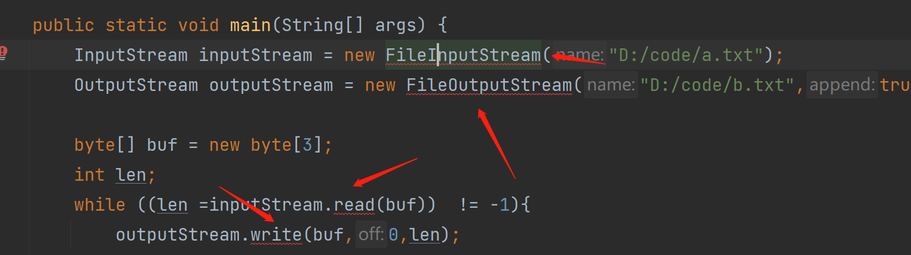

---
# 当前页面内容标题
title: IO流
# 当前页面图标
icon: IO
# 分类
category:
  - Java
  - IO流
# 标签
tag:
  - javase
sticky: false
# 是否收藏在博客主题的文章列表中，当填入数字时，数字越大，排名越靠前。
star: false
# 是否将该文章添加至文章列表中
article: false
# 目录顺序
order: 11
# 是否将该文章添加至时间线中
timeline: false
---

## 一、 Java IO 流的概念

Java 中的 IO（input 和 output）是实现输入和输出的基础，可以方便的实现数据的输入和输出操作。`java.io` 包下提供了大量的供我们使用的操作【流】的方法和接口，用于进行各类数据的处理和传输。

计算机的输入和输出都是通过二进制来完成的。在网络中我们要传递数据就要将数据【流化】，换句话说就是将文件、复杂的对象转化成能够在网络上传输的一个个的 0 和 1，我在这里先画几幅图帮助大家理解一下。

文件在磁盘的输入输出：


文件在网络中的输入输出：


内存中的对象的输入输出：


## 二、文件的操作

### 1、文件路径

正斜杠，又称左斜杠，符号是"/"；反斜杠，也称右斜杠，符号是"\" 。

在 Unix/Linux 中，路径的分隔采用正斜杠"/"，比如"/home/hutaow"；而在 Windows 中，路径分隔采用反斜杠""，比如"C:\Windows\System"


在 Java 当中反斜杠代表的是转义：

比如:

制表符（也叫制表位）的功能是在不使用表格的情况下在垂直方向按列对齐文本，就是咱们的 Tab 键。

- \" 将双引号转义为真正的双引号
- ‘\r’ (回车)：即将光标回到当前行的行首(而不会换到下一行)，之后的输出会把之前的输出覆盖
- ‘\n’ 换行，换到当前位置的下一位置，而不会回到行首

### 2、File 类简介

在 Java 中，File 类是 `java.io` 包中唯一代表磁盘文件本身的对象。File 类定义了一些与平台无关的方法来操作文件，File 类主要用来获取或处理与磁盘文件相关的信息，像文件名、 文件路径、访问权限和修改日期等，还可以浏览子目录层次结构。   File 类表示处理文件和文件系统的相关信息。也就是说，File 类不具有从文件读取信息和向文件写入信息的功能，它仅描述文件本身的属性。

### 3、构造方法

| 构造器                           | 描述                                                     |
| -------------------------------- | -------------------------------------------------------- |
| File(String pathname)            | 通过将给定路径名字符串来创建一个新 File 实例             |
| File(String parent,String child) | 根据指定的父路径和文件路径创建一个新 File 对象实例       |
| File(File parent,String child)   | 根据指定的父路径对象和文件路径创建一个新的 File 对象实例 |

其实很简单的，其实这个意思：

```java
File file = new File("D:\\code\\a.txt");
File file = new File("D:\\code\\","a.txt");
File file = new File("D:\\code");
File child = new File(file,"a.txt");
```

### 4、File 类创建和删除功能

| 返回值  | 方法            | 描述                                                                           |
| ------- | --------------- | ------------------------------------------------------------------------------ |
| boolean | createNewFile() | 指定路径不存在该文件时创建文件，返回 true 否则 false                           |
| boolean | mkdir()         | 当指定的单击文件夹不存在时创建文件夹并返回 true 否则 false                     |
| boolean | mkdirs()        | 当指定的多级文件夹在某一级文件夹不存在时，创建多级文件夹并返回 true 否则 false |
| boolean | delete()        | 删除文件或者删除单级文件夹                                                     |

### 5、File 类的判断功能

| 返回值  | 方法          | 描述                               |
| ------- | ------------- | ---------------------------------- |
| boolean | exists()      | 判断指定路径的文件或文件夹是否为空 |
| boolean | isAbsolute()  | 判断当前路径是否是绝对路径         |
| boolean | isDirectory() | 判断当前的目录是否存在             |
| boolean | isFile()      | 判断当前的目录是否是一个文件       |
| boolean | isHidden()    | 判断当前路径是否是一隐藏文件       |

### 6、File 类的获取功能和修改名字功能

| 返回值  | 方法                | 描述                                                     |
| ------- | ------------------- | -------------------------------------------------------- |
| File    | getAbsoluteFile()   | 获取文件的绝对路径，返回 File 对象                       |
| String  | getAbsolutePath()   | 获取文件的绝对路径，返回路径的字符串                     |
| String  | getParent()         | 获取当前路径的父级路径，以字符串形式返回该父级路径       |
| String  | getName()           | 获取文件或文件夹的名称                                   |
| String  | getPath()           | 获取 File 对象中封装的路径                               |
| long    | lastModified()      | 以毫秒值返回最后修改时间                                 |
| long    | length()            | 返回文件的字节数                                         |
| boolean | renameTo(File dest) | 将当前 File 对象所指向的路径修改为指定 File 所指向的路径 |

### 7、文件夹列表操作

| 返回值   | 方法                             | 描述                                                 |
| -------- | -------------------------------- | ---------------------------------------------------- |
| String   | list()                           | 得到这个文件夹下的所有文件，返回路径数组             |
| String[] | list(FilenameFilter filter)      | 通过过滤器过滤文件，过滤通过文件名过滤，返回路径数组 |
| File[]   | listFiles()                      | 得到这个文件夹下的所有文件，返回文件数组             |
| File[]   | listFiles(FileFilter filter)     | 通过过滤器过滤文件，过滤通过文件过滤，返回文件数组   |
| File[]   | listFiles(FilenameFilter filter) | 通过过滤器过滤文件，过滤通过文件名过滤，返回文件数组 |

### 8、作业

列出`D:\code\image`文件夹下的所有的图片：

```java
public class ListAllPng {

    public static void main(String[] args) throws IOException {
        listAll(new File("D:\\code\\image"));
    }

    // 单独列出方法获取目录下的图片
    public static void listAll(File parent)  {
        MyFilter myFilter = new MyFilter();
        File[] children = parent.listFiles(myFilter);

        for (int i = 0; i < children.length; i++) {
            // 如果子文件是个文件夹，则递归调用
            if(!children[i].isFile()){
                listAll(children[i]);
            } else {
                System.out.println(children[i].getName());
            }
        }
    }

    //定义文件过滤器
    static class MyFilter implements FilenameFilter{
        @Override
        public boolean accept(File dir, String name) {
            return name.contains(".png") || dir.isDirectory();
        }
    }
}
```

## 三、 IO 流的分类

Java 中一切皆对象，流也是对象，在学习之前我们不妨先看分类和概念，至于是哪个类其实没那么重要。

其实说到流，我们能想到流水，其实这已经很形象了，水从汪洋大海流入湖泊就是要通过河流。如果你还不知道，接着往下看。

其实到目前为止，我们对流已经有了基本的概念，接下来我们就要深入学习流了。按照不同的分类方式，可以把流分为不同的类型。常用的分类有三种：

### 1、 按照流向分

- 输入流： 只能从中读取数据，而不能向其写入数据。
- 输出流：只能向其写入数据，而不能向其读取数据。


其实计算机在读取文件的时候是很麻烦的：


当然系统级别的方法调用我们可以暂时不用考虑。但是我们确确实实看到一个文件在传输过程中经历了很多次的拷贝，IO 的性能本来就不是很高，所以后来又有了零拷贝、Nio 等技术，这些知识点我们计划在附加课讲解。

### 2 、按照操作单元划分

- 字节流：是一个字节一个字节的读取或写入
- 字符流：是一个字符一个字符的读取或写入，一个字符就是两个字节，主要用来处理字符。

### 3、 按照角色划分

- 节点流：直接从/向一个特定的 IO 设备（如磁盘，网络）读/写数据的流，称为节点流。
- 处理流：“连接”在已存在的流（节点流或处理流）之上通过对数据的处理为程序提供更为强大的读写功能的流。


### 4、Java 输入/输出流体系中常用的流的分类表

|      分类      |      字节输入流      |      字节输出流       |   字符输入流    |   字符输出流    |
| :------------: | :------------------: | :-------------------: | :-------------: | :-------------: |
|    抽象基类    |     InputStream      |     OutputStream      |     Reader      |     Writer      |
|    访问文件    |   FileInputStream    |   FileOutputStream    |   FileReader    |   FileWriter    |
|    访问数组    | ByteArrayInputStream | ByteArrayOutputStream | CharArrayReader | CharArrayWriter |
|   访问字符串   |                      |                       |  StringReader   |  StringWriter   |
| 缓冲流（处理） | BufferedInputStream  | BufferedOutputStream  | BufferedReader  | BufferedWriter  |
|    操作对象    |  ObjectInputStream   |  ObjectOutputStream   |                 |                 |

## 四、流的案例

### 1、继承结构

InputStream 和 OutputStream


Reader 和 Writer


### 2、流到底怎么用

#### （1）将一个流对象插在一个节点上

其实通过名字我们就可以很好的理解了：FileInputStream 就是怼在文件上的输入流啊！

```java
public abstract class InputStream implements Closeable
```

InputStream 本身是抽象类，我们需要使用它的子类去构造对象：

```java
InputStream inputStream = new FileInputStream(file);
```

既然是输入流就要一点一点的往内存里读数据啊！


其实 inputStream 的方法并不多，关键在于几个 read 方法，管子已经插上了，接下来就是读了。

```java
// 读一个字节
int read = inputStream.read();

// 一次性读1024个字节到那个内存数组
int read = inputStream.read(new byte[1024]);

// 从第0个字节开始读，读120个字节
int read = inputStream.read(new byte[1024],0,120);
```

#### 方法读取

它的读取流程大概是这个样子的，inputStream 内部有一个游标，它会记录目前读到哪里了，看下图：


我们不妨尝试一下：

我的 D 盘的 code 目录下新建一个文本：


我知道：read 返回-1 时就代表文件读完了，所以我写了如下代码：

```java
public static void main(String[] args) throws IOException {
    InputStream inputStream = new FileInputStream("D:/code/a.txt");
    int read;
    while ((read =inputStream.read())  != -1){
        System.out.print(read+" ");
    }
}
72 101 108 108 111 32 87 111 114 108 100 33
H  e   l   l   0      W  o   r   l   d   !
```

read 就是每次读出的字节，直到-1 就停止。

小 tips：一个流我读完了一次还能读第二次吗？

```java
 public static void main(String[] args) throws IOException {
        InputStream inputStream = new FileInputStream("D:/code/a.txt");
        int read;

        while ((read =inputStream.read())  != -1){
            System.out.print(read+" ");
        }
        System.out.println("再读一次---------------");
        while ((read =inputStream.read())  != -1){
            System.out.print(read+" ");
        }
    }

    72 101 108 108 111 32 87 111 114 108 100 33
再读一次---------------
```

我们发现一个流读完了就没有了，就不能在读了。当然文档里有 mark 和 reset 方法，我们在系统中测试是不可用的。

```java
System.out.println(inputStream.markSupported());
```

#### 读取

```java
public static void main(String[] args) throws IOException {
    InputStream inputStream = new FileInputStream("D:/code/a.txt");
    int read;

    byte[] buf = new byte[3];
    while ((read =inputStream.read(buf))  != -1){
        System.out.print(read+" ");
    }
}
```


我们想向深入走一步，看看源码：

但是发现，源码目前位置看不了了，这些方法都带有 native，这更加说明了读文件一定是 JVM 调用系统方法读取的。


#### （4）输出流的使用

我们要学会举一反三，其实他们的区别就是一个读，一个写嘛，我写一个例子就好了。

有一个小知识点：

在定义文件输出流时，有两个参数，第二个如果是 true 代表追加文件，如果 false 代表覆盖文件，意思就是如果人家这个文件原来有内容，就覆盖的没了，这一点要注意。

```java
OutputStream outputStream = new FileOutputStream("D:/code/a.txt",true);
OutputStream outputStream = new FileOutputStream("D:/code/a.txt",true);
// 一个字节一个字节的写
outputStream.write(97);

// 97是一个字节啊
```

我们发现文件中被写入的是一个 a


```java
OutputStream outputStream = new FileOutputStream("D:/code/b.txt",true);
// 直接将一个字节数组写出
outputStream.write("Hello World".getBytes());
```

我们不妨升级一下，一个文件的拷贝程序就写好了。

```java
public static void main(String[] args) throws IOException {
    InputStream inputStream = new FileInputStream("D:/code/a.txt");
    OutputStream outputStream = new FileOutputStream("D:/code/b.txt",true);

    byte[] buf = new byte[3];
    int len;
    while ((len =inputStream.read(buf))  != -1){
        outputStream.write(buf,0,len);
    }
}
```

#### （5）资源的释放

一个 IO 流的标准写法是什么呢？

我们发现 IO 有以下几点需要我们处理：

1、绝大部分的对 IO 的操作都需要处理可能出现的 IO 异常。



2、我们发现不管是 inputStream 还是 outputStream 都有一个 close 方法，IO 是需要消耗系统资源的，每一个 stream 都需要系统分配资源，是弥足珍贵的，所以没有流一旦使用完成就一定要关闭资源。

经过反复修改我们写出了如下代码：

```java
 public static void main(String[] args) {
        // 定义资源
        InputStream inputStream = null;
        OutputStream outputStream = null;
        try {
            inputStream = new FileInputStream("D:/code/a.txt");
            outputStream = new FileOutputStream("D:/code/b.txt",true);

            byte[] buf = new byte[3];
            int len;
            while ((len =inputStream.read(buf))  != -1){
                outputStream.write(buf,0,len);
            }
        }  catch (IOException e) {
            e.printStackTrace();
         // 最终无论如何，都要释放资源
        } finally {
            if(inputStream != null){
                try {
                    inputStream.close();
                } catch (IOException e) {
                    e.printStackTrace();
                }
            }
            if(outputStream != null){
                try {
                    outputStream.close();
                } catch (IOException e) {
                    e.printStackTrace();
                }
            }
        }
    }
```

【AutoCloseable 接口的好处】

以上代码如此繁杂，jdk1.7 之后，很多资源类的类都实现了 AutoCloseable 接口

实现了这个接口的类可以在 try 中定义资源，并会主动释放资源：

这样就极大的简化了代码的编写，但是你这么写了可能会有人看不懂呦！

```java
public static void main(String[] args) {
        // 把输入流建立在文件上
        // 建立一个输出流
        try (InputStream inputStream = new FileInputStream("E:\\Java\\FileTest\\a\\test.mp4");
             OutputStream outputStream = new FileOutputStream("E:\\Java\\FileTest\\b\\test.mp4"))
        {
            // 一边读流中的字节，一边写出到文件
            long start = System.currentTimeMillis();
            int len;
            // 建立缓冲区
            byte[] buf = new byte[1024 * 1024];
            while ((len = inputStream.read(buf)) != -1) {
                outputStream.write(buf, 0, len);
            }
            long end = System.currentTimeMillis();
            System.out.println(end - start);
        } catch (IOException e) {
            e.printStackTrace();
        }
}
```

### 3、案例（作业）

#### （1）字符流读文件

```java
@Test
public void testReader() throws Exception{
    //怼了一个输入流到文件上
    Reader reader = new FileReader("E:\\test\\a\\word.txt");
    BufferedReader br = new BufferedReader(reader);
    String str;
    while ((str = br.readLine()) != null){
        System.out.println(str);
    }
    reader.close();
    br.close();
}
```

#### （2）向文件里写内容

```java
//这个用main方法测吧
public void testWriter() throws Exception{
    //怼了一个输入流到文件上
    Writer writer = new FileWriter("E:\\test\\a\\writer.txt");
    BufferedWriter bw = new BufferedWriter(writer);
    Scanner scanner = new Scanner(System.in);

    while (true){
        System.out.print("请输入：");
        String words = scanner.next();
        bw.write(words);
        bw.flush();
    }
}
```

## 五、序列化和反序列化

### 1、对象序列化

- 序列化：将对象写入到 IO 流中，说的简单一点就是将内存模型的对象变成字节数字，可以进行存储和传输。
- 反序列化：从 IO 流中恢复对象，将存储在磁盘或者从网络接收的数据恢复成对象模型。
- 使用场景：所有可在网络上传输的对象都必须是可序列化的，否则会出错；所有需要保存到磁盘的 Java 对象都必须是可序列化的。

该对象必须实现 Serializable 接口，才能被序列化。

```java
import java.io.Serializable;


public class User implements Serializable {
    private String name;

    private int age;

    private int gander;

    public User(String name, int age, int gander) {
        this.name = name;
        this.age = age;
        this.gander = gander;
    }

    public String getName() {
        return name;
    }

    public void setName(String name) {
        this.name = name;
    }

    public int getAge() {
        return age;
    }

    public void setAge(int age) {
        this.age = age;
    }

    public int getGander() {
        return gander;
    }

    public void setGander(int gander) {
        this.gander = gander;
    }
}
@Test
public void testObjectOut() throws Exception{
    //怼了一个string
    InputStream is = new FileInputStream("E:\\test\\a\\user.txt");
    ObjectInputStream oi  = new ObjectInputStream(is);
    User user = (User)(oi.readObject());
    System.out.println(user.getName());
    is.close();
    oi.close();
}
```

### 2、序列化版本号

我们知道，**反序列化必须拥有 class 文件，但随着项目的升级，class 文件也会升级，序列化怎么保证升级前后的兼容性呢？**

Java 序列化提供了一个``private static final long serialVersionUID` 的序列化版本号，只要版本号相同，即使更改了序列化属性，对象也可以正确被反序列化回来。

```java
public class Person implements Serializable {
    //序列化版本号
    private static final long serialVersionUID = 1111013L;
    private String name;
    private int age;
    //省略构造方法及get,set
}
```

如果反序列化使用的版本号与序列化时使用的不一致，反序列化会报 InvalidClassException’异常。


序列化版本号可自由指定，如果不指定，JVM 会根据类信息自己计算一个版本号，这样随着 class 的升级、代码的修改等因素无法正确反序列化；

不指定版本号另一个明显隐患是，不利于 jvm 间的移植，可能 class 文件没有更改，但不同 jvm 可能计算的规则不一样，这样也会导致无法反序列化。

什么情况下需要修改 serialVersionUID 呢：

- 如果只是修改了方法，反序列化不容影响，则无需修改版本号；
- 如果只是修改了静态变量，瞬态变量（`transient`修饰的变量），反序列化不受影响，无需修改版本号。

### 3、总结

1. 所有需要网络传输的对象都需要实现序列化接口。
2. 对象的类名、实例变量（包括基本类型，数组，对其他对象的引用）都会被序列化；方法、类变量、transient 实例变量都不会被序列化。
3. 如果想让某个变量不被序列化，使用 transient 修饰。
4. 序列化对象的引用类型成员变量，也必须是可序列化的，否则，会报错。
5. 反序列化时必须有序列化对象的 class 文件。
6. 同一对象序列化多次，只有第一次序列化为二进制流，以后都只是保存序列化编号，不会重复序列化。
7. 建议所有可序列化的类加上 serialVersionUID 版本号，方便项目升级。

Intellij idea 用快捷键自动生成序列化 id，类继承了 Serializable 接口之后，使用 alt+enter 快捷键自动创建序列化 id

方法：进入*setting→inspections→serialization issues→*选择图中的选项。`serializable class without ‘serialVersionUID`


### 4、深拷贝

（1）对象的引用改变:


```java
public void deepCopyTest() throws  CloneNotSupportedException {
    User user = new User(12, "zhagnsna");
    user.setDog(new Dog(2));
    User user1 = user;

    user.getDog().setAge(23);
    System.out.println(user1);
}
```

（2）浅拷贝：实现 clonable 接口，重写 clone 方法。


```java
public class User implements Serializable,Cloneable {
    @Override
    protected Object clone() throws CloneNotSupportedException {
        return super.clone();
    }
}

@Test
public void deepCopyTest() throws  CloneNotSupportedException {
    User user = new User(12, "zhagnsna");
    user.setDog(new Dog(2));
    User user1 = (User)user.clone();

    user.getDog().setAge(23);
    System.out.println(user1);
}
```

深拷贝：使用对象流先写入 byte 数组，再读出来。


```java
@Test
public void deepCopyTest2() throws CloneNotSupportedException, IOException, ClassNotFoundException {
    User user = new User(12, "zhangsan");
    user.setDog(new Dog(2));

    // 将对象写到字节数组当中
    ByteArrayOutputStream outputStream = new ByteArrayOutputStream();
    ObjectOutputStream objectOutputStream = new ObjectOutputStream(outputStream);
    objectOutputStream.writeObject(user);
    // 获取字节数组
    byte[] bytes = outputStream.toByteArray();
    // 用输入流读出来
    ByteArrayInputStream byteArrayInputStream = new ByteArrayInputStream(bytes);
    ObjectInputStream objectInputStream = new ObjectInputStream(byteArrayInputStream);
    Object object = objectInputStream.readObject();
    User user1 = (User) object;

    user.setAge(44);
    user.getDog().setAge(11);
    System.out.println(user);
    System.out.println(user1);

}
```

## 六、大作业

写一个程序，能够给一个商品文件进行增、删、改、查。


第一列是编号，第二列是商品名称，第三列是价格。

骨架代码：

```java
import java.util.Scanner;

public class Shop {

    private static Scanner scanner = new Scanner(System.in);

    public static void main(String[] args) {

        while (true) {
            System.out.println("请选择功能：1、插入新商品 2、删除商品 3、修改商品 4、查找一个商品 5、退出");
            int function = scanner.nextInt();
            switch (function){
                case 1:
                    insert();
                    break;
                case 2:
                    delete();
                    break;
                case 3:
                    update();
                    break;
                case 4:
                    findOne();
                    break;
                case 5:
                    System.exit(-1);
                    break;
            }
        }
    }

    private static void findOne() {
        System.out.println("请输入商品编号：");
        int id = scanner.nextInt();
        // 思路一：一行一行的读，找到为止

        // 思路二：全部读到内存，内存里找
    }

    private static void update() {
        System.out.println("请输入商品编号：");
        // 全部拿出来，更新后覆盖
    }

    private static void delete() {
        System.out.println("请输入商品编号：");
        // 全部拿出来，删除后覆盖
    }

    private static void insert() {
        System.out.println("请输入商品编号：");
        // 最简单，直接追加
    }

    private static class Goods{
        private int id;
        private String name;
        private int price;

        public Goods() {
        }

        public Goods(int id, String name, int price) {
            this.id = id;
            this.name = name;
            this.price = price;
        }

        public int getId() {
            return id;
        }

        public void setId(int id) {
            this.id = id;
        }

        public String getName() {
            return name;
        }

        public void setName(String name) {
            this.name = name;
        }

        public int getPrice() {
            return price;
        }

        public void setPrice(int price) {
            this.price = price;
        }
    }
}
```

代码：

```java
package com.ydlclass;

import java.io.*;
import java.util.*;

public class Shop {
    private static Scanner scanner = new Scanner(System.in);
    public static final String PATH = "D:\\code\\image\\a\\1.txt";

    public static void main(String[] args) {

        while (true) {
            System.out.println("请选择功能：1、插入新商品 2、删除商品 3、修改商品 4、查看商品 4、查看一个商品 5、退出");
            int function = scanner.nextInt();
            switch (function){
                case 1:
                    insert();
                    break;
                case 2:
                    delete();
                    break;
                case 3:
                    update();
                    break;
                case 4:
                    check();
                    break;
                case 5:
                    findOne();
                    break;
                case 6:
                    System.exit(-1);
                    break;
            }
        }
    }

    private static void findOne() {
        System.out.println("请输入商品编号：");
        int id = scanner.nextInt();
        // 函数式编程找到对应id的商品
        Optional<Goods> first = findAllGoods().stream().filter(g -> g.getId() == id).findFirst();
        if (first.isPresent()){
            Goods goods = first.get();
            System.out.println(goods.getId() + " " + goods.getName() + " " + goods.getPrice());
        } else {
            System.out.println("您需要的商品不存在");
        }
    }

    private static void check() {
        List<Goods> allGoods = findAllGoods();
        for (Goods goods : allGoods) {
            System.out.println(goods.getId() + " " + goods.getName() + " " + goods.getPrice());
        }
    }

    private static void update() {
        // 输入商品id
        System.out.println("请输入商品编号：");
        int id = scanner.nextInt();
        System.out.println("请输入商品名字：");
        String name = scanner.next();
        System.out.println("请输入商品价格：");
        int price = scanner.nextInt();
        // 内存中删除对应的商品
        List<Goods> allGoods = findAllGoods();
        Iterator<Goods> iterator = allGoods.iterator();
        while (iterator.hasNext()){
            Goods goods = iterator.next();
            if(goods.getId() == id){
                goods.setName(name);
                goods.setPrice(price);
            }
        }

        // 刷入磁盘
        writeGoods(allGoods,false);
    }

    private static void delete() {
        // 输入商品id
        System.out.println("请输入商品编号：");
        int id = scanner.nextInt();
        // 内存中删除对应的商品
        List<Goods> allGoods = findAllGoods();
        Iterator<Goods> iterator = allGoods.iterator();
        while (iterator.hasNext()){
            Goods goods = iterator.next();
            if(goods.getId() == id){
                iterator.remove();
            }
        }

        // 刷入磁盘
        writeGoods(allGoods,false);
    }

    private static void insert() {
        // 防止id重复
        boolean flag = true;
        Integer id = null;
        while (flag) {
            System.out.println("请输入商品编号：");
            id = scanner.nextInt();
            final Integer i = id;
            Optional<Goods> first = findAllGoods().stream().filter(p -> p.getId() == i).findFirst();
            flag = first.isPresent();
            if (flag) {
                System.out.println("该编号已经存在！");
            }
        }

        System.out.println("请输入商品名字：");
        String name = scanner.next();
        System.out.println("请输入商品价格：");
        int price = scanner.nextInt();
        // 最简单，直接追加
        writeGoods(Arrays.asList(new Goods(id,name,price)),true);
    }

    /**
     * 从磁盘中获取所有的数据
     * @return
     */
    private static List<Goods> findAllGoods(){
        List<Goods> goodsList = new ArrayList<>();
        try (Reader reader = new FileReader(Shop.PATH);
             BufferedReader bufferedReader = new BufferedReader(reader);
        ){
            String goodsStr;
            while ((goodsStr = bufferedReader.readLine()) != null){
                // 1 肥皂 23
                String[] goodsElem = goodsStr.split(" ");
                Goods goods = new Goods(
                        Integer.parseInt(goodsElem[0]),
                        goodsElem[1],
                        Integer.parseInt(goodsElem[2]));
                goodsList.add(goods);
            }

        } catch (IOException e){
            e.printStackTrace();
        }
        return goodsList;
    }

    private static void writeGoods(List<Goods> allGoods,boolean append){
        try( Writer writer = new FileWriter(Shop.PATH,append);
             BufferedWriter bufferedWriter = new BufferedWriter(writer);
        ) {
            for (Goods goods : allGoods) {
                bufferedWriter.write(goods.getId() + " " + goods.getName() + " " + goods.getPrice());
                bufferedWriter.newLine();
            }

        } catch (IOException e){
            e.printStackTrace();
        }
    }

    private static class Goods{
        private int id;
        private String name;
        private int price;

        public Goods() {
        }

        public Goods(int id, String name, int price) {
            this.id = id;
            this.name = name;
            this.price = price;
        }

        public int getId() {
            return id;
        }

        public void setId(int id) {
            this.id = id;
        }

        public String getName() {
            return name;
        }

        public void setName(String name) {
            this.name = name;
        }

        public int getPrice() {
            return price;
        }

        public void setPrice(int price) {
            this.price = price;
        }

        @Override
        public String toString() {
            return "Goods{" +
                    "id=" + id +
                    ", name='" + name + '\'' +
                    ", price=" + price +
                    '}';
        }
    }
}
```
