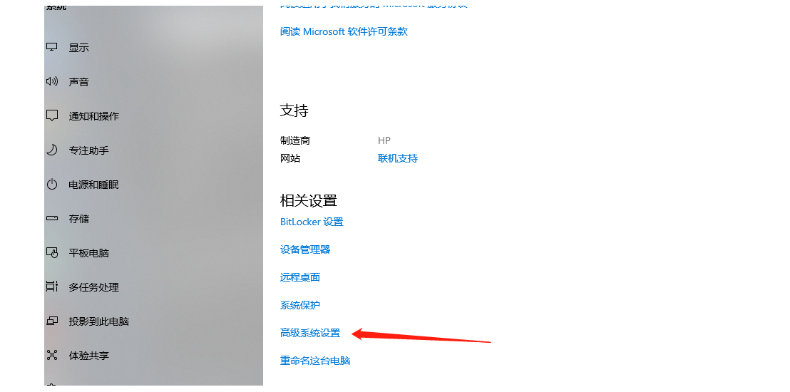
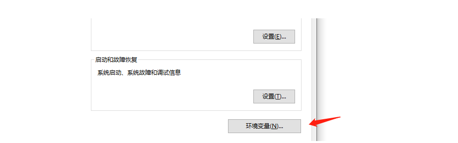
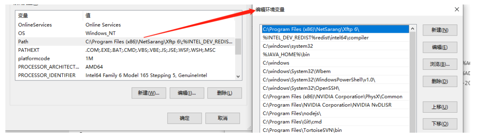
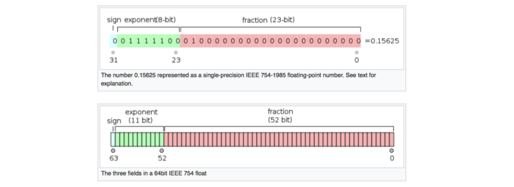
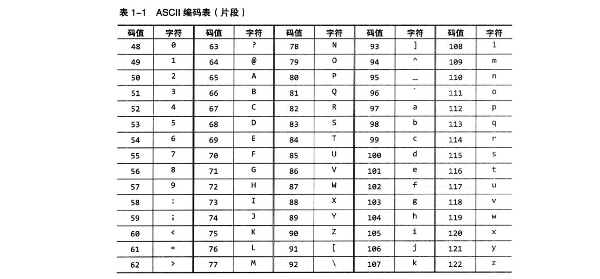

> [!TIP]
>
>课程视频教程链接：<https://www.bilibili.com/video/BV1h64y1i78N>

## 1.命令提示符

Windows 键+R 输入 cmd 回车

输入盘符名+“：”切换盘符

上下键切换最近输入

```shell
cd+文件夹名/路径 进入文件夹ps：路径有空格加双引号

copy nul+文件名   创建文件 # such as，a.txt

echo 文本信息>a.txt # 写入信息

del+文件名 # 删除文件
```

CMD 命令：开始－>运行－>键入 cmd 或 command(在命令行里可以看到系统版本、文件系统版本)

> **进入某一个盘符**

输入盘符 如 `C:` 然后回车，相当于进了 C 盘(c 盘一般进的是桌面目录)

> **切换目录**

输入 `cd` 目录名 然后回车

> **返回上层目录**

如果你想返回到上层目录，那么直接输入`cd..就行了，可以返回到上层目录。开发过程中最常用的命令也就这些。

> **查看文件**

`dir`命令查看目录下的文件列表,查看该目录下的所有文件:

```cmd
dir
```

> **创建一个空文件**

```cmd
copy nul a.txt
```

> **文件里输入字符**

```cmd
echo 2323>a.txt
```

> **拷贝文件**

copy 拷贝文件命令,拷贝该目录下所有文件到 D 盘: `copy * "d:\"`

> **删除文件**

`del a.js` 删除 a.js 文件

## 2.快捷键

### Windows

`Windows`+`E` 资源管理器

`F2` 重命名

### cmd

上下键切换最近指令

## 3.原码、反码、补码

八个数一位

最前面的数（符号位）表正负

10000001（2） == -1

00000001（2） == 1

### （1）正数

原码、反码、补码都是自身

### （2）负数

#### 反码

除了最前面的数（符号位）以外，后面的数反向；0 变 1；1 变 0

1000 0001→1111 1110

#### 补码

反码加 1

### （3）溢出

1 0000 0000

最前面的数字溢出消失

## 二、Java

```java
public class Helloworld{
 public static void main(String[] args){
  System.out.println("Helloworld");
 }
}
```

ps: 注意大小写

### 1.jave 编译

##### JDK 基本介绍

JDK 的全称(Java Development Kit Java 开发工具包) JDK = JRE + java 的开发工具 [java, javac,javadoc,javap 等]

JDK 是提供给 Java 开发人员使用的，其中包含了 java 的开发工具，也包括了 JRE。所以安装了 JDK，就不用在单独 安装 JRE 了。

##### JRE 基本介绍

- JRE(Java Runtime Environment Java 运行环境) JRE = JVM + Java 的核心类库[类]
- 包括 Java 虚拟机(JVM Java Virtual Machine)和 Java 程序所需的核心类库等，如果想要运行一个开发好的 Java 程序， 计算机中只需要安装 JRE 即可。

##### JDK、JRE 和 JVM 的包含关系

- JDK = JRE + 开发工具集（例如 Javac,java 编译工具等）
- JRE = JVM + Java SE 标准类库（java 核心类库）
- 如果只想运行开发好的 .class 文件 只需要 JRE

#### （1）HelloWorld

```java
public class HelloWorld{
 public static void main(String[] args){
  System.out.println("Hello World");
 }
}
//println和print的区别
//println是输出之后换行
```

#### javac

将 java 文件编译成 class 文件

先进入 java 文件路径

cmd：“javac 路径”+java 文件名.java

```cmd
"C:\Progrom Files\Java\jdk.1.80_333\bin\javac" Helloworld.java
```

ps：注意空格

#### java

运行程序

cmd：java 路径+运行类名称

```cmd
"C:\Program Files\Java\jdk1.8.0_333\bin\java" Helloworld
```

### 2.环境变量

环境变量（environment variables）一般是指在操作系统中用来指定操`作系统运行环境`的一些参数，如：临时文件夹位置和系统文件夹位置等。

环境变量相当于给系统或用户应用程序设置的一些参数，具体起什么作用这当然和具体的环境变量相关。比如`path`，是告诉系统，当要求系统运行一个程序而没有告诉它程序所在的完整路径时，系统除了在`当前目录`下面寻找此程序外，还应到哪些目录下去寻找。

环境变量在哪里配置

我的电脑——>右键属性



选择环境变量：



在系统环境变量中有一个 Path，这里边配置了很多路径。



#### path

```shell
javac HelloWorld.java
java HelloWorld
```

## 三、变量和运算符

### 1、数据类型

> 四类八种

| 数据类型 | 占用内存 | 取值范围                                                             |
| -------- | -------- | -------------------------------------------------------------------- |
| byte     | 1 个字节 | -2^7 ~ 2^7-1                                                         |
| short    | 2 个字节 | -2^15 ~ 2^15-1                                                       |
| int      | 4 个字节 | -2^31 ~ 2^31-1                                                       |
| long     | 8 个字节 | -2^63 ~ 2^63-1                                                       |
| float    | 4 个字节 | （正数）1.4E-45 - 3.4028235E38 （整体） -3.4028235E38 ~ 3.4028235E38 |
| double   | 8 个字节 | 1.7976931348623157E308 ~ 4.9E-324                                    |
| char     | 2 个字节 | 65536（看字符编码）                                                  |
| boolean  | 1 个字节 | 两个值 true 和 false                                                 |

#### （1）整形的取值范围

byte 是一个字节，一共八位，第一个是符号位，所以用于表示数值的只有 7 位。

所以他的取值范围是：-2^7 ~ 2^7

但是有几个特殊的值我们需要讨论讨论。

在我们写代码的时候一定要考虑边界问题。

> 0

源码：00000000

反码：00000000

补码：00000000

> -0

源码：10000000

反码：11111111

补码：00000000 进位 1 溢出

> 128

无法表示

> -128

源码：（1）10000000

反码：（1）01111111

补码：（1）11111111 首位溢出 11111111 -128

结论：所以 byte 的取值范围是 -128 ~ 127

其他整形以此类推。

#### （2）浮点数的取值范围

浮点数的表示



根据国际标准 IEEE 754，任意一个二进制浮点数 V 可以表示成下面的形式： `V = (-1)^s×M×2^E`

1. (-1)^s 表示符号位，当 s=0，V 为正数；当 s=1，V 为负数。
2. M 表示有效数字，大于等于 1，小于 2，但整数部分的 1 可以省略，也叫尾数。
3. 2^E 表示指数位。

**符号位**

只有两个取值 0 或者 1，0 代表正数，1 代表负数。

**阶码**

E 为一个无符号整数（unsigned int）,这意味着，如果 E 为 8 位，它的取值范围为 0~255；如果 E 为 11 位，它的取值范围为 0~2047。然而科学计数法中的 E 是可以出现负数的，所以 IEEE 754 规定，E 的真实值必须再减去一个中间数，对于 8 位的 E，这个中间数是 127；对于 11 位的 E，这个中间数是 1023。 比如，2^2 的 E 是 2，所以保存成 float 32 位浮点数时，必须保存成 2+127=129，即 10000001。

**尾数**

M 可以写成 1.xxxxxx 的形式，其中 xxxxxx 表示小数部分。IEEE 754 规定，在计算机内部保存 M 时，默认这个数的第一位总是 1，因此可以被舍去，只保存后面的 xxxxxx 部分。比如保存 1.0101 的时候，只保存 0101，等到读取的时候，再把第一位的 1 加上去。这样做的目的，是节省 1 位有效数字。以 32 位浮点数为例，留给 M 只有 23 位，将第一位的 1 舍去以后，等于可以保存 24 位有效数字。

小例子：-58.2 在内存是怎么表示的

```java
System.out.println(Integer.toBinaryString(Float.floatToIntBits(-58.2F)));
//结果：1 10000100 11010001100110011001101
```

其实可以写成 $-1 * 1.11010001100110011001101 * 2^{(132-127)} = -1.11010001100110011001101 * 2^5 = 111010.001100110011001101$

是不是相当与小数点向后移动 5 位啊

```text
-1 * 111010.001100110011001101 大约等于 -58.2
```

E 还需要考虑下面 2 种情况：

1、E 全为 0。这时，浮点数的指数 E 等于 1-127（或者 1-1023），有效数字 M 不再加上第一位的 1，而是还原为 0.xxxxxx 的小数。这样做是为了表示 ±0，以及接近于 0 的很小的数字。

```java
System.out.println(Integer.toBinaryString(Float.floatToIntBits(-0F)));
// 结果：1 00000000  00000000000000000000000
System.out.println(Integer.toBinaryString(Float.floatToIntBits(0F)));
// 结果：00000000000000000000000000000000
```

2、E 全为 1。这时，如果有效数字 M 全为 0，表示 ± 无穷大（正负取决于符号位 s）；如果有效数字 M 不全为 0，表示这个数不是一个数（NaN）。

```java
/**无穷大*/
System.out.println(Integer.toBinaryString(Float.floatToIntBits(Float.POSITIVE_INFINITY)));
/**无穷小*/
System.out.println(Integer.toBinaryString(Float.floatToIntBits(Float.NEGATIVE_INFINITY)));
System.out.println(Float.POSITIVE_INFINITY);
System.out.println(Float.NEGATIVE_INFINITY);

// 1111111100000000000000000000000
// 11111111100000000000000000000000
// Infinity 正无穷
// -Infinity 负无穷

```

3、取值范围计算

```java
System.out.println(Integer.toBinaryString(Float.floatToIntBits(Float.MAX_VALUE)));
System.out.println(Integer.toBinaryString(Float.floatToIntBits(Float.MIN_VALUE)));
System.out.println(Float.MAX_VALUE);
System.out.println(Float.MIN_VALUE);

// 0 11111110 11111111111111111111111    254-127=127
// 1.11111111111111111111111 * 2^127，
// 相当于小数点向右移动127位   111111111111111111111111...加102个0  2^127+2^126+...
// 其实大致相当于  2^128 = 3.4028236692093846346337460743177e+38

// 0 00000000 00000000000000000000001
// - 0.00000000000000000000001 * 2^(-126) = -1 * 2^(-126-23) = 1.4012984643248170709237295832899e-45

// 3.4028235E38
// 1.4E-45
// -3.4028235E38 ~ 3.4028235E38
```

#### （3）char 的取值范围

简单的聊聊字符编码：

思考：如果用

**ASCII**

（American Standard Code for Information Interchange，美国信息互换标准代码）

ASCII 第一次以规范标准的类型发表是在 1967 年，最后一次更新则是在 1986 年，到目前为止共定义了 128 个字符。ASCII 码，用一个字节表示，8 位能够表示 256 个字符，可以用来表示所有的大写和小写字母，数字 0 到 9、标点符号，以及在美式英语中使用的特殊控制字符，足够美国人用的了，事实上他们只用到了 128 个字符，还有位就空着了。



**Unicode**

Unicode（统一码、万国码、单一码）是一种在计算机上使用的字符编码。Unicode 是为了解决传统的字符编码方案的局限而产生的，它为每种语言中的每个字符设定了统一并且唯一的二进制编码，规定虽有的字符和符号最少由 16 位来表示（2 个字节），即：2 ^16 = 65536（注：此处说的的是最少 2 个字节，可能更多）。

**GB2312**

把中国单独拉出来看，MBCS 时期，中国于 1980 年发布了 GB2312，就是国标的拼音，这个编码用区位码（94 个区，每区 94 个字符）的方式可以支持 7000 多个汉字，它所收录的汉字已经覆盖中国大陆 99.75%的使用频率，基本可以满足汉字计算机的需要了。

- gb2312 是简体中文的码
- gbk 支持简体中文及繁体中文

**UTF-8**

UTF-8，是对 Unicode 编码的压缩和优化，所以 UTF-8 包含于 Unicode，只是他不再使用最少使用 2 个字节，而是将所有的字符和符号进行分类：ascii 码中的内容用 1 个字节保存、欧洲的字符用 2 个字节保存，东亚的字符用 3 个字节保存

查看咱们的字符集

```java
import java.nio.charset.Charset;
public class Demo {
    public static void main(String[] args) {
        System.out.println(Charset.defaultCharset());
    }
}
```


```java
byte num1 = 12;
byte num2 = 13;
byte num3 = num1 + num2;
```

### 2、定义变量

变量就是一切通过内存分配并赋值的量，分为不可变变量和可变变量

变：能保存一些可变的量，比如年龄，收入等

便： 方便，一次定义，“到处”（作用域内）使用

#### （1）过程

- 定义 `int i`;
- 赋值 `i = 5`; 定义和赋值可以一起 `int i = 5`;
- 使用；

#### （2）定义变量的规则（知名识意）

1. 变量名字里不能有空格。
2. 避免使用关键字，class public int static
3. 避免使用汉字，不要使用英文和拼音混着写（只有字符集没问题才可以用中文）
4. 整体是驼峰命名，首字母小写 lowerCamelCase
5. $和\_可以到处使用，但是不建议当做开头
6. 数字不能开头

### 3、基础数据类型的运算

#### （1）算术运算符

```java
  +  -  *  /   %    ++   --
```

%是除以一个数后取余数

`i++`，`++i` 其实相当于 `i = i+1`;

```java
int num1 = 12;
++num1;
System.out.println(num1);

结果是13
```

```text
int num1 = 12;
num1++;
System.out.println(num1);

结果是13
```

```java
int num1 = 12;
int num2 = num1++;
System.out.println(num2);

结果是：12
    先赋值后计算
```

```java
int num1 = 12;
int num2 = ++num1;
System.out.println(num2);

结果是：13
    先计算后赋值
```

看看以下的代码：

```text
byte num1 = 12;
long num2 = 13;
long num3 = num1 + num2;
```

```java
int num1 = 12;
int num2 = 13;
int num3 = num1 + num2;
System.out.println(num3);
```

结论：

算术运算符，int 以下的做运算，结果都是 int 类型，long 和其他的类型做运算，结果是 long。

**++i 和 i++的区别**

如果不赋值都是自增 1

如果赋值，`i++` 是 先把`i`赋值给其他变量，然后自增， `++i`是先赋值再自增。

#### （2）逻辑运算符-真值表

逻辑运算的结果是布尔型 boolean 与 或 非

与

| 条件 1 condition1 | 条件 2 condition2 | 结果  |
| :---------------: | :---------------: | :---: |
|       true        |       true        | true  |
|       true        |       false       | false |
|       false       |       true        | false |
|       false       |       false       | false |

或

| 条件 1 condition1 | 条件 2 condition2 | 结果  |
| :---------------: | :---------------: | :---: |
|       true        |       true        | true  |
|       true        |       false       | true  |
|       false       |       true        | true  |
|       false       |       false       | false |

非

| 条件 1 condition1 | 结果  |
| :---------------: | :---: |
|       true        | false |
|       false       | true  |

符号表示

`&` `|` `!` `&&` `||`

```java
boolean flag1 = true;
boolean flag2 = false;

boolean flag3 = flag1 & flag2;
boolean flag4 = flag1 | flag2;
boolean flag5 = !flag1;


int num1 = 12;
int num2 = 15;
boolean flag6 = num1 >= num2;
boolean flag7 = num1 == num2;


boolean flag8 = (num1 >= num2) & (num1 == num2);

System.out.println(flag8);
```

短路运算符

`&&` 短路运算符 如果短路运算的结果是 false，那么结果直接就是 false， 不会继续运算后边的逻辑

`||` 短路运算符 如果短路运算的结果是 true，那么结果直接就是 true， 不会继续运算后边的逻辑

看看以下代码：

```java
byte num1 = 12;
byte num2 = 13;
byte num3 = num1 & num2;
```

```text
byte num1 = 12;
long num2 = 13;
long num3 = num1 & num2;
```

```java
char c1 = '1';
char c2 = '2';
char c3 = c1 & c1;
```

```text
System.out.println('a');
System.out.println('a'+'b');
```

亦或运算符

`^` 相同为零 不同为 1

```Java
int i = 10;
int j = 14;
int k = i ^ j;
System.out.println(k);
//结果为4
/** 1010(2)
    1110(2)
    ________
    0100(2)==4(10) */

```

#### （3）赋值运算符号

```text
+= -= *= /= =
```

i += 5 相当与 i = i + 5;

#### （4）三目运算符

`条件 ? 结果1 : 结果2;`

条件的结果一定是 boolean ，只能是 true 或者 false；

条件是可以复杂的

```java
boolean condition1 = 5 > 3;
boolean condition2 = 5 > 3;
boolean condition3 = 5 > 3;
int num = (condition1 && (condition2 || condition3)) ? 1 : 2;
```

? : 其实为 Java 中的**三元运算符**，表示条件判断语句，对布尔类型的语句进行判断，即 `A ? B : C`，表示：如果语句 A 为真，则执行语句 B，如果语句 A 为假，则执行语句 C。

#### （6）位移运算符

| 符号 | 说明                                                                                                                                                 |
| ---- | ---------------------------------------------------------------------------------------------------------------------------------------------------- |
| <<   | 左移运算符，将运算符左边的对象向左移动运算符右边指定的位数（在低位补 0）                                                                             |
| >>   | "有符号"右移运算 符，将运算符左边的对象向右移动运算符右边指定的位数。使用符号扩展机制，也就是说，如果值为正，则在高位补 0，如果值为负，则在高位补 1. |
| >>>  | "无符号"右移运算 符，将运算符左边的对象向右移动运算符右边指定的位数。采用 0 扩展机制，也就是说，无论值的正负                                         |

### 4、数据类型的转型

`int`类型的变量转`long`，怎么转，自动转。

```java
int num1 = 152;
long num2 = num1;
System.out.println(num2);
```

`long`类型的变量转`int`，怎么转，强转。

```java
long num1 = 2345645645645464564L;
int num2 = (int)num1;
System.out.println(num2);
```

`float`类型转`long`

```java
float num1 = 234545654654654564564564.4F;
long num2 = (long)num1;
System.out.println(num2);
```

`long`类型转`float`

```java
long num1 = 2345645645645464564L;
float num2 = num1;
System.out.println(num2);
```

结论：

任何有精度缺失（有可能让两个数变成完全不一样的两个数）的转型都需要强转，jvm 不会给你负责。

取值范围大的转取值范围小的自动转，反之需要强转。
