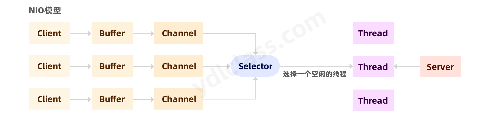
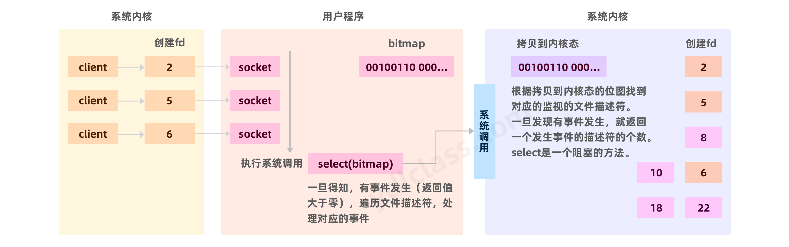
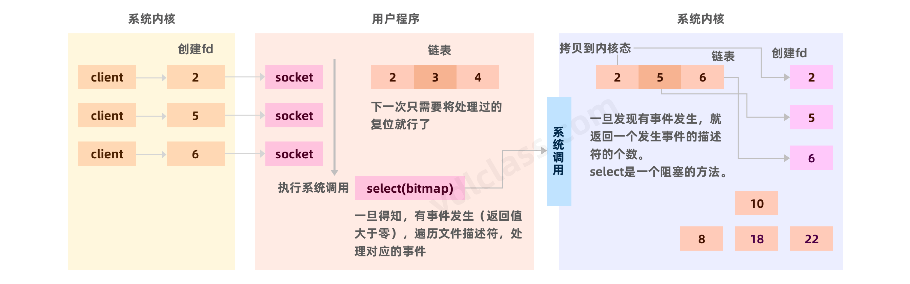
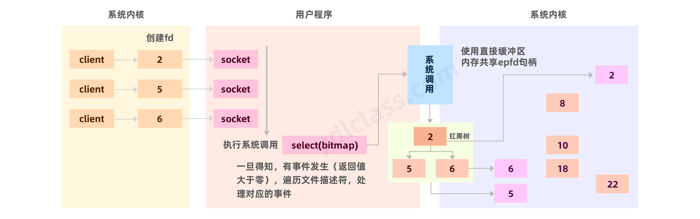

---
# 当前页面内容标题
title: Nio
# 当前页面图标
icon: IO
# 分类
category:
  - javase
  - nio
# 标签
tag:
  - javase
sticky: false
# 是否收藏在博客主题的文章列表中，当填入数字时，数字越大，排名越靠前。
star: false
# 是否将该文章添加至文章列表中
article: false
# 是否将该文章添加至时间线中
timeline: false
---

## 一、NIO简介

1）Java BIO ： 同步并阻塞(传统阻塞型)，服务器实现模式为一个连接一个线程，即客户端有连接请求时服务器端就需要启动一个线程进行处理，如果这个连接不做任何事情会造成不必要的线程开销。


2）Java NIO ： 同步非阻塞，服务器实现模式为一个线程处理多个请求(连接)，即客户端发送的连接请求都会注册到多路复用器上，多路复用器轮询到连接有I/O请求就进行处理。



## 二、操作系统的几个概念

### 1、内核态和用户态

内核态：cpu可以访问内存的所有数据，包括外围设备，例如硬盘，网卡，CUP也可以将自己从一个程序切换到另一个程序。

用户态：只能受限的访问内存，且不允许访问外围设备，占用CPU的能力被剥夺。

> 为什么要有用户态和内核态？

由于需要限制不同的程序之间的访问能力, 防止他们获取别的程序的内存数据, 或者获取外围设备的数据, 并发送到网络, CPU划分出两个权限等级 -- 用户态和内核态。

> 什么时候会发生内核态和用户态的切换？

【用户态在需要申请外部资源的时候会切换至内核态】。比如执行系统调用、发生中断、异常等，内核态执行完成会回退至用户态。

### 2、系统调用

 由操作系统实现提供的所有系统调用所构成的集合即程序接口或应用编程接口(Application Programming Interface，API)。【应用程序】同系统之间的接口。

 系统调用是操作系统开发的接口，开发者可以使用【系统调用】获取系统资源。就是操作系统的代码开放了一些接口让你使用，比如创建个文件，读取个文件。

> 常见的系统调用如下：

1、和进程、线程相关 fork创建一个子进程

2、文件相关的 creat chmod chown read从一个文件描述符中读取内容 write——向一个文件描述符中写入内容 close——关闭文件描述符

3、设备相关的 read write

4、信息相关的 get...

5、通信相关的 pipe

> 文件描述符

比如我们执行系统调用，常见文件，打开文件等。

```c
int open(const char *pathname, int flags);
int open(const char *pathname, int flags, mode_t mode);
int creat(const char *pathname, mode_t mode);
```

flags：

```
O_RDONLY          以只读方式打开文件
O_WRONLY         以只写方式打开文件
O_RDWR              以读和写的方式打开文件
上面三个只能选择一个，下面的可以合理的任意组合：
O_CREAT             打开文件，如果文件不存在则建立文件
O_APPEND           强制write()从文件尾开始
```

mode：参数可选：

```c
#define S_IRWXU 00700     文件所有者可读可写可执行
#define S_IRUSR 00400     文件所有者可读
#define S_IWUSR 00200     文件所有者可写
#define S_IXUSR 00100     文件所有者可执行
#define S_IRWXG 00070     文件用户组可写可读可执行
#define S_IRGRP 00040     文件用户组可读
#define S_IWGRP 00020     文件用户组可写
#define S_IXGRP 00010     文件用户组可执行
#define S_IRWXO 00007     其他用户可写可读可执行
#define S_IROTH 00004     其他用户可读
#define S_IWOTH 00002     其他用户可写
```

我们发现这两个系统调用（函数）有一个int类型的返回值，这个返回值就是文件描述符。

如同：

```java
File file = new File("D://a.txt");
```

中的file。

### 3、系统中断


> 中断的分类：

【中断源】是指能够引起中断的原因。一台【处理器】可能有很多中断源,但按其性质和处理方法,大致可分为如下五类：

1. 机器故障中断，比如掉电。 
2. 程序性中断。现行程序本身的异常事件引起的，可分为以下三种：一是程序性错误，非法操作和除数为零等；二是产生特殊的运算结果，例如定点溢出；三是程序出现某些预先确定要跟踪的事件，跟踪操作主要用于**程序调试**。有些机器把程序性中断称为“异常”，不称为中断。
3. IO－【输出设备】中断，IO中断。
4. 外中断。来自控制台【中断开关】、计时器、时钟或其他设备，这类中断的处理较简单，实时性强。
5. 调用管理程序。用户程序利用专用指令“调用管理程序”发【中断请求】，是用户程序和操作系统之间的联系桥梁。

> 系统中断有什么好处：

1、分时操作，解决CPU的快速处理和慢速IO设备的问题。

2、实时处理，word中可以一边打字一边做拼写检查。

3、故障处理，会优先处理故障。

### 4、DMA

 DMA(Direct Memory Access，直接存储器访问) ，它允许不同速度的硬件装置来沟通，而不需要依赖于[ CPU ]([https://baike.baidu.com/item/](https://baike.baidu.com/item/) CPU /120556)的大量中断负载。否则，CPU 需要从来源把每一片段的资料复制到暂存器，然后把它们再次写回到新的地方。在这个时间中，CPU 对于其他的工作来说就无法使用。

 当CPU需要访问外设（磁盘、网卡、usb）的数据时，将任务丢给DMA，有DMA负责利用总线将数据先拷贝到内存，DMA传输前，CPU要把总线控制权交给DMA控制器，而在结束DMA传输后，DMA控制器应立即把总线控制权再交回给CPU。传输结束后，发出中断信号，通知CPU。


### 5、数据结构位图bitmap：

有一个场景：需要你统计你的同事的一个月的打卡记录。

你要怎么做，创建三十几个变量，0代表没打卡，1代表已打卡？

事实上我们使用一个int能表示：

```text
11111111 10101111 11111111 11111110
```

 一个int四个字节，就是三十二位，从第0位开始算第一天的打卡记录，那么有三十二位足够了，因为一个月最多也就31天。

 我们能很简单的看出他第10天和12天没有打卡。

## 三、NIO相关的系统调用

 首先，每个客户端连接在Linux系统下，都有一个文件描述符fd与之对应，文件描述符有一个编号，不同的编号表示不同的连接。

### 1、select系统调用

 select系统调用有一个重要参数，为fd文件描述符集合，即你要监听哪些文件描述符（哪些连接），这个文件描述符集合rset用一个bitmap位图表示，位图大小为1024，即最多只能监听1024个客户端连接。

 当发起系统调用时，会将rset拷贝到内核态，然后内核态监听有没有数据可以处理，监听的所有文件描述符都没有数据的话会一直阻塞，直到有数据时，将有数据的fd索引置一，然后返回给用户态

Select缺点：

- 位图大小默认1024，有上限。
- 每次都需要创建一个文件描述符位图并拷贝到内核态。

```c
int select(int nfds, fd_set *readfds, fd_set *writefds,
                  fd_set *exceptfds, struct timeval *timeout);
```

1. nfds：要检测的文件描述符数量，最大文件描述符加1。
2. readfds：指定了被读监控的文件描述符集；
3. writefds：指定了被写监控的文件描述符集；
4. exceptfds：指定了被例外条件监控的文件描述符集；
5. timeout：超时时间。

readfds是个长度为1024的bitmap。我们都知道fd文件描述符有一个序号，

如果现在我监听3，6，8号的fd，那么位图就是：

```text
...10100100
```

那么select的具体流程是什么呢？

1、应用程序创建socket，生成文件描述符，并生成bitmap，使用hash的方式将bitmap的对应位置置一。

2、执行系统调用，将bitmap拷贝至内核空间，根据bitmap遍历对应的文件描述符，一旦有事件产生就返回。

3、用户程序遍历文件描述符，处理请求。

4、应用程序不停的调用select即可。



select模型已经很不错了，但是依然有不足的地方：

1. bitmap位图上限是1024，所以能监控的fd最多也就这么多。
2. fset位图不可重用，每次赋值全部清零，状态全部丢失。
3. fset位图需要不断的进行用户空间到内核空间的拷贝。
4. 每次查找时间复杂度都是O(n)。

说句实话，如果没有更好的选择方案，这都不是问题。

### 2、Poll系统调用

 Poll工作原理与Select基本相同，不同的只是将位图数组改成数组，也有资料说是链表，没有了最大连接数1024的限制，依然有fd集合的拷贝和O(n)的遍历过程。



```c
 int poll(struct pollfd *fds, nfds_t nfds, int timeout);
```

这个系统调用的

1. fds：存放需要被检测状态的套接字描述符，与select不同（select在调用之后会清空这个数组），每当调用这个数组，系统不会清空这个数组，而是存放revents状态变化描述符变量，这样才做起来很方便。
2. nfds：用于标记数组fd中struct pollfd结构元素的总数量。
3. timeout：是超时时间。
4. 返回值大于零表示成功，返回满足条件的文件描述符的个数

返回值等于零，表示超时。

返回值等于 -1 发生错误，比如描述符不合法，接受到中断信号，内存不足

被检测的套接字使用结构体封装，如下：

```cpp
struct pollfd {
    int   fd;         /* file descriptor */
    short events;     /* requested events */
    short revents;    /* returned events */
};
```

> pollfd

1. fd 文件描述符
2. events 请求的事件
3. revents 返回的事件

> 事件的类型比如：

1. pollin表示文件有数据来、文件描述符可读
2. pollout表示文件可写
3. pollerr表示错误发生

poll的优势：

1、大量的 fd的数组被整体复制于用户态和内核地址空间之间，而不管这样的复制是不是有意义。

2、 可重用

### 3、Epoll系统调用

 为解决fd集合拷贝的问题，epoll采用用户态和内核态共享epoll_fds集合。当调用epoll_wait系统调用时，内核态会去检查有哪些fd有事件，检查完毕后会将共享的epoll_fds集合重排序，将有事件的fd放在前面，并返回有事件的fd个数。

 客户端收到返回的个数，就不需要全部遍历，而是直接处理fd。

```c
1、int epoll_create(int size);

#注意：size参数只是告诉内核这个 epoll对象会处理的事件大致数目，而不是能够处理的事件的最大个数。在 Linux最新的一些内核版本的实现中，#这个 size参数没有任何意义。

2、int epoll_ctl(int epfd, int op, int fd, struct epoll_event *event);

#epoll的事件注册函数，epoll_ctl向 epoll对象中添加、修改或者删除感兴趣的事件，返回0表示成功，否则返回–1，此时需要根据errno错误码##判断错误类型。

#它不同与select()是在监听事件时告诉内核要监听什么类型的事件，而是在这里先注册要监听的事件类型。


3、int epoll_wait(int epfd, struct epoll_event * events, int maxevents, int timeout);

epoll_wait方法返回的事件必然是通过 epoll_ctl添加到 epoll中的。
#第一个参数是epoll_create()的返回值，
#第二个参数表示动作，用三个宏来表示：
#EPOLL_CTL_ADD：注册新的fd到epfd中；
#EPOLL_CTL_MOD：修改已经注册的fd的监听事件；
#EPOLL_CTL_DEL：从epfd中删除一个fd；
#第三个参数是需要监听的fd，第四个参数是告诉内核需要监听什么事
```

处理流程大致如下：



小案例：

```c
 #define MAX_EVENTS 10
struct epoll_event ev, events[MAX_EVENTS];
int listen_sock, conn_sock, nfds, epollfd;

/* Code to set up listening socket, 'listen_sock',
              (socket(), bind(), listen()) omitted */
// 招一个小弟
epollfd = epoll_create1(0);
if (epollfd == -1) {
    perror("epoll_create1");
    exit(EXIT_FAILURE);
}

ev.events = EPOLLIN;
ev.data.fd = listen_sock;

// 谁有什么事先和小弟说
if (epoll_ctl(epollfd, EPOLL_CTL_ADD, listen_sock, &ev) == -1) {
    perror("epoll_ctl: listen_sock");
    exit(EXIT_FAILURE);
}

for (;;) {
    // 老板在那里等小弟的回应，有回应就去处理
    nfds = epoll_wait(epollfd, events, MAX_EVENTS, -1);
    if (nfds == -1) {
        perror("epoll_wait");
        exit(EXIT_FAILURE);
    }

    for (n = 0; n < nfds; ++n) {
        if (events[n].data.fd == listen_sock) {
            conn_sock = accept(listen_sock,
                               (struct sockaddr *) &addr, &addrlen);
            if (conn_sock == -1) {
                perror("accept");
                exit(EXIT_FAILURE);
            }
            setnonblocking(conn_sock);
            ev.events = EPOLLIN | EPOLLET;
            ev.data.fd = conn_sock;
            if (epoll_ctl(epollfd, EPOLL_CTL_ADD, conn_sock,
                          &ev) == -1) {
                perror("epoll_ctl: conn_sock");
                exit(EXIT_FAILURE);
            }
        } else {
            do_use_fd(events[n].data.fd);
        }
    }
}
```

1. 重排相当于置位，每次会把有事件发生的fd排在前边
2. 没有靠背开销，共享内存。
3. o(1)复杂度。

## 四、Java的NIO编程

Java NIO三大核心部分：

1. Buffer（缓冲区）：每个客户端连接都会对应一个Buffer，读写数据通过缓冲区读写。
2. Channel（通道）：每个Channel用于连接Buffer和Selector，通道可以进行双向读写。
3. Selector（选择器）：一个选择器可以对应多个通道，用于监听多个通道的事件。Selector可以监听所有的Channel是否有数据需要读取，当某个Channel有数据时，就去处理，所有Channel都没有数据时，线程可以去执行其他任务。

### 1、Buffer

```java
public static void main(String[] args) {
    //创建一个Int型的buffer，大小为5。相当于创建了一个大小为5的int数组
    IntBuffer buffer = IntBuffer.allocate(5);
    //往buffer中添加数据
    for (int i = 0; i < buffer.capacity(); i++) {
        buffer.put(i*2);
    }

    //buffer读写切换，之前为写数据，调用flip后切换为读
    buffer.flip();

    //读取数据
    while (buffer.hasRemaining()){
        System.out.println(buffer.get());
    }
}
```

Buffer使用最多的是ByteBuffer，因为在网路传输中一般使用字节传输。

### 2、Channel

NIO的Channel通道类似于流，但是通道可以同时读写，而流只能读或写。

Channel只是一个接口，里面有各种实现类。

通过FileChannel和ByteBuffer将数据写入文件。

```java
public static void main(String[] args) throws IOException {
    //创建一个文件输出流
    FileOutputStream fileOutputStream = new FileOutputStream("a.txt");
    //通过文件输出流得到一个FileChannel
    FileChannel fileChannel = fileOutputStream.getChannel();
    //创建一个buffer并写入数据
    ByteBuffer buffer = ByteBuffer.allocate(1024);
    buffer.put("hello".getBytes());
    buffer.flip();  //反转，让指针指向数组开头

    //将Buffer中数据写入FileChannel中
    fileChannel.write(buffer);
    fileOutputStream.close();
}
```

### 3、Selector

Selector能够检测多个注册的通道上是否有事件发生(注意:多个Channel以事件的方式可以注册到同一个Selector)，如果有事件发生，便获取事件，然后针对每个事件进行相应的处理。这样就可以只用一个单线程去管理多个通道，也就是管理多个连接和请求。

只有在 连接/通道 真正有读写事件发生时，才会进行读写，就大大地减少了系统开销，并且不必为每个连接都创建一个线程，不用去维护多个线程。

步骤：

1. 当客户端连接时，会通过ServerSocketChannel得到SocketChannel。
2. 将SocketChannel注册到Selector上，一个Selector可以注册多个SocketChannel。
3. 注册后会返回一个SelectionKey，会和该Selector关联（加入到集合中）。
4. Selector进行监听select方法，返回有事件发生的通道的个数。
5. 进一步得到各个有事件发生的SelectionKey。
6. 通过SelectionKey反向获取SocketChannel，然后获取Channel的事件类型，并处理Selector通过管理SelectionKey的集合从而去监听各个Channel。

```java
public class NioServer {

    public static void main(String[] args) throws IOException {
        // 建立一个serversocketchannel
        ServerSocketChannel sever = ServerSocketChannel.open();
        // 非阻塞的通道的配置
        sever.configureBlocking(false);
        // 绑定端口
        sever.bind(new InetSocketAddress(6666));
        // 创建一个selector
        Selector selector = Selector.open();
        // 感兴趣的事情
        sever.register(selector, SelectionKey.OP_ACCEPT);

        while (true){
            // 如果返回零，没有消息,阻塞的方法
            int select = selector.select();
            if (select == 0){
                continue;
            }
            // 拿到所有的事件
            Set<SelectionKey> selectionKeys = selector.selectedKeys();
            Iterator<SelectionKey> iterator = selectionKeys.iterator();
            while (iterator.hasNext()){
                // 拿到这个事件
                SelectionKey key = iterator.next();
                if(key.isAcceptable()){
                    System.out.println("有人连我了！");
                    // 三次握手简历tcp连接
                    SocketChannel accept = sever.accept();
                    accept.configureBlocking(false);
                    // 建立好连接以后，注册到selector
                    accept.register(selector,SelectionKey.OP_READ, ByteBuffer.allocate(1024));
                }

                if (key.isReadable()){
                    SocketChannel channel = (SocketChannel)key.channel();
                    ByteBuffer buffer = (ByteBuffer)key.attachment();
                    channel.read(buffer);
                    System.out.println(new String(buffer.array(),0,buffer.position()));
                    buffer.clear();
                }
                iterator.remove();
            }

        }
        
    }
}
public class NioClient {
    public static void main(String[] args) throws IOException {
        SocketChannel socketChannel = SocketChannel.open();
        // 连接一个服务器
        socketChannel.connect(new InetSocketAddress(6666));
        if(socketChannel.finishConnect()){
            while (true){
                Scanner scanner = new Scanner(System.in);
                String next = scanner.next();
                ByteBuffer wrap = ByteBuffer.wrap(next.getBytes());
                socketChannel.write(wrap);
            }
        }

    }
}
```

MappedByteBuffer：可以让文件直接在内存（堆外内存）中修改，不需要操作系统拷贝一次。

```java
public static void main(String[] args) throws IOException {
    //读取文件，能进行读写
    RandomAccessFile randomAccessFile = new RandomAccessFile("a.txt", "rw");
    FileChannel channel = randomAccessFile.getChannel();
    /**
 * 参数一：使用的模式（读写模式）
 * 参数二：可以直接修改的起始位置
 * 参数三：能修改的大小，最多能修改多少字节
 */
    //获取MappedByteBuffer对象
    MappedByteBuffer mBuffer = channel.map(FileChannel.MapMode.READ_WRITE, 0, 5);
    //修改buffer中内容，修改后直接修改了文件内容
    mBuffer.put(0, (byte)'H');
    randomAccessFile.close();
}
```
