---
# 当前页面内容标题
title: 常用api
# 当前页面图标
icon: api
# 分类
category:
  - javase
  - api
# 标签
tag:
  - javase
sticky: false
# 是否收藏在博客主题的文章列表中，当填入数字时，数字越大，排名越靠前。
star: false
# 是否将该文章添加至文章列表中
article: false
# 是否将该文章添加至时间线中
timeline: false
---

## 一、api是什么

（1）概述

 API（Application Programming Interface）应用程序接口，是一些预先定义的接口。我们现在理解接口课程很狭隘，因为jdk中本身就有接口的概念。

 其实我们类的方法，接口的方法在宏观上都能称之为接口。

（2）api文档

 我们现在可以狭义的去理解它，就是一个文档，描述了jdk内置类的说明。

 文档地址：<https://www.matools.com/api/java8>

 在学习这一章节的时候，千万不要陷入记忆的魔障，api文档不是用来背的，是用来查的。我们要做到心中大概知道有一个类能实现某一类方法就好了，剩下的我们在使用的时候去查阅就好了。

（3）idea打包api doc

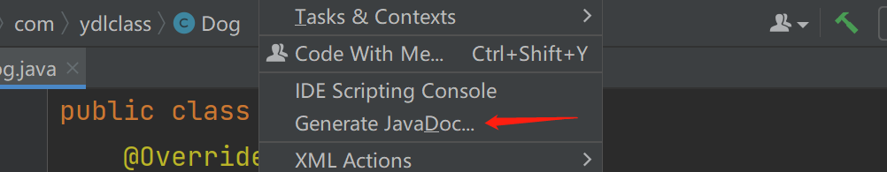

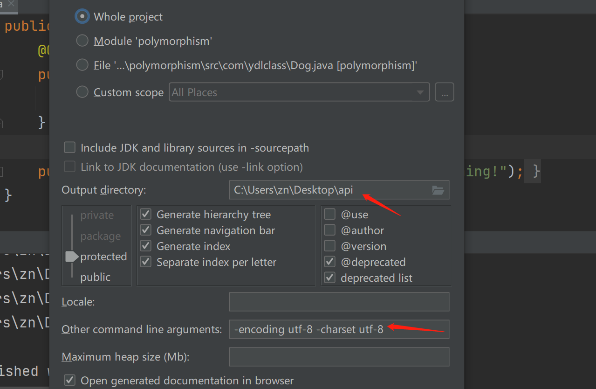

为了防止乱码

```java
-encoding utf-8 -charset utf-8
```

## 二、时间相关api

#### 概述

学习时间类我们先要了解两个概念：

1、时间：需要解释的吗？就是1991年4月8日12点12分40秒，时间会因为时区的不同而不同。

2、时区：都学过，都知道东八区吧！

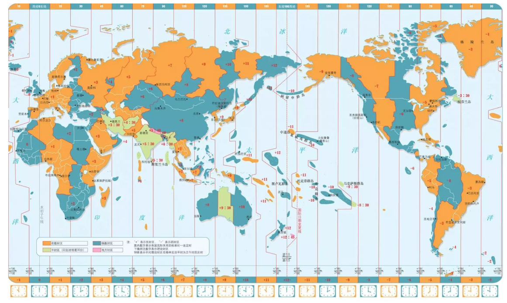


2、时间戳：时间戳是指格林威治时间1970年01月01日00时00分00秒(北京时间1970年01月01日08时00分00秒)起至现在的总毫秒数。时间戳在全世界都是固定的。

格林尼治标（英国伦敦郊区的皇家格林尼治天文台的标准时间）准时间的正午是指当太阳横穿格林尼治子午线时（也就是在格林尼治时）的时间。因为本初子午线被定义在通过那里的经线。

```java
System.currentTimeMillis();
```


我们思考，java中一切皆对象，那时间也是对象，时区也是对象，但时间戳只是个毫秒数，就是个Long类型的数字。

### 1、Date

####  （1）初步使用

```java
// 不能引入错误的包哈
import java.util.Date;
public class DateTest {
    public static void main(String[] args) {
        Date date = new Date();
        System.out.println(date);
    }
}

结果：
Mon Aug 09 15:46:13 GMT+08:00 2021
// 这是美国表示时间的方法
```

**GMT**(Greenwich Mean Time)是格林尼治标准时间 ，格林尼治标准时间的正午是指当太阳横穿格林尼治子午线时（也就是在格林尼治时）的时间。

+08:00 就是北京时间，这是时间区域的标示，用以区别时间，以英国格林威治标准时间为基准，台湾,香港,中国为往东8个时区。

#### （2）构造方法

```java
Date()
```

创建一个当时的时间对象，就是new的那一瞬间，精确到毫秒。

```java
Date(long date)
```

创建一个时间对象，需要传入一个时间戳，代表时间戳表示的时间。

其实我们能看到，Date中的很多的构造器已经被启用了，只留下几个常用的。但是我们不能否认Date是十分常用的一个类。我会给大家介绍时间api的演进。

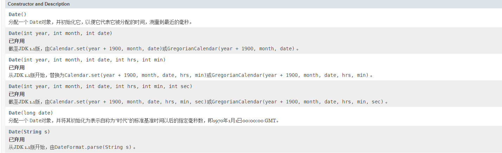

#### （3）常用方法

```java
boolean after(Date when)
```

测试此日期是否在指定日期之后

```java
boolean before(Date when)
```

测试此日期是否在指定日期之前

```java
getTime()
```

返回自1970年1月1日以来，由此 Date对象表示的00:00:00 GMT的毫秒数

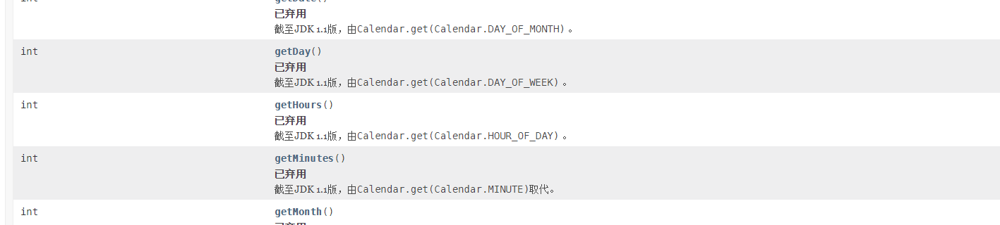

其实我们要学习的最重要的是看文档的能力。

小作业（案例）：

仅仅使用Date类，计算七天后是哪一天：

```java
Date date = new Date(System.currentTimeMillis() + 7*24*60*60*1000);
System.out.println(date);
```

### 2、Calendar

#### （1）简介

一个相对比较新的日期类，Calendar是一个抽象类，它本身就是日历的意思

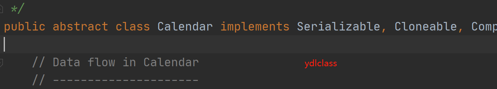

#### （2）初始化

- Calendar类是一个日历抽象类，提供了一组对“年月日时分秒星期”等日期信息的操作的函数，并针对不同国家和地区的日历提供了相应的子类，即本地化。比如公历GregorianCalendar，佛历BuddhistCalendar，日本帝国历JapaneseImperialCalendar等。
- 从JDK1.1版本开始，在处理日期和时间时，系统推荐使用Calendar类进行实现(Date的一些方法都过时了)。在设计上，Calendar类的功能要比Date类强大很多，而且在实现方式上也比Date类要复杂一些，下面就介绍一下Calendar类的使用。 

我们看一下源代码：

```java
public static Calendar getInstance(TimeZone zone,
                                       Locale aLocale)
    {
        return createCalendar(zone, aLocale);
    }

    private static Calendar createCalendar(TimeZone zone,
                                           Locale aLocale)
    {
	......

        if (aLocale.hasExtensions()) {
            String caltype = aLocale.getUnicodeLocaleType("ca");
            if (caltype != null) {
                switch (caltype) {
                case "buddhist":
                        // BuddhistCalendar
                cal = new BuddhistCalendar(zone, aLocale);
                    break;
                case "japanese":
                        // 日本帝国历
                    cal = new JapaneseImperialCalendar(zone, aLocale);
                    break;
                case "gregory":
                        // 公历
                    cal = new GregorianCalendar(zone, aLocale);
                    break;
                }
            }
        }
    .....
    }
```

由以上代码我们也能知道，我们可以通过子类直接构造：

```java
Calendar calendar = new GregorianCalendar(); 
Calendar calendar = new BuddhistCalendar(); 
```

#### （3）常用的方法

记住看文档，其实我们不妨也多去思考一下，日历有什么功能啊：

获得年、月、日？设置年、月、日？比较两个日期，看看星期几？其实这个类的方法特别多。

```java
calendar.get(int field)
```

 用来获取实例化的Calendar对象储存的“年月日时分秒星期”等等信息。方法的参数通过Calendar.XXXX的形式填写，比如要想获取年份信息就用Calendar.YEAR、月份Calendar.MONTH、日期Calendar.Date、时Calendar.HOUR、分Calendar.MINUTE、秒Calendar.SECOND等等。

其实参数就是一堆静态常量，1、2、3...

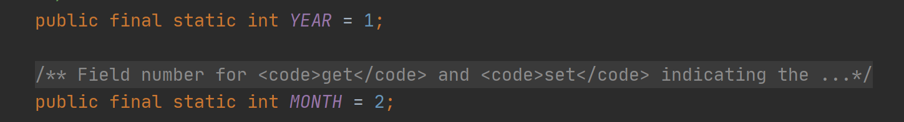

所以你使用`calendar.get(1)` 也是能够获取到年份的，我们这里就要体会了，静态常量能给我们带来什么好处，问你一下，这里把final去掉可以吗？

```java
calendar.set((int field, int value));
calendar.set(int year, int month, int date)
```

set方法有很多重载的方法，从api文档中我们也能看明白。

具体的参数 field 就是上边的Calendar.YEAR、Calendar.MONTH....

当然Calendar有非常多的方法：

我们可以预览一下：

```java
add(int field, int amount)
根据日历的规则，将指定的时间量添加或减去给定的日历字段。
    
after(Object when)
返回 Calendar是否 Calendar指定时间之后的时间 Object 。
    
before(Object when)
返回此 Calendar是否 Calendar指定的时间之前指定的时间 Object 。
    
Date getTime()
返回一个 Date表示此物体 Calendar的时间值（毫秒从偏移 Epoch “）。
    
long getTimeInMillis()
以毫秒为单位返回此日历的时间值。
    
TimeZone getTimeZone()
获取时区。
    
int getWeeksInWeekYear()
返回由这个 Calendar表示的星期内的星期 Calendar 。
    
int getWeekYear()
返回这个 Calendar 。
    
void setTime(Date date)
使用给定的 Date设置此日历的时间。
    
void setTimeInMillis(long millis)
从给定的长值设置此日历的当前时间。
    
void setTimeZone(TimeZone value)
以给定的时区值设置时区。
    
Instant toInstant()
将此对象转换为Instant 。
```

小例子，显示1949年10月1号的时间戳！

```java
Calendar calendar = Calendar.getInstance();
calendar.set(2019,10,1);
long timeInMillis = calendar.getTimeInMillis();
System.out.println(timeInMillis);

结果：1572599846380     
```

### 3、时区TimeZone

时区也是通过静态方法获取

```java
System.out.println(TimeZone.getDefault());
```

打印结果：

```java
sun.util.calendar.ZoneInfo[id="GMT+08:00",offset=28800000,dstSavings=0,useDaylight=false,transitions=0,lastRule=null]
```

| static String[] | getAvailableIDs()获取支持的所有可用ID。                      |
| --------------- | ------------------------------------------------------------ |
| static String[] | getAvailableIDs(int rawOffset)根据给定的时区偏移（以毫秒为单位）获取可用ID。 |
| static TimeZone | getDefault()获取Java虚拟机的默认值 `TimeZone` 。             |
| static TimeZone | getTimeZone(String ID)获取给定ID的 `TimeZone` 。             |
| static TimeZone | getTimeZone(ZoneId zoneId)获取 `TimeZone`对于给定 `zoneId` 。 |
| static void     | setDefault(TimeZone zone)设置 `TimeZone`由返回 `getDefault`方法。 |

比如现在想获取美国的时间：

注：美国本土横跨西五区至西八区，共四个时区，每个时区对应一个标准时间。以华盛顿的西五区为例，西五区的id就是（GMT-05:00）；

```java
public static void main(String[] args) {
    System.out.println(new Date());
    Calendar calendar = Calendar.getInstance();
    calendar.setTimeZone(TimeZone.getTimeZone("GMT-08:00"));
    System.out.println(calendar.get(Calendar.HOUR_OF_DAY));
}
```

> 结果：

```text
Mon Aug 09 18:20:12 GMT+08:00 2021
5
美国华盛顿的时间是5点，我们的是18点
```

### 4、ZoneId

ZoneId是指区域ID，可以这样表示 Europe/London Asia/Shanghai America/New_York Japan

也可以这样 GMT+8:00 也行

就是地区的表示方法

```java
Calendar calendar = Calendar.getInstance();
calendar.setTimeZone(TimeZone.getTimeZone("America/New_York"));
calendar.setTimeZone(TimeZone.getTimeZone(ZoneId.of("America/New_York")));
System.out.println(calendar);
```

### 5、simpleDateFormat

我们有这种需求，将时间显示成 1999年10月1号。

java给我们提供了时间的格式化器。

（2）构造方法

```java
SimpleDateFormat();
```

用默认的模式和默认语言环境的日期格式符号构造 `SimpleDateFormat`。

```java
SimpleDateFormat(String pattern); 
```

用给定的模式和日期符号构造 `SimpleDateFormat`。

以下示例显示了如何在美国语言环境中解释日期和时间模式。给定的日期和时间为美国太平洋时区的本地时间 2001-07-04 12:08:56。

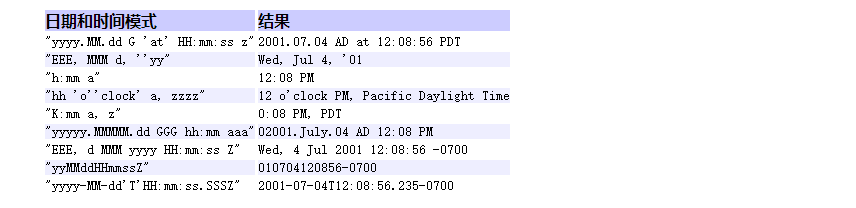

时间模式其实就是一种时间显示的格式：

从这张图中我们了解：

- yyyy 代表年 yy只显示后两位
- MM 代表月
- dd 代表日
- HH代表小时 24小时制 hh 12小时
- mm代表分钟
- ss代表秒

yyyy年MM月dd日 HH小时mm分ss秒 就是一种日期时间模式。

```java
public static void main(String[] args) {
    SimpleDateFormat simpleDateFormat = new SimpleDateFormat("yyyy年MM月dd日  HH小时mm分ss秒");
    String format = simpleDateFormat.format(new Date());
    System.out.println(format);
}
结果:2021年08月10日  18小时51分54秒
```

（3）主要方法

```java
applyPattern(String pattern) 
```

给定的模式字符串应用于此日期格式。

```java
String format(Date date) 
```

将日期格式化成日期/时间字符串。–进行了重写

```java
Date parse(String source) 
```

从给定字符串的开始解析文本以生成日期。–进行了重写

小案例，写一个工具类，能够将时间和字符优雅转化：

## 三、jdk8的时间类

 在JDK8之前，处理日期时间，我们用的都是上边几个类，所谓百足之虫死而不僵，即使上边几个类的方法大面积过时，同时还存在一些问题，比如`SimpleDateFormat` 不是线程安全的，比如 `Date` 和 `Calendar` 获取到的月份是0到11，而不是现实生活中的1到12，我们还是能在绝大部分代码中看到它的影子。

 阿里巴巴规约中这样说，如果是jdk8的应用，可以使用`Instant`代替`date`，`LocalDateTime`代替`Canlendar`，`DateTimeFormatter`代替`SimpleDateFormat`。

我们今天就从以下几个类讲讲新的时间类，主要是下面几个：

1. **Instant**
2. **LocalDate**
3. **LocalTime**
4. **LocalDateTime**
5. **DateTimeFormatter**

### 1、Instant

在时间线上的瞬间点。

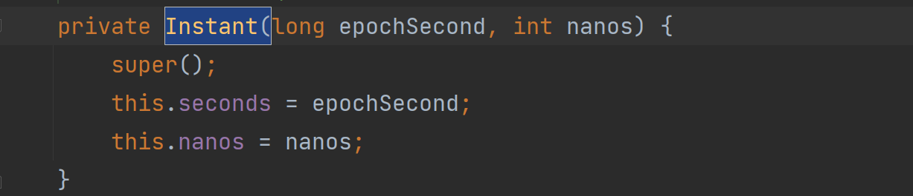

我们会发现，这货又将构造器私有化了。

#### （1）构造一个Instant

事实上它给我们提供了很多静态方法，方便我们使用：

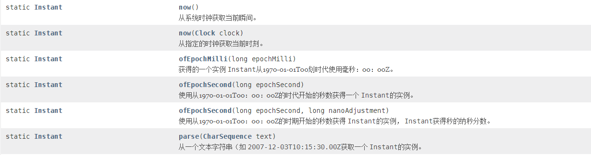

既然`Instant`可以代替`Date`类，那它肯定可以获取当前时间：

```java
Instant instant = Instant.now();
System.out.println(instant);

2021-08-11T06:24:42.051Z
```

细心的你会发现，这个时间比北京时间少了8个小时，如果要输出北京时间，可以加上默认时区：

```java
System.out.println(instant.atZone(ZoneId.systemDefault()));

2021-08-11T14:24:15.025+08:00[GMT+08:00]
```

#### （2）获取时间戳

```java
Instant instant = Instant.now();

// 当前时间戳:单位为秒
System.out.println(instant.getEpochSecond());
// 当前时间戳:单位为毫秒
System.out.println(instant.toEpochMilli());
```

当然，也可以通过`System.currentTimeMillis()`获取当前毫秒数。

#### （3）将时间戳转换为Instant

根据秒数时间戳转换：

```java
Instant instant = Instant.now();
System.out.println(instant);

long epochSecond = instant.getEpochSecond();
System.out.println(Instant.ofEpochSecond(epochSecond));
System.out.println(Instant.ofEpochSecond(epochSecond, instant.getNano()));
```

根据毫秒数时间戳转换：

```java
Instant instant = Instant.now();
System.out.println(instant);

long epochMilli = instant.toEpochMilli();
System.out.println(Instant.ofEpochMilli(epochMilli));
```

#### （4）将表达式转换为Instant

```java
String text = "2020-06-10T08:46:55.967Z";
Instant parseInstant = Instant.parse(text);
System.out.println("秒时间戳:" + parseInstant.getEpochSecond());
System.out.println("毫秒时间戳:" + parseInstant.toEpochMilli());
System.out.println("纳秒:" + parseInstant.getNano());
```

Instant给我们提供了非常多的实用的方法，我们要独自尝试。

### 2、Duration

Duration（持续时间）是TemporalAmount（时间量）的子类。

主要用在，instant的日期计算

```java
Instant instant = Instant.now();
// 当前的时间加五天
Instant plus = instant.plus(Duration.ofDays(5));
System.out.println(LocalDateTime.ofInstant(plus,ZoneId.systemDefault()));
```

我们可以轻易的通过of方法获取一段持续的时间，用来做计算。

```java
Duration.ofDays(3);
Duration.ofHours(3);
Duration.ofMinutes(3);
Duration.ofSeconds(3);
Duration.ofMillis(3);

// 次方法时通用的，第一个参数是数字，第二个是单位，ChronoUnit是一个枚举类，就是枚举了一堆的时间单位：年月日时分秒。
Duration.of(3, ChronoUnit.YEARS);
```

### 3、LocalDate

#### （1）获取当前日期

使用`LocalDate`获取当前日期非常简单，如下所示：

```java
System.out.println("LocalDate.now() = " + LocalDate.now());

LocalDate.now() = 2021-08-11
```

不用任何格式化，输出结果就非常友好，如果使用`Date`，输出这样的格式，还得配合`SimpleDateFormat`指定`yyyy-MM-dd`进行格式化。

#### （2）获取年月日

```java
LocalDate today = LocalDate.now();
System.out.println("today.getYear() = " + today.getYear());
System.out.println("today.getDayOfWeek() = " + today.getDayOfWeek());
System.out.println("today.getMonth() = " + today.getMonth());


today.getYear() = 2021
today.getDayOfWeek() = WEDNESDAY
today.getMonth() = AUGUST
Month month = today.getMonth();
System.out.println(month.getValue());
```

我们发现Month是一个枚举类，而且LocalDate的月份居然是从1开始的，从此月份的困扰就解决了。

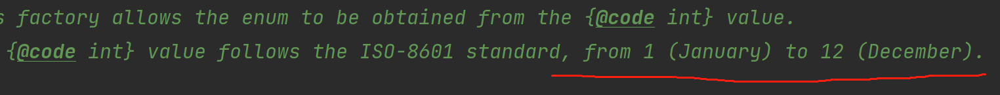

#### （3）指定日期

```java
LocalDate birthday = LocalDate.of(1991,7, 16);
System.out.println("birthday: " + birthday);
```

> 如果确定月份，推荐使用另一个重载方法，使用枚举指定月份：

```java
LocalDate specifiedDate = LocalDate.of(1991, Month.JULY, 16);
```

#### （4）比较日期是否相等

```java
LocalDate localDate1 = LocalDate.now();
LocalDate localDate2 = LocalDate.of(1991,7,16);
if (localDate1.equals(localDate2)) {
    System.out.println("localDate1 equals localDate2");
}
```

#### （5）获取日期是本周/本月/本年的第几天

```java
LocalDate today = LocalDate.now();

System.out.println("Today:" + today);
System.out.println("Today is:" + today.getDayOfWeek());
System.out.println("今天是本周的第" + today.getDayOfWeek().getValue() + "天");
System.out.println("今天是本月的第" + today.getDayOfMonth() + "天");
System.out.println("今天是本年的第" + today.getDayOfYear() + "天");
```

#### （6）判断是否为闰年

```java
LocalDate today = LocalDate.now();
System.out.println(today.getYear() + " is leap year:" + today.isLeapYear());
```

### 4、LocalTime

见名知意，上一个是本地日期，而这里是本地时间。

### 5、LocalDateTime

见名知意，自学吧，都一样。

### 6、DateTimeFormatter

JDK8中推出了`java.time.format.DateTimeFormatter`来处理日期格式化问题，《阿里巴巴Java开发手册》中也是建议使用`DateTimeFormatter`代替`SimpleDateFormat`，因为SimpleDateFormate不是线程安全的。

```java
LocalDate today = LocalDate.now();
DateTimeFormatter dateTimeFormatter = DateTimeFormatter.ofPattern("yyyy年MM月dd日");

String format = today.format(dateTimeFormatter);
System.out.println(format);

2021年08月11日
```

LocalTime和 LocalDateTime自行脑补，DateTimeFormatter同时给我们提供了很多国际时间格式化的规则，自己看看就行了。

```text
LocalDateTime today = LocalDateTime.now();
DateTimeFormatter dateTimeFormatter = DateTimeFormatter.ISO_DATE_TIME;

String format = today.format(dateTimeFormatter);
System.out.println(format);

2021-08-11T14:55:08.259
```

### 7. 类型相互转换

#### （1）Instant和Date

JDK8中，`Date`新增了`from()`方法，将`Instant`转换为`Date`，代码如下所示：

```java
Date date = Date.from(instant);
Instant dateToInstant = date.toInstant();
```

#### （2）Instance和LocalDateTime

```java
LocalDateTime localDateTime = LocalDateTime.ofInstant(instant)
Instant instant1 = LocalDateTime.now().toInstant(ZoneOffset.UTC);
```

#### （3）Date和LocalDateTime

```java
Date date = new Date();
Instant instant = date.toInstant();
LocalDateTime localDateTimeOfInstant = LocalDateTime.ofInstant(instant, ZoneId.systemDefault());
LocalDateTime localDateTime = LocalDateTime.now();
Instant toInstant = localDateTime.atZone(ZoneId.systemDefault()).toInstant();
Date dateFromInstant = Date.from(toInstant);
```

## 四、数学类

### 1、Math

```java
System.out.println(Math.E); // 比任何其他值都更接近 e（即自然对数的底数）的 doubl
System.out.println(Math.PI); // 比任何其他值都更接近 pi（即圆的周长与直径之比）的 d
System.out.println(Math.max(1, 2)); // 输出2
System.out.println(Math.min(1.9, -0.2)); // 输出-0.2
System.out.println((int) (Math.random() * 100)); // 输出[0,100
// ceil(a) 返回大于a的第一个整数所对应的浮点数(值是整的，类型是浮点型)
// 可以通过强制转换将类型换成整型
System.out.println(Math.ceil(1.3443)); // 输出2.0
System.out.println((int) Math.ceil(1.3443)); // 输出2
// floor(a) 返回小于a的第一个整数所对应的浮点数(值是整的，类型是浮点型)
System.out.println(Math.floor(1.3443)); // 输出1.0
// rint(a) 返回最接近a的整数的double值
System.out.println(Math.rint(1.2)); // 输出1.0
System.out.println(Math.rint(1.8)); // 输出2.0
System.out.println(Math.sqrt(4.0)); // 输出2.0
System.out.println(Math.cbrt(8.0)); // 输出2.0
System.out.println(Math.abs(-10)); // 输出10
```

这个类其实超级简单但是不用背诵啊，只要我们能想到的和数学有关系的代码，我们都可以在Math中找一找，说不定就会有收获啊。

### 2、BigDecimal

#### （1）为什么不能用double表示钱

 因为浮点数不能准确代表我们用于货币的基数10的倍数。这个问题不仅仅针对Java，而且还针对任何使用base 2浮点类型的编程语言。适用于几乎所有语言的解决方案是改用整数，然后计算分。例如，1025为$ 10.25。

- 举一个例子：钱，我们有一百块 五十块 十块 五块 一块 一毛 五毛 一分 ，不知道你见过两分没？
- 大于零的无所谓，但是一毛钱也就是0.1元，二进制是无法表示的，两毛也是，五毛倒是可以，一分又不行了。 至于为什么，我们之前讲浮点数的时候讲过。

 在商业计算中要用java.math.BigDecimal。BigDecimal所创建的是对象，我们不能使用传统的+、-、*、/等算术运算符直接对其对象进行数学运算，而必须调用其相对应的方法。方法中的参数也必须是BigDecimal的对象。

 十进制整数在转化成二进制数时不会有精度问题，那么把十进制小数扩大N倍让它在整数的维度上进行计算，并保留相应的精度信息。所以本质是记录一个精度信息，使用正数进行计算，然后再转化为二进制数。

#### （2）构造器

BigDecimal 有很多重载的构造器，我们几乎可以将任何数字相关的类型转化为一个BigDecimal 对象。

| 构造器             |                                                  |
| ------------------ | ------------------------------------------------ |
| BigDecimal(int)    | 创建一个具有参数所指定整数值的对象。             |
| BigDecimal(double) | 创建一个具有参数所指定双精度值的对象。           |
| BigDecimal(long)   | 创建一个具有参数所指定长整数值的对象。           |
| BigDecimal(String) | 创建一个具有参数所指定以字符串表示的数值的对象。 |

#### （3）常用方法

BigDecimal提供了大量的计算方法，我们举几个例子

|            |                                                              |                                              |
| ---------- | ------------------------------------------------------------ | -------------------------------------------- |
| BigDecimal | add(BigDecimal)                                              | BigDecimal对象中的值相加，然后返回这个对象。 |
| BigDecimal | subtract(BigDecimal)                                         | BigDecimal对象中的值相减，然后返回这个对象。 |
| BigDecimal | multiply(BigDecimal)                                         | BigDecimal对象中的值相乘，然后返回这个对象。 |
| BigDecimal | divide(BigDecimal)                                           | BigDecimal对象中的值相除，然后返回这个对象。 |
| BigDecimal | **[max](https://www.matools.com/file/manual/jdk_api_1.8_google/java/math/BigDecimal.html#max-java.math.BigDecimal-)**([BigDecimal](https://www.matools.com/file/manual/jdk_api_1.8_google/java/math/BigDecimal.html) val) |                                              |
| BigDecimal | min(BigDecimal val)                                          |                                              |

我们可以从BigDecimal中获取对应的值：

| 返回值 | 方法          | 描述                                 |
| ------ | ------------- | ------------------------------------ |
| double | doubleValue() | 将BigDecimal对象中的值以双精度数返回 |
| float  | floatValue()  | 将BigDecimal对象中的值以单精度数返回 |
| long   | longValue()   | 将BigDecimal对象中的值以长整数返回   |
| int    | intValue()    | 将BigDecimal对象中的值以整数返回     |

### 3、Random类

Random类位于java.util.Random包下，是产生随机数的类。

当然 Math类的Random方法可以生成随机数

[https://blog.csdn.net/weixin_37730482/article/details/80664928](https://blog.csdn.net/weixin_37730482/article/details/80664928)

#### （1）构造方法

1. `Random()`：创建一个新的随机数生成器。

2. `Random(long seed)`：使用单个 long 种子创建一个新的随机数生成器。

我们可以在构造Random对象的时候指定种子。如：`Random r1 = new Random(20);`

也可以默认当前系统时间的毫秒数作为种子数:`Random r1 = new Random();`

#### （2）常用方法

1. `protected int next(int bits)`：生成下一个伪随机数。

2. `boolean nextBoolean()`：返回下一个伪随机数，它是取自此随机数生成器序列的均匀分布的boolean值。

3. `void nextBytes(byte[] bytes)`：生成随机字节并将其置于用户提供的 byte 数组中。

4. `double nextDouble()`：返回下一个伪随机数，它是取自此随机数生成器序列的、在0.0和1.0之间均匀分布的 double值。

5. `float nextFloat()`：返回下一个伪随机数，它是取自此随机数生成器序列的、在0.0和1.0之间均匀分布float值。

6. `double nextGaussian()`：返回下一个伪随机数，它是取自此随机数生成器序列的、呈高斯（“正态”）分布的double值，其平均值是0.0 标准差是1.0。

7. `int nextInt()`：返回下一个伪随机数，它是此随机数生成器的序列中均匀分布的 int 值。

8. `int nextInt(int n)`：返回一个伪随机数，它是取自此随机数生成器序列的、在（包括和指定值（不包括）之间均匀分布的int值。

9. `long nextLong()`：返回下一个伪随机数，它是取自此随机数生成器序列的均匀分布的 long 值。

#### （3）种子的作用

- 随机数是种子经过计算生成的。
- 不含參的构造函数每次都是【当前时间戳】作为种子，随机性更强。
- 而含参的构造函数其实是伪随机，更有预见性。

```java
public class SeedTest {
    public static void main(String[] args) {
        System.out.println("Random 不含参的构造方法：");
        for (int i = 0; i < 5; i++) {
            Random random = new Random();
            for (int j = 0; j < 8; j++) {
                System.out.print(" " + random.nextInt(100) + ",");
            }
            System.out.println();
        }

        System.out.println("--------------------------------");

        System.out.println("Random 含参的构造方法：");
        for (int i = 0; i < 5; i++) {
            Random random = new Random(50);
            for (int j = 0; j < 8; j++) {
                System.out.print(" " + random.nextInt(100) + ",");
            }
            System.out.println();
        }
    }
}
```

**结论：** 我们想多次随机，产生一样的随机数就定义一个种子。

## 五、工具类

### 1、Arrays

该类包含用于操作数组的各种方法（如排序和搜索）。 该类还包含一个静态工厂，可以将数组视为列表。

包含了大量的关于数组的工具方法，比如数组拷贝，排序，二分查找等。其实，这里边的每一个方法，我们都能自己实现。

### （1）更友好的显示数组

```java
toString(int[] a)
System.out.println(Arrays.toString(nums));
[1, 2, 3, 5, 6, 9]
否则就是：I@1b6d3586
```

### （2）排序

这里的排序算法要远远的胜过我们写的

```java
parallelSort(int[] a);
sort(int[] a);
int[] nums = {1,3,9,2,5,6};
Arrays.sort(nums);
System.out.println(Arrays.toString(nums));

[1, 2, 3, 5, 6, 9]
```

### （3）二分查找

```java
binarySearch(int[] a, int key)
int[] nums = {1, 2, 3, 5, 6, 9};
int i = Arrays.binarySearch(nums, 5);
System.out.println(i);

结果：3   这是下标
```

### （4）数组拷贝

```java
copyOf(int[] original, int newLength)
int[] nums = {1, 2, 3, 5, 6, 9};
nums = Arrays.copyOf(nums,10);
System.out.println(Arrays.toString(nums));

结果：[1, 2, 3, 5, 6, 9, 0, 0, 0, 0]
copyOfRange(int[] original, int from, int to)
int[] nums = {1, 2, 3, 5, 6, 9};
nums = Arrays.copyOfRange(nums,0,2);
System.out.println(Arrays.toString(nums));

结果：[1, 2]
```

### （5）两个数组的比较

```java
equals(int[] a, int[] a2)
int[] nums = {1, 2, 3, 5, 6, 9};
int[] nums2 = {1, 2, 3, 5, 6, 9};
System.out.println(Arrays.equals(nums,nums2));

结果：true
```

其余的方法，可以自行研究。

### 2、System类

```java
  //用于垃圾回收
  public static void gc()
  
  //终止正在运行的java虚拟机。参数用作状态码，根据惯例，非0表示异常终止
  public static void exit(int status)
  
  //System.out.println(System.currentTimeMillis());
  //返回从1970年1月1日到现在时间的毫秒数（协调时间）
  public static native long currentTimeMillis();
public static native long nanoTime();
  
  public static void arraycopy(Object src, int srcPos, Object dest, int destPos, int length)
  //src - 源数组。 
  //srcPos - 源数组中的起始位置。 
  //dest - 目标数组。 
  //destPos - 目的地数据中的起始位置。 
  //length - 要复制的数组元素的数量。
    public static String getProperty(String key) {
      // 查看系统信息
        checkKey(key);
        @SuppressWarnings("removal")
        SecurityManager sm = getSecurityManager();
        if (sm != null) {
            sm.checkPropertyAccess(key);
        }
        return props.getProperty(key);
    }
```

```java
System.out.println(System.getProperty("java.version"));
System.out.println(System.getProperty("java.home"));
System.out.println(System.getProperty("os.name"));
System.out.println(System.getProperty("os.version"));
System.out.println(System.getProperty("file.separator"));
System.out.println(System.getProperty("user.name"));
```

### 3、Objects

这个咱们看一看，一起读文档学习一下。

```java
private static Properties props;
    private static native Properties initProperties(Properties props);

    /**
     * Determines the current system properties.
     * <p>
     * First, if there is a security manager, its
     * <code>checkPropertiesAccess</code> method is called with no
     * arguments. This may result in a security exception.
     * <p>
     * The current set of system properties for use by the
     * {@link #getProperty(String)} method is returned as a
     * <code>Properties</code> object. If there is no current set of
     * system properties, a set of system properties is first created and
     * initialized. This set of system properties always includes values
     * for the following keys:
     * <table summary="Shows property keys and associated values">
     * <tr><th>Key</th>
     *     <th>Description of Associated Value</th></tr>
     * <tr><td><code>java.version</code></td>
     *     <td>Java Runtime Environment version</td></tr>
     * <tr><td><code>java.vendor</code></td>
     *     <td>Java Runtime Environment vendor</td></tr>
     * <tr><td><code>java.vendor.url</code></td>
     *     <td>Java vendor URL</td></tr>
     * <tr><td><code>java.home</code></td>
     *     <td>Java installation directory</td></tr>
     * <tr><td><code>java.vm.specification.version</code></td>
     *     <td>Java Virtual Machine specification version</td></tr>
     * <tr><td><code>java.vm.specification.vendor</code></td>
     *     <td>Java Virtual Machine specification vendor</td></tr>
     * <tr><td><code>java.vm.specification.name</code></td>
     *     <td>Java Virtual Machine specification name</td></tr>
     * <tr><td><code>java.vm.version</code></td>
     *     <td>Java Virtual Machine implementation version</td></tr>
     * <tr><td><code>java.vm.vendor</code></td>
     *     <td>Java Virtual Machine implementation vendor</td></tr>
     * <tr><td><code>java.vm.name</code></td>
     *     <td>Java Virtual Machine implementation name</td></tr>
     * <tr><td><code>java.specification.version</code></td>
     *     <td>Java Runtime Environment specification  version</td></tr>
     * <tr><td><code>java.specification.vendor</code></td>
     *     <td>Java Runtime Environment specification  vendor</td></tr>
     * <tr><td><code>java.specification.name</code></td>
     *     <td>Java Runtime Environment specification  name</td></tr>
     * <tr><td><code>java.class.version</code></td>
     *     <td>Java class format version number</td></tr>
     * <tr><td><code>java.class.path</code></td>
     *     <td>Java class path</td></tr>
     * <tr><td><code>java.library.path</code></td>
     *     <td>List of paths to search when loading libraries</td></tr>
     * <tr><td><code>java.io.tmpdir</code></td>
     *     <td>Default temp file path</td></tr>
     * <tr><td><code>java.compiler</code></td>
     *     <td>Name of JIT compiler to use</td></tr>
     * <tr><td><code>java.ext.dirs</code></td>
     *     <td>Path of extension directory or directories
     *         <b>Deprecated.</b> <i>This property, and the mechanism
     *            which implements it, may be removed in a future
     *            release.</i> </td></tr>
     * <tr><td><code>os.name</code></td>
     *     <td>Operating system name</td></tr>
     * <tr><td><code>os.arch</code></td>
     *     <td>Operating system architecture</td></tr>
     * <tr><td><code>os.version</code></td>
     *     <td>Operating system version</td></tr>
     * <tr><td><code>file.separator</code></td>
     *     <td>File separator ("/" on UNIX)</td></tr>
     * <tr><td><code>path.separator</code></td>
     *     <td>Path separator (":" on UNIX)</td></tr>
     * <tr><td><code>line.separator</code></td>
     *     <td>Line separator ("\n" on UNIX)</td></tr>
     * <tr><td><code>user.name</code></td>
     *     <td>User's account name</td></tr>
     * <tr><td><code>user.home</code></td>
     *     <td>User's home directory</td></tr>
     * <tr><td><code>user.dir</code></td>
     *     <td>User's current working directory</td></tr>
     * </table>
     * <p>
     * Multiple paths in a system property value are separated by the path
     * separator character of the platform.
     * <p>
     * Note that even if the security manager does not permit the
     * <code>getProperties</code> operation, it may choose to permit the
     * {@link #getProperty(String)} operation.
     *
     * @return     the system properties
     * @exception  SecurityException  if a security manager exists and its
     *             <code>checkPropertiesAccess</code> method doesn't allow access
     *              to the system properties.
     * @see        #setProperties
     * @see        java.lang.SecurityException
     * @see        java.lang.SecurityManager#checkPropertiesAccess()
     * @see        java.util.Properties
     */
    public static Properties getProperties() {
        SecurityManager sm = getSecurityManager();
        if (sm != null) {
            sm.checkPropertiesAccess();
        }

        return props;
    }
```

## 六、其他

### 1、StringBuffer和StringBuilder

可变的字符序列，这个String是有本质的区别的

| 构造器说明                      |                                                              |
| ------------------------------- | ------------------------------------------------------------ |
| StringBuilder()                 | 构造一个没有字符的字符串构建器，初始容量为16个字符。         |
| StringBuilder(CharSequence seq) | 构造一个包含与指定的相同字符的字符串构建器 `CharSequence` 。 |
| StringBuilder(int capacity)     | 构造一个没有字符的字符串构建器，由 `capacity`参数指 定的初始容量 |
| StringBuilder(String str)       | 构造一个初始化为指定字符串内容的字符串构建器。               |

首先这两个类有大量的重载方法，一个是append

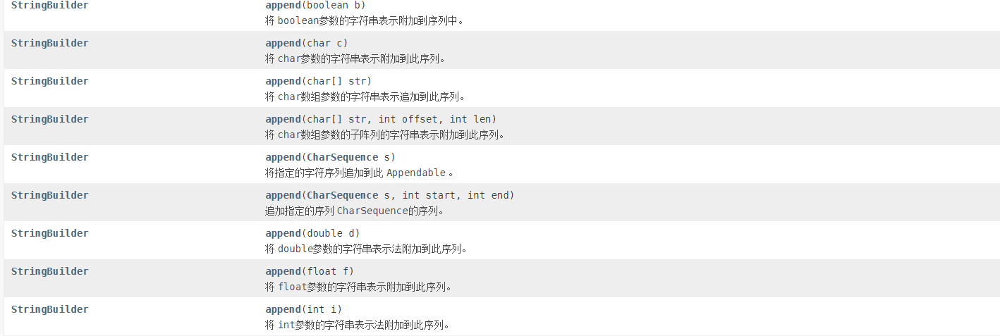

还有insert

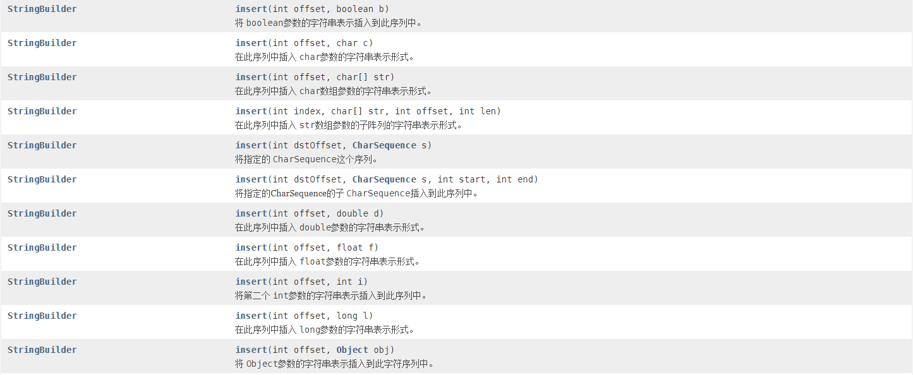

和String一样，它还有一些好用的方法：

| 返回值        | 方法                          | 描述                                       |
| ------------- | ----------------------------- | ------------------------------------------ |
| String        | substring(int start)          | 截取指定位置开始到最后的字符串             |
| String        | substring(int start, int end) | 截取字符串                                 |
| StringBuilder | reverse() 。                  | 字符序列反转                               |
| int           | lastIndexOf(String str)       | 返回指定子字符串最右边出现的字符串内的索引 |
| StringBuilder | delete(int start, int end)    | 删除此序列的子字符串中的字符。             |
| StringBuilder | deleteCharAt(int index)       | 删除 char在这个序列中的指定位置。          |
| String        | toString()                    | 转为String                                 |

## 七、附表：

可用的ZoneId

```text
Asia/Aden
America/Cuiaba
Etc/GMT+9
Etc/GMT+8
Africa/Nairobi
America/Marigot
Asia/Aqtau
Pacific/Kwajalein
America/El_Salvador
Asia/Pontianak
Africa/Cairo
Pacific/Pago_Pago
Africa/Mbabane
Asia/Kuching
Pacific/Honolulu
Pacific/Rarotonga
America/Guatemala
Australia/Hobart
Europe/London
America/Belize
America/Panama
Asia/Chungking
America/Managua
America/Indiana/Petersburg
Asia/Yerevan
Europe/Brussels
GMT
Europe/Warsaw
America/Chicago
Asia/Kashgar
Chile/Continental
Pacific/Yap
CET
Etc/GMT-1
Etc/GMT-0
Europe/Jersey
America/Tegucigalpa
Etc/GMT-5
Europe/Istanbul
America/Eirunepe
Etc/GMT-4
America/Miquelon
Etc/GMT-3
Europe/Luxembourg
Etc/GMT-2
Etc/GMT-9
America/Argentina/Catamarca
Etc/GMT-8
Etc/GMT-7
Etc/GMT-6
Europe/Zaporozhye
Canada/Yukon
Canada/Atlantic
Atlantic/St_Helena
Australia/Tasmania
Libya
Europe/Guernsey
America/Grand_Turk
US/Pacific-New
Asia/Samarkand
America/Argentina/Cordoba
Asia/Phnom_Penh
Africa/Kigali
Asia/Almaty
US/Alaska
Asia/Dubai
Europe/Isle_of_Man
America/Araguaina
Cuba
Asia/Novosibirsk
America/Argentina/Salta
Etc/GMT+3
Africa/Tunis
Etc/GMT+2
Etc/GMT+1
Pacific/Fakaofo
Africa/Tripoli
Etc/GMT+0
Israel
Africa/Banjul
Etc/GMT+7
Indian/Comoro
Etc/GMT+6
Etc/GMT+5
Etc/GMT+4
Pacific/Port_Moresby
US/Arizona
Antarctica/Syowa
Indian/Reunion
Pacific/Palau
Europe/Kaliningrad
America/Montevideo
Africa/Windhoek
Asia/Karachi
Africa/Mogadishu
Australia/Perth
Brazil/East
Etc/GMT
Asia/Chita
Pacific/Easter
Antarctica/Davis
Antarctica/McMurdo
Asia/Macao
America/Manaus
Africa/Freetown
Europe/Bucharest
Asia/Tomsk
America/Argentina/Mendoza
Asia/Macau
Europe/Malta
Mexico/BajaSur
Pacific/Tahiti
Africa/Asmera
Europe/Busingen
America/Argentina/Rio_Gallegos
Africa/Malabo
Europe/Skopje
America/Catamarca
America/Godthab
Europe/Sarajevo
Australia/ACT
GB-Eire
Africa/Lagos
America/Cordoba
Europe/Rome
Asia/Dacca
Indian/Mauritius
Pacific/Samoa
America/Regina
America/Fort_Wayne
America/Dawson_Creek
Africa/Algiers
Europe/Mariehamn
America/St_Johns
America/St_Thomas
Europe/Zurich
America/Anguilla
Asia/Dili
America/Denver
Africa/Bamako
Europe/Saratov
GB
Mexico/General
Pacific/Wallis
Europe/Gibraltar
Africa/Conakry
Africa/Lubumbashi
Asia/Istanbul
America/Havana
NZ-CHAT
Asia/Choibalsan
America/Porto_Acre
Asia/Omsk
Europe/Vaduz
US/Michigan
Asia/Dhaka
America/Barbados
Europe/Tiraspol
Atlantic/Cape_Verde
Asia/Yekaterinburg
America/Louisville
Pacific/Johnston
Pacific/Chatham
Europe/Ljubljana
America/Sao_Paulo
Asia/Jayapura
America/Curacao
Asia/Dushanbe
America/Guyana
America/Guayaquil
America/Martinique
Portugal
Europe/Berlin
Europe/Moscow
Europe/Chisinau
America/Puerto_Rico
America/Rankin_Inlet
Pacific/Ponape
Europe/Stockholm
Europe/Budapest
America/Argentina/Jujuy
Australia/Eucla
Asia/Shanghai
Universal
Europe/Zagreb
America/Port_of_Spain
Europe/Helsinki
Asia/Beirut
Asia/Tel_Aviv
Pacific/Bougainville
US/Central
Africa/Sao_Tome
Indian/Chagos
America/Cayenne
Asia/Yakutsk
Pacific/Galapagos
Australia/North
Europe/Paris
Africa/Ndjamena
Pacific/Fiji
America/Rainy_River
Indian/Maldives
Australia/Yancowinna
SystemV/AST4
Asia/Oral
America/Yellowknife
Pacific/Enderbury
America/Juneau
Australia/Victoria
America/Indiana/Vevay
Asia/Tashkent
Asia/Jakarta
Africa/Ceuta
Asia/Barnaul
America/Recife
America/Buenos_Aires
America/Noronha
America/Swift_Current
Australia/Adelaide
America/Metlakatla
Africa/Djibouti
America/Paramaribo
Europe/Simferopol
Europe/Sofia
Africa/Nouakchott
Europe/Prague
America/Indiana/Vincennes
Antarctica/Mawson
America/Kralendijk
Antarctica/Troll
Europe/Samara
Indian/Christmas
America/Antigua
Pacific/Gambier
America/Indianapolis
America/Inuvik
America/Iqaluit
Pacific/Funafuti
UTC
Antarctica/Macquarie
Canada/Pacific
America/Moncton
Africa/Gaborone
Pacific/Chuuk
Asia/Pyongyang
America/St_Vincent
Asia/Gaza
Etc/Universal
PST8PDT
Atlantic/Faeroe
Asia/Qyzylorda
Canada/Newfoundland
America/Kentucky/Louisville
America/Yakutat
Asia/Ho_Chi_Minh
Antarctica/Casey
Europe/Copenhagen
Africa/Asmara
Atlantic/Azores
Europe/Vienna
ROK
Pacific/Pitcairn
America/Mazatlan
Australia/Queensland
Pacific/Nauru
Europe/Tirane
Asia/Kolkata
SystemV/MST7
Australia/Canberra
MET
Australia/Broken_Hill
Europe/Riga
America/Dominica
Africa/Abidjan
America/Mendoza
America/Santarem
Kwajalein
America/Asuncion
Asia/Ulan_Bator
NZ
America/Boise
Australia/Currie
EST5EDT
Pacific/Guam
Pacific/Wake
Atlantic/Bermuda
America/Costa_Rica
America/Dawson
Asia/Chongqing
Eire
Europe/Amsterdam
America/Indiana/Knox
America/North_Dakota/Beulah
Africa/Accra
Atlantic/Faroe
Mexico/BajaNorte
America/Maceio
Etc/UCT
Pacific/Apia
GMT0
America/Atka
Pacific/Niue
Australia/Lord_Howe
Europe/Dublin
Pacific/Truk
MST7MDT
America/Monterrey
America/Nassau
America/Jamaica
Asia/Bishkek
America/Atikokan
Atlantic/Stanley
Australia/NSW
US/Hawaii
SystemV/CST6
Indian/Mahe
Asia/Aqtobe
America/Sitka
Asia/Vladivostok
Africa/Libreville
Africa/Maputo
Zulu
America/Kentucky/Monticello
Africa/El_Aaiun
Africa/Ouagadougou
America/Coral_Harbour
Pacific/Marquesas
Brazil/West
America/Aruba
America/North_Dakota/Center
America/Cayman
Asia/Ulaanbaatar
Asia/Baghdad
Europe/San_Marino
America/Indiana/Tell_City
America/Tijuana
Pacific/Saipan
SystemV/YST9
Africa/Douala
America/Chihuahua
America/Ojinaga
Asia/Hovd
America/Anchorage
Chile/EasterIsland
America/Halifax
Antarctica/Rothera
America/Indiana/Indianapolis
US/Mountain
Asia/Damascus
America/Argentina/San_Luis
America/Santiago
Asia/Baku
America/Argentina/Ushuaia
Atlantic/Reykjavik
Africa/Brazzaville
Africa/Porto-Novo
America/La_Paz
Antarctica/DumontDUrville
Asia/Taipei
Antarctica/South_Pole
Asia/Manila
Asia/Bangkok
Africa/Dar_es_Salaam
Poland
Atlantic/Madeira
Antarctica/Palmer
America/Thunder_Bay
Africa/Addis_Ababa
Asia/Yangon
Europe/Uzhgorod
Brazil/DeNoronha
Asia/Ashkhabad
Etc/Zulu
America/Indiana/Marengo
America/Creston
America/Punta_Arenas
America/Mexico_City
Antarctica/Vostok
Asia/Jerusalem
Europe/Andorra
US/Samoa
PRC
Asia/Vientiane
Pacific/Kiritimati
America/Matamoros
America/Blanc-Sablon
Asia/Riyadh
Iceland
Pacific/Pohnpei
Asia/Ujung_Pandang
Atlantic/South_Georgia
Europe/Lisbon
Asia/Harbin
Europe/Oslo
Asia/Novokuznetsk
CST6CDT
Atlantic/Canary
America/Knox_IN
Asia/Kuwait
SystemV/HST10
Pacific/Efate
Africa/Lome
America/Bogota
America/Menominee
America/Adak
Pacific/Norfolk
Europe/Kirov
America/Resolute
Pacific/Tarawa
Africa/Kampala
Asia/Krasnoyarsk
Greenwich
SystemV/EST5
America/Edmonton
Europe/Podgorica
Australia/South
Canada/Central
Africa/Bujumbura
America/Santo_Domingo
US/Eastern
Europe/Minsk
Pacific/Auckland
Africa/Casablanca
America/Glace_Bay
Canada/Eastern
Asia/Qatar
Europe/Kiev
Singapore
Asia/Magadan
SystemV/PST8
America/Port-au-Prince
Europe/Belfast
America/St_Barthelemy
Asia/Ashgabat
Africa/Luanda
America/Nipigon
Atlantic/Jan_Mayen
Brazil/Acre
Asia/Muscat
Asia/Bahrain
Europe/Vilnius
America/Fortaleza
Etc/GMT0
US/East-Indiana
America/Hermosillo
America/Cancun
Africa/Maseru
Pacific/Kosrae
Africa/Kinshasa
Asia/Kathmandu
Asia/Seoul
Australia/Sydney
America/Lima
Australia/LHI
America/St_Lucia
Europe/Madrid
America/Bahia_Banderas
America/Montserrat
Asia/Brunei
America/Santa_Isabel
Canada/Mountain
America/Cambridge_Bay
Asia/Colombo
Australia/West
Indian/Antananarivo
Australia/Brisbane
Indian/Mayotte
US/Indiana-Starke
Asia/Urumqi
US/Aleutian
Europe/Volgograd
America/Lower_Princes
America/Vancouver
Africa/Blantyre
America/Rio_Branco
America/Danmarkshavn
America/Detroit
America/Thule
Africa/Lusaka
Asia/Hong_Kong
Iran
America/Argentina/La_Rioja
Africa/Dakar
SystemV/CST6CDT
America/Tortola
America/Porto_Velho
Asia/Sakhalin
Etc/GMT+10
America/Scoresbysund
Asia/Kamchatka
Asia/Thimbu
Africa/Harare
Etc/GMT+12
Etc/GMT+11
Navajo
America/Nome
Europe/Tallinn
Turkey
Africa/Khartoum
Africa/Johannesburg
Africa/Bangui
Europe/Belgrade
Jamaica
Africa/Bissau
Asia/Tehran
WET
Europe/Astrakhan
Africa/Juba
America/Campo_Grande
America/Belem
Etc/Greenwich
Asia/Saigon
America/Ensenada
Pacific/Midway
America/Jujuy
Africa/Timbuktu
America/Bahia
America/Goose_Bay
America/Virgin
America/Pangnirtung
Asia/Katmandu
America/Phoenix
Africa/Niamey
America/Whitehorse
Pacific/Noumea
Asia/Tbilisi
America/Montreal
Asia/Makassar
America/Argentina/San_Juan
Hongkong
UCT
Asia/Nicosia
America/Indiana/Winamac
SystemV/MST7MDT
America/Argentina/ComodRivadavia
America/Boa_Vista
America/Grenada
Asia/Atyrau
Australia/Darwin
Asia/Khandyga
Asia/Kuala_Lumpur
Asia/Famagusta
Asia/Thimphu
Asia/Rangoon
Europe/Bratislava
Asia/Calcutta
America/Argentina/Tucuman
Asia/Kabul
Indian/Cocos
Japan
Pacific/Tongatapu
America/New_York
Etc/GMT-12
Etc/GMT-11
Etc/GMT-10
SystemV/YST9YDT
Europe/Ulyanovsk
Etc/GMT-14
Etc/GMT-13
W-SU
America/Merida
EET
America/Rosario
Canada/Saskatchewan
America/St_Kitts
Arctic/Longyearbyen
America/Fort_Nelson
America/Caracas
America/Guadeloupe
Asia/Hebron
Indian/Kerguelen
SystemV/PST8PDT
Africa/Monrovia
Asia/Ust-Nera
Egypt
Asia/Srednekolymsk
America/North_Dakota/New_Salem
Asia/Anadyr
Australia/Melbourne
Asia/Irkutsk
America/Shiprock
America/Winnipeg
Europe/Vatican
Asia/Amman
Etc/UTC
SystemV/AST4ADT
Asia/Tokyo
America/Toronto
Asia/Singapore
Australia/Lindeman
America/Los_Angeles
SystemV/EST5EDT
Pacific/Majuro
America/Argentina/Buenos_Aires
Europe/Nicosia
Pacific/Guadalcanal
Europe/Athens
US/Pacific
Europe/Monaco
```
