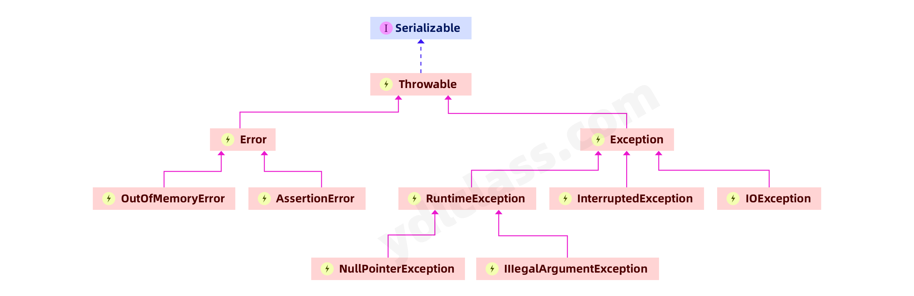
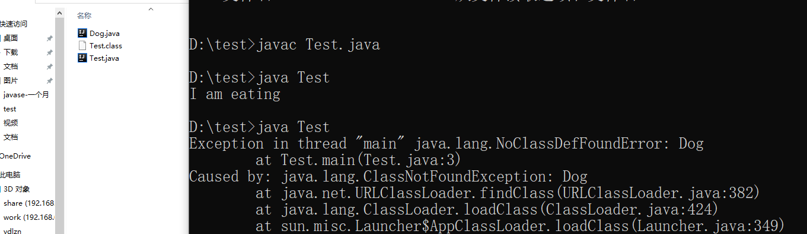

---
# 当前页面内容标题
title: 异常机制
# 当前页面图标
icon: debug
# 分类
category:
  - javase
  - 异常
# 标签
tag:
  - javase
sticky: false
# 是否收藏在博客主题的文章列表中，当填入数字时，数字越大，排名越靠前。
star: false
# 是否将该文章添加至文章列表中
article: false
# 是否将该文章添加至时间线中
timeline: false
---

## 一、零引发的血案

### 1、看问题

首先，问大家一个问题：

```java
public static void main(String[] args) {
    int num1 = 10;
    Scanner scanner = new Scanner(System.in);
    int num2 = scanner.nextInt();
    int res = num1 / num2;
    System.out.println(res);
    
    System.out.println("后边还有代码呦！");
}
```

请问：如果我输入了 “abc” 或者 0 程序应该怎么运行呢？

```java
abc
Exception in thread "main" java.util.InputMismatchException
	at java.util.Scanner.throwFor(Scanner.java:864)
	at java.util.Scanner.next(Scanner.java:1485)
	at java.util.Scanner.nextInt(Scanner.java:2117)
	at java.util.Scanner.nextInt(Scanner.java:2076)
	at cn.itnanls.Demo.main(Demo.java:13)
0
Exception in thread "main" java.lang.ArithmeticException: / by zero
	at cn.itnanls.Demo.main(Demo.java:14)
```

程序它在想办法告诉你，你错了！程序是永远找不到女朋友的，因为程序只有真的是自己错了，它才会承认自己错了。

而且有个很重要的问题，**程序碰到异常就不再继续执行后边的代码了**，真是悲剧，很明显这不是你想要的。

 世界上存在永远不会出错的程序吗？也许这只会出现在程序员的梦中。随着编程语言和软件的诞生，异常情况就如影随形地纠缠着我们，只有正确处理好意外情况，才能保证程序的可靠性。

### 2、解决方案

其实这个例子的解决方案至少有两种：

#### （1）运行前对参数进行校验

```java
public static void main(String[] args) {
    int num1 = 10;
    Scanner scanner = new Scanner(System.in);
    int num2 = scanner.nextInt();
    if (num2 == 0){
        System.out.println("除数不能为零");
        return;
    }
    int res = num1 / num2;
    System.out.println(res);
    System.out.println("后边还有代码呦！");
}
```

这样是不是就解决了除数不能为零的问题。

#### （2）出了问题想办法解决

```java
public static void main(String[] args) {
    // 尝试执行
    try {
        int num1 = 10;
        Scanner scanner = new Scanner(System.in);
        int num2 = scanner.nextInt();
        int res = num1 / num2;
        System.out.println(res);
    } catch (Exception e){    // 遇到问题，找出问题
        System.out.println("除数不能为零！");      // 解决问题
        e.printStackTrace();                    // 把问题的内容打印出来   
    }
    System.out.println("后边还有代码呦！");
}
```

这样也可以让程序继续执行，我们发现我们找出的问题，他叫Exception，也是的java类。

## 二、异常的继承体系结构



- `Throwable` 类是 Java 语言中所有错误或异常的超类。

```java
/**
 * The {@code Throwable} class is the superclass of all errors and
 * exceptions in the Java language. Only objects that are instances of this
 * class (or one of its subclasses) are thrown by the Java Virtual Machine or
 * can be thrown by the Java {@code throw} statement. Similarly, only
 * this class or one of its subclasses can be the argument type in a
 * {@code catch} clause.
```

- Throwable类是所有错误和Java中异常的超类。 只有当对象是此类（或其子类之一）的实例时，才能通过 Java 虚拟机或者 Java throw 语句抛出。
- Exception和Error都是继承了Throwable类，它是异常处理机制的基本组成类型。
- Exception和Error体现了Java平台设计者对不同异常情况的分类。Exception是程序正常运行中，可以预料的意外情况，可能并且应该被捕获，进行相应处理。
- Error是指在正常情况下，不大可能出现的情况，绝大部分的Error都会导致程序（比如JVM自身）处于非正常的、不可恢复状态。既然是非正常情况，所以不便于也不需要捕获，常见的比如`OutOfMemoryError`之类，都是Error的子类。

### 1、Error

- Error 是 Throwable 的子类，用于指示合理的应用程序**不应该试图捕获的严重问题**。
- Java 程序通常不捕获错误。错误一般发生在严重故障时，它们在Java程序处理的范畴之外。

比如：举个例子，你的程序在运行，内存爆了，你的程序能解决吗？并不能。通常由JVM处理

#### （1）OutOfMemoryError 内存溢出错误

我们为了演示可以直接将堆内存设置成1M

```jvm
-Xms1M -Xmx1M
```

```java
public static void main(String[] args) {
    byte[] bytes = new byte[1024*1024];
}
Exception in thread "main" java.lang.OutOfMemoryError: Java heap space
	at com.ydlclass.date.SystemTest.main(SystemTest.java:5)
```

#### （2）StackOverflowError 栈内存溢出错误

```java
public static void main(String[] args) {
    fun();
}

private static void fun(){
    fun();
}
Exception in thread "main" java.lang.StackOverflowError
	at cn.itnanls.Demo.fun(Demo.java:16)
	at cn.itnanls.Demo.fun(Demo.java:16)
```

#### （3）NoClassDefFoundError 找不到class定义的错误

用notepad++,写两个类：

```java
public class Dog{
	public void eat(){
		System.out.println("I am eating");
	}
}
public class Test{
	public static void main(String[] args){
		Dog dog = new Dog();
		dog.eat();
	}
}
```

先编译，Test.java，会出现两个class文件，你把Dog.class删掉，再执行。就会出现这个错误。



这个错误产生的原因大致可以描述如下：

​		要查找的类在编译的时候是存在的，运行的时候却找不到了。这个时候就会导致`NoClassDefFoundError`。造成该问题的原因可能是打包过程漏掉了部分类，或者jar包出现损坏或者篡改。

### 2、 Exception

**异常**：java语言中，将程序执行中发生的不正常情况称之为异常，就是程序执行的时候出现了你不想看到的情况。

- Exception 异常主要分为两类
  - 一类是 受查异常（检查性异常） ，`checkedException`。可检查异常在源代码里必须显式地进行捕获处理，这是编译期检查的一部分。Checked Exception的假设是我们捕获了异常，然后恢复程序。但是，其实我们大多数情况下，根本就不可能恢复。这也是为什么有些资料说 Checked Exception 是多余的原因。
  - 一类是 运行时异常（非受查异常），`RuntimeException`。通常是可以编码避免的逻辑错误，具体根据需要来判断是否需要捕获，并不会在编译期强制要求。

举个例子：你要去机场和你的领导去出差，导致你最后无法坐上飞机的因素有哪些？

1、可以自行解决的：比如没带身份证，比如起床起晚了。 这叫运行时异常，通常是自己导致的。你可以提前做好准备。

2、不能自行解决的：比如在你去的路途中地震了，突然下雨飞机不能起飞了。 这叫错误，通常是上帝导致的。

 中途堵车了，你领导没来。 这叫检查性异常，通常是别人导致的，你必须提前做好措施。

#### （1）常见的检查性异常

| 名字                     | 问题                                               |
| ------------------------ | -------------------------------------------------- |
| `IOException`            | IO异常，在对流操作时有可能会出现的异常，学流时用到 |
| `SQLException`           | SQL异常，学数据库时会用到                          |
| `ClassNotFoundException` | 找不到某个类时，会抛出该异常，反射时会用到         |
| `InterruptedException`   | 当阻塞方法收到中断请求的时候就会抛出中断异常       |

> `ClassNotFoundException`

​		Java支持使用`Class.forName`方法来动态地加载类，任意一个类的类名如果被作为参数传递给这个方法都将导致该类被加载到JVM内存中，如果这个类在类路径中没有被找到，那么此时就会在运行时抛出`ClassNotFoundException`异常。

```java
Class.forName("com.ydlclass.Dog");
```

> `InterruptedException`

```java
try {
    Thread.sleep(123);
} catch (InterruptedException e) {
    e.printStackTrace();
}
```

​		如果我们有一个运行中的软件，例如是杀毒软件正在全盘查杀病毒，此时我们不想让它杀毒，这时候点击取消，那么就是正在中断一个运行的线程。

​		其实这段代码的大致意思就是我睡的好好的，有人把我吵醒了。一般是一个程序在睡觉，另一个线程将它打断。

#### （2）常见的非检查性异常：

| 名字                        | 问题                                                         |
| --------------------------- | ------------------------------------------------------------ |
| `NullPointerException`      | 空指针引用异常，视图调用空对象的方法或者属性时，抛出该异常   |
| `ArithmeticException`       | 算术运算异常                                                 |
| `ClassCastException`        | 类型转换异常，当试图将对象强制转换为不是实例的子类时，抛出该异常 |
| `IndexOutOfBoundsException` | 下标越界异常                                                 |
| `NumberFormatException`     | 数字格式异常                                                 |

解决此类异常通常通过简单的逻辑判断就可以，一般不需要捕获处理：

> `NullPointerException`

```java
String str = null;
byte[] bytes = str.getBytes();
```

解决方法：

```java
String str = null;
if(Objects.nonNull(str)){
	byte[] bytes = str.getBytes();
}
```

> `ArithmeticException`

```text
int i = 0;
int num = 1/i;
```

解决方法：

```java
int i = 0;
if(i != 0){
	int num = 1/i;
}
```

> `ClassCastException`

```text
Animal aniaml = new Dog();
Cat cat = (Cat)animal;
```

解决方法：

```java
Animal aniaml = new Dog();
if(animal instanceof Cat){
	Cat cat = (Cat)animal;
}
```

> `IndexOutOfBoundsException`

```text
int[] nums = new int[3];
int i = 3;
nums[i] = 4;
```

解决方法：

```java
int[] nums = new int[3];
int i = 3;
if(i > -1 && i < nums.length){
    nums[i] = 4;
}
```

> `NumberFormatException`

```java
int num = Integer.parseInt("abc");
String str = "abc";
Pattern pattern = Pattern.compile("^[-\\+]?[\\d]*$");
if(pattern.matcher(str).matches()){
    num = Integer.parseInt(str);
    System.out.println(num);
}
```

#### （3）自定义异常类型

​		Java 的异常机制中所定义的所有异常不可能预见所有可能出现的错误，某些特定的情境下，则需要我们自定义异常类型来向上报告某些错误信息。

在 Java 中你可以自定义异常。编写自己的异常类时需要记住下面的几点。

- 所有异常都必须是 Throwable 的子类。
- 如果希望写一个检查性异常类，则需要继承 Exception 类。
- 如果你想写一个运行时异常类，那么需要继承 RuntimeException 类。

一个异常怎么抛出

```java
 throw new RuntimeException("您输入的数字不合法");
public class Test1 {
    public static void main(String[] args) {
        while (true){
            fun2();
        }
    }


    public static void fun2(){
        try {
            fun();
        } catch (IndexOutOfBoundsException e){

        }
    }

    public static void fun(){
        Scanner scanner = new Scanner(System.in);
        int i = scanner.nextInt();
        if(i > 5){
            System.out.println("我们可以继续玩游戏！");
        } else {
            throw new RuntimeException("我的数组下标越界了！");
        }
    }

}
```

工作中我们使用最多的还是自定义运行时异常：

```java
public class ServiceException extends RuntimeException{
    // 错误码
    private Integer code;

    // 错误信息
    private String message;
    
    // 空构造
    public ServiceException(){}

    public ServiceException(String message, Integer code)
    {
        this.message = message;
        this.code = code;
    }

    public Integer getCode() {
        return code;
    }

    public void setCode(Integer code) {
        this.code = code;
    }

    @Override
    public String getMessage() {
        return message;
    }

    public void setMessage(String message) {
        this.message = message;
    }
}
```

在需要抛出这个异常的地方，我们可以这样：

```java
throw new ServiceException(102,"业务出问题了");
```

### 3、**异常链**

一个异常被抛出去后会继续被调用这个方法的方法捕获或抛出，也就是异常会扩散。

我们举一个例子：

```
你女朋友要找你约会——》半路遇上了债主——》债主打了你一顿——》结果约会迟到了——》你女朋友说你不爱他——》然后分手了
```

​		一次很正常的约会，因为出现了债主，导致最后两人分手，虽然这确实不可思议。一个异常的出现可能会导致整个方法调用链的问题。

​		方法在栈空间被调用，多个方法互相调用形成了调用链条，会生成一个StackTrace，也叫栈轨迹，或堆栈信息，或调用链。JVM抛出异常时会打印这个堆栈信息，也就是我们经常在idea中看到的红色的错误的信息。但是事实上，我们在捕获异常后也要主动打印堆栈信息，这样才能争取的找到问题、解决问题。

​		为了打印这个堆栈信息，Java每实例化一个Exception，都会对当时的栈进行快照，这是一个相对比较重的操作。如果发生的非常频繁，这个开销可就不能被忽略了。以建议仅捕获有必要的代码段，尽量不要一个大的try包住整段的代码。

我们写以下几个例子：

```java
public class A {
    public void a(){
        throw new ServiceException(501,"业务出问题了");
    }   
}
public class B {
    public void b(){
        A a = new A();
        a.a();
    }
}
public class C {
    public void c(){
        B b = new B();
        b.b();
    }
}
public static void main(String[] args) {
        C c = new C();
        c.c();
    }
Exception in thread "main" com.ydlclass.date.ServiceException: 业务出问题了
	at com.ydlclass.date.A.a(A.java:6)
	at com.ydlclass.date.B.b(B.java:6)
	at com.ydlclass.date.C.c(C.java:6)
	at com.ydlclass.date.SystemTest.main(SystemTest.java:6)
```

 我们可以清楚的看到，异常是从第二行的方法中抛出，然后一层一层传递给B、C和main方法，这就形成了一个方法的调用链，中间任意一层我们去处理一下都可以避免有JVM直接抛出至客户端。

 有时我们甚至有这样的需求：捕获一个异常后需要抛出另外一个异常，并且希望把异常原始信息保存下来，这样的多个异常组成的链条被称为【异常链】。

1. 在JDK1.4以前，程序员必须自己编写代码来保存原始异常信息，
2. 现在所有Throwable的子类子构造器中都可以接受一个cause对象作为参数，这个cause就异常原由，代表着原始异常，即使在当前位置创建并抛出行的异常，也可以通过这个cause追踪到异常最初发生的位置。
3. Throwable类及其所有的子类都提供了带cause参数的构造器，其他的异常类就只有通过initCause()来设置cause了。

我们修改B的代码：

```java
public class B {
    public void b(){
        try {
            A a = new A();
            a.a();
        }catch (ServiceException s){
            ServiceException2 serviceException2 = new ServiceException2(508,"业务发生了巨大问题");
            serviceException2.initCause(s);
            throw serviceException2;
        }
    }
}
```

运行结果

```java
Exception in thread "main" com.ydlclass.date.ServiceException2: 业务发生了巨大问题
	at com.ydlclass.date.B.b(B.java:9)
	at com.ydlclass.date.C.c(C.java:6)
	at com.ydlclass.date.SystemTest.main(SystemTest.java:7)
Caused by: com.ydlclass.date.ServiceException: 业务出问题了
	at com.ydlclass.date.A.a(A.java:6)
	at com.ydlclass.date.B.b(B.java:7)
	... 2 more

Process finished with exit code 1
```

我们会发现多个异常形成了异常信息链。

## 三、异常的处理方式

### 1、try...catch关键字

- 使用 try 和 catch 关键字可以捕获异常。
- try/catch 代码块放在异常可能发生的地方。

try/catch代码块中的代码称为保护代码，使用 try/catch 的语法如下：

```java
try {
   // 程序代码
} catch(ExceptionName e1) {
   //Catch 块
}
```

- catch 语句包含要捕获异常类型的声明。当保护代码块中发生一个异常时，try 后面的 catch 块就会被检查。如果发生的异常包含在 catch 块中，异常会被传递到该 catch 块，这和传递一个参数到方法是一样。
- 一个 try 代码块后面跟随多个 catch 代码块的情况就叫**多重捕获**。
- 多重捕获块的语法如下所示：

```java
try{
   // 程序代码
}catch(异常类型1 异常的变量名1){
  // 程序代码
}catch(异常类型2 异常的变量名2){
  // 程序代码
}catch(异常类型2 异常的变量名2){
  // 程序代码
}
```

### 2、throws/throw 关键字

- 如果一个方法**没有捕获一个检查性异常**，那么该方法**必须使用 throws 关键字来声明**。throws 关键字放在方法签名的尾部。**也可以使用 throw 关键字抛出一个异常**，无论它是新实例化的还是刚捕获到的。
- 下面方法的声明抛出一个 `RemoteException` 异常：

```java
 public static void main(String[] args) throws InterruptedException {
     Thread.sleep(123);
 }
```

一个方法可以声明抛出多个异常，多个异常之间用逗号隔开。

### 3、finally关键字

- finally 关键字用来创建在 try 代码块后面执行的代码块。
- **无论是否发生异常，finally 代码块中的代码总会被执行**。在 finally 代码块中，可以运行清理类型等收尾善后性质的语句。
- finally 代码块出现在 catch 代码块最后，语法如下：

```java
try{
  // 程序代码
}catch(异常类型1 异常的变量名1){
  // 程序代码
}catch(异常类型2 异常的变量名2){
  // 程序代码
}finally{
  // 程序代码
}
```

## 四、try-catch-finally 的执行顺序

try-catch-finally 执行顺序的相关问题可以说是各种面试中的「常客」了，尤其是 finally 块中带有 return 语句的情况。我们直接看几道面试题：

### 1、面试题一

```java
public static void main(String[] args){
    int result = test1();
    System.out.println(result);
}

public static int test1(){
    int i = 1;
    try{
        i++;
        System.out.println("try block, i = "+i);
    }catch(Exception e){
        i--;
        System.out.println("catch block i = "+i);
    }finally{
        i = 10;
        System.out.println("finally block i = "+i);
    }
    return i;
}
```

输出结果如下：

```java
try block, i = 2
finally block i = 10
10
```

这算一个相当简单的问题了，没有坑，下面我们稍微改动一下：

```java
public static int test2(){
    int i = 1;
    try{
        i++;
        throw new Exception();
    }catch(Exception e){
        i--;
        System.out.println("catch block i = "+i);
    }finally{
        i = 10;
        System.out.println("finally block i = "+i);
    }
    return i;
}
```

输出结果如下：

```java
catch block i = 1
finally block i = 10
10
```

### 2、面试题二

```java
public static void main(String[] args){
    int result = test3();
    System.out.println(result);
}

public static int test3(){
    //try 语句块中有 return 语句时的整体执行顺序
    int i = 1;
    try{
        i++;
        System.out.println("try block, i = "+i);
        return i;
    }catch(Exception e){
        i ++;
        System.out.println("catch block i = "+i);
        return i;
    }finally{
        i = 10;
        System.out.println("finally block i = "+i);
    }
}
```

输出结果如下：

```java
try block, i = 2
finally block i = 10
2
```

 可能有人会所疑惑，原本我们的 i 就被存储在局部变量表 0 位置，而最后 finally 中的代码也的确将 slot 0 位置填充了数值 10，可为什么最后程序依然返回的数值 2 呢？

### 3、面试题三

```java
public static int test4(){
    //finally 语句块中有 return 语句
    int i = 1;
    try{
        i++;
        System.out.println("try block, i = "+i);
        return i;
    }catch(Exception e){
        i++;
        System.out.println("catch block i = "+i);
        return i;
    }finally{
        i++;
        System.out.println("finally block i = "+i);
        return i;
    }
}
```

运行结果：

```java
try block, i = 2
finally block i = 3
3
```

你会发现程序**最终会采用 finally 代码块中的 return 语句进行返回，而直接忽略 try 语句块中的 return 指令**。

- 对于异常的使用有一个不成文的约定：尽量在某个集中的位置进行统一处理，不要到处的使用 try-catch，否则会使得代码结构混乱不堪。
- 按照我们程序员的惯性认知：当遇到return语句的时候，执行函数会立刻返回。但是，在Java语言中，如果存在finally就会有例外。除了return语句，try代码块中的break或continue语句也可能使控制权进入finally代码块。
- 请勿在try代码块中调用return、break或continue语句。万一无法避免，一定要确保finally的存在不会改变方法的返回值。
- **方法返回值有两种类型：值类型与对象引用。对于对象引用，要特别小心，如果在finally代码块中对返回的对象成员属性进行了修改，即使不在finally块中显式调用return语句，这个修改也会作用于返回值上。**

我们已经学完了异常知识，最后再给大家几个忠告：

第一，尽量不要捕获类似Exception这样的通用异常，而是应该捕获特定异常。这是因为在日常的开发和合作中，我们读代码的机会往往超过写代码，软件工程是门协作的艺术，所以我们有义务让自己的代码能够直观地体现出尽量多的信息，而泛泛的Exception之类，恰恰隐藏了我们的目的。另外，我们也要保证程序不会捕获到我们不希望捕获的异常。比如，你可能更希望`RuntimeException`被扩散出来，而不是被捕获。

第二，不要生吞（swallow）异常。这是异常处理中要特别注意的事情，因为很可能会导致非常难以诊断的诡异情况。生吞异常，往往是基于假设这段代码可能不会发生，或者感觉忽略异常是无所谓的，但是千万不要在产品代码做这种假设！如果我们不把异常抛出来，程序可能在后续代码以不可控的方式结束。没人能够轻易判断究竟是哪里抛出了异常，以及是什么原因产生了异常。