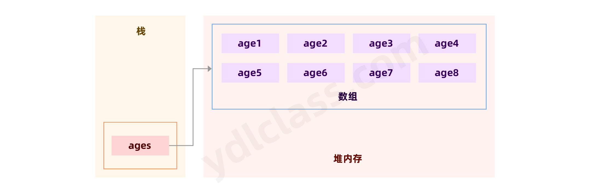
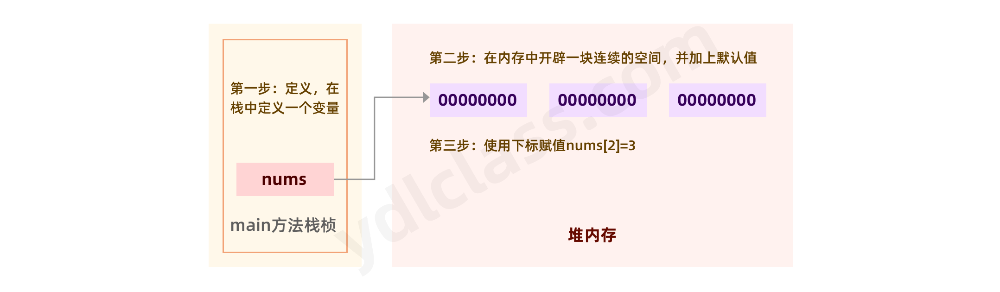
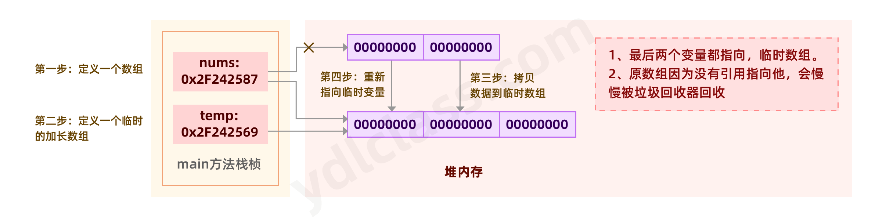
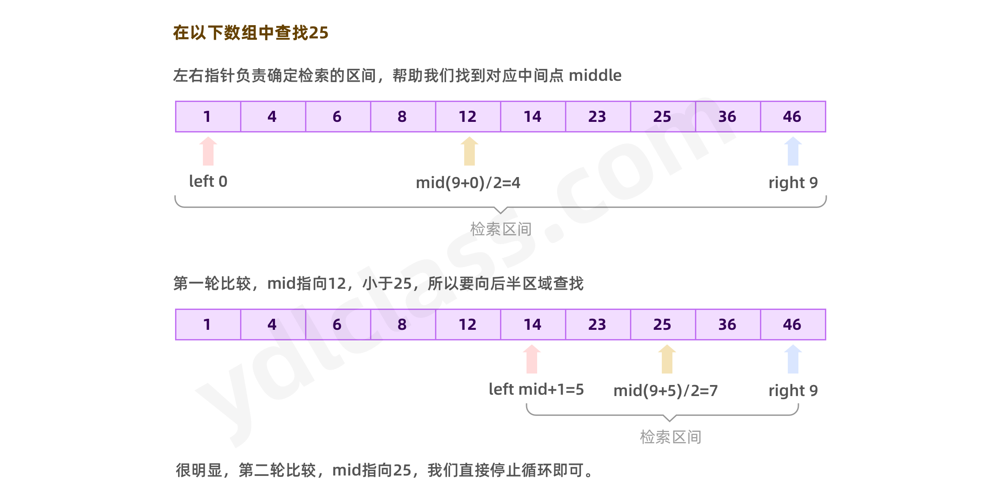
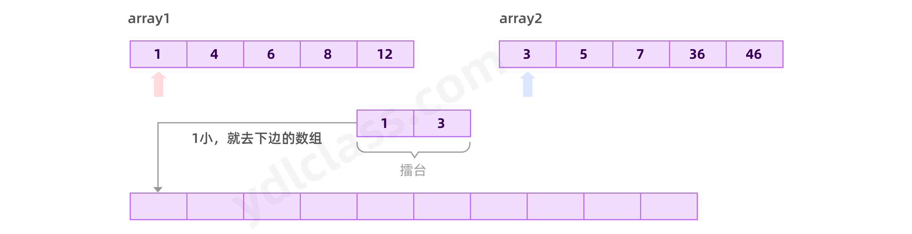
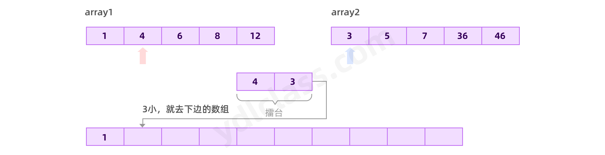
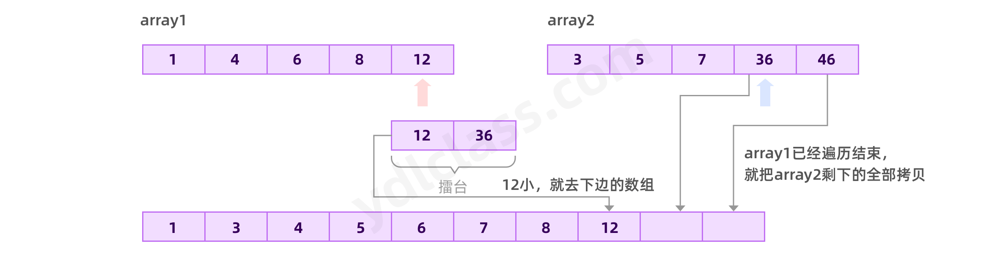
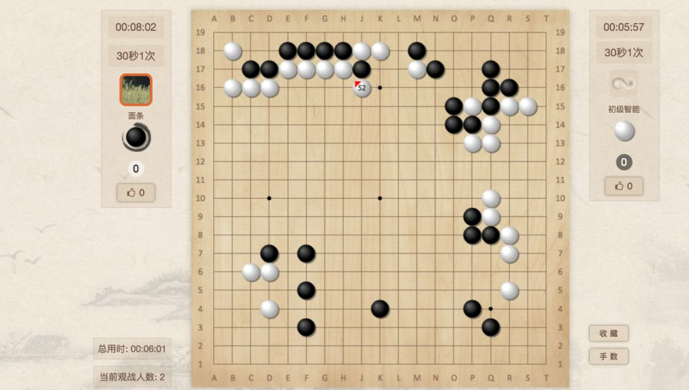
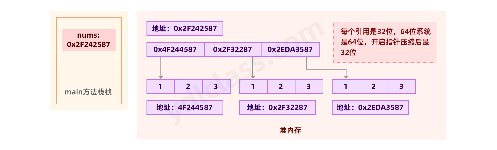
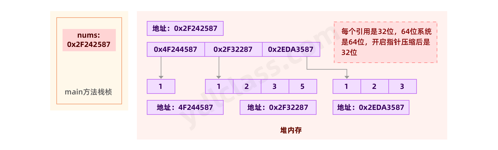

---
# 当前页面内容标题
title: 数组和算法
# 当前页面图标
icon: array
# 分类
category:
  - javase
  - 数组
  - 算法
# 标签
tag:
  - javase
  - 算法
sticky: false
# 是否收藏在博客主题的文章列表中，当填入数字时，数字越大，排名越靠前。
star: false
# 是否将该文章添加至文章列表中
article: false
# 目录顺序
order: 3
# 是否将该文章添加至时间线中
timeline: false
---

## 一、数组的定义

### 1、基本概念和内存图

数组可以存放多个同一类型的数据。 数组也是一种数据类型， 是引用类型，他在内存里是这个样子的。



他是这样定义的。

```java
定义：
int[] nums;
初始化：
nums = new int[3];
赋值：
nums[0] = 1;
nums[1] = 4;
nums[2] = 3;

// 直接定义初始化并赋值
int[] nums = {1,2,3};

// 这样写也行
int nums[] = new int[5];
int nums[] = new int[]{1,2,4,5};

// 数组有一个属性，可以获得数组的长度
nums.length

类型[] 名字 = new 类型[长度];
```

说说这三个步骤，如图：



> 三个问题：

1、数组不初始化能赋值吗？

2、初始化之后，如果不赋值，会不会有默认值？只要给你开辟了空间就一定会有默认值。

3、数组能不能越界赋值，比如长度为三，非要给第五个赋值。

### 2、数组的性质

结束了这个谈论，我们简单的概括一个数组的特性

1. 数组一旦建立，长度不能改变。
2. 每个位置只能存一个值，多了会覆盖。
3. 数组创建后会有默认值：int 0， short 0, byte 0, long 0, float 0.0,double 0.0， char \u0000， boolean false， String null
4. 编号从 0 开始，下标必须在指定范围内使用， 否则报： 下标越界异常。
5. 他有个长度的属性，最后一个位置的编号是 长度-1。 0 - length -1
6. 数组里边可以是基本类型，也可以是引用类型。

### 3、数据结构

大学里有一门课很重要，叫数据结构与算法。

数组是一种最基本的数据结构，是`表`的一种，是一种二维的线性表，我们以后还会接触链表，hash 表等。

百度百科是这样解释线性表的：

- 线性表是最基本、最简单、也是最常用的一种数据结构。线性表*（linear list）*是数据结构的一种，一个线性表是 n 个具有相同特性的数据元素的有限序列。
- 线性表中数据元素之间的关系是一对一的关系，即除了第一个和最后一个数据元素之外，其它数据元素都是首尾相接的）。

## 二、玩转数组

### 1、通循环遍历打印数组的每一个值

我们已经学习过了 for 循环，for 循环正好能从 0 循环到某一个值，而这刚好可以对应我们数据的下标，写出一个优雅的循环。

我们要明确的是我的的范围是 0 ~ length -1

```java
for (int i = 0; i < salary.length; i++) {
    System.out.print(salary[i] +  " ");
}
```

我们不妨思考一下使用 while 循环可以吗？

```java
int i = 0;
while (i < nums.length){
    System.out.println(nums[i]);
    i++;
}
```

大家慢慢一定要学会举一反三。

### 2、查找一个数组里存在的值

思路很简单，遍历每一个值，然后比较，知道遇到这个值为止。

```java
// 定义一个变量，存放找到的目标值
int target ;
for (int i = 0; i < salary.length; i++) {
    if(salary[i] == 5){
        res = salary[i];
    }
}
System.out.println(target);
```

你会发现这么写是错的，编译可能出问题：Error:(21, 28) java: 可能尚未初始化变量 res；

那我们 target 初始化一个几呢？0 吗？ 万一人家最后的就是要找 0，怎么办，其实巧用数组下标是个好办法。

这其实很简单，我们的目标其实是查找一下这个数字在第几个格子而已。这样的好处就是，格子不可能有负数。

我们不妨这样设计，如果找到了就获得他的下标，如果找不到就得到-1，代码可以优化如下：

```java
int targetIndex = -1;
for (int i = 0; i < salary.length; i++) {
    if(salary[i] == 9){
        targetIndex = i;
    }
    break;
}
```

### 3、打擂台的形式找最大值

今天要比武决胜负，找出一个武功最高的当武林盟主。

1、黄蓉在台上大喊，今天我们要比武决胜负，选出一位丐帮帮主，哪位英雄好汉愿意第一个上。

2、丁春秋第一个上来，大吼，谁敢上来和我比试比试？

3、郭芙蓉上台一个排山倒海干掉了丁春秋，于是丁春秋下台，台上站的是郭芙蓉。

4、大家你来我往，一个一个上，最后站在台上的是张无忌，顺利当选。

我们的代码如下：

```java
// 定义一个数组，存放各路英雄豪杰
int[] salary = {4,5,0,6,7,8};
// 搞一个擂台，让第0个人上来
int maxIndex = 0 ;
// 然后从第一个开始打
for (int i = 1; i < salary.length; i++) {
    // 谁赢了，谁继续在台上站着
    if(salary[i] > salary[maxIndex]){
        maxIndex = i;
    }
}
System.out.println("经过了n轮比赛得到的最大值得下标是："+maxIndex+"。值是："+salary[maxIndex]);
```

作业：

写一段代码，找出一个数组的最小值。

### 4、元素的位移

一个新的需求：

我门计划将数组中的两个元素交换位置。

```java
int[] salary = {4,5,0,6,7,8};

salary[0] = salary[1];
salary[1] = salary[0];
```

我们第一次很有可能写出这样的代码。

salary[0] = salary[1]; 这句话执行完了之后 数组中 就出现了两个 salary[1]了。

合适的方法是，在找一个空间，临时存一下 salary[0]。

```java
int[] salary = {4,5,0,6,7,8};

int temp = salary[0];
salary[0] = salary[1];
salary[1] = temp;
```

### 5、数组的扩容

我们一定要知道，数组本质上不能改变大小，实质上的扩容是不行的，需要使用一些手段。

画一个图吧：



```java
// 定义原始数组
int[] nums = new int[]{3,4,6};
// 定义一个新的临时数字
int[] temp = new int[6];
// 讲原始数组的数据全部拷贝到临时数组
for (int i = 0; i < nums.length; i++) {
 temp[i] = nums[i];
}
// 让原始数组的引用指向临时数组，感觉上就像原始数组被扩容了
nums = temp;
for (int i = 0; i < nums.length; i++) {
System.out.println(temp[i]);
}
```

【问题】

我使用 temp 修改数组的值，会不会影响 nums？

### 6、数组的反转

#### （1）思路一

创建一个等长的数组，反向放入，最后改变引用即可

```java
int[] nums = new int[]{3,4,6};
int[] temp = new int[nums.length];
for (int i = nums.length - 1; i >= 0; i--) {
    temp[i] = nums[nums.length - 1 - i];
}
nums = temp;
for (int i = 0; i < nums.length; i++) {
    System.out.println(temp[i]);
}
```

#### （2）思路二

利用交换的方式：


```java
// 定义原始数组
int[] nums = new int[]{3,4,6};
// 交换反转
for (int i = 0; i < nums.length/2; i++) {
    int temp = nums[nums.length - 1 - i];//保存
    nums[nums.length - 1 - i] = nums[i];
    nums[i] = temp;
}
for (int i = 0; i < nums.length; i++) {
    System.out.println(nums[i]);
}
```

### 7、练习作业

元动力人事工号管理系统：

1、可以不断的选择功能，一是新增工号，二是查找工号

```java
import java.util.Scanner;

public class YdlHr {
    public static void main(String[] args) {
        Scanner scanner = new Scanner(System.in);
        int nums[] = new int[2];
        int currentIndex = -1;
        // 可以一直选择功能，1 添加  2 查找 3 退出
        while (true){
            // 选择功能
            System.out.println("请选择功能：1 添加工号  2 查找工号 3 打印所有员工 4 退出");
            int function = scanner.nextInt();
            if(function == 4){
                break;
            }
            if(function == 1){
                System.out.println("请输入要添加的工号：");
                int num = scanner.nextInt();

                // 一定要判断，是否需要扩容
                currentIndex++;
                // 不满足条件先去扩容
                if(currentIndex > nums.length-1){
                    int[] temp = new int[nums.length*2];
                    // 拷贝的过程
                    for (int i = 0; i < nums.length; i++) {
                        temp[i] = nums[i];
                    }
                    // 改变引用
                    nums = temp;
                }
                nums[currentIndex] = num;
            }
            if(function == 2){
                System.out.println("请输入要查找的工号：");
                int num = scanner.nextInt();
                int result = -1;
                for (int i = 0; i < nums.length; i++) {
                    if(nums[i] == num){
                        result = i;
                        break;
                    }
                }
                System.out.println( result == -1 ? "改工号不存在" : "该工号存在："+nums[result] );
            }
            if(function == 3){
                for (int i = 0; i <= currentIndex; i++) {
                    System.out.println(nums[i]);
                }
            }
        }
    }
}
```

学会使用 debug 排错

## 三、初识算法

数据结构是把数据在内存或磁盘存放时的规矩。是一个图书馆的书架，格子都给你规定好了，我们可以按照预设的方式去摆放图书。

算法是具体的动作，是怎么去摆放，怎么快速的找到我要的图书。

注意，我们的课程主线是怎么敲代码，在学习 javase 的阶段如果太痴迷于算法，你就学不完了。但是如果你大一大二时间多，那没问题。我会在后期的附加课中，讲解每一种排序方法，这里我们只选择讲解最简单的。

### 1、排序算法

我们的图书都放在了格子里，但是没有按照编号从小到大的排序，现在需要你完成这个工作。

这个场景下，必须这样做：

- 只能两个两个的比较。
- 只能两个两个交换位置。

如果是你，你会怎么去排序呢？

简单排序：选择排序 插入排序 冒泡排序

高级排序：希尔排序 快速排序 归并排序

堆排序 桶排序 基数排序

#### （1）冒泡排序

每一轮都是两两相比，大的靠后站，经过一轮下来，会将最大的冒到最后边。其实计算机是很笨的，我们用最笨的方法，就能解决很多问题。


那咱们就开始吧：

1. 0 和 1 比 ，1 高不动
2. 1 和 2 比，1 高，往后挪
3. 这一轮下来，最高的就到了最后了。


4、最后一个确定了就不用参与排序了，我们只对前边的用相同的方式继续就行了。

再来一轮：


一共需要 length-1 轮，因为第一个只剩一个的时候，就不需要了。


代码实现：

```java
int[] nums = {3, 7, 4, 9, 5, 4, 1};
// 一共需要n-1轮
for (int j = 0; j < nums.length - 1 ; j++) {
    // 每一轮都是多之前未排好的部分遍历一遍
    for (int i = 0; i < nums.length - 1 -j ; i++) {
        if (nums[i] > nums[i + 1]) {
            int temp = nums[i];
            nums[i] = nums[i + 1];
            nums[i + 1] = temp;
        }
    }
}

for (int i = 0; i < nums.length; i++) {
    System.out.print(nums[i] + " ");
}
```

### 2、查找算法

怎么查找，我们之前已经讲过了，一个个遍历，找到拿出即可啊，这种方法叫【顺序查找】【，那有没有更加高效的方法呢？如果数组本身无序，那确实没事好的办法，但是如果数组有序那就不一样了啊。

【举个例子】，你去图书馆找一本书，如果你知道这个书架上的书是按照编号有序排列，你会从头开始一个一个找吗？

你大概的思路是这样的，先去中间看看，如果我找的书的编号比中间的大我就去左边找，否则去右边找。

这种思路就是我们的二分查找法：

#### （1）二分查找（折半查找）

> 如图所示：



> 代码实现：

```java
public class BinarySearch {

    public static void main(String[] args) {
        Scanner scanner = new Scanner(System.in);
        int[] nums = {1,3,5,7,8,12,23};
        System.out.println("请输入您要查找的数字：");
        int target = scanner.nextInt();

        // 需要两个变量去确定检索范围
        int left = 0;
        int right = nums.length - 1;

        if(target < nums[0] || target > nums[nums.length-1]){
            System.out.println("您输入的不在范围之内！");
        } else {
            // 保存我们的结果
            int res = -1;
            // 左右边界不重合就继续
            while (left <= right){
                int middle = (left + right)/2;
                if(nums[middle] == target){
                    res = middle;
                    break;
                } else if(nums[middle] > target) {
                    right = middle - 1;
                } else {
                    left = middle + 1;
                }
            }
            System.out.println(res);
        }
    }
}
```

### 3、算法性能

通常我们考虑一个算法的指标是看其在时间和空间两个维度的表现决定的。

- 时间维度：是指执行当前算法所消耗的时间，我们通常用「时间复杂度」来描述。
- 空间维度：是指执行当前算法需要占用多少内存空间，我们通常用「空间复杂度」来描述。

> 最经典的方法：叫「 大 O 符号表示法 」

#### （1）时间复杂度

**a、线性阶**

我们先来看个我们之前的例子：

```text
int targetIndex = -1;
for (int i = 0; i < salary.length; i++) {
    if(salary[i] == 9){
        targetIndex = i;
    }
    break;
}
```

通过「 大 O 符号表示法 」，这段代码的时间复杂度为：O(n) ，为什么呢?

对于我们这种顺序检索，随着数组的大小的变化，查询需要遍历的次数也会线性增长，n 就好比要查找的次数。

**b、常数阶**

那如果有这么一种算法，无论数组多长，查询只需要一次就能出结果，这样的时间复杂度就是 O(1)，后边我们会学习 hash

**c、指数阶**

思考，我们的冒泡排序呢？

随着数组长度的变化，我们遍历的次数是指数级增长的，那他的时间复杂度就是 O(n^2)。

**d、对数阶**

思考、我们的二分查找法呢

试想：

- 一个有序数组长度为 8 最多需要 3 次即可，应为也只能折 3 次
- 一个有序数组长度为 16 最多需要 4 次即可，应为也只能折 4 次
- 一个有序数组长度为 32 最多需要 5 次即可，应为也只能折 5 次

这这很明显是一个对数关系：n 是纵坐标，循环的次数的横坐标，看不懂就算了。


【这种算法下，你的数据越多效果越明显】。

**e、高级排序**

高级排序会在后续的附加课一一讲解，咱们就不在细说了。

O(logN\*n)

#### （2）空间复杂度

和时间复杂度类似，空间复杂度就是在我的算法下，数据的长度越长，你额外需要多少空间。

比较常用的有：O(1)、O(n)、O(n²)，我们下面来看看：

**a、空间复杂度 O(1)**

如果算法执行所需要的临时空间不随着某个变量 n 的大小而变化，即此算法空间复杂度为一个常量，可表示为 O(1) 比如咱们刚刚学习的冒泡排序，二分查找，无论数组多长，我们依然不需要更多的额外空间。

**b、空间复杂度 O(n)**

思考我们的数组反转：

> 思路一：创建一个等长的数组，反向放入，最后改变引用即可

这种方法，你的数组越长，总是需要一个等长的数据作为额外空间，这种增长是线性的，所以他的空间复杂度是 O(n);

他的时间复杂度呢？ O(n)

> 思路二：利用首尾两两交换的方法

这种方法，你并不需要去创建额外的空间，所以他的空间复杂度是 O(1);

他的时间复杂度呢？ O(n/2)

很明显，第二种方法在时间复杂度和空间复杂度上都要更加优秀。

- 算法是有优劣的。有的人写的是真牛逼，有的人写的是真辣鸡。
- 一段代码的性能和代码的长短没有毛线关系，不是越长的越好，也不是越短的越好。

### 4、归并的思想

小案例：

给你两个有序数组，合并成一个大的有序的数组。

#### （1）思路一

创建一个大的数组，长度为两个数组之和，然后冒泡排序。

代码不写了。

#### （2）思路二

归并思路如下：

1、同时遍历两个数组，遍历的当前值进行比较，小的放入新数组。



2、放进去之后，数据继续遍历，指针后移。



3、经过多次遍历



---

代码实现：

```java
public class Demo<a> {
    public static void main(String[] args) {
        // 定义两个有序的数组
        int[] array1 = {1,3,5,8,12,35,54,456,2545};
        int[] array2 = {2,4,7,10,40,60};
        // 定义两个下标
        int i = 0;
        int j = 0;

        // 定义一个新的数组
        int[] newArray = new int[array1.length+array2.length];

        // 必须把两个全部遍历结束
        while ( i<array1.length || j<array2.length){
            // 如果数组1已经遍历结束，就拷贝数组2的数据
            if(i == array1.length){
                newArray[i+j] = array2[j];
                j++;
                continue;
            }
            // 如果数组2已经遍历结束，就拷贝数组1的数据
            if(j == array2.length){
                newArray[i+j] = array1[i];
                i++;
                continue;
            }

            // 正常的擂台比较，小的放进去
            if(array1[i] < array2[j]){
                newArray[i+j] = array1[i];
                i++;
            } else {
                newArray[i+j] = array2[j];
                j++;
            }
        }

        for (int l = 0; l < newArray.length; l++) {
            System.out.println(newArray[l]);
        }
    }
}
```

每个人写的代码，都不一样，我们学习的是思路，是思想。

## 四、二维数组

二维数组使用的频率很少，但是也有一些类似的需求，比如我们开发一个围棋游戏， 棋盘就可以用二维数组来表示。 如图：



怎么定义一个数组呢？

```text
比如: int nums[][]=new int[2][3]
```

在内存中二维数组张这个样子：



请用二维数组输出如下图形 :TwoDimensionalArray

```java
int[][] nums = {{1,2,3,4,5,6},
                {6,5,4,3,2,1},
                {1,2,3,4,5,6}};


for(int i = 0; i < arr.length; i++) {
    for(int j = 0; j < arr[i].length; j++) {
     System.out.print(arr[i][j] + " ");
    }
 System.out.println();//换行
}
```

**思考，二维数组里的每一个数组的长度一定要一样吗，如下图可以吗？**


答案是可以的：

```text
int[][] nums = {{1,4},{1,2,6},{5,6,3,2,1}};
```

我们还可以这样赋值：

```java
// 这个初始化做了什么工作，这样就可以开辟空间初识化了，只不过每一个都是null
int[][] nums = new int[3][];
// 赋值
nums[0] = new int[5];
nums[1] = new int[3];
nums[2] = new int[7];
```

明白一个道理，初识化只要知道我需要多少空间，然后在堆内存给他分配就好了。

**附加题：**

写一个杨辉三角，他是这么一个三角：

1. 每个数等于它上方两数之和。
2. 每行数字左右对称，由 1 开始逐渐变大。
3. 第 n 行的数字有 n 项。
4. 前 n 行共[(1+n)n]/2 个数。



我们的输入目标：

```text
使用二维数组打印一个 10 行杨辉三角
1
1 1
1 2 1
1 3 3 1
1 4 6 4 1
1 5 10 10 5 1
```

> 代码实现

```java
public class YangHui {
    public static void main(String[] args) {

        int max = 10;

        // 分配三角形的数组
        int[][] nums = new int[max + 1][];
        for (int n = 0; n <= max; n++)
            nums[n] = new int[n + 1];

        // 填充杨辉三角
        for (int i = 0; i < nums.length; i++) {
            for (int j = 0; j < nums[i].length; j++) {
                // 边边上全是1，每一行的0和length-1都是1
                if (j == 0 || j == nums[i].length - 1) {
                    nums[i][j] = 1;
                } else {
                    // 剩余的部分按照规律来
                    nums[i][j] = nums[i-1][j-1] +nums[i-1][j];
                }
            }
        }

        for (int i = 0; i < nums.length; i++) {
            for (int j = 0; j < nums[i].length; j++) {
                System.out.print(nums[i][j]+" ");
            }
            System.out.println();
        }
    }
}
```
