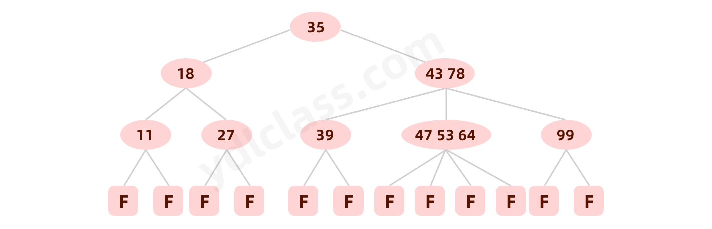

---
# 当前页面内容标题
title: 数据结构--树
# 当前页面图标
icon: tree
# 分类
category:
  - javase
  - 数据结构
  - 树
# 标签
tag:
  - javase
  - 数据结构
  - 树
sticky: false
# 是否收藏在博客主题的文章列表中，当填入数字时，数字越大，排名越靠前。
star: false
# 是否将该文章添加至文章列表中
article: false
# 是否将该文章添加至时间线中
timeline: false
---

> **树**是数据结构中的重中之重，尤其以各类二叉树为学习的难点。
>
> 数据结构可视化的网站：[https://www.cs.usfca.edu/~galles/visualization/Algorithms.html](https://www.cs.usfca.edu/~galles/visualization/Algorithms.html)

## 一、重点概念

### 1.1 结点概念

**结点**是数据结构中的基础，是构成复杂数据结构的基本组成单位。

### 1.2 树结点声明

本系列文章中提及的结点专指树的结点。

## 二、 树

### 2.1 定义

**树（Tree）**是n（n>=0)个结点的有限集。n=0时称为空树。在任意一颗非空树中： 1）有且仅有一个特定的称为根（Root）的结点； 2）当n>1时，其余结点可分为m(m>0)个互不相交的有限集T1、T2、......、Tn，其中每一个集合本身又是一棵树，并且称为根的子树。

此外，树的定义还需要强调以下两点： 1）根结点是唯一的，不可能存在多个根结点，数据结构中的树只能有一个根结点。 2）子树的个数没有限制，但它们一定是互不相交的。

示例树： 下图为一棵普通的树：


由树的定义可以看出，树的定义使用了递归的方式。递归在树的学习过程中起着重要作用，如果对于递归不是十分了解，建议先看看[递归算法](https://blog.csdn.net/feizaosyuacm/article/details/54919389)

### 2.2 结点的度

结点拥有的子树数目称为结点的**度**。


### 2.3 结点关系

结点子树的根结点为该结点的**孩子结点**。相应该结点称为孩子结点的**双亲结点**（父节点）。 图2.2中，A为B的双亲结点，B为A的孩子结点。 同一个双亲结点的孩子结点之间互称**兄弟结点**。 图2.2中，结点B与结点C互为兄弟结点。

### 2.4 结点层次

从根开始定义起，根为第一层，根的孩子为第二层，以此类推。 图2.3表示了图2.1所示树的层次关系


### 2.5 树的深度

树中结点的最大层次数称为树的深度或高度。图2.1所示树的深度为4。

## 三、 二叉树

### 3.1 定义

**二叉树**是n(n>=0)个结点的有限集合，该集合或者为空集（称为空二叉树），或者由一个根结点和两棵互不相交的、分别称为根结点的左子树和右子树组成。 图3.1展示了一棵普通二叉树：


### 3.2 二叉树特点

由二叉树定义以及图示分析得出二叉树有以下特点：

- 1）每个结点最多有两棵子树，所以二叉树中不存在度大于2的结点。
- 2）左子树和右子树是有顺序的，次序不能任意颠倒。
- 3）即使树中某结点只有一棵子树，也要区分它是左子树还是右子树。

### 3.3 二叉树性质

- 1）在二叉树的第i层上最多有 $2^i-1$ 个节点 。（i>=1）
- 2）二叉树中如果深度为k,那么最多有$2^k-1$个节点。(k>=1）
- 3）$n0=n2+1$ ，$n0$表示度数为0的节点数，$n2$表示度数为2的节点数。
- 4）在完全二叉树中，具有n个节点的完全二叉树的深度为$[\log_2 n]+1$，其中$[\log_2 n]$是向下取整。
- 5）若对含 n 个结点的完全二叉树从上到下且从左至右进行 1 至 n 的编号，则对完全二叉树中任意一个编号为 i 的结点有如下特性：

> 1. 若 i=1，则该结点是二叉树的根，无双亲, 否则，编号为 [i/2] 的结点为其双亲结点; 
> 2. 若 2i>n，则该结点无左孩子结点， 否则，编号为 2i 的结点为其左孩子结点； 
> 3. 若 2i+1>n，则该结点无右孩子结点， 否则，编号为2i+1 的结点为其右孩子结点。

### 3.4  斜树

**斜树**：所有的结点都只有左子树的二叉树叫左斜树。所有结点都是只有右子树的二叉树叫右斜树。这两者统称为斜树。


### 3.5 满二叉树

**满二叉树**：在一棵二叉树中。如果所有分支结点都存在左子树和右子树，并且所有叶子都在同一层上，这样的二叉树称为满二叉树。 满二叉树的特点有：

- 1）叶子只能出现在最下一层。出现在其它层就不可能达成平衡。
- 2）非叶子结点的度一定是2。
- 3）在同样深度的二叉树中，满二叉树的结点个数最多，叶子数最多。


### 3.6 完全二叉树

**完全二叉树**：对一颗具有n个结点的二叉树按层编号，如果编号为i(1<=i<=n)的结点与同样深度的满二叉树中编号为i的结点在二叉树中位置完全相同，则这棵二叉树称为完全二叉树。 图3.5展示一棵完全二叉树


**特点**：

- 1）叶子结点只能出现在最下层和次下层。
- 2）最下层的叶子结点集中在树的左部。
- 3）倒数第二层若存在叶子结点，一定在右部连续位置。
- 4）如果结点度为1，则该结点只有左孩子，即没有右子树。
- 5）同样结点数目的二叉树，完全二叉树深度最小。 **注**：满二叉树一定是完全二叉树，但反过来不一定成立。

### 3.7 二叉树的存储结构

#### 3.7.1 顺序存储

二叉树的顺序存储结构就是使用一维数组存储二叉树中的结点，并且结点的存储位置，就是数组的下标索引。


所示的一棵完全二叉树采用顺序存储方式，如图3.7表示：


顺序存储

由图可以看出，当二叉树为完全二叉树时，结点数刚好填满数组。 那么当二叉树不为完全二叉树时，采用顺序存储形式如何呢？例如：对于图3.8描述的二叉树：


其中浅色结点表示结点不存在。那么图3.8所示的二叉树的顺序存储结构如图3.9所示：


其中，`∧`表示数组中此位置没有存储结点。此时可以发现，顺序存储结构中已经出现了空间浪费的情况。 那么对于图3.3所示的右斜树极端情况对应的顺序存储结构如图3.10所示：


可以看出，对于这种右斜树极端情况，采用顺序存储的方式是十分浪费空间的。因此，顺序存储一般适用于完全二叉树。

#### 3.7.2 二叉链表

既然顺序存储不能满足二叉树的存储需求，那么考虑采用链式存储。由二叉树定义可知，二叉树的每个结点最多有两个孩子。因此，可以将结点数据结构定义为一个数据和两个指针域。表示方式如图3.11所示：


定义结点代码：

```java
Node TreeNode{
    T data; // 数据
    TreeNode left;
    TreeNode right;
} 
```

则图3.6所示的二叉树可以采用图3.12表示。


图3.12中采用一种链表结构存储二叉树，这种链表称为二叉链表。

### 3.8 二叉树遍历

二叉树的遍历一个重点考查的知识点。

#### 3.8.1 定义

**二叉树的遍历**是指从二叉树的根结点出发，按照某种次序依次访问二叉树中的所有结点，使得每个结点被访问一次，且仅被访问一次。 二叉树的访问次序可以分为四种：

首先了解一下**递归遍历**

由上自下，从左到右

每个节点会走三次。

#### 3.8.2 前序遍历

**前序遍历**通俗的说就是从二叉树的根结点出发，当第一次到达结点时就输出结点数据，按照先向左在向右的方向访问。


如图所示二叉树访问如下： 先序遍历的结果: **ABDHIEJCFG**

#### 3.8.3 中序遍历

**中序遍历**就是从二叉树的根结点出发，当第二次到达结点时就输出结点数据，按照先向左再向右的方向访问。

中序遍历输出为：**HDIBJEAFCG**

#### 3.8.4 后序遍历

**后序遍历**就是从二叉树的根结点出发，当第三次到达结点时就输出结点数据，按照先向左再向右的方向访问。

后序遍历输出为：**HIDJEBFGCA**

#### 3.8.5 层次遍历

层次遍历就是按照树的层次自上而下的遍历二叉树。针对图3.13所示二叉树的层次遍历结果为： **ABCDEFGHIJ** 层次遍历的详细方法可以参考[二叉树的按层遍历法](https://blog.csdn.net/lingchen2348/article/details/52774535)。

```java
public class RecursiveBinaryTree {

    public static class Node {
        public int value;
        public Node left;
        public Node right;

        public Node(int v) {
            value = v;
        }
    }


    // 先序打印所有节点
    public static void Preorder(Node root) {
        if (root == null) {
            return;
        }
        System.out.println(root.value);
        Preorder(root.left);
        Preorder(root.right);
    }

    public static void Inorder(Node root) {
        if (root == null) {
            return;
        }
        Inorder(root.left);
        System.out.println(root.value);
        Inorder(root.right);
    }

    public static void Postorder(Node root) {
        if (root == null) {
            return;
        }
        Postorder(root.left);
        Postorder(root.right);
        System.out.println(root.value);
    }

    public static void main(String[] args) {
        Node root = new Node(1);
        root.left = new Node(2);
        root.right = new Node(3);
        root.left.left = new Node(4);
        root.left.right = new Node(5);
        root.right.left = new Node(6);
        root.right.right = new Node(7);


        Preorder(root);
        System.out.println("====先序遍历====");
        Inorder(root);
        System.out.println("====中序遍历====");
        Postorder(root);
        System.out.println("====后续遍历====");

    }

}
```

不用递归，用栈实现先序，效率高一点

```java
public class UnRecursiveBinaryTree {

	public static class Node {
		public int value;
		public Node left;
		public Node right;

		public Node(int v) {
			value = v;
		}
	}

	public static void pre(Node head) {
		System.out.print("pre-order: ");
		if (head != null) {
			Stack<Node> stack = new Stack<Node>();
			stack.add(head);
			while (!stack.isEmpty()) {
				head = stack.pop();
				System.out.print(head.value + " ");
				if (head.right != null) {
					stack.push(head.right);
				}
				if (head.left != null) {
					stack.push(head.left);
				}
			}
		}
		System.out.println();
	}
}
```

## 四、其他的树的分类

### **4.1 二叉查找树（又叫做二叉搜索树，二叉排序树）**

特征：

1. 若左子树不为空，那么左子树所有节点的值小于均小于他的根节点的值。
2. 若右子树不为空，那么右子树的所有节点的值大于根节点的值。
3. 左右子树也分别为二叉排序树。
4. 没有键值相等的节点。


**二叉排序树查找操作**

首先我们提供一个二叉树的结构。

然后我们来看看二叉排序树的查找是如何实现的

```java
public class BinaryTree {

    public static void main(String[] args) {
        // 主要是表达查询，所以手动构造一棵二叉排序树
        TreeNode binaryTree1 = new TreeNode(62);

        TreeNode binaryTree2 = new TreeNode(58);
        binaryTree1.lchild = binaryTree2;

        TreeNode binaryTree3 = new TreeNode(47);
        binaryTree2.lchild = binaryTree3;

        TreeNode binaryTree4 = new TreeNode(35);
        binaryTree3.lchild = binaryTree4;

        TreeNode binaryTree5 = new TreeNode(37);
        binaryTree4.rchild = binaryTree5;

        TreeNode binaryTree6 = new TreeNode(51);
        binaryTree3.rchild = binaryTree6;

        TreeNode binaryTree7 = new TreeNode(88);
        binaryTree1.rchild = binaryTree7;

        TreeNode binaryTree8 = new TreeNode(88);
        binaryTree7.lchild = binaryTree8;

        TreeNode binaryTree9 = new TreeNode(99);
        binaryTree7.rchild = binaryTree9;

        TreeNode binaryTree10 = new TreeNode(93);
        binaryTree9.lchild = binaryTree10;

        TreeNode treeNode = searchBinaryTree(binaryTree1, 35000);
        System.out.println(treeNode == null ? "没有这个数" : treeNode.data);
    }

    /**
     * 二叉排序树
     *
     * @param root   待查询的二叉排序树
     * @param target 查找关键字
     * @return 没有返回null，有则返回节点
     */
    public static TreeNode searchBinaryTree(TreeNode root, int target) {
        if (root == null) { // 树节点不存在，返回
            return null;
        } else if (target == root.data) { // 查找成功
            return root;
        } else if (target < root.data) { // 关键字小于根节点查找左子树
            return searchBinaryTree(root.lchild, target);
        } else { // 关键字大于根节点查找右子树
            return searchBinaryTree(root.rchild, target);
        }
    }

    /**
     * 二叉树，数据结构
     */
    private static class TreeNode {
        int data;
        TreeNode lchild;
        TreeNode rchild;

        public TreeNode(int data) {
            this.data = data;
        }

        public TreeNode() {
        }
    }

}
```

### **4.2 平衡二叉树（AVL树）**

含有相同节点的二叉查找树可以有不同的形态，而二叉查找树的平均查找长度与树的深度有关，所以需要找出一个查找平均长度最小的一棵，那就是平衡二叉树（图b），具有以下性质： 

1. 要么是棵空树，要么其根节点左右子树的深度之差的绝对值不超过1； 
2. 其左右子树也都是平衡二叉树； 
3. 二叉树节点的平衡因子定义为该节点的左子树的深度减去右子树的深度。则平衡二叉树的所有节点的平衡因子只可能是-1,0,1。


### **4.3 红黑树**

红黑树是一种自平衡二叉树，在**平衡二叉树的基础上每个节点又增加了一个颜色的属性**，节点的颜色只能是红色或黑色。具有以下性质： 

1. 根节点只能是黑色；
2. 红黑树中所有的叶子节点后面再接上左右两个空节点，这样可以保持算法的一致性，而且所有的空节点都是黑色；
3. 其他的节点要么是红色，要么是黑色，红色节点的父节点和左右孩子节点都是黑色，及黑红相间；
4. 在任何一棵子树中，从根节点向下走到空节点的路径上**所经过的黑节点的数目相同**，从而保证了是一个平衡二叉树。


### **4.4 B-树（也叫B树）**

B-树是一种平衡多路查找树，它在文件系统中很有用。一棵m阶B-树（图d为4阶B-树），具有下列性质：

1. 树中每个节点至多有m棵子树；
2. 若根节点不是叶子节点，则至少有2棵子树；
3. 除根节点之外的所有非终端节点至少有$\lceil m/2 \rceil$棵子树；
4. 每个节点中的信息结构为（A0,K1,A1,K2......Kn,An），其中$n$表示关键字个数，$Ki$为关键字，$Ai$为指针；
5. 所有的**叶子节点都出现在同一层次上**，且不带任何信息，也是为了保持算法的一致性。



### **4.5 B+树**

B+数是B-树的一种变形，它与B-树的差别在于（图e为3阶B+树）： 

1. 有n棵子树的节点含有n个关键字；
2. 所有的叶子节点包含了全部关键字的信息，及指向这些关键字记录的指针，**且叶子节点本身按关键字大小自小到大顺序链接**；
3. 所有非终端节点可以看成是索引部分，节点中仅含有其子树（根节点）中最大（或最小）关键字，所有B+树更像一个索引顺序表；
4. 对B+树进行查找运算，一是从最小关键字起进行顺序查找，二是从根节点开始，进行随机查找。


