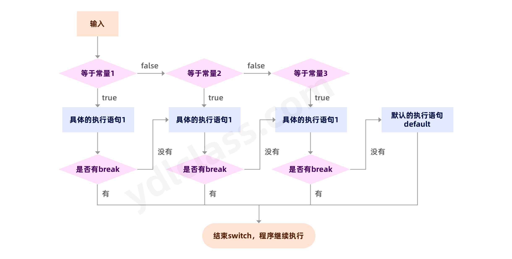
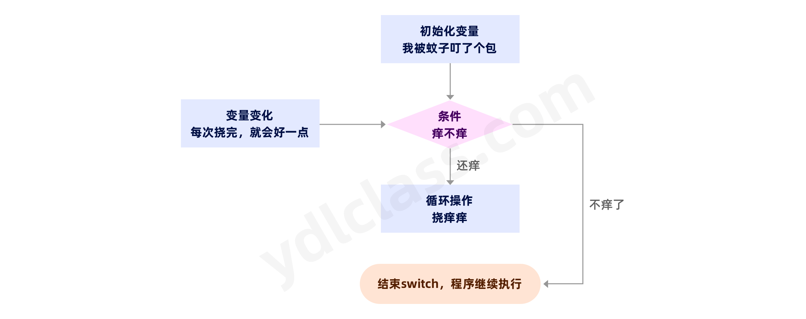

---
# 当前页面图标
icon: branch
# 分类
category:
  - javase
  - 流程控制语句
# 标签
tag:
  - javase
sticky: false
# 是否收藏在博客主题的文章列表中，当填入数字时，数字越大，排名越靠前。
star: false
# 是否将该文章添加至文章列表中
article: false
# 目录顺序
order: 2
# 是否将该文章添加至时间线中
timeline: false
---

# 流程控制语句

在程序中， 程序运行的流程控制决定程序是如何执行的， 主要有三大流程控制语句。

1. 顺序控制
2. 分支控制
3. 循环控制

## 一、顺序控制

顺序控制就是程序会由上而下，由左及右依次逐行执行，就和我们写文章一样。

java 中对变量是`先定义再使用`，以下这种写法在 java 中是万万不能通过的，但是有的语言可以：

```java
int num2 = num1 + 1;
int num1 = 23;
```

## 二、（条件）分支控制语句

条件是什么，选择了不同的条件就会有不同的结果：

- 打游戏，有一个 npc 吐血了就还是不就，可能接下来的主线剧情就会发生变化。
- 高考完，成绩不理想选择复读还是独一个差一点的学校你的人生就不一样。分支控制语句做的就是这样的事情。

分支控制语句能让程序有选择的的执行相应的代码，分支控制有三种形式：

- 单分支 if
- 双分支 if ... else...
- 多分支 if ... else if ... else

### 1、单分支

举一个列子吧：

酒驾的定义：驾驶人员每 100 毫升血液酒精含量大于或等于 20 毫克，并每 100 毫升血液酒精含量小于 80 毫克为饮酒后驾车。每 100 毫升血液酒精含量大于或等于 80 毫克为醉酒驾车。

思路：

- 路口站着一个警察叔叔，让你不断的吹气，我们用 scanner 来代替。
- 把你的酒精含量存入一个变量值中。
- 如果大于 20ml，带走，其他人通行。

```java
// 超级明确的告诉你，这一行你抄就行了，不用知道为什么
import java.util.Scanner;

public class TestIf {
    public static void main(String[] args) {
        // 超级明确的告诉你，这一行你抄就行了，不用知道为什么
        // 知道能让你在黑窗口输入数字就行了
        Scanner scanner = new Scanner(System.in);
        int alcohol  = scanner.nextInt();

        if (alcohol >= 20){
            System.out.println("被警察叔叔带走了...");
        }
        System.out.println("继续开车...");
    }
}
```

### 2、双分支

```java
import java.util.Scanner;

public class TestIf {
    public static void main(String[] args) {
        Scanner scanner = new Scanner(System.in);
        int alcohol  = scanner.nextInt();

        if (alcohol >= 20){
            System.out.println("被警察叔叔带走了...");
        } else {
            System.out.println("继续开车...");
        }
    }
}
```

### 3、多分支

```java
import java.util.Scanner;

public class TestIf {
    public static void main(String[] args) {
        Scanner scanner = new Scanner(System.in);
        int alcohol  = scanner.nextInt();

        if (alcohol >= 80){
            System.out.println("兄弟，你这是醉驾...");
        } else if(alcohol >= 20){
            System.out.println("兄弟，你这是酒驾...");
        } else {
            System.out.println("兄弟，抓错了");
        }
    }
}
```

【小问题：】

alcohol >= 20 能放在 alcohol >= 80 之前吗？

### 4、嵌套分支

在一个分支结构中又完整的嵌套了另一个完整的分支结构， 里面的分支的结构称为内层分支外面的分支结构称为外层分支。

嵌套分支会影响代码的可读性，建议最好不要超过 3 层，你套十层神仙也看不懂了。

动物园的门票分淡季旺季，淡季 20 元，旺季 30 元，其中（1，代表淡季，2，代表旺季）

- 儿童（0~7）免费
- 学生（8~22）岁半价
- 成人（23~60）不打折
- 老人（>60 岁）打三折

写出程序来：

```java
package com.ydlclass;

import java.util.Scanner;

public class TestIf {
    public static void main(String[] args) {
        System.out.println("请输入季节（1，代表淡季，2，代表旺季）：");
        Scanner scanner = new Scanner(System.in);
        int season  = scanner.nextInt();

        double ticketPrice1 = 20;
        double ticketPrice2 = 30;

        if (season == 1){
            System.out.println("请输入年龄：");
            int age  = scanner.nextInt();
            if(age > 0 && age <8){
                System.out.println("您的票价是：免费");
            } else if (age >= 8 && age <=22){
                System.out.println("您的票价是：" + (ticketPrice1 * 0.5));
            } else if (age >= 23 && age <=60){
                System.out.println("您的票价是：" + ticketPrice1);
            } else if(age >60 && age <=120){
                System.out.println("您的票价是：" + (ticketPrice1 * 0.3));
            } else {
                System.out.println("您输入的年龄不合法");
            }
        } else if(season == 2){
            System.out.println("请输入年龄：");
            int age  = scanner.nextInt();
            if(age > 0 && age <8){
                System.out.println("您的票价是：免费");
            } else if (age >= 8 && age <=22){
                System.out.println("您的票价是：" + (ticketPrice2 * 0.5));
            } else if (age >= 23 && age <=60){
                System.out.println("您的票价是：" + ticketPrice2);
            } else if(age >60 && age <=120){
                System.out.println("您的票价是：" + (ticketPrice2 * 0.3));
            } else {
                System.out.println("您输入的年龄不合法");
            }
        }
    }
}
```

### 5、switch 分支结构

### switch 分支结构

switch 和 if 的功能十分相像，特别是多分支这一块。但是他的判断都是等值判断：

你楠哥我作息规律：

- 周一：和亦菲约会
- 周二：和志玲约会
- 周三：和诗诗约会
- 周四：和井空约会
- 周五：和热巴约会
- 其他时间：参加各种 party

完成代码：

```java
import java.util.Scanner;
public class TestIf {
    public static void main(String[] args) {
        System.out.println("今天星期几：");
        Scanner scanner = new Scanner(System.in);
        int week  = scanner.nextInt();

        switch (week){
            case 1:
                System.out.println("我和亦菲约会");
                break;
            case 2:
                System.out.println("我和志玲约会");
                break;
            case 3:
                System.out.println("我和诗诗约会");
                break;
            case 4:
                System.out.println("我和井空约会");
                break;
            case 5:
                System.out.println("我和热巴约会");
                break;
            default:
                System.out.println("参加各种party");
        }
    }
}
```

以下是 switch 的执行流程图：



- switch 和 if 有点像，但凡 switch 能解决的问题，if 也能解决。
- switch 后不能是 long 型，但可以 byte short int 也可以是 String 。
- switch 的 default 只能有一个。
- switch 不加 break 会继续进入下一个判断。

switch 和 if 的比较

- 如果判断的具体数值不多， 而且符合 byte、 short 、 int、 char, enum[枚举], String 这 6 种类型。 虽然两个语句都可 以使用， 建议使用 swtich 语句。
- 其他情况： 对区间判断， 对结果为 boolean 类型判断， 使用 if， if 的使用范围更广 。

## 三、循环

### 1、for 循环

使用 for 循环的代码：

```java
for (int i = 0; i < 10; i++) {
    System.out.println("！");
}
```

基本语法：

```text
for(搞一个变量; 变量是不是满足某个条件; 让变量变一变){
 满足条件后执行的代码
}

for( 开始挠痒痒; 是不是还痒;  比刚才好了一点  ){
   继续挠痒痒：
}
```

> 执行流程图如下：



做一个变形：

```java
int i = 0;
for (;i < 10;) {
    System.out.println("！");
    i++;
}
```

我们会发现，结果依然正确：

在变形：

```java
int i = 0;
for (;;) {
    if(i < 10){
        System.out.println(i);
        System.out.println("！");
    }
    i++;
}
```

我们会发现，进入的死循环，出不去了，因为在 for 的层面已经不判断了：

所以我们可以选择合适的时机让循环退出去：

这里就会用到一个关键字：break

```java
int i = 0;
for (;;) {
    if(i < 10){
        System.out.println(i);
        System.out.println("！");
        i++;
    } else {
        break;
    }
}
```

我们发现又可以了，给大家介绍这个变种，是为了让大家理解本质：

- 循环本事是一个无限的行为，
- 我们有时需要让循环一直持续下去：比如 QQ 服务器，他要一直等你发消息。
- 更多的时候我们需要一个合适的时机退出循环，其实定义变量，条件判断，变量累加，都是为了找到这个时机。

【break 和 continue】

continue：跳出本次循环，继续执行下一个循环。

break: 跳出全部循环

【作业】

1、打印 1 到 10 十个数字的平方。 0 1 4 .... 100

```java
for (int i = 0; i <= 10; i++) {
    System.out.print(i * i + " ");
}
```

2、打印 10 到 1 的数字的平方。 100 81 .... 0

```java
for (int i = 10; i >= 0; i--) {
 System.out.print(i * i + " ");
}
```

再聊一聊作用域：

这段代码，行不行？定义了两个`i`。

```java
for (int i = 0; i <= 10; i++) {
    System.out.print(i * i + " ");
}

for (int i = 10; i >= 0; i--) {
    System.out.print(i * i + " ");
}
```

这段代码，又行不行？定义了两个`i`。

```java
int i = 0;
for (; i <= 10; i++) {
    System.out.print(i * i + " ");
}

int i = 10;
for (; i >= 0; i--) {
    System.out.print(i * i + " ");
}
```

第二种是不行的，如果将`i`定义在了方法里，作用域是方法，而定义在了`for`循环中，作用域只是 for 循环这个代码块，出了代码块就不能用了

### 2、嵌套 for 循环

和 if 语句一样，for 循环也是可以嵌套的：

#### （1）打印长方形

我们可以尝试打印以下的内容：

```text
*********
*********
*********
*********
```

有个要求，每次只能输出一个`*`

1、循环打一行 10 个`*`

```java
for (int i = 0; i < 10; i++) {
    System.out.print("*");
}
```

2、循环打 4 行，就是把刚才的循环的行为重复四次，注意每一次都要换一行。

```java
for (int i = 0; i < 10; i++) {
    for (int i = 0; i < 10; i++) {
        System.out.print("*");
    }
    System.out.println();
}
```

**上难度：**

#### （2）打印九九乘法表

```text
1*1=1
2*1=2 2*2=4
3*1=3 3*2=6  3*3=9
4*1=4 4*2=8  4*3=12 4*4=16
5*1=5 5*2=10 5*3=15 5*4=20 5*5=25
6*1=6 6*2=12 6*3=18 6*4=24 6*5=30 6*6=36
7*1=7 7*2=14 7*3=21 7*4=28 7*5=35 7*6=42 7*7=49
8*1=8 8*2=16 8*3=24 8*4=32 8*5=40 8*6=48 8*7=56 8*8=64
9*1=9 9*2=18 9*3=27 9*4=36 9*5=45 9*6=54 9*7=63 9*8=72 9*9=81
```

先找规律：

1. 两个乘数都是 1 到 9，共有九行九列。
2. 第一行有一个，第二行有两个。
3. 第一个乘数都是小于等于第二个乘数。

```java
// 每一个的第一个乘数就是行号
public static void main(String[] args) {
    for (int i=1; i<=9; i++){
        for (int j=1; j<=9; j++){
            if(i >= j){
                System.out.print(i+"*"+j+"="+(i*j)+" ");
            }
        }
        System.out.println();
    }
}
```

【作业】

1、打印直角三角形

```text
*
**
***
****
*****
```

打标签

for 循环可已打标签，使用 break + 标签名可以 退出 被打标签的循环

```java
flag:for (int i = 0; i < 2; i++) {
    for (int j = 0; j < 2; j++) {
        if( j > 0 ){
            break flag;
        }
        System.out.println("===="+j);
    }
}
```

### 3、while 和 do while

基本的语法：

```java
// 定义 条件变量
int i = 0;
// 进入的条件
while( i < 5){
    ......
    // 变量改变,变量的改变是为了满足退出条件
    i++;
}

int i = 0;
do{
    ......
    // 变量改变,变量的改变是为了满足退出条件
    i++;
}while(i < 7) {
    ......

}
```

> 区别

- do while 无论如何都要先执行以下，然后才去判断

- while 满足条件才能进入

## 四、作业

猜数字小游戏，先随机输入一个数字，之后让另一个人输入，如果大了就告诉他大了，小了就告诉他小了，知道一样：

```java
package com.ydlclass;

import java.util.Scanner;

public class GuessNumber {
    public static void main(String[] args) {

        Scanner scanner = new Scanner(System.in);
        System.out.println("请输入一个数字：");
        int realNumber = scanner.nextInt();

        System.out.println("请你猜猜这个数字是几？");
        while (true){
            int number = scanner.nextInt();
            if(number > realNumber){
                System.out.println("你输入的数字大了。");
            } else if (number < realNumber){
                System.out.println("你输入的数字小了。");
            } else {
                System.out.println("恭喜你，猜对了！");
                break;
            }
        }
}
```

思考：怎么用 for 来实现呢？
