---
# 当前页面内容标题
title: Java网络编程
# 当前页面图标
icon: change
# 分类
category:
  - javase
  - 网络编程
# 标签
tag:
  - javase
  - socket
sticky: false
# 是否收藏在博客主题的文章列表中，当填入数字时，数字越大，排名越靠前。
star: false
# 是否将该文章添加至文章列表中
article: false
# 是否将该文章添加至时间线中
timeline: false
---

网络编程是指编写运行在多个设备（计算机）的程序，这些设备都通过网络连接起来。程序之间可以通信，互相发送消息，网络编程其实是有难度的，但是Java作为一个面向对象的语言，帮助我们屏蔽了大量的复杂实现，我们学起来，就简单了。

Java中提供了 java\.net 包中 J2SE 的 API 包含有类和接口，它们提供低层次的通信细节。你可以直接使用这些类和接口，来专注于解决问题，而不用关注通信细节。当然学习这些之前，我们需要扫扫盲，学习一些网络的基本知识。

## 一、网络基本概念

### 1、网卡

网卡是一块被设计用来允许计算机在计算机网络上进行通讯的计算机硬件。


 每一个网卡都有一个被称为MAC地址的独一无二的48位串行号，它被写在卡上的一块内存中。在网络上的每一个计算机都必须拥有一个独一无二的MAC地址。

 没有任何两块被生产出来的网卡拥有同样的地址。这是因为电气电子工程师协会负责为网络接口控制器（网卡）销售商分配唯一的MAC地址。

### 2、MAC地址、IP地址

window电脑在命令行模式下输入命令：

怎么进入命令行模式，按 win+R，输入cmd即可


```bash
ipconfig -all
```

会看到：

```bash
无线局域网适配器 WLAN:

   描述. . . . . . . . . . . . . . . : Intel(R) Wi-Fi 6 AX201 160MHz
   物理地址. . . . . . . . . . . . . : 8C-C6-81-54-FF-9C
   IPv4 地址 . . . . . . . . . . . . : 192.168.0.109(首选)
   子网掩码  . . . . . . . . . . . . : 255.255.255.0
```

 其中物理地址指的就是MAC地址、IPv4 地址就是IP。

 MAC地址也叫物理地址和局域网地址，主要用于确认网上设备的地址，类似于`身份证号`，具有唯一标识，每一个网卡制作完成之后就带有一个MAC地址，永远都不会改变。

 IP地址，类似于你的现住址，是标记你在网络中的具体位置，一个网卡的IP地址是可以改变的。

IP地址的表示方式：32位

原始

```text
01111111.00000000.00000000.00000001
```

十进制表示

```text
127.0.0.1
```

### 3、计算机之间是怎么发送数据的

我们不是网络的通识教育，所以这里的讲解，以简单、通俗易懂为主。

#### （1） 双绞线

如果只是两台计算机，我们就可以使用双绞线（网线）连载一起，就能互相发送消息，组成一个小网络。


#### （2） 交换机

 但是我们的网络不是由两台电脑组成的，我们经常需要将几十台上百台电脑组织起来形成一个局域网，此时一个新的设备就出现了叫做交换机（switch）。

 交换机可以记录每一个设备的地址和接口的对应关系，从而实现端对端的信息传输。

 思考问题，交换机要将内容发送给指定的计算机，那么内部一定维护了一张表，记录了哪个电脑链接了我的哪个口。交换机只能识别MAC地址。MAC地址是【物理地址】，交换机对【IP地址】并不感兴趣。

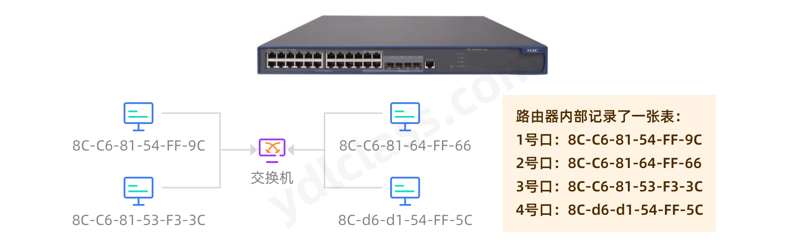

思考一个问题：

交换机是怎么知道这个表的：

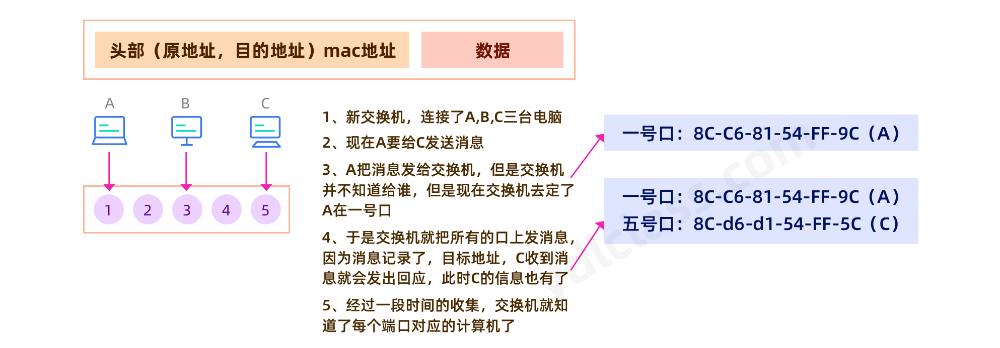

交换机效率比较高，而且可以进行桥接。

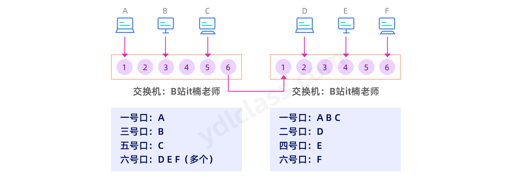

#### （3）路由器

 思考：使用交换机可以建立一个超大型的网络吗？

 一般的交换机的地址表也就能存个几千个地址，当网络内的设备多起来以后，只要交换机找不到对应设备就会广播，地址表如果满了，新地址还会覆盖旧地址就会导致重新寻找效率比较低。所以又引入了一个设备叫【路由器】，谁也听过的一个设备，一般家里都有。

 注意：路由器不是猫，猫是调制解调器。它能把计算机的【数字信号】翻译成可沿【普通电话线/光纤】传送的模拟信号，而这些模拟信号又可被线路另一端的另一个调制解调器接收，并译成计算机可懂的【语言】。但是运营商送你的盒子一般既有调制解调器的功能，也有路由器的功能，只不过路由功能不太好。

基于路由器，我们提出了以下的设计：

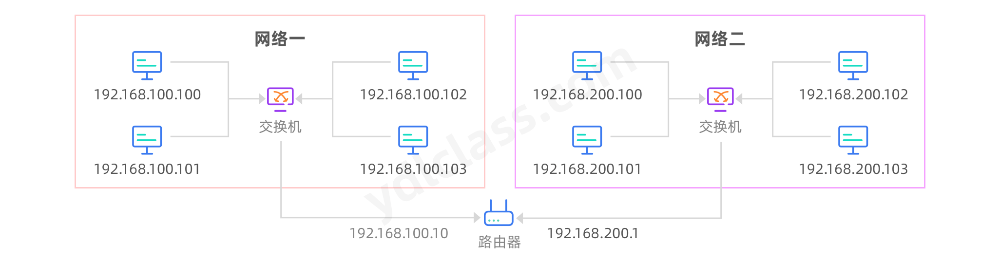

 这里就有了网络的概念了。以上的几种，哪怕是交换机的桥接也没有涉及IP地址这个概念，都是基于MAC地址进行数据传输。这里有了网络这个抽象概念之后IP地址就应运而生了，IP地址只是用来表示计算机的网络位置，它处于哪一个网络。IP地址和子网掩码共同帮助我们定位一个计算机在网络中的位置。

 IP地址和子网掩码其实是个32位的二进制数字：

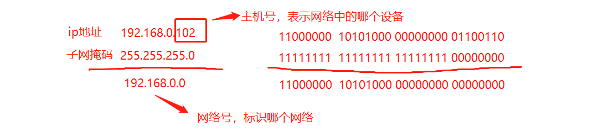

此时发送信息就会再包一个消息的头部


 家用的路由器，有一个WAN口，有好几个LAN口，wan口用来连接互联网端，LAN用来连接家庭设备。信息在网络传播，依然需要依靠MAC地址，这里有一个ARP协议，就是用来通过IP查找MAC地址的。

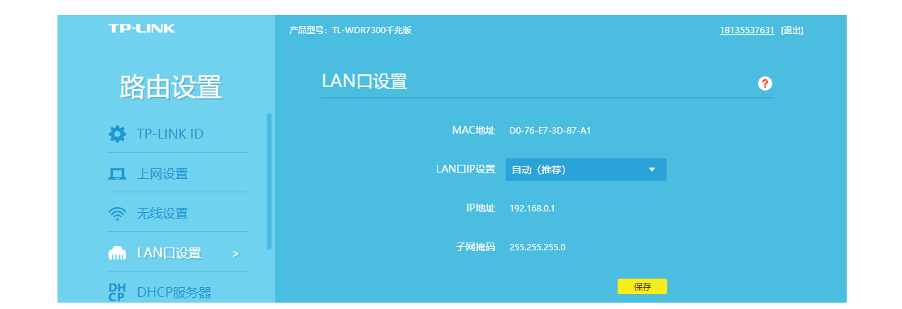

来一个栗子，192.168.100.100 发送信息到 192.168.200.101

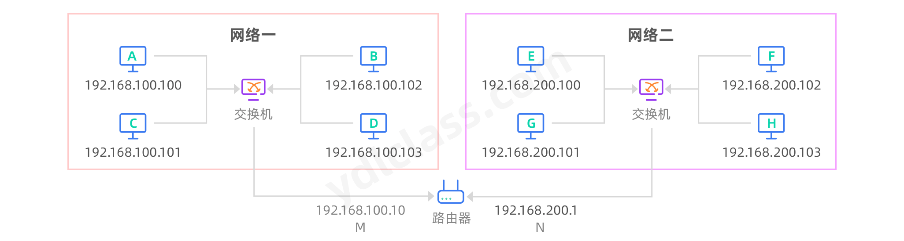

> 这种因特网IP地址中特定的专用地址是不作分配的：

①主机号全为“0”。不论哪一类网络，主机号全为“0”表示指向本网，常用在路由表中；

②主机号全为“1”。主机号全为“1”表示广播地址，向特定的所在网上的所有主机发送数据包。

 IP地址分为五类，A类保留给政府机构，B类分配给中等规模的公司，C类分配给任何需要的人，D类用于组播，E类用于实验，各类可容纳的地址数目不同。

 A、B、C三类IP地址的特征：当将IP地址写成二进制形式时，A类地址的第一位总是O，B类地址的前两位总是10，C类地址的前三位总是110。

> A类地址

1. A类地址第1字节为网络地址，其它3个字节为主机地址。
2. A类地址范围：1.0.0.1—126.255.255.254
3. A类地址中的私有地址和保留地址，10.X.X.X是私有地址（所谓的私有地址就是在互联网上不使用，而被用在局域网络中的地址）。范围（10.0.0.0-10.255.255.255），127.X.X.X是保留地址，用做循环测试用的。

> B类地址

1. B类地址第1字节和第2字节为网络地址，其它2个字节为主机地址。
2. B类地址范围：128.0.0.1—191.255.255.254。
3. B类地址的私有地址和保留地址，172.16.0.0—172.31.255.255是私有地址。

> C类地址

1. C类地址第1字节、第2字节和第3个字节为网络地址，第4个字节为主机地址。另外第1个字节的前三位固定为110。
2. C类地址范围：192.0.0.1—223.255.255.254。
3. C类地址中的私有地址，192.168.X.X是私有地址。(192.168.0.0-192.168.255.255)

> D类地址

1. D类地址不分网络地址和主机地址，它的第1个字节的前四位固定为1110。
2. D类地址范围：224.0.0.1—239.255.255.254

> E类地址

1. E类地址不分网络地址和主机地址，它的第1个字节的前五位固定为11110。
2. E类地址范围：240.0.0.1—255.255.255.254

### 4、域名

你真的能记住每个网站的IP地址吗？域名就是IP的名字，如果IP是手机号，域名就是名字。

我们可以去阿里云等云服务提供商购买域名。


 我们购买了域名之后，需要在云服务厂商进行域名的配置，让域名指向一个拥有公网IP地址的服务器，以后访问域名就能访问到我们的服务器了。

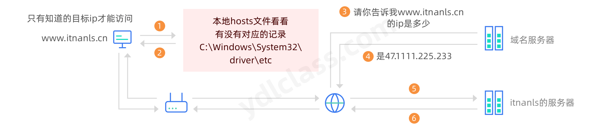

#### （1）DNS服务器

| 名称       | 介绍                                           | DNS地址                                          |
| ---------- | ---------------------------------------------- | ------------------------------------------------ |
| 114DNS     | 国内用户量最大的老牌DNS                        | 首选：114.114.114.114 <br/>备选：114.114.114.115 |
| DNSPod DNS | 中国最大的第三方域名服务商，全球排名第四位     | 首选：119.29.29.29 <br/>备选：182.254.116.116    |
| 阿里 DNS   | 阿里公共DNS是阿里巴巴集团推出的DNS递归解析系统 | 首选：223.5.5.5 <br/>备选：223.6.6.6             |

#### （2）域名的分类

| 分类标准 | 分类详情                                                     |
| -------- | ------------------------------------------------------------ |
| 语种分类 | 中文：百度\.com 、百度\.中国、baidu\.中国 <br/>英文：baidu\.com |
| 地区分类 | 中国大陆顶级域名是\.cn<br/>美国国家顶级域名是\.us <br/>日本国家顶级域名是\.jp |
| 机构分类 | \.com 商业性的机构或公司 <br/>\.org 非盈利的组织、团体 [https://apache.org/](https://apache.org/) <br/>\.gov 政府部门 [http://www.gov.cn/](http://www.gov.cn/) [https://www.shanghai.gov.cn/](https://www.shanghai.gov.cn/) |
| 层级分类 | 顶级域名（一级域名)：[baidu.com](http://baidu.com/) <br/>二级域名：jingyan\.baidu\.com  [www.baidu.com](http://www.baidu.com/) |

## 二、数据的传输

### 1、网络七层参考模型

 讲这个之前我们先聊聊历史：

 一般来说，我们认为互联网起源于阿帕网（ARPANET），最早的阿帕网是非常简陋的，它使用网络控制协议（NetWork Control Protocol，缩写NCP）链接不同的计算机。在构建阿帕网之后，其他传输协议的研究慢慢的已经开始展开，NCP诞生两年后，NCP的开发者温特-瑟夫和罗伯特-卡恩一起开发了阿帕网的下一代协议，并在1974年发表了以分组、序列化、流量控制、超时和容错等为核心的一种新的网络协议奠定了TCP/IP协议的基础。

 与此同时，一个叫【ISO】『 国际标准化组织(International Organization for Standardization， *ISO*) 』的组织发现，计算机设备的互联互通是一个值得研究的新领域，于是这个组织出面和众多厂商游说：“我们一起出一个网络互联互通的标准吧，这样大家都遵守这个标准，我们一起把这件事情搞大，大家就都有钱赚了”，于是ISO召集了一帮人认真的开始研究网络联通，这件事情还真搞出了一个非常强悍的标准，这就是【OSI（Open System Interconnection Reference Model）参考模型】。不过等他发布的时候时候，该组织惊讶的发现，满世界都在用一个叫【TCP/IP协议栈】的东西，而且跟OSI没有半毛钱的关系。


事实上我们前面提及的两位牛人卡恩和瑟夫一直都不遗余力的推广TCP/IP，TCP/IP成功也不是偶然的，而是综合了其他几个因素:

- 它是免费的或者仅仅收少量的费用，这就是它的使用人群，非常的广；
- TCP/IP搭上了unix这辆快车，并很快推出了基于【套接字】的实际编程接口。
- TCP/IP来源于实际需求，它确实解决了当下的网络互连标准。

我们接下来看看ISO参考模型和TCP/IP协议栈的对应关系。

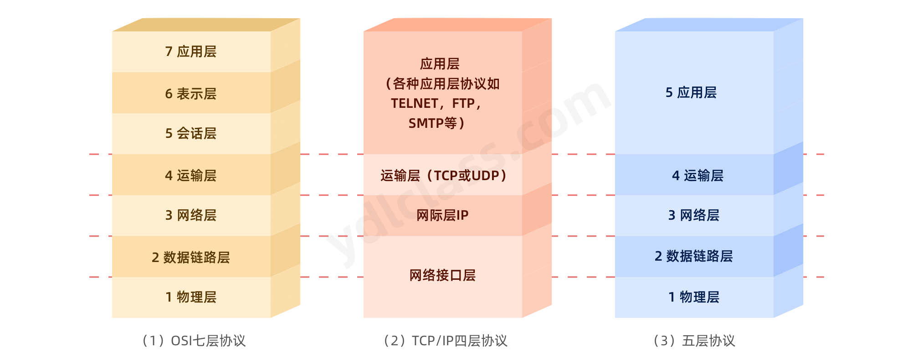

| 层         | 功能                                   | 协议                                     |
| ---------- | -------------------------------------- | ---------------------------------------- |
| 应用层     | 提供应用程序之间的通信。               | TFTP，HTTP，SNMP，FTP，SMTP，DNS，Telnet |
| 表示层     | 处理数据格式，数据加密和压缩等。       | 没有协议                                 |
| 会话层     | 建立、管理、终止两主机的会话。         | 没有协议                                 |
| 传输层     | 建立主机的端到端连接。                 | TCP，UDP                                 |
| 网络层     | 路径选择。                             | ICMP，RIP，OSPF，BGP，IGMP，IP           |
| 数据链路层 | 负责两个相邻结点之间的数据传输。       | SLIP，CSLIP，PPP，ARP，RARP，MTU         |
| 物理层     | 使原始的数据比特流能在物理媒介上传输。 | ISO2110，IEEE802，IEEE802.2              |


 其实我们写代码是没必要关心具体的底层实现逻辑的，系统已经给我们开放了Socket的套接字编程接口，我们能够很简单的用Socket进行开发，当然我们以后可能会接触很多机遇，Http协议的应用层的开发，其实其底层也是Socket。

### 2、数据是怎么传输的

#### （1）TCP协议

 *TCP(Transmission Control Protocol 传输控制协议)*是一种面向连接(连接导向)的、可靠的、 基于IP的传输层协议。提供了流量控制、拥塞控制、超时重传等机制。

 TCP是面向链接的，建立链接需要三次握手，三次握手是为了保障双方都知道对方有发送和接收报文的能力。

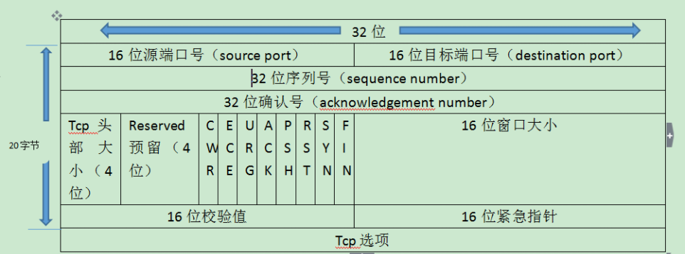

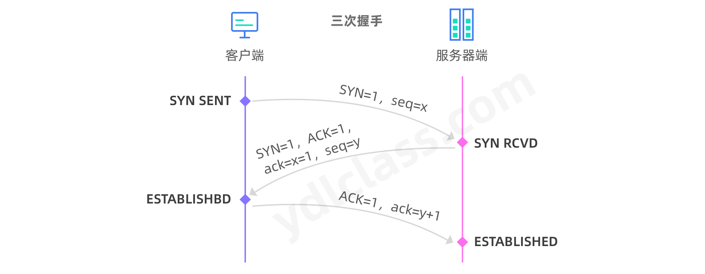

断开链接是需要一个四次挥手的过程：

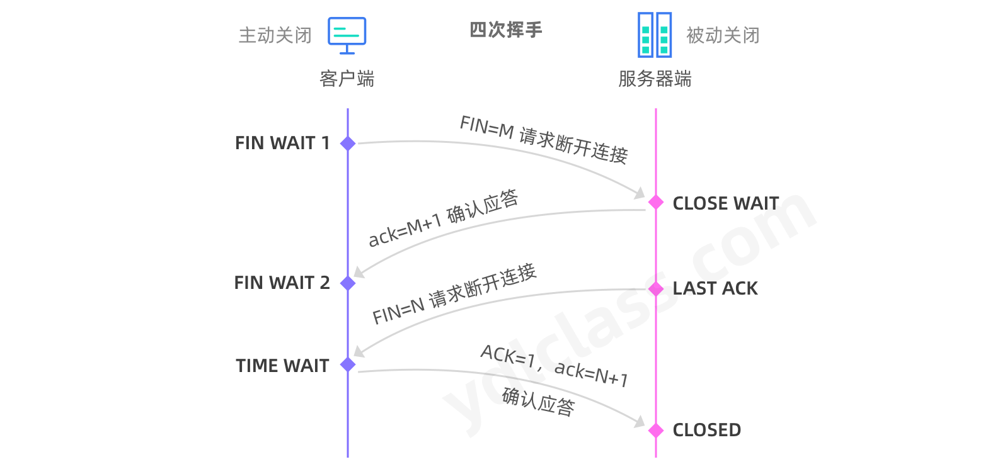

#### （2）UDP协议

 UDP(User Datagram Protocol，用户数据报协议)是一种**传输层**的协议，它提供**不可靠**服务，它是无连接的，所以**不存在建立连接需要的时延**。

 有些场景如直播、电话会议，**能容一些数据的丢失，但是不能允许有较大的时延**。

 TCP需要在端系统中**维护连接**状态，需要一定的开销。此连接装入包括接收和发送缓存，拥塞控制参数和序号与确认号的参数。UCP不维护连接状态，也不跟踪这些参数，开销小。空间和时间上都具有优势。UDP**提供尽最大努力的交付**，不保证可靠交付。

 UDP常用一次性传输比较少量数据的网络应用，如DNS,SNMP等，因为对于这些应用，若是采用TCP，为连接的创建，维护和拆除带来不小的开销。UDP也常用于多媒体应用（如IP电话，实时视频会议，流媒体等）数据的可靠传输对他们而言并不重要，TCP的拥塞控制会使他们有较大的延迟，也是不可容忍的

 

## 三、Socket 编程

 Socket编程是在TCP/IP上的网络编程，但是Socket在上述模型的什么位置呢。这个位置被一个天才的理论家或者是抽象的计算机大神提出并且安排出来

 我们可以发现Socket就在应用程序的传输层和应用层之间，设计了一个Socket抽象层，传输层的底一层的服务提供给Socket抽象层，Socket抽象层再提供给应用层，问题又来了，应用层和Socket抽象层之间和传输层，网络层之间如何通讯的呢，了解这个之前，我们还是回到原点

 要想理解Socket编程怎么通过Socket关键词实现服务器和客户端通讯，必须得先了解TCP/IP是怎么通讯的，在这个的基础上再去理解Socket的握手通讯

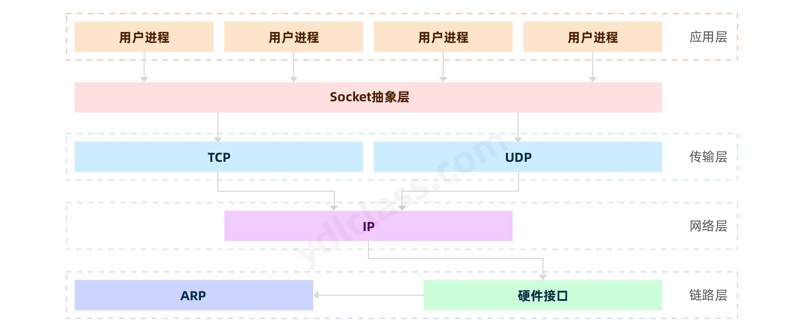

 套接字使用TCP提供了两台计算机之间的通信机制。 客户端程序创建一个套接字，并尝试连接服务器的套接字。

 当连接建立时，服务器会创建一个 Socket 对象。客户端和服务器现在可以通过对 Socket 对象的写入和读取来进行通信。

java.net.Socket 类代表一个套接字，并且 java.net.ServerSocket 类为服务器程序提供了一种来监听客户端，并与他们建立连接的机制。

以下步骤在两台计算机之间使用套接字建立TCP连接时会出现：

- 服务器实例化一个 ServerSocket 对象，表示通过服务器上的端口通信。
- 服务器调用 ServerSocket 类的 `accept()` 方法，该方法将一直等待，直到客户端连接到服务器上给定的端口。
- 服务器正在等待时，一个客户端实例化一个 Socket 对象，指定服务器名称和端口号来请求连接。
- Socket 类的构造函数试图将客户端连接到指定的服务器和端口号。如果通信被建立，则在客户端创建一个 Socket 对象能够与服务器进行通信。
- 在服务器端，`accept()` 方法返回服务器上一个新的 Socket 引用，该 Socket 连接到客户端的 Socket。

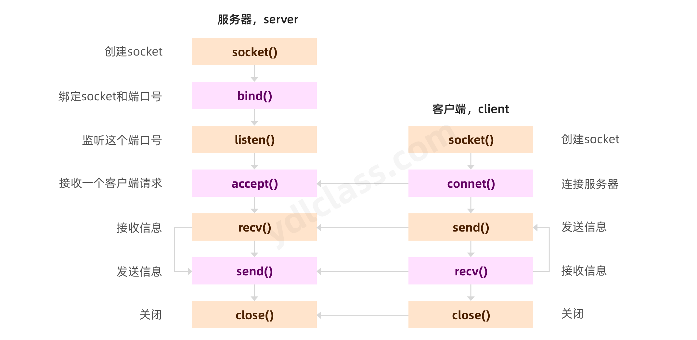

在学习Socket编程后我们先学习几个工具类：

### 1、InetAddress

```text
Internet Protocol (IP) address
```

#### （1）主机名

 这个类表示互联网协议(IP)地址。下面列出了 Socket 编程时比较有用的方法：

 【主机名】就是计算机的名字（计算机名），这个名字可以随时更改，从我的电脑-属性的计算机名就可更改。

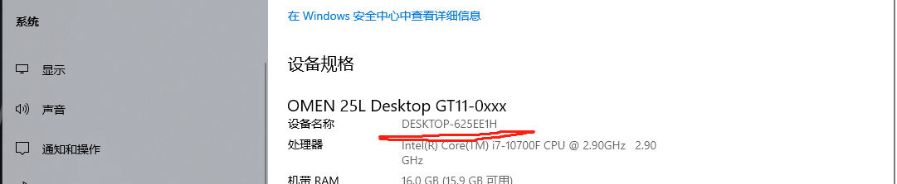


> 主机名和域名的联系与区别如下：

1、Internet域名是Internet网络上的一个服务器或一个网络系统的名字,在全世界,没有重复的域名。域名的范围要比主机名大。一个域名下可以有多个主机名,域名下还可以有子域名。例如,域名cnwg\.cn下,有主机server1和server2,其主机全名就是server1\.cnwg\.cn 和 server2\.cnwg\.cn

2、主机名的含义是机器本身的名字，域名是方面记录IP地址才做的一种IP映射；二者有共性：都能对应到一个唯一的IP上，从应用场景上可以这么简单理解二者的区别：主机名用于局域网中；域名用于公网中。

#### （2）环回地址

 环回地址是主机用于向自身发送通信的一个特殊地址（也就是一个特殊的目的地址）。访问本机的环回地址可以绕开TCP/IP协议栈的下层。（也就是说：不用再通过什么链路层、物理层、以太网传出去了，而是可以直接在自己的网络层、运输层进行处理了）

 IPv4的环回地址为：127.0.0.0到127.255.255.255都是环回地址（只是有两个特殊的保留），此地址中的任何地址都不会出现在网络中，网络号为127的地址根本就不是一个网络地址（因为产生的IP数据报就不会到达外部网络接口中，是不离开主机的包）

 当操作系统初始化本机的TCP/IP协议栈时，设置协议栈本身的IP地址为127.0.0.1（保留地址）。当IP层接收到目的地址为127.0.0.1（准确的说是：网络号为127的IP）的数据包时，不调用网卡驱动进行二次封装，而是立即转发到本机IP层进行处理，由于不涉及底层操作。因此，ping 127.0.0.1一般作为测试本机TCP/IP协议栈正常与否的判断之一。

 所以说：127.0.0.1是保留地址之一，只是被经常的使用，来检验本机TCP/IP协议栈而已。如果我们可以ping通的话，就说明：本机的网卡和IP协议安装都没有问题。（跟我们当前主机有没有联网没有一点关系）

#### （3）localhost

localhost是个域名，但是是个保留域名，是给回路网络接口（loopback）的一个标准主机名，相对应的IP地址为127.0.0.1（IPv4）和[::1]（IPv6）。它可以被配置为任意的IP地址（也就是说，可以通过hosts这个文件进行更改的），不过默认情况下都指向： 127.0.0.1。

 本机IP，我们可以理解为本机有三块网卡，一块网卡叫做loopback（虚拟网卡），一块叫做ethernet（有线网卡），一块叫做wlan（你的无线网卡）。

#### （4）InetAddress的使用

| **序号** | **方法描述**                                              |                                                     |
| -------- | --------------------------------------------------------- | --------------------------------------------------- |
| 1        | static InetAddress getByAddress(byte[] addr)              | 在给定原始 IP 地址的情况下，返回 InetAddress 对象。 |
| 2        | static InetAddress getByAddress(String host, byte[] addr) | 根据提供的主机名和 IP 地址创建 InetAddress。        |
| 3        | static InetAddress getByName(String host)                 | 在给定主机名的情况下确定主机的 IP 地址。            |
| 4        | String getHostAddress()                                   | 返回 IP 地址字符串（以文本表现形式）。              |
| 5        | String getHostName()                                      | 获取此 IP 地址的主机名。                            |
| 6        | static InetAddress getLocalHost()                         | 返回本地主机。                                      |
| 7        | String toString()                                         | 将此 IP 地址转换为 String。                         |

------

我们可以写个代码找到百度的IP：

```java
InetAddress inetAddress = InetAddress.getByName("www.baidu.com");
System.out.println(inetAddress.getHostAddress());
```

### 2、URL

#### （1）简介

 URL（Uniform Resource Locator）中文名为统一资源定位符，咱们的网页地址也是一种URL。表示为互联网上的资源，如网页或者 FTP 地址。我们可以使用URL很方便的定位到一个资源，URL 可以分为如下几个部分。

```text
protocol://host:port/path?query#fragment
```

protocol(协议)可以是 HTTP、HTTPS、FTP 和 File，port 为端口号，path为文件路径及文件名。

这个一个QQ的下载URL：

```
https://down.qq.com/qqweb/PCQQ/PCQQ_EXE/PCQQ2021.exe
```

URL 解析：

- 协议为(protocol)：https
- 主机为(host:port)：down\.qq\.com
- 端口号为(port) 443 ，以上URL实例并未指定端口，因为 HTTPS 协议默认的端口号为443。HTTP为80。
- 文件路径为(path)：/qqweb/PCQQ/PCQQ_EXE/PCQQ2021\.exe

当然本地文件也可以使用URL来表示：

```java
file:///D:/a.txt
```

#### （2）URL 类方法

 在java.net包中定义了URL类，该类用来处理有关URL的内容。对于URL类的创建和使用，下面分别进行介绍。

 java.net.URL提供了丰富的URL构建方式，并可以通过java.net.URL来获取资源。

| 序号 | 方法描述                                                     |                                                              |
| :--- | :----------------------------------------------------------- | ------------------------------------------------------------ |
| 1    | public URL(String protocol, String host, int port, String file) throws MalformedURLException | 通过给定的参数(协议、主机名、端口号、文件名)创建URL。        |
| 2    | public URL(String protocol, String host, String file) throws MalformedURLException | 使用指定的协议、主机名、文件名创建URL，端口使用协议的默认端口。 |
| 3    | public URL(String url) throws MalformedURLException          | 通过给定的URL字符串创建URL                                   |
| 4    | public URL(URL context, String url) throws MalformedURLException | 使用基地址和相对URL创建                                      |

 URL类中包含了很多方法用于访问URL的各个部分，具体方法及描述如下：

| 序号 | 方法                                                     | 描述                                    |
| :--- | :------------------------------------------------------- | --------------------------------------- |
| 1    | public String getPath()                                  | 返回URL路径部分。                       |
| 4    | public int getPort()                                     | 返回URL端口部分                         |
| 5    | public int getDefaultPort()                              | 返回协议的默认端口号。                  |
| 6    | public String getProtocol()                              | 返回URL的协议                           |
| 7    | public String getHost()                                  | 返回URL的主机                           |
| 8    | public String getFile()                                  | 返回URL文件名部分                       |
| 10   | public URLConnection openConnection() throws IOException | 打开一个URL连接，并运行客户端访问资源。 |

比如我们想访问文件，还可以使用这种方式：

```java
public static void main(String[] args) throws IOException {
    URL resource = new URL("file:///D:/a.txt");
    URLConnection urlConnection = resource.openConnection();
    InputStream inputStream = urlConnection.getInputStream();

    byte[] buf = new byte[1024];
    int len;
    while ((len = inputStream.read(buf)) != -1){
        System.out.println(new String(buf,0,len));
    }
}
```

 如果我们把url换成QQ的文件下载地址，我们就可以使用java代码下载网络文件了。

代码如下：

```java
public static void main(String[] args) throws IOException {
    URL url = new URL("https://down.qq.com/qqweb/PCQQ/PCQQ_EXE/PCQQ2021.exe");
    URLConnection urlConnection = url.openConnection();
    InputStream inputStream = urlConnection.getInputStream();
    OutputStream outputStream = new FileOutputStream("D:/QQ.exe");
    byte[] bytes = new byte[1024];
    int len;
    while ((len = inputStream.read(bytes)) != -1){
        outputStream.write(bytes,0,len);
    }
}
```

### 3、ServerSocket 类的方法

 服务器应用程序通过使用 java.net.ServerSocket 类以获取一个端口,并且侦听客户端请求。

 ServerSocket 类有四个构造方法：

 backlog是一个队列长度，我们可以简单的把他理解为最多允许多少个人排队握手。

| **序号** | **方法描述**                                                 |                                                              |
| -------- | ------------------------------------------------------------ | ------------------------------------------------------------ |
| 1        | public ServerSocket(int port)                                | 创建绑定到特定端口的服务器套接字                             |
| 2        | public ServerSocket(int port, int backlog)                   | 利用指定的 backlog 创建服务器套接字并将其绑定到指定的本地端口号 |
| 3        | public ServerSocket(int port, int backlog, InetAddress address) | 使用指定的端口、侦听 backlog 和要绑定到的本地 IP 地址创建服务器 |
| 4        | public ServerSocket() throws IOException                     | 创建非绑定服务器套接字                                       |

 创建非绑定服务器套接字。 如果 ServerSocket 构造方法没有抛出异常，就意味着你的应用程序已经成功绑定到指定的端口，并且侦听客户端请求。

这里有一些 ServerSocket 类的常用方法：

| **序号** | **方法描述**                                                 |
| -------- | ------------------------------------------------------------ |
| 1        | public int getLocalPort() 返回此套接字在其上侦听的端口。     |
| 2        | public Socket accept() 侦听并接受到此套接字的连接。          |
| 4        | public void bind(SocketAddress host, int backlog) 将 ServerSocket 绑定到特定地址（IP 地址和端口号）。 |

------


 SocketAddress 指一个Socket的地址，它和InetAddress 不同，Socket网络地址除了需要主机名或IP之外，还需要一个用于通信的端口：

所以我们看到它的一个子类：InetSocketAddress的构造方法如下：

```java
public InetSocketAddress(int port) {
    this(InetAddress.anyLocalAddress(), port);
}

public synchronized InetAddress anyLocalAddress() {
    if (anyLocalAddress == null) {
        anyLocalAddress = new Inet4Address(); // {0x00,0x00,0x00,0x00}
        anyLocalAddress.holder().hostName = "0.0.0.0";
    }
    return anyLocalAddress;
}

-----------------------------------------------------------

public InetSocketAddress(InetAddress addr, int port) {
    holder = new InetSocketAddressHolder(
        null,
        addr == null ? InetAddress.anyLocalAddress() : addr,
        checkPort(port));
}
```

### 4、Socket 类的方法

java.net.Socket 类代表客户端和服务器都用来互相沟通的套接字。客户端要获取一个 Socket 对象通过实例化 ，而 服务器获得一个 Socket 对象则通过 `accept()` 方法的返回值。

Socket 类有五个构造方法.

| **序号** | **方法描述**                                                 |
| -------- | ------------------------------------------------------------ |
| 1        | public Socket(String host, int port) throws UnknownHostException, IOException. 创建一个流套接字并将其连接到指定主机上的指定端口号。 |
| 2        | public Socket(InetAddress host, int port) throws IOException 创建一个流套接字并将其连接到指定 IP 地址的指定端口号。 |
| 3        | public Socket(String host, int port, InetAddress localAddress, int localPort) throws IOException. 创建一个套接字并将其连接到指定远程主机上的指定远程端口。 |
| 4        | public Socket(InetAddress host, int port, InetAddress localAddress, int localPort) throws IOException. 创建一个套接字并将其连接到指定远程地址上的指定远程端口。 |
| 5        | public Socket() 通过系统默认类型的 SocketImpl 创建未连接套接字 |

当 Socket 构造方法返回，并没有简单的实例化了一个 Socket 对象，它实际上会尝试连接到指定的服务器和端口。

下面列出了一些感兴趣的方法，注意客户端和服务器端都有一个 Socket 对象，所以无论客户端还是服务端都能够调用这些方法。

| **序号** | **方法描述**                                                 |
| -------- | ------------------------------------------------------------ |
| 1        | **public void connect(SocketAddress host, int timeout) throws IOException** 将此套接字连接到服务器，并指定一个超时值。 |
| 2        | **public InetAddress getInetAddress()** 返回套接字连接的地址。 |
| 3        | **public int getPort()** 返回此套接字连接到的远程端口。      |
| 4        | **public int getLocalPort()** 返回此套接字绑定到的本地端口。 |
| 5        | **public SocketAddress getRemoteSocketAddress()** 返回此套接字连接的端点的地址，如果未连接则返回 null。 |
| 6        | **public InputStream getInputStream() throws IOException** 返回此套接字的输入流。 |
| 7        | **public OutputStream getOutputStream() throws IOException** 返回此套接字的输出流。 |
| 8        | **public void close() throws IOException** 关闭此套接字。    |

### 5、客户端和服务端的通信

```java
@Test
public void serverTest() throws IOException {
    // 创建ServerSocket
    ServerSocket server = new ServerSocket();
    // 绑定在某一个端口上
    server.bind(new InetSocketAddress(8888));
    // 监听在这个端口
    Socket socket = server.accept();

    InputStream inputStream = socket.getInputStream();

    byte[] buffer = new byte[1024 * 1024];
    int len;
    while ((len = inputStream.read(buffer)) != -1){
        System.out.println(new String(buffer,0,len));
    }
    inputStream.close();
    socket.close();
}

@Test
public void clientTest() throws IOException {
    // 创建Socket
    Socket socket = new Socket();
    // 使用这个socket进行连接
    socket.connect(new InetSocketAddress(InetAddress.getLoopbackAddress(),8888));

    InputStream inputStream = socket.getInputStream();
    OutputStream outputStream = socket.getOutputStream();
    outputStream.write("hello server!".getBytes());

    outputStream.close();
    inputStream.close();
    socket.close();

}
```

### 6、UDP的实现

对于UDP而言，它是没有连接过程的，直接面向的是数据报，所以，在UDP中只有两个核心的类。

DatagramSocket：用来建立socket

DatagramPacket：用来封装一个数据报文

```java
public class UDPTest {

    //发送端
    @Test
    public void sender() throws IOException {

        // 创建socket，可以指定端口，如果不指定会随机开一个端口，一般我们客户端都会选择随机端口
        DatagramSocket socket = new DatagramSocket();

        String str = "我是UDP方式发送的导弹";
        byte[] data = str.getBytes();
        // 构建一个数据报
        DatagramPacket packet = new DatagramPacket(
                    data.getBytes(),0,data.getBytes().length,
                    new InetSocketAddress(InetAddress.getByName("localhost"),8080)
            );

        // 直接发送
        socket.send(packet);

        socket.close();

    }
    //接收端
    @Test
    @SuppressWarnings("InfiniteLoopStatement")
    public void receiver() throws IOException {

        DatagramSocket socket = new DatagramSocket(9090);

        byte[] buffer = new byte[100];
        DatagramPacket packet = new DatagramPacket(buffer,0,buffer.length);

        // 接收
        socket.receive(packet);
		// packet.getData() 用来获取数据报的数据
        // packet.getLength() 用来获取读取的数据报的长度
        String str = new String(packet.getData(), 0, packet.getLength());
        System.out.println(str);

        socket.close();
    }
}
```

## 四、打造一个聊天系统

> 1、创建一个客户端
>
> 2、创建一个服务端

### 1.项目构建

（1）先在idea里面新建一个模块 `stazxrChatServer`

 

（2）建包，包里面创建`cn.stazxr.Server`类和`cn.stazxr.Client`类

*Client*

```java
package cn.stazxr;

/**
 * 功能：1、给服务器发消息  2、给好友发消息  3、群发消息
 * 1、用什么类型发消息？
 */
public class Client {

    public static void main(String[] args) throws IOException {

    }

}
```

*Server*

```java
package cn.stazxr;

public class Server {

    public static void main(String[] args) throws IOException, ClassNotFoundException {

        }
    }
}
```

（3）对于我们的服务端，我们需要使用`ServerSocket`创建一个服务器，并绑定一个端口。

```java
public class Server {

    /*有异常先抛出去，之后再处理*/
    public static void main(String[] args) throws IOException{
        // 创建一个服务器
        ServerSocket serverSocket = new ServerSocket();
        // 绑定端口
        serverSocket.bind(new InetSocketAddress(8888));
        System.out.println("服务器已经启动，在8888端口！");
    }
}
```

（4）对于我们的客户端，我们需要使用`Socket`与服务端建立连接。

```java
/**
 * 功能：1、给服务器发消息  2、给好友发消息  3、群发消息
 * 1、用什么类型发消息
 */
public class Client {
	/*有异常先抛出去，之后再处理*/
    public static void main(String[] args) throws IOException {
        Socket socket = new Socket();
        // 链接服务器
        socket.connect(new InetSocketAddress(8888));
    }

}
```

现在，我们的客户端有3种需求

1. 给服务器发消息
2. 给好友发消息
3. 群发消息

所以我们需要对消息进行选择，比如我们在发消息的时候使用特定的字符串格式：

```java
// 发消息
OutputStream outputStream = socket.getOutputStream();
// 使用‘-’分割字符串
outputStream.write("type-Message".getBytes());
```

这样我们在服务端处理时，就可以分辨服务端接受到是什么类型的数据。然后，再进行对应的操作。

但是在java流中，可以提供一个序列化的操作。

我们的对象可以序列化，通过网络传输！

（5）创建类Message，提供消息的序列化操作

```java
package cn.stazxr;

import java.io.Serial;
import java.io.Serializable;

public class Message implements Serializable {

    @Serial // serialVersionUID 为了今后的的修改，先加上
    private static final long serialVersionUID = 8327856103560598769L;
    // 消息的类型
    private Integer type;
    // 消息的内容
    private String content;

    public Message() {
    }

    public Message(Integer type, String content) {
        this.type = type;
        this.content = content;
    }

    public Integer getType() {
        return type;
    }

    public void setType(Integer type) {
        this.type = type;
    }

    public String getContent() {
        return content;
    }

    public void setContent(String content) {
        this.content = content;
    }

    @Override
    public String toString() {
        return "Message{" +
                "type=" + type +
                ", content='" + content + '\'' +
                '}';
    }
}
```

接下来我们就可以使用Message对象来传递消息

```java
/**
 * 功能：1、给服务器发消息  2、给好友发消息  3、群发消息
 * 1、用什么类型发消息
 */
public class Client {

    public static void main(String[] args) throws IOException {
        Socket socket = new Socket();
        // 链接服务器
        socket.connect(new InetSocketAddress(8888));
        // 发消息
        OutputStream outputStream = socket.getOutputStream();
		outputStream.write(new Message(1,"hello"));
		// 关闭输出流
        outputStream.close();
    }

}
```

第13行代码`outputStream.write(new Message(1,"hello"));`，我们传了一个数字1，来表示这是一个给服务器发消息的消息类型。

但是直接在客户端程序写数字不是很直观（不够面向对象！QAQ），所以我们可以采用常量或枚举来表示

这里我们新建一个MessageType类(cn\.stazxr\.constant\.MessageType)，采用常量来表示消息类型：

```java
package cn.stazxr.constant;

public class MessageType {
    // 给服务器发消息
    public static final int TO_SERVER = 1;
    // 给好友发消息
    public static final int TO_FRIEND = 2;
    // 群发消息
    public static final int TO_ALL = 3;
}
```

`outputStream.write(new Message(1,"hello"));`就可以改成：

`outputStream.write(new Message(MessageType.TO_SERVER,"hello"));`

这样我们以后的代码就会加直观，可读性高！

（6）完善服务端

```java
package cn.stazxr;

import java.io.IOException;
import java.io.InputStream;
import java.net.InetSocketAddress;
import java.net.ServerSocket;
import java.net.Socket;

public class Server {

    public static final Map<String,Socket> USERS = new ConcurrentHashMap<>();

    @SuppressWarnings("all")
    public static void main(String[] args) throws IOException, ClassNotFoundException {
        // 创建一个服务器
        ServerSocket serverSocket = new ServerSocket();
        // 绑定端口
        serverSocket.bind(new InetSocketAddress(8888));
        System.out.println("服务器已经启动，在8888端口！");
        // 开始监听
        Socket socket = serverSocket.accept();
        InputStream inputStream = socket.getInputStream();
        ObjectInputStream ois = new ObjectInputStream(inputStream);
        Message message = (Message) ois.readObject());
        System.out.println(message);
    }
}

```

让我们依次运行服务端和客户端来测试一下

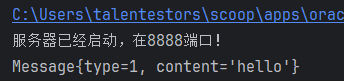

消息被打印出来了！

### 2.结构优化

现在我们还没有处理异常，并且整个客户端和服务端的代码十分冗余，未来try-catch会很乱！我们在客户端和服务端代码应该尽量只保留业务逻辑。所以我们可以在消息的接收和发送的逻辑独立起来，把它们包装成一个工具类！

（1）新建cn\.stazxr\.util的包

（2）新建一个MsgUtils工具类

```java
package cn.stazxr.util;

import cn.stazxr.Message;

import java.io.IOException;
import java.io.InputStream;
import java.io.ObjectInputStream;
import java.io.ObjectOutputStream;
import java.io.OutputStream;
import java.util.Optional;

public class MsgUtils {

    // 从流中读取msg
    public static Optional<Message> readMsg(InputStream inputStream) {
        ObjectInputStream ois;
        try {
            ois = new ObjectInputStream(inputStream);
            // 封装成一个optional，将来外界使用就可以避免空指针
            return Optional.ofNullable((Message) ois.readObject());
        } catch (IOException | ClassNotFoundException e) {
            e.printStackTrace();
        }
        return Optional.empty();
    }

    // 向输出流写消息
    public static void writeMsg(OutputStream outputStream,Message message) {
        ObjectOutputStream oos;
        try {
            oos = new ObjectOutputStream(outputStream);
            oos.writeObject(message);
            oos.flush();
        } catch (IOException e) {
            e.printStackTrace();
        }
    }

}
```

读取消息时，为了避免代码报空指针异常，我们使用[Optional](https://zhuanlan.zhihu.com/p/580961892)类再包装一层。

服务端

```java
public class Server {

    public static final Map<String,Socket> USERS = new ConcurrentHashMap<>();

    public static void main(String[] args) throws IOException, ClassNotFoundException {
        // 创建一个服务器
        ServerSocket serverSocket = new ServerSocket();
        // 绑定端口
        serverSocket.bind(new InetSocketAddress(8888));
        System.out.println("服务器已经启动，在8888端口！");
        // 开始监听
        Socket socket = serverSocket.accept();
        InputStream inputStream = socket.getInputStream();
        Optional<Message> message = MsgUtils.readMsg(inputStream);
        // Optional消费信息
        message.ifPresent(System.out::println);
    }
}
```

客户端

```java
/**
 * 功能：1、给服务器发消息  2、给好友发消息  3、群发消息
 * 1、用什么类型发消息
 */
public class Client {

    public static void main(String[] args) throws IOException {
        Socket socket = new Socket();
        // 链接服务器
        socket.connect(new InetSocketAddress(8888));
        // 发消息
        OutputStream outputStream = socket.getOutputStream();

        MsgUtils.writeMsg(outputStream,new Message(MessageType.TO_SERVER,"hello"));

        outputStream.close();
    }

}
```

然后先用`while(true)`包一下，让服务端一直监听端口

```java
@SuppressWarnings("all")
public static void main(String[] args) throws IOException, ClassNotFoundException {
    // 创建一个服务器
    ServerSocket serverSocket = new ServerSocket();
    // 绑定端口
    serverSocket.bind(new InetSocketAddress(8888));
    System.out.println("服务器已经启动，在8888端口！");
    // 开始监听
    while (true){
        Socket socket = serverSocket.accept();
        InputStream inputStream = socket.getInputStream();
        Optional<Message> message = MsgUtils.readMsg(inputStream);
        message.ifPresent(System.out::println);
    }
}
```

测试一下：

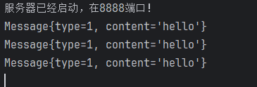

每运行一次客户端，服务端这边就打印一条消息

### 3.多用户维护

每个用户都需要用户名和密码

为了让服务知道用户名和密码，我们给Message类再添加两个属性。

```java
// 用来登录
private String username;
private String password;

private String friendUesrName;
```

**重新写getter和setter！**

**重新写toString()！**

构造器也要重写

```java
public Message() {
}
public Message(Integer type, String content, String username) {
    this.type = type;
    this.content = content;
    this.username = username;
}
public Message(Integer type, String content, String username, String friendUesrName) {
    this.type = type;
    this.content = content;
    this.username = username;
    this.friendUesrName = friendUesrName;
}
```

服务端可以用map存一下用户

`public static final Map<String,Socket> ONLINE_USERS = new ConcurrentHashMap<>();`

现在，客户端就可以加上用户名了

```java
// 先登录
MsgUtils.writeMsg(outputStream,new Message(MessageType.TO_SERVER,"hello","lucy"));
```

消息的类型可以加一个登录的消息

```java
package cn.stazxr.constant;

public class MessageType {
    public static final int LOGIN = 4;
    public static final int TO_SERVER = 1;
    public static final int TO_FRIEND = 2;
    public static final int TO_ALL = 3;
    public static final int FROM_SERVER = 5;
}
```

咱们还可以为用户登录专门的构造器。

```java
// 登录的构造器
public Message(String username, String password,Integer type) {
    this.type = type;
    this.username = username;
    this.password = password;
}
```

但是在这里我们不使用这个这种方式，因为登录的消息比较特殊，我们在客户端单独封装一个方法。

我们先测试一下：

现在，我们的Server类已经改写成这样：

```java
public class Server {

    // 存登录的用户
    public static final Map<String, Socket> ONLINE_USERS = new ConcurrentHashMap<>();

    @SuppressWarnings("all")
    public static void main(String[] args) throws IOException, ClassNotFoundException {
        // 创建一个服务器
        ServerSocket serverSocket = new ServerSocket();
        // 绑定端口
        serverSocket.bind(new InetSocketAddress(8888));
        System.out.println("服务器已经启动，在8888端口！");
        // 开始监听
        while (true) {
            Socket socket = serverSocket.accept();
            InputStream inputStream = socket.getInputStream();
            OutputStream outputStream = socket.getOutputStream();
            Optional<Message> message = MsgUtils.readMsg(inputStream);
            // 判断登录的逻辑
            if (!message.isPresent() || message.get().getUsername() == null || !message.get().getPassword().equals("123456")) {
                MsgUtils.writeMsg(outputStream, new Message(MessageType.FROM_SERVER, "登录失败！", "server"));
                continue;
            } else {
                Message msg = message.get();
                // 验证成功放入在线用户map中
                ONLINE_USERS.put(msg.getUsername(),socket);
                System.out.println(msg.getUsername() + "登录成功！");
                MsgUtils.writeMsg(outputStream, new Message(MessageType.FROM_SERVER, "登录成功！", "server"));
            }
        }
    }
}
```

Client类改写成了这样：

```java
package cn.stazxr;
/**
 * 功能：1、给服务器发消息  2、给好友发消息  3、群发消息
 * 1、用什么类型发消息
 */
public class Client {

    public static void main(String[] args) throws IOException {
        Socket socket = new Socket();
        // 链接服务器
        socket.connect(new InetSocketAddress(8888));
        // 发消息
        OutputStream outputStream = socket.getOutputStream();

        // 先登录
        Message message = new Message();
        message.setType(MessageType.LOGIN);
        message.setUsername("lucy");
        message.setPassword("123456");
        MsgUtils.writeMsg(outputStream, message);

        outputStream.close();
    }

}
```

MessageType类

```java
package cn.stazxr.constant;

public class MessageType {
    public static final int TO_SERVER = 1;
    public static final int TO_FRIEND = 2;
    public static final int TO_ALL = 3;
    public static final int LOGIN = 4;
    public static final int FROM_SERVER = 5;
}
```

我们跑一下！


报错了qwq

我们这里的服务端报了**连接被拒绝**的异常

原因是我们的客户端没有`InputStream`对象来接收消息，所以我们的服务端给客户端发送登录成功的消息时，客户端根本没法接收！

给Client类加上InputStream。。。😁

```java
/**
 * 功能：1、给服务器发消息  2、给好友发消息  3、群发消息
 * 1、用什么类型发消息
 */
public class Client {

    public static void main(String[] args) throws IOException {
        Socket socket = new Socket();
        // 链接服务器
        socket.connect(new InetSocketAddress(8888));
        // 发消息
        OutputStream outputStream = socket.getOutputStream();
        // 收消息
        InputStream inputStream = socket.getInputStream();

        // 先登录
        Message message = new Message();
        message.setType(MessageType.LOGIN);
        message.setUsername("lucy");
        message.setPassword("123456");
        MsgUtils.writeMsg(outputStream, message);
        Optional<Message> msg = MsgUtils.readMsg(inputStream);
        msg.ifPresent(System.out::println);
        
        outputStream.close();
        socket.close();
    }

}
```

:fish:

再测试一下！

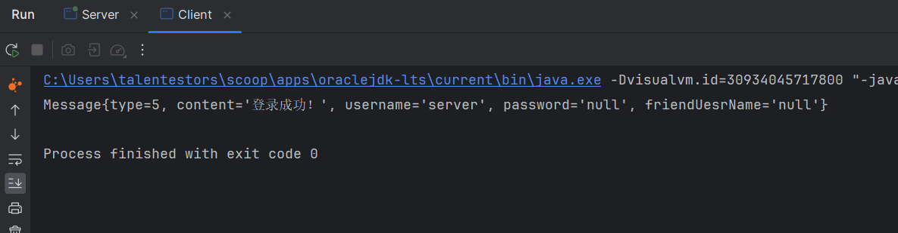

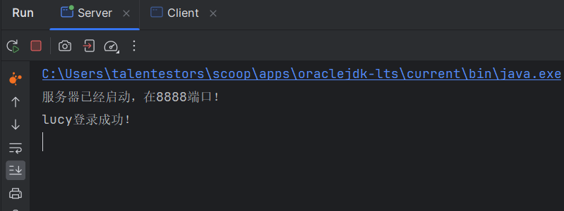

客户端登录成功！:smile:

#### 客户端完善

我们需要要让客户端能一直给服务端发消息。

包一个while循环。

```java
String username = null;
// 先登录
while (true) {
    // 先判断有没有登录
    if (username == null){
        System.out.println("请您输入用户名：");
        String name = ScannerUtil.input();
        System.out.println("请您输入密码：");
        String pwd = ScannerUtil.input();
        Message message = new Message();
        message.setType(MessageType.LOGIN);
        message.setUsername(name);
        message.setPassword(pwd);
        MsgUtils.writeMsg(outputStream, message);
        // 接收来自服务端的消息
        Optional<Message> msg = MsgUtils.readMsg(inputStream);
        if (msg.isPresent() && msg.get().getContent().equals("登录成功！")){
            username = name;
        }
    }
}
```

这里新建了一个工具类（ScannerUtil），用于Scanner。

*ScannerUtil*

```java
package cn.stazxr.util;

import java.util.Scanner;

public class ScannerUtil {

    private static final Scanner scanner = new Scanner(System.in);

    public static String input(){
       return scanner.next();
    }

}
```

欸！如果我们使用`msg.get().getContent().equals("登录成功！")`来判断是不是不太好

首先我们应该反过来使用equals判断字符串：

`"登录成功！".equals(msg.get().getContent())`

其次，这样还是感觉有点不太好，我们再封装一个常量类

```java
package cn.stazxr.constant;

public class Constant {
    // 所有成功的常量
    public static final String SUCCESS = "success";
    // 所有失败的常量
    public static final String FAIL = "fail";

}
```

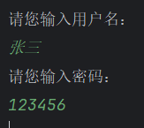

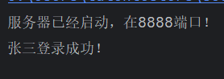

接下来我们把客户端while循环里面的代码抽离出来

包装成一个方法

```java
// 登录的方法
private static String login(OutputStream outputStream, InputStream inputStream) {
    System.out.println("请您输入用户名：");
    String name = ScannerUtil.input();
    System.out.println("请您输入密码：");
    String pwd = ScannerUtil.input();
    Message message = new Message();
    message.setType(MessageType.LOGIN);
    message.setUsername(name);
    message.setPassword(pwd);
    // 发送给服务器
    MsgUtils.writeMsg(outputStream, message);
    // 接收来自服务端的消息
    Optional<Message> msg = MsgUtils.readMsg(inputStream);
    if (msg.isPresent() && Constant.SUCCESS.equals(msg.get().getContent())) {
        return name;
    }
    return null;
}
```

```java
// 表示当前登录的用户
String username = null;
// 先登录
while (true) {
    // 先判断有没有登录
    if (username == null) {
        username = login(outputStream, inputStream);
    } else {
        // 非登录的情况
    }
}
```

接下来对Client进行大量的方法抽离，我们的Client最终变成了这个样子：

```java
public class Client {

    public static void main(String[] args) throws IOException {
        Socket socket = new Socket();
        // 链接服务器
        socket.connect(new InetSocketAddress(8888));
        // 发消息
        OutputStream outputStream = socket.getOutputStream();
        // 收消息
        InputStream inputStream = socket.getInputStream();

        // 表示当前登录的用户
        String username = null;
        // 先登录
        while (true) {
            // 先判断有没有登录
            if (username == null) {
                username = login(outputStream, inputStream);
            } else {
                // 打印菜单
                printOrder();
                String input = ScannerUtil.input();
                switch (Integer.parseInt(input)) {
                    case MessageType.TO_SERVER:
                        sendToServer(username,outputStream, inputStream);
                        break;
                    case MessageType.TO_FRIEND:
                        sendToFriend(username,outputStream, inputStream);
                        break;
                    case MessageType.TO_ALL:
                        sendToAll(username,outputStream, inputStream);
                        break;
                    default:
                        break;
                }
            }
        }
    }

    private static void sendToAll(String username, OutputStream outputStream, InputStream inputStream) {

    }

    private static void sendToFriend(String username, OutputStream outputStream, InputStream inputStream) {

    }

    private static void sendToServer(String username, OutputStream outputStream, InputStream inputStream) {
        System.out.println("请输入要发送的消息：");
    }

    private static void printOrder() {
        System.out.println("请您选择功能：" +
                MessageType.TO_SERVER + "、给服务器发消息 " +
                MessageType.TO_FRIEND + "、给好友发消息 " +
                MessageType.TO_ALL + "、群发消息 ");
    }

    // 登录的方法
    private static String login(OutputStream outputStream, InputStream inputStream) {
        System.out.println("请您输入用户名：");
        String name = ScannerUtil.input();
        System.out.println("请您输入密码：");
        String pwd = ScannerUtil.input();
        Message message = new Message();
        message.setType(MessageType.LOGIN);
        message.setUsername(name);
        message.setPassword(pwd);
        // 发送给服务器
        MsgUtils.writeMsg(outputStream, message);
        // 接收来自服务端的消息
        Optional<Message> msg = MsgUtils.readMsg(inputStream);
        if (msg.isPresent() && Constant.SUCCESS.equals(msg.get().getContent())) {
            return name;
        }
        return null;
    }
}
```

服务器也一样

```java
public class Server {

    // 存登录的用户
    public static final Map<String, Socket> ONLINE_USERS = new ConcurrentHashMap<>();

    @SuppressWarnings("all")
    public static void main(String[] args) throws IOException, ClassNotFoundException {
        // 创建一个服务器
        ServerSocket serverSocket = new ServerSocket();
        // 绑定端口
        serverSocket.bind(new InetSocketAddress(8888));
        System.out.println("服务器已经启动，在8888端口！");
        // 开始监听
        while (true) {
            Socket socket = serverSocket.accept();
            InputStream inputStream = socket.getInputStream();
            OutputStream outputStream = socket.getOutputStream();
            Optional<Message> message = MsgUtils.readMsg(inputStream);
            if (message.isPresent()) {
                Message msg = message.get();
                switch (msg.getType()) {
                    case MessageType.LOGIN:
                        loginHandler(inputStream, outputStream, msg, socket);
                        break;
                    case MessageType.TO_SERVER:
                        sendToClient(inputStream, outputStream, msg);
                        break;
                    case MessageType.TO_FRIEND:
                        sendToTarger(inputStream, outputStream, msg);
                        break;
                    case MessageType.TO_ALL:
                        sendToAll(inputStream, outputStream, msg);
                        break;
                }
            }
        }
    }

    private static void sendToAll(InputStream inputStream, OutputStream outputStream, Message message) {

    }

    private static void sendToTarger(InputStream inputStream, OutputStream outputStream, Message message) {

    }

    private static void sendToClient(InputStream inputStream, OutputStream outputStream, Message message) {

    }

    private static void loginHandler(InputStream inputStream, OutputStream outputStream, Message message, Socket socket) {
        // 判断登录的逻辑
        if (message.getUsername() == null || !message.getPassword().equals("123456")) {
            MsgUtils.writeMsg(outputStream, new Message(MessageType.FROM_SERVER, Constant.FAIL, "server"));
        } else {
            // 验证成功放入在线用户map中
            ONLINE_USERS.put(message.getUsername(), socket);
            System.out.println(message.getUsername() + "登录成功！");
            MsgUtils.writeMsg(outputStream, new Message(MessageType.FROM_SERVER, Constant.SUCCESS, "server"));
        }
    }
}
```

### 4.功能实现

#### （1）给服务器发消息

客户端

```java
// 给服务器发消息
private static void sendToServer(String username, OutputStream outputStream, InputStream inputStream) {
    System.out.print(username + ": ");
    String msg = ScannerUtil.input();
    MsgUtils.writeMsg(outputStream,new Message(MessageType.TO_SERVER,username,msg));
    // 接收消息
    Optional<Message> massage = MsgUtils.readMsg(inputStream);
    massage.ifPresent(m -> System.out.println(m.getUsername() + "：" + m.getContent()));
}
```

服务器

先添加几个常量ヾ(•ω•`)o

```java
package cn.stazxr.constant;

public class Constant {
    // 所有成功的常量
    public static final String SUCCESS = "success";
    // 所有失败的常量
    public static final String FAIL = "fail";

    public static final String DEFAULT_PASSWORD = "123456";

    public static final String SERVER_NAME = "server";
    public static final String OK = "OK!";

}
```

把能替换的都替换了。

```java
private static void sendToClient(InputStream inputStream, OutputStream outputStream, Message message) {
    // 接收消息并打印
    System.out.println(message.getUsername() + "：" + message.getContent());
    MsgUtils.writeMsg(outputStream,new Message(MessageType.TO_SERVER,Constant.OK,Constant.SERVER_NAME));
}
```

> 测试：

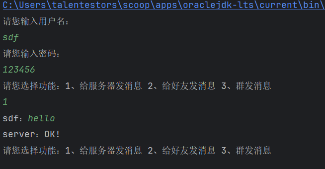

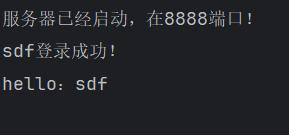

#### （2）给好友发消息

在多用户的情况下，我们要使用多线程处理

新建ServerThread类，继承Thread。

把服务端的代码粘贴到重写的`run()`方法里面。

```java
package cn.stazxr;

import cn.stazxr.constant.Constant;
import cn.stazxr.constant.MessageType;
import cn.stazxr.util.MsgUtils;

import java.io.IOException;
import java.io.InputStream;
import java.io.OutputStream;
import java.net.Socket;
import java.util.Optional;

public class ServerThread extends Thread {

    private Socket socket;

    public ServerThread() {
    }

    public ServerThread(Socket socket) {
        this.socket = socket;
    }

    @Override
    public void run() {
        try (InputStream inputStream = socket.getInputStream();
             OutputStream outputStream = socket.getOutputStream()) {
            while (true) {
                Optional<Message> message = MsgUtils.readMsg(inputStream);
                if (message.isPresent()) {
                    Message msg = message.get();
                    switch (msg.getType()) {
                        case MessageType.LOGIN:
                            loginHandler(inputStream, outputStream, msg, socket);
                            break;
                        case MessageType.TO_SERVER:
                            sendToClient(inputStream, outputStream, msg);
                            break;
                        case MessageType.TO_FRIEND:
                            sendToTarger(inputStream, outputStream, msg);
                            break;
                        case MessageType.TO_ALL:
                            sendToAll(inputStream, outputStream, msg);
                            break;
                    }
                }
            }
        } catch (IOException e) {
            e.printStackTrace();
        }

    }

    private void sendToAll(InputStream inputStream, OutputStream outputStream, Message message) {

    }

    private void sendToTarger(InputStream inputStream, OutputStream outputStream, Message message) {

    }

    private void sendToClient(InputStream inputStream, OutputStream outputStream, Message message) {
        // 接收消息并打印
        System.out.println(message.getUsername() + "：" + message.getContent());
        MsgUtils.writeMsg(outputStream, new Message(MessageType.TO_SERVER, Constant.OK, Constant.SERVER_NAME));
    }

    private void loginHandler(InputStream inputStream, OutputStream outputStream, Message message, Socket socket) {
        // 判断登录的逻辑
        if (message.getUsername() == null || !Constant.DEFAULT_PASSWORD.equals(message.getPassword())) {
            MsgUtils.writeMsg(outputStream, new Message(MessageType.FROM_SERVER, Constant.FAIL, Constant.SERVER_NAME));
        } else {
            // 验证成功放入在线用户map中
            Constant.ONLINE_USERS.put(message.getUsername(), socket);
            System.out.println(message.getUsername() + "登录成功！");
            MsgUtils.writeMsg(outputStream, new Message(MessageType.FROM_SERVER, Constant.SUCCESS, Constant.SERVER_NAME));
        }
    }
}
```

服务器

```java
package cn.stazxr;

import java.io.IOException;
import java.net.InetSocketAddress;
import java.net.ServerSocket;
import java.net.Socket;

public class Server {

    public static void main(String[] args) {
        try (// 创建一个服务器
             ServerSocket serverSocket = new ServerSocket();) {
            // 绑定端口
            serverSocket.bind(new InetSocketAddress(8888));
            System.out.println("服务器已经启动，在8888端口！");
            // 开始监听
            // 建立一个连接
            while (true) {
                Socket socket = serverSocket.accept();
                new ServerThread(socket).start();
            }
        } catch (IOException e) {
            e.printStackTrace();
        }
    }

}
```

在idea中，我们把*Allow multiple instances*的勾勾上，让它可以运行多个客户端实例。

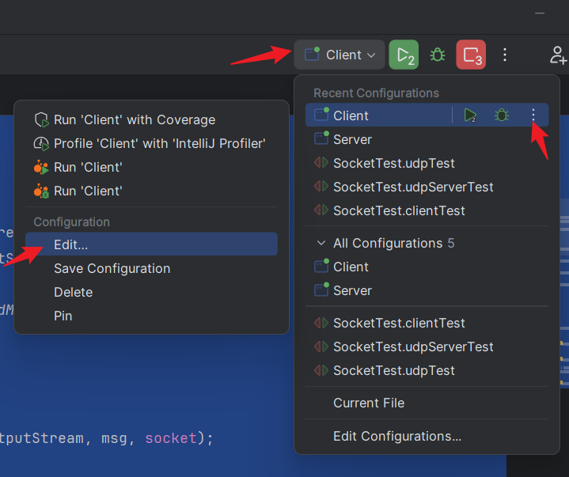

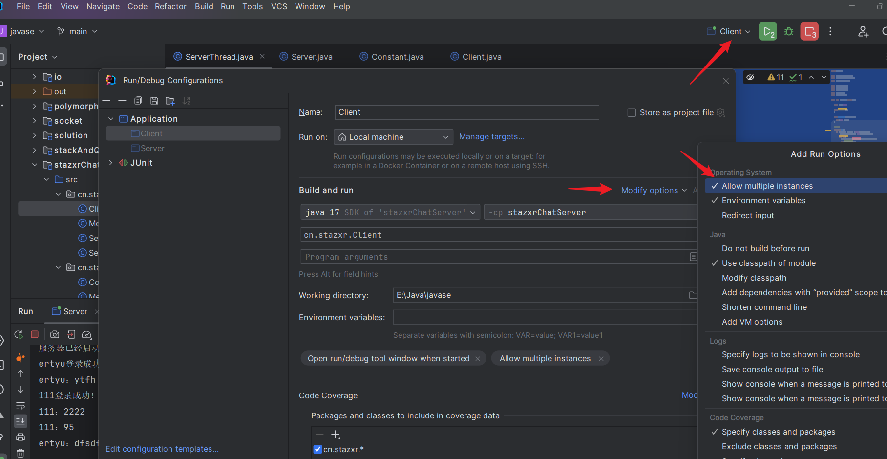

然后我们运行测试一下！

> 服务端

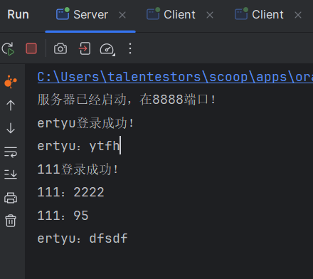

> 客户端1

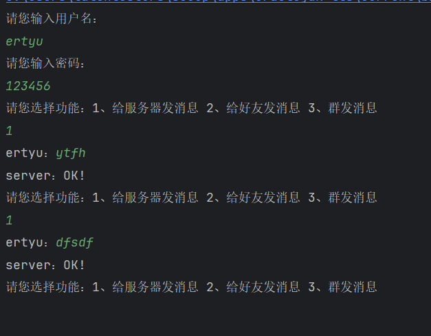

> 客户端2

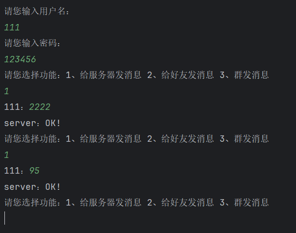

接着我们继续实现给好友发消息

*Client*

```java
private static void sendToFriend(String username, OutputStream outputStream, InputStream inputStream) {
    System.out.print("请输入好友的名字：");
    String friend = ScannerUtil.input();
    boolean flag = true;
    while (flag){
        System.out.print(username + "：");
        String msg = ScannerUtil.input();
        if ("bye".equals(msg)) {
            flag = false;
        }
        MsgUtils.writeMsg(outputStream, new Message(MessageType.TO_FRIEND, msg, username, friend));
          // 接收消息
          Optional<Message> massage = MsgUtils.readMsg(inputStream);
          massage.ifPresent(m -> System.out.println(m.getUsername() + "：" + m.getContent()));
    }
}
private static void receiverMsg(InputStream inputStream) {
    while (true){
        Optional<Message> msg = MsgUtils.readMsg(inputStream);
        msg.ifPresent(m -> System.out.println(m.getUsername() + "：" + m.getContent()));
    }
}
```

*ServerThread*

```java
// 给目标用户发送消息
private void sendToTarger(Message message) {
    // 先找到对应的socket
    Socket socket = Constant.ONLINE_USERS.get(message.getFriendUesrName());
    try {
        MsgUtils.writeMsg(socket.getOutputStream(), message);
    } catch (IOException e) {
        e.printStackTrace();
    }
}
```

> 结果

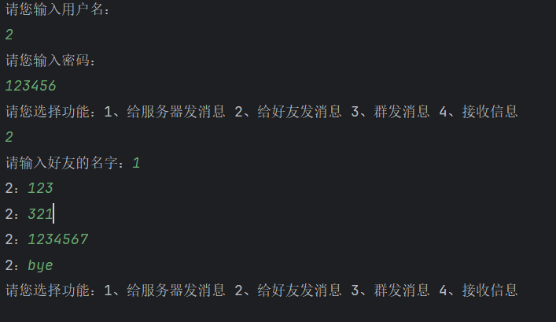

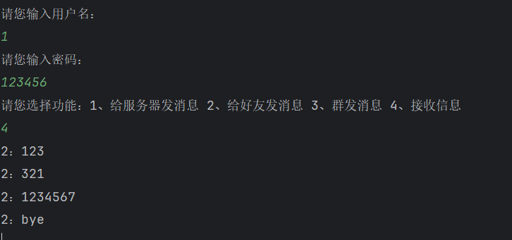

#### （3）群发消息

*ServerThread*

```java
private void sendToAll(Message message) {
    // 遍历所有在线的用户
    for (Map.Entry<String, Socket> entry : Constant.ONLINE_USERS.entrySet()) {
        try {
            MsgUtils.writeMsg(entry.getValue().getOutputStream(), message);
        } catch (IOException e) {
            throw new RuntimeException(e);
        }
    }
}
```

*Client*

```java
private static void sendToAll(String username, OutputStream outputStream, InputStream inputStream) {
    boolean flag = true;
    while (flag) {
        System.out.print(username + "：");
        String msg = ScannerUtil.input();
        if ("bye".equals(msg)) {
            flag = false;
        }
        MsgUtils.writeMsg(outputStream, new Message(MessageType.TO_ALL, msg, username));
    }
}
```

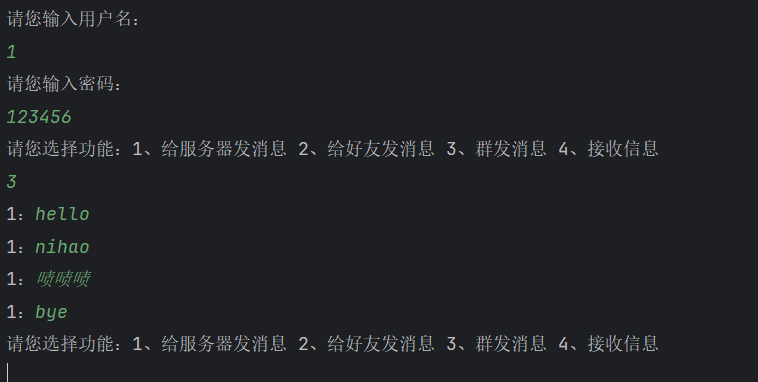

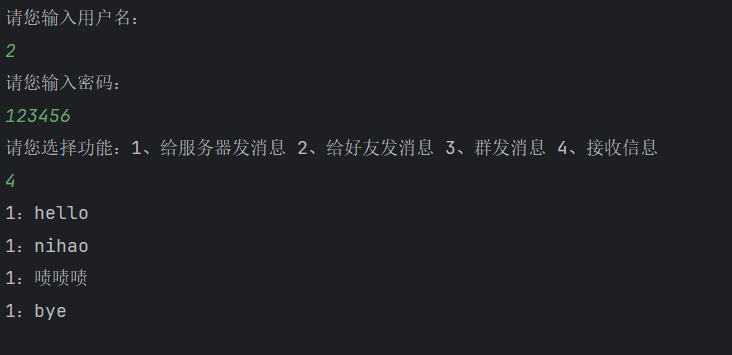

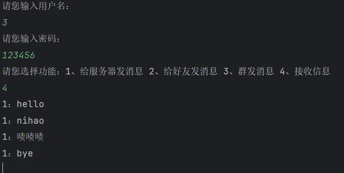

### 附完善代码：

项目结构：

> 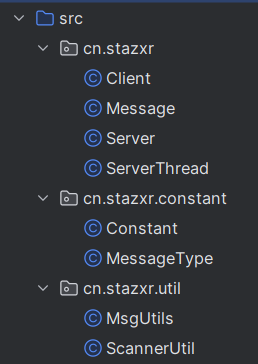

*Client*

::: details 点击查看代码

```java
package cn.stazxr;

import cn.stazxr.*;

import java.io.IOException;
import java.io.InputStream;
import java.io.OutputStream;
import java.net.*;
import java.util.*;

/**
 * 功能：1、给服务器发消息  2、给好友发消息  3、群发消息
 * 1、用什么类型发消息
 */
public class Client {

    public static void main(String[] args) throws IOException {
        Socket socket = new Socket();
        // 链接服务器
        socket.connect(new InetSocketAddress(8888));
        // 发消息
        OutputStream outputStream = socket.getOutputStream();
        // 收消息
        InputStream inputStream = socket.getInputStream();
        boolean flag = true;
        // 表示当前登录的用户
        String username = null;
        // 先登录
        while (flag) {
            // 先判断有没有登录
            if (username == null) {
                username = login(outputStream, inputStream);
            } else {
                // 打印菜单
                printOrder();
                String input = ScannerUtil.input();
                switch (Integer.parseInt(input)) {
                    case MessageType.TO_SERVER:
                        sendToServer(username, outputStream, inputStream);
                        break;
                    case MessageType.TO_FRIEND:
                        sendToFriend(username, outputStream, inputStream);
                        break;
                    case MessageType.TO_ALL:
                        sendToAll(username, outputStream);
                        break;
                    case MessageType.RECEIVER:
                        receiverMsg(inputStream);
                        break;
                    default:
                        lostConnection(username,outputStream);
                        flag = false;
                }
            }
        }
        MsgUtils.readMsg(inputStream).ifPresent(msg -> {
            System.out.println(msg.getContent());
        });
        inputStream.close();
        outputStream.close();
        socket.close();
    }

    private static void lostConnection(String username, OutputStream outputStream) {
        MsgUtils.writeMsg(outputStream, new Message(MessageType.LOST_CONNECTION,Constant.BYE,username));
    }

    private static void receiverMsg(InputStream inputStream) {
        AtomicBoolean flag = new AtomicBoolean(true);
        while (flag.get()) {
            Optional<Message> msg = MsgUtils.readMsg(inputStream);
            msg.ifPresent(m -> {
                System.out.println(m.getUsername() + "：" + m.getContent());
                if (Constant.BYE.equals(m.getContent())){
                    flag.set(false);
                }
            });
        }
    }

    private static void sendToAll(String username, OutputStream outputStream) {
        boolean flag = true;
        while (flag) {
            System.out.print(username + "：");
            String msg = ScannerUtil.input();
            if (Constant.BYE.equals(msg)) {
                flag = false;
            }
            MsgUtils.writeMsg(outputStream, new Message(MessageType.TO_ALL, msg, username));
        }
    }

    private static void sendToFriend(String username, OutputStream outputStream, InputStream inputStream) {
        System.out.print("请输入好友的名字：");
        String friend = ScannerUtil.input();
        boolean flag = true;
        while (flag) {
            System.out.print(username + "：");
            String msg = ScannerUtil.input();
            if (Constant.BYE.equals(msg)) {
                flag = false;
            }
            MsgUtils.writeMsg(outputStream, new Message(MessageType.TO_FRIEND, msg, username, friend));
        }
    }

    // 给服务器发消息
    private static void sendToServer(String username, OutputStream outputStream, InputStream inputStream) {
        System.out.print(username + "：");
        String msg = ScannerUtil.input();
        MsgUtils.writeMsg(outputStream, new Message(MessageType.TO_SERVER, msg, username));
        // 接收消息
        Optional<Message> massage = MsgUtils.readMsg(inputStream);
        massage.ifPresent(m -> System.out.println(m.getUsername() + "：" + m.getContent()));
    }

    private static void printOrder() {
        System.out.println("请您选择功能：" +
                MessageType.TO_SERVER + "、给服务器发消息 " +
                MessageType.TO_FRIEND + "、给好友发消息 " +
                MessageType.TO_ALL + "、群发消息 " +
                MessageType.RECEIVER + "、接收信息 其他、退出");
    }

    // 登录的方法
    private static String login(OutputStream outputStream, InputStream inputStream) {
        System.out.println("请您输入用户名：");
        String name = ScannerUtil.input();
        System.out.println("请您输入密码：");
        String pwd = ScannerUtil.input();
        Message message = new Message();
        message.setType(MessageType.LOGIN);
        message.setUsername(name);
        message.setPassword(pwd);
        // 发送给服务器
        MsgUtils.writeMsg(outputStream, message);
        // 接收来自服务端的消息
        Optional<Message> msg = MsgUtils.readMsg(inputStream);
        if (msg.isPresent() && Constant.SUCCESS.equals(msg.get().getContent())) {
            return name;
        }
        msg.ifPresent(m -> System.out.println(m.getContent()));
        return null;
    }

}
```

:::

*Message*

::: details 点击查看代码

```java
package cn.stazxr;

import java.io.Serial;
import java.io.Serializable;

public class Message implements Serializable {

    @Serial
    private static final long serialVersionUID = 8327856103560598769L;

    private Integer type;
    private String content;
    // 用来登录
    private String username;
    private String password;

    private String friendUesrName;

    public Message() {
    }

    /*// 登录的构造器
    public Message(String username, String password,Integer type) {
        this.type = type;
        this.username = username;
        this.password = password;
    }*/

    public Message(Integer type, String content, String username) {
        this.type = type;
        this.content = content;
        this.username = username;
    }

    public Message(Integer type, String content, String username, String friendUesrName) {
        this.type = type;
        this.content = content;
        this.username = username;
        this.friendUesrName = friendUesrName;
    }

    public Integer getType() {
        return type;
    }

    public void setType(Integer type) {
        this.type = type;
    }

    public String getContent() {
        return content;
    }

    public void setContent(String content) {
        this.content = content;
    }

    public String getUsername() {
        return username;
    }

    public void setUsername(String username) {
        this.username = username;
    }

    public String getPassword() {
        return password;
    }

    public void setPassword(String password) {
        this.password = password;
    }

    public String getFriendUesrName() {
        return friendUesrName;
    }

    public void setFriendUesrName(String friendUesrName) {
        this.friendUesrName = friendUesrName;
    }

    @Override
    public String toString() {
        return "Message{" +
                "type=" + type +
                ", content='" + content + '\'' +
                ", username='" + username + '\'' +
                ", password='" + password + '\'' +
                ", friendUesrName='" + friendUesrName + '\'' +
                '}';
    }
}
```

:::

*Server*

::: details 点击查看代码

```java
package cn.stazxr;

import java.io.IOException;
import java.net.InetSocketAddress;
import java.net.ServerSocket;
import java.net.Socket;

public class Server {

    public static void main(String[] args) {
        try (// 创建一个服务器
             ServerSocket serverSocket = new ServerSocket();) {
            // 绑定端口
            serverSocket.bind(new InetSocketAddress(8888));
            System.out.println("服务器已经启动，在8888端口！");
            // 开始监听
            // 建立一个连接
            while (true) {
                Socket socket = serverSocket.accept();
                new ServerThread(socket).start();
            }
        } catch (IOException e) {
            throw new RuntimeException(e);
        }
    }

}
```

:::

*ServerThread*

::: details 点击查看代码

```java
package cn.stazxr;

public class ServerThread extends Thread {

    private Socket socket;

    public ServerThread() {
    }

    public ServerThread(Socket socket) {
        this.socket = socket;
    }

    @Override
    public void run() {
        boolean flag = true;
        try (InputStream inputStream = socket.getInputStream();
             OutputStream outputStream = socket.getOutputStream()) {
            while (flag) {
                Optional<Message> message = MsgUtils.readMsg(inputStream);
                if (message.isPresent()) {
                    Message msg = message.get();
                    switch (msg.getType()) {
                        case MessageType.LOGIN:
                            loginHandler(inputStream, outputStream, msg, socket);
                            break;
                        case MessageType.TO_SERVER:
                            sendToClient(inputStream, outputStream, msg);
                            break;
                        case MessageType.TO_FRIEND:
                            sendToTarger(msg);
                            break;
                        case MessageType.TO_ALL:
                            sendToAll(msg);
                            break;
                        case MessageType.LOST_CONNECTION:
                            message.ifPresent(m -> {
                                System.out.println(m.getUsername() + "下线了");
                                try {
                                    MsgUtils.writeMsg(Constant.ONLINE_USERS.get(m.getUsername()).getOutputStream(), new Message(MessageType.FROM_SERVER, Constant.OFFLINE, m.getUsername()));
                                } catch (IOException e) {
                                    e.printStackTrace();
                                }
                                Constant.ONLINE_USERS.remove(m.getUsername());
                            });
                            flag = false;
                            break;
                    }
                }
            }
        } catch (IOException e) {
            throw new RuntimeException();
        }

    }

    private void sendToAll(Message message) {
        // 遍历所有在线的用户
        for (Map.Entry<String, Socket> entry : Constant.ONLINE_USERS.entrySet()) {
            if (entry.getKey().equals(message.getUsername())) continue;
            try {
                MsgUtils.writeMsg(entry.getValue().getOutputStream(), message);
            } catch (IOException e) {
                e.printStackTrace();
            }
        }
    }

    // 给目标用户发送消息
    private void sendToTarger(Message message) {
        // 先找到对应的socket
        Socket socket = Constant.ONLINE_USERS.get(message.getFriendUesrName());
        try {
            MsgUtils.writeMsg(socket.getOutputStream(), message);
        } catch (IOException e) {
            e.printStackTrace();
        }
    }

    private void sendToClient(InputStream inputStream, OutputStream outputStream, Message message) {
        // 接收消息并打印
        System.out.println(message.getUsername() + "：" + message.getContent());
        MsgUtils.writeMsg(outputStream, new Message(MessageType.TO_SERVER, Constant.OK, Constant.SERVER_NAME));
    }

    private void loginHandler(InputStream inputStream, OutputStream outputStream, Message message, Socket socket) {
        // 判断登录的逻辑
        if (Constant.ONLINE_USERS.containsKey(message.getUsername())) {
            MsgUtils.writeMsg(outputStream, new Message(MessageType.FROM_SERVER, "已经登录了", Constant.SERVER_NAME));
            return;
        }
        if (message.getUsername() == null || !Constant.DEFAULT_PASSWORD.equals(message.getPassword())) {
            MsgUtils.writeMsg(outputStream, new Message(MessageType.FROM_SERVER, Constant.FAIL, Constant.SERVER_NAME));
        } else {
            // 验证成功放入在线用户map中
            Constant.ONLINE_USERS.put(message.getUsername(), socket);
            System.out.println(message.getUsername() + "登录成功！");
            MsgUtils.writeMsg(outputStream, new Message(MessageType.FROM_SERVER, Constant.SUCCESS, Constant.SERVER_NAME));
        }
    }
}
```

:::

*Constant*

::: details 点击查看代码

```java
package cn.stazxr.constant;

import java.net.Socket;
import java.util.Map;
import java.util.concurrent.ConcurrentHashMap;

public class Constant {
    // 所有成功的常量
    public static final String SUCCESS = "success";
    // 所有失败的常量
    public static final String FAIL = "fail";

    public static final String DEFAULT_PASSWORD = "123456";

    public static final String SERVER_NAME = "server";
    public static final String OK = "OK!";
    public static final String BYE = "bye";

    // 存登录的用户
    public static final Map<String, Socket> ONLINE_USERS = new ConcurrentHashMap<>();
    public static final String OFFLINE = "已断开连接！";
}
```

:::

*MessageType*

::: details 点击查看代码

```java
package cn.stazxr.constant;

public class MessageType {
    public static final int LOGIN = 8;
    public static final int TO_SERVER = 1;
    public static final int TO_FRIEND = 2;
    public static final int TO_ALL = 3;
    public static final int RECEIVER = 4;
    public static final int FROM_SERVER = 5;
    public static final int LOST_CONNECTION = 6;
}
```

:::

*MsgUtils*

::: details 点击查看代码

```java
package cn.stazxr.util;

import cn.stazxr.Message;

import java.io.IOException;
import java.io.InputStream;
import java.io.ObjectInputStream;
import java.io.ObjectOutputStream;
import java.io.OutputStream;
import java.util.Optional;

public class MsgUtils {

    // 从流中读取msg
    public static Optional<Message> readMsg(InputStream inputStream) {
        ObjectInputStream ois;
        try {
            ois = new ObjectInputStream(inputStream);
            // 封装成一个optional，将来外界使用就可以避免空指针
            return Optional.ofNullable((Message) ois.readObject());
        } catch (IOException | ClassNotFoundException e) {
            e.printStackTrace();
        }
        return Optional.empty();
    }

    // 向输出流写消息
    public static void writeMsg(OutputStream outputStream,Message message) {
        ObjectOutputStream oos;
        try {
            oos = new ObjectOutputStream(outputStream);
            oos.writeObject(message);
            oos.flush();
        } catch (IOException e) {
            throw new RuntimeException(e);
        }
    }

}
```

:::

*ScannerUtil*

::: details 点击查看代码

```java
package cn.stazxr.util;

import java.util.Scanner;

public class ScannerUtil {

    private static final Scanner scanner = new Scanner(System.in);

    public static String input(){
       return scanner.next();
    }

}
```

:::
