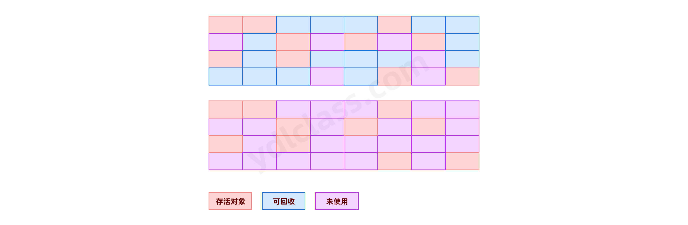

---
# 当前页面内容标题
title: 面向对象
# 当前页面图标
icon: class
# 分类
category:
    - javase
    - 面向对象
# 标签
tag:
    - javase
sticky: false
# 是否收藏在博客主题的文章列表中，当填入数字时，数字越大，排名越靠前。
star: false
# 是否将该文章添加至文章列表中
article: false
# 目录顺序
order: 4
# 是否将该文章添加至时间线中
timeline: false
---

## 一、面向对象概述

### 1、面向对象介绍

java 是一门面向对象的语言，在 java 里一切皆对象。

_《深入理解 Java 虚拟机》_

#### （1）面向过程和面向对象

- 面向过程——步骤化

    面向过程就是分析出实现需求所需要的步骤，通过函数（方法）一步一步实现这些步骤，接着依次调用即可。

- 面向对象——行为化（概念相对抽象，可结合下面的例子理解）

    面向对象是把整个需求按照特点、功能划分，将这些存在共性的部分**封装成类**（类实例化后才是对象），让对象去解决对应的问题。

#### （2）用例子思考

其实我们之前写的代码都是面向过程的，而事实上，我们的大脑处理问题本身就是更加偏向面向对象的。

举一个例子：

你想送你女朋友一个包，

- 面向对象的思想是，找个卖包包的店，买一个包包。其中不管是商店，还是包都是现实生活中存在的事物，代码里我们称之为对象。
- 面向过程的思想是：找到原材料，自己切割，自己缝制，每一个工序都自己干，这就是过程。

感觉面向对象忽略了过程一样。

其实，越是高级的语言会越向着人的思考靠近。

- 面向对象是更高级的抽象，是对现实世界的映射。
- 思考一下，我们接触过的 String、Scanner 就是很好的例子。你看着很简单的字符串，它本身就是个对象，不需要我们自己去完成一个字符一个字符的拼接，Scanner 更是牛逼，我们更加不知道它具体是怎么做到让我们从控制台输入的，事实上我们知道它能做什么就足够了。
- 这就是别人给我们创造的对象，事实上我们也能给自己创造对象，我们也能给别人创造对象。
- 就像现实中一样，你想吃水果，就去水果摊买，你想按脚，就去足疗店，你想玩，可以去迪斯尼。
- 当然你也可以开个 4s 店卖汽车。
- 没人会关心水果是怎么种的，从哪里来的，按脚的技师是怎么招聘的，迪斯尼是怎么建的，4s 店的车是怎么造的。我们关心的只是水果、技师、迪斯尼、汽车这些实实在在的对象而已。

### 2、学习自己造对象

我们准备开个 4s 店，我们需要车、需要门店对吧，那我们就尝试去搞一个。

- 先说说我们怎么去用代码描述一辆车：

    定义好多个变量 1、brand 2、color 3、length.........

- 问题又来了，我们怎么描述好几个车？

    [一号车的品牌，二号车的品牌，三号车的品牌...一百号汽车的品牌]

    [一号车的颜色，二号车的颜色，三号车的颜色...一百号汽车的颜色]

    .....

我们用了几十个数组去维护一百辆汽车的属性，这简直就是个灾难，数据简直没办法维护，每修改一辆车，必须修改每一个数组。

> 思考：我们能不能这样去搞呢？

搞一个数组，它就是汽车的数组。

[一号汽车的所有，二号汽车的所有，三号汽车的所有，...一百号汽车的所有]

这样我们一个数组就能维护所有的汽车。

同时，我们已经尝试去面向对象编程了，我们将一个汽车的多个属性尝试进行了打包，这个过程就是在`封装对象`。

## 二、面向对象之封装（encapsulation）

### 1、class 和对象

第一步：我们要造车了，必须有个造车的说明书。

第二步：根据说明书，造一百辆车。

其实说明书就是在描述车的具体信息，就是对信息的封装。

```java
public class Car {
    // 汽车的型号
    String brand;
    // 汽车的颜色
    String color;
    // 汽车的长度
    long length;
}
```

你看，这是不是用汽车的基本信息封装了一个汽车的说明，这叫做类，就是汽车类，一个描述汽车的类。

再看看，我们是怎么根据说明书去构建具体的汽车的，每个具体的汽车我们称之为一个【实例对象】。

```java
public static void main(String[] args) {
    Car car1 = new Car();
    car1.brand = "本田";
    car1.color = "red";
    car1.length = 4120;

    Car car2 = new Car();
    car2.brand = "宝马";
    car2.color = "white";
    car2.length = 5087;

    Car[] cars = {car1,car2};
}
```

所以明白了吗？

- Car 是`类`，只有一份。
- car1、car2...car100 是根据类构建出来的【实例对象】，可以有很多个。

### 2、多出来的数据类型

> 划重点了：

1、之前我们学习的八种基础数据类型，这些数据是直接存在栈中的。

2、从今天开始，我们的数据类型就多了，汽车是一种数据类型，大炮是一种数据类型，美女是一种数据类型，所有的类都是数据类型，我们统称为：【引用数据类型】。

此刻起，我们可能才真正的开始了解 class 这个关键字，他就是用来创建一个类。

像 car1、car2、cars 这些叫引用，它是指向内存中的一块区域。存放这些实例对象的空间，我们称之为堆。

不妨我们看看，这个【车队】在内存中的结构图：


小知识：

类型指针一般为 4 字节，在关闭压缩普通对象指针时（-XX:+UseCompressedOops）为 8 字节，UseCompressedOops 默认是开启的，只有虚拟机内存达到 32G 以上，4 个字节已经无法满足寻址需求时，才需要关闭该参数。

### 3、成员变量

```java
public class Car {
    // 汽车的型号
    String brand;
    // 汽车的颜色
    String color;
    // 汽车的长度
    double length;
}
```

成员变量我们已经学过了了，

像汽车型号、颜色、车长等属性，是 Car 这个类的成员，是每个实例对象都有的属性，我们称之为【成员变量】。

成员变量的赋值：

```java
car2.brand = "宝马";
```

成员变量在 new 之后就会有初识值，0，null，false

### 3、成员方法

思考一个问题：

一个汽车如果只有颜色、品牌这些属性，那它就是一块铁。我们买汽车，主要因为汽车能跑啊，可以开着到处跑啊。

很明显，跑是一个动作，他不能用红的，绿的，大的、小的去描述，而是需要一步步去做的。

#### （1）定义成员方法

看我怎么给车定义一个方法：

```java
public class Car {
    // 汽车的型号
    String brand;
    // 汽车的颜色
    String color;
    // 汽车的长度
    double length;

    public void run(){
        // 中间省略了打火、挂档等动作
        System.out.println(brand+"在飘移！");
    }
}
```

其中：

```java
public void run(){
    // 中间省略了打火、挂档等动作
    System.out.println(brand+"在飘移！");
}
```

一个成员方法，咱们不妨拆解一下：

- public：马上学，先不管
- void：没有返回值。
- run：方法的名字。
- （）：内部可以传入参数。

#### （2）参数

汽车要跑是不是要加油啊！加 92 号和 95 号油可能效果不一样。

可以这样改造： gasoline [ˈɡæsəliːn]

```java
// 定义方法，这里的gasoline是形参，形式上的参数
public void run(int gasoline){
    System.out.printf("您加了%d号汽油",gasoline);
    if(gasoline == 92){
        System.out.println("92号汽油跑的很快！");
    } else if(gasoline == 95){
        System.out.println("95号汽油跑的更猛！");
    } else {
        System.out.println("你加了柴油吧！");
    }
}
```

怎么调用啊？

```java
public static void main(String[] args) {
    Car car1 = new Car();
    car1.brand = "本田";
    car1.color = "red";
    car1.length = 4.12;
    // 方法调用，这里的95是实参
    car1.run(95);
}
```

参数可以有很多个。可以用逗号隔开。

```java
public void run(int arg1,String arg2,long arg3);
```

#### （3）返回值

void：代表没有返回值

返回值是一个方法执行完毕，想要告诉你的信息。

比如我们要发动汽车让他跑，但是它具体有没有跑起来可能是个问题，可能因为年久失修坏掉了。

```java
// 定义一个run方法，生成一个随机数，车有一定的概率坏掉了
public boolean run(){
    // 这句代码能生成一个0~1的double的数字
    double random = Math.random();
    if(random > 0.5){
        System.out.println("车子正常启动！");
        return true;
    } else {
        System.out.println("车子坏了！");
        return false;
    }
}

// 调用方法
car1.run();
```

方法执行完成之后，它会告诉我们一个布尔值，代表车子是不是坏了，我们可以【用一个变量去接收它】。

```java
boolean canRun = car1.run();
System.out.println(canRun);
```

#### （4）return 关键字

> 其中 return 有两层含义：

1. 终止当前方法继续执行。
2. 返回方法的返回值。

> 思考一个题目：

在 void 中，即没有返回值得方法中能 用 return 吗？

答案是可以的，这里 return 只能代表方法的终止。

思考下边的代码，结果是什么？

```java
// 没有return，最后的打印一定会执行
public void run(int gasoline){
    System.out.printf("您加了%d号汽油",gasoline);
    if(gasoline == 92){
        System.out.println("92号汽油跑的很快！");
    }
    if(gasoline == 95){
        System.out.println("95号汽油跑的更猛！");
    }

    System.out.println("你加了柴油吧！");
}

// 遇到return，最后的打印就不执行
public void run(int gasoline){
    System.out.printf("您加了%d号汽油",gasoline);
    if(gasoline == 92){
        System.out.println("92号汽油跑的很快！");
        return;
    }
    if(gasoline == 95){
        System.out.println("95号汽油跑的更猛！");
        return;
    }

    System.out.println("你加了柴油吧！");
}
```

#### （5）方法的递归

##### a、方法调用

方法时可以调用的，一个方法中也是可以调用另一个方法的。

我们完全可以把加油和发动分解成两个动作啊，理论上，这也是合理的，因为这确实是两个动作。

```java
// 发动的方法
public void run(){
    addGasoline();
    System.out.println("汽车启动啦！");
}
// 加油的方法
public void addGasoline(){
    System.out.println("加油啦！");
}
```

##### b、递归调用

问题来了，方法

方法自己能不能够调用自己的方法

```java
// 发动的方法
public void run(){
    run();
    System.out.println("汽车启动啦！");
}
```

这玩意直接报错了：

```java
Exception in thread "main" java.lang.StackOverflowError
    at com.ydlclass.Car.run(Car.java:16)
    at com.ydlclass.Car.run(Car.java:16)
    at com.ydlclass.Car.run(Car.java:16)
```

是栈内存溢出了：

什么原因呢？每个方法的创建都会创建一个【栈帧】压入栈中。


所以，在使用递归的时候一定要注意，用不好，会发生栈内存溢出的问题。

那怎么用好递归呢？

答案是：在合适的地方退出递归调用，接下来举两个例子。

##### c、斐波那切数列

斐波那契数列指的是这样一个数列 0, 1, 1, 2, 3, 5, 8, 13, 21, 34, 55, 89, 144, 233，377，610，987，1597，2584，4181，6765，10946，17711，28657，46368……

特别指出：第 0 项是 0，第 1 项是第一个 1。

这个数列从第三项开始，每一项都等于前两项之和。

求：在斐波那契数列中第 number 个数字是多少？

分析：我们知道 除了第 0 个和第 1 个，【第 number 个数字】一定等于 【第 number-1 个数字】和 【第 number-2 个数字】之和。

```java
public long fibonacci(long number) {
    return fibonacci(number - 1) + fibonacci(number - 2);
}
```

上边这个递归永远退不出去，应该判断 number 在 0 和 1 的时候，它并不需要递归，修改如下：

```java
public long fibonacci(long number) {
    if ((number == 0) || (number == 1))
        return number;
    else
        return fibonacci(number - 1) + fibonacci(number - 2);
}


Test test = new Test();
long result = test.fibonacci(5);
System.out.println(result);
结果：
   5
```

【注意】：递归，一定要有合理的退出机制。

##### d、阶乘（factorial）

5 的阶乘 = 5*4*3*2*1 = 120

非递归方式：

```java
public long factorial(long number) {
    long result = 1;
    for (int i = 1; i <= number ; i++) {
        result *= i;
    }
    return result;
}
```

递归方式：

核心思路：$5\text{的阶乘} = 4\text{的阶乘} \times 5 = 3\text{的阶乘} \times 4 \times 5 = 2\text{的阶乘} \times 3 \times 4 \times 5 = 1 \times 2 \times 3 \times 4 \times 5$；

```java
public long factorial(long number) {
    if (number <= 1)
        return 1;
    return number * factorial(number - 1);
}
```

#### （6）方法的重载

在 java 中允许同一个类中， 多个同名方法的存在， 但要求【形参列表】不一致！这个和【返回值】无关。

重载方法能让我们更好更方便的起名字。

```java
//两个整数的和
plus(int n1, int n2)
//一个整数， 一个 double 的和
plus(int n1, double n2)
//一个 double ,一个 Int 和
plus(double n2, int n1)
//三个 int 的和
plus(int n1, int n2,int n3)
```

构成重载的三个要素：

- 方法名必须一致。
- 参数不一致，有两层含义第一是参数的数量不一致，第二层含义是：参数的类型不一致，【参数的名字一样不一样都行】。
- 返回值无要求。

我们确实有这种需求，都是加法，但是需要的参数不同，我们有必要去为了它而创建一个新的方法名字吗？

plus1,plus2,plus3... 当然这样做也没有错，但是使用重载会让你的代码更加的优雅一点。

思考：

有这样一个方法：`public void fun(int a,int b);`下边哪些方法和它重载。

```java
- public void fun(int x,int y);              //不是
- public void fun(int x,int y,int z);        //是
- public void fun(int a,int b,int c);        //是
- public int fun(int a,int b);               //不是
- public int fun(int a,int b,int c);         //是
```

【作业】

写两个重载的方法`max()`

- 一个方法求两个数的最大值。
- 一个方法求三个数的最大值，思路：先求出第一个和第二的最大值，再拿最大值和第三个比较。

#### （7）可变参数

有的时候我们是否有这种需求，我们想求几个数之和。

我们想写成 `plus(1,2,3,4,....)` 这个样子。

java 中还真的有，这种参数可以随心所欲去传递的参数叫做【可变参数】。

【语法】：访问修饰符 返回类型 方法名(数据类型... 形参名) {}

举个例子：

```java
//1.int...表示接受的是可变参数，类型是int,即可以接收多个int(0-多)
//2.使用可变参数时，可以当做数组来使用即nums可以当做数组
//3.遍历nums求和即可
public int sum(int... nums){
    int result=0;
    // 可变参的本质其实是个数组
    for(inti=0;i<nums.length;i++){
        result += nums[i];
    }
    return result;
}
```

你一旦定义了可变参数，它居然可以这么随心所欲的调用：

```java
xxx.sum(1);
xxx.sum(1,2);
xxx.sum(1,32,3);
```

你完全没必要为每一种求和方法提供一个重载的方法。

> 本质：

就是将你传入的参数封装成了一个数组，他和可变参数是一样的，只是数组你需要自己去定义。

```java
public int sum(int[] nums){
    int result=0;
    // 可变参的本质其实是个数组
    for(inti=0;i<nums.length;i++){
        result += nums[i];
    }
    return result;
}
```

> 注意点：

一个方法的形参列表最多只能出现一个可变参数。

```java
public int sum(int... nums,int... nums2);  // 不可以
```

可变参数可以和普通参数放在一起，但是可变参数必须放在最后。

```java
public int sum(int first,int... nums2);   // 可以
public int sum(int... nums2,int last);    // 不可以
```

#### （8）局部变量和作用域

之前讲了，定义在类中的变量叫成员变量，那么定义在成员方法中的变量就局部变量。

- 成员变量会有默认值：基础数据都是零，char 中的零是代表空字符，boolean 是 false，引用数据类型都是 null；
- 局部变量没有默认值：必须初始化才能使用。

### 4、权限修饰符

#### （1）多个类相互调用

目前为止，我们并没有在第二个类中去调用另一个类的内容：

来跟我写：

创建一个 Test 类，在 Test 类中：

```java
public class Test {
    public static void main(String[] args) {
        Car car = new Car();
        car.run();
    }
}
```

我们发现了一个很神奇的现象，在另一个类中居然也可以 new 一个 Car。

我们之前的项目都是单打独斗，把所有的代码都写在了同一个类里边，将来我们的代码可能成千上万行，真的写在一个文件当中吗？

将来，我们的项目都是工程化的，合理利用每一个文件显得尤其重要。

#### （2）包

这个【包】不是你女朋友背的包包。

在我们工程化的项目当中，我们可能有成千上万个类？

我们不去讨论类，假如给你一千张照片，让你存在电脑中，你也不会傻呼呼的全部存在一个文件中吧！

> 最起码会给照片分一下类吧


分类有什么好处啊：

- 我们可以很快的检索一个图片，因为一个文件中的图片都有特定的特征。
- 我们给照片文件起名字时甚至可以重名，只要相同名字的文件存放在不同的目录即可。

```java
c:\照片\人物\1.jpg
c:\照片\风景\1.jpg
```

其实包也是一样，本质上就是一个文件夹，用来归纳整理我们的类

下面就是工程化的项目的包结构，这些文件夹下边装的就是咱们的类，只不过进行了压缩，成了 jar 文件：


**下边：**


来，咱们看看我们经常用的那几个类究竟在哪里？


其实：java 本身给我们提供了很多拿来即用的类，比如 String，

他所在的包叫 `java.lang` 这是一个很特殊的包。

除了 jdk 的包，我们可能还会用到其他公司程序员编写的类，那怎么保证我们用了多家公司写的类，还不重名呢？

类是程序员写的，我们没办法控制，所以只能在包上下功夫，尽量让每个公司的包都不一样。

有人就很聪明，使用 域名倒置 的方法给包命名，因为每个公司的域名都不一样。

为什么是域名倒置呢？举一个例子：

ydlclass.com

```java
zhidao.baidu.com
wenku.baidu.com
map.baidu.com

com.baidu.zhidao
com.baidu.wenku
com.baidu.map
```

本质上，每一个点代表一个文件夹。哪一种方式更适合咱们建立文件夹呢？

- 第一种方式：先建立三个文件夹，每个文件夹下 baidu 百度文件夹，里边简历 com 文件夹
- 第二种方式：建立 com 文件夹，里边建立 baidu 文件夹，里边建立三个文件夹

> 使用域名做包的好处

- 引入其他人写的类的时候保证不重名。
- 一眼就能看出是哪个公司的作品。

> 怎么导入一个包

引入单个类：`import com.ydlclass.Car`;

引入包下的所有类：`import com.ydlclass.*`;

> 什么情况不需要导入

- 但是你有没有发现，我们使用 String 的时候从来没有使用 `import`，因为这个包会默认导入
- 相同的包下不需要使用 `import` 显示的引入。

> 一个类的全类名

一个类的类名现在该怎么表示？

全类名：com.ydlclass.Car

#### （3）权限修饰符

- 我们除了可以按照自己的想法，封装世界的万事万物，封装还给我们提供了更加丰富的内容。
- 我们可以按照我们的需求，对封装在对象内的属性和方法提供不同的权限，刻意暴露或隐藏的具体的实现的细节。

这个就要依靠权限修饰符来完成了，其实我们已经见过很多次了：

| 作用域              | 当前类 | 同 package | 子孙类 | 其他 package |
| ------------------- | ------ | ---------- | ------ | ------------ |
| public              | √      | √          | √      | √            |
| protected           | √      | √          | √      | ×            |
| friendly( default ) | √      | √          | ×      | ×            |
| private             | √      | ×          | ×      | ×            |

权限修饰符修饰`方法和属性` 效果一样：

```java
public String name;
private int age;
protected String email;
String password;

protected void a(){
}
private void b(){
}
public void c(){
}
void d(){
}
```

class 只能被 public 修饰，但是内部类可以被以上几种修饰

```java
public class Dog {
    protected class A{
    }
    private class B{
    }
    public class C{
    }
    class D{
    }
}
```

内部类，我们会有专门时间讲。

局部变量不能使用权限修饰符

### 5、构造器

我们一直在学习怎么封装 class，一个 class 封装好之后的目的一般是创建实例对象，我们其实已经做过了。

```java
Dog dog = new Dog();
```

> new 一个对象的时候到底发生了什么事情呢？

1. java 在 new 一个对象的时候，会先查看对象所属的类有没有被加载到内存，如果没有的话，就会先通过类的权限定名来加载，这个过程我们后边聊。
2. 加载并初始化类完成后，再进行对象的创建工作。

> 我们先聊聊创建的过程：

1. 在堆区分配对象需要的内存。
2. 对所有实例变量赋默认值。
3. 执行构造方法，比如我们可以使用构造方法赋值。（不太准确，以后会慢慢补充）
4. 在栈区定义引用变量，然后将堆区对象的地址赋值给它。


构造方法，也叫构造器，会在 new 对象的时候主动被调用。

但是，事实上，我们并没有看到任何构造方法。

每个 java 类，会默认送你一个构造方法，这个方法它是这个样子的：

```java
public Dog(){
}
```

我们可以写出来，也可以不写，这个构造方法什么都没做，我们可以想办法让它做一些事情，比如：

```java
public Dog(){
    name = "teddy";
    age = 12;
}

public static void main(String[] args) {
    Dog dog = new Dog();
    System.out.println(dog.name);
    System.out.println(dog.age);
}

我们并没有调用这个方法啊：
但是，结果却出来了：
    teddy
    12
```

当然如果我们想自己按照自己的意愿去构造实例，我们还可以定义这样的构造器：

同时 new 的时候就要传递参数了：

```java
public Dog(String name,int age){
    System.out.println("验证构造方法被调用的时机：【"+ name + "】被创建！");
    this.name = name;
    this.age = age;
}

public static void main(String[] args) {
    Dog dog = new Dog("jinmao",23);
    System.out.println(dog.name);
    System.out.println(dog.age);
}

结果：
    验证构造方法被调用的时机：【jinmao】被创建！
    jinmao
    23
```

此时，如果我们把那个没有参数的构造器删除，

你会发现已经不能这么去 new 对象了。


【注】一旦自己写了构造器，系统将不再赠送，所以我们一般【会自己补充上】。

### 6、this 关键字

- 记住一点：每一个方法都会默认传入一个变量叫 this，它永远指向调用它的【当前实例】。


#### （1）this 访问属性和方法

> 写段代码：

```java
//构造方法和其他方法一样可以重载，可以有参数，名字必须和类名一样，不能有一点区别
public Dog(String name){
    System.out.println("验证构造方法被调用的时机：【"+ name + "】被创建！");
    this.name = name;
}

public void eat(){
    // this也可以在成员方法中使用
    System.out.printf("【%s】再吃骨头。",this.name);
}

public static void main(String[] args) {
    //直接new对象看看new的时候是不是调用了构造方法，事实证明是的
    new Dog("哈士奇").eat();
}

```

一个方法只有在调用的时候，才能明确方法中的【this】具体指向哪个实例对象。

我们可以使用 this 访问当前对象的方法和属性。

#### （2）this 访问构造器

还可以访问当前类的构造器：

```java
//构造方法和其他方法一样可以重载，可以有参数，名字必须和类名一样，不能有一点区别
public Dog(String name){
    System.out.println("验证构造方法被调用的时机：【"+ name + "】被创建！");
    this.name = name;
}

public Dog(){
    this("default");
}
```

如果我们使用无参构造会传入一个默认值，这就是典型的案例

```text
this当做构造器只能放在第一行
```

### 7、setter 和 getter

我们之前调用一个实例对象的属性的时候，都是 `dog.name` 但事实上，java 程序员从来不会这么干。

我们有这样的规定，所有的属性必须私有化，使用 setter 和 getter 赋值或者取值，

```java
public class Dog {

    //有哪些特点
    //定义狗有颜色这个属性
    private String color;
    //定义狗有种类这个属性
    private String type;
    //定义狗有年龄这个属性
    private int age;

    //java约定使用setter和getter方法进行属性的取值和赋值
    public String getColor() {
        return color;
    }

    public void setColor(String color) {
        this.color = color;
    }

    public String getType() {
        return type;
    }

    public void setType(String type) {
        this.type = type;
    }

    public int getAge() {
        return age;
    }

    public void setAge(int age) {
        this.age = age;
    }
    //..狗还有很多属性和方法，我们无法一一列举
}
```

为什么呢？

- getter 方法能够按照客户的期望返回格式化数据。
- setter 方法可以限制和检验 setter 方法传入的参数，隐藏对象内部数据结构。
- 属性不具备多态性。

举个例子：

```java
public class Girl {

    private int age;

    public int getAge() {
        // 你问我多大了，真实年龄大于18岁，都是18岁
        if(this.age > 18){
            return 18;
        }
        return age;
    }

    public void setAge(int age) {
        // 每过一年，如果我超过了18岁，我永远是18岁。
        if(age > 18){
            this.age = 18;
        }
        this.age = age;
    }
}
```

所以，正确的定义一个类，一定是

- 所有的属性私有化。
- 每个属性都有对应的 getter 和 setter 放。

这是规矩，你得遵守。

### 8、String 详解

**字符串是引用类型，但是为什么不用 new，因为太常用了，就简化了。**

如果你不觉得烦，也能写成：

```java
String name = new String("name");

String name = "name";   就行了
```

**既然是个对象就有属性和方法**：

它的方法无非就是帮助我们方便的处理这个字符串。

**注：使用 string 一定要注意，必须用一个新的 String 接受。**

```java
String substring = name.substring(1, 3);
```

#### （1）符串查找

String 类的 indexOf() 方法在字符串中查找子字符串出现的位置，如过存在返回字符串出现的位置（第一位为 0），如果不存在返回 -1。

```java
public class SearchStringEmp {
   public static void main(String[] args) {
      String strOrig = "xinzhi bigdata Java";
      int intIndex = strOrig.indexOf("Java");
      if(intIndex == - 1){
         System.out.println("没有找到字符串 Java");
      }else{
         System.out.println("Java 字符串位置 " + intIndex);
      }
   }
}
```

也可以用 contains() 方法

#### （2）字符串替换

java String 类的 replace 方法可以替换字符串中的字符。

```java
public class test {
    public static void main(String args[]){
            String str="Hello World,Hello Java.";
            System.out.println(str.replace('H','W')); //替换全部
            System.out.println(str.replaceFirst("He","Wa")); //替换第一个遇到的
            System.out.println(str.replaceAll("He", "Ha")); //替换全部
       }
}
```

#### （3）字符串分割

split(string) 方法通过指定分隔符将字符串分割为数组。

```java
public class test {
    public static void main(String args[]){
            String str="www-baidu-com";
            String delimeter = "-";  //指定分隔符
            String[] temp = str.split(delimeter);  //分割字符串
            //普通for循环
            for(int i =0; i < temp.length; i++){
                System.out.println(temp[i]);
                System.out.println("");
            }

            System.out.println("----java for each循环输出的方法-----");
            String str1 = "www.baidu.com";
            String delimeter1 = "\\.";   //指定分隔符，.号需要转义，不会明天讲
            String[] temp1 = str1.split(delimeter1);
            for (String x : temp1){
                System.out.println(x);
                System.out.println("");
            }
       }
}
```

#### 字符串截串)（4）字符串截串

substring(string) 方法可以截取从第几个下标（0 开始，包含第一个开始）到第几个下标（不包含）的字符串。

```java
public class test {
    public static void main(String args[]){
        String name = new String("name");
        String substring = name.substring(1, 3);
    }
}
```

#### （5）字符串小写转大写

String toUpperCase() 方法将字符串从小写转为大写。

```java
String str = "string runoob";
String strUpper = str.toUpperCase();
```

作业：

查找某个单词在文章中出现的次数：

```java
public static void main(String[] args) {
    String str = "Hello World abc Hello";
    // 截取字符串 第一个包含的 第二个不包含
    Test2 test2 = new Test2();
    int count = test2.wordCount(str, "HeLlo");
    System.out.println(count);

}

public int wordCount(String article, String word){
    //1、先把文章打散成数组
    String[] words = article.split(" ");
    int res = 0;
    for (int i = 0; i < words.length; i++) {
        if(words[i].equalsIgnoreCase(word)){
            res++;
        }
    }
    return  res;
}
```

### 9、包装类和自动拆装箱

有时候我们相对基础数据类型进行一些操作，但因为基础类型没有方法，不好操作。

其实 java 对每一种基础类型都进行了封装，生成对应的包装类

| 基本数据类型 | 包装类    |
| :----------- | :-------- |
| byte         | Byte      |
| boolean      | Boolean   |
| short        | Short     |
| char         | Character |
| int          | Integer   |
| long         | Long      |
| float        | Float     |
| double       | Double    |

Integer 是个对象，本来是要 new 的。

但是太常用了，所以简化了定义的方式，和基础类型一样。

```java
// 本来是要这么写的：
Integer i= new Integer(3);
// 事实上，我们这么写也行
Integer i= 3；
```

这很明显，左边是包装类，右边是基础数据类型，这种静默的转化我们称之为自动拆装箱。

- 自动装箱：将基础数据类型自动装换为包装类。
- 自动拆箱：将包装类自动转换为基础数据类型。

```java
// 自动装箱
Integer i = 10;
// 自动拆箱
int m = i;
```

```java
public static void main(String[] args) {
    Integer num2 = 127;
    Integer num1 = 127;

    System.out.println(num1 == num2);
}
true

public static void main(String[] args) {
    Integer num2 = 128;
    Integer num1 = 128;

    System.out.println(num1 == num2);
}
false

public static void main(String[] args) {
    Integer num2 = new Integer(127);
    Integer num1 = new Integer(127);

    System.out.println(num1 == num2);
}
false
```


在 Integer 的源码中，有个缓存，缓存了 -128~127 的 Integer 对象。


我想问问： num1 == num2 到底比的是什么？

### 10、封装一个超级数据

问自己一个问题，数组好用吗？数组好用吗？

使用数组进行`增删查改`，简直太麻烦了，我们既然学习了封装，那为什么不去封装一个好用的数组呢？

暂且称之为：超级数组，SuperArray

```java
package com.ydlclass;

public class SuperArray {

    //维护一个数组,要想什么都存，就要使用顶级父类
    private Integer[] array;

    // 数组的长度
    private int size;

    // 数组当前的容量
    private int capacity;

    //构造是初始化
    public SuperArray(){
        this(10);
        capacity = 10;
    }

    //构造是初始化
    public SuperArray(int capacity){
        array = new Integer[capacity];
        this.capacity = capacity;
    }

    //添加数据的方法,默认是尾插
    public boolean add(Integer data){
        // 确保容量足够,如果容量不够就扩容
        ensureCapacity(size + 1);
        array[size++] = data;
        return true;
    }

    //添加数据的方法，指定下标添加
    public void add(int index,Integer data){

        ensureCapacity(size + 1);

        /**
         * Object src : 原数组
         * int srcPos : 从元数据的起始位置开始
         * Object dest : 目标数组
         * int destPos : 目标数组的开始起始位置
         * int length  : 要copy的数组的长度
         */
        // index以后的数据统一向后移动，空出位置
        System.arraycopy(array, index, array, index + 1,
                size - index);

        array[index] = data;
    }

    public Integer remove() {
        if(size > 0){
            return array[--size];
        }
        return null;
    }

    public Integer remove(int index) {
        boolean flag = rangeCheck(index);
        if(flag){
            Integer res = array[index];
            /**
             * Object src : 原数组
             * int srcPos : 从元数据的起始位置开始
             * Object dest : 目标数组
             * int destPos : 目标数组的开始起始位置
             * int length  : 要copy的数组的长度
             */
            System.arraycopy(array, index+1, array, index, size-index);
            size--;
            return res;
        }
        return null;
    }

    public boolean set(int index,Integer data) {
        boolean flag = rangeCheck(index);
        if(flag){
            array[index] = data;
            return true;
        }
        return false;
    }


    //根据下标查询数字
    public Integer get(int index){
        boolean flag = rangeCheck(index);
        if(flag){
            return array[index];
        }
        return null;
    }

    //查看当前有多少个数字
    public int size(){
        return this.size;
    }

    // 确保容量，并在需要的时候扩容
    private void ensureCapacity(int needCapacity) {
        System.out.println(needCapacity + "---" + capacity);
        if (needCapacity > capacity){
            // 算一算，这个大概扩容了多少倍
            capacity = capacity + (capacity >> 1);
            Integer[] newArray = new Integer[capacity];
            /**
             * Object src : 原数组
             * int srcPos : 从元数据的起始位置开始
             * Object dest : 目标数组
             * int destPos : 目标数组的开始起始位置
             * int length  : 要copy的数组的长度
             */
            System.arraycopy(array, 0, newArray, 0, array.length);
            array = newArray;
        }
    }

    //验证下标是否合法
    private boolean rangeCheck(int index) {
        //只要有一个不满足就返回false
        return index <= size-1 && index >= 0;
    }

    public static void main(String[] args) {
        SuperArray superArray = new SuperArray();
        superArray.add(1);
        superArray.add(2);
        superArray.add(3);
        superArray.add(4);
        superArray.add(5);
        superArray.add(5);
        superArray.remove(3);
        superArray.remove();
        superArray.set(2,45);
        for (int i = 0; i < superArray.size(); i++) {
            System.out.println(superArray.get(i));
        }
    }
}
```

**思考：**

为什么有的方法是私有的，有的方法是公有的，size 属性不去私有化会不会出问题。

### 11、封装一个超级链表

- 又是一个新的名词：链表
- 在内存空间中，数组和链表都是基本的数据结构，都是【表】，或者叫【线性表】。
- 线性表是一个线性结构，它是一个含有 n≥0 个结点的有限序列，对于其中的结点，有且仅有一个开始结点没有前驱但有一个后继结点，有且仅有一个终端结点没有后继但有一个前驱结点，其它的结点都有且仅有一个前驱和一个后继结点，说人话，就是有头有尾一条线。


还不明白就在来一张图：


代码：

1、写链表首先要封装一个保存数据和引用的节点，我们俗称 node

```java
public class Node {
    private Integer data;
    private Node next;

    public Integer getData() {
        return data;
    }

    public void setData(Integer data) {
        this.data = data;
    }

    public Node getNext() {
        return next;
    }

    public void setNext(Node next) {
        this.next = next;
    }
}
```

```java
package com.ydlclass;

public class SuperLinked {

    // 链表的长度
    private int size;
    // 维护一个头节点
    private Node first;
    // 维护一个尾节点
    private Node last;

    // 无参构造器
    public SuperLinked(){

    }

    //添加元素至链表尾部
    public boolean add(Integer data){
        Node node = new Node(data,null);
        if (first == null){
            first = node;
        } else {
            last.setNext(node);
        }
        last = node;
        size++;
        return true;
    }

    //在指定下标添加元素
    public boolean add(int index,Integer data){
        Node node = getNode(index);
        Node newNode = new Node(data,null);

        if (node != null){
            newNode.setNext(node.getNext());
            node.setNext(newNode);
        } else {
            first = newNode;
            last = newNode;
        }

        size++;
        return true;
    }

    // 删除头元素
    public boolean remove(){
        if (size < 0){
            return false;
        }

        if (first != null ){
            first = first.getNext();
            size--;
        }
        return true;
    }

    // 删除指定元素
    public boolean remove(int index){
        if (size < 0){
            return false;
        }
        if(size == 1){
            first = null;
            last = null;
        } else {
            Node node = getNode(index-1);
            node.setNext(node.getNext().getNext());
        }
        size--;
        return true;
    }

    // 修改指定下标的元素
    public boolean set(int index,Integer data){
        // 找到第index个
        Node node = getNode(index);
        node.setData(data);
        return true;
    }

    // 获取指定下标的元素
    public Integer get(int index){
        return getNode(index).getData();
    }

    //查看当前有多少个数字
    public int size(){
        return size;
    }

    //添加元素
    private Node getNode(int index){

        // 边界判断
        if(index <= 0){
            index = 0;
        }
        if(index >= size-1){
            index = size-1;
        }

        // 找到第index个
        Node cursor = first;
        for (int i = 0; i < index; i++) {
            cursor = cursor.getNext();
        }
        return cursor;
    }

    public static void main(String[] args) {
        SuperLinked linked = new SuperLinked();
        linked.add(1);
        linked.add(2);
        linked.add(4);
        linked.add(6);
        linked.add(3);
        linked.add(2);
        linked.add(7);
        linked.add(6);
        linked.remove();
        linked.remove(2);
        linked.set(0,3);
        for (int i = 0; i < linked.size(); i++) {
            System.out.println(linked.get(i));
        }
    }
}
```

### 12、封装一个栈和队列

栈（Stack）和队列（Queue）是两种操作受限的线性表。

这种受限表现在：栈的插入和删除操作只允许在表的尾端进行（在栈中成为“栈顶”），满足“FILO：First In Last Out”；队列只允许在表尾插入数据元素，在表头删除数据元素,满足“First In First Out”。

栈与队列的相同点：

1. 都是线性结构。
2. 插入操作都是限定在表尾进行。
3. 都可以通过顺序结构和链式结构实现。、

栈与队列的不同点：

1. 队列先进先出，栈先进后出。

> 队列

```java
package com.ydlclass;


public class Queue {

    private SuperLinked superLinked = new SuperLinked();

    // 出队的方法
    public Integer poll(){
        if(empty()){
            return null;
        }
        Integer integer = superLinked.get(0);
        superLinked.remove();
        return integer;
    }

    // 返回队首，不出队
    public Integer peek(){
        if(empty()){
            return null;
        }
        return superLinked.get(0);
    }

    // 入队的方法
    public void add(Integer item){
        superLinked.add(item);
    }

    // 判断这个队列是否为空
    public boolean empty(){
        return superLinked.size() == 0;
    }

    public static void main(String[] args) {
        Queue queue = new Queue();
        queue.add(1);
        queue.add(2);
        queue.add(3);

        System.out.println(queue.poll());
        System.out.println(queue.poll());
        System.out.println(queue.poll());
        System.out.println(queue.poll());
        System.out.println(queue.poll());
    }

}
```

> 栈

```java
package com.ydlclass;

public class Stack {

    private SuperLinked superLinked = new SuperLinked();

    // 弹出栈顶，并且返回
    public Integer pop(){
        if(empty()){
            return null;
        }
        Integer integer = superLinked.get(superLinked.size() - 1);
        superLinked.remove(superLinked.size() - 1);
        return integer;
    }

    // 返回栈顶元素，不弹栈
    public Integer peek(){
        if(empty()){
            return null;
        }
        return superLinked.get(superLinked.size() - 1);
    }

    // 压栈方法
    public void push(Integer item){
        superLinked.add(item);
    }

    // 判断这个队列是否为空
    public boolean empty(){
        return superLinked.size() == 0;
    }

    public static void main(String[] args) {
        Stack queue = new Stack();
        queue.push(1);
        queue.push(2);
        queue.push(3);

        System.out.println(queue.pop());
        System.out.println(queue.pop());
        System.out.println(queue.pop());
        System.out.println(queue.pop());
        System.out.println(queue.pop());
    }

}
```

### 13、银行取票机

```java
package com.ydlclass;

import java.util.Scanner;

/**
 * @author itnanls
 * @date 2021/7/22
 **/
public class BankTicketMachine {

    private Queue queue = new Queue();

    private int startNumber = 100;

    private Scanner scanner = new Scanner(System.in);

    public void pushTicket(int ticketNumber){
        for (int i = 0; i < ticketNumber; i++) {
            startNumber += i;
            queue.add(startNumber);
        }
    }

    public Integer getTicket(){
        if(queue.empty()){
            System.out.println("号码已经被全部领取，需要继续释放号码！");
            System.out.println("请输入释放号码的个数：");
            Integer number = scanner.nextInt();
            pushTicket(number);

        }
        return queue.poll();
    }

    public void run(){
        while (true){
            System.out.println("请输入您的名字：");
            String name = scanner.next();
            Integer ticket = getTicket();
            System.out.println("尊敬的【"+name + "】，您的号码是：" + ticket + "。");
        }
    }

    public static void main(String[] args) {
        BankTicketMachine machine = new BankTicketMachine();
        machine.run();
    }

}
```


## 三、面向对象之继承（Inheritance）

提出需求来思考：

我想创建一个学生类，男学生类，女学生类，会有这么几个问题：

1、不管是男同学还是女学生，都是学生，学生公有的方法和属性本来就有很多。

2、虽然都是学生，但是男女毕竟有别，还是有一些不一样的地方。

在以往的认知当中，我们不得不创建学生类，男学生类，女学生类，然后书写每一个重复的属性和方法。

但是 java 给我们提供了更好的解决方案叫继承。

### 1、基本介绍

继承可以解决代码复用的问题，一个类可以继承一个类，被继承的类我们称之为【父类】或者【超类】，另一个类称之为【子类】也叫【派生类】，子类可以通过 extends 关键字轻松拥有获取**父类的成员变量和成员方法**的能力，除了被 private 修饰的。在 java 中是单继承的，这样可以规范代码的实现。

继承其实很好理解的，我们天生就会继承来自父母的很多基因，那爸爸的很多能力或者特征你天生就会拥有。


写一个小代码，我们尝试理解一下：

```java
// 定义一个父亲类，有名字属性和一个吃的方法
public class Father {
    private String name;

    public void eat(){
        System.out.println("I am eating!");
    }

    public String getName() {
        return name;
    }

    public void setName(String name) {
        this.name = name;
    }
}

// 子类使用extends关键字
public class SonONe extends Father {
}

// 子类使用extends关键字
public class SonTwo extends Father {
}
```

现在无论是哪个子类都能调用父类的方法：

```java
public static void main(String[] args) {
    SonONe  sonONe = new SonONe();
    sonONe.eat();
}
```

当然，儿子作为一个单独的个体，它依然可以拥有属于自己的属性和方法。

```java
public class SonONe extends Father {
    public void play(){
        System.out.println("I am playing!");
    }
}
```

经过这样的设计，我们的代码实现起来可以十分的灵活。

比如：我们现在设计一款游戏，英雄者小游戏（王者荣耀），我们是不是就可以这样设计类了。


代码我们学完了面向对象后尝试写：

```java
public class Father {
    public String name = "lily";

    public Father() {
        System.out.println("Father is created!");
    }

    public void eat(){
        System.out.println("father is eating!");
    }
}
```

```java
public class Son extends Father{

    public Son() {
        System.out.println("Son is created!");
    }

    public void work(){
        System.out.println("son is working!");;
    }

}
```

```java
public class GrandSon extends Son{

    public GrandSon() {
        System.out.println("GrandSon is created!");
    }

    public void play(){
        System.out.println("grandson is playing!");
    }

}
```

```java
public static void main(String[] args) {
        new GrandSon();
    }


Father is created!
Son is created!
GrandSon is created!
```

### 2、super 关键字

super 代表指向父类实例的引用

> 这里问题就来了，我们 new 了子类，又没有 new 父类，怎么就有了父类的实例了呢？

在之前的课程中，我们介绍了，在方法中我们可以使用 this 关键字指向调用该方法的实例对象，同样方法中还用一个 super 关键字他指向父类的实例对象。

那问题来了，我只是 new 了一个子类，哪里来的父类对象呢？

由此，我们推算出，构造一个子类一定会先构造一个父类，不服咱们上例子：

我们都知道，一个类被构造之后，会主动的调用它的构造方法，我们可以来试试：

```java
public class Father {
    public Father(){
        System.out.println("父类被构造了！");
    }
}

public class SonONe extends Father {
    public SonONe(){
        System.out.println("子类被构造了！");
    }

    public static void main(String[] args) {
        SonONe sonONe = new SonONe();
    }
}


结果：
父类被构造了！
子类被构造了！
```

结论很明显，父类确实被构造了。

它的作用有以下几个：

- 在子类的成员方法中，访问父类的成员变量。
- 在子类的成员方法中，访问父类的成员方法。
- 在子类的构造方法中，访问父类的构造方法。

#### （1）使用 super 调用父类的方法和属性

在子类中调用父类的非私有属性和方法时，大致的过程如下：

1. 先在当前类中寻找。
2. 当前类没有，继续向父类中寻找。
3. 如果还是没有，就向父类的父类继续寻找。
4. 直到到达一个所有类的共同父类，他叫 Object。

那么问题来了，我想使用父类的属性，直接用就行了，super 有啥用啊，那如果子类也定义了相同名字的属性呢？

例子：

```java
public class Father {
    public String name = "father";
}

public class SonONe extends Father {

    public String name = "son";

    public void printFatherName(){
        System.out.println(super.name);
    }

    public void printMyName(){
        System.out.println(this.name);
    }

    public static void main(String[] args) {
        SonONe sonONe = new SonONe();
        sonONe.printFatherName();
        sonONe.printMyName();
    }

}

结果：
father
son
```

试想一下，如果没有 super，我们是不是真的没有办法访问父类的名字了。

#### （2）在子类的构造方法中，访问父类的构造方法

```java
// 定义一个父类
public class Father {
    private String name;

    public Father(){
    }

    public Father(String name){
        this.name = "father-"+name;
    }

    public String getName() {
        return name;
    }
}

// 定义一个子类
public class SonONe extends Father {

    public String name = "son";

    public SonONe() {
    }

    public SonONe(String name) {
    }

    public static void main(String[] args) {
        SonONe sonONe = new SonONe();
        System.out.println(sonONe.getName());
    }

}

结果：
    null
```

很明显：子类在构造的时候只会默认调用父类的【空参构造】

这里如果我们有一个需求：

子类要通过父类的有参构造，又该怎么办呢？

```java
public class SonONe extends Father {

    public String name = "son";

    public SonONe() {
        super("default");
    }

    public SonONe(String name) {
        super(name);
    }

    public static void main(String[] args) {
        SonONe sonONe = new SonONe();
        System.out.println(sonONe.getName());
    }
}

结果：
father-default
```

我们成功的调用了父类的构造器。

构造先行：

我们发现，当我们把任何代码放在 super 之前，编译都会出错：


其实很好理解，父类还没有构造，你的代码凭什么执行？

所以：【super 构造器只能放在第一行】

而 this 关键字也只能放第一行，不好意思这两个只能选一个。

【总结一下】

1. 子类继承了父类所有的非私有的属性和方法，可以直接调用。
2. 子类在构造的时候，一定会构造一个父类，默认调用父类的无参构造器。
3. 子类如果希望指定去调用父类的某个构造器， 则显式的调用一下 : super(参数列表)
4. super 和 this 当做构造器使用时， 必须放在构造器第一行，所以只能二选一。
5. java 所有类都是 Object 类的子类, Object 是所有类的基类.
6. 子类最多只能继承一个父类(指直接继承)， java 中是单继承机制，我们可以使用连续继承来实现。

|            | this                                           | super                                          |
| ---------- | ---------------------------------------------- | ---------------------------------------------- |
| 访问属性   | 访问本实例的属性，没有会继续向父类检索         | 访问父类实例的属性，没有会继续向父类检索       |
| 调用方法   | 访问本实例的方法，没有会继续向父类检索         | 访问父类实例的方法，没有会继续向父类检索       |
| 调用构造器 | 调用本类的构造器，必须放在第一行，不会向上检索 | 调用父类的构造器，必须放在第一行，不会向上检索 |

### 3、方法重写

子类可以继承父类的方法，但是我们不总是希望我们的方法和父类一模一样，总会有些变化，龙生九子，每个人都有每个人的特征。

那我们就要对我们继承下来的方法进行改造了，怎么改造？重写一下就可以了。

```java
public class Father {
    public void eat(){
        System.out.println("我爱吃鱼！");
    }
}


public class SonONe extends Father {

    public void eat(){
        System.out.println("我爱吃虾！");
    }

    public static void main(String[] args) {
        SonONe sonONe = new SonONe();
        sonONe.eat();
    }
}

结果：
    我爱吃虾！
```

重写一定要保证参数、名字全部一样。咱们还学过一个重载还记得吗？

返回值要一样，或者返回父类的子类型。不好理解，学了多态，回头看。

| 名称             | 范围   | 方法名   | 形参列表                           | 返回类型                                   | 权限修饰                   |
| ---------------- | ------ | -------- | ---------------------------------- | ------------------------------------------ | -------------------------- |
| 重载（overload） | 本类   | 必须一样 | 类型，个数或者顺序不同，名字无所谓 | 没有要求                                   | 无要求                     |
| 重写（override） | 父子类 | 必须一样 | 必须相同                           | 一样，或者子类的返回值是父类的返回值的子类 | 子类不能缩小父类的访问权限 |

重写中子类要求更小的返回值范围和更大的权限范围，这两个问题需要结合多态来聊，咱们暂且放下，等学完多态了回头思考。

### 4、final 关键字

目前为止，我们的继承学的差不多了。回想我们之前遗留的一些知识

1、权限修饰符的这两条应该不用解释了吧！


2、String 这个对象被 final 修饰，final 究竟有什么作用。

```java
public final class String
    implements java.io.Serializable, Comparable<String>,CharSequence
```

```java
private final char value[];


JDK9以后
@Stable
private final byte[] value;
使用byte数组可以减少一半的内存，byte使用一个字节来存储一个char字符，char使用两个字节来存储一个char字符。只有当一个char字符大小超过0xFF时，才会将byte数组变为原来的两倍，用两个字节存储一个char字符。
```

final 作为一个关键字，他可以修饰变量，方法，以及类，final 就是最终的意思：

1、被 final 修饰的变量不能被修改，这里有两层含义，如果 final 修饰的是基础数据类型是只不能被修改，如果是引用数据类型就是引用指向不能被修改。


2、被 final 修饰的方法不能被重写


3、被 final 修饰的类不能被继承


### 5、祖先类 Object

Object 类有 11 个方法，其中有八个是公共方法：

| 方法                               | 描述                                                                                                |
| ---------------------------------- | --------------------------------------------------------------------------------------------------- |
| boolean equals(Object obj)         | 指示某个其他对象是否与此对象“相等”                                                                  |
| public native int hashCode();      | 返回该对象的哈希码值                                                                                |
| String toString()                  | 返回该对象的字符串表示                                                                              |
| Class<? extendsObject> getClass()  | 返回一个对象的运行时类                                                                              |
| void notify()                      | 唤醒在此对象监视器上等待的单个线程                                                                  |
| void notifyAll()                   | 唤醒在此对象监视器上等待的所有线程                                                                  |
| void wait()                        | 导致当前的线程等待，直到其他线程调用此对象的 notify() 方法或 notifyAll() 方法                       |
| void wait(long timeout)            | 导致当前的线程等待，直到其他线程调用此对象的 notify() 方法或 notifyAll() 方法，或者超过指定的时间量 |
| void wait(long timeout, int nanos) | 导致当前的线程等待，直到其他线程调用此对象的 notify()                                               |
| protected native Object clone()    | 克隆对象，浅拷贝                                                                                    |
| protected void finalize()          | 垃圾回收器准备释放内存的时候，会先调用 finalize()。                                                 |

其中 notify 和 wait 相关的代码都是和线程相关的，我们会在讲线程的时候一一讲解。

#### （1）hashcode

这个方法是这么定义的，所有带有 native 的方法都是本地方法，他不是 java 写的。这个 hashcode 的返回值其实是实例对象运行时的内存地址。

```java
public native int hashCode();
```

什么是 hash 算法：

一般翻译做“散列”，也有直接音译为“哈希”的，就是把任意长度的输入（又叫做预映射， pre-image），通过散列算法，变换成固定长度的输出，该输出就是散列值。

hash 算法有几个特点：

1、只能通过原文计算出 hash 值，而且每次计算都一样，不能通过 hash 值计算原文。

2、原文的微小变化就能是 hash 值发生巨大变化。

3、一个好的 hash 算法还能尽量避免发生 hash 值重复的情况，也叫 hash 碰撞。

hash 的用途：

1、密码的保存：

实际的工程当中我们一般不存储明文密码，而是将密码使用 hash 算法计算成 hash 值进行保存。这样即使密码丢失也不会使密码完全曝光。


2、文件的校验，检查数据的一致性


##### a、常见的 Hash 摘要算法

请记住我们不是研究这些算法的人，而是使用这些算法的人。研究这些算法的事情交给科学家，我们使用其实是很简单的

> MD5

介绍：MD5 信息摘要算法（英语：MD5 Message-Digest Algorithm），一种被广泛使用的密码散列函数，可以产生出一个 128 位（16 字节）的散列值（hash value），用于确保信息传输完整一致。MD5 由美国密码学家【罗纳德·李维斯特】设计，于 1992 年公开，用以取代 MD4 算法。1996 年后该算法被证实存在弱点，可以被加以破解，对于需要高度安全性的数据，专家一般建议改用其他算法，如 SHA-2。

```java
public static void main(String[] args) throws Exception {
    MessageDigest md5 = MessageDigest.getInstance("MD5");
    byte[] digest = md5.digest("123".getBytes());
    System.out.println(Arrays.toString(digest));
}
[32, 44, -71, 98, -84, 89, 7, 91, -106, 75, 7, 21, 45, 35, 75, 112]
```

> SHA1

**SHA-1**（英语：Secure Hash Algorithm 1，中文名：安全散列算法 1）是一种密码散列函数，美国国家安全局设计，并由美国国家标准技术研究所（NIST）发布为联邦数据处理标准（FIPS）。SHA-1 可以生成一个被称为消息摘要的 160 位（20 字节）散列值，散列值通常的呈现形式为 40 个十六进制数。

> SHA 家族

正式名称为 SHA 的家族第一个成员发布于 1993 年。然而人们给它取了一个非正式的名称 SHA-0 以避免与它的后继者混淆。两年之后， SHA-1，第一个 SHA 的后继者发布了。 另外还有四种变体，曾经发布以提升输出的范围和变更一些细微设计: SHA-224, SHA-256, SHA-384 和 SHA-512 (这些有时候也被称做 SHA-2)：

```java
public static void main(String[] args) Exception {
        MessageDigest sha1 = MessageDigest.getInstance("SHA1");
        byte[] digest = sha1.digest("123".getBytes());
        System.out.println(Arrays.toString(digest));
}

[64, -67, 0, 21, 99, 8, 95, -61, 81, 101, 50, -98, -95, -1, 92, 94, -53, -37, -66, -17]
```

> SHA256

SHA256 算法使用的哈希值长度是 256 位。

```java
public static void main(String[] args) throws Exception {
    MessageDigest sha256 = MessageDigest.getInstance("SHA-256");
    byte[] digest = sha256.digest("123".getBytes());
    System.out.println(Arrays.toString(digest));
}

[-90, 101, -92, 89, 32, 66, 47, -99, 65, 126, 72, 103, -17, -36, 79, -72, -96, 74, 31, 63, -1, 31, -96, 126, -103, -114, -122, -9, -9, -94, 122, -29]
```

> SHA512

算法使用的哈希值长度是 512 位。

```java
public static void main(String[] args) throws Exception {
    MessageDigest sha512 = MessageDigest.getInstance("SHA-512");
    byte[] digest = sha512.digest("123".getBytes());
    System.out.println(digest.length);
}

[60, -103, 9, -81, -20, 37, 53, 77, 85, 29, -82, 33, 89, 11, -78, 110, 56, -43, 63, 33, 115, -72, -45, -36, 62, -18, 76, 4, 126, 122, -79, -63, -21, -117, -123, 16, 62, 59, -25, -70, 97, 59, 49, -69, 92, -100, 54, 33, 77, -55, -15, 74, 66, -3, 122, 47, -37, -124, -123, 107, -54, 92, 68, -62]
```

#### （2）equals

其实这个方法我们已经讲过了，我们当时比较两个字符串的时候就使用了这个方法，但是我们不妨看看在 Object 中 equals 的实现是什么样子。

```java
public boolean equals(Object obj) {
    return (this == obj);
}
```

从源码中我们看到默认的时间就是`==`

小提示：以后我们比较所有的引用数据类型的时候，都要使用 equals。

还记得我们当时的例子吗？

```java
public static void main(String[] args) {
    Integer num2 = 128;
    Integer num1 = 128;

    System.out.println(num1 == num2);
}
false
```

你在问你，比较两个 Integer 用==还是 equals：

【**重要总结**】：==和 equals 的区别

1、==可以比基础数据类型也可以比较引用数据类型，比较基础数据类型时比较的是具体的值，比较引用数据类型实际上比较的是内存地址。

2、equals 是 Object 的一个方法，默认的实现就是 ==。

3、我们可以重写 equals 方法，是我们的特性需求，比如 String 就重写了 equals 方法，所以字符串调用 equals 比较的是每一个字符。

```java
public boolean equals(Object anObject) {
    if (this == anObject) {
        return true;
    }
    if (anObject instanceof String) {
        String anotherString = (String)anObject;
        int n = value.length;
        if (n == anotherString.value.length) {
            char v1[] = value;
            char v2[] = anotherString.value;
            int i = 0;
            while (n-- != 0) {
                if (v1[i] != v2[i])
                    return false;
                i++;
            }
            return true;
        }
    }
    return false;
}
```

jdk11

```java
public boolean equals(Object anObject) {
        if (this == anObject) {
            return true;
        }
        if (anObject instanceof String) {
            String aString = (String)anObject;
            if (coder() == aString.coder()) {
                return isLatin1() ? StringLatin1.equals(value, aString.value)
                                  : StringUTF16.equals(value, aString.value);
            }
        }
        return false;
    }
```

我们点击进入 StringUTF16.equals 方法。

```java
@HotSpotIntrinsicCandidate
    public static boolean equals(byte[] value, byte[] other) {
        if (value.length == other.length) {
            int len = value.length >> 1;
            for (int i = 0; i < len; i++) {
                if (getChar(value, i) != getChar(other, i)) {
                    return false;
                }
            }
            return true;
        }
        return false;
    }
}


public static boolean equals(byte[] value, byte[] other) {
        if (value.length == other.length) {
            for (int i = 0; i < value.length; i++) {
                if (value[i] != other[i]) {
                    return false;
                }
            }
            return true;
        }
        return false;
    }
}
```

【作业】编写一个类 Student，我们可以比较两个学生，如果编号和名字一样，我就认为是同一个人。

```java
public class Student {

    private int id;
    private String name;
    private int age;

    @Override
    public boolean equals(Object o) {
        if (this == o) return true;
        if (o == null) return false;
        Student student = (Student) o;
        return id == student.id && student.getName().equals(name);
    }

    public int getId() {
        return id;
    }

    public void setId(int id) {
        this.id = id;
    }

    public String getName() {
        return name;
    }

    public void setName(String name) {
        this.name = name;
    }

    public int getAge() {
        return age;
    }

    public void setAge(int age) {
        this.age = age;
    }
}
```

```java
public static void main(String[] args) throws NoSuchAlgorithmException {
    Student student = new Student(1,"zhangsan",12);
    Student student2 = new Student(1,"zhangsan",13);
    System.out.println(student.equals(student2));
}

結果：
    true
```

#### （3）toString()

还记得我们的 arrayToString（）的方法吗？这个方法就是把一个实例对象转化成一个可打印的字符串。

```java
public String toString() {
    return getClass().getName() + "@" + Integer.toHexString(hashCode());
}
```

```java
System.out.println(dog)
```

我们默认的打印的方法就是默认调用 dog 的 toString 方法。

【作业】编写一个 Student 类，打印出以下内容：

```java
public static void main(String[] args) throws NoSuchAlgorithmException {
    Student student = new Student(1,"zhangsan",12);
    System.out.println(student);
}
```

结果：

```java
Student{id=1, name='zhangsan', age=12}
```

#### （4）finalize()

java 提供 finalize()方法，垃圾回收器准备释放内存的时候，会先调用 finalize()。其实我们无法保证 fnalize 什么时候执行，执行的是否符合预期。使用不当会影响性能，导致程序死锁、挂起等。 垃圾回收和 finalize()都是靠不住的，只要 JVM 还没有快到耗尽内存的地步，它是不会浪费时间进行垃圾回收的。

对于 fnalize，我们要明确它是不推荐使用的，业界实践一再证明它不是个好的办法，在 Java 9 中，甚至明确将 Object.fnalize()标记为过时！如果没有特别的原因，不要实现 fnalize 方法，也不要指望利用它来进行资源回收。

#### （5）clone()

克隆就是在内存里边赋值一个实例对象。但是 Object 的克隆方法只能浅拷贝。同时必须实现 Cloneable 接口。深拷贝我们以后会讲解。

```java
public class Dog implements Cloneable {

    public Dog newDog(){
        try {
            return (Dog)this.clone();
        } catch (CloneNotSupportedException e) {
            e.printStackTrace();
            return null;
        }
    }

    public static void main(String[] args) {
        Dog dog = new Dog();
        Dog newDog = dog.newDog();
        System.out.println(dog == newDog);
    }
}
```

## 四、面向对象之多态（polymorphism）

### 1、概述

这一章节是 javase 当中最难的一块知识，在学习多态之前，我们先问你几个问题：

- 狗是动物吗？ 是
- 猫是动物吗？ 是
- 狗是猫吗？ 否

这种问题看似及其简单，这和写代码有什么关系呢？但我们要明白，编程源于生活，高于生活。这是生活的常理，也可以是编程的常理。

我们不妨试想，这样的代码对不对：

```java
// 定义了一个动物，他是狗
Animal dog = new Dog();
// 定义了一个动物，他是猫
Animal cat = new Cat();

你当然不能这样写：Dog cat = new Cat();
```

我们接着再来提问？

小丽同学想养一个宠物：

- 狗可以吗？
- 猫可以吗？
- 好像都可以

那我们能不能写这样的代码：

```java
有一个方法：
// 姑娘想养一只动物
public class Girl{
    public void feed(Animal animal){}
}

调用
girl.feed(new Dog());
girl.feed(new Cat());

有一个方法：
// 姑娘想养一条狗
public class Girl{
    public void feed(Dog dog){}
}

调用
girl.feed(new Dog());
girl.feed(new Cat());   错
```

在我们生活中这样表述理所当然，但是代码中呢？其实大致也是可以的。其实这就是多态一种宏观的通俗的理解，我觉得可以简单的这么说，动物可以有多种实现的形态，但这绝对不是多态的正确理解，接下来我们从编程的角度去思考这个事情。

我们现在修改 Girl 的 feed 的方法：

```java
public void feed(Animal animal){
    animal.coquetry();
}
```

同时给 animl 和他的子类增加【撒娇】的方法

```java
public class Animal{
    public void coquetry(){
        System.out.println("动物在撒娇");
    }
}

public class Dog extends Animal{
    public void coquetry(){
        System.out.println("狗在撒娇");
    }
}
```

那么，一下场景会输出什么结果：

```java
Animal dog = new Dog();
girl.feed(dog);
```

有些人会理所当然的认为输出结果是【狗在撒娇】，但是却不知道其中的原理，当然这个结果是对的。

但是我如果说，我们定义分明就是一个 Animal 呀！你可能就不知道如何解释了。

我们在很多网站上可以看到对于多态的形成条件有以下三个条件：

1、有继承

2、有重写

3、有父类引用指向子类对象

这种说法在宏观上是正确的，接下来我们就去探究一下具体的调用逻辑，或许你会大吃一惊。

一下内容比较底层，看懂了你会对一个对象的方法调用了解的很深刻，看不懂也没有太大的关系。

### 2、多态的底层原理

#### （1）字节码分析

一段程序从我们写代码到运行阶段会经历编译和运行两个阶段，编译是将 `.java`文件转化成为 jvm 识别的字节码文件，jvm 会将字节码文件加载到内存，并执行。

我们现在给分析一下下面这段代码：

```java
Animal animal = Math.random() > 0.5 ? new Dog():new Cat();
```

请问，对于引用 animal 来说，它到底是 Animal 类型还是 Dog 类型，还是 Cat 类型，在程序为运行的时候这个 Animal 就如同一只【薛定谔的猫】，有 50%的可能是猫，也有 50%的可能是狗。

其实我们可以发现，对于这一段代码来讲：`Animal animal =new Dog()` 等于号左右貌似是确定的，永远不能变，而右侧则不一样了，在代码未执行，其实我们也无法知道。

那我们就叫 Animal 为 animal 的【静态类型】，或者叫【编译类型】或者叫【申明类型】，或者叫【外观类型】。而等于右侧的我们叫【动态类型】，也叫【运行时类型】或者叫【实际类型】。

对于静态类型，jvm 在编译的时候就能确定具体调用哪个版本的方法，字节码指令执行时直接调用即可，而动态类型必须等待运行时才能确定类型，与此同时才能同步开展选择方法版本的工作，这个运行时才选择方法调用版本的行为称之为【虚方法分派】。

我们之前给大家讲过【常量池】，常量池是我们的资源仓库，里边保存了大量的符号引用（就是的你给类、方法、变量的名字），这些符号引用有一部分会在类加载阶段或者第一次使用的时候就被转化为【直接引用】，这种转化叫做【静态解析】，另一部分会在运行期间转化为【直接引用】，这一部分称之为【动态链接】。

举一个例子：

乔峰要找段誉喝酒，段誉就是符号引用，乔峰开始找段誉就是运行时，这是段誉在醉仙楼，那么我们就可以将乔峰要找段誉喝酒，转化为乔峰去醉仙楼喝酒，这个过程是静态解析。

乔峰要找带头大哥报仇，这是乔峰得知自己身世后，如果不去寻找真凶，仇人就是带头大哥，在报仇期间，带头大哥一会是段正淳、一会是方丈、一会是慕容博，不到最后真正报仇的时候，他根本不知道仇人的具体位置。这个过程是动态链接。

这两个小案例的区别在于，第一个乔峰找的就是段誉，第二个乔峰找的是仇人。

我知道你听不懂，不要紧，我们在字节码文件入手，如果觉得有困难可以忽略本章节，用最深刻的方式去理解即可。

写一个简单的小例子，咱们慢慢分析这个引用的转化过程：

```java
public class Computer {

    public int plus(int i,int j){
        return i+j;
    }

    public static void main(String[] args) {
        Computer computer = new Computer();
        System.out.println(computer.plus(2,4));
    }

}
```

编译之后使用 notepad++ 打开，这里要点击右侧的“H”，这个插件我教大家安装过，我们可以看到他的字节码文件。

| 序号 | jdk 版本 | major.minor version |
| ---- | -------- | ------------------- |
| 7    | 7        | 51                  |
| 8    | 8        | 52                  |


直接阅读字节码太难了，谁也受不了。还好，java 给我提供了一个很好的工具，叫`javap`能够将上面的字节码文件转化成我们大致能看懂的形式。

在 out 目录的 class 文件处右键选择 Open in ---> Terminal，在命令终端打开，这就和咱们的 cmd 一样样的，你用 cmd 也行，和 javac 的使用方法一致。

```java
 javap -verbose  .\Animal.class
 javap -v .\Computer.class
```

这样能够比较清晰的展示我们的字节码文件的内容：

```java
Classfile /D:/code/test/out/production/test/com/ydlclass/Computer.class
  Last modified 2021-8-18; size 678 bytes
  MD5 checksum 66c4346d383bfe69633628dc2f921744
  Compiled from "Computer.java"
public class com.ydlclass.Computer
  minor version: 0
  major version: 55
  flags: ACC_PUBLIC, ACC_SUPER
  // 常量池就这样展现给了我们，看看你写的那些字符串和你写的类名、变量名是不是都在这里
Constant pool:
   #1 = Methodref          #7.#27         // java/lang/Object."<init>":()V
   #2 = Class              #28            // com/ydlclass/Computer
   #3 = Methodref          #2.#27         // com/ydlclass/Computer."<init>":()V
   #4 = Fieldref           #29.#30        // java/lang/System.out:Ljava/io/PrintStream;
   #5 = Methodref          #2.#31         // com/ydlclass/Computer.plus:(II)I
   #6 = Methodref          #32.#33        // java/io/PrintStream.println:(I)V
   #7 = Class              #34            // java/lang/Object
   #8 = Utf8               <init>
   #9 = Utf8               ()V
  #10 = Utf8               Code
  #11 = Utf8               LineNumberTable
  #12 = Utf8               LocalVariableTable
  #13 = Utf8               this
  #14 = Utf8               Lcom/ydlclass/Computer;
  #15 = Utf8               plus
  #16 = Utf8               (II)I
  #17 = Utf8               i
  #18 = Utf8               I
  #19 = Utf8               j
  #20 = Utf8               main
  #21 = Utf8               ([Ljava/lang/String;)V
  #22 = Utf8               args
  #23 = Utf8               [Ljava/lang/String;
  #24 = Utf8               computer
  #25 = Utf8               SourceFile
  #26 = Utf8               Computer.java
  #27 = NameAndType        #8:#9          // "<init>":()V
  #28 = Utf8               com/ydlclass/Computer
  #29 = Class              #35            // java/lang/System
  #30 = NameAndType        #36:#37        // out:Ljava/io/PrintStream;
  #31 = NameAndType        #15:#16        // plus:(II)I
  #32 = Class              #38            // java/io/PrintStream
  #33 = NameAndType        #39:#40        // println:(I)V
  #34 = Utf8               java/lang/Object
  #35 = Utf8               java/lang/System
  #36 = Utf8               out
  #37 = Utf8               Ljava/io/PrintStream;
  #38 = Utf8               java/io/PrintStream
  #39 = Utf8               println
  #40 = Utf8               (I)V
{
  public com.ydlclass.Computer();
    descriptor: ()V
    flags: ACC_PUBLIC
    Code:
      stack=1, locals=1, args_size=1
         0: aload_0
         // 构造器编译之后也是符号引用，就是名字，加载到内存之后，我们就可以解析成对应的方法的调用地址了，
         // 仅仅知道名字是无法调用或执行方法的，必须知道方法在内存的具体位置
         // 在一个类加载到内存之后，将名字转化为地址的过程叫解析
         // 构造器的调用没有什么特殊的确定是哪个就是哪个，所有类加载的时候就能完成解析过程
         // 这就是静态解析
         1: invokespecial #1                  // Method java/lang/Object."<init>":()V
         4: return
      LineNumberTable:
        line 3: 0
      LocalVariableTable:
        Start  Length  Slot  Name   Signature
            0       5     0  this   Lcom/ydlclass/Computer;

  public int plus(int, int);
    descriptor: (II)I
    flags: ACC_PUBLIC
    Code:
      stack=2, locals=3, args_size=3
         0: iload_1
         1: iload_2
         2: iadd
         3: ireturn
      LineNumberTable:
        line 6: 0
      // 本地变量表，很明显这里有三个，this 、 i、 j，我们可以画图解析一下这个过程，如下图
      LocalVariableTable:
        Start  Length  Slot  Name   Signature
            0       4     0  this   Lcom/ydlclass/Computer;
            0       4     1     i   I
            0       4     2     j   I

  public static void main(java.lang.String[]);
    descriptor: ([Ljava/lang/String;)V
    flags: ACC_PUBLIC, ACC_STATIC
    Code:
      stack=4, locals=2, args_size=1
         0: new           #2                  // class com/ydlclass/Computer
         3: dup
         4: invokespecial #3                  // Method "<init>":()V
         7: astore_1
         8: getstatic     #4                  // Field java/lang/System.out:Ljava/io/PrintStream;
        11: aload_1
        12: iconst_2
        13: iconst_4
        // 调用过程和构造器有类似的地方，但是调用一个类的方法，会出现很多可能
        // 1、本类没有这个方法，父类有，或者爷爷有
        // 2、调用这个方法的实例对象在编译器是否能确定，未必的，这个和构造器有很大区别
        // 所以这类方法（虚方法）调用在编译期间不能确定调用的版本的
        // 这也就意味着加载后不能解析完成，需要在运行时根据实际情况在进行解析，这叫动态解析
        14: invokevirtual #5                  // Method plus:(II)I
        17: invokevirtual #6                  // Method java/io/PrintStream.println:(I)V
        20: return
      LineNumberTable:
        line 10: 0
        line 11: 8
        line 12: 20
      LocalVariableTable:
        Start  Length  Slot  Name   Signature
            0      21     0  args   [Ljava/lang/String;
            8      13     1 computer   Lcom/ydlclass/Computer;
}
SourceFile: "Computer.java"
```

#### （2）方法在栈内的调用

来一段小插曲，方法在栈内的调用过程是什么样呢？为什么方法调用要选择栈这种数据结构呢？

现在我们已经知道了栈这种数据结构是先进后出的：

现在有这么一段代码：

```java
public void a(){}

public void b(){ a();}

public void c(){ b();}

public static void main(String[] args) {
    Computer computer = new Computer();
    computer.c();
}
```

从方法的级别来思考，大概是这么一个过程，其实我们总能发现一个规律：

最先执行的方法最后结束，最后执行的方法最先结束，是不是很像栈的特点


我们单独拿出 plus 方法的字节码，每个方法栈帧内还有【操作数栈】，也是一种先进后出的数据结构，用来执行本方法的指令，操作数栈在执行前就能确定具体的深度：

```java
public int plus(int, int);
    descriptor: (II)I
    flags: ACC_PUBLIC
    Code:
      // 这里告诉你操作数栈深度为2，本地变量有3个，参数有三个
      stack=2, locals=3, args_size=3
         0: iload_1
         1: iload_2
         2: iadd
         3: ireturn
      LineNumberTable:
        line 6: 0
      // 本地变量表，很明显这里有三个，this 、 i、 j，我们可以画图解析一下这个过程，如下图
      LocalVariableTable:
        Start  Length  Slot  Name   Signature
            0       4     0  this   Lcom/ydlclass/Computer;
            0       4     1     i   I
            0       4     2     j   I
```

flags：访问权限

code 区域：

stack 操作数栈的深度

locals 局部变量的个数

args_size 参数的个数

LocalVariableTable 本地变量表：这里有三个变量，三个 solt，

```java
 0: iload_1
 1: iload_2
 2: iadd
 3: ireturn
```

以上这些区域组成了我们的方法表，方法是用来描述方法的。

前边的数字是：程序计数器，请记住这个概念，一会读的时候回再次提及，用来计算下一次指令的偏移量。

文章底部有我们的所有的 jvm 指令速查表。

iload_1 将第二个 int 型本地变量推送至栈顶

iload_2 将第三个 int 型本地变量推送至栈顶


iadd 做加法，这个指令是从栈顶取出两个元素（两次出栈），相加后在压入栈顶


希望这个过程的简单描述，能让大家对栈、栈帧有一定的了解。

我们了解了一个方法在 jvm 内的布局之后，再去看看一个方法被调用的过程。

我们紧接着看看这个 main 方法：

```java
public static void main(java.lang.String[]);
    descriptor: ([Ljava/lang/String;)V
    flags: ACC_PUBLIC, ACC_STATIC
    Code:
      stack=4, locals=2, args_size=1
         // 创建一个对象，并将其引用值压入栈顶
         0: new           #2                  // class com/ydlclass/Computer
         // 复制栈顶数值并将复制值压入栈顶
         3: dup
         // 很明显这是在调用构造器，编译之后还是符号引用，就是方法的字符串形式的名字，
         // 加载之后，我们就可以解析成对应的方法的调用地址了
         // 因为一旦类加载到内存的方法区，这个方法就有了真实的调用地址了
         4: invokespecial #3                  // Method "<init>":()V
         // 将栈顶引用型数值存入第二个本地变量
         7: astore_1
         // 获取指定类的静态域，并将其值压入栈顶
         8: getstatic     #4                  // Field java/lang/System.out:Ljava/io/PrintStream;
         // 将第二个引用类型本地变量推送至栈顶
        11: aload_1
        // 将 int 型 2 推送至栈顶
        12: iconst_2
        // 将 int 型 4 推送至栈顶
        13: iconst_4
        // 调用实例方法，调用的过程是在内存进行的，只有当字节码被加载进入内存才有具体的地址
        14: invokevirtual #5                  // Method plus:(II)I

                  // 以下部分是粘贴过来的plus方法的，此时会创建新的栈帧
                  // 单独这个方法的指令入口在编译的时候是不可知的，但是加载到内存就可知了
                  // 其实，这个调用的不一定是这个方法，只是为了演示
                 -------------------------
                 // 将第二个 int 型本地变量推送至栈顶
                 0: iload_1
                 // 将第三个 int 型本地变量推送至栈顶
                 1: iload_2
                 // 将栈顶两 int 型数值相加并将结果压入栈顶
                 2: iadd
                 3: ireturn
                 -------------------------
        17: invokevirtual #6                  // Method java/io/PrintStream.println:(I)V
        20: return
      LineNumberTable:
        line 10: 0
        line 11: 8
        line 12: 20
      LocalVariableTable:
        // 这里的Signature就是一个引用的静态类型，这里早有记录
        Start  Length  Slot  Name    Signature
            0      21     0  args   [Ljava/lang/String;
            8      13     1 computer   Lcom/ydlclass/Computer;
}
```

我们在代码中看到 invokespecial，和 invokevirtual 这样的指令用来调用方法，当然还有 invokestatic。这些指令是有区别的。

invokespecial 用来调用构造方法，invokestatic 用来调用静态方法，invokeinterface 用来调用接口方法，invokespecial 用来调用实例方法（虚方法）。这里有些没学呢，先不用管它。

被 invokestatic、invokeinterface 和 invokespecial 指令调用的方法，一定能在解析阶段（加载完成后或第一次使用）确定唯一的调用版本，比如静态方法，私有方法，和实例构造器、被 final 修饰的方法。调用会在类加载的时候就能顺序解析成直接引用，这类方法叫非虚方法，反之都是虚方法，这里边有个特例，就是 final 修饰的方法也是被 invokevirtual 调用，这是历史原因。

invokevirtual 指令在执行的时候他会这样执行：

1、找到栈顶的元素所指向的实际类型，Dog（这个指令一旦执行，前边必然会有一个指令将实际类型压入栈顶）

2、在 Dog 中找调用的方法，如果找到了，直接调用

3、如果找不到，讲由下自上沿着继承关系，从父类中找

不妨再看：

```java
// 将第二个引用类型本地变量推送至栈顶
11: aload_1
// 将 int 型 2 推送至栈顶
12: iconst_2
// 将 int 型 4 推送至栈顶
13: iconst_4
//  方法的两个参数会从栈顶依次获取，而方法调用时会到栈顶的元素所指向的实际类型
//  此时的栈顶已经是aload_1指令压入的变量了，二这个变量的实际类型是Computer（此处传递的是运行是类型）
14: invokevirtual #5                  // Method plus:(II)I
```

解析调用，是静态过程，在编译期间就能完全确定一个调用的方法版本，不必推迟到运行期间

在这个字节码之旅中，我们要搞懂几个概念：

【虚方法】、【编译】、【类加载 】（后边有章节会深入了解类加载） ，【静态解析】，【动态链接】以及【动态类型】和【静态类型】。如果真的掌握了，那么我们就可以接着学习了。

### 3、重载方法的调用

我们在调用一个虚方法的时候，jvm 会在适当的时候帮我们选择合适的方法版本，有的时候在编译期、有时是在运行时，这个方法版本的选择过程我们可以称之为【方法分派】。

首先咱们看一个例子：

```java
public class Human {
}

public class Man extends Human{
}

public class Woman extends Human{
}
```

```java
public class Party {

    public void play(Human human){
        System.out.println("人类的狂欢！");
    }

    public void play(Man man){
        System.out.println("男人的狂欢！");
    }

    public void play(Woman woman){
        System.out.println("女人的狂欢！");
    }

    public static void main(String[] args) {
        Party party = new Party();
        Human human = new Human();
        party.play(human);
        Human man = new Man();
        party.play(man);
        Human woman = new Woman();
        party.play(woman);
    }
}
```

结果：

```java
人类的狂欢！
人类的狂欢！
人类的狂欢！
```

我们赫然发现最后的结果是三个人类的狂欢，这个结果可能让一些工作两三年的程序员大跌眼镜。

有了之前的铺垫，我们就能很好的解释这个问题了。

虚拟机在选择重载方式时，是通过【静态类型】决定的而不是动态类型。由于静态类型编译时就可知，事实上虚拟在编译期就已经知道选择哪一个重载方法，并且把这个方法的符号引用写在了 invokevirtual 的指令中。

所有依赖【静态类型】决定方法执行版本的的分派动作称之为静态分派，有些博客也会说这个过程是解析而不是分派，JVM 帮助我们选择一个合适的方法的时候，也是尽最大努力，选择它认为最合适的版本。因为确实存在诸如自动拆装箱，对象转型等问题，大家可以看一个变态的重载题目：

```java
public class Overload {

    public void sayHello(Object arg){
        System.out.println("hello object");
    }

    public void sayHello(int arg){
        System.out.println("hello int");
    }

    public void sayHello(long arg){
        System.out.println("hello long");
    }

    public void sayHello(Character arg){
        System.out.println("hello Character");
    }

    public void sayHello(char arg){
        System.out.println("hello char");
    }

    public void sayHello(char... arg){
        System.out.println("hello char...");
    }


    public static void main(String[] args) {
        new Overload().sayHello('a');
    }

}

结果当然是char，
如果我删掉 sayHello(char arg)方法呢
    我能将当前


    hello int
    hello long
    hello Character
    hello object
    hello char...
```

### 4、重写方法的调用

这个方法的调用过程其实我们已经分析的很清楚了。

invokevirtual 指令在执行的时候他会这样执行：

1、找到栈顶的元素所指向的实际类型，Dog（这个指令一旦执行，前边必然会有一个指令将实际类型压入栈顶）

2、在 Dog 中找调用的方法，如果找到了，直接调用

3、如果找不到，讲由下自上沿着继承关系，从父类中找

重写方法的调用时依据运行时的类型决定的。

### 5、重载和重写

重载只是选择了调用方法的版本。

重写是具体明确了调用谁的方法。

举一个更变态的例子

```java
public class Animal {
    public void eat(){
        System.out.println("animal is eating!");
    }
    public void eat(String food){
        System.out.println("animal is eating "+food);
    }
}
```

```java
public class Dog extends Animal{
    @Override
    public void eat() {
        System.out.println("dog is eating!");
    }

    @Override
    public void eat(String food) {
        System.out.println("dog is eating " + food);
    }

    public static void main(String[] args) {
        Animal animal = new Dog();
        animal.eat("meat");
    }

}
```

这个案例里边有重载，也有重写，最终会选择 Dog 类的(String food)方法，

第一步是静态分派的过程，jvm 从 Animal 类的多个重载方法中选择了 `Animal::eat(String food)` 这个方法，并且生成指令 `invokevirtual Animal::eat(String food)`。

第二步是动态分派的过程，是根据运行时类型确定具体调用谁的 `eat(String food)` 方法，因为运行时类型是 Dog，所以最终的方法选择是 `Dog::eat(String food)` 。

这两个过程是相辅相成，不是有你没我的关系。

**重载(overloading)**和**重写(overriding)**是 java 多态性的体现，但是由于重载是静态分派的原因，有些博客不认为重载也能体现多态性，这个就见仁见智了。

多态只和方法有关和属性无关

### 6、对象的转型

- 向上转型：子类对象转为父类，向上转型不需要显示的转化。 `Father Father = son;`

    向上转型会丢失子类独有的特性

- 向下转型：父类对象转为子类，向下转型需要强制转化。 `Son son = (Son)Father;`

    向下转型可能会出现错误，需要谨慎。

还是以女孩养宠物为案例：

```java
public class Girl {

    public void feed(Animal animal){
        if(animal instanceof Dog){
            // 向下转型，能获取dog独有的方法
            Dog dog = (Dog)animal;
        }
        //instanceof关键字用于比较对象是否等于这个类
        if (animal instanceof Cat){
            Cat dog = (Cat)animal;
        }

    }
    public static void main(String[] args) {
        Girl girl = new Girl();
        // 向上转型，自动回丢失Dog的特性
        girl.feed(new Dog());
    }
}
```

在这个案例中，我么既存在向上转型，也存在向下转型。

提问为什么向上转型会丢失 Dog 的特性呢？

1、静态分派是根据静态类型选择对应的版本，向上转型了后静态分派的过程只能在 Animal 这个类型查找方法，所以 dog 的特有方法就丢失了。

2、动态分派的过程还是依靠运行时类型决定的所以调用的方法还是 Dog 类的。

也由此得出一个结论，一个对象能调用的方法由它的【静态类型】决定。

`ava.lang.ClassCastException: com.ydlclass.Cat cannot be cast to com.ydlclass.Dog`

### 7、抽象类和接口

面向对象程序设计（OOP）目前已经接近尾声，这个小结我们再介绍两个重要的概念。

java 中除了类，还有抽象类和接口这两个概念，这其中有很多值得我们学习的地方，在理解和思考之前我们先用一个小结给大家看看 java 中怎么定义抽象类和接口。

#### （1）抽象方法和抽象类的定义

一般的方法：

```java
public class Animal {
    public void eat(){
        System.out.println("Animal is eating.");
    }
}
```

抽象方法：

```java
public abstract class Animal {
    abstract void eat();
}
```

`abstract void eat();` 去掉方法体，加一个`abstract`关键字就是一个抽象方法，如果一个类里有抽象方法，在类的申明上必须也要加上`abstract`，变成一个抽象类。我们要注意的是，抽象方法没有方法体，所以不能直接调用，也正是因为抽象方法没有方法体，所以我们不能直接构造一个抽象类。

其实值得我们思考的问题是，一个方法连方法体也没有，这究竟有什么用。答案是【约定】。

我们不能【直接构造抽象类】，但是子类可以继承抽象类，并且必须重写抽象方法，除非子类也是抽象类。这样就会对所有子类有了共同约束，同时父类已经实现的方法也能被所有的子类所复用。

顾名思义：

```java
public abstract class Animal {
    abstract void eat();
}
```

这个抽象方法是为了约束子类的，让子类必须实现这个方法。

抽象类中除了拥有抽象方法，也可以拥有普通方法。

```java
public abstract class Animal {
    abstract void eat();

    public void print(){
        System.out.println("I'm an Animal!");
    }

}
```

---

抽象类无法直接进行实例化操作，当一个类实例化之后，就意味着这个对象可以调用类中的属性或者方法了，但在抽象类里存在抽象方法，而抽象方法没有方法体，没有方法体就无法进行调用。既然无法进行方法调用的话，又怎么去产生实例化对象呢。

抽象类里中也可以和其他类一样拥有自己的成员变量：

```java
public abstract class Animal {
 private String name;
}
```

- 既然有成员变量，我们大致可以猜出抽象类是可以构造的，因为属性必须通过 new 去内存分配空间才能赋值啊。
- 那么抽象类中一定存在构造方法，实例化的过程就是属性赋值的过程啊！

看一下下边的例子：

```java
public abstract class Animal {

    // 但是我们不能直接new
    public Animal(){
        System.out.println("animal has created!");
    }

    abstract void eat();

    public void print(){
        System.out.println("I'm an Animal!");
    }

}
```

```java
public class Cat extends Animal {
    public Cat(){
        System.out.println("cat has created!");
    }

    @Override
    void eat() {
        System.out.println("cat is eating!");
    }

    public static void main(String[] args) {
        new Cat();
    }
}

结果：
animal has created!
cat has created!
```

这个过程说明了，创建子类时，父类依然会被创建，抽象类只有在构建子类的时候才会被构建出实例。

【小问题】：抽象类可以用 final 声明么？

抽象类存在的目的就是为了让子类去继承，一个类被`final`修饰了，就失去了这个能力，结果当然是不行了。

总结一下

1. 抽象方法必须为`public`或者`protected`（因为如果为`private`，则不能被子类继承，子类便无法实现该方法），缺省情况下默认为`public`；
2. 抽象类不能直接实例化，需要依靠子类采用向上转型的方式处理；
3. 抽象类必须有子类，使用`extends`继承，一个子类**只能继承一个抽象类**；
4. 子类（如果不是抽象类）则必须覆写抽象类之中的全部抽象方法（如果子类没有实现父类的抽象方法，则必须将子类也定义为为`abstract`类。）；

#### （2）接口的定义

其实接口是比抽象类更高级的抽象，当然抽象类也是比类更高级的抽象。接口中只能有方法的定义，而不能有实现：

```java
public abstract class Animal {

    /**
     * 呼吸的方法
     */
    public abstract void breath();

    /**
     * 吃的方法
     */
    public abstract void eat();
}
```

我们可以更加优雅的表达出来：

```java
public interface Animal {

    /**
     * 呼吸的方法
     */
    void breath();

    /**
     * 吃的方法
     */
    void eat();
}
```

`abstrac` 都不需要了，但是要使用关键字`interface`，这种类我们称之为【接口】。

接口中能定义抽象方法，不能有实例字段、不能有方法实现（静态的可以），java8 以后在接口中可以定义默认方法，这个我们先放一放以后再讲。编写接口的目的在于对类的某些能力进行约定和规范，接口不能被实例化，没有构造器。

接口中的方法默认是 public 的，我们也推荐使用默认的，也就是我们定义接口时，不用写它的权限修饰符。但是因为接口是契约、是约定子类必须具备的某些能力，是需要子类去实现的，所以我们在写借口时，推荐使用 javadoc 的方式给接口加注释。

**接口是多实现的，一个类可以实现多个接口，但是只能继承一个类。接口之间也可以相互继承**

#### （3）深入理解

我们学习了几天的面向对象

- 继承是 is-a 的关系， dog is an animal。 man is a human。
- 实现是 can-do 的关系， 实现更体现一个类的能力，通过实现多个接口是可以聚合多个能力的。

举一个例子：

【鸟能飞】和【飞机能飞】。它们有功能的特质吗？其实也不太有，当时它们都能飞。

- 我们在设计上就可以定一个接口，接口有 fly 的方法定义。
- 接口是可以多实现的，所以鸟和飞机除了实现飞行的接口还能实现很多其他的接口。这也就意味着它们 can-do 很多事情。

抽象类是模板式的设计，而接口是契约式设计。

抽象类设计时往往就是将相同实现方法抽象在父类，由子类独立实现那些实现各自不同的实现。

【做好顶层设计】

中央政府我我们规划蓝图，做好顶层设计，具体的实现具体来，只要跟着党的路线走就好了。

我们再举一个例子，比如食物链，动物会吃其他动物，也会被其他动物吃

```java
public interface Animal {
    /**
     * 吃的方法
     */
    void eat(Animal animal);

    /**
     * 获取名字
     * @return
     */
    String getName();
}
```

老虎

```java
public class Tiger implements Animal {

    @Override
    public void eat(Animal animal) {
        System.out.println(this.getName() + "吃了" + animal.getName());
    }

    @Override
    public String getName() {
        return "tiger";
    }
}
```

狼

```java
public class Wolf implements Animal {
    @Override
    public void eat(Animal animal) {
        System.out.println(this.getName() + "吃了" + animal.getName());
    }

    @Override
    public String getName() {
        return "wolf";
    }
}
```

羊

```java
public class Sheep implements Animal {
    @Override
    public void eat(Animal animal) {
        System.out.println(this.getName() + "吃了" + animal.getName());
    }

    @Override
    public String getName() {
        return "sheep";
    }

    public static void main(String[] args) {
        Animal tiger = new Tiger();
        Animal wolf = new Wolf();
        Animal sheep = new Sheep();
        wolf.eat(sheep);
        tiger.eat(wolf);
    }
}
结果：
wolf吃了sheep
tiger吃了wolf

```

公司里边，牛逼的人写接口。**接口更多的是设计的工作，实现更多是搬砖的工作。**

### 8、设计模式

设计模式是人们为软件开发中相同表征的问题，抽象出的可重复利用的**解决方案**。在某种程度上，设计模式已经代表了一些特定情况的最佳实践，同时也起到了软件工程师之间沟通的“行话”的作用。理解和掌握典型的设计模式，有利于我们提高沟通、设计的效率和质量 。

#### （1）面向对象设计原则

不要求理解，说实话我工作多年也是知道

##### a、开闭原则（Open Close Principle）

开闭原则就是说**对扩展开放，对修改关闭**。

可以通过“抽象约束、封装变化”来实现开闭原则，即通过接口或者抽象类为软件实体定义一个相对稳定的抽象层，而将相同的可变因素封装在相同的具体实现类中。而软件中易变的细节可以从抽象派生来的实现类来进行扩展，当软件需要发生变化时，只需要根据需求重新派生一个实现类来扩展就可以了。

##### b、里氏代换原则（Liskov Substitution Principle）

继承必须确保超类所拥有的性质在子类中仍然成立。也就是说：子类继承父类时，除添加新的方法完成新增功能外，尽量不要重写父类的方法。

##### c、依赖倒转原则（Dependence Inversion Principle）

要面向接口编程，不要面向实现编程。

1. 每个类尽量提供接口或抽象类，或者两者都具备。
2. 变量的声明类型尽量是接口或者是抽象类。
3. 任何类都不应该从具体类派生。
4. 使用继承时尽量遵循里氏替换原则。

##### d、接口隔离原则（Interface Segregation Principle）

要求程序员尽量将臃肿庞大的接口拆分成更小的和更具体的接口，让接口中只包含客户感兴趣的方法。

这个原则的意思是：使用多个隔离的接口，比使用单个接口要好。还是一个降低类之间的耦合度的意思，从这儿我们看出，其实设计模式就是一个软件的设计思想，从大型软件架构出发，为了升级和维护方便。所以上文中多次出现：降低依赖，降低耦合。

##### e、迪米特法则（最少知道原则）（Demeter Principle）

只与你的直接朋友交谈，不跟“陌生人”说话（Talk only to your immediate friends and not to strangers）。其含义是：如果两个软件实体无须直接通信，那么就不应当发生直接的相互调用，可以通过第三方转发该调用。其目的是降低类之间的耦合度，提高模块的相对独立性。

##### f、合成复用原则（Composite Reuse Principle）

原则是尽量使用合成/聚合的方式，而不是使用继承。如果要使用继承关系，则必须严格遵循里氏替换原则。合成复用原则同里氏替换原则相辅相成的，两者都是开闭原则的具体实现规范。

##### g、单一原则

一个类只做一件事情

#### （2）模板方法设计模式

模板方法（Template Method）模式的定义如下：定义一个操作中的算法骨架，而将算法的一些步骤延迟到子类中，使得子类可以不改变该算法结构的情况下重定义该算法的某些特定步骤。它是一种类【行为型模式】。

该模式的主要优点如下：

1. 它封装了不变部分，扩展可变部分。它把认为是不变部分的算法封装到父类中实现，而把可变部分算法由子类继承实现，便于子类继续扩展。
2. 它在父类中提取了公共的部分代码，便于【代码复用】。
3. 部分方法是由子类实现的，因此子类可以通过扩展方式增加相应的功能，符合开闭原则。

该模式的主要缺点如下。

1. 对每个不同的实现都需要定义一个子类，这会导致类的个数增加，系统更加庞大，设计也更加抽象，间接地增加了系统实现的复杂度。
2. 父类中的抽象方法由子类实现，子类执行的结果会影响父类的结果，这导致一种反向的控制结构，它提高了代码阅读的难度。
3. 由于继承关系自身的缺点，如果父类添加新的抽象方法，则所有子类都要改一遍。

咱们写一个例子：

一个囚犯（prisoner）的一天，起床、吃饭、劳动、吃饭、劳动、看新闻、吃饭、睡觉

对于一个囚犯来说每天都是这样来的。

```java
public abstract class Prisoner {

    protected String name;

    /**
     * 劳动的方法
     */
    abstract void work();

    /**
     * 吃的方法
     */
    abstract void eat();

    /**
     * 看新闻
     */
    abstract void readNews();

    /**
     * 一天的生活
     */
    public void life(){
        eat();
        work();
        eat();
        work();
        eat();
        readNews();
    }
}
```

```java
public class Star extends Prisoner{

    public Star(String name) {
        this.name = name;
    }

    @Override
    void work() {
        System.out.println(this.name + "一直很烦恼的干活！");
    }

    @Override
    void eat() {
        System.out.println(this.name + "吃不下牢里的饭");
    }

    @Override
    void readNews() {
        System.out.println(this.name + "一边看新闻，一边想选妃的辉煌时刻。");
    }

}
```

```java
public class Visitor {

    public void visit(Prisoner prisoner){
        System.out.println("我开始参观体会囚犯的一天");
        prisoner.life();
        System.out.println("一天的参观结束");
    }

    public static void main(String[] args) {
        Prisoner wxf = new Star("吴亦凡");
        Visitor jerry = new Visitor();
        jerry.visit(wxf);
    }
}


我开始参观体会囚犯的一天
吴亦凡吃不下牢里的饭
吴亦凡一直很烦恼的干活！
吴亦凡吃不下牢里的饭
吴亦凡一直很烦恼的干活！
吴亦凡吃不下牢里的饭
吴亦凡一边看新闻，一边想选妃的辉煌时刻。
一天的参观结束
```

这样设计有什么好处：

每一个子类都不需要关心每天的生活流程，因为法律已经规定了。

每一类人根据自己的特性、状态需求完成自己的实现就好了。

#### （3）策略设计模式

策略设计模式有难度，可以不学

聊一聊对象数组排序，要排序就要有个两两比较的过程。

我们怎么比较两个对象，取出每一个值进行比较也行，但是写出的代码不优雅，还记得我们学过的 equals 方法吗？

我们既然能做等值比较，为什么不能做大小的比较呢？

```java
public class User {

    private String username;
    private Integer age;
    private Double height;

    public User(String username, Integer age, Double height) {
        this.username = username;
        this.age = age;
        this.height = height;
    }

    public String getUsername() {
        return username;
    }

    public void setUsername(String username) {
        this.username = username;
    }

    public Integer getAge() {
        return age;
    }

    public void setAge(Integer age) {
        this.age = age;
    }

    public Double getHeight() {
        return height;
    }

    public void setHeight(Double height) {
        this.height = height;
    }

    @Override
    public String toString() {
        return "User{" +
                "username='" + username + '\'' +
                ", age=" + age +
                ", height=" + height +
                '}';
    }

    public static void main(String[] args) {
        User user1 = new User("小王",12,153.4);
        User user2 = new User("小李",14,163.4);
        User user3 = new User("小张",13,123.4);
        User user4 = new User("小杨",4,6.4);

        User[] users = {user1,user2,user3,user4};
        for (int i = 0; i < users.length-1; i++) {
            for (int j = 0; j < users.length - i - 1; j++) {
                if(users[j].age > users[j+1].age){
                    User temp = users[j];
                    users[j] = users[j+1];
                    users[j+1] = temp;
                }
            }
        }
        for (int i = 0; i < users.length; i++) {
            System.out.println(users[i]);
        }
    }
}


结果没问题：
User{username='小杨', age=4, height=6.4}
User{username='小王', age=12, height=153.4}
User{username='小张', age=13, height=123.4}
User{username='小李', age=14, height=163.4}
```

这样有什么问题啊，

```java
public class User implements Comparable {

    private String username;
    private Integer age;
    private Double height;

    public User(String username, Integer age, Double height) {
        this.username = username;
        this.age = age;
        this.height = height;
    }

    public String getUsername() {
        return username;
    }

    public void setUsername(String username) {
        this.username = username;
    }

    public Integer getAge() {
        return age;
    }

    public void setAge(Integer age) {
        this.age = age;
    }

    public Double getHeight() {
        return height;
    }

    public void setHeight(Double height) {
        this.height = height;
    }

    @Override
    public String toString() {
        return "User{" +
                "username='" + username + '\'' +
                ", age=" + age +
                ", height=" + height +
                '}';
    }

    public static void main(String[] args) {
        User user1 = new User("小王",12,153.4);
        User user2 = new User("小李",14,163.4);
        User user3 = new User("小张",13,123.4);
        User user4 = new User("小杨",4,6.4);

        User[] users = {user1,user2,user3,user4};
        for (int i = 0; i < users.length-1; i++) {
            for (int j = 0; j < users.length - i - 1; j++) {
                if(users[j].compare(users[j+1]) > 0){
                    User temp = users[j];
                    users[j] = users[j+1];
                    users[j+1] = temp;
                }
            }
        }
        for (int i = 0; i < users.length; i++) {
            System.out.println(users[i]);
        }
    }

    @Override
    public int compare(Object object) {
        if(object instanceof User){
            User user = (User)object;
            if(this == user){
                return 0;
            } else {
                if(this.getAge() > user.getAge()){
                    return 1;
                } else if (this.getAge() < user.getAge()){
                    return -1;
                } else {
                    return 0;
                }
            }
        }
        return -1;
    }
}
```

对于上边的编写代码的方式，我们看看有没有什么值得优化的地方？

如果我们想修改比较的内容，就必须修改 User 类，这很明显违反了开闭原则。

1、User 不变

2、写一个比较器的接口

```java
public interface Comparator {
    int compare(User user1,User user2);
}
```

3、写一个比较器

```java
public class UserAgeComparator implements Comparator {
    @Override
    public int compare(User user1, User user2) {
        return user1.getAge() - user2.getAge();
    }
}
```

4、写一个工具类专门给 User 排序

```java
public class SortUtil {

    public void sort(User[] users, Comparator comparator){

        for (int i = 0; i < users.length-1; i++) {
            for (int j = 0; j < users.length - i - 1; j++) {
                if(comparator.compare(users[j],users[j+1]) > 0){
                    User temp = users[j];
                    users[j] = users[j+1];
                    users[j+1] = temp;
                }
            }
        }
    }
}
```

5、排序开始

```java
public static void main(String[] args) {
        User user1 = new User("小王",12,153.4);
        User user2 = new User("小李",14,163.4);
        User user3 = new User("小张",13,123.4);
        User user4 = new User("小杨",4,6.4);

        User[] users = {user1,user2,user3,user4};

        new SortUtil().sort(users,new UserAgeComparator());

        for (int i = 0; i < users.length; i++) {
            System.out.println(users[i]);
        }
    }
```

它好在哪里了呢？

如果将来我们需要按照身高或者其他的方式排序呢？

我们再写一个排序的比较器就行了：

```java
public class UserAgeComparator implements Comparator {
    @Override
    public int compare(User user1, User user2) {
        return user1.getAge() - user2.getAge();
    }
}
```

同时 User 也不需要直接实现某些接口，是不是很棒。

其实我们还能结合我们超级数组来使用，大家不妨试一试。

## 五、面向对象的其他知识

### 1、代码块

代码块又称初始化块，属于类中的成员，它是讲逻辑语句封装在方法体中，通过{} 包裹。代码块没有方法名，没有参数，没有返回值，只有方法体，而且不通过对象或类进行显示的调用，他会在类加载，或者创建对象时主动的隐式调用。

#### （1）静态代码块

一个类被加载时会被调用一次，常用在需要做一些全局初始化的工作。

```java
static {

}
```

#### （2）实例代码块

每次创建实例，都会被调用 一次，其实用的很少

```java
{

}
```

举个例子：

```java
public class User {

    static {
        System.out.println("I am a static code  block!");
    }

    {
        System.out.println("I am a instance code block!");
    }

    public static void main(String[] args) {
        new User();
        new User();
    }

}

结果：
I am a static code  block!
I am a instance code block!
I am a instance code block!
```

#### （3）字节码分析

我们简单分析一下字节码：

```java
D:\code'>javap -v User.class
Classfile /D:/code'/User.class
  Last modified 2021-8-22; size 556 bytes
  MD5 checksum 10a166e49910fafcc02f1bc4ea28e055
  Compiled from "User.java"
public class User
  minor version: 0
  major version: 52
  flags: ACC_PUBLIC, ACC_SUPER
Constant pool:
   #1 = Methodref          #8.#18         // java/lang/Object."<init>":()V
   #2 = Fieldref           #19.#20        // java/lang/System.out:Ljava/io/PrintStream;
   #3 = String             #21            // I am a instance code block!
   #4 = Methodref          #22.#23        // java/io/PrintStream.println:(Ljava/lang/String;)V
   #5 = Class              #24            // User
   #6 = Methodref          #5.#18         // User."<init>":()V
   #7 = String             #25            // I am a static code  block!
   #8 = Class              #26            // java/lang/Object
   #9 = Utf8               <init>
  #10 = Utf8               ()V
  #11 = Utf8               Code
  #12 = Utf8               LineNumberTable
  #13 = Utf8               main
  #14 = Utf8               ([Ljava/lang/String;)V
  #15 = Utf8               <clinit>
  #16 = Utf8               SourceFile
  #17 = Utf8               User.java
  #18 = NameAndType        #9:#10         // "<init>":()V
  #19 = Class              #27            // java/lang/System
  #20 = NameAndType        #28:#29        // out:Ljava/io/PrintStream;
  #21 = Utf8               I am a instance code block!
  #22 = Class              #30            // java/io/PrintStream
  #23 = NameAndType        #31:#32        // println:(Ljava/lang/String;)V
  #24 = Utf8               User
  #25 = Utf8               I am a static code  block!
  #26 = Utf8               java/lang/Object
  #27 = Utf8               java/lang/System
  #28 = Utf8               out
  #29 = Utf8               Ljava/io/PrintStream;
  #30 = Utf8               java/io/PrintStream
  #31 = Utf8               println
  #32 = Utf8               (Ljava/lang/String;)V
{
  public User();
    descriptor: ()V
    flags: ACC_PUBLIC
    Code:
      stack=2, locals=1, args_size=1
         // 我们发现构造器内出现了实例代码块的内容，
         0: aload_0
         1: invokespecial #1                  // Method java/lang/Object."<init>":()V
         4: getstatic     #2                  // Field java/lang/System.out:Ljava/io/PrintStream;
         7: ldc           #3                  // String I am a instance code block!
         9: invokevirtual #4                  // Method java/io/PrintStream.println:(Ljava/lang/String;)V
        12: return
      LineNumberTable:
        line 1: 0
        line 8: 4
        line 9: 12

  public static void main(java.lang.String[]);
    descriptor: ([Ljava/lang/String;)V
    flags: ACC_PUBLIC, ACC_STATIC
    Code:
      stack=2, locals=1, args_size=1
         0: new           #5                  // class User
         3: dup
         4: invokespecial #6                  // Method "<init>":()V
         7: pop
         8: new           #5                  // class User
        11: dup
        12: invokespecial #6                  // Method "<init>":()V
        15: pop
        16: return
      LineNumberTable:
        line 12: 0
        line 13: 8
        line 14: 16

  // static会在一个类加载到内存的时候调用
  static {};
    descriptor: ()V
    flags: ACC_STATIC
    Code:
      stack=2, locals=0, args_size=0
         0: getstatic     #2                  // Field java/lang/System.out:Ljava/io/PrintStream;
         3: ldc           #7                  // String I am a static code  block!
         5: invokevirtual #4                  // Method java/io/PrintStream.println:(Ljava/lang/String;)V
         8: return
      LineNumberTable:
        line 4: 0
        line 5: 8
}
SourceFile: "User.java"
```

#### （4）执行顺序

```java
public class Father {

    public Father(){

        System.out.println("这是父类的构造器！");
    }

    {
        System.out.println("这是父类的实例代码快！");
    }

    static {
        System.out.println("这是父类的静态代码快！" );
    }
}
```

```java
public class Son extends Father {

    public Son(){
        System.out.println("这是子类的构造器！");
    }

    {
        System.out.println("这是子类的实例代码快！");
    }

    static {
        System.out.println("这是子类的静态代码快！");
    }

    public static void main(String[] args) {
        new Son();
    }
}
```

结果：记住

1. 这是父类的静态代码块！
2. 这是子类的静态代码块！
3. 这是父类的实例代码块！
4. 这是父类的构造器！
5. 这是子类的实例代码块！
6. 这是子类的构造器！

还是分析字节码：

我们直接看 Son 类就可以了：

```java
D:\code\test\out\production\test\aaa>javap -v Son.class
Classfile /D:/code/test/out/production/test/aaa/Son.class
  Last modified 2021-8-23; size 703 bytes
  MD5 checksum ec5d9dd441d9b44af4f8ae995810196c
  Compiled from "Son.java"
public class aaa.Son extends aaa.Father
  minor version: 0
  major version: 52
  flags: ACC_PUBLIC, ACC_SUPER
Constant pool:
   #1 = Methodref          #9.#24         // aaa/Father."<init>":()V
  // 中间的省略了......
  #39 = Utf8               (Ljava/lang/String;)V
{
  public aaa.Son();
    descriptor: ()V
    flags: ACC_PUBLIC
    Code:
      stack=2, locals=1, args_size=1
         0: aload_0
         // 子类的构造器会首先调用父类的构造器
         1: invokespecial #1                  // Method aaa/Father."<init>":()V
         4: getstatic     #2                  // Field java/lang/System.out:Ljava/io/PrintStream;
         // 从这个字节码中我们就能看出，实例代码快在子类构造器器中的代码之前
         7: ldc           #3                  // String 这是子类的实例代码快！
         9: invokevirtual #4                  // Method java/io/PrintStream.println:(Ljava/lang/String;)V
        12: getstatic     #2                  // Field java/lang/System.out:Ljava/io/PrintStream;
        15: ldc           #5                  // String 这是子类的构造器！
        17: invokevirtual #4                  // Method java/io/PrintStream.println:(Ljava/lang/String;)V
        20: return
      LineNumberTable:
        line 4: 0
        line 9: 4
        line 5: 12
        line 6: 20
      LocalVariableTable:
        Start  Length  Slot  Name   Signature
            0      21     0  this   Laaa/Son;

  public static void main(java.lang.String[]);
    descriptor: ([Ljava/lang/String;)V
    flags: ACC_PUBLIC, ACC_STATIC
    Code:
      stack=2, locals=1, args_size=1
         0: new           #6                  // class aaa/Son
         3: dup
         // 调用子类构造器
         4: invokespecial #7                  // Method "<init>":()V
         7: pop
         8: return
      LineNumberTable:
        line 17: 0
        line 18: 8
      LocalVariableTable:
        Start  Length  Slot  Name   Signature
            0       9     0  args   [Ljava/lang/String;

  static {};
    descriptor: ()V
    flags: ACC_STATIC
    Code:
      stack=2, locals=0, args_size=0
         0: getstatic     #2                  // Field java/lang/System.out:Ljava/io/PrintStream;
         // 加载后会调用静态代码块
         3: ldc           #8                  // String 这是子类的静态代码快！
         5: invokevirtual #4                  // Method java/io/PrintStream.println:(Ljava/lang/String;)V
         8: return
      LineNumberTable:
        line 13: 0
        line 14: 8
}
SourceFile: "Son.java"
```

作业：有兴趣的同学可以在父子类中加上几个重载的方法，看看具体的调用顺序，其实这个还是挺重要的。

### 2、静态方法和静态变量

```java
public class User {

    public static String name1 = "ydlclass";
    public String name2 = "ydlclass";

    public static void print(){
        System.out.println("hello");
    }

    public static void main(String[] args) {
        System.out.println(User.name1);
        User.print();
    }

}
```

```java
D:\code'>javap -v User.class
Classfile /D:/code'/User.class
  Last modified 2021-8-22; size 636 bytes
  MD5 checksum e0b2ffbf845e63ade74452ac4d383a9e
  Compiled from "User.java"
public class User
  minor version: 0
  major version: 52
  flags: ACC_PUBLIC, ACC_SUPER
Constant pool:
   #1 = Methodref          #10.#24        // java/lang/Object."<init>":()V
   #2 = String             #25            // ydlclass
   #3 = Fieldref           #9.#26         // User.name2:Ljava/lang/String;
   #4 = Fieldref           #27.#28        // java/lang/System.out:Ljava/io/PrintStream;
   #5 = String             #29            // hello
   #6 = Methodref          #30.#31        // java/io/PrintStream.println:(Ljava/lang/String;)V
   #7 = Fieldref           #9.#32         // User.name1:Ljava/lang/String;
   #8 = Methodref          #9.#33         // User.print:()V
   #9 = Class              #34            // User
  #10 = Class              #35            // java/lang/Object
  #11 = Utf8               name1
  #12 = Utf8               Ljava/lang/String;
  #13 = Utf8               name2
  #14 = Utf8               <init>
  #15 = Utf8               ()V
  #16 = Utf8               Code
  #17 = Utf8               LineNumberTable
  #18 = Utf8               print
  #19 = Utf8               main
  #20 = Utf8               ([Ljava/lang/String;)V
  #21 = Utf8               <clinit>
  #22 = Utf8               SourceFile
  #23 = Utf8               User.java
  #24 = NameAndType        #14:#15        // "<init>":()V
  #25 = Utf8               ydlclass
  #26 = NameAndType        #13:#12        // name2:Ljava/lang/String;
  #27 = Class              #36            // java/lang/System
  #28 = NameAndType        #37:#38        // out:Ljava/io/PrintStream;
  #29 = Utf8               hello
  #30 = Class              #39            // java/io/PrintStream
  #31 = NameAndType        #40:#41        // println:(Ljava/lang/String;)V
  #32 = NameAndType        #11:#12        // name1:Ljava/lang/String;
  #33 = NameAndType        #18:#15        // print:()V
  #34 = Utf8               User
  #35 = Utf8               java/lang/Object
  #36 = Utf8               java/lang/System
  #37 = Utf8               out
  #38 = Utf8               Ljava/io/PrintStream;
  #39 = Utf8               java/io/PrintStream
  #40 = Utf8               println
  #41 = Utf8               (Ljava/lang/String;)V
{
  public static java.lang.String name1;
    descriptor: Ljava/lang/String;
    flags: ACC_PUBLIC, ACC_STATIC

  public java.lang.String name2;
    descriptor: Ljava/lang/String;
    flags: ACC_PUBLIC

  public User();
    descriptor: ()V
    flags: ACC_PUBLIC
    Code:
      stack=2, locals=1, args_size=1
         0: aload_0
         1: invokespecial #1                  // Method java/lang/Object."<init>":()V
         4: aload_0
         // 把常量池中的项压入栈
         5: ldc           #2                  // String ydlclass
         // 为指定的类的实例域赋值，很明显这里就是赋值的操作
         7: putfield      #3                  // Field name2:Ljava/lang/String;
        10: return
      LineNumberTable:
        line 1: 0
        line 4: 4

  public static void print();
    descriptor: ()V
    flags: ACC_PUBLIC, ACC_STATIC
    Code:
      stack=2, locals=0, args_size=0
         0: getstatic     #4                  // Field java/lang/System.out:Ljava/io/PrintStream;
         3: ldc           #5                  // String hello
         5: invokevirtual #6                  // Method java/io/PrintStream.println:(Ljava/lang/String;)V
         8: return
      LineNumberTable:
        line 7: 0
        line 8: 8

  public static void main(java.lang.String[]);
    descriptor: ([Ljava/lang/String;)V
    flags: ACC_PUBLIC, ACC_STATIC
    Code:
      stack=2, locals=1, args_size=1
         0: getstatic     #4                  // Field java/lang/System.out:Ljava/io/PrintStream;
         // 获取一个静态的变量
         3: getstatic     #7                  // Field name1:Ljava/lang/String;
         6: invokevirtual #6                  // Method java/io/PrintStream.println:(Ljava/lang/String;)V
         9: invokestatic  #8                  // Method print:()V
        12: return
      LineNumberTable:
        line 11: 0
        line 12: 9
        line 13: 12
  // 像这种静态块，只会调用一次
  static {};
    descriptor: ()V
    flags: ACC_STATIC
    Code:
      stack=1, locals=0, args_size=0
         // 把常量池中的项压入栈
         0: ldc           #2                  // String ydlclass
         // 为指定的类的静态域赋值
         2: putstatic     #7                  // Field name1:Ljava/lang/String;
         5: return
      LineNumberTable:
        line 3: 0
}
SourceFile: "User.java"
```

其实，为什么要有构造方法，我觉得大家可以从这里看出来，即使我们的构造器是个空方法，经过编译也会将一部分对实例对象的初始化工作编译在我们的构造器中。

通过分析字节码，我们大概了解到：

1、静态的变量或者静态方法是存在方法区的，其他的方法也是在方法区（永久带，元空间）。

2、它们不属于实例对象，只是存在与方法区，调用要使用`User. print()`，也就是类名.方法的方式调用。

---

实例方法和静态方法互相调用。

1、静态方法中可以直接调用实例方法吗？

2、实例方法中可以直接调用静态方法吗？

其实我们只要明白一个道理就行，

在 java 中调用实例方法，必须要有主体，方法不是一等公民，不能直接当参数，也不能直接调用：

在同一个类中直接调用时默认省略了`this`，而在静态方法中没有`this`，所以在静态方法中调用实例方法，必须 new 一个对象。

而静态方法无论在哪里都是 `类名.方法名` 调用，当然同一个类的静态方法之间调用可以省略类名，不过建议还是写上。

利用静态方法和静态变量的特点，在项目中我们一般会这样使用

- 使用静态方法完成一些工具性质的类：

    ```java
    public class Computer {

        public static int plus(int i,int j){
            return i + j;
        }

        public static int minus(int i,int j){
            return i - j;
        }
    }
    ```

    怎么使用呢？

```java
Computer.plus(3,2);
```

- 使用静态变量完成一些全局只有一份的常量类的定义，也叫静态常量。

    ```java
    public class Constants {
        /**
        * UTF-8 字符集
        */
        public static final String UTF8 = "UTF-8";

        /**
        * GBK 字符集
        */
        public static final String GBK = "GBK";
        /**
        * 通用成功标识
        */
        public static final String SUCCESS = "0";

        /**
        * 通用失败标识
        */
        public static final String FAIL = "1";
        /**
        * 系统是
        */
        public static final Long SYSTEM_IS = 1L;

        /**
        * 系统否
        */
        public static final Long SYSTEM_NO = 0L;
    }
    ```

    我们怎么使用呢？

    ```java
    Constants.FAIL
    ```

### 3、内部类

**内部类：** 所谓内部类就是在一个类内部进行其他类结构的嵌套操作，什么情况下有这个需求呢，回顾我们的超级链表，Node 这个节点类其实主要就是给，SuperLinked 使用，所以我们可以把这个类定在定 SuperLinked 中就好了。

```java
class SuperLinked{

    Node head = null;
    //...
    //定义一个内部类
    class Node{

    }
}
```

内部类一样可以被权限修饰符来修饰，如果一个类归属于一个工程，而一个内部类就归属于一个类：

在外部如何创建内部类：

```java
public class Outer {

    static {
        System.out.println("外部类被加载");
    }

    // 不被static修饰就是属于实例对象
    class Inner{
        {
            System.out.println("内部类被加载");
        }
    }

    public static void main(String[] args) {
        // 这个写法就离谱
        new Outer().new Inner();
    }
}
```

因为一个类内部的属性方法不加 static 就是属于实例对象的。

如果我们想这样更友好的创建呢？你一定能想到静态：

```java
public class Outer {

    static {
        System.out.println("外部类被加载");
    }

    static class Inner{
        static {
            System.out.println("内部类被加载");
        }
    }

    public static void main(String[] args) {
        new Outer.Inner();
    }
}

外部类被加载
内部类被加载
```

这叫静态内部类，相比实例内部类，我们主要使用的是静态内部类。

当然如果我们不希望其他的类访问我们的内部类，加上 private 就好了。

### 4、单例设计模式

单例模式，是一种常用的软件设计模式。通过单例模式可以保证系统中，应用该模式的类一个类只有一个实例。即一个类只有一个对象实例。

具体的思路是：

（1）别人不能 new 实例，所以要将构造方法私有化，使其不能在类的外部通过 new 关键字实例化该类对象。

（2）在该类内部产生一个唯一的实例化对象，并且将其封装为 private static 类型。

（3）定义一个静态方法返回这个唯一对象。

#### （1）饿汉式

立即加载就是使用类的时候已经将对象创建完毕（不管以后会不会使用到该实例化对象，先创建了再说。很着急的样子，故又被称为“饿汉模式”），常见的实现办法就是直接 new 实例化。

```java
public class Singleton {

    // 将自身实例化对象设置为一个属性，并用static、final修饰
    private static final Singleton instance = new Singleton();

    // 构造方法私有化
    private Singleton() {}

    // 静态方法返回该实例
    public static Singleton getInstance() {
        return instance;
    }
}
```

#### （2）懒汉式

延迟加载就是调用 get()方法时实例才被创建（先不急着实例化出对象，等要用的时候才给你创建出来。不着急，故又称为“懒汉模式”），常见的实现方法就是在 get 方法中进行 new 实例化。

```java
public class Singleton {

    // 将自身实例化对象设置为一个属性，并用static修饰
    private static Singleton instance;

    // 构造方法私有化
    private Singleton() {}

    // 静态方法返回该实例
    public static Singleton getInstance() {
        if(instance == null) {
            instance = new Singleton();
        }
        return instance;
    }
}
```

这种懒汉式在多线程环境中是完全错误的，根本不能保证单例的状态，我们目前先不用理解。后边会详细介绍。

#### （3）内部类实现单例

这种也是懒汉式的一种实现，而且使用这种懒汉式没有任何的线程问题，大家来思考，结合咱们上边的内容，只要不调用 getInstance()方法，就不会使用内部类，内部类一旦被使用只会被初始化一次，以后一直用的就是静态常量 INSTANCE 了。

```java
public class Singleton {

    /** 私有化构造器 */
    private Singleton() {
    }

    /** 对外提供公共的访问方法 */
    public static Singleton getInstance() {
        return SingletonHolder.INSTANCE;
    }

    /** 写一个静态内部类，里面实例化外部类 */
    private static class SingletonHolder {
        private static final Singleton INSTANCE = new Singleton();
    }

}
```

### 4、匿名内部类

匿名内部类可以使你的代码更加简洁，你可以在定义一个类时同时对其进行实例化。它与局部类很相似，不同的是它没有类名，如果某个局部类你只需要用一次，那么你就可以使用匿名内部类。

首先看下官方文档中给的例子：

如上文所述，匿名类是一个表达式，匿名类的语法就类似于调用一个类的构建函数（new HelloWorld()），除这些之外，还包含了一个代码块，在代码块中完成类的定义，见以下两个实例：

> 实现接口的匿名类

```java
wolf.eat(new Animal() {
            @Override
            public void eat(Animal animal) {
                System.out.println(this.getName() + "吃了" + animal.getName());
            }

            @Override
            public String getName() {
                return "pig";
            }
        });
```

之前的列子，常理中接口是不能直接 new 的。

> 匿名子类（继承父类）

```java
tiger.eat(new Wolf(){
            @Override
            public void eat(Animal animal) {
                super.eat(animal);
            }

            @Override
            public String getName() {
                return "白狼王";
            }
        });
```

从以上两个实例中可知，匿名类表达式包含以下内部分：

1. 操作符：new；
2. 一个要实现的接口或要继承的类，案例一中的匿名类实现了 HellowWorld 接口，案例二中的匿名内部类继承了 Animal 父类；
3. 一对括号，如果是匿名子类，与实例化普通类的语法类似，如果有构造参数，要带上构造参数；如果是实现一个接口，只需要一对空括号即可；
4. 一段被"{}"括起来类声明主体；
5. 末尾的";"号（因为匿名类的声明是一个表达式，是语句的一部分，因此要以分号结尾）。

回头思考我们的策略设计模式中，就可以使用匿名内部类实现，直接在参数上`new Comparator(){}`就可以了。

```java
【内部类编译出来后是一个类还是两个呢？】

public class Dog  {

    public static void main(String[] args) {

        String name = "teddy";

        Animal animal = new Animal(){
            @Override
            public void eat(Animal animal) {
                System.out.println(name + "is eating!");
            }

            @Override
            public String getName() {
                // 这里会报错
                name = "hashiqi";
                return name;
            }
        };
        animal.eat(animal);
    }
}
```

首先这个问题会出错。

### 5、箭头函数

如果一个接口只有一个抽象方法，那么这个接口也称之为函数式接口。可以使用@FunctionalInterface 注解标识。

```java
@FunctionalInterface
public interface Function {
    int plus(int i,int j);
}
```

当我们使用函数式接口去构造内部类时，我们很简单的表示：

```java
public class Client {

    /**
     * 这个类能计算加法
     * @param function
     */
    public static void test(Function function){
        System.out.println(function.plus(1, 2));
    }

    public static void main(String[] args) {
        // 这里我们使用了内部类
        test(new Function() {
            @Override
            public int plus(int i, int j) {
                return i + j;
            }
        });
    }
}
```

我们可以对之进行简化，

1、类名方法名全不要，这个结构分为两部分，第一部分，小括号包裹形参，类型也不要、第二部分 `->`、第三部分是方法体：

```java
public static void main(String[] args) {
        // 这里我们使用了内部类
        test((i,j) -> {return i + j;});
}
```

2、方法体如果只用一行代码，大括号可以省略，如果一行代码是返回值，`return`可以省略。

```java
 public static void main(String[] args) {
        // 这里我们使用了内部类
        test((i,j) -> i + j);
}
```

更多的内容我们放在函数式编程中讲。

### 6、值传递和所谓的引用传递

本质上 java 只有值传递，所有的传递都是一次值的拷贝。引用类型拷贝的是引用地址，基础数据类型拷贝的是值，不会传入实例对象本身。

我们先用一个例子热热身，你觉得最后的结果是什么呢？

```java
public class Dog {

    private String name;

    public Dog(String name) {
        this.name = name;
    }

    public static void changeDog(Dog dog){
        dog = new Dog("jerry");
    }

    public static void main(String[] args) {
        Dog dog = new Dog("tom");
        changeDog(dog);
        System.out.println(dog);

    }

    public String getName() {
        return name;
    }

    public void setName(String name) {
        this.name = name;
    }

    @Override
    public String toString() {
        return "Dog{" +
                "name='" + name + '\'' +
                '}';
    }
}
```


我们用下边三个例子，给大家详细的介绍一下我们遇到的各种值传递的问题：

1、对于基础数据类型，调用 changeInt(i)，这个过程不是把【i】传入这个方法，而是将 i 的值也就是【5】拷贝一份，赋值给形参【j】，所以形参无论怎么操作，不会影响【i】

```java
changeInt(int j){
 j = 8;
}

int i = 5;
changeInt(i);
System.out.println(i);

结果：
    5
```

2、对于引用数据类型，调用 changeInt(dog)方法，也不是将【dog】传入方法，而是将 dog 的引用地址值（0x123FE222）拷贝一份赋值给形参【d】，名字一样不一样都无所谓，当`d = new Dog("tom");`执行时，形参会开辟新空间，指向新对象，外部的【dog】不受影响。

```java
changeInt(Dog d){
 d = new Dog("tom");
}

Dog dog = new Dog("jerry");
changeInt(dog);
System.out.println(dog.getName());

结果：
jerry
```

3、下边这种情况是另外一种情况，调用 changeInt(dog)方法，当然也不是将【dog】传入方法，而是将 dog 的引用地址值（0x123FE222）拷贝一份赋值给形参【d】，此时无论是【形参 d】还是外部【引用 dog】都指向同一个地址的实例对象，内部使用`d.setName("tom");`修改实例对象当然会印象 dog 所指向的实例，因为是同一个嘛。

```java
changeInt(Dog d){
 d.setName("tom");
}

Dog dog = new Dog("jerry");
changeInt(dog);
System.out.println(dog.getName());

结果：
tom
```

## 六、应知应会的 JVM，选学

"一次编译、到处运行" 说的是 Java 语言跨平台的特性， Java 的跨平台特性与 Java 虚拟机的存在密不可分，可在不同的环境中运行。比如说 Windows 平台和 Linux 平台都有相应的 JDK，安装好 JDK 后也就有了 Java 语言的运行环境。其实 Java 语言本身与其他的编程语言没有特别大的差异，并不是说 Java 语言可以跨平台，而是在不同的平台都有可以让 Java 语言运行的环境而已，所以才有了 Java 一次编译，到处运行这样的效果。 严格的讲，跨平台的语言不止 Java 一种，但 Java 是较为成熟的一种。

### 1、解释还是编译

我们经常听说一门语言是解释型还是编译型的语言，那么 java 呢？。

- 解释型：代码没有编译的过程，读一行执行一行，比如我们以后要学习的 javascript。
- 编译型：运行之前需要将代码先编译成【机器指令】，再运行，比如 c 语言。

---

我们都知道 java 是存在编译过程的，但是 java 的编译和 c 语言不一样，java 不是编译成具体的【机器指令】，因为不同的硬件结构和操作系统有不同的机器指令，java 为了实现【一次编写、随处运行】的目标，实际上编译出的指令是【字节码】，字节码只能由 jvm 识别，我们的硬件是无法识别的，运行的过程却是由 jvm 使用解释的方式执行。

但是为了提升效率，jvm 推出了 JIT（Just In Time Compile 即时编译器），就是在运行过程中，能将部分热点代码，直接编译成机器码，加快执行效率。甚至在 java9 中提出了 AOT 编译器（Ahead Of Time，指运行前编译）。

所以到目前为止，在 JVM 中有三个非常重要的编译器，它们分别是：前端编译器、JIT 编译器、AOT 编译器。

- 前端编译器，最常见的就是我们的 javac 编译器，其将 Java 源代码编译为 Java 字节码文件。

- JIT 即时编译器，最常见的是 HotSpot 虚拟机中的 Client Compiler 和 Server Compiler，其将 Java 字节码编译为本地机器代码。

- AOT 编译器则能将源代码直接编译为本地机器码。

- JIT：吞吐量高，有运行时性能加成，可以跑得更快，并可以做到动态生成代码等，但是相对启动速度较慢，并需要一定时间和调用频率才能触发 JIT 的分层机制。

- AOT：内存占用低，启动速度快，可以无需 runtime 运行，直接将 runtime 静态链接至最终的程序中，但是无运行时性能加成，不能根据程序运行情况做进一步的优化。

    而在 JVM 中，通过这几种不同方式的配合，使得 JVM 的编译质量和运行速度达到最优的状态。

### 2、动态类型还是静态类型

- 静态类型语言：变量定义时有类型声明的语言。

（1）变量的类型在编译的时候确定

（2）变量的类型在运行时不能修改

这样编译器就可以确定运行时需要的内存总量。 例如：C、Scala、Java、F#语言是静态类型语言。

- 动态类型语言：变量定义时无类型声明的语言。

（1）变量的类型在运行的时候确定

（2）变量的类型在运行可以修改

例如：python、Javascript、Ruby 语言是动态类型语言。

```javascript
var i = 1;
i = "123";
i = 1.2;
```

- 强类型定义语言：一旦一个变量被指定了某个数据类型，如果不经过强制转换，那么它就永远是这个数据类型了。强类型定义语言是类型安全的语言。
- 弱类型定义语言：数据类型可以被忽略的语言。它与强类型定义语言相反, 一个变量可以赋不同数据类型的值。强类型定义语言在速度上可能略逊色于弱类型定义语言，但是强类型定义语言带来的严谨性能够有效的避免许多错误。

java 是一门静态的强类型语言。

### 3、实例对象的内存分布

先玩一点高级的，先探明一个类的实例对象在内存是什么样子的


**1、（Mark Word）标记位**

这里边记录了一些描述对象的信息，目前先不用理解。

**2、指向类的指针**

```java
 该指针在32位JVM中的长度是32bit，在64位JVM中长度是64bit。jvm中默认开启指针压缩，就是32位。
```

Java 对象的类数据保存在方法区，我们一定要知道，实例对象是实例对象，类是类，实例对象是根据类 new 出来的，而这个类保存在方法区。

**3、数组长度**

只有数组对象保存了这部分数据，该数据在 32 位和 64 位 JVM 中长度都是 32bit。从这个角度我们也能明白一个数组最长是多长了。

**4、实例数据** 对象的实例数据就是成员变量的值，可能是基础数据类型的值可能是引用。

**5、对齐填充字节**

因为 JVM 要求 java 的对象占的内存大小应该是 8bit 的倍数，所以后面有几个字节用于把对象的大小补齐至 8bit 的倍数，没有特别的功能。

【一个对象在 new 之前就能确定大小吗？】

因为对象头是确定的，具体的字段也是确定的，所以我们在 new 一个对象的时候，就已经知道了一个对象具体占用多大的空间。

一个对象一旦被 new 出来，每个成员变量所占用的空间就已经正确的分配成功了，空间一旦有了，默认值也就有了。

```java
long objectSize = ObjectSizeCalculator.getObjectSize(new Object());
System.out.println(objectSize);

结果16byte
```

计算过程：8 字节（对象头）+ 指针 4 字节 + 实例数据 0 + 8 字节对齐 4 字节 = 16byte

```java
public class Test {
    private byte[] bytes;
    private int age;

    public Test(byte[] bytes, int age) {
        this.bytes = bytes;
        this.age = age;
    }

    public byte[] getBytes() {
        return bytes;
    }

    public void setBytes(byte[] bytes) {
        this.bytes = bytes;
    }

    public int getAge() {
        return age;
    }

    public void setAge(int age) {
        this.age = age;
    }

    public static void main(String[] args) {
        Test test = new Test(new byte[12],12);
     System.out.println(ObjectSizeCalculator.getObjectSize(test));
    }
}
```

内存分配：


计算结果：

这个其实要计算两部分：

- 对于 Test 8（对象头）+4（Klass）+ 4 (bytes 的引用) + 4（int 值） = 20 + 对齐 = 24 字节
- 对于 byte 数组 8（对象头）+4（Klass） + 4（数组长度） + 12（具体的数据）= 32 字节

总的 Test 的大小就是 24+32 = 56 字节

### 4、类的加载

一个类，经过编译后要形成字节码文件，然后 jvm 需要在【第一次主动使用这个类】的时候将这个类加载到内存的方法区。

现在我们就能了解第一次主动使用了：

1、new 对象是不是，包括 new 自己和 new 子类都是。

2、调用静态方法和静态属性是不是，包含 main 方法的也是。

3、一会会学，反射也可以触发类的加载。


#### （1）加载

1. 通过全限定类名来获取定义此类的二进制字节流。
2. 将这个字节流所代表的静态存储结构转化为方法区的运行时数据结构。
3. 在内存中生成一个代表这个类的 java.lang.Class 对象，作为方法区这个类的各种数据的访问入口。

#### （2）验证

1. 验证是连接阶段的第一步，这一阶段的目的是为了确保 Class 文件的字节流中包含的信息符合当前虚拟机的要求，并且不会危害虚拟机自身的安全。
2. 文件格式验证：如是否以魔数 0xCAFEBABE 开头、主、次版本号是否在当前虚拟机处理范围之内、常量合理性验证等。
3. 此阶段保证输入的字节流能正确地解析并存储于方法区之内，格式上符合描述一个 Java 类型信息的要求。
4. 元数据验证：是否存在父类，父类的继承链是否正确，抽象类是否实现了其父类或接口之中要求实现的所有方法，字段、方法是否与父类产生矛盾等。
5. 第二阶段，保证不存在不符合 Java 语言规范的元数据信息。
6. 字节码验证：通过数据流和控制流分析，确定程序语义是合法的、符合逻辑的。例如保证跳转指令不会跳转到方法体以外的字节码指令上。
7. 符号引用验证：在解析阶段中发生，保证可以将符号引用转化为直接引用。

#### （3）准备

1. 为静态变量分配内存并设置类变量初始值，这些变量所使用的内存都将在方法区中进行分配。

#### （4）解析

1. 虚拟机将常量池内的符号引用替换为直接引用的过程。
2. 解析动作主要针对类或接口、字段、类方法、接口方法、方法类型、方法句柄和调用点限定符 7 类符号引用进行。

#### （5）初始化

到初始化阶段，才真正开始执行编译的指令阶段，此阶段是执行 `<clinit>()` 方法的过程。`<clinit>()` 方法是由编译器按语句在源文件中出现的顺序，依次自动收集类中的所有**静态变量**的赋值动作和静态代码块中的语句合并产生的。（不包括构造器中的语句。构造器是初始化对象的，类加载完成后，创建对象时候将调用的 `<init>()` 方法来初始化对象）

静态语句块中只能访问到定义在静态语句块之前的变量，定义在它之后的变量，在前面的静态语句块可以赋值，但是不能访问，如下程序：

```java
public class Test {
    static {
        // 给变量赋值可以正常编译通过
        i = 0;
        // 这句编译器会提示"非法向前引用"
        System.out.println(i);
    }

    static int i = 1;
}
```

以上这 5 种场景中的行为称为对一个类进行主动引用。除此之外，所有引用类的方式都不会触发初始化，称为被动引用，例如：

1. 通过子类引用父类的静态字段，不会导致子类初始化。
2. 通过数组定义来引用类，不会触发此类的初始化。`MyClass[] cs = new MyClass[10];`
3. 常量在编译阶段会存入调用类的常量池中，本质上并没有直接引用到定义常量的类，因此不会触发定义常量的类的初始化。

【总结：new 一个对象过程中发生了什么？】

1. **确认类元信息是否存在。** 当 JVM 接收到 new 指令时，首先在 metaspace 内检查需要创建的类元信息是否存在。 若不存在，那么在双亲委派模式下，使用当前类加载器以 ClassLoader + 包名＋类名为 Key 进行查找对应的 class 文件。 如果没有找到文件，则抛出 ClassNotFoundException 异常 ， 如果找到，则进行类加载（加载 - 验证 - 准备 - 解析 - 初始化），并生成对应的 Class 类对象。
2. **分配对象内存。** 首先计算对象占用空间大小，如果实例成员变量是引用变量，仅分配引用变量空间即可，即 4 个字节大小，接着在堆中划分—块内存给新对象。
3. **设定默认值。** 成员变量值都需要设定为默认值， 即各种不同形式的零值。
4. **设置对象头。** 设置新对象的哈希码、 GC 信息、锁信息、对象所属的类元信息等。这个过程的具体设置方式取决于 JVM 实现。
5. **执行 init 方法。** 初始化成员变量，执行实例化代码块，调用类的构造方法，并把堆内对象的首地址赋值给引用变量。

### 5、类加载器

类加载器就是一段代码【classloader】，他能通过一个类的''全限定名''来获取描述此类的二进制字节流，把字节码文件加载到方法区。然后在堆内（heap）创建一个 java.lang.Class 对象，Class 对象封装了类在方法区内的数据结构，并且向开发者提供了访问方法区内的数据结构的接口。


jvm 当中有以下几个类加载器，他们负责从不同的 classpath 下加载字节码文件，classpath 就是存放字节码文件的文件目录。

- 【Bootstrap Classloader】启动类加载器，主要加载的是 JVM 自身需要的类，这个类加载使用 C++语言实现的，是虚拟机自身的一部分，它负责将 <JAVA_HOME>/lib 路径下的核心类库或-Xbootclasspath 参数指定的路径下的 jar 包加载到内存中，如 rt.jar，如果文件名不被虚拟机识别，即使把 jar 包丢到 lib 目录下也是没有作用的(出于安全考虑，Bootstrap 启动类加载器只加载包名为 java、javax、sun 等开头的类)。
- 【Extension ClassLoader】扩展类加载器由 Java 语言实现的，它负责加载<JAVA_HOME>/lib/ext 目录下或者由系统变量-Djava.ext.dir 指定位路径中的类库，开发者可以直接使用标准扩展类加载器。
- 【Application ClassLoader】系统应用类加载器，它负责加载系统类路径 java -classpath 或-D java.class.path 指定路径下的类库，也就是我们经常用到的 classpath 路径，开发者可以直接使用系统类加载器，一般情况下该类加载是程序中默认的类加载器，通过 ClassLoader.getSystemClassLoader()方法可以获取到该类加载器，就是我们写的代码。

【双亲委派模型】

如果一个类加载器收到了类加载的请求，它首先不会自己去尝试加载这个类，而是把这个请求委派给父类加载器去完成，每一个层次的类加载器都是如此，因此所有的加载请求最终都应该传送到顶层的启动类加载器中，只有当父加载器反馈自己无法完成这个加载请求（它的搜索范围中没有找到所需的类）时，子加载器才会尝试自己去加载。


对于任意一个类，都需要由加载它的类加载器和这个类本身一同确立其在 Java 虚拟机中的唯一性。

```java
public abstract class ClassLoader {
...
    protected Class<?> loadClass(String name, boolean resolve)
        throws ClassNotFoundException
    {
        synchronized (getClassLoadingLock(name)) {
            // 看一看，这个类是不是已经被加载了
            Class<?> c = findLoadedClass(name);
            // 如果没有，就开是尝试加载了
            if (c == null) {
                long t0 = System.nanoTime();
                try {
                    if (parent != null) {
                     // 这句话，其实就告诉你了默认是，尝试让父类去加载
                        c = parent.loadClass(name, false);
                    } else {
                        c = findBootstrapClassOrNull(name);
                    }
                } catch (ClassNotFoundException e) {
                    // ClassNotFoundException thrown if class not found
                    // from the non-null parent class loader
                }

                if (c == null) {
                    // If still not found, then invoke findClass in order
                    // to find the class.
                    long t1 = System.nanoTime();
                    c = findClass(name);

                    // this is the defining class loader; record the stats
                    sun.misc.PerfCounter.getParentDelegationTime().addTime(t1 - t0);
                    sun.misc.PerfCounter.getFindClassTime().addElapsedTimeFrom(t1);
                    sun.misc.PerfCounter.getFindClasses().increment();
                }
            }
            if (resolve) {
                resolveClass(c);
            }
            return c;
        }
    }
 }
```

这玩意，其实也是一个类，这个类的作用是从某个文件夹（classpath）下拉取字节码文件：


双亲委派有什么好处：

1、防止重复加载同一个.class。通过委托去向上面问一问，加载过了，就不用再加载一遍。保证数据安全。

2、保证核心.class 不能被篡改。通过委托方式，不会去篡改核心.class，即使篡改也不会去加载，即使加载也不会是同一个.class 对象了。不同的加载器加载同一个.class 也不是同一个 Class 对象。这样保证了 Class 执行安全。

其实我们可以通过重写 loadClass 和 findClass 方法来打破双亲委派，来根据我们自身的业务特性实现相应的类加载机制。但是我们我们目前的知识储备太少，等我们学完了框架再回过头来一起分析 tomcat 是如何打破双亲委派模型实现多个应用程序的环境隔离。

### 6、运行时数据区

Java 虚拟机定义了一系列逻辑数据区域，有些是随着虚拟机的启动而创建，虚拟机的关闭而销毁。还有一部分是随着线程生命周期创建销毁的。在学习之前我们需要了解一下线程的基本概念如下，大家尽量理解就可以了。

进程（Process）我们可以这样简单的理解，一个应用程序就是一个进程。

线程（thread） 是操作系统能够进行运算调度的最小单位。它被包含在进程之中，是进程中的实际运作单位。

现在咱们看看 jvm 的运行时内存分布：


在 Java 虚拟机中堆是所有线程都可以共享的内存区域，是存放所有类实例和数组对象的地方。在虚拟机启动就根据相关堆参数，创建堆，它也是垃圾收集器工作的主要区域。

堆内存里的对象不会被显式的回收，而是由【垃圾回收器回收】，为了配合垃圾收集器的特性我们可以把堆分为年轻代和老年代。

#### （1）虚拟机栈

虚拟机栈描述的是 Java 方法执行的内存模型：每个方法在执行的同时都会创建一个栈帧（Stack Frame，是方法运行时的基础数据结构）用于存储局部变量表、操作数栈、动态链接、方法出口等信息。每一个方法从调用直至执行完成的过程，就对应着一个栈帧在虚拟机栈中入栈到出栈的过程。

每个栈桢又有独立的数据结构：

##### a. 局部变量表

局部变量表是存放方法参数和局部变量的区域。 局部变量没有准备阶段， 必须显式初始化。如果是非静态方法，**则在 index[0] 位置上存储的是方法所属对象的实例引用**，一个引用变量占 4 个字节，随后存储的是参数和局部变量。字节码指令中的 STORE 指令就是将操作栈中计算完成的局部变呈写回局部变量表的存储空间内。

虚拟机栈规定了两种异常状况：如果线程请求的栈深度大于虚拟机所允许的深度，将抛出 **StackOverflowError** 异常；如果虚拟机栈可以动态扩展（当前大部分的 Java 虚拟机都可动态扩展），如果扩展时无法申请到足够的内存，就会抛出 **OutOfMemoryError** 异常。

##### b. 操作数栈

> i++ 和 ++i 的区别：

1. `i++`：从局部变量表取出 `i` 并压入操作栈(load memory)，然后对局部变量表中的 `i` 自增 1(add&store memory)，将操作栈栈顶值取出使用，如此线程从操作栈读到的是自增之前的值。
2. `++i`：先对局部变量表的 `i` 自增 1(load memory&add&store memory)，然后取出并压入操作栈(load memory)，再将操作栈栈顶值取出使用，线程从操作栈读到的是自增之后的值。

##### c. 动态链接

每个栈帧中包含一个在常量池中对当前方法的引用， 目的是支持方法调用过程的动态连接。

##### d.方法返回地址

方法执行时有两种退出情况：

1. 正常退出，即正常执行到任何方法的返回字节码指令，如 RETURN、IRETURN、ARETURN 等；
2. 异常退出。

无论何种退出情况，都将返回至方法当前被调用的位置。方法退出的过程相当于弹出当前栈帧，退出可能有三种方式：

1. 返回值压入上层调用栈帧。
2. 异常信息抛给能够处理的栈帧。
3. PC 计数器指向方法调用后的下一条指令。

### 7、 本地方法栈

**本地方法（Native Method）**：一个 Native Method 是这样一个 java 的方法：该方法的实现由非 java 语言实现，比如 C。java 语言本身无法调用很多的系统资源的，需要 JVM 和系统打交道，比如操作内存、处理文件、线程调度等。而这部分代码不能用 java 直接实现，往往是使用 C++写的，这类方法就是本地方法。

其实我们见过不少：

```java
public native int hashCode();
protected native Object clone() throws CloneNotSupportedException;
```

他们被`native`修饰，没有方法体，但他们不是抽象方法，他们的实现不是 java 实现的，你要知道 jvm 本身就是 C++写的。

如果我们想在 Java 底层里调用别的语言代码的话就需要用到别的方法栈了,比如 Java 虚拟机的实现会用到传统的栈(C stack)来调用 native 方法，这个就是本地方法栈的应用，当然这个不是必须实现的，完全取决于虚拟机的实现。

### 8、程序计数器

**程序计数器（Program Counter Register）** 是一块较小的内存空间，它可以看作是当前线程所执行的字节码的行号指示器。

由于 Java 虚拟机的多线程是通过线程轮流切换并分配处理器执行时间的方式来实现的，在任何一个确定的时刻，一个处理器内核都只会执行一条线程中的指令。为了线程切换后能恢复到正确的执行位置，每条线程都需要有一个独立的程序计数器，各条线程之间计数器互不影响，独立存储，我们称这类内存区域为“线程私有”的内存。

### 9、Java 堆

对于大多数应用来说，Java 堆（Java Heap）是 Java 虚拟机所管理的内存中最大的一块。Java 堆是被所有线程共享的一块内存区域，在虚拟机启动时创建。此内存区域的唯一目的就是存放对象实例，几乎所有的对象实例都在这里分配内存。

### 10、方法区

方法区（Method Area）与 Java 堆一样，是各个线程共享的内存区域，它用于存储已被虚拟机加载的类信息、常量、静态变量、即时编译器编译后的代码等数据一句话总结就是存储**元数据**地方

JDK8 之前，Hotspot 中方法区的实现是**永久代（Perm）**，**JDK8 开始使用元空间（Metaspace）**，以前永久代所有内容的字符串常量移至堆内存，其他内容移至元空间，元空间直接在本地内存分配。

为什么要使用元空间取代永久代的实现？

1. 字符串存在永久代中，容易出现性能问题和内存溢出。
2. 类及方法的信息等比较难确定其大小，因此对于永久代的大小指定比较困难，太小容易出现永久代溢出，太大则容易导致老年代溢出。
3. 永久代会为 GC 带来不必要的复杂度，并且回收效率偏低。

### 11、垃圾回收

其实我们 java 程序中的绝大部分对象都是朝生夕死的。那些使用过，以后不会再使用的对象，是需要从堆内存清除掉的。当然【栈内存】是不需要清除数据的，栈这种数据结构的特点是，一个数据从栈中弹出，数据自然就被清理掉了，当然【方法区】存有我们的元数据这些数据也是不需要清理的。

#### （1）回收算法

> 引用计数法

给对象添加一引用计数器，被引用一次计数器值就加 1；当引用失效时，计数器值就减 1；计数器为 0 时，对象就是不可能再被使用的，简单高效，缺点是无法解决对象之间相互循环引用的问题。

> 可达性分析算法(根可达算法)

通过一系列的称为 "GC Roots" 的对象作为起始点，从这些节点开始向下搜索，搜索所走过的路径称为引用链（Reference Chain），当一个对象到 GC Roots 没有

任何引用链相连时，则证明此对象是不可用的。此算法解决了上述循环引用的问题。


在 Java 语言中，可作为 GC Roots 的对象包括下面几种：

- 虚拟机栈（栈帧中的本地变量表）中引用的对象。
- 方法区中类静态属性引用的对象。
- 方法区中常量引用的对象。

#### （2）垃圾回收算法

> 垃圾收集算法一共有 4 种：

1. 标记-清除算法
2. 复制算法
3. 标记整理算法
4. 分代收集算法

##### 第一种：标记-清除算法

最基础的收集算法是“标记-清除”（Mark-Sweep）算法，分为“标记”和“清除”两个阶段：首先标记出所有需要回收的对象，在标记完成后统一回收所有被标记的对象。

它的主要不足有两个：

1. 效率问题，标记和清除两个过程的效率都不高；
2. 空间问题，标记清除之后会产生大量不连续的内存碎片，空间碎片太多可能会导致以后在程序运行过程中需要分配较大对象时，无法找到足够的连续内存而不得不提前触发另一次垃圾收集动作。

标记—清除算法的执行过程如下图。



##### 第二种：复制算法

为了解决效率问题，一种称为“复制”（Copying）的收集算法出现了，它将可用内存按容量划分为大小相等的两块，每次只使用其中的一块。当这一块的内存用完了，就将还存活着的对象复制到另外一块上面，然后再把已使用过的内存空间一次清理掉。

这样使得每次都是对整个半区进行内存回收，内存分配时也就不用考虑内存碎片等复杂情况，只要移动堆顶指针，按顺序分配内存即可，实现简单，运行高效。只是这种算法的代价是将内存缩小为了原来的一半。复制算法的执行过程如下图：


##### 第三种：标记-整理算法

复制算法在对象存活率较高时就要进行较多的复制操作，效率将会变低。更关键的是，如果不想浪费 50% 的空间，就需要有额外的空间进行分配担保，以应对被使用的内存中所有对象都 100% 存活的极端情况，所以在老年代一般不能直接选用这种算法。

根据老年代的特点，有人提出了另外一种“标记-整理”（Mark-Compact）算法，标记过程仍然与“标记-清除”算法一样，但后续步骤不是直接对可回收对象进行清理，而是让所有存活的对象都向一端移动，然后**直接清理掉端边界以外的内存**，“标记-整理”算法的示意图如下：


##### 第四种：分代收集算法

当前商业虚拟机的垃圾收集都采用“分代收集”（Generational Collection）算法，根据对象存活周期的不同将内存划分为几块并采用不用的垃圾收集算法。他不是新的算法，只是前三种算法的融合。

一般是把 Java 堆分为新生代和老年代，这样就可以根据各个年代的特点采用最适当的收集算法。在新生代中，每次垃圾收集时都发现有大批对象死去，只有少量存活，那就选用复制算法，只需要付出少量存活对象的复制成本就可以完成收集。而老年代中因为对象存活率高、没有额外空间对它进行分配担保，就必须使用“标记—清理”或者“标记—整理”算法来进行回收。


下图是 new 一个对象之后，这个对象的内存分配流程：


**1、对象优先在 Eden 分配**

大多数情况下，对象在新生代 Eden 区中分配。当 Eden 区没有足够空间进行分配时，虚拟机将发起一次 Minor GC。当然如果有些小对象也可能直接在栈上分配。

**2、Minor GC 和 Full GC 有什么不一样吗？**

- 新生代 GC（Minor GC）：指发生在新生代的垃圾收集动作，因为 Java 对象大多都具备朝生夕灭的特性，所以 Minor GC 非常频繁，一般回收速度也比较快。
- 老年代 GC（Major GC/Full GC）：指发生在老年代的 GC，出现了 Major GC，经常会伴随至少一次的 Minor GC。Major GC 的速度一般会比 Minor GC 慢 10 倍以上。一旦出现 fullGC 就必然会出现 STW，stop the world。

**3、大对象直接进入老年代**

所谓的大对象是指，需要大量连续内存空间的 Java 对象，最典型的大对象就是那种很长的字符串以及数组（ byte[] 数组就是典型的大对象）。大对象对虚拟机的内存分配来说就是一个坏消息（特别是短命大对象，写程序的时候应当避免），经常出现大对象容易导致内存还有不少空间时就提前触发垃圾收集以获取足够的连续空间来“安置”它们。

**4、长期存活的对象将进入老年代**

虚拟机给每个对象定义了一个对象年龄（Age）计数器。这个年龄就记在对象头中。如果对象在 Eden 出生并经过第一次 Minor GC 后仍然存活，并且能被 Survivor 容纳的话，将被移动到 Survivor 空间中，并且对象年龄设为 1 。对象在 Survivor 区中每“熬过”一次 Minor GC，年龄就增加 1 岁，当它的年龄增加到一定程度（默认为 15 岁），就将会被晋升到老年代中。

**5、动态对象年龄判定**

为了能更好地适应不同程序的内存状况，无须等到 MaxTenuringThreshold 中要求的年龄，同年对象达到 Survivor 空间的一半后，他们以及年龄大于他们的对象都将直接进入老年代。

**6、空间分配担保**

在发生 Minor GC 之前，虚拟机会先检查老年代最大可用的连续空间是否大于新生代，所有对象总空间，如果这个条件成立，那么 Minor GC 可以确保是安全的。

只要老年代的连续空间大于新生代对象总大小或者历次晋升的平均大小就会进行 Minor GC ，否则将进行 Full GC 。

### 13、垃圾回收器

垃圾回收器有自己的发展过程，整个发展基本是围绕硬件的发展而展开的，比如我们最早的电脑可能只有几十 k 的内存，慢慢的增长到几十兆，再到现在的几个 g，甚至几个 T，cpu 更是从单核到现在 16 核 32 核。

垃圾清理本来就是一个打扫卫生的工作，你想想，原来是 40 平米的房子你妈妈一个人清理，后来的联排别墅，家里 10 个保姆一起清理，管理的方法肯定不同。

这玩意就是打扫卫生的，作用在堆内存。咱们先说一个场景，你家有五个孩子，把家里弄的乱糟糟，爸爸妈妈负责打扫卫生。

以下内容简单了解，看不懂了以后学习 jvm：

##### 第一：Serial 收集器（串行收集器）

这种收集器的流程是这样的：你妈大喊，都别动，接着你妈开始打扫，直到你妈打扫完你们开始做自己的工作。

Serial 收集器是最基本、发展历史最悠久的收集器，曾经是虚拟机新生代收集的唯一选择。这是一个单线程的收集器，但它的“单线程”的意义并不仅仅说明它只会使用一个 CPU 或一条收集线程去完成垃圾收集工作，更重要的是在它进行垃圾收集时，必须暂停其他所有的工作线程，直到它收集结束。这个过程叫做"Stop The World"，这是造成程序卡顿的原因之一，只不过一般的时间比较小感知不到而已。


##### 第二：Serial Old 收集器

Serial Old 是 Serial 收集器的老年代版本，它同样是一个单线程收集器，使用“标记-整理”算法。


##### 第三：Parallel Old 收集器

Parallel Old 是 Parallel Scavenge 收集器的老年代版本，使用多线程和“标记-整理”算法。


下边几种，咱们以后有 Jvm 专题的时候讲，不好理解

##### 第四：Parallel Scavenge 收集器

它主要关注吞吐量，所谓吞吐量就是**代码运行时间**/（**代码运行时间**+**垃圾回收时间**）。比如虚拟机运行 100 分钟，垃圾回收耗时 1 分钟，那么吞吐量就是 99%。


##### 第三：ParNew 收集器

ParNew 收集器其实就是 Serial 收集器的多线程版本，除了使用多条线程进行垃圾收集之外，其余行为 Serial 收集器完全一样，在实现上，这两种收集器也共用了相当多的代码。ParNew 收集器的工作过程如下图所示。


##### 第六：CMS 收集器

CMS（Concurrent Mark Sweep）收集器是一种以获取最短回收停顿时间为目标的收集器。

目前很大一部分的 Java 应用集中在互联网站或者 B/S 系统的服务端上，这类应用尤其重视服务的响应速度，希望系统停顿时间最短，以给用户带来较好的体验。CMS 收集器就非常符合这类应用的需求。


CMS 是一款优秀的收集器，它的主要优点在名字上已经体现出来了：并发收集、低停顿。

##### 第七：G1 收集器

G1（Garbage-First）收集器是当今收集器技术发展的最前沿成果之一，JDK1.9 已经默认使用这个垃圾回收器了。G1 是一款面向服务端应用的垃圾收集器。HotSpot 开发团队赋予它的使命是（在比较长期的）未来可以替换掉 JDK 1.5 中发布的 CMS 收集器。与其他 GC 收集器相比，G1 具备如下特点。

G1 依然属于分代垃圾回收器，它会区分年代和老年代，依然有 eden 和 survivor 区，但从堆的结构上看，它并不要求整个 eden 区、年清代或者老年代都连续。它使用了全新的分区算法。其特点如下：

并行性：G1 在回收期间，可以由多个 GC 线程同时工作，有效利用多核计算能力。

并发性：G1 拥有与应用程序交替执行的能力，因此一般来说，不会在整个回收期间完全阻塞应用程序。

分代 GC：与之前回收器不同，其他回收器，它们要么工作在年轻代要么工作在老年代。G1 可以同时兼顾年轻代与老年代。

空间整理：G1 在回收过程中，会进行适当的对象移动，不像 CMS，只是简单的标记清除，在若干次 GC 后 CMS 必须进行一次碎片整理，G1 在每次回收时都会有效的复制对象，减少空间碎片。

可预见性：由于分区的原因，G1 可以只选取部分区域进行内存回收，这样缩小了回收范围，因此对于全局停顿也能得到更好的控制。


上述的垃圾收集器并非是可以随意搭配的，有搭配要求，详细搭配如下：


**第一种：新生代使用 Serial，老年代使用 Serial Old**

最古老的，单线程，独占式，成熟，适合单 CPU 服务器，如果你的服务器是单核 CPU，就这个想都不用想,速度一定是最快的。

**第二种：新生代使用 ParallelScanvenge，老年代使用 Parallel Old**

相比第三种，对于吞吐量的关注延伸至老年代，并且老年代也采用多线程回收，是对面向吞吐量特性开发的组合，如果关注吞吐量推荐使用第四种

**第三种：表示新生代使用 ParNew，老年代的用 CMS**

这一套的使用，更加关注一个项目的吞吐量。

**第四种：使用 G1**，G1 之后慢慢的从分代垃圾回收向分区垃圾回收转变


### 14、常用 JVM 参数

网上有很详细的关于各种 JVM 参数说明，本篇只记录很常用的几个参数，为了方便以后自己查阅

**1、JVM 三种参数类型**

- 标准参数。如 `-version`、`-help`
- 非标准参数。如 `-Xms`、`-Xmx`
- 不稳定参数。如`-XX:+PrintGC`

**2、XX 参数数值类型**

- 布尔类型。如`-XX:+PrintGCDetails`，其中 + 和 - 分别表示开启/关闭某个属性，`PrintGCDetails`表示打印 GC 详情
- KV 设值类型。如`-XX:NewSize=256M`，设置年轻代空间大小为 256M

**3、常用参数**

X 参数：


XX 参数：

- `-XX:NewSize`：设置年轻代最小空间大小
- `-XX:MaxNewSize`：设置年轻代最大空间大小
- `-XX:PermSize`：设置永久代最小空间大小
- `-XX:MaxPermSize`：设置永久代最大空间大小
- `-XX:NewRatio`：设置年轻代和老年代的比值。默认值-XX:NewRatio=2，表示年轻代与老年代比值为 1:2，年轻代占整个堆大小的 1/3
- `-XX:SurvivorRatio`：设置年轻代中 Eden 区 Survivor 区的容量比值。默认值·，表示`Eden : Survivor0 : Survivor1 = 8 : 1 : 1`

**4、GC 日志**

在设置 JVM 参数的时候，可以设置 GC 打印日志参数：-XX:+PrintGCDetails。下面 GC 输出日志信息：


日志含义如下：

- _GC_：表示进行了一次 Minor GC，即从年轻代空间(包括 Eden 和 Survivor 区域)回收内存
- _Allocation Failure_：在年轻代中没有足够的空间能够存储新的数据
- _Full GC (Ergonomics)_：表示进行了一次 Full GC，即清理整个堆空间(包含年轻代和老年代)
- _PSYoungGen: 1024K->1024K(1536K)_：垃圾回收器是 Paralle Scavenge，年轻代区 GC 前->GC 后该区域已使用量，后面的 1536 表示该区域总量
- _ParOldGen: 4032K->4032K(4096K)_：老年代区，GC 前->GC 后该区域已使用量，后面的 4096 表示该区域总量
- _5056K->5056K(5632K)_：GC 前 -> GC 后 Java 堆的使用量，后面的 5632 表示 Java 堆总量
- _Metaspace: 3117K->3117K(1056768K)_：JDK8 中取消了永久代，新增了一个叫元空间(Metaspace)的区域，对应的还是 JVM 规范中的方法区(主要存放一些 class 和元数据的信息)，该数据表示该区 GC 前后使用量
- _0.0214352 secs_：暂停 STW 时间，即 GC 的时间
- _Times_: user=0.02 sys=0.01, real=0.02 secs：更为详细的时间占比统计

```Java
[GC (Allocation Failure) [PSYoungGen: 4704K->488K(6144K)] 4704K->700K(19968K), 0.0005987 secs] [Times: user=0.00 sys=0.00, real=0.00 secs]
Heap
 PSYoungGen      total 6144K, used 2871K [0x00000000ff980000, 0x0000000100000000, 0x0000000100000000)
  eden space 5632K, 42% used [0x00000000ff980000,0x00000000ffbd3e18,0x00000000fff00000)
  from space 512K, 95% used [0x00000000fff00000,0x00000000fff7a020,0x00000000fff80000)
  to   space 512K, 0% used [0x00000000fff80000,0x00000000fff80000,0x0000000100000000)
 ParOldGen       total 13824K, used 212K [0x00000000fec00000, 0x00000000ff980000, 0x00000000ff980000)
  object space 13824K, 1% used [0x00000000fec00000,0x00000000fec35020,0x00000000ff980000)
 Metaspace       used 3142K, capacity 4496K, committed 4864K, reserved 1056768K
  class space    used 343K, capacity 388K, committed 512K, reserved 1048576K
```

## 附录：jvm 指令

| 指令码 | 助记符          | 说明                                                                                                   |
| ------ | --------------- | ------------------------------------------------------------------------------------------------------ |
| 0x00   | nop             | 什么都不做                                                                                             |
| 0x01   | aconst_null     | 将 null 推送至栈顶                                                                                     |
| 0x02   | iconst_m1       | 将 int 型 -1 推送至栈顶                                                                                |
| 0x03   | iconst_0        | 将 int 型 0 推送至栈顶                                                                                 |
| 0x04   | iconst_1        | 将 int 型 1 推送至栈顶                                                                                 |
| 0x05   | iconst_2        | 将 int 型 2 推送至栈顶                                                                                 |
| 0x06   | iconst_3        | 将 int 型 3 推送至栈顶                                                                                 |
| 0x07   | iconst_4        | 将 int 型 4 推送至栈顶                                                                                 |
| 0x08   | iconst_5        | 将 int 型 5 推送至栈顶                                                                                 |
| 0x09   | lconst_0        | 将 long 型 0 推送至栈顶                                                                                |
| 0x0a   | lconst_1        | 将 long 型 1 推送至栈顶                                                                                |
| 0x0b   | fconst_0        | 将 float 型 0 推送至栈顶                                                                               |
| 0x0c   | fconst_1        | 将 float 型 1 推送至栈顶                                                                               |
| 0x0d   | fconst_2        | 将 float 型 2 推送至栈顶                                                                               |
| 0x0e   | dconst_0        | 将 double 型 0 推送至栈顶                                                                              |
| 0x0f   | dconst_1        | 将 double 型 1 推送至栈顶                                                                              |
| 0x10   | bipush          | 将单字节的常量值 (-128~127) 推送至栈顶                                                                 |
| 0x11   | sipush          | 将一个短整型常量值 (-32768~32767) 推送至栈顶                                                           |
| 0x12   | ldc             | 把常量池中的项压入栈                                                                                   |
| 0x13   | ldc_w           | 把常量池中的项压入栈（使用宽索引）                                                                     |
| 0x14   | ldc2_w          | 将 long 或 double 型常量值从常量池中推送至栈顶（宽索引）                                               |
| 0x15   | iload           | 将指定的 int 型本地变量推送至栈顶                                                                      |
| 0x16   | lload           | 将指定的 long 型本地变量推送至栈顶                                                                     |
| 0x17   | fload           | 将指定的 float 型本地变量推送至栈顶                                                                    |
| 0x18   | dload           | 将指定的 double 型本地变量推送至栈顶                                                                   |
| 0x19   | aload           | 将指定的引用类型本地变量推送至栈顶                                                                     |
| 0x1a   | iload_0         | 将第一个 int 型本地变量推送至栈顶                                                                      |
| 0x1b   | iload_1         | 将第二个 int 型本地变量推送至栈顶                                                                      |
| 0x1c   | iload_2         | 将第三个 int 型本地变量推送至栈顶                                                                      |
| 0x1d   | iload_3         | 将第四个 int 型本地变量推送至栈顶                                                                      |
| 0x1e   | lload_0         | 将第一个 long 型本地变量推送至栈顶                                                                     |
| 0x1f   | lload_1         | 将第二个 long 型本地变量推送至栈顶                                                                     |
| 0x20   | lload_2         | 将第三个 long 型本地变量推送至栈顶                                                                     |
| 0x21   | lload_3         | 将第四个 long 型本地变量推送至栈顶                                                                     |
| 0x22   | fload_0         | 将第一个 float 型本地变量推送至栈顶                                                                    |
| 0x23   | fload_1         | 将第二个 float 型本地变量推送至栈顶                                                                    |
| 0x24   | fload_2         | 将第三个 float 型本地变量推送至栈顶                                                                    |
| 0x25   | fload_3         | 将第四个 float 型本地变量推送至栈顶                                                                    |
| 0x26   | dload_0         | 将第一个 double 型本地变量推送至栈顶                                                                   |
| 0x27   | dload_1         | 将第二个 double 型本地变量推送至栈顶                                                                   |
| 0x28   | dload_2         | 将第三个 double 型本地变量推送至栈顶                                                                   |
| 0x29   | dload_3         | 将第四个 double 型本地变量推送至栈顶                                                                   |
| 0x2a   | aload_0         | 将第一个引用类型本地变量推送至栈顶                                                                     |
| 0x2b   | aload_1         | 将第二个引用类型本地变量推送至栈顶                                                                     |
| 0x2c   | aload_2         | 将第三个引用类型本地变量推送至栈顶                                                                     |
| 0x2d   | aload_3         | 将第四个引用类型本地变量推送至栈顶                                                                     |
| 0x2e   | iaload          | 将 int 型数组指定索引的值推送至栈顶                                                                    |
| 0x2f   | laload          | 将 long 型数组指定索引的值推送至栈顶                                                                   |
| 0x30   | faload          | 将 float 型数组指定索引的值推送至栈顶                                                                  |
| 0x31   | daload          | 将 double 型数组指定索引的值推送至栈顶                                                                 |
| 0x32   | aaload          | 将引用型数组指定索引的值推送至栈顶                                                                     |
| 0x33   | baload          | 将 boolean 或 byte 型数组指定索引的值推送至栈顶                                                        |
| 0x34   | caload          | 将 char 型数组指定索引的值推送至栈顶                                                                   |
| 0x35   | saload          | 将 short 型数组指定索引的值推送至栈顶                                                                  |
| 0x36   | istore          | 将栈顶 int 型数值存入指定本地变量                                                                      |
| 0x37   | lstore          | 将栈顶 long 型数值存入指定本地变量                                                                     |
| 0x38   | fstore          | 将栈顶 float 型数值存入指定本地变量                                                                    |
| 0x39   | dstore          | 将栈顶 double 型数值存入指定本地变量                                                                   |
| 0x3a   | astore          | 将栈顶引用型数值存入指定本地变量                                                                       |
| 0x3b   | istore_0        | 将栈顶 int 型数值存入第一个本地变量                                                                    |
| 0x3c   | istore_1        | 将栈顶 int 型数值存入第二个本地变量                                                                    |
| 0x3d   | istore_2        | 将栈顶 int 型数值存入第三个本地变量                                                                    |
| 0x3e   | istore_3        | 将栈顶 int 型数值存入第四个本地变量                                                                    |
| 0x3f   | lstore_0        | 将栈顶 long 型数值存入第一个本地变量                                                                   |
| 0x40   | lstore_1        | 将栈顶 long 型数值存入第二个本地变量                                                                   |
| 0x41   | lstore_2        | 将栈顶 long 型数值存入第三个本地变量                                                                   |
| 0x42   | lstore_3        | 将栈顶 long 型数值存入第四个本地变量                                                                   |
| 0x43   | fstore_0        | 将栈顶 float 型数值存入第一个本地变量                                                                  |
| 0x44   | fstore_1        | 将栈顶 float 型数值存入第二个本地变量                                                                  |
| 0x45   | fstore_2        | 将栈顶 float 型数值存入第三个本地变量                                                                  |
| 0x46   | fstore_3        | 将栈顶 float 型数值存入第四个本地变量                                                                  |
| 0x47   | dstore_0        | 将栈顶 double 型数值存入第一个本地变量                                                                 |
| 0x48   | dstore_1        | 将栈顶 double 型数值存入第二个本地变量                                                                 |
| 0x49   | dstore_2        | 将栈顶 double 型数值存入第三个本地变量                                                                 |
| 0x4a   | dstore_3        | 将栈顶 double 型数值存入第四个本地变量                                                                 |
| 0x4b   | astore_0        | 将栈顶引用型数值存入第一个本地变量                                                                     |
| 0x4c   | astore_1        | 将栈顶引用型数值存入第二个本地变量                                                                     |
| 0x4d   | astore_2        | 将栈顶引用型数值存入第三个本地变量                                                                     |
| 0x4e   | astore_3        | 将栈顶引用型数值存入第四个本地变量                                                                     |
| 0x4f   | iastore         | 将栈顶 int 型数值存入指定数组的指定索引位置                                                            |
| 0x50   | lastore         | 将栈顶 long 型数值存入指定数组的指定索引位置                                                           |
| 0x51   | fastore         | 将栈顶 float 型数值存入指定数组的指定索引位置                                                          |
| 0x52   | dastore         | 将栈顶 double 型数值存入指定数组的指定索引位置                                                         |
| 0x53   | aastore         | 将栈顶引用型数值存入指定数组的指定索引位置                                                             |
| 0x54   | bastore         | 将栈顶 boolean 或 byte 型数值存入指定数组的指定索引位置                                                |
| 0x55   | castore         | 将栈顶 char 型数值存入指定数组的指定索引位置                                                           |
| 0x56   | sastore         | 将栈顶 short 型数值存入指定数组的指定索引位置                                                          |
| 0x57   | pop             | 将栈顶数值弹出                                                                                         |
| 0x58   | pop2            | 将栈顶的一个（long 或 double 类型的)或两个数值弹出（其它）                                             |
| 0x59   | dup             | 复制栈顶数值并将复制值压入栈顶                                                                         |
| 0x5a   | dup_x1          | 复制栈顶数值并将两个复制值压入栈顶                                                                     |
| 0x5b   | dup_x2          | 复制栈顶数值并将三个（或两个）复制值压入栈顶                                                           |
| 0x5c   | dup2            | 复制栈顶一个（long 或 double 类型的)或两个（其它）数值并将复制值压入栈顶                               |
| 0x5d   | dup2_x1         | <待补充>                                                                                               |
| 0x5e   | dup2_x2         | <待补充>                                                                                               |
| 0x5f   | swap            | 将栈最顶端的两个数值互换(数值不能是 long 或 double 类型的)                                             |
| 0x60   | iadd            | 将栈顶两 int 型数值相加并将结果压入栈顶                                                                |
| 0x61   | ladd            | 将栈顶两 long 型数值相加并将结果压入栈顶                                                               |
| 0x62   | fadd            | 将栈顶两 float 型数值相加并将结果压入栈顶                                                              |
| 0x63   | dadd            | 将栈顶两 double 型数值相加并将结果压入栈顶                                                             |
| 0x64   | isub            | 将栈顶两 int 型数值相减并将结果压入栈顶                                                                |
| 0x65   | lsub            | 将栈顶两 long 型数值相减并将结果压入栈顶                                                               |
| 0x66   | fsub            | 将栈顶两 float 型数值相减并将结果压入栈顶                                                              |
| 0x67   | dsub            | 将栈顶两 double 型数值相减并将结果压入栈顶                                                             |
| 0x68   | imul            | 将栈顶两 int 型数值相乘并将结果压入栈顶                                                                |
| 0x69   | lmul            | 将栈顶两 long 型数值相乘并将结果压入栈顶                                                               |
| 0x6a   | fmul            | 将栈顶两 float 型数值相乘并将结果压入栈顶                                                              |
| 0x6b   | dmul            | 将栈顶两 double 型数值相乘并将结果压入栈顶                                                             |
| 0x6c   | idiv            | 将栈顶两 int 型数值相除并将结果压入栈顶                                                                |
| 0x6d   | ldiv            | 将栈顶两 long 型数值相除并将结果压入栈顶                                                               |
| 0x6e   | fdiv            | 将栈顶两 float 型数值相除并将结果压入栈顶                                                              |
| 0x6f   | ddiv            | 将栈顶两 double 型数值相除并将结果压入栈顶                                                             |
| 0x70   | irem            | 将栈顶两 int 型数值作取模运算并将结果压入栈顶                                                          |
| 0x71   | lrem            | 将栈顶两 long 型数值作取模运算并将结果压入栈顶                                                         |
| 0x72   | frem            | 将栈顶两 float 型数值作取模运算并将结果压入栈顶                                                        |
| 0x73   | drem            | 将栈顶两 double 型数值作取模运算并将结果压入栈顶                                                       |
| 0x74   | ineg            | 将栈顶 int 型数值取负并将结果压入栈顶                                                                  |
| 0x75   | lneg            | 将栈顶 long 型数值取负并将结果压入栈顶                                                                 |
| 0x76   | fneg            | 将栈顶 float 型数值取负并将结果压入栈顶                                                                |
| 0x77   | dneg            | 将栈顶 double 型数值取负并将结果压入栈顶                                                               |
| 0x78   | ishl            | 将 int 型数值左移位指定位数并将结果压入栈顶                                                            |
| 0x79   | lshl            | 将 long 型数值左移位指定位数并将结果压入栈顶                                                           |
| 0x7a   | ishr            | 将 int 型数值右（符号）移位指定位数并将结果压入栈顶                                                    |
| 0x7b   | lshr            | 将 long 型数值右（符号）移位指定位数并将结果压入栈顶                                                   |
| 0x7c   | iushr           | 将 int 型数值右（无符号）移位指定位数并将结果压入栈顶                                                  |
| 0x7d   | lushr           | 将 long 型数值右（无符号）移位指定位数并将结果压入栈顶                                                 |
| 0x7e   | iand            | 将栈顶两 int 型数值作“按位与”并将结果压入栈顶                                                          |
| 0x7f   | land            | 将栈顶两 long 型数值作“按位与”并将结果压入栈顶                                                         |
| 0x80   | ior             | 将栈顶两 int 型数值作“按位或”并将结果压入栈顶                                                          |
| 0x81   | lor             | 将栈顶两 long 型数值作“按位或”并将结果压入栈顶                                                         |
| 0x82   | ixor            | 将栈顶两 int 型数值作“按位异或”并将结果压入栈顶                                                        |
| 0x83   | lxor            | 将栈顶两 long 型数值作“按位异或”并将结果压入栈顶                                                       |
| 0x84   | iinc            | 将指定 int 型变量增加指定值（i++,                                                                      |
| 0x85   | i2l             | 将栈顶 int 型数值强制转换成 long 型数值并将结果压入栈顶                                                |
| 0x86   | i2f             | 将栈顶 int 型数值强制转换成 float 型数值并将结果压入栈顶                                               |
| 0x87   | i2d             | 将栈顶 int 型数值强制转换成 double 型数值并将结果压入栈顶                                              |
| 0x88   | l2i             | 将栈顶 long 型数值强制转换成 int 型数值并将结果压入栈顶                                                |
| 0x89   | l2f             | 将栈顶 long 型数值强制转换成 float 型数值并将结果压入栈顶                                              |
| 0x8a   | l2d             | 将栈顶 long 型数值强制转换成 double 型数值并将结果压入栈顶                                             |
| 0x8b   | f2i             | 将栈顶 float 型数值强制转换成 int 型数值并将结果压入栈顶                                               |
| 0x8c   | f2l             | 将栈顶 float 型数值强制转换成 long 型数值并将结果压入栈顶                                              |
| 0x8d   | f2d             | 将栈顶 float 型数值强制转换成 double 型数值并将结果压入栈顶                                            |
| 0x8e   | d2i             | 将栈顶 double 型数值强制转换成 int 型数值并将结果压入栈顶                                              |
| 0x8f   | d2l             | 将栈顶 double 型数值强制转换成 long 型数值并将结果压入栈顶                                             |
| 0x90   | d2f             | 将栈顶 double 型数值强制转换成 float 型数值并将结果压入栈顶                                            |
| 0x91   | i2b             | 将栈顶 int 型数值强制转换成 byte 型数值并将结果压入栈顶                                                |
| 0x92   | i2c             | 将栈顶 int 型数值强制转换成 char 型数值并将结果压入栈顶                                                |
| 0x93   | i2s             | 将栈顶 int 型数值强制转换成 short 型数值并将结果压入栈顶                                               |
| 0x94   | lcmp            | 比较栈顶两 long 型数值大小，并将结果（1，0，-1）压入栈顶                                               |
| 0x95   | fcmpl           | 比较栈顶两 float 型数值大小，并将结果（1，0，-1）压入栈顶；当其中一个数值为 NaN 时，将 -1 压入栈顶     |
| 0x96   | fcmpg           | 比较栈顶两 float 型数值大小，并将结果（1，0，-1）压入栈顶；当其中一个数值为 NaN 时，将 1 压入栈顶      |
| 0x97   | dcmpl           | 比较栈顶两 double 型数值大小，并将结果（1，0，-1）压入栈顶；当其中一个数值为 NaN 时，将 -1 压入栈顶    |
| 0x98   | dcmpg           | 比较栈顶两 double 型数值大小，并将结果（1，0，-1）压入栈顶；当其中一个数值为 NaN 时，将 1 压入栈顶     |
| 0x99   | ifeq            | 当栈顶 int 型数值等于 0 时跳转                                                                         |
| 0x9a   | ifne            | 当栈顶 int 型数值不等于 0 时跳转                                                                       |
| 0x9b   | iflt            | 当栈顶 int 型数值小于 0 时跳转                                                                         |
| 0x9c   | ifge            | 当栈顶 int 型数值大于等于 0 时跳转                                                                     |
| 0x9d   | ifgt            | 当栈顶 int 型数值大于 0 时跳转                                                                         |
| 0x9e   | ifle            | 当栈顶 int 型数值小于等于 0 时跳转                                                                     |
| 0x9f   | if_icmpeq       | 比较栈顶两 int 型数值大小，当结果等于 0 时跳转                                                         |
| 0xa0   | if_icmpne       | 比较栈顶两 int 型数值大小，当结果不等于 0 时跳转                                                       |
| 0xa1   | if_icmplt       | 比较栈顶两 int 型数值大小，当结果小于 0 时跳转                                                         |
| 0xa2   | if_icmpge       | 比较栈顶两 int 型数值大小，当结果大于等于 0 时跳转                                                     |
| 0xa3   | if_icmpgt       | 比较栈顶两 int 型数值大小，当结果大于 0 时跳转                                                         |
| 0xa4   | if_icmple       | 比较栈顶两 int 型数值大小，当结果小于等于 0 时跳转                                                     |
| 0xa5   | if_acmpeq       | 比较栈顶两引用型数值，当结果相等时跳转                                                                 |
| 0xa6   | if_acmpne       | 比较栈顶两引用型数值，当结果不相等时跳转                                                               |
| 0xa7   | goto            | 无条件跳转                                                                                             |
| 0xa8   | jsr             | 跳转至指定 16 位 offset 位置，并将 jsr 下一条指令地址压入栈顶                                          |
| 0xa9   | ret             | 返回至本地变量指定的 index 的指令位置（一般与 jsr, jsr_w 联合使用）                                    |
| 0xaa   | tableswitch     | 用于 switch 条件跳转，case 值连续（可变长度指令）                                                      |
| 0xab   | lookupswitch    | 用于 switch 条件跳转，case 值不连续（可变长度指令）                                                    |
| 0xac   | ireturn         | 从当前方法返回 int                                                                                     |
| 0xad   | lreturn         | 从当前方法返回 long                                                                                    |
| 0xae   | freturn         | 从当前方法返回 float                                                                                   |
| 0xaf   | dreturn         | 从当前方法返回 double                                                                                  |
| 0xb0   | areturn         | 从当前方法返回对象引用                                                                                 |
| 0xb1   | return          | 从当前方法返回 void                                                                                    |
| 0xb2   | getstatic       | 获取指定类的静态域，并将其值压入栈顶                                                                   |
| 0xb3   | putstatic       | 为指定的类的静态域赋值                                                                                 |
| 0xb4   | getfield        | 获取指定类的实例域，并将其值压入栈顶                                                                   |
| 0xb5   | putfield        | 为指定的类的实例域赋值                                                                                 |
| 0xb6   | invokevirtual   | 调用实例方法                                                                                           |
| 0xb7   | invokespecial   | 调用超类构造方法，实例初始化方法，私有方法                                                             |
| 0xb8   | invokestatic    | 调用静态方法                                                                                           |
| 0xb9   | invokeinterface | 调用接口方法                                                                                           |
| 0xba   | –               |                                                                                                        |
| 0xbb   | new             | 创建一个对象，并将其引用值压入栈顶                                                                     |
| 0xbc   | newarray        | 创建一个指定原始类型（如 int, float, char…）的数组，并将其引用值压入栈顶                               |
| 0xbd   | anewarray       | 创建一个引用型（如类，接口，数组）的数组，并将其引用值压入栈顶                                         |
| 0xbe   | arraylength     | 获得数组的长度值并压入栈顶                                                                             |
| 0xbf   | athrow          | 将栈顶的异常抛出                                                                                       |
| 0xc0   | checkcast       | 检验类型转换，检验未通过将抛出 ClassCastException                                                      |
| 0xc1   | instanceof      | 检验对象是否是指定的类的实例，如果是将 1 压入栈顶，否则将 0 压入栈顶                                   |
| 0xc2   | monitorenter    | 获得对象的锁，用于同步方法或同步块                                                                     |
| 0xc3   | monitorexit     | 释放对象的锁，用于同步方法或同步块                                                                     |
| 0xc4   | wide            | <待补充>                                                                                               |
| 0xc5   | multianewarray  | 创建指定类型和指定维度的多维数组（执行该指令时，操作栈中必须包含各维度的长度值），并将其引用值压入栈顶 |
| 0xc6   | ifnull          | 为 null 时跳转                                                                                         |
| 0xc7   | ifnonnull       | 不为 null 时跳转                                                                                       |
| 0xc8   | goto_w          | 无条件跳转（宽索引）                                                                                   |
| 0xc9   | jsr_w           | 跳转至指定 32 位 offset 位置，并将 jsr_w 下一条指令地址压入栈顶                                        |
