---
# 当前页面内容标题
title: Maven 构建工具
# 当前页面图标
icon: maven
# 分类
category:
  - devtool
  - Maven
# 标签
tag:
  - Maven
  - Java
sticky: false
# 是否收藏在博客主题的文章列表中，当填入数字时，数字越大，排名越靠前。
star: false
# 是否将该文章添加至文章列表中
article: false
# 目录顺序
order: 1
# 是否将该文章添加至时间线中
timeline: false
---

> [!TIP]
>
> 课程视频教程链接：<https://www.bilibili.com/video/BV1Zo4y1o7Zx>

## 一、项目构建

> 给你一套源代码，你怎么能跑起来？

不能把！就是几个文件夹，几个文件。是不能运行的！

是不是需要和 idea 打交道，告诉 idea 怎么样才能运行起来，比如知道 main 方法在哪里？配置文件在哪里，编译好的文件输出到哪里，是不是？当然 eclipse 也一样。

> 平时我们是怎么构建项目的，项目怎么运行起来呢？

idea 帮我们编译

我们依靠点击构建项目

一切设置好以后，使用工具（idea）帮我们打包

> 项目构建中几个关键点?

1、jdk 啥版本

2、哪些文件夹是干啥的！！ 源文件？配置文件？测试文件？在哪里？

3、如果是 web 工程，``web.xml` 放哪里？

4、编译文件，编译后的文件放在哪里。

5、打包，打包成什么文件

#### 1、先聊一聊 idea 的项目结构

> 好好说说 Project Structure

- 英 /ˈstrʌktʃə(r)/

“项目结构” 对话框允许您管理项目和 IDE 级别的元素，例如 Modules，Facets，Libraries， Artifacts 和 SDK。

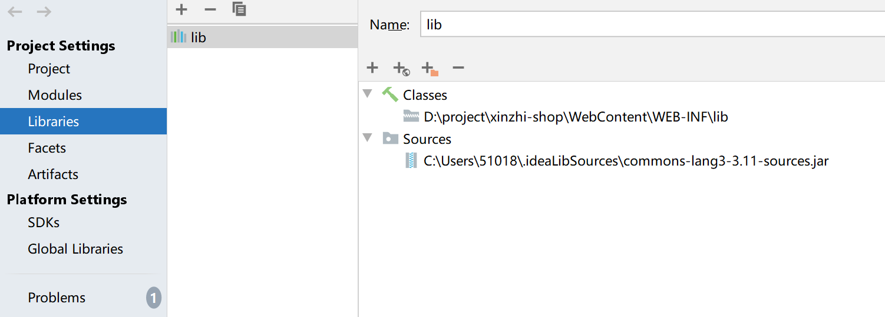

> 打开方式有两种

1、通过工具栏


2、通过快捷键

```text
 Ctrl+Shift+Alt+S
```

#### （1）Project 选项

指定项目名称，SDK，语言级别和编译器输出路径。

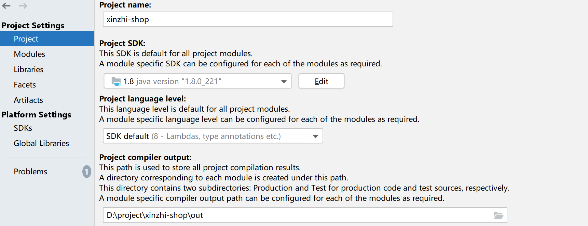

- Project name：项目名，使用此字段编辑项目名称。

- Project SDK：项目 SDK，选择项目 SDK。如果所需 SDK 不在列表中，请单击“ New”，然后选择所需的 SDK 类型。然后，在打开的对话框中，选择 SDK 主目录，然后单击确定。要查看或编辑所选 SDK 的名称和内容，请单击"Edit"。（SDK 页面将打开。）

- Project language level：选择要支持的 Java 语言级别。选定的级别将被用作项目默认值。

- Project compiler output：项目编译器输出，指定 IntelliJ IDEA 将存储编译结果的路径。单击选择路径对话框中 browseButton 的目录。

  指定目录中的两个子目录将被创建：
  production 为生产代码。
  test 为测试来源。
  在这些子目录中，将为每个模块创建单独的输出目录。输出路径可以在模块级重新定义。

#### （2）Modules 选项

指定项目名称，SDK，语言级别和编译器输出路径。

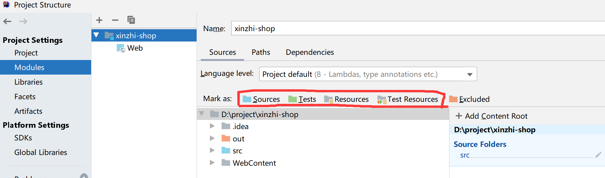

- Name：项目名称
- Souces：这里对 Module 的开发目录进行文件夹分类，就是说这个 module 里有什么内容，说明了不同性质的内容放在哪里。
  注意，这些不同内容的标记代表了一个标准 Java 工程的各项内容，IntelliJ 就是根据这些标记来识别一个 Java 工程的各项内容的，比如，它会用 javac 去编译标记为 Sources 的源码，打包的时候会把标记为 Resources 的资源拷贝到 jar 包中，并且忽略标记为 Exluded 的内容。左边显示的是在选中内容的预览。
- Paths：为模块配置编译器输出路径，还可以指定与模块关联的外部 JavaDocs 和外部注释的位置。
- Dependencies：在此选项卡上，您可以定义模块 SDK 并形成模块依赖关系列表。

#### （3）Sources 选项

Sources：源代码存放的文件，蓝色。

Tests：设置测试代码存放的文件件，绿色。

Resources：一般对应着 Sources 文件，一般放配置文件，如：db.properties。

Test Resources：这个对应着 Tests 文件夹，存放着 Tests 代码的配置文件。

Excluded：设置配出编译检查的文件，例如我们在 project 模块设置的 out 文件夹。

#### （4）Paths

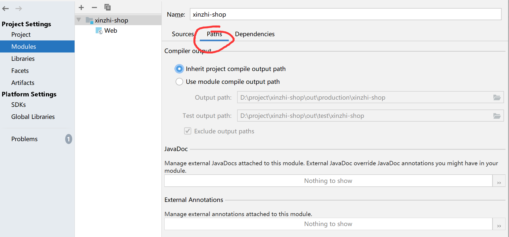

- Compiler output：编译输出路径。
- Inherit project compile output path：继承项目编译输出路径 选择此选项以使用为项目指定的路径。即上面在 Project 选项中设置的 out 文件路径。
- Use module compile output path:使用模块编译输出路径。

Output path：编译输出路径。

Test output path：测试代码编译输出路径。

Exclude output paths： 排除输出路径，选中此复选框可以排除输出目录。

- JavaDoc：使用可用控件组合与模块关联的外部 JavaDocs 存储位置的列表。
- External Annotations：外部注释。使用 和 管理与模块关联的外部注释的位置（目录）列表。

#### （5）Dependencies

在此选项卡上，您可以定义模块 SDK 并形成模块依赖关系列表。

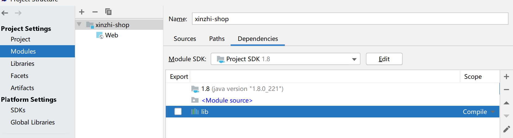

- Module SDK：模块 SDK，选择模块 SDK。

  （要将项目 SDK 与模块相关联，请选择 Project SDK。请注意，如果稍后更改了项目 SDK，模块 SDK 将相应更改。
  如果所需 SDK 不在列表中，请单击“ 新建”，然后选择所需的 SDK 类型。然后，在打开的对话框中，选择 SDK 主目录，然后单击确定。
  要查看或编辑所选 SDK 的名称和内容，请单击编辑。（SDK 页面将打开。）

- 依赖列表

- 相关性存储格式，选择用于存储依赖关系的格式（作为 IntelliJ IDEA 模块或 Eclipse 项目）。该选项对使用不同开发工具的团队有帮助。

#### （6）Libraries

在此选项卡上，您可以定义模块 SDK 并形成模块依赖关系列表。

首先，可以创建一个新的项目库，可以设置分类。

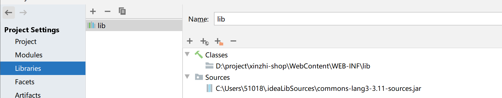

可以添加本地 jar 包，网络来源的 jar 包，删除 jar 包。

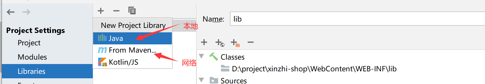

#### （7）Facets

表示这个 module 有什么特征，比如 Web，Spring 和 Hibernate 等；

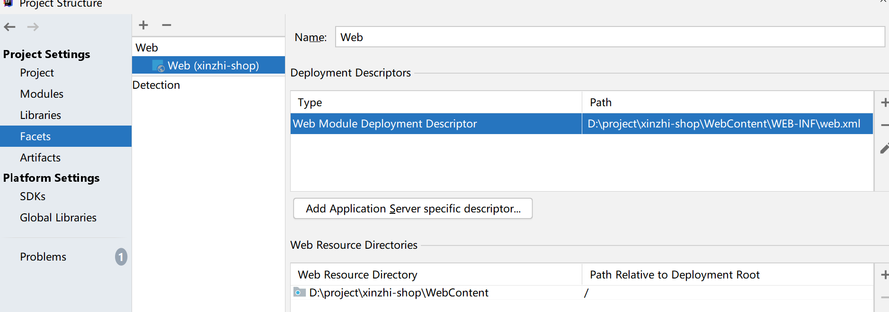

#### （8）Artifacts

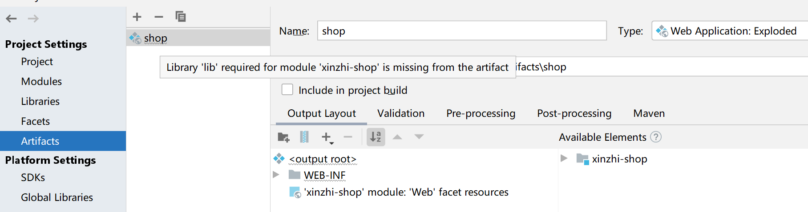

- `Artifact` 是 maven 中的一个概念，表示某个 module 要如何打包，例如 war exploded、war、jar 等等这种打包形式；
  一个 module 有了 Artifacts 就可以部署到应用服务器中了！
- 在给项目配置 Artifacts 的时候有好多个 type 的选项，exploed 是什么意思？explode 在这里你可以理解为展开，不压缩的意思。也就是 war、jar 等产出物没压缩前的目录结构。
- 建议在开发的时候使用这种模式，便于修改了文件的效果立刻显现出来。
- 默认情况下，IDEA 的 Modules 和 Artifacts 的 output 目录 已经设置好了，不需要更改.
- 打成 war 包 的时候会自动在 WEB-INF 目录 下生产 classes 目录 ，然后把编译后的文件放进去。

#### （9）SDKS

系统开发工具 ，全局 SDK 配置 。

#### （10）Global libraries

全局类库，可以配置一些常用的类库。

#### （11）Problems

问题，在项目异常的时候很有用，可以根据提示进行项目修复（FIXED）。

#### （12）.idea 和.iml

> 我们设置了半天看看我们设置的信息被保存在了哪里？

`xinzhi-shop.iml`

```xml
<?xml version="1.0" encoding="UTF-8"?>
<module type="JAVA_MODULE" version="4">
  <component name="FacetManager">
    <facet type="web" name="Web">
      <configuration>
        <descriptors>
          <deploymentDescriptor name="web.xml" url="file://$MODULE_DIR$/WebContent/WEB-INF/web.xml" />
        </descriptors>
        <webroots>
          <root url="file://$MODULE_DIR$/WebContent" relative="/" />
        </webroots>
      </configuration>
    </facet>
  </component>
  <component name="NewModuleRootManager" inherit-compiler-output="true">
    <exclude-output />
    <content url="file://$MODULE_DIR$">
      <sourceFolder url="file://$MODULE_DIR$/src" isTestSource="false" />
    </content>
    <orderEntry type="inheritedJdk" />
    <orderEntry type="sourceFolder" forTests="false" />
    <orderEntry type="library" name="lib" level="project" />
  </component>
</module>
```

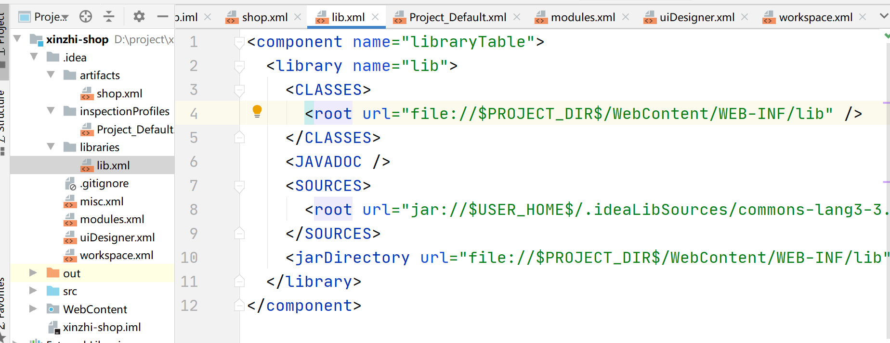

> 这样别的 idea 打开项目时就能读取出来，并能明确项目的构建信息

> 问，eclipse 直接打开能用吗？

提问现在给你一个 java 工程的代码你们构建出来了吗？

或者给你一个 eclipse 的代码你能转化过来吗？

## 二、Maven 概述

以上的工作，需要我们自行构建，而且 idea 和 eclipse，甚至一些其他的开发工具构建的时候是不一样的。

那么有没有一种统一的方式，甚至无需手动点击，通过配置就可以了，通过使用命令就能就行构建呢？

当然我们看到了我们的 idea 其实也是通过之文件来记录构建信息的，那么既然构建如此重要，形成一套规范化的，统一的便捷的构建工具就势在必行，于是出现了`maven`，当然还有`gradle`，他们的功能异常强大。

> 这样有什么好处

- 统一管理 jar 包，自动导入 jar 及其依赖，这样是很初学者唯一能感受出来的好处，确实牛逼啊。
- 项目移植之后甚至不需要安装开发工具，只需要 maven 加命令就能跑起来，降低学习成本。
- 使我们的项目流水线成为可能，因为使用简单的命令我们就能完成项目的编译，打包，发布等工作，就让程序操作程序成为了可能，大名鼎鼎的 jekins 技能做到这一点。

#### 1、Maven 下载安装

下载地址：<http://maven.apache.org/>

> 小知识点： 作为一个 java 程序员 apache 网站的规律得知道都是 “项目名\.apache\.org”

- <http://maven.apache.org/>
- <http://tomcat.apache.org/>
- <http://dubbo.apache.org/>
- <http://hadoop.apache.org/>

**Apache 软件基金会**（也就是 Apache Software Foundation，简称为 ASF），是专门为支持开源软件项目而办的一个非盈利性组织。在它所支持的 Apache 项目与子项目中，所发行的软件产品都遵循 Apache 许可证（Apache License）。

> 安装以及配置环境变量，学过点 java 的都会

1. 解压
2. 配置 MAVEN_HOME
3. 配置 path，`%MAVEN_HOME%\bin`
4. cmd 执行 `mvn -v` ，出现以下界面，成功

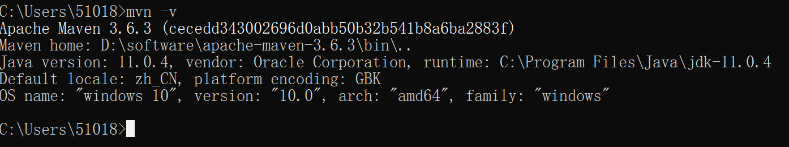

#### 2、maven 核心配置文件

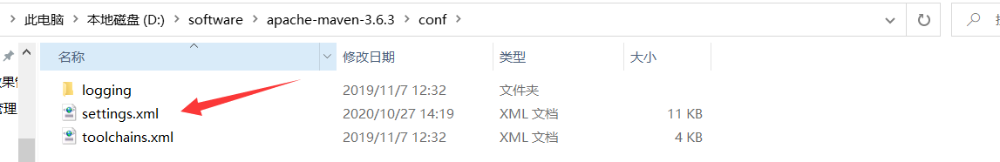

> 先照着配置

##### （1）配置路径

先建立好这个文件夹

```xml
<localRepository>D:/repository</localRepository>
```

##### （2）配置阿里云镜像

> 要不啥也下不动

```xml
<mirrors>
    <mirror>
        <id>alimaven</id>
        <name>aliyun maven</name>
        <url>http://maven.aliyun.com/nexus/content/groups/public/</url>
        <mirrorOf>central</mirrorOf>
    </mirror>
<mirrors>
```

##### （3）配置全局编译 jdk 版本

```xml
<profile>
    <id>jdk-1.8</id>
     <activation>
      <activeByDefault>true</activeByDefault>
       <jdk>1.8</jdk>
      </activation>
    <properties>
        <maven.compiler.source>1.8</maven.compiler.source>
        <maven.compiler.target>1.8</maven.compiler.target>
        <maven.compiler.compilerVersion>1.8</maven.compiler.compilerVersion>
    </properties>
</profile>
```

#### 3、常常鲜，体验

> **maven 标准目录**

```text
src
 |--main
     |--java         源代码目录
     |--resources    资源目录
 |--test
     |--java         测试代码目录
     |--resources    测试资源目录
|--target
 |--classes      编译后的class文件目录
 |--test-classes 编译后的测试class文件目录
pom.xml             Maven工程配置文件
```

这是大部分 Maven 工程的目录结构，在这个基础上可以合理地增删目录。

`pom.xml`的基本要求：

```xml
<?xml version="1.0" encoding="UTF-8"?>
<project xmlns="http://maven.apache.org/POM/4.0.0"
         xmlns:xsi="http://www.w3.org/2001/XMLSchema-instance"
         xsi:schemaLocation="http://maven.apache.org/POM/4.0.0
         http://maven.apache.org/xsd/maven-4.0.0.xsd">

    <modelVersion>4.0.0</modelVersion>
    <artifactId>test</artifactId>
    <groupId>org.xinzhi</groupId>
    <version>1.0-SNAPSHOT</version>

</project>
```

写个 `Hello.java`

```java
public class Hello{
    public static void main(String args[]){
        System.out.println("Hello maven!");
    }
}
```

可以再`resources`文件夹下新建`db.properties`配置文件，或随便帮一个文件;

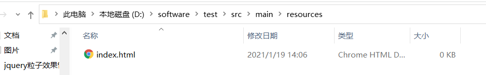

执行，以下命令，可能会从网上下载内容，是在下载插件，不要担心。

```bash
mvn compile
```

结果，并生成 target 目录

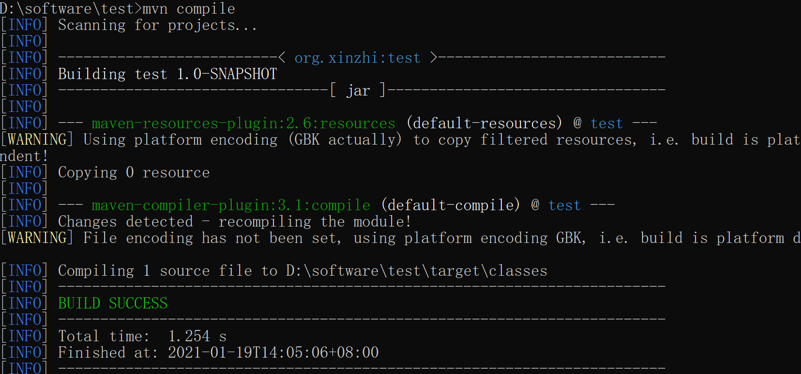

> 结果发现我们编译的 class 文件和 resources 中的配置文件都放在了一起

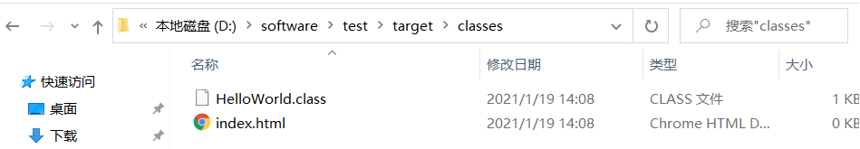

执行 `mvn package`

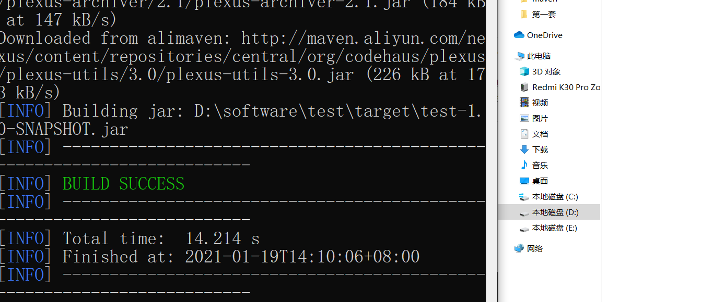

观察 target 中已经有了我们打包好的 jar 包


观察名字是不是我们**项目的名字加版本号**，当然此 jar 包无法运行，应为 maven 也不知道你的 main 方法在哪里，咱们后边讲。

#### 4、Maven 生命周期

> maven 生命周期其实就是描述了一个项目从源代码到部署的整个周期

Maven 有三个内置的生命周期：**默认（default），清洁（clean）和站点（site）**。

- 清洁（clean） 为执行以下工作做必要的清理。就是我们经常做的，删除 target 文件夹。
- 默认（default） 真正进行项目编译打包等工作的阶段
- 站点（site） 生成项目报告，站点，发布站点

> **默认（default）的生命周期包括以下阶段（该阶段经过简化，实际上更加复杂）：**

1. 验证（validate） - 验证项目是否正确，所有必要的信息可用。
2. **编译**（compile） - 编译项目的源代码。
3. 测试（test） - 使用合适的单元测试框架测试编译的源代码。这些测试不应该要求代码被打包或部署。
4. **打包**（package）- 采用编译的代码，并以其可分配格式（如 JAR）进行打包。
5. 验证（verify） - 对集成测试的结果执行任何检查，以确保满足质量标准。
6. **安装**（install） - 将软件包安装到本地存储库中，用作本地其他项目的依赖项。
7. 部署（deploy） - 在构建环境中完成，将最终的包复制到远程存储库以与其他开发人员和项目共享（私服）。

```bash
mvn install
```

此命令在执行安装之前按顺序（验证（validate），编译（compile），打包（package）等）执行每个默认生命周期阶段。在这种情况下，您只需要调用最后一个构建阶段来执行，安装（install）。

在构建环境中，使用以下调用将工件清理地构建并部署到共享存储库中。

```bash
mvn clean deploy
```

相同的命令可以在多模块场景（即具有一个或多个子项目的项目）中使用。Maven 遍历每个子项目并执行清洁（clean），然后执行部署（deploy）（包括所有之前的构建阶段步骤）。

注意：在我们开发阶段，有一些生命周期的阶段，比如验证（validate）这些，基本很少用到。只要使用关键的几个基本能满足需求。

#### 5、Maven 常用命令

下面 maven 比较常见的一些命令。

| 命令                   | 说明                                                        |
| ---------------------- | ----------------------------------------------------------- |
| mvn –version           | 显示版本信息                                                |
| mvn clean              | 清理项目生产的临时文件,一般是模块下的 target 目录           |
| mvn compile            | 编译源代码，一般编译模块下的 src/main/java 目录             |
| mvn package            | 项目打包工具,会在模块下的 target 目录生成 jar 或 war 等文件 |
| mvn test               | 测试命令,或执行 src/test/java/下 junit 的测试用例           |
| mvn install            | 将打包的 jar/war 文件复制到你的本地仓库中,供其他模块使用    |
| mvn deploy             | 将打包的文件发布到远程参考,提供其他人员进行下载依赖         |
| mvn site               | 生成项目相关信息的网站                                      |
| mvn dependency:tree    | 打印出项目的整个依赖树                                      |
| mvn archetype:generate | 创建 Maven 的普通 java 项目                                 |
| mvn tomcat:run         | 在 tomcat 容器中运行 web 应用                               |

#### 6、Maven 的版本规范（我们的项目）

所有的软件都用版本

Maven 使用如下几个要素来定位一个项目，因此它们又称为项目的坐标。

- `groudId` 团体、组织的标识符。团体标识的约定是，它以创建这个项目的组织名称的逆向域名开头。一般对应着 JAVA 的包的结构，例如 org\.apache。
- `artifactId` 单独项目的唯一标识符。比如我们的 tomcat, commons 等。不要在 artifactId 中包含点号(.)。
- `version` 项目的版本。
- `packaging` 项目的类型，默认是 jar，描述了项目打包后的输出。类型为 jar 的项目产生一个 JAR 文件，类型为 war 的项目产生一个 web 应用。

Maven 在版本管理时候可以使用几个特殊的字符串 SNAPSHOT，LATEST，RELEASE。比如"1.0-SNAPSHOT"。各个部分的含义和处理逻辑如下说明：

- `SNAPSHOT` 这个版本一般用于开发过程中，表示不稳定的版本。
- `LATEST` 指某个特定构件的最新发布，这个发布可能是一个发布版，也可能是一个 snapshot 版，具体看哪个时间最后。
- `RELEASE` 指最后一个发布版。

#### 7、在 idea 中配置 maven

> 把画红线的东西全部配置成自己的。最后一个是仓库，在你的其他盘找一个地方新建 repository 文件夹，自己要知道，选中，如果勾选不了就选择都选 override。

如果不选择仓库会把 jar 包下载至 C 盘的下边目录，不好维护，还占用 c 盘空间。当然 idea 和 maven 可能会有 bug。

```url
C:\Users\zn\.m2\repository
```

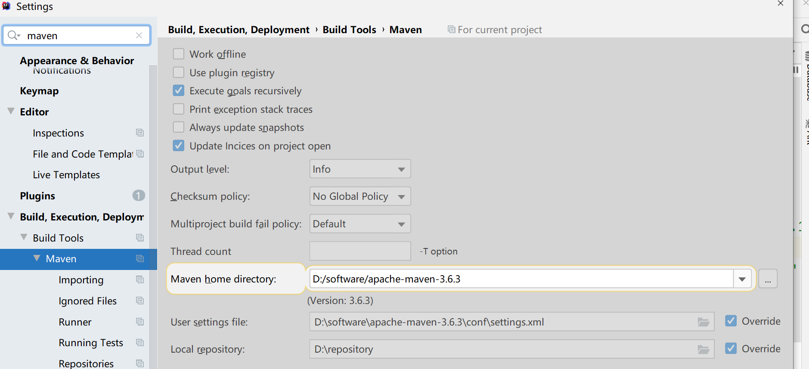

> 两处都要配置，一个是当前项目的 maven 配置，一个是新建项目的 maven 配置。

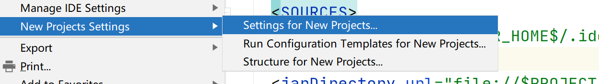

## 三、Maven 依赖（重点）

> maven 管理依赖也就是 jar 包牛逼之处是不用我们自己下载，会从一些地方自动下载

- maven 远程仓库: <https://mvnrepository.com/>
- maven 远程仓库: <https://maven.aliyun.com/mvn/search>

> maven 工程中我们依靠在 pom.xml 文件进行配置完成 jar 包管理工作（依赖）

在工程中引入某个 jar 包，只需要在`pom.xml`中引入 jar 包的坐标，比如引入 log4j 的依赖：

```xml
<dependencies>
    <dependency>
        <groupId>junit</groupId>
        <artifactId>junit</artifactId>
        <version>4.7</version>
        <scope>test</scope>
    </dependency>
</dependencies>
```

`Maven` 通过 `groupId`、 `artifactId` 与 `version` 三个向量来定位 Maven 仓库其 jar 包所在的位置，并把对应的 jar 包引入到工程中来。

> jar 包会自动下载，流程如下


### 1、依赖范围

> 了解、classpath 是个什么东西

顾明思议，就是编译好的`class`文件所在的路径。

事实上，我们的类加载器（`classloader`）就是去对应的`classpath`中加在 class 二进制文件。

> 普通 java 项目

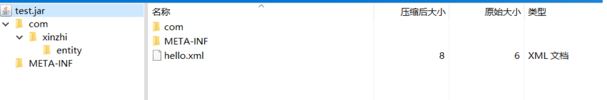

META-INF 中有个文件，有以下内容，告诉 jvm 执行的时候去哪个类里找 main 方法。

普通的 java 工程类路径就是最外层的目录。

```text
Manifest-Version: 1.0
Main-Class: com.xinzhi.HelloUser
```

> web 项目

咱们的 src 打包后会放在

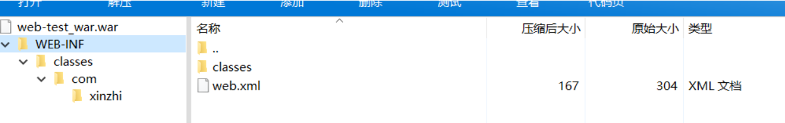

src 目录下的配置文件会和 class 文件一样，自动 copy 到应用的 WEB-INF/classes 目录下 ，所以普通 jar 包的类路径就是根路径，没有资源，如果有配置文件也放在 src 目录下，他会同步打包在类路径下。

所以 web 项目的 classpath 是 `WEB-INF/classes`

> maven 项目

maven 工程会将 `src/main/java`  和  `src/main/resources`  文件夹下的文件全部打包在 classpath 中。运行时他们两个的文件夹下的文件会被放在一个文件夹下。

maven 项目不同的阶段引入到 classpath 中的依赖是不同的，例如，

- `编译时`，maven 会将与编译相关的依赖引入 classpath 中
- `测试时`，maven 会将测试相关的的依赖引入到 classpath 中
- `运行时`，maven 会将与运行相关的依赖引入 classpath 中

而依赖范围就是用来控制依赖于这三种 classpath 的关系。

> scope 标签就是依赖范围的配置

该项默认配置 compile,可选配置还有 test、provided、runtime、system、import。

其中 compile、test 和 provided 使用较多，下面依次介绍。

> 有些 jar 包（如 selvlet-api）运行时其实是不需要的，因为 tomcat 里有，但编译时是需要的，因为编译的时候没有 tomcat 环境

> 有些 jar 只在测试的时候才能用到。比如 junit，真是运行不需要的

> 有些 jar 运行，测试时必须要有，编译时不需要，如 jdbc 驱动，编译时用的都是 jdk 中的接口，运行时我们才使用反射注册了驱动。

向以上的这些 jar 包不是说使用默认的 compile 一定不行，但是设置成合适的范围更好，当然有事会有问题，比如你引入的 servlet-api 和 tomcat 自带的不一样，就会出问题。

#### 1.1 编译依赖范围（compile）

**该范围就是默认依赖范围**，此依赖范围对于编译、测试、运行三种`classpath`都有效，举个简单的例子，假如项目中有`fastjson`的依赖，那么`fastjson`不管是在编译，测试，还是运行都会被用到，因此`fastjson`必须是编译范围（构件默认的是编译范围，所以依赖范围是编译范围的无须显示指定）

```xml
<dependency>
    <groupId>com.alibaba</groupId>
    <artifactId>fastjson</artifactId>
    <version>1.2.68</version>
</dependency>
```

#### 1.2 测试依赖范围(test)

使用此依赖范围的依赖，只对测试 classpath 有效，在编译主代码和项目运行时，都将无法使用该依赖，最典型的例子就是 Junit, 构件在测试时才需要，所以它的依赖范围是测试，因此它的依赖范围需要显示指定为、、<scope>test</scope>,当然不显示指定依赖范围也不会报错，但是该依赖会被加入到编译和运行的 classpath 中,造成不必要的浪费 。

```xml
<dependency>
    <groupId>junit</groupId>
    <artifactId>junit</artifactId>
    <version>4.7</version>
    <scope>test</scope>
</dependency>
```

#### 1.3 已提供依赖范围(provided)

使用该依赖范围的 maven 依赖，只对编译和测试的 classpath 有效，对运行的 classpath 无效，典型的例子就是 servlet-api， 编译和测试该项目的时候需要该依赖，但是在运行时，web 容器已经提供的该依赖，所以运行时就不再需要此依赖，如果不显示指定该依赖范围，并且容器依赖的版本和 maven 依赖的版本不一致的话，可能会引起版本冲突，造成不良影响。

```xml
<dependency>
    <groupId>javax.servlet</groupId>
    <artifactId>javax.servlet-api</artifactId>
    <version>4.0.1</version>
    <scope>provided</scope>
</dependency>
```

#### 1.4 运行时依赖范围(runtime)

使用该依赖范围的 maven 依赖，只对测试和运行的 classpath 有效，对编译的 classpath 无效，典型例子就是 JDBC 的驱动实现，项目主代码编译的时候只需要 JDK 提供的 JDBC 接口，只有在测试和运行的时候才需要实现上述接口的具体 JDBC 驱动。

```xml
<dependency>
    <groupId>mysql</groupId>
    <artifactId>mysql-connector-java</artifactId>
    <version>5.1.25</version>
    <scope>runtime</scope>
</dependency>
```

> 其他的范围不常用，有兴趣自己研究

### 2、依赖的传递

jar 其实也是别人写的工程，他也会依赖其他的 jar 包，传递性让我们可以不用关系我们所依赖的 jar 他依赖了哪些 jar，只要我们添加了依赖，他会自动将他所依赖的 jar 统统依赖进来。


我们只需依赖 A.jar，其他的会自动传递进来。

> 依赖传递的原则：

- **最短路径优先原则**：如果 A 依赖于 B，B 依赖于 C，在 B 和 C 中同时有 log4j 的依赖，并且这两个版本不一致，那么 A 会根据最短路径原则，在 A 中会传递过来 B 的 log4j 版本。


- **路径相同先声明原则**：如果我们的工程同时依赖于 B 和 A，B 和 C 没有依赖关系，并且都有 D 的依赖，且版本不一致，那么会引入在 pom.xml 中先声明依赖的 log4j 版本。


```xml
<dependency>
    <groupId>com.xinzi</groupId>
    <artifactId>B</artifactId>
    <version>1.5.3</version>
</dependency>
<dependency>
    <groupId>com.xinzhi</groupId>
    <artifactId>A</artifactId>
    <version>1.12.2</version>
</dependency>
```

因为 1.2.3 先声明，所以获胜。

> 特别注意：

不同版本的 jar 选一个会导致一个问题，1.3.2 版本高，A.jar 可能用到了高版本的一些新的方法，此时因为某些原因系统选择了低版本，就会导致 A.jar 报错，无法运行。那么就要想办法把低版本排除掉，一般高版本会兼容低版本。

### 3、依赖的排除

> 结合上个例子，我们想把低版本的 D.jar 排除了，就可以这样做，这样系统就只能依赖高版本

```xml
<dependencies>
    <dependency>
        <groupId>com.xinzi</groupId>
        <artifactId>B</artifactId>
        <version>1.5.3</version>
        <exclusions>
            <exclusion>
                <artifactId>com.xinzhi</artifactId>
                <groupId>D</groupId>
            </exlcusion>
        </exclusions>
    </dependency>
    <dependency>
        <groupId>com.xinzhi</groupId>
        <artifactId>A</artifactId>
        <version>1.12.2</version>
    </dependency>
</dependencies>
```

### 4、聚合和继承

> 分布式开发必须要用

> **聚合模块（父模块）的打包方式必须为 pom，否则无法完成构建**。

在聚合多个项目时，如果这些被聚合的项目中需要引入相同的 Jar，那么可以将这些 Jar 写入父 pom 中，各个子项目继承该 pom 即可。，父模块的打包方式必须为 pom，否则无法构建项目。

> 通过在各个子模块中配置来表明其继承与哪一个父模块：

```xml
<parent>
    <artifactId>parent</artifactId>
    <groupId>org.example</groupId>
    <version>1.0-SNAPSHOT</version>
</parent>
<modelVersion>4.0.0</modelVersion>

<artifactId>childern-two</artifactId>
```

可以被继承的 POM 元素如下：

- **groupId**：项目组 ID，项目坐标的核心元素
- **version**：项目版本，项目坐标的核心因素
- properties：自定义的 Maven 属性 一般用于同一制定各个依赖的版本号
- dependencies：项目的依赖配置 公共的依赖
- dependencyManagement：项目的依赖管理配置
- repositories：项目的仓库配置
- build：包括项目的源码目录配置、输出目录配置、插件配置、插件管理配置等

> 一些对项目的描述

- description：项目的描述信息
- organization：项目的组织信息
- inceptionYear：项目的创始年份
- url：项目的 URL 地址
- developers：项目的开发者信息
- contributors：项目的贡献者信息
- distributionManagement：项目的部署配置
- issueManagement：项目的缺陷跟踪系统信息
- ciManagement：项目的持续集成系统信息
- scm：项目的版本控制系统
- malilingLists：项目的邮件列表信息
- reporting：包括项目的报告输出目录配置、报告插件配置等

## 四、POM 文件

### 1、基础配置

一个典型的 pom.xml 文件配置如下：

```xml
<project xmlns="http://maven.apache.org/POM/4.0.0" xmlns:xsi="http://www.w3.org/2001/XMLSchema-instance"
    xsi:schemaLocation="http://maven.apache.org/POM/4.0.0http://maven.apache.org/xsd/maven-4.0.0.xsd">

    <!-- 模型版本。必须是这样写，现在是maven唯一支持的版本 -->
    <modelVersion>4.0.0</modelVersion>
    <!-- 公司或者组织的唯一标志，并且配置时生成的路径也是由此生成， 如com.xinzhi，maven会将该项目打成的jar包放本地路径：/com/xinzhi/ -->
    <groupId>com.xinzhi</groupId>
    <!-- 本项目的唯一ID，一个groupId下面可能多个项目，就是靠artifactId来区分的 -->
    <artifactId>test</artifactId>
    <!-- 本项目目前所处的版本号 -->
    <version>1.0.0-SNAPSHOT</version>

    <!-- 打包的机制，如pom,jar,  war，默认为jar -->
    <packaging>jar</packaging>

    <!-- 为pom定义一些常量，在pom中的其它地方可以直接引用 使用方式 如下 ：${file.encoding} -->
    <!-- 常常用来整体控制一些依赖的版本号 -->
    <properties>
        <file.encoding>UTF-8</file.encoding>
        <java.source.version>1.8</java.source.version>
        <java.target.version>1.8</java.target.version>
    </properties>


    <!-- 定义本项目的依赖关系，就是依赖的jar包 -->
    <dependencies>
        <!-- 每个dependency都对应这一个jar包 -->
        <dependency>
            <!--一般情况下，maven是通过groupId、artifactId、version这三个元素值（俗称坐标）来检索该构件， 然后引入你的工程。如果别人想引用你现在开发的这个项目（前提是已开发完毕并发布到了远程仓库），-->
            <!--就需要在他的pom文件中新建一个dependency节点，将本项目的groupId、artifactId、version写入， maven就会把你上传的jar包下载到他的本地 -->
            <groupId>junit</groupId>
            <artifactId>junit</artifactId>
            <version>4.12</version>

            <!-- 依赖范围 -->
            <scope>complie</scope>
            <!-- 设置  依赖是否可选，默认为false,即子项目默认都继承。如果为true,
                 则子项目必需显示的引入  -->
            <optional>false</optional>

            <!-- 依赖排除-->
            <exclusions>
                <exclusion>
                    <groupId>org.slf4j</groupId>
                    <artifactId>slf4j-api</artifactId>
                </exclusion>
            </exclusions>
        </dependency>
    </dependencies>

    ...
</project>
```

一般来说，上面的几个配置项对任何项目都是必不可少的，定义了项目的基本属性。

> 除了 dependencies 我们还用到了 dependencyManagement，区别如下

```text
dependencies
```

- 即使在子项目中不写该依赖项，那么子项目仍然会从父项目中继承该依赖项（全部继承）。
- 继承下来就会被编译，如果子项目根本不用这个依赖会增加子工程的负担。

`dependencyManagement`：通常会在父工程中定义，目的是统一各个子模块的依赖版本，有不用实际依赖

- 只是声明依赖，并不实现引入
- 子项目**需要显示的声明需要用的依赖**。如果不在子项目中声明依赖，是不会从父项目中继承下来的；
- 只有在子项目中写了该依赖项，并且没有指定具体版本，才会从父项目中继承该项，并且 version 和 scope 都读取自父 pom;另外如果子项目中指定了版本号，那么会使用子项目中指定的 jar 版本。

### 2、构建配置

```xml
<build>

    <!-- 产生的构件的文件名，默认值是${artifactId}-${version}。 -->
    <finalNasourceDirectory>${basedir}\src\main\java</sourceDirectory>

    <!--项目单元测试使用的源码目录，当测试项目的时候，构建系统会编译目录里的源码。该路径是相对于pom.xml的相对路径。 -->

    <>${basedir}\target\classes</outputDirectory>

    <!--被编译过的测试class文件存放的目录。 -->
    <testOutputDirectory>${basedir}\target\test-classes
    </testOutputDirectory>
    <!-- 以上配置都有默认值，就是约定好了目录就这么建 -->

    <resources>
         <resource>
            <directory>src/main/java</directory>
            <includes>
                <include>**/*.properties</include>
                <include>**/*.xml</include>
            </includes>
            <filtering>false</filtering>
        </resource>
        <resource>
            <directory>src/main/resources</directory>
            <includes>
                <include>**/*.properties</include>
                <include>**/*.xml</include>
            </includes>
            <filtering>false</filtering>
        </resource>
    </resources>

    <!--单元测试相关的所有资源路径，配制方法与resources类似 -->
    <testResources>
        <testResource>
            <targetPath />
            <filtering />
            <directory />
            <includes />
            <excludes />
        </testResource>
    </testResources>

    <!--使用的插件列表 。 -->
    <plugins>
        <plugin>
  ...具体在插件使用中了解
        </plugin>
    </plugins>

    <!--主要定义插件的共同元素、扩展元素集合，类似于dependencyManagement， -->
    <!--所有继承于此项目的子项目都能使用。该插件配置项直到被引用时才会被解析或绑定到生命周期。 -->
    <!--给定插件的任何本地配置都会覆盖这里的配置 -->
    <pluginManagement>
        <plugins>...</plugins>
    </pluginManagement>

</build>
```

我们常用的几个配置

> 关于资源处理的配置

> 有些小伙伴就喜欢在 src 中填写配置文件

```xml
<!-- 处理资源被过滤问题 -->
<build>
    <resources>
        <resource>
            <directory>src/main/java</directory>
            <includes>
                <include>**/*.properties</include>
                <include>**/*.xml</include>
            </includes>
            <filtering>false</filtering>
        </resource>
        <resource>
            <directory>src/main/resources</directory>
            <includes>
                <include>**/*.properties</include>
                <include>**/*.xml</include>
            </includes>
            <filtering>false</filtering>
        </resource>
    </resources>
</build>
```

> 添加本地 jar 包

本地 jar，如：支付宝 jar 包放到 src/main/webapp/WEB-INF/lib 文件夹下，如果没有配置，本地没问题，但是线上会找不到 sdk 类，为什么要引入，因为支付宝 jar 包再中央仓库没有

```xml
<!-- geelynote maven的核心插件之-complier插件默认只支持编译Java 1.4，因此需要加上支持高版本jre的配置，在pom.xml里面加上 增加编译插 -->
<plugin>
    <groupId>org.apache.maven.plugins</groupId>
    <artifactId>maven-compiler-plugin</artifactId>
    <configuration>
        <source>1.8</source>
        <target>1.8</target>
        <encoding>UTF-8</encoding>
        <compilerArguments>
            <!-- 本地jar，支付宝jar包放到  src/main/webapp/WEB-INF/lib 文件夹下，
           如果没有配置，本地没问题，但是线上会找不到sdk类
           为什么要引入，因为支付宝jar包再中央仓库没有，再比如oracle连接驱动的jar
        -->
            <extdirs>${project.basedir}/src/main/webapp/WEB-INF/lib</extdirs>
        </compilerArguments>
    </configuration>
</plugin>
```

### 3、仓库配置

```xml
<repositories>
    <repository>
        <id>alimaven</id>
        <name>aliyun maven</name>
        <url>http://maven.aliyun.com/nexus/content/groups/public/</url>
        <releases>
            <enabled>true</enabled>
        </releases>
        <snapshots>
            <enabled>false</enabled>
        </snapshots>
    </repository>
</repositories>
```

pom\.xml 里面的仓库与 setting\.xml 里的仓库功能是一样的。主要的区别在于，pom 里的仓库是个性化的。比如一家大公司里的 setting 文件是公用的，所有项目都用一个 setting 文件，但各个子项目却会引用不同的第三方库，所以就需要在 pom\.xml 里设置自己需要的仓库地址。

### 5、多环境配置

```xml
<profiles>
        <profile>
            <id>dev</id>
            <build>
                <finalName>dev</finalName>
            </build>
            <repositories>
                <repository>
                    <id>ali</id>
                    <name>ali repo</name>
                    <url>https://maven.aliyun.com/repository/central</url>
                    <releases>
                        <enabled>true</enabled>
                    </releases>
                    <snapshots>
                        <enabled>true</enabled>
                    </snapshots>
                </repository>
            </repositories>
        </profile>
        <profile>
            <id>test</id>
            <build>
                <finalName>test</finalName>
            </build>
            <repositories>
                <repository>
                    <id>ali</id>
                    <name>ali repo</name>
                    <url>https://mirrors.huaweicloud.com/repository/maven/</url>
                    <releases>
                        <enabled>true</enabled>
                    </releases>
                    <snapshots>
                        <enabled>true</enabled>
                    </snapshots>
                </repository>
            </repositories>
        </profile>
        <profile>
            <activation>
                <activeByDefault>true</activeByDefault>
            </activation>
            <id>pro</id>
            <build>
                <finalName>pro</finalName>
            </build>
        </profile>
    </profiles>
```

### 5、项目信息配置（知道）

```xml
<!--项目的名称, Maven产生的文档用 -->
<name>banseon-maven </name>

<!--项目主页的URL, Maven产生的文档用 -->
<url>http://www.clf.com/ </url>

<!--项目的详细描述, Maven 产生的文档用。 当这个元素能够用HTML格式描述时 -->
<!--（例如，CDATA中的文本会被解析器忽略，就可以包含HTML标签），不鼓励使用纯文本描述。 -->
<!-- 如果你需要修改产生的web站点的索引页面，你应该修改你自己的索引页文件，而不是调整这里的文档。 -->
<description>A maven project to study maven. </description>


<!--项目创建年份，4位数字。当产生版权信息时需要使用这个值。 -->
<inceptionYear />

<!--项目开发者列表 -->
<developers>

    <!--某个项目开发者的信息 -->
    <developer>
        <!--SCM里项目开发者的唯一标识符 -->
        <id> HELLO WORLD </id>
        <!--项目开发者的全名 -->
        <name> banseon </name>
        <!--项目开发者的email -->
        <email> banseon@126.com</email>
        <!--项目开发者的主页的URL -->
        <url />
        <!--项目开发者在项目中扮演的角色，角色元素描述了各种角色 -->
        <roles>
            <role> Project Manager</role>
            <role>Architect </role>
        </roles>
        <!--项目开发者所属组织 -->
        <organization> demo</organization>
        <!--项目开发者所属组织的URL -->
        <organizationUrl>http://hi.clf.com/ </organizationUrl>
        <!--项目开发者属性，如即时消息如何处理等 -->
        <properties>
            <dept> No </dept>
        </properties>
        <!--项目开发者所在时区， -11到12范围内的整数。 -->
        <timezone> -5</timezone>
    </developer>

</developers>

<!--项目的其他贡献者列表 -->
<contributors>

    <!--项目的其他贡献者。参见developers/developer元素 -->
    <contributor>
        <name />
        <email />
        <url />
        <organization />
        <organizationUrl />
        <roles />
        <timezone />
        <properties />
    </contributor>

</contributors>

<!--该元素描述了项目所有License列表。应该只列出该项目的license列表，不要列出依赖项目的license列表。 -->
<!--如果列出多个license，用户可以选择它们中的一个而不是接受所有license。 -->
<licenses>

    <!--描述了项目的license，用于生成项目的web站点的license页面，其他一些报表和validation也会用到该元素。 -->
    <license>

        <!--license用于法律上的名称 -->
        <name> Apache 2 </name>
        <!--官方的license正文页面的URL -->
        <url>http://www.clf.com/LICENSE-2.0.txt </url>
        <!--项目分发的主要方式： repo，可以从Maven库下载 manual， 用户必须手动下载和安装依赖 -->
        <distribution> repo</distribution>
        <!--关于license的补充信息 -->
        <comments> Abusiness-friendly OSS license </comments>
    </license>

</licenses>


...还有很多
```

> 还有一些可以了解的不常用的配置如报表配置、问题管理配置、项目集成配置、profile 配置有兴趣的自行学习一下

## 五、Maven 仓库

任何的构件都有唯一的坐标，Maven 根据这个坐标定义了构件在仓库中的唯一存储路径，

Maven 仓库分为 2 类：

- 本地仓库
- 远程仓库，远程仓库又分成 3 种：
  - 中央仓库
  - 私服
  - 其它公共库

maven 项目使用的仓库一共有如下几种方式：

1. 中央仓库，这是默认的仓库
2. 镜像仓库，通过 sttings.xml 中的 `settings.mirrors.mirror` 配置
3. 全局 profile 仓库，通过 settings.xml 中的 `settings.repositories.repository` 配置
4. 项目仓库，通过 pom.xml 中的 `project.repositories.repository` 配置
5. 项目 profile 仓库，通过 pom.xml 中的 `project.profiles.profile.repositories.repository` 配置
6. 本地仓库

搜索顺序如下：

local_repo > settings_profile_repo > pom_profile_repo > pom_repositories > settings_mirror > central

### 1、本地仓库

本地仓库是 Maven 在本地存储构建的地方。Maven 的本地仓库，在安装 maven 后并不会创建，它是在第一次执行 Maven 命令的时候才被创建。

Maven 本地仓库的默认位置：无论是 Windows 还是 Linux，在用户的目录下都有一个.m2/repository/的仓库目录，这就是 Maven 仓库的默认位置。

在 Maven 的目录下的 conf 目录下，有一个 `settings.xml` 文件，是 Maven 的配置文件，在里面可以修改本地仓库的位置。

> 修改本地仓库位置：

```xml
<!-- 本地仓库的路径。默认值为 -->
<localRepository>D:/myworkspace/maven_repository</localRepository>
```

### 2、远程仓库

远程仓库主要用于获取其它人的 Maven 构件，其中最主要的就是中央仓库。关于如何在 Maven 中配置远程仓库，可以查看 POM 文件章节。

#### 2.1 中央仓库

中央仓库是默认的的远程仓库，Maven 在安装的时候，自带的就是中央仓库的配置。

所有的 Maven 都会继承超级 POM，超级 POM 种包含如下配置：

```xml
<repositories>
    <repository>
        <id>central</id>
        <name>Cntral Repository</name>
        <url>http://repo.maven.apache.org</url>
        <layout>default</layout>
        <snapshots>
            <enabled>false</enabled>
        </snapshots>
    </repository>
</repositories>
```

中央仓库包含了绝大多数流行的开源 Java 构件，以及源码、作者信息、SCM、信息、许可证信息等。

> 还可以在里面配置优先使用的镜像，比如在国内直接连中央仓库速度较慢，一般使用阿里的镜像仓库。

```xml
<!--镜像6列表-->
<mirrors>
    <!--镜像-->
    <mirror>
        <id>alimaven</id>
        <!--被镜像的服务器ID-->
        <mirrorOf>central</mirrorOf>
        <name>aliyun maven</name>
        <url>http://maven.aliyun.com/nexus/content/groups/public/</url>
    </mirror>
</mirrors>
```

#### 2.2 私服

私服是一种特殊的远程仓库，它是架设在局域网内的仓库服务，**私服代理广域网上的远程仓库**，供局域网内的 Maven 用户使用。当 Maven 需要下载构件的时候，它从私服请求，如果私服上不存在该构件，则从外部的远程仓库下载，缓存在私服上之后，在为 Maven 的下载请求提供服务。

> Maven 私服的优点：

1. 加速构建；
2. 节省带宽；
3. 节省中央 maven 仓库的带宽；
4. 稳定（应付一旦中央服务器出问题的情况）；
5. 可以建立本地内部仓库；
6. 可以建立公共仓库。

maven 在默认情况下是从中央仓库下载构建，也就是 id 为 central 的仓库。如果没有特殊需求，一般只需要将私服地址配置为镜像，同时配置其代理所有的仓库就可以实现通过私服下载依赖的功能。镜像配置如下：

```xml
<mirror>
    <id>Nexus Mirror</id>
    <name>Nexus Mirror</name>
    <url>http://localhost:8081/nexus/content/groups/public/</url>
    <mirrorOf>*</mirrorOf>
</mirror>
```

#### 实战：使用 Docker 创建 Nexus 私服

<https://github.com/sonatype/nexus-public>

启动 Docker，输入命令：`docker pull sonatype/nexus3 docker run -d -p 8081:8081 --name nexus sonatype/nexus3`

```bash
// 安装docker
yum install docker -y
// 启动
systemctl start docker
// 修改镜像路径 自己登陆阿里云-》 容器镜像服务 -》 镜像加速器 -》 centos 就可以了
sudo mkdir -p /etc/docker
sudo tee /etc/docker/daemon.json <<-'EOF'
{
  "registry-mirrors": ["https://jf8zmt.mirror.aliyuncs.com"]
}
EOF
sudo systemctl daemon-reload
sudo systemctl restart docker


docker run -d -p 8081:8081 --name nexus3 sonatype/nexus3

// 查看运行状态
docker container ls

// 开放端口
firewall-cmd --zone=public --add-port=8081/tcp --permanent
// 获取密码
docker exec -it nexus3 /bin/bash


cd nexus-data/
cat admin.password
```

运行完毕，在浏览器访问 <http://192.168.120.201:8081/> 进入 Nexus 页面。

如果访问不成功，可以在命令行输入 `docker logs containerId` 查看日志分析原因。

输入默认的用户名和密码 admin/xxxxxxxx 即可登录。

进入界面后顶部由 2 个按钮，分别是仓库和设置。可以看到由 4 个默认的仓库。

<https://repo.huaweicloud.com/repository/maven/>

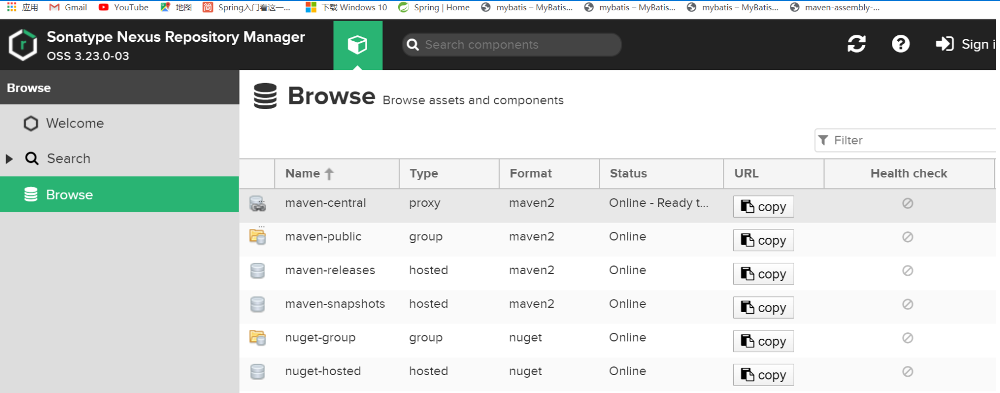

一般来说，[Nexus](https://www.sonatype.com/products/sonatype-nexus-oss-download) 的仓库分为这么几类：

- hosted 宿主仓库：主要用于部署无法从公共仓库获取的构件（如 oracle 的 JDBC 驱动）以及自己或第三方的项目构件；
- proxy 代理仓库：代理公共的远程仓库；
- group 仓库组：Nexus 通过仓库组的概念统一管理多个仓库，这样我们在项目中直接请求仓库组即可请求到仓库组管理的多个仓库。

> 以下为了解，对私服进行权限认证（了解）

大部分公共的远程仓库无须认证就可以直接访问，但我们在平时的开发中往往会架设自己的 Maven 远程仓库，出于安全方面的考虑，我们需要提供认证信息才能访问这样的远程仓库。

配置认证信息和配置远程仓库不同，远程仓库可以直接在 `pom.xml` 中配置，但是认证信息必须配置在 `settings.xml` 文件中。

这是因为 pom 往往是被提交到代码仓库中供所有成员访问的，而 `settings.xml` 一般只存在于本机。因此，在 `settings.xml` 中配置认证信息更为安全。

```xml
<server>
    <id>releases</id>
    <username>admin</username>
    <password>admin</password>
</server>
<server>
    <id>snapshots</id>
    <username>admin</username>
    <password>admin</password>
</server>
```

pom 文件

```xml
<repositories>
    <repository>
        <!--仓库 id，repositories 可以配置多个仓库，保证 id 不重复-->
        <id>nexus</id>
        <!--仓库地址，即 nexus 仓库组的地址-->
        <url>http://192.168.120.201:8081/repository/maven-central/</url>
        <!--是否下载 releases 构件-->
        <releases>
            <enabled>true</enabled>
        </releases>
        <!--是否下载 snapshots 构件-->
        <snapshots>
            <enabled>true</enabled>
        </snapshots>
    </repository>
</repositories>
<pluginRepositories>
    <!-- 插件仓库，maven 的运行依赖插件，也需要从私服下载插件 -->
    <pluginRepository>
        <!-- 插件仓库的 id 不允许重复，如果重复后边配置会覆盖前边 -->
        <id>public</id>
        <name>Public Repositories</name>
        <url>http://192.168.120.201:8081/repository/maven-public/</url>
    </pluginRepository>
</pluginRepositories>


<distributionManagement>
    <repository>
        <id>releases</id>
        <url>http://192.168.120.201:8081/repository/maven-releases/</url>
    </repository>
    <snapshotRepository>
        <id>snapshots</id>
        <url>http://192.168.120.201:8081/repository/maven-snapshots/</url>
    </snapshotRepository>
</distributionManagement>
```

激活一个环境的方式

```bash
mvn clean package -Ptest
```

## 六、Maven 插件

### 1、Maven 插件介绍

Maven 实际上是一个依赖插件执行的框架，每个任务实际上是由插件完成。Maven 插件通常被用来：

- 打包 jar 文件
- 创建 war 文件
- 编译代码文件
- 代码单元测试
- 创建工程文档
- 创建工程报告

插件通常提供了一个目标的集合，并且可以使用下面的语法执行：

```bash
mvn [plugin-name]:[goal-name]
```

例如，一个 Java 工程可以使用 maven-compiler-plugin 的 compile-goal 编译，使用以下命令：

```bash
mvn compiler:compile
```

### 2、maven-compiler-plugin

设置 maven 编译的 jdk 版本，maven3 默认用 jdk1.5，maven2 默认用 jdk1.3

```xml
<plugin>
    <groupId>org.apache.maven.plugins</groupId>
    <artifactId>maven-compiler-plugin</artifactId>
    <version>3.1</version>
    <configuration>
        <source>1.8</source> <!-- 源代码使用的JDK版本 -->
        <target>1.8</target> <!-- 需要生成的目标class文件的编译版本 -->
        <encoding>UTF-8</encoding><!-- 字符集编码 -->
    </configuration>
</plugin>
```

### 3、tomcat 插件

web 目录结构

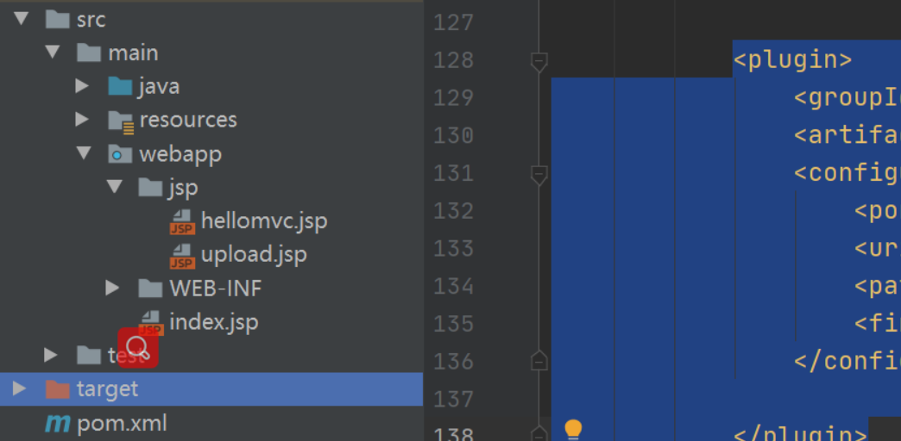

添加插件在 build 中

```xml
<plugin>
    <groupId>org.apache.tomcat.maven</groupId>
    <artifactId>tomcat7-maven-plugin</artifactId>
    <version>2.2</version>
    <configuration>
        <port>8080</port>
        <uriEncoding>UTF-8</uriEncoding>
        <path>/xinzhi</path>
        <finalName>xinzhi</finalName>
    </configuration>
</plugin>
```

点击 idea 右侧的 maven 我们可以方便的看到我们使用了什么插件，并可以点击执行相应的命令

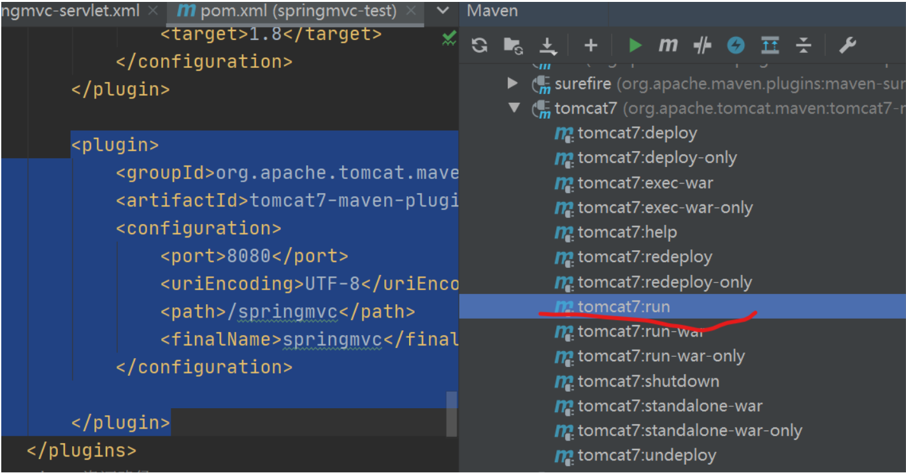

通过插件和命令我们都可以启动项目了，都不用部署到 tomcat 里了。

### 4、war 包打插件

```xml
<plugin>
    <groupId>org.apache.maven.plugins</groupId>
    <artifactId>maven-war-plugin</artifactId>
    <configuration>
        <warName>test</warName>
        <webResources>
            <resource>
                <directory>src/main/webapp/WEB-INF</directory>
                <filtering>true</filtering>
                <targetPath>WEB-INF</targetPath>
                <includes>
                    <include>web.xml</include>
                </includes>
            </resource>
        </webResources>
    </configuration>
</plugin>
```

> 执行命令 mvn clean package

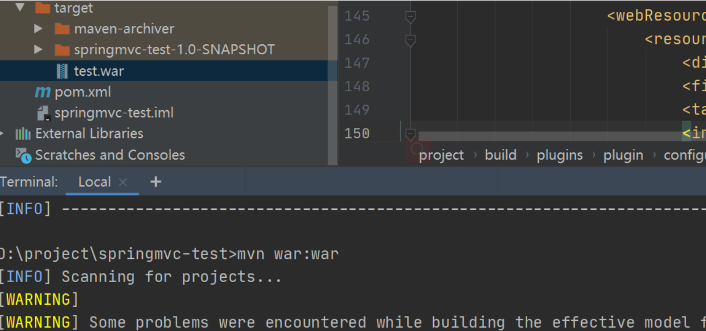

### 5、jar 包的插件

- **maven-jar-plugin**，默认的打包插件，用来打普通的 project JAR 包；
- **maven-shade-plugin**，用来打可执行 JAR 包，也就是所谓的 fat JAR 包；
- **maven-assembly-plugin**，支持自定义的打包结构，也可以定制依赖项等。

我们日常使用的以**maven-assembly-plugin**为最多，因为大数据项目中往往有很多 shell 脚本、SQL 脚本、\.properties 及 \.xml 配置项等，采用 assembly 插件可以让输出的结构清晰而标准化。

自己网上查资料深入学习

```xml
<plugin>
    <groupId>org.apache.maven.plugins</groupId>
    <artifactId>maven-assembly-plugin</artifactId>
    <version>3.3.0</version>
    <executions>
        <execution>
            <id>make-assembly</id>
            <!-- 绑定到package生命周期 -->
            <phase>package</phase>
            <goals>
                <!-- 只运行一次 -->
                <goal>single</goal>
            </goals>
        </execution>
    </executions>
    <configuration>
        <archive>
            <manifest>
                <addClasspath>true</addClasspath>
                <mainClass>com.xinzi.Test</mainClass> <!-- 你的主类名 -->
            </manifest>
        </archive>

        <descriptorRefs>
            <descriptorRef>jar-with-dependencies</descriptorRef>
        </descriptorRefs>
    </configuration>
</plugin>
```

查件太多了，基本上所有的功能都是通过查件附加的！

## 七、Maven 项目模板（没啥用，了解）

Archetype 是一个 Maven 插件，其任务是按照其模板来创建一个项目结构。

执行如下命令即可创建 Maven 项目模板。

```bash
mvn archetype:generate
```

常用的 archetype 有以下 2 种：

> maven-archetype-quickstart 默认的 Archetype

- 基本内容包括：
- 一个包含 junit 依赖声明的 pom.xml
- src/main/java 主代码目录及一个名为 App 的类
- src/test/java 测试代码目录及一个名为 AppTest 的测试用例

```bash
mvn archetype:generate -DgroupId=com.xinzhi -DartifactId=test -DarchetypeArtifactId=maven-archetype-webapp
```

> maven-archetype-webapp

一个最简单的 Maven war 项目模板，当需要快速创建一个 Web 应用的时候可以使用它。生成的项目内容包括：

- 一个 packaging 为 war 且带有 junit 依赖声明的 pom.xml
- `src/main/webapp/`目录
- `src/main/webapp/index.jsp` 文件
- `src/main/webapp/WEB-INF/web.xml` 文件

其实这个模板并不全。

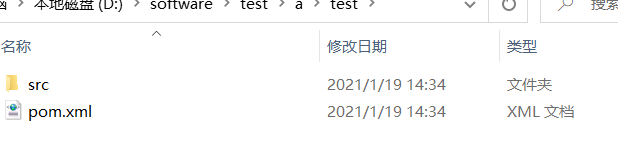

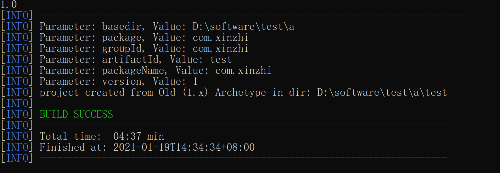

八、聚合工程

\<dependencyManagement>

TODO
