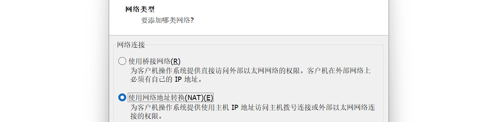
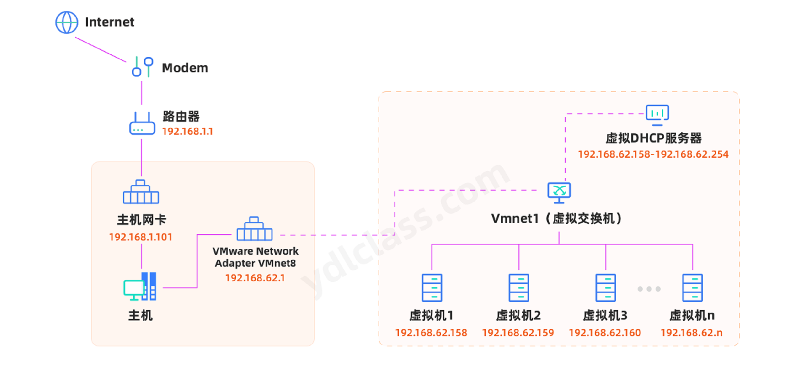
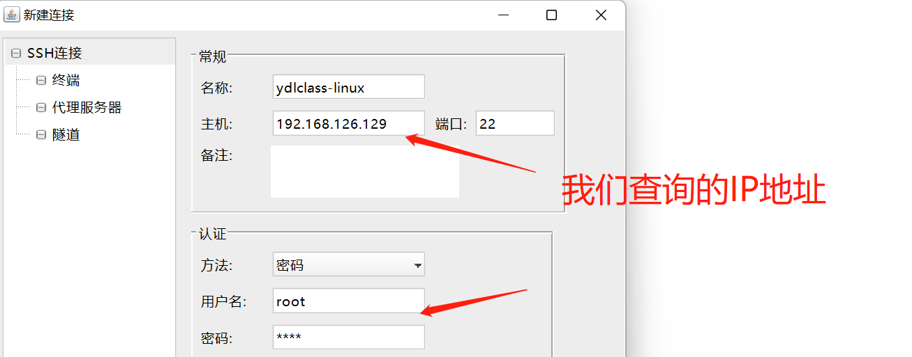
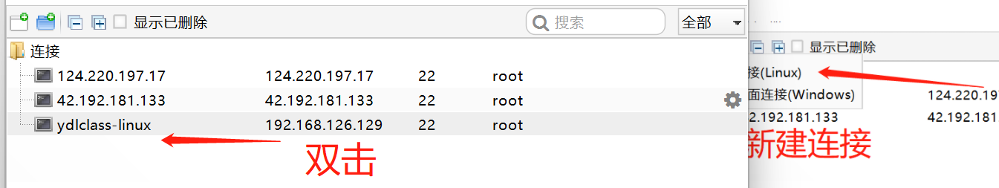
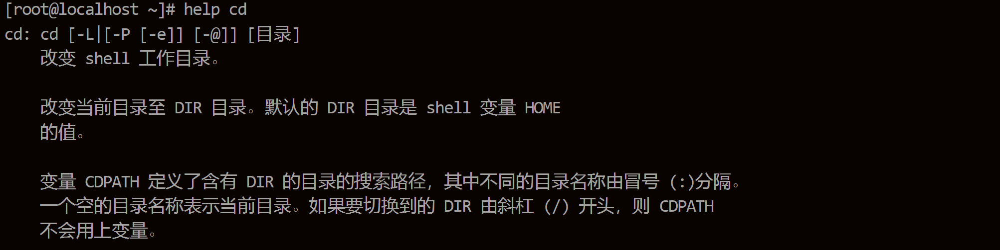
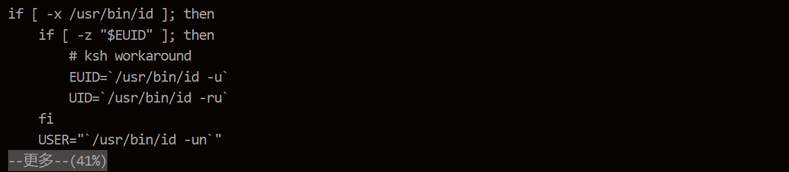
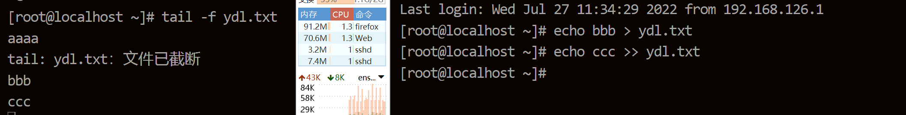

---
# 当前页面内容标题
title: Linux入门
# 当前页面图标
icon: linux
# 分类
category:
  - OS
  - Linux
# 标签
tag:
  - OS
  - Linux
  - 入门
sticky: false
# 是否收藏在博客主题的文章列表中，当填入数字时，数字越大，排名越靠前。
star: false
# 是否将该文章添加至文章列表中
article: false
# 是否将该文章添加至时间线中
timeline: false
---

## 第一章 linux 操作系统

### 一、简介

#### 1、从 unix 到 linux

在 unix 操作系统的发展史上有三个牛逼的人，需要我们一一介绍：


1969，【汤姆森】在老婆休假去往加州看望公婆的三个星期中，完成了用来创建代码的【编辑器】，将代码转化为机器语言的【编译器】，还有内核的外层程序，用来测试他的磁盘调度算法，unix 操作系统的雏形由此诞生。年末，第一版有明确 unix 特征的系统已经可以运行， unix 正式诞生。

1975 年，汤普森带着 unix 第六版在加州大学伯克利分校教授【操作系统】课程，有个叫【比尔·乔伊】的研究生，对这个系统很入迷， 他修改了 unix 的本地版本，并添加了一些自己的程序， 包括 VI 编辑器和 ssh， 以及至今仍在使用的 tcp/ip 网络接口， 后来他修改的这一版本，演化成了 unix 最重要的分支 BSD(Berkeley Software Distribution，伯克利软件套件，是*Unix*的衍生系统)。当时 unix 向高校提供免费的使用版权， 但对商业机构需要收取两万美元的授权费， 没成想向高校授权成了一把双刃剑。一方面加速了 unix 的普及， 一方面却让 unix 的版权保护受到了威胁。

受到 BSD 的启发，民间高手纷纷尝试着推出自己的“类 unix 系统”，甚至重写 unix 内核。1991 年，芬兰一位 21 岁的大学生【林纳斯】，因不满 unix 的限制性许可，同样决定自己动手开发一个“类 unix 系统”，在一个暑假没日没夜的开发中，最终开发出了 linux，如同当初，汤普森和里奇没有想到 unix 的成功一样，林纳斯也没有想到，自己做着玩的东西，竟然能以商品化操作系统的形态，运行在今天，全球数十亿台设备上。同样因为 linux 的开源和包容性，全世界的工程师纷纷做出自己的贡献，linux 的代码也从当年的几千行，发展到了今天的 2,000 多万行。庞然大物一旦形成，必将影响整个世界。

#### 2、linux 发行版

【李纳斯（Linus ）】开发的 Linux 只是一个内核。内核指的是一个提供设备驱动、文件系统、进程管理、网络通信等功能的系统软件，内核并不是一套完整的操作系统，它只是操作系统的核心。

一些组织或厂商将 Linux 内核与各种软件和文档包装起来，并提供系统【安装界面】和【系统配置】、设定与管理工具，就构成了 Linux 的发行版本。

在 Linux 内核的发展过程中，各种 Linux 发行版本起了巨大的作用，正是它们推动了 Linux 的应用遍地开花，从而让更多的人开始关注 Linux。

常见的发行版有，而我们最常见的是 ubuntu 和 centos：


（1）ubuntu 是基于 Debian（创建自由操作系统的合作组织）发展起来的，但目前 ubuntu 用户更多、影响也更大。在商业化上，像 Debian 也是免费用，ubuntu 却不一定可以，部分商用是要付费给 ubuntu 才行，商用的话请不要随便用，开源并不绝对等于免费。linux 发行版之中官方软件匹配 ubuntu 也是最多的 。

（2）但若问用户最多的是那个 linux 发行版，最有实力资本的发行版就没有争议了——Red Hat 。

- 【Red Hat】 原本为企业版和个人版，后来个人版改为 Fedora 了。
- 【Fedora Linux】（第七版以前为 Fedora Core）是由 Fedora 项目社区开发、红帽赞助，软件很新，缺点是不够稳定，但背后毕竟是财大气粗的 Red Hat，实力摆在这里不容置疑。

（3）Linux 发行版中大多数软件包，都是基于 GPL 协议发布的，也就是我们常说的开源软件，正因为是这样，Red Hat 公司也必须遵循这个协议，将构成 Red Hat Enterprise Linux (以下称之为 RHEL) 的软件包的源码公开发布，只要是遵循 GPL 协议，任何人都可以在原有的软件构成的基础上再开发和发布。所以一个名为 Community Enterprise Operating System 的项目诞生了。他的缩写既是【CentOS】。CentOS 社区将 RedHat 的网站上获得的所有源代码下载下来，进行重新编译。重新编译后，还修正了一些 BUG，由于 RHEL 是商业产品，必须将所有 RedHat 的 Logo 和标识改成自己的 CentOS 标识。可以说 CentOS 就是 RedHat 的免费版本。使用 CentOS，可以获得和 RHEL 相同的性能和感受。

CentOS 主要分为两个主要版本，CentOS Linux 和 CentOS Stream 版：

- Linux 版每两年发行一次，每个版本的系统会提供 10 年的安全维护支持。
- Stream 版为滚动更新版，意味着没有固定版本号，是动态更新具体的内容。

不过可惜 CentOS 停止维护了。CentOS 8 Linux 已于 2021 年底停止使用且不受社区支持。取而代之的是滚动版本，不过 CentOS 停服对很多用户没有太大影响，用户可以在 CentOS Stream 上实现无感知切换。CentOS Stream，作为 RHEL 的下游分支，将持续排查漏洞，让上游版本更加稳定和安全。然而 CentOS 7 Linux 也即将到达生命周期尽头...，也就是说以后 CentOS 不再出现 CentOS 9、CentOS 10 了。

**小知识：**

Red Hat 参与了许多开源项目和社区，并为他们提供赞助。CentOS Linux 属于其中被赞助的开源项目之一，Red Hat 不但为它提供了资金支持，同时也是积极的为其做出贡献。不过 Red Hat 并没有插手 CentOS Linux 的管理，所以 CentOS Linux 一直都保持着它的独立性。Red Hat 似乎更看好 CentOS Stream 的前景，因为它满足了 Red Hat 非常具体的需求，所以出现了如今的结果——投资 CentOS Stream，放弃 CentOS Linux。

**结论：**

我们把 Red Hat、Ubuntu 等直接说成 Linux 其实是不确切的，它们是 Linux 的发行版本，更确切地说，应该叫作”以 Linux 为核心的操作系统软件包”。

如果我们需要一个桌面系统，如同 window 一样，我们可以选取 ubuntu，如果我们需要一款比较稳定的服务器系统，那么 centos 就是一个很好的选择。

**Linux 的主要特点**

- **免费**：Linux 是一款免费的操作系统，用户可以通过网络或其他途径免费获得，并可以任意修改其源代码。
- **安全性**：Linux 采取了许多安全技术措施，其中有对读、写进行权限控制、审计跟踪、核心授权等技术，这些都为安全提供了保障。
- **多用户**：操作系统资源可以被不同用户使用，每个用户对自己的资源有特定的权限，互不影响。
- **多任务**：计算机同时执行多个程序，而同时各个程序的运行互相独立。
- **独立性**：Linux 是具有设备独立性的操作系统，内核具有高度适应能力。
- **可移植性**：Linux 是一种可移植的操作系统，能够在从微型计算机到大型计算机的任何环境中和任何平台上运行。

### 二、安装 vmware

下载 VMware17（个人使用免费）

选一个目录安装即可，无限下一步即可：

我们可以使用以下秘钥进行破解，如秘钥失效，自行百度寻找最新秘钥：

```text
JU090-6039P-08409-8J0QH-2YR7F
ZF3R0-FHED2-M80TY-8QYGC-NPKYF
```

### 三、安装 linux

下载 linux 发行版的地方很多，这里我们推荐几个权威的镜像站点：

- 阿里云镜像官网：<https://developer.aliyun.com/mirror/>
- 清华大学开源软件镜像站：<https://mirrors.tuna.tsinghua.edu.cn/>

#### 1、安装 ubuntu

第一步：下载 ubuntu： ubuntu-releases-->22.04-->ubuntu-22.04-desktop-amd64.iso


第二步，点击创建新的虚拟机：


第三步，选择自定义安装：


第四步，我们可以选择稍后安装操作系统：


第五步，选择我们要安装的系统：


第六步，选择我们要安装的位置：


第七步、配置虚拟机的处理器：


第八步、配置虚拟机的内存：


第九步：配置虚拟机的网络类型，后续会详细讲解：



第十步：配置虚拟机的磁盘配置，一路使用推荐配置即可：


第十一步：挂载系统：


第十二步：启动系统：


出现如下界面：


选择【安装 ubuntu】，一路下一步就行了，安装过程如下：


安装成功：


#### 2、安装 centos

前边的内容都是一样的，仅仅需要在选择操作系统的时候选择正确的选项：


选择安装 centos：


使用简体中文：


设置 root 密码，不要锁定 root 用户，而且要允许 root 用户进行远程登陆：


启用网卡，使其可以联网：


选择最小安装即可：


安装结束：


输入用户名和密码进入系统，眼前一片漆黑：

![image-20220726171954488](data:image/png;base64,iVBORw0KGgoAAAANSUhEUgAAAvMAAACcCAYAAADyOCRxAAAI+ElEQVR4nO3d7ZKjKBgG0MxWX2NfZG5y9pdbrsWXgMqbnPOrJ7ZAMFN5pAH/vF6vvy8AACCcf55uAAAA0EeYBwCAoIR5AAAISpgHAICghHkAAAhKmAcAgKCEeQAACEqYBwCAoIR5AAAISpgHAICghHkAAAhKmAcAgKCEeQAACEqYBwCAoIR5AAAISpgHAICghHkAAAhKmAcAgKCEeQAACEqYBwCAoIR5AAAISpgHAICghHkAAAhKmAcAgKCEeQAACEqYBwCAoIR5AAAISpgHAICghHkAAAhKmAcAgKCEeQAACEqYBwCAoIR5AAAISpgHAICghHkAAAhKmAcAgKCEeQAACEqYBwCAoIR5AAAISpgHAICghHkAAAhKmAcAgKB+nm7Ayt7v9//+/fv7e0kdqXKPdR/rrx1vqbfl/Fz7VjfaPwAAEfx5vV5/n27EirYwuAXA47+vqKP0+v612vGeekfLXMknvRcAgBLTbBJSwU8IBABgNabZnNA6zSU1ip46fiyr9YZhK3c/BebMzUbt/Fr7au8vVUbteO7YlX8ZAQCIzjSbhFpwbJnG0TJNp3eazfG1UltLaueX+uF47sg0oFxf5ZyZStRzLgBAFEbmB9RC59X24bdnoero+fsyUkr909J3uZuEnnY9fa0AAK4gzA9YZZQ3NW3mzvO3Mlpee73Oj8QDAJBmAewJq4TOLXg/dT4AAGsQ5hNSI8a18PvpATvy+7N4FgD4VBbAFrTuuFI6XtuNZdZuMKmyS848NOp4vOVhWmfaX1pAW1tYm3PHA78AAJ4mzAMAQFCm2QAAQFDCPAAABCXMAwBAUMI8AAAEJcwDAEBQngCbUNqOcaUtDnPbWp457+js+2vpl56+G916s1b31Vt/nmlbquyr628pv/fzdfb8Ff9vPc31AaCVMJ+w39N8ZaPtHP1ybqm7p32p8LA9dGrGTUut/Fn11+Su39X1t5Q/GuBaz4/w/+xurg8AZwjzdLkqyM8y868P30ZQXJvrA8CeMN8gN1J2lBo1q03Z6X0C7NNyT4Pd5N5jj57za+27uv4nr9+ZqUVPGf18jPz/6yk/93TnnvK/4foAcB9PgM1o/TLPvXb8ks8dLwWQWp2l18+8t307zzrTFz1hp3Qdett3PHYse7T+Gddv9Bq1ft5SZc+qu1b+jM9H7rXROkbrO1vmJ10fAO5lZH5Ay4jVyBfgVSNiuWA7e074sf29c95ToXrGDUltTvoVo8c9bespa2tz7S9D+/KP7390zn5r/+7/vUpgvHo02vUBYBZhvmL/pXv8Iuv94rzynBXM+OtBrqza67ON1PP09cv9ledpMz8fV2gZJZ/B9QFgBvvMN7j6S520p8PD0/WP2n9efXbX4/oAMIMwP8nxT+Yrl3+mrEjv64k6W8saqbM27z9V7v4cN6PrcX0AmMUC2ISWeaxnFqiVFl/2lJ9qZ66enJbyU+0qnd/TxjPlz1zkWyv/iv450zet17Z3se2s959ztv/O1tHa/tEFqts5MxfYfsP1AeA+wjwAAARlASxwSm06iNHbZ7k+AN/FyDwAAARlASwAAAQlzAMAQFDCPAAABCXMAwBAUMI8AAAEJcwDAEBQwjwAAAQlzAMAQFDCPAAABCXMAwBAUMI8AAAEJcwDAEBQwjwAAAQlzAMAQFDCPAAABCXMAwBAUMI8AAAEJcwDAEBQwjwAAAT183QDVvZ+v//7+ff3d5n672zX+/3uruOOdm51PHF97jDS/wDA5zMyX/B0iMrVf1e79mG8x9P9F91o/wMAn8/IPKGN3jB8+sg+APDZhPlOqVHT3FSYluMjYTIVSEfadzx2ReA9077f39/qe0y9vj/v+DsjWspfvf8BgM/w5/V6/X26ESsrhchagKydM3KsFHZntW9GiJzRfyP901JGjyj9DwB8NiPzNymF8Znltp7zfr//t7hSYOyj3wCAJ1kA+4D9iOtTYXA/Ym2h5bgnryUA8L2E+S+2D6DfGujdzAAAkQnzN1kpNB7b0hLoV2r/N9L/AECKBbAFpR1nZu5m07Jby/5YKYiXgvmZ9uXaecaV/dda/hULYFt2Ilqh/wGAzyfMszy7ugAApJlmw3JMKQEAaGNkniXNfKgWAMCnEuYBACAo02wAACAoYR4AAIL6eboBK8otvvzEedu2PgQAiMvIfMI+1H76U1IFeACAuIR5imwTCQCwLtNsOtW2Thx5AmjuIUn711vPL02jEdIBAGKzNWVGLYynfrcUxlMB+8zxVJty5x9/N1VmS30AAKzNyHxFLcDnztmmp2znH+fhl47PlCpXeAcA+AzmzHfYh+FcIN6PgNemxJRuDGbNWS+1FQCAmIT5C9V2womwU44FsAAA6xLmL3AMwMfAXju+Lyf1MwAAvF4WwCbVdqo5/k5pgWmunNbjuUW1LbvZjLQfAID1CfMAABCUaTYAABCUMA8AAEEJ8wAAEJQwDwAAQQnzAAAQ1M/TDVhZyxaPd7ShtrXk5vh7qb3s75Sr/8525fqv5bxNbuvOFT4fAMB3MzLfYP+k1jvlHhS1D5alp8g+HS5z9d/Vrt4HbdX2+N+UPhf7B4N5ii4AcBUj83CwD+hP3xABAJQI8x32I7UtU0nOHj8eu+LprLOeUJs61tuWSP1Xsq//+LObAwBgJtNsOuSmX+ynVWyvp6bB1I4fp2+0TudoNdq+2rGzbXmy/66QG9kX5AGA2YzMD/qWgFZaXDuz3NZztpuY7fxvuQ4AAHtG5id5apHsE3Ij4Hfaj8ZbXAoAfCth/oN8y83EZsY0nyuU5swDAMwkzAeRG4E+zhu/u/4nHNvSEujvbL858wDAXf68Xq+/TzdiVbkdW1p2chndLSb1e2fPL7Vz5m42Zx+qVAripWA+s/9maOnfXN8AAMwgzAMAQFCm2QAAQFDCPAAABCXMAwBAUMI8AAAEJcwDAEBQwjwAAAQlzAMAQFDCPAAABCXMAwBAUMI8AAAEJcwDAEBQwjwAAAQlzAMAQFDCPAAABCXMAwBAUMI8AAAEJcwDAEBQwjwAAAQlzAMAQFDCPAAABCXMAwBAUMI8AAAE9S/ObRtSJhQLLwAAAABJRU5ErkJggg==)

如果你发生以下错误，centos8-strem 可能有：


在设置中，将【与虚拟机共享蓝牙设别勾掉】，重启：


![1658327918778](data:image/png;base64,iVBORw0KGgoAAAANSUhEUgAABKAAAACwCAYAAAA4wBY0AAAM/klEQVR4nO3d666sqBYGUFdnPaMP6Uvu88tutwcEhFleaoykk71KuYhVnfgF8Geapj8TAAAAAAT55+oOAAAAAPBuAigAAAAAQgmgAAAAAAglgAIAAAAglAAKAAAAgFACKAAAAABCCaAAAAAACCWAAgAAACCUAAoAAACAUAIoAAAAAEIJoAAAAAAIJYACAAAAIJQACgAAAIBQAigAAAAAQgmgAAAAAAglgAIAAAAglAAKAAAAgFACKAAAAABCCaAAAAAACCWAAgAAACCUAAoAAACAUAIoAAAAAEIJoAAAAAAIJYACAAAAIJQACgAAAIBQAigAAAAAQgmgAAAAAAglgAIAAAAglAAKAAAAgFACKAAAAABCCaAAAAAACCWAAgAAACCUAAoAAACAUAIoAAAAAEIJoAAAAAAIJYACAAAAIJQACgAAAIBQAigAAAAAQgmgAAAAAAglgAIAAAAglAAKAAAAgFACKAAAAABC/V7dAZ5pWZa//p7nOaSNVL37tvftl47XtFtTPte/u+sdHwAAAGj1M03Tn6s7wbOsAcYaWuz/jmjj6PPtZ6XjZ9rtrfNO3nQtAAAAPIcleDRJhRWCCwAAAOCIJXgMUbsELjVbKXV8X1dtyLXWu10e1xKQlcqX+le6vlQdpeO5Y5Ez0AAAAGAkS/BoUgo7apZ41SzhO7sEb//ZUV+PlMofjcO+bM8SwdxY5bQsM2wtBwAAAGeZAUWIUlASbRvYnNksvLf8to6Uo/GpGbtcsFWSC8CeuqE6AAAAzyCAIsRdwozUkrpPll/rqPlsmtpnPAEAAMAT2IScIe4SlKxh0VXlAQAAgP8ngKJJamZOKbB5eyj09usDAACAXjYh55TaN7UdHS+9xW3UW+RSdR+pLV/zFr9SudR5tZuYlzY3z7EJOQAAAJ8mgAIAAAAglCV4AAAAAIQSQAEAAAAQSgAFAAAAQCgBFAAAAAChBFAAAAAAhPq9ugM8y7Is//57nue/Plv/voNUP3vqOVNHruy2b6uW+qPLt9Qfde+P7l/v9be0XdOHnu9Gqfwdf1tXc38AAOCZBFA0mec5+QB4NyP62VM+Vzb1wLosy7QsS9VDbHT5lvojvwe5+9d7/SU19feGDrXln/A7+zT3BwAAnksABQkR4dMdjJqpcedrjCTcuDf3BwAA7ksARZfcjIS91OyE0nK+3DKYTy3BOjuLan8tka54EO4dn+j7V9P2J2dztYoc35rfV2v9qd/m2fq/4f4AAMC3+pmm6c/VneBZah9Ac5/tH0xzx48emkttHn1ec20jlvNE7AF19PA7OkRI9bF3fEbcv1F7YJW+b6n6j8ampe1S/ZHjG/0dH30Nb7o/AADwzcyAIkTNzIARm4NH2df/yT2GWutJ9TVlW/9R+zWBT+/4nL1/I8ZvHbPSDLyj+nvvX6l81PdvhOjfnvsDAADvJIDitO2D4v7h6+zDXmSZM/XeeYZDrk+RfR01PlePZ2423dXu/v2rmY00gvsDAADv88/VHeDZPrnfEf/xwNtn+3313b0f9wcAAN5HAEW4/XKap9V/VbsR9bfW2bs/UE1bUeOYq3d7TQLU+3F/AADgnWxCTpOafVlaNglOBRs9mxCn+plrp6RUR8sm2dvzajfRjt6EO1e+duxGjk/L/esZv5oNz1vHJ9d+Tmv/W9uo7X/vJuFrmZGbnH/D/QEAgG8lgAIAAAAglE3IAQYpLRUzS+Za7g8AAFzHDCgAAAAAQtmEHAAAAIBQAigAAAAAQgmgAAAAAAglgAIAAAAglAAKAAAAgFACKAAAAABCCaAAAAAACCWAAgAAACCUAAoAAACAUAIoAAAAAEIJoAAAAAAIJYACAAAAIJQACgAAAIBQAigAAAAAQgmgAAAAAAglgAIAAAAglAAKAAAAgFACKAAAAABCCaAAAAAACPV7dQd4r2VZ/v33PM/Vx3rrvoNP9G9t447XP8KyLK+9NgAAgG9jBhRhjsKD3mDh7sHE3ft3d9sADwAAgOczAwoeqjfkevsMKgAAAO5DAEWTVGhx9FlPG1stIcm+/NHyv9Q5ve2XtLQ/z3NxfHP3ImIZYE39PeO7PyYkAwAAeIefaZr+XN0JnqMmgEqFFKkAoTXMygVJR+HEUd9S57S0X3Lm+mr6W+pXSx1nHAVko8ZX8AQAAPAuZkAxVERwcDb4ydW1LMtfG1xv6y8d5z/GBQAAgFo2IedVtgFYLiDZzgwqLQezGXbZ0VgDAADANAmg+FLb0CQXQh0dfwMBGwAAAJ8igOL2RgYl+7r2IVPpOJ8nKAMAAHg+m5DTLBcGpMKamre4lY7tj7eUP9rYu6f9kp7rG3X9EZuQl94wmDon17+WeizxAwAAeDYBFN28sSyOsQUAAOANLMGji4BkLMvNAAAAeCMzoGgyYnkax2qWuQEAAMCTCKAAAAAACGUJHgAAAAChBFAAAAAAhPq9ugM8S26D7DfuU7S91jdeHwAAAHyKGVA02QYx8zz/+/cb39wmdAIAAIAxBFBw0rIsrwzeAAAAYDRL8BhuH8rsZxKlQpvtOUfH12O5Oud5ri5/tMROsAQAAADj/EzT9OfqTvAspQApde5RgJQKhVqOp/qUK78/N1VnTXsAAABAPTOgOK0UOuXKrEvX1vL7faWOjo+UqlfgBAAAAOPZA4qhtgFOLsTZzjQqLZc7CrNG7cF01FcAAACgnwCKS5TeoPeEN+zZhBwAAADqCKD4qH1osw+ZSse39aT+DQAAANyPTchpUnrD3f6co02+c/XUHs9tbF7zFrye/gMAAABtBFAAAAAAhLIEDwAAAIBQAigAAAAAQgmgAAAAAAglgAIAAAAglAAKAAAAgFC/V3eAZ1mW5a+/53kObets/dt+RvVxbSNyDGrbPNOX3jHq+S70tL1vd19H6fjV9afayt3PnrqP6i8du4PS77/n/w9r+Wm67/UDAMDbmAFFk+3DWnT41MNDZVnvGPV8F0YENut/289Lx6+uP9VWqQ9nHfWp9/cVrdS/3v7f/foBAOCNzICCk3oDHDMw2j1prGpmH7WUGVF/6dg3+PbrBwCAqwigGK60NOtoCdP+WERI07LEap7nZB9yS6S2535iGWBKzRKxqIfw/VhFh2yl+u84Uyb3HflU/T2ztnLlUvf7zPe/9PuvPZ77TR7VBQAAxBJAMdz+4W+7V0vuAXE9Jzq4KLVfG6AcPdynrjm1X01EKFO6vv05T34IvyJ82t7f/eepc3N1lu59dP1n1fx+a7//KTW/u6PjAADAfQmgGO7owT/1gOoh8pzoJV53Vhs+nQ3ZcuVrAr6W+rd/5/bUiqgfAADg0wRQDFVaMrMe284i8WA83pve/He2DyM3WR9lxNsLr6wfAADgLG/BY4jWWSa9bxB7g9RSrpayqX+/3ZPCp577e4f6AQAARhJA0a3lIXj/0FwTQnnQ/s9+mVZu2dbW28fv7df37Ur31/0HAIBn+Jmm6c/VneA5Svs77c852tg7VTbXVuuMlKNNnFvegpdrv6b+qA2TS/W3XF/uLX817afqrq2/ZpPtmrZTddR+v1raaP1+nGlnVP/P1N/SRu349H7/S7//3PHS9fVePwAAcI4ACg7YQweezW8YAADuwRI82LCcB95D+AQAAPdhBhTsnF0eBlxr1PJFAABgPAEUAAAAAKEswQMAAAAglAAKAAAAgFC/V3eAZ7rDPknLshRfz77qfY39vnzpFfE9dV9t37fURs53uP8AAAA8hxlQdJnn+bLw6ejztV9r38682e7ounqv+a6BzT5syr1F7Oi+b98k6K2CAAAATJMZUMDGNlS6a0gGAADA8wigGGo7Yya3zKy0RO7o+P5YboZOTf9qPjujdwlgaXlbz/hF27a9/7dACwAA4HtZgsdQuaVb2yVZ6+epJXKl4/ulX7VLwVq0hlq5smeXAB6V7R2/aLkZVMInAACA72YGFGGeGDr0hE85rXUdhUXrzLLtjKJ90HN0HAAAAK5gBhThrtqo/IlyM722trOaSssVbQAOAADAHQig+ApvC8BKy+uuWH63byv3bwAAAL6PAIrHO5oJdIfZVyNnIu3rSu0BdXQ8mj2gAAAASPmZpunP1Z3geXJvaiu9wS11zv682re4jXzL3vacfb01b8lr7X9t+VT7d3gLXk3/c2MHAADA9xFA8fWEJAAAABDLEjy+mvAJAAAA4v1e3QH4pE8sTwMAAAD+ZgkeAAAAAKEswQMAAAAglAAKAAAAgFACKAAAAABCCaAAAAAACCWAAgAAACCUAAoAAACAUAIoAAAAAEIJoAAAAAAIJYACAAAAIJQACgAAAIBQAigAAAAAQgmgAAAAAAglgAIAAAAglAAKAAAAgFACKAAAAABCCaAAAAAACCWAAgAAACCUAAoAAACAUAIoAAAAAEIJoAAAAAAIJYACAAAAIJQACgAAAIBQAigAAAAAQv0PP0+fWt5alSQAAAAASUVORK5CYII=)

centos 的桌面版长这个样子：


如果在使用虚拟机是发现如下的问题：


解决方法：

<https://jingyan.baidu.com/article/fc07f98976710e12ffe519de.html>

找到此选项，改成 enable，如果还不行，说明你的电脑就不能使用虚拟机：


### 四、linux 目录结构

#### 1、基本介绍

linux 的文件系统是采用级层式的【树状目录结构】，在此结构中最上层是根目录，使用“/”表示，然后在此目录下可以创建其它的目录，其结构如下：


Linux 中所有内容都是以文件的形式保存和管理，即：一切皆文件。普通文件是文件；目录(在 win 下称为文件夹)是文件；硬件设备(键盘、硬盘、打印机，网卡)是文件；套接字(socket)、网络通信等资源也都是文件。

#### 2、目录结构具体介绍

我们可以通过 cd 命令进入根目录，使用 ll 命令列出当前目录下的所有文件，如下：


- /
- root，存放 root 用户的相关文件
- home，存放普通用户的相关文件
- bin，存放常用命令的目录，如 vi，su
- sbin，要具有一定权限才可以使用命令
- mnt，默认挂载光驱和软驱的目录
- etc，存放配置的相关文件
- var，存放经常变化的文件，如网络连接的 sock 文件 、日志
- boot，存放引导系统启动的相关文件
- usr，安装一个软件的默认目录，相当于 windows 下的 program files
- proc，这个目录是一个虚拟的目录，它是系统内存的映射，访问这个目录来获取系统信息
- srv ，service 缩写。该目录存放一些服务启动之后需要提取的数据
- sys，这是 linux2.6 内核的一个很大的变化，该目录下安装了 2.6 内核中新出现的一个文件系统
- tmp，这个目录是用来存放一些临时文件的
- del，类似于 windows 的设备管理器，把所有的硬件用文件的形式存储
- media，系统提供该目录是为了让用户临时挂载别的文件系统的，我们可以将外部的存储挂载在/mnt/上，然后进入该目录就可以查看里面的内容了。
- opt，这是给主机额外安装软件所摆放，如安装 oracle 数据库就可放到该目录下默认为空。

小知识：

- linux 的目录中有且只有一个根目录/,
- linux 的各个目录存放的内容是规划好的，不用乱放文件，
- linux 是以文件的形式管理我们的设备，因此 linux 系统。**一切皆文件**。
- linux 的各个文件目录下存放什么内容，大家必须有一个认识，
- 你的脑海里应该有一颗 linux 的目录树。

### 五、虚拟机网络配置

使用了虚拟机之后，我们在同一台电脑中，在【编辑->虚拟网络编辑器】中，我们可以看到 vmvare 给我们提供了 3 中网络连接模式：


#### 1、Bridged（桥接模式）

什么是桥接模式？桥接模式就是将【主机网卡】与【虚拟机虚拟的网卡】利用虚拟网桥进行通信。在桥接的作用下，类似于把【物理主机虚拟为一个交换机】，所有桥接设置的【虚拟机】连接到这个交换机的一个接口上，物理主机也同样插在这个交换机当中，所以所有桥接下的网卡与网卡都是交换模式的，相互可以访问而不干扰。在桥接模式下，虚拟机 ip 地址需要与主机在同一个网段，如果需要联网，则网关与 DNS 需要与主机网卡一致。其网络结构如下图所示：


#### 2、NAT（地址转换模式）

刚刚我们说到，如果你的网络 ip 资源紧缺或者不稳定，或者不想让虚拟机使用我们的真实 IP 地址，但是你又希望你的虚拟机能够联网，这时候 NAT 模式是最好的选择，这也是 vmware 默认的网络模式。NAT 模式借助【虚拟 NAT 设备】和【虚拟 DHCP 服务器】，使得虚拟机可以联网。在该模式下我们不需要做任何的配置，即可以实现虚拟机和物理机的互联互通，同时虚拟机可以上网。家用路由器采用的就是这种模式，其网络结构如下图所示：


【DHCP 服务器】是自动为计算机【分配 IP 地址和子网掩码】的服务器，DHCP 服务器维护了一个【地址池】，它只会从这个池子里分配地址，一个 MAC 对应一个地址，如果不用了就放回池子，这样就可以避免搞出重复的 IP 地址。通常我们的路由器也是采用这种模式：


【虚拟 NAT 设备】的作用主要是做网络地址转换，我们可以使用内部的局域网络，访问公共网络，转换流程如下图：


该模式下：

- 物理机会产生一张虚拟网卡（VMnet8）、这张网卡和虚拟机的网卡的 ip 地址统一有 dhcp 管理发放。
- 上网时，通过 nat 设备进行网络地址转化，从而使得所有的网卡均可上网。


#### 3、Host-Only（仅主机模式）

Host-Only 模式其实就是 NAT 模式去除了【虚拟 NAT 设备】，然后使用 VMware Network Adapter VMnet1【虚拟网卡】连接 VMnet1【虚拟交换机】来与【虚拟机】通信的，Host-Only 模式将虚拟机与外网隔开，使得虚拟机成为一个独立的系统，只与主机相互通讯。其网络结构如下图所示：



### 六、shell 简介

Linux 系统的内核负责对硬件资源的分配、调度等管理任务。因此，系统内核对计算机的正常运行至关重要，一般不建议直接去编辑内核中的参数，而是让用户通过基于系统调用接口开发出的程序或服务来管理计算机，以满足日常工作的需要。shell 就是这样一个工具，充当用户与系统内核沟通的桥梁。

shell 既是一个应用程序，也叫壳程序，提供一个界面，使用户可以通过 shell 访问操作系统内核。

事实上我们的 windows 的桌面系统就是一种【图形化 shell】，而目前我们说的 shell 通常是指【命令行 shell】，通过输入字符串命令，得到结果，比如我们的 cmd。

我们也经常说 shell 是一种脚本语言，常称为 shell script，同 python、js 等脚本语言一样，可以使用 if、while 等组合逻辑将指令进行编排实现一些复杂的功能。


终端：早期的计算机很贵，一个公司一般只有一台或几台电脑，那么使用的方式就是，员工通过【终端设备】连接到真正的计算机上进行工作。

1982 年左右的一台 ASCII 视频终端，他没有自己的处理器，与大型机相连：


现在的终端设备概念被慢慢放大，甚至出现“智能终端”，我们银行看到的取款机，影院的取票机，都可以称之为终端设备：


而我们开发过程中常见的终端【termial】，其实是终端模拟器。


#### 1、shell 版本

以下列举几种 shell 版本

- sh（Bourne Shell）（交换式的命令解释器和命令编程语言）： 是 UNIX 最初使用的 shell，而且在每种 UNIX 上都可以使用 。在 shell 编程方面做的很优秀，但是在处理与用户的交互方面做得不如其他几种 shell。
- bash（Bourne Again Shell）：Linux 默认，是 Bourne Shell 的扩展。完全兼容 Bourne Shell，并在他基础上增加了很多特性如命令补全、命令历史等。有灵活和强大的编辑接口，同时有很友好的用户界面。

这是我们最常见的两个 shell 工具。

现在，包括红帽系统在内的许多主流 Linux 系统默认使用的终端是 【Bash】（Bourne-Again SHell）解释器 。 主流 Linux 系统选择 Bash 解释器作为命令行终端主要有以下 4 项优势 ：

- 通过上下方向键来调取过往执行过的 Linux 命令；
- 命令或参数仅需输入前几位就可以用 Tab 键补全；
- 具有强大的批处理脚本；
- 具有实用的环境变量功能。

我们装好的 centos9-stream 默认也是采用的 bash 终端，可以通过在终端中输入命令：【echo $SHELL、 进行查看，得到的结果为：/bin/bash。

![1658380400777](data:image/png;base64,iVBORw0KGgoAAAANSUhEUgAAAscAAABGCAYAAAAghTl6AAAFqUlEQVR4nO3d7XKbOBgGULLTW2wu0r3I7I/IqVarTwQGzDkznXENCAHu5Kn8RvpYluVruaHH4/Hz+vPz8+fv8et4e+n457bc8elxabu19nv6flT78fulfWeUriM+T26f3j6MPN/Sfr3nTz9n79C/Wj96n0/rGmee72j7pX+zPc+h59y5Nra+vvT42fZL7WzV/6ffv79//Pz585F9/7kt3i/eljsWYNbHctNwDAAAqX+O7gAAAJyFcAwAAIFwDAAAgXAMN/Z4PKq/QAYAdyMcAwBAcOvZKtZO1bR1H9ZM1TXSfun4LafxOuLezTrD8895xX2dmQqsNaVfayqz0WnczvJcALgHI8fL9w/fo4Jx7f1nv2pzi7bUrmv2mq8eWmrPPS43eHXpwd73tfX5mv38xf3P3eN0e+t4AHgl4ZjbUFtbtncIFXIBuIpfR3fgjEpfEY+sQNXztXTufKP963lvjVeuUJbbZ6uyklp7Pfumr2dWSVt7fb3PdqtvAp6f+/h6Z+/9Ud/OAMAoI8cZpdrK3q+dW9vToND79f6ImWWdtyjrqB2799f6tevp7Xvrde/5Zq8vDqhblz08P1u5z1i6T+k6W59Po/UAXI2R44YrjnbNBOOS0bZ6fimrNDK55cjlHvdi9Nw9Sv3bq9+5kfx0ZDwNyLXa4dK1tn5BDwDORjjudMWQfJTSiHssDsDxvr3b1/Tj1d7lM5P7z8ro8QBwFcoqLuTdQkarJGCmpGKLUF17fWWt69hrdo6e885sB4AtCMcnUQokaV3pUbYMTGlbuZra2vae9uPjRs3WHJf61KrNfWX4e3XQFIwBuAqLgERKISwXiraajWDL2TDifdJ2e2Y8GO1/7/G58+85W0Xv1/89/S/du9G2S+3nttf+Y9B7/17Rv9b9ytliOwDs6dbh+J0cXV/LNfncAMB/Kat4AwIOAMA2jBxf0B4LQAAAIBwDAMAPZRUAABAIxwAAEFghL6M0vVpt3y1rfkfOf8b2AQCuyshxxtGBce/zH319AABnJRxH1qzCteXqdVYBAwA4lrKKoBRMa2UTrdXt0tW+aiF69PytVfxGpnszTzIAwDcjx0s9HK5Zrjc+Jh5ZXhPAa0tal9qO22udP15q2cg1AHB3tw/HPaOme4bHted/PB4/f3r2L5V/GC0GAPjr1uH46HKCtedPR4Zz4oBsRBgAoM9tw/FVg/GInpIOAAD+umU4fvdgnI4WC8gAAH1uGY6XpT+YxkGzNiPEaPCcOX9aMpGG33R77n0AAP7vY1mWr6M7AQAAZ3DbkWMAAEgJxwAAEAjHAAAQCMcAABAIxwAAEPw6ugNHSqc0O2Le43gqtvT91Jr+5eY77tk22/YVnOH5AwDnYuR4qS/DvKfSfMPp8tAz8xPXrmv2mq8eJmvPPZ4f2hLcAHAfwjG3IeACAC23LqsoiUduS6UDrbKH2vZ02+hy0rn9a++tMVvW0SpZmLl/a4zci9LKh6USGADgfRg5zqgtx5y+nyt7aG1Pv87v/Xp/xGjgLh27tqyjduzs/Zu5nt6+t14DAO/JyHHDFQPRTDAuGW2rFmSfI/LxSGwaQmvb1/Tjis8RAHg9I8edjvqlvSsqjZDH4tHgVgnKq0aMAQCE4wt5t5DXKpmYKanYoqyk9hoAeE/C8UnURlDPMGq95XRmaVu5muPa9p724+NGqTkGgPv6WJbl6+hOHKU0o0LP4hBbzbaw5WwY8T5puz2zWYz2v/f43Pn3nK2id1aJnv6X7h0A8J5uHY7fiQAHADBPWcUbEIwBALZhKrcL2nqBDLbVqo32rADgvITjCxKuAAD2oeYYAAACNccAABAIxwAAEAjHAAAQCMcAABAIxwAAEAjHAAAQCMcAABAIxwAAEAjHAAAQCMcAABAIxwAAEAjHAAAQCMcAABAIxwAAEAjHAAAQCMcAABD8C+a5lumTt1HdAAAAAElFTkSuQmCC)

简单的理解就是，有这个一个 bash 可执行程序，他就是个软件，给我们提供了一个黑窗口，同时可以解析我们输入的命令，来获取系统资源。

#### 2、shell 命令类型

shell 是一个程序，用于用户和操作系统进行交互，相当于是一个命令解析器。作为用户和内核交互的接口，既是一种命令语言又是一种程序设计语言。shell 命令又分为内置命令和外部命令。

- 内置命令

  【内部命令】实际上是 shell 程序的一部分，其中包含的是一些比较简单的 linux 系统命令，这些命令由 shell 程序识别并在 shell 程序内部完成运行，通常**在 linux 系统加载运行时 shell 就被加载并驻留在系统内存中**。内部命令是写在 bashy 源码里面的，其执行速度比外部命令快，因为解析内部命令 shell 不需要创建子进程。比如：cd，echo 等 。

- 外部命令

  【外部命令】是 linux 系统中的实用程序部分，因为实用程序的功能通常都比较强大，所以其包含的程序量也会很大，**在系统加载时并不随系统一起被加载到内存中，而是在需要时才将其调用内存**。通常外部命令的实体并**不包含在 shell 中，但是其命令执行过程是由 shell 程序控制的**。shell 程序管理外部命令执行的路径查找、加载存放，并控制命令的执行。外部命令是在 bash 之外额外安装的，通常放在/bin、 /usr/bin、 /sbin、 /usr/sbin 等目录下。可通过“echo $PATH”命令查看外部命令的存储路径，比如：ls、vi 等。

如何区分是内部命令还是外部命令？

- 通过 type 命令，如：type cd 可以看到是内部命令；type mkdir 可以看到是外部命令。

内部命令和外部命令最大的区别之处就是性能。内部命令由于构建在 shell 中而不必创建多余的进程，要比外部命令执行快得多。因此和执行更大的脚本道理一样，执行包含很多外部命令的脚本会损害脚本的性能。

### 七、安装 finalshell

首先我们思考几个问题：

1、服务器在机房，我们不可能在机房操作服务器，总是需要一个远程操作的工具。

2、liunx 是一个典型的多用户操作系统，他和我们使用的个人 windows 系统（单用户）不同，linux 必须可以满足多人多用户同时使用，那多个人又怎么同时使用呢？

市场上有很多功能强大的 shell 终端工具，我们可以使用这些工具，实现上边的需求：


本小节将的 finalshell 就是一款很不错的 shell 终端工具，当然，除了 finalshell 之外，还有很多，比如 xshell，SecureCRT 等。

**小概念：**

终端（英语：Computer terminal），是与计算机系统相连的一种输入输出设备，通常离计算机较远。根据功能不同，可分若干类。

#### 1、安装

下载地址：官网 <http://www.hostbuf.com/t/988.html>

下载下来，安装即可，没有什么需要注意的：


查询虚拟机的 ip 地址：


新建一个 ssh 连接：


小知识：

SSH 为 【Secure Shell】的缩写，【SSH】就是一个安全的 shell 应用程序！他一个软件包，使系统登陆和文件传输都建立在一个安全的网络上。




新建成功：



保存秘钥：


登录成功：


#### 2、绑定静态 ip

使用 nat 连接方式，dhcp 服务器会自动分配 ip 地址，通常情况这个 ip 也不会频繁变化，我们也确实可以连接成功，但是 ip 地址确实有可能会发生改变，所以，我们为了以后连接不出问题，建议直接给虚拟机绑定一个静态 ip。

当前的

```bash
cd /etc/NetworkManager/system-connections/
```

![image-20220726132912845](data:image/png;base64,iVBORw0KGgoAAAANSUhEUgAAAv4AAABlCAYAAAA1W+cQAAAPc0lEQVR4nO3dT+4kNxXAcf+SEOUfClKABQvEPdhwgixb5ABwApA4ARCJDVsWLFiA1Cw4AogF10BiBYtIwySIGZTJsJipjCnK9rPfs/2q/P1IUfo31VV+5XK5X1e7yg8hhOcBAAAAwKW9NjsAAAAAAP2R+AMAAAALIPEHAAAAFvDG7ABg636/hxBCuN1ukyM5dr/f3cYWQnt8W73H4u3klh8tO9pGr/JbtLaz3HpxjL3aSKp8y/qR7KO3c2B0+1lVqX/x2j4AXAdX/C8kl0B6cNX44g/r7b/430vLN/vlo8ufrXeyk9pfy/rJreOtvjdXaT/eUV8APOCK/0XwoTJPKWHVLu9dfo8yrdfTsvhVJd5O6ReLmmWzzWg/OEZdA+htSOIff1ge/Zxf+vmdzrDM4ipl6viktts6lKX2uHqPLxdvy3Kt3uXvj8F+e5LhNKPP6d5XqVNt1Kp8yTY150dP0v7/6N9y9VZ7fks+f2b2L7nzQ3v8AWDzEAY9xz+XLJD429GOvd7WLR2fmuXa2M4Qn3QbkjIs6qn3l45c/WrGuM/8UnQ09Kplm9Zj/CVtNfd3bfvflJJPzT6Uvigd0Zzfmr9H9i+t26ppgwDWZnbFP9V57zsei6uMR9s7+3IvvMWz5zm+VZL+q9onVvd73Y3eR1d2Leu69deCLTmN4zmKq7T/2vqRxrl/nXrvaDX1zzkGwCuzxL+2o6tNTkrbP/tyb7zH6y0+kv51jfqlUrO9OPnXbmtV1BmAK+CpPoDS7KR7dvkriZPns7ndeCIPAKzOVeIffxit+sF05sSihvf91MZXWr/3/s8uv5cecZ+xLmpi3r93n/xbtpVRdTn7mGnrbHb8ANY15OZeyU1h3Jz0Qut+a+4hqDk+qfeVlh+9r/bmybPEty9DOlbZ+tjXlt9S5tEV5NINj6myW/qJ2nj3clfANUOuJNuvKUPavks3e5bWb12eikMSX81rbfzam31byz96X0371+4fAGyGPdUHwHmRWAAAcH6uhvoAAAAA6IMr/gBEJENxAACAXyT+AAAAwAIY6gMAAAAsgMQfAAAAWIDZzL0h+BgDnJpGXvK4tZZHOVpKlT8yrlT9eeE9Pu9K9TfzaT1e+o/Z5VuXm3u0astjUUfXS+mYSB8hCj36Xx3P/S/W0eWKfzxD5EipZ2XHJ1Nu9srZJ1uq/FFxeZ9Qxnt83nmvv1y/EU941HPyo5l9QO/jo93+rPbTMteB97Z+RtSpDvUHLxjqA+BLs760X9HsD/qj8mfH1NtKM+Kusp8r8dT/0r6uy3SoT0pqBkarmSP3y3r8XGY986UmNsmsqDXLLepPsn3JTJOt8UnXb52AyqJ+U+3fy/lRM6uodfw5qSu5NcMOaof6aaXq/Kh8bfuWlF9apolPMtRG235S8bYe/1RfJG2/pXOnpX9r2f/U36nt799P/0v/e4Sk/9pMH+eZO5lzHWOpY5J0XLnycx9AknGhVvFpls2svxJt+ZbHN7f9lNL+WsSv+Xvk8W3dlib+2hhakwZp/K3ngWTbNTG1vLdU/lH/1yO++N/jskoxpmLKHZ/UMk19ttavdFu1+19T/v7f6H/pf2ti0fZ/8G/IFf/YKo2p9CFotV3pOvf7i5/At/Utj4N2+1bxST5gUh9IqXVTccxoxzVtyNN51rv9tca0sfygk3ygWkjFWtqXXCJmGV+rliRQsr523yzqRrKNlv2n/x1jhf6XpH8NwxP/zUoNK3d1Z5T45I9j8bJ9i/g0+3SG9niGGFN6tz8PWpPSUeXHcRz1Qb2/+NSwrCtt/2vVf9cm46U49u+n/+3rDDGmSI7vlftm/K+lb+5drYHfbuknGnnYfu/4MFfr8U1dGfTURmZ/aM4uf5RV+wfJ8aX/RU7u+K7Sf+CFyyb+8bfb2Nb4R1x989J57mORdO418bdsv3d8vet/9vHV7v/I+LXtYz+s4ei1NiaNlg9Ny+PX40O7Jb5RX8qukJzW9q8h5Idn0P+OdaX+l6R/PV1u7t2kOhDp+Nejcbg126ldPxenNr59XEcnm6T+9v+W66Qt66+kpfz4PT2Pb1xXqdclVse/dPxmHl+L9t8av7T82uNWG39LGfd7+elCvdt3rvxcX2N9/rUc/9LnQ6n/Sx2ro/ek1qmJP7d+aj+0+69tX/S/9L+p9SXtC9dimvgDUlxlAHBFZ+jbzhAjgD4uO9QHfvGhA+AqZg87qUX/C6yNK/7oTvozKACckWQ46yz0vwBiJP4AAADAAhjqAwAAACyAxB8AAABYgOnMvR7GOaYeTVX7OMFZsR+VPzIu74/28h6fdy2Pfhyld/9ROo9mn/8AAPTW5Yr/7dZ/gqwjqScrxMlMHJuHLyqS8kfF5f3JFN7j8857/eX6jfjJKa1PUSmdR7PPfwAAejO94g/g3Eh+AQC4riGJf24Gxf17Yq0zH/YYrmA5c682NsmsvzXLLepPOnNjqgxtfNL1czHlWNRvqv17OT9qZpW0jj8nXnf/mi8qAADImT7OM5dM5aY8LyWGksQxV34qMSm9V/pvNbG0LptZfyXa8i2Pb277KaX9tYhf8/fI49u6LU38tTFovtiX1mVyIwDAlQ0f6rPKB6rkiqnFdqXrbOOit/Utj4N2+1bxSRL81BeC1Lqz77uI1bQhT+dZ7/YHAABkpo3xX+mDXzKspbc4+Ypj8bJ9i/g0+3SG9niGGFN6tz8AAFC29HP8V0s+brf0E408bL93fJir9fjmxvgDAAC5yyb+8dXF2JZ89E76U+XPsI9FknzVxN+y/d7x9a7/2cdXu/8j49e2j/hcTb0GAABlXW7u3aQ+4Es3/x69T/pUkKMEQ7p+Lk5tfLmbc0vl55KmXBJlWX8lLeXH7+l5fFM3htYMO7E6/tqbfVvLP3pfj/bfGr+0fM3NvaV+SNJPAQBwZqaJPyDFWG8AAICxLjvUB36R9AMAAIzHzL3oTjoMBQAAAP0w1AcAAABYAEN9AAAAgAWQ+AMAAAALME/8tc8G16y/PS/cIgYvz+AHAAAALJgm/jOT/hBsbhgl4QcAAMAVMdQnQtIPAACAqzJ5nOc+YZbMShsvb1nf+nGQRzODAkCtD99+M/zmg3fC+6+HEJ7z4DTA1EMIn33xPPz0n0/Dzx4/mR0NcDqmn0qpiZlyiXzp32rKqdlGbh0mmALQ4sO33wx/+MY7/JQKdPcQPn787/CTRyT/QI3TTOA14ir80S8PJP8ApH77dZJ+YIzn4cdffZvEH6h0isQ/dUXeiuQXCgAoeffh1eufP34afvnp0/D3Z1/MCwi4mO+99Ub44zffCyGE8NoDw+iAWqdI/AHgFKLBkx8/fhIefUFiAlj605PPw6sT7aHwbgB73X6V1j4Ln2fpAzidKM8n6Qd6eb77PwAp80dOxMm69Kk+tevHT96xfvJP76cHAbiu59/+2pevH/72aGIkwHVxngHteNYcABghIQH64zwD2vEACgAAAGABJP4AAADAAkj8AQAAgAWQ+AMAAAALIPEHAAAAFsAEXhfjfdbh+/3uNrYQ2uMrPa42tzw3X4U0Fk35LVrbWW691KN8LaXKt66f2vJnG91+VlXqX7y2DwDXwRX/C/E+4dlV44s/rLf/4n8vLd/sl48uf7beyU5qf0fVj7f63lyl/XhHfQHwgCv+F8GHyjylhFW7vHf5Pcq0Xk/L4leVeDvJXyx+9MPq8meb0X5wjLoG0NuQxD/+sDz6Ob/08zudYZnmKlzp+KS22zqUpfa4eo8vF2/Lcq3e5Zdm0ZYMpxl9Tve+Sl3arrZ8SfvVnB89Sfv/o3/L1Vvt+S35/JnZv+TOD+3xB4DNsJl7c8kCib8d7djrbd3S8alZro3tDPFJtyEpw6Keen/pyNWvZBy/xy9FR0OvardZmlG0Zf8kbTX3d23735SST80+pJLVHM35rfl7ZP/Suq2ac/AKmLkXaGd2xT/Vee87HourjEfbO/tyL7zFs+c5vlWS/qvaJ1b3e92N3vuhPrXri7bfYEtO43iO4irtv7Z+pHHuX6feO1pN/XOOAfDKLPGv7ehqk5PS9s++3Bvv8XqLj6R/XXGdxlciretas704+ddua1XUGYAr4Kk+gNLspHt2+SuJk+ezud14Ig8ArM5V4h9/GK36wXTmxKKG9/3Uxldav/f+zy6/lx5xn7EuamLev3ef/Fu2lVF1OfuYaetsdvwA1jXk5l7JTWGr3ZyU0rrfmnsIao5P6n2l5Ufvq7158izx7cuQjlW2Pva15beUeXQFuXTDY6rsln6iNt693BXwlrqJh/r8/he/MrvHR9q+Szd7ltZvXZ6KQxJfzWtt/NqbfVvLP3pfTfvX7t/VcHMv0G7YU30AnNdqiUUrEhKgP84zoJ2roT4AAAAA+uCKPwARyVCc1XElEuiP8wxoR+IPAEZISID+OM+Adgz1AQAAABZA4g8AAAAswGzm3hB8jAFOTSMvedxay6McLaXKHxlXqv688B6fd6X6m/m0Hg/9hwkGUAL9cZ4BTbpc8Y9niBwp9azsOJnJzV45O9FIlT8qLu8TyniPzzvv9ZfrN+IJj9xPfvQyGfnOG/ygClh76+HhxQuSfqCJ6RV/AOc2+8vv2T0LIbz+8vVfv/V+IDsBrHGpH9AYkvinZmC0mjlyv6zHcAXrmS81sUlmRa1ZblF/ku1LZppsjU+6fusEVBb1m2r/Xs6PmllFrePPidfdv/b2ReXXn/0n/OC9N1/+RXIC2Ht1Xv356bOJcQDnZPrVOZdM7ROC1NTsR9uSJI658nNTv5emlpf8W00srctm1l+JtnzL45vbfkppfy3i1/w98vi2bksTf20M3mcN/t0H74bvv/uVl39xdRKw9xD+8vTz8N1/fDo7EOB0hg/18fphbU1yxdRiu9J1tnHR2/qWx0G7fav4JAl+6gtBat3Z913EatqQp/Osd/vz5qNP/hU++mR2FAAA/L9pY/yv/MG/JxnW0lucfMWxeNm+RXyafTpDezxDjCm92x8AAChb+rETqyUft1v6iUYett87PszVenxzY/wBAIDcZRP/+OpibEs+eif9qfJn2MciSb5q4m/Zfu/4etf/7OOr3f+R8WvbR3yupl4DAICyLjf3blIf8KWbf4/eJ30qiOapIrk4tfHlbs4tlZ9LmnJJlGX9lbSUH7+n5/FN3RhaM+zE6vhrb/ZtLf/ofT3af2v80vLPcHMvAABe8cgJTEHyBgAAMNZlh/rAL5J+AACA8Zi5F91Jh6EAAACgH4b6AAAAAAtgqA8AAACwABJ/AAAAYAEk/gAAAMAC/gsWGePo0967xwAAAABJRU5ErkJggg==)

```bash
[ipv4]
address1=192.168.111.132/24,192.168.111.2
dns=114.114.114.114
method=manual
```

先按`esc`退出编辑模式，再按 `shfit+:` 进入命令模式，再输入`wq`，点击回车保存并退出。

使用 nmcli（NetworkManager Command Line）网络管理命令行工具，重启网卡，service 和 systemctl 在 centos8 及 stram 中已不能使用！！！

```bash
nmcli c reload                         # 重新加载配置文件
nmcli c up ens33                      # 重启ens33网卡
```

小知识：centos8 以前的版本：

> 配置网络

```bash
cd /etc/sysconfig/network-scripts/
vi ifcfg-ens33
```

点击 i，进入编辑模式，左下角出现 insert

```bash
# 修改以下内容
BOOTPROTO=static
onboot=yes
# 增加以下内容，ip只要满足网络号相同即可，网络号在vmware中查询
IPADDR=192.168.111.132
NETMASK=255.255.255.0
GATEWAY=192.168.111.2
DNS1=114.114.114.114
DNS2=114.114.115.115
```

先按`esc`退出编辑模式，再按 `shfit+:` 进入命令模式，再输入`wq`，点击回车保存并退出。

重启网卡：

```bash
systemctl restart network
```

## 第二章、liunx 命令详解

既然 Linux 系统中已经有了 Bash 这么好用的【翻译官】，那么接下来就有必要好好学习怎么跟它沟通了。要想准确、高效地完成各种任务，仅依赖于命令本身是不够的，还应该根据实际情况来灵活调整各种【命令的参数】 。

linux 执行命令一般格式：

```text
命令名称  命令参数  命令对象
```

命令名称、命令参数、命令对象之间用空格键分隔。命令对象一般是指要处理的文件、目录、用户等资源 ，命令参数则可以用长格式（--）或短格式（-）。

- 长格式：man --help
- 短格式：man -h

linux 命令很多，最重要的是各种参数的搭配使用，新手记住所有参数是不可能的，需要经常通过帮助命令进行查阅。特别说明：在终端中，有时候显示的内容很多，可以通过快捷键进行翻看，finalshell 则不需要。

- shift+PgUp：向上翻页
- shift+PgDn：向下翻页

### 一、常用快捷键

在正式进入命令学习之前，再介绍几个【linux 常用的快捷键】：

| 快捷键 | 作用                                   |
| :----- | -------------------------------------- |
| ctrl+l | 清屏（clear）                          |
| ctrl+c | 停止进程                               |
| 上下键 | 查找曾今执行过的命令                   |
| tab    | 命令补全，多用不仅提高效率还能防止敲错 |

既然 linux 一切皆文件，了解万能的帮助命令后，我们就从目录文件命令开始学习。

### 二、帮助命令

帮助命令主要有 2 个：man、help。平时要多于帮助命令，遇到不清楚的命令就用帮助命令查看，无须死记硬背，熟能生巧。

#### 1、man 命令

语法：man [命令或配置文件]

作用：获取帮助信息

案例：

```shell
man date
```

比如欲查看 date 命令的用法，输入命令 man date 之后出现下图信息


格式化日期

```bash
[root@localhost ~]# date "+%Y_%m_%d %H:%M:%S"
2022_07_27 10:40:20
```

当然其中还包括了所有可以追加的参数，如下图告诉我们使用 -s 可以设置系统的时间：


由于帮助信息比较多，需要翻页才能看完，因此先说明一下本界面可能需要用到按键及用途。

| 按键               | 用途                           |
| ------------------ | :----------------------------- |
| 空格键             | 向下翻页                       |
| PgDn （page down） | 向下翻页                       |
| PgUp （page up）   | 向上翻页                       |
| home               | 前往首页                       |
| end                | 前往页尾                       |
| /                  | 从上至下搜索关键字，如“/linux” |
| ？                 | 从下至上搜索关键字，如“?linux” |
| n                  | 定位到下一个搜索到的关键词     |
| N                  | 定位到上一个搜索到的关键词     |
| q                  | 退出帮助文档                   |

初学者一看，这么多的帮助信息反而感到困惑了，其实很简单的，我们来理一下帮助信息的结构（上图中圈红线的部分）。

| 结构名称    | 说明                                   |
| ----------- | -------------------------------------- |
| NAME        | 命令的名称                             |
| SYNOPSIS    | 命令的基本语法格式                     |
| DESCRIPTION | 详细说明语法格式对应的选项和参数的用法 |
| EXAMPLES    | 如何使用命令的示例                     |
| OVERVIEW    | 概述                                   |
| DEFAULTS    | 默认功能                               |
| OPTIONS     | 具体的可用选项                         |
| ENVIRONMENT | 环境变量                               |
| SEE ALSO    | 相关的资料，通常是手册页               |

通过这些帮助信息，就可以轻松的掌握各个命令的用法。

#### 2、help 命令

语法：help 命令

作用：获取 shell 内置命令的帮助信息

案例：

```bash
[root@ydlclass ~]# help cd
```



cd 的可选参数：


### 三、目录相关命令

目录可以对文件进行分类管理，因此在讲解文件命令之前先讲解目录相关命令。

#### 1、pwd

语法：pwd

功能描述：显示当前工作目录的绝对路径

案例：

```csharp
[root@ydlclass ~]# pwd
/root
```

#### 2、ls（list）

语法：ls 选项

功能描述：列出目录下的文件

选项：

- -a(--all):显示全部文件，包括隐藏文件（以.开头的文件）
- -d：directory，列出目录本身
- -l：long 长数据串列出，包含文件的属性和权限等。每行列出的信息依次为：文件类型与权限、链接数、文件所属用户、文件属组、文件大小（byte）、创建或最近修改时间、名字，该命令可以简化为 ll。

案例：

```css
[root@ydlclass test]# ls -al
total 12
drwxr-xr-x.  2 root root   37 Nov 24 10:43 .
dr-xr-x---. 16 root root 4096 Nov 24 00:02 ..
-rw-r--r--.  1 root root   26 Nov 23 20:40 test1.txt
-rw-r--r--.  1 root root   66 Nov 23 21:56 ydlclass.txt

该命令可以简化为：ll -a
```

#### 3、cd

相对路劲和绝对路径:

- 相对路径 ： 相对当前所在目录的路径 我家隔壁是老王 相对于的是我家
- 绝对路径 ：从根路径出发的一个绝对的路径 中国太原市恒大华府 1-1-2304 家是老王

**记住这一点就行：以/开头的都是绝对路径，不以/开头的都是相对路径**

语法：`cd [选项][目录名称]`

功能描述：切换到指定目录

案例：

- cd 绝对路径或相对路径 （跳转到指定目录）
- cd 或 cd ~ (返回当前用户家目录)，和 windows 一样 linux 会给每一个用户创建一个家目录。
- cd - （返回上一次所在的目录）
- cd .. （返回当前目录的上一级目录）

在 linux 中我们可以使用以下符号表示

- ../ 上一级目录
- ./ 当前目录
- ~ 用户的的 home 家目录

windows 中也会为每一个用户创建一个独立的目录：


linux 每创建一个普通用户都会在【/home】下创建一个和用户名相同的目录：


root 用户比较特殊，他有自己独立的家目录：


```text
[root@localhost ~]# pwd
/root
[root@localhost ~]# cd ..
[root@localhost /]# cd ~/ydlclass/
[root@localhost ydlclass]# cd /root/ydlclass/
[root@localhost ydlclass]# cd ../../etc
[root@localhost etc]# cd ~/ydlclass/
[root@localhost ydlclass]# cd ../
[root@localhost ~]# cd ./ydlclass/
```

#### 4、mkdir

语法：mkdir [选项] 目录名称

功能描述：创建指定目录

选项：

- -p ：parents，递归创建多层目录

案例：

```bash
[root@ydlclass ~]# mkdir ydlclass
[root@ydlclass ~]# mkdir -p a/b
[root@ydlclass ~]# mkdir c/d -p
```

#### 5、rmdir

语法： rmdir [选项] 目录名称

功能描述：删除空目录

选项：

- -p：删除多级目录

案例：

```bash
[root@ydlclass ~]# rmdir ydlclass
[root@ydlclass ~]#  rmdir -p c/d
 （如果不指定-p参数，则只删除最后一级不为空的目录）
```

#### 6、cp

语法：cp 【源目录或文件】 【目标目录或文件】

功能描述：复制目录或文件

选项：

- -r：recursive，递归复制整个文件夹

案例：

将 ydlclass.txt 复制为 ydlclass.xml，且在复制时进行重命名，没有参数只能复制一个文件：

```bash
cp ydlclass.txt a
[root@ydlclass ~]# cp ydlclass.txt ydlclass.xml
```

将所有 ydlclass 目录下的内容全部复制到 ydl 目录，该命令会自动创建 ydl 目录：

```bash
[root@ydlclass ~]# cp -r ydlclass ydl
[root@localhost ydlclass]# cp a/* b
```

#### 7、mv

语法：mv [选项] 源 目标

功能描述：移动文件或重命名文件

案例：

将 ydlclass.txt 文件重命名为 ydlclass.ml

```bash
[root@ydlclass test]# mv ydlclass.txt ydlclass.ml
```

将 ydlclass 目录及其里边所有内容移动到 ydl 目录，该命令会自动创建 ydl 目录，其实也可以理解为目录重命名

```bash
[root@ydlclass ~]# mv ydlclass ydlclass
```

#### 8、rm

语法：rm [选项] 文件

功能描述：删除文件及目录

选项：

- -f：force 强制执行
- -r：recursive 递归执行

案例：

递归删除目录及其下所有内容：

```bash
 [root@ydlclass ~]# rm -rf ydlclass
```

通配符 \* 代表所有文件，/ydlclass/\*代表 ydlclass 目录下的所有文件，下边是一条可以让你跑路的命令：

```bash
rm -rf  /*
```

### 四、文件相关命令

在学习了目录相关的命令后，本节我们学习文件相关命令。

#### 1、touch

语法：touch [选项] 文件名

功能描述：创建文件

案例：

```bash
[root@ydlclass test]# touch ydlclass.txt
```

#### 2、echo

语法：echo 字符串或变量

功能描述：输出字符串或变量值，还可以搭配从定向符将内容存储到文件

案例：

```bash
[root@ydlclass test]# echo hello
hello
[root@ydlclass test]# echo $SHELL
/bin/bash
# 将linux这个字符串追加到ydlclass.txt文件
[root@ydlclass test]# echo linux >> ydlclass.txt
# 将linux这个字符串输出到ydlclass.txt文件，会覆盖原来的内容
[root@ydlclass test]# echo linux > ydlclass.txt
```

#### 3、cat

语法：cat [选项] 文件名

功能描述：查看文件内容，从第一行开始显示

选项：

- -A：列出特殊字符而非空白
- -b：列出行号，空白行不算行号
- -n：列出行号，空白行也会有行号
- -v：列出一些看不出来的特殊字符

案例：

```bash
 [root@ydlclass test]# cat ydlclass.txt
 hello
 who are you

 where are you from
 [root@ydlclass test]# cat -A ydlclass.txt
 hello$
 who are you$
 $
 where are you from$
 [root@ydlclass test]# cat -b ydlclass.txt
      1  hello
      2  who are you

      3  where are you from
 [root@ydlclass test]# cat -n ydlclass.txt
      1  hello
      2  who are you
      3
      4  where are you from
```

#### 4、more

语法：more [选项] 文件

功能描述：查看文件内容，一页一页的显示

使用说明：

- 空格键（space）：向下翻一页
- enter：向下翻一行
- q：退出 more，不在显示文件内容
- ctrl+f：向下滚动一屏
- ctrl+b：返回上一屏

```bash
[root@localhost ~]# more /etc/profile
```



#### 5、head

语法：head [选项] 文件

功能描述：查看文件内容，只看头几行，默认展示十行

选项：

- -n：查看头 n 行

案例：

```bash
[root@localhost ~]# head -n 5 /etc/profile
```


#### 6、tail

语法：tail [选项] 文件

功能描述：查看文件内容，只查看文件末尾几行，默认展示 10 行

选项：

- -n：末尾几行
- -f：follow 输出文件修改的内容，用于追踪文件修改

案例：

```bash
 [root@ydlclass test]# tail -n 2 ydlclass.txt
 [root@ydlclass test]# tail -f ydlclass.txt
```

使用两个终端测试【-f】的追踪效果：



#### 7、wc

语法：wc [选项] 文本

功能描述：统计指定文本的行数、字数、字节数

选项：

- -l：lines 显示行数
- -w：显示单词数
- -c：显示字节数

案例：

```css
[root@ydlclass test]# cat ydlclass.txt
hello

who are you
where are you form?

wellcome
hahah
test
[root@ydlclass test]# wc -l ydlclass.txt
8 ydlclass.txt
[root@ydlclass test]# wc -c ydlclass.txt
60 ydlclass.txt
[root@ydlclass test]# wc -w ydlclass.txt
11 ydlclass.txt
```

#### 8、stat

语法：stat [选项] 文件

功能描述：查看文件的具体存储信息和时间等信息

案例：

```bash
[root@ydlclass test]# stat ydlclass.txt
  文件：ydl.txt
  大小：8               块：8          IO 块：4096   普通文件
设备：fd00h/64768d      Inode：16972453    硬链接：1
权限：(0644/-rw-r--r--)  Uid：(    0/    root)   Gid：(    0/    root)
环境：unconfined_u:object_r:admin_home_t:s0
最近访问：2022-07-27 11:35:57.238465130 +0800
最近更改：2022-07-27 11:35:57.237465126 +0800
最近改动：2022-07-27 11:35:57.237465126 +0800
创建时间：2022-07-27 11:34:08.348072454 +0800
```

#### 9、file

语法：file 文件名

功能描述：查看文件类型

案例：

```css
[root@localhost ~]# file ydlclass.txt
ydl.txt: ASCII text
[root@localhost ~]# echo 张 >> ydlclass.txt
[root@localhost ~]# file ydl.txt
ydl.txt: UTF-8 Unicode text
```

### 五、安装软件和资源下载

#### 1、yum

*YUM*（yellowdog updater modified）是一个 RPM 系统的自动更新和软件包安装/卸载器。它可以自动计算依赖和找出想要安装的软件包。

yum 安装软件的流程如下：


使用方法：

```bash
yum [option]  "安装包名"
```

**常用的 option：**

- -h,--help 显示帮助信息，并退出
- -y 回答所有问题为是
- --version 显示 YUM 的版本信息

**常见命令：**

- search 查找安装包的细节

```text
[root@localhost ydlclass]# yum search vim
上次元数据过期检查：0:10:59 前，执行于 2022年07月29日 星期五 11时24分56秒。
============== 名称 和 概况 匹配：vim ======================
vim-X11.x86_64 : The VIM version of the vi editor for the X Window System - GVim
vim-common.x86_64 : The common files needed by any version of the VIM editor
vim-enhanced.x86_64 : A version of the VIM editor which includes recent enhancements
vim-filesystem.noarch : VIM filesystem layout
vim-minimal.x86_64 : A minimal version of the VIM editor
```

- install 安装程序到到系统

- ```bash
  [root@localhost ydlclass]# yum install vim -y
  ```

  

- remove 卸载一个包

```bash
[root@localhost ydlclass]# yum remove vim -y
```


- repolist 显示软件仓库的配置
- upgrade 升级整个系统，一般在系统版本升级的时候使用
- clean 清除 YUM 缓存

#### 2、wget

语法：wget [参数] [url 地址]

功能：下载网络文件

参数：

- -b：background 后台下载
- -P：directory-prefix 下载到指定目录
- -O：下载并以指定的文件名保存

案例：

下载百度 logo 图片

```dart
[root@ydlclass test]# wget https://down.qq.com/qqweb/LinuxQQ/linuxqq_2.0.0-b2-1089_x86_64.rpm
--2022-07-27 11:42:19--  https://down.qq.com/qqweb/LinuxQQ/linuxqq_2.0.0-b2-1089_x86_64.rpm
正在解析主机 down.qq.com (down.qq.com)... 36.99.113.200, 36.99.113.135, 36.99.113.29, ...
正在连接 down.qq.com (down.qq.com)|36.99.113.200|:443... 已连接。
已发出 HTTP 请求，正在等待回应... 302 Found
位置：https://4b7fb72570731b3db906848cea234188.rdt.tfogc.com:49156/down.qq.com/qqweb/LinuxQQ/linuxqq_2.0.0-b2-1089_x86_64.rpm?mkey=62e092ee367145d1338b4dfc6d455e84&arrive_key=160896128547&cip=223.11.187.220&proto=https&access_type= [跟随至新的 URL]
--2022-07-27 11:42:19--  https://4b7fb72570731b3db906848cea234188.rdt.tfogc.com:49156/down.qq.com/qqweb/LinuxQQ/linuxqq_2.0.0-b2-1089_x86_64.rpm?mkey=62e092ee367145d1338b4dfc6d455e84&arrive_key=160896128547&cip=223.11.187.220&proto=https&access_type=
正在解析主机 4b7fb72570731b3db906848cea234188.rdt.tfogc.com (4b7fb72570731b3db906848cea234188.rdt.tfogc.com)... 113.120.69.109
正在连接 4b7fb72570731b3db906848cea234188.rdt.tfogc.com (4b7fb72570731b3db906848cea234188.rdt.tfogc.com)|113.120.69.109|:49156... 已连接。
已发出 HTTP 请求，正在等待回应... 200 OK
长度：13312620 (13M) [application/octet-stream]
正在保存至: “linuxqq_2.0.0-b2-1089_x86_64.rpm”

linuxqq_2.0.0-b2-1089_x86_64.rp 100%[=====================================================>]  12.70M  1.63MB/s  用时 8.6s

2022-07-27 11:42:28 (1.48 MB/s) - 已保存 “linuxqq_2.0.0-b2-1089_x86_64.rpm” [13312620/13312620])
```

确实下载成功了：


### 六、vim 编辑器

Vi 编辑器是 Unix 系统最初的编辑器。它使用控制台图形模式来模拟文本编辑窗口，允许查看文件中的行、在文件中移动、插入、编辑和替换文本。Vim 是由 Vi 发展演变过程的文本编辑器，因其具有语法高亮显示、多视窗编辑、代码折叠、支持插件等功能，已成为众多 Linux 发行版本的标配。

```bash
yum install vim -y
```


#### 1、命令模式

（1）光标移动

| 操作类型     | 操作键               | 功能              |
| ------------ | -------------------- | ----------------- |
| 方向移动     | H J K L 或上下左右键 | 上下左右          |
| 翻页         | Page Down 或 Ctrl+F  | 下翻页            |
|              | Page up 或 Ctrl+B    | 上翻页            |
| 行内快速跳转 | HOME 键或 ^ 、数字 0 | 跳至行首          |
|              | END 键或$            | 跳至行尾          |
| 行间快速跳转 | gg                   | 跳转文件的首行    |
|              | n+gg                 | 跳转文件的第 n 行 |
|              | G                    | 跳转文件的尾行    |

（2）删除、复制、粘贴

| 操作类型 | 操作键   | 功能                                         |
| -------- | -------- | -------------------------------------------- |
| 删除     | x 或 Del | 删除光标处的单个字符                         |
|          | dw       | 删除至一个单词的末尾                         |
|          | d2wgg    | 删除两个字符                                 |
|          | dd       | 删除当前光标所在行                           |
|          | n+dd     | 删除从光标所在行开始的 n 行内容              |
|          | d^       | 删除当前光标之前到行首的所有字符（不含光标） |
|          | d$       | 从当前光标删除到行尾（包含光标）             |
| 复制     | yy       | 复制当前行整行的内容到剪贴板                 |
|          | nyy(3yy) | 复制从光标所在行开始的 n 行内容              |
| 粘贴     | p        | 粘贴                                         |
| 替换     | r+字符   | 输入 r+字符，替换所在位置字符                |
|          | R+字符   | 连续替换多个字符                             |

（3）可视模式

可视模式可以进行批量文本的选择：


复制粘贴文本，次模式下可进行多行文本复制：

1. v 进入可视模式
2. 移动光标位置
3. 输入 y 复制文本
4. 输入 p 粘贴

（4）文件内容查找（区别大小写）

| 操作键 | 功能                             |
| ------ | -------------------------------- |
| /word  | 从上而下在文件中查找字符串“word” |
| n      | 向下查找匹配字符串               |
| N      | 向上查找匹配字符串               |

（5）撤销编辑及保存退出

| 操作键 | 功能                                  |     |
| ------ | ------------------------------------- | --- |
| u      | 撤销最后执行的命令,多次输入，多次撤销 |     |
| U      | 撤销对整行的命令                      |     |
| ZZ     | 保存当前的文件内容并退出 vi 编辑器    |     |

#### 2、插入模式

| 命令 | 功能             |
| ---- | ---------------- |
| i    | 光标前插入文本   |
| a    | 光标后插入文本   |
| A    | 行末尾插入文本   |
| o    | 光标下行插入文本 |
| O    | 光标上行插入文本 |

#### 3、末行模式

（1）保存文件及退出 vi 编辑器

| 功能            | 命令             | 备注                 |
| --------------- | ---------------- | -------------------- |
| 保存文件        | :w               | 保存修改的内容       |
|                 | :w /root/newfile | 另存为其他文件       |
| 退出 vi         | :q               | 未修改退出           |
|                 | :q!              | 放弃修改并退出       |
| 保存文件退出 vi | :wq              | 保存修改的内容并退出 |
| 行号显示        | :set nu          | 在编辑器中显示行号   |
|                 | :set nonu        | 取消编辑器中显示行号 |

| 命令          | 功能           |
| ------------- | -------------- |
| :s/old/new    | 只替换该行首个 |
| :s/old/new/g  | 替换该行全部   |
| :%s/old/new/g | 替换该文档全部 |

### 七、文本处理命令

#### 1、grep

我们先使用文本编辑器编辑添加一首英文诗词（啥也行）：

```text
人之初，性本善。性相近，习相远。
苟不教，性乃迁。教之道，贵以专。
昔孟母，择邻处。子不学，断机杼。
窦燕山，有义方。教五子，名俱扬。
养不教，父之过。教不严，师之惰。
子不学，非所宜。幼不学，老何为。
玉不琢，不成器。人不学，不知义。
为人子，方少时。亲师友，习礼仪。
香九龄，能温席。孝于亲，所当执。
融四岁，能让梨。弟于长，宜先知。
首孝悌，次见闻。知某数，识某文。
一而十，十而百。百而千，千而万。
三才者，天地人。三光者，日月星。
三纲者，君臣义。父子亲，夫妇顺。
曰春夏，曰秋冬。此四时，运不穷。
曰南北，曰西东。此四方，应乎中。
```

语法：grep [参数] 查找内容 源文件

功能描述：在文件内搜索字符串匹配的行并输出

参数：

- -c：count 只输出匹配行的计数
- -n：输出匹配的行和行号

案例：

```bash
# 没有参数会匹配所有满足条件的行
[root@localhost ydlclass]# grep 不 ydlclass.txt
苟不教，性乃迁。教之道，贵以专。
昔孟母，择邻处。子不学，断机杼。
养不教，父之过。教不严，师之惰。
子不学，非所宜。幼不学，老何为。
玉不琢，不成器。人不学，不知义。
曰春夏，曰秋冬。此四时，运不穷。
# -n会将行号也显示出来
[root@localhost ydlclass]# grep 不 ydlclass.txt -n
2:苟不教，性乃迁。教之道，贵以专。
3:昔孟母，择邻处。子不学，断机杼。
5:养不教，父之过。教不严，师之惰。
6:子不学，非所宜。幼不学，老何为。
7:玉不琢，不成器。人不学，不知义。
15:曰春夏，曰秋冬。此四时，运不穷。
# -c只会显示满足条件的行的数量
[root@localhost ydlclass]# grep 不 ydlclass.txt -c
6
```

#### 2、sed

sed 是一个很好的文本文件处理工具，他是以【行】为单位进行处理，可以将数据行进行替换、删除、新增、刷选等特定工作。

工作原理如下图：


sed 命令行格式为：

```shell
sed [-option] 'command' 输入文本
```

常用选项：

- -n∶ 使用安静(silent)模式。在一般 sed 的用法中，所有来自被处理和未被处理的数据都会显示在控制台。但如果加上 -n 参数后，则只有经过 sed 特殊处理的那一行才会被列出来。
- -i∶ 直接修改读取的档案内容，而不是由控制台输出。

sed 的选项还有 -f、-r、-e 等，我们不做一一的讲解。

常用命令：

- a∶ 新增， 在下一行插入
- c∶ 替换， c 的后面可以接字串，这些字串可以取代 n1,n2 之间的行！
- d∶ 删除，因为是删除啊，所以 d 后面通常不接任何咚咚；
- i∶ 插入， 在上一行插入
- p∶ 展示，列出最终的结果。
- s∶ 替换，可以直接进行取代的工作哩！通常这个 s 的动作可以搭配正规表示法！例如 1,20s/old/new/g 就是啦！

**举例：**

（1）刷选某行记录：

我们可以使用数字代表第 n 行，使用$代表最后一行，命令如下：

```bash
#显示第一行
[root@localhost ydlclass] # sed -n '1p' ydlclass.txt
#显示最后一行
[root@localhost ydlclass] # sed -n '$p' ydlclass.txt
#显示第一行到第二行
[root@localhost ydlclass] # sed -n '1,2p' ydlclass.txt
#显示第二行到最后一行
[root@localhost ydlclass] # sed -n '2,$p' ydlclass.txt
```

还可以使用正则匹配进行查询

```bash
#查询包括关键字ydlclass所在所有行
[root@localhost ydlclass] # sed -n '/子/p' ydlclass.txt

[root@localhost ydlclass]# sed -n '/^子.*/p' ydlclass.txt
子不学，非所宜。幼不学，老何为。
# 使用正则表达式匹配一个
[root@localhost ydlclass]# sed -n '/1[3578]\{1\}[0-9]\{9\}/p' ydlclass.txt
```

（2）删除特定行：

```bash
#删除第一行
[root@localhost ydlclass]# sed '1d' ydlclass.txt
苟不教，性乃迁。教之道，贵以专。
昔孟母，择邻处。子不学，断机杼。
#删除最后一行
[root@localhost ydlclass] # sed '$d' ydlclass.txt
#删除第一行到第二行
[root@localhost ydlclass] # sed '1,2d' ydlclass.txt
#删除第二行到最后一行
[root@localhost ydlclass] # sed '2,$d' ydlclass.txt
```

（3）插入一行或多行字符串

```bash
[root@localhost ydlclass]# sed '1i 锄禾日当午' ydlclass.txt
锄禾日当午
人之初，性本善。性相近，习相远。
苟不教，性乃迁。教之道，贵以专。

[root@localhost ydlclass]# sed '2,5a 汗滴禾下土' ydlclass.txt
人之初，性本善。性相近，习相远。
苟不教，性乃迁。教之道，贵以专。
汗滴禾下土
昔孟母，择邻处。子不学，断机杼。
汗滴禾下土
窦燕山，有义方。教五子，名俱扬。
汗滴禾下土
养不教，父之过。教不严，师之惰。
汗滴禾下土
```

（1）替换

c 命令，整行替换

```bash
[root@localhost ydlclass]# sed '1c 黄河之水' ydlclass.txt
黄河之水
苟不教，性乃迁。教之道，贵以专。
昔孟母，择邻处。子不学，断机杼。
[root@localhost ydlclass]# sed '1,3c 黄河之水' ydlclass.txt
黄河之水
窦燕山，有义方。教五子，名俱扬。
养不教，父之过。教不严，师之惰。
```

s 命令

格式：sed 's/要替换的字符串/新的字符串/g' （要替换的字符串可以用正则表达式）

```bash
[root@localhost ydlclass]# sed 's/子/父/g' ydlclass.txt
人之初，性本善。性相近，习相远。
苟不教，性乃迁。教之道，贵以专。
昔孟母，择邻处。父不学，断机杼。
窦燕山，有义方。教五父，名俱扬。
```

#### 3、awk

awk 是一个强大的文本分析工具，相对于 grep 的查找，sed 的编辑，awk 在其对数据【分析并生成报告】时，显得尤为强大。简单来说 awk 就是把文件逐行的读入，以空格为默认分隔符将每行切片，切开的部分再进行各种分析处理。

我们将 ydlclass 的数据改为如下：

```text
张三丰 18 3000 研发部
李四 25 3200 销售部
王五 33 4000 产品部
```

命令行格式为：

```sh
awk options 'commands' 文件
```

相对来说 awk 命令是复杂度比较高的命令，我们着重在于了解，不需要掌握很深。

awk 有很多的内置变量和函数，我们可以稍作了解：

**awk 内置变量包括：**

- $0:当前行记录
- 1−1-1−n:第一到第 n 列数据
- FILENAME : 当前输入文件名称
- NR : 记录数（行号）
- NF : 读取文件的记录数（行号）
- OFS : 输出字段分隔符
- FS : 输入字段分隔符
- ORS : 输出记录分隔符
- RS : 输入记录分隔符

我们先举一个列子，大家可以感受一下：

```bash
[root@localhost ydlclass]# awk '{print}' ydlclass.txt
张三丰 18 3000 研发部
李四 25 3200 销售部
王五 33 4000 产品部
```

只打印第一列：

```bash
[root@localhost ydlclass]# awk '{print $1}' ydlclass.txt
张三丰
李四
王五
```

只打印第三和第一列：

```bash
[root@localhost ydlclass]# awk '{print $3$1}' ydlclass.txt
3000张三丰
3200李四
4000王五
```

使用逗号关联，默认会用空格分开：

```bash
[root@localhost ydlclass]# awk '{print $3,$1}' ydlclass.txt
3000 张三丰
3200 李四
4000 王五
```

我们可以自定义输入分隔符和输出分隔符：

```bash
[root@localhost ydlclass]# awk -v FS=" " -v OFS="|" '{print NR,$3,NF}' ydlclass.txt
1|工资|4
2|3000|4
3|3200|4
4|4000|4
# 更简单的定义输入分割符的方法
[root@localhost ydlclass]# awk -F, '{print NR,$3,NF}' ydlclass.txt
[root@localhost ydlclass]# awk -v OFS="\t" '{print NR,$1,$2,$3,$4}' ydlclass.txt
1       张三丰  18      3000    研发部
2       李四    25      3200    销售部
3       王五    33      4000    产品部
```

BEGIN 模块后紧跟着动作块，这个动作块在 awk 处理任何输入文件之前执行，比如打印标题。

END 不匹配任何的输入文件，但是执行动作块中的所有动作，它在整个输入文件处理完成后被执行。

打印标题：

```bash
[root@localhost ydlclass]# awk 'BEGIN {print "姓名 年龄"} {print $0} ' ydlclass.txt
```

求平均工资：

```bash
[root@localhost ydlclass]# awk '{sum+=$3} END {print sum/NR}' ydlclass.txt
3400
[root@localhost ~]# awk 'BEGIN {print "平均薪资"} {sum += $3} END {print sum/NR}' ydlclass
```

### 八、查找命令

有时候需要从大量文件中找出需要的文件或者从指定文件中查找特定内容，这就需要用到查找相关的命令。

#### 1、find

语法：find [搜索范围] [匹配条件]

功能描述：查找文件或目录

参数说明

- -name：按文件名称查找
- -user：按文件拥有者查找
- -size：根按文件大小查找文件（+n 大于，-n 小于，n 等于）

案例：

在 test 目录下查找 test1.txt 文件

```bash
[root@localhost ~]# find /etc/ -name profile
/etc/lvm/profile
/etc/dconf/profile
/etc/profile
```

查找 test 目录下查找用户 root 的文件

```bash
[root@localhost ~]# find /etc/ -user ydlclass
```

在 test 目录下查找小于 100M 的文件

```bash
[root@ydlclass ~]# find /etc/ -size -102400
```

### 九、日期命令

日期相关命令用于设置或获取系统日期。

#### 1、date

语法：date [选项] [格式]

功能描述：显示或设置时间

参数：

-s：set 以字符串格式设置时间

格式：**（注意区分大小写）**

- +%Y：显示当前年份
- +%m：显示当前月份
- +%d：显示当前是哪一天
- +%H：显示当前小时
- +%M：显示当前分钟
- +%S：显示当前秒数
- +%Y%m%d：显示当前年月日
- "+%Y-%m-%d %H:%M:%S"：显示当前年月日时分秒 (用引号括起来)

案例：

设置时间

```bash
[root@ydlclass test]# date -s "2019-11-24 11:05:10"
Sun Nov 24 11:05:10 CST 2019
```

显示时间

```bash
[root@ydlclass test]# date
Sun Nov 24 11:02:21 CST 2019
[root@ydlclass test]# date +%Y%m%d
20240913
[root@ydlclass test]# date "+%Y-%m-%d %H:%M:%S"
2024-09-13 16:00:15
```

date 查看非当前时间（比如前一天，后一天、取下周周一等等）以及`cal`查看日历命令暂时不做讨论，以后有机会在讨论。


### 十、压缩解压

为了便于传输或节省存储空间有时候文件是以压缩包的形式存在，因此就需要了解压缩与解压相关命令。

- 打包是指将一大堆文件或目录什么的变成一个总的文件。
- 压缩是将一个大的文件通过一些压缩算法变成一个小文件。

在 linux 中打包和压缩是两个过程。

#### 1、tar

语法：tar [参数] 包名.tar.gz 待打包的内容

功能描述：打包目录，压缩后的文件格式为.tar.gz

参数：

| 短指令 | 长指令                     | 描述                                                   |
| ------ | -------------------------- | ------------------------------------------------------ |
| -c     | --create                   | 打包                                                   |
| -v     | --verbose                  | 显示详细的 tar 处理的文件信息的过程                    |
| -f     | --file                     | 要操作的文件名                                         |
| -x     | --extract                  | 解包                                                   |
| -z     | --gzip, --gunzip, --ungzip | 通过 gzip 来进行归档压缩或解压                         |
| -C     | --directory=DIR            | 解压文件至指定的目录，如果是解压到当前目录，可以不加-C |

案例：

压缩多个文件，将 ydlclass.txt 和 test1.txt 压缩为 test.tar.gz

```bash
[root@localhost ~]# tar -cf ydletc.tar ydletc/

[root@localhost ~]# tar -czvf ydletc.tar.gz ydletc/

[root@localhost ~]# tar -xzvf ydletc.tar.gz -C ./etc/
tar -czvf   名字  文件名    打包并压缩
tar -xzvf   文件名         解压缩并解包
tar -cvf    名字  文件名    打包
[root@ydlclass test]# tar -zcvf test.tar.gz ydlclass.txt test1.txt
ydlclass.txt
test1.txt
[root@ydlclass test]# ll
total 10252
-rw-r--r--. 1 root root       26 Nov 23 20:40 test1.txt
-rw-r--r--. 1 root root      210 Nov 23 23:57 test.tar.gz
-rw-r--r--. 1 root root       66 Nov 23 21:56 ydlclass.txt
```

打包并压缩文件或目录：

```bash
[root@ydlclass test]# tar -zcvf ydl.tar.gz ydl.txt
ydl.txt
```

解压缩并解打包到当前目录：

```bash
[root@ydlclass test]# tar -zxvf ydl.tar.gz
```

#### 2、zip 和 unzip

语法：

压缩：zip [参数] 包名.zip 待压缩内容

解压：uzip 包名.zip

功能描述：压缩文件和目录，windows 和 linux 通用且可以压缩目录并保留源文件

参数：

- -r：recurse-paths 递归压缩目录

案例：

压缩 ydlclass.txt 或 test1.txt 为 test.zip

```shell
[root@localhost ~]# zip ydl.zip ydl.txt
  adding: ydl.txt (deflated 57%)
```


解压 test.zip

```shell
[root@ydlclass test]# unzip ydl.zip
Archive:  test.zip
inflating: ydlclass.txt
extracting: test1.txt
```

#### 3、gzip 和 gunzip

gzip 与 zip 区别主要是适应系统不同，还有就是压缩率不一样，Windows 系统下普遍使用 zip，Linux 系统下面普遍使用 gzip。

语法：

压缩：gzip [参数] 文件

解压：gzip [参数] 文件.gz

功能描述：

压缩：压缩文件，只能将文件压缩为\*.gz 文件。**只能压缩文件不能压缩目录，压缩解压后不保留原来的文件。对单个文件压缩**

解压：解压文件

案例：

压缩文件：

```sh
[root@localhost ~]# gzip ydl.txt
```


解压文件：

```sh
[root@localhost ~]# gunzip ydl.txt.gz
```

### 十一、进程相关命令

任务都以进程或线程的形式存在，因此需要随时关注系统的进程，查看是否有异常进程以及各进程占用系统资源的情况并使用不同的进程管理命令对进程管理和控制。

#### 1、ps

功能描述：查看系统中所有进程

参数：

- -e：显示所有进程。
- -f：全格式。
- -a：all 显示现行终端机下的所有程序，包括其他用户的程序。
- -u：userlist 以用户为主的格式来显示程序状况
- -x： 显示所有程序，不以终端机来区分 （前面讲过终端有很多类型，不仅显示当前终端）

案例：

```bash
[root@localhost ~]# ps -aux
USER         PID %CPU %MEM    VSZ   RSS TTY      STAT START   TIME COMMAND
root           1  0.0  1.3 171652 12768 ?        Ss   20:05   0:00 /usr/lib/systemd/systemd rhgb --switched-root --system --de
root           2  0.0  0.0      0     0 ?        S    20:05   0:00 [kthreadd]
root           3  0.0  0.0      0     0 ?        I<   20:05   0:00 [rcu_gp]
root           4  0.0  0.0      0     0 ?        I<   20:05   0:00 [rcu_par_gp]
root           5  0.0  0.0      0     0 ?        I<   20:05   0:00 [netns]
```

我们也经常使用-ef 参数，这两条命令基本没有区别，都是"显示全部进程"：

```bash
[root@localhost ~]# ps -ef
UID          PID    PPID  C STIME TTY          TIME CMD
root           1       0  0 20:05 ?        00:00:00 /usr/lib/systemd/systemd rhgb --switched-root --system --deserialize 31
root           2       0  0 20:05 ?        00:00:00 [kthreadd]
root           3       2  0 20:05 ?        00:00:00 [rcu_gp]
root           4       2  0 20:05 ?        00:00:00 [rcu_par_gp]
root           5       2  0 20:05 ?        00:00:00 [netns]
```

每一项内容的解释：

| 项      | 含义                                                                                                                             |
| ------- | -------------------------------------------------------------------------------------------------------------------------------- |
| USER    | 进程是由哪个用户产生的                                                                                                           |
| PID     | 进程 ID                                                                                                                          |
| %CPU    | 该进程占用 CPU 的百分比，占用越高，进程越耗费资源                                                                                |
| %MEM    | 该进程占用内存的百分比，占用越高，进程越耗费资源                                                                                 |
| VSZ     | 占用虚拟内存的大小，单位 KB                                                                                                      |
| RSS     | 占用实际物理内存的大小，单位 KB                                                                                                  |
| TTY     | 表示该进程在哪个终端中运行，tty1-tty7 代表本地控制台终端(tty1-tty6 是本地的字符界面终端，tty7 是图形终端),pts/0-255 代表虚拟终端 |
| STAT    | 进程状态，常用状态有：R（运行）、S（睡眠）、T（停止状态）、s（包含子进程）、+（位于后台）                                        |
| START   | 进程启动时间                                                                                                                     |
| TIME    | 进程执行时间，即占用 cpu 的运算时间，不是系统时间                                                                                |
| COMMAND | 产生此进程的命令名                                                                                                               |

#### 2、管道命令【|】

我们可以通过管道命令对上一个命令的结果进行过滤：

ps 的结果内容太多，我们可以使用管道命令对 ps 的结果进行二次处理，筛选出满足条件的结果：

```bash
[root@localhost ~]# ps -aux | grep sshd
root         952  0.0  0.8  16084  8564 ?        Ss   20:06   0:00 sshd: /usr/sbin/sshd -D [listener] 0 of 10-100 startups
root        1502  0.0  1.2  19372 11684 ?        Ss   20:10   0:01 sshd: root [priv]
root        1531  0.4  0.8  19704  7668 ?        S    20:10   0:22 sshd: root@pts/0,pts/1
root        1556  0.0  1.2  19372 11596 ?        Ss   20:10   0:00 sshd: root [priv]
root        1606  0.0  0.7  19372  7172 ?        S    20:10   0:00 sshd: root@notty
root      307674  0.0  0.2 221812  2388 pts/0    S+   21:31   0:00 grep --color=auto sshd
```

#### 3、top

语法：top [选项]

功能描述：查看系统健康状态

参数：

- -d 秒数：Delay-time，指定 top 命令每隔几秒更新，默认是 3 秒。
- -i：Idle-process，使 top 命令不显示任何闲置或者僵死进程
- -p：Monitor-PIDs ，通过指定监控进程 ID 来仅仅监控某个进程的状态
- -s：Secure-mode，使 top 在安全模式运行，去除交互命令所带来的潜在危险

案例：

查看非僵死进程，一秒钟刷新一次【top -i -d 1】


在此界面可以通过如下相应按键进行排序操作

| 操作键  | 说明                        |
| :------ | :-------------------------- |
| shift+n | 以 PID 排序                 |
| shift+m | 以内存排序                  |
| shift+p | 以 cpu 使用率排序，默认选项 |
| q       | 退出 top                    |

命令结果解释

第一行：任务队列信息

| 内容                           | 说明                                                                                                       |
| :----------------------------- | :--------------------------------------------------------------------------------------------------------- |
| 12:20:42                       | 当前系统时间                                                                                               |
| up 1 day, 14:12                | 系统运行时间                                                                                               |
| 3 users                        | 当前登录用户数                                                                                             |
| load average: 0.08，0.01, 0.05 | 系统在之前 1 分钟、5 分钟、15 分钟的平均负载，一般认为小于 1 时，负载较小，如果大于 1 说明系统已经超出负载 |

第二行：进程信息

| 内容             | 说明                                       |
| :--------------- | :----------------------------------------- |
| Tasks: 395 total | 系统中的总进程数                           |
| 1 running        | 正在运行的进程数                           |
| 391 sleeping     | 睡眠的进程                                 |
| 3 stopped        | 正在停止的进程                             |
| 0 zombie         | 僵尸进程，如果不是 0，需要手工检查僵尸进程 |

第三行：cpu 信息

| 内容            | 说明                                                                        |
| --------------- | :-------------------------------------------------------------------------- |
| %Cpu(s): 0.0 us | 用户模式占用的 cpu 百分比                                                   |
| 1.0 sy          | 系统模式占用的 cpu 百分比                                                   |
| 0.0 ni          | 改变过优先级的用户进程占用的 cpu 百分比                                     |
| 99.0 id         | 空闲 cpu 的百分比                                                           |
| 0.0 wa          | 等待输入、输出的进程占用 cpu 的百分比                                       |
| 0.0 hi          | 硬中断请求服务占用的 cpu 百分比                                             |
| 0.0 si          | 软中断请求服务占用的 cpu 百分比                                             |
| 0.0 st          | steal time 虚拟世界百分比，当有虚拟机时，虚拟 cpu 等待时机 cpu 的时间百分比 |

> ps：如果服务器有多个 cpu，将显示多行

第四行：物理内存信息

| 内容                   | 说明                    |
| ---------------------- | :---------------------- |
| KiB Mem: 1870784 total | 物理内存的总量，单位 KB |
| 720520 used            | 已使用的物理内存数量    |
| 1150264 free           | 空闲的物理内存数量      |
| 880 buffers            | 作为缓冲的内存数量      |

第五行：交换分区信息

| 内存                    | 说明                         |
| ----------------------- | ---------------------------- |
| KiB Swap: 2097148 total | 交换分区（虚拟内存）的总大小 |
| 0 used                  | 已经使用的交换分区的大小     |
| 2097148 free            | 空闲交换分区的大小           |
| 238616 cached Mem       | 作为缓存的交换分区的大小     |

第六行：空行

第七行：表头信息

| 内容    | 说明                                                                |
| ------- | ------------------------------------------------------------------- |
| PID     | 进程 id                                                             |
| USER    | 进程所有者                                                          |
| PR      | 进程优先级                                                          |
| NI      | 负值表示高优先级，正值表示低优先级                                  |
| VIRT    | 进程使用的虚拟内存总量，单位 kb。VIRT=SWAP+RES                      |
| RES     | 进程使用的、未被换出的物理内存大小，单位 kb。RES=CODE+DATA          |
| SHR     | 共享内存大小，单位 kb                                               |
| S       | 进程状态。D=不可中断的睡眠状态 R=运行 S=睡眠 T=跟踪/停止 Z=僵尸进程 |
| %CPU    | 上次更新到现在的 CPU 时间占用百分比                                 |
| %MEM    | 进程使用的物理内存百分比                                            |
| TIME+   | 进程使用的 CPU 时间总计，单位 1/100 秒                              |
| COMMAND | 进程名称（命令名/命令行）                                           |

#### 4、pidof

语法：pidof [参数] 服务名称

功能描述：查询某个指定服务进程的 pid 值

案例：

查看 sshd 服务的进程 id

```bash
[root@localhost ~]# pidof sshd
1127 1118 1113 1093 961
```

#### 6、kill 常用

语法：kill [选项] 进程 id

功能描述：终止某个指定 pid 的服务进程

选项：

-9：强迫进程立即停止

案例：

```bash
[root@ydlclass test]# kill -9 20385
```

#### 7、killall

语法：killall [选项] 服务名

功能描述：终止某个指定名称的服务对应的所有进程

案例：

终止 httpd 服务的所有进程

```bash
[root@ydlclass test]# killall httpd
```

### 十二、系统状态相关命令

通过相关命令检查系统状态以及资源耗用情况，保证系统健康稳定运行。

#### 1、ip addr

语法：ifconfig 或者 ip addr

功能描述：获取网卡配置和网络状态信息

案例：

```bash
[root@ydlclass test]# ifconfig
eno16777736: flags=4163<UP,BROADCAST,RUNNING,MULTICAST>  mtu 1500
        inet 192.168.78.100  netmask 255.255.255.0  broadcast 192.168.78.255
        inet6 fe80::20c:29ff:febc:5eef  prefixlen 64  scopeid 0x20<link>
        ether 00:0c:29:bc:5e:ef  txqueuelen 1000  (Ethernet)
        RX packets 143336  bytes 103106029 (98.3 MiB)
        RX errors 0  dropped 0  overruns 0  frame 0
        TX packets 92576  bytes 143399144 (136.7 MiB)
        TX errors 0  dropped 0 overruns 0  carrier 0  collisions 0
```

> 主要查看内容：网卡名称（eno16777736 ）、ip 地址（inet 之后）物理网卡地址即 mac 地址（ether）、TX 和 TX 接收和发送数据包的个数和累计流量

#### 2、netstat

如果该命令不能用，需要下载 net-tools，yum install net-tools。

语法：netstat [参数]

- -t 或--tcp 显示 TCP 传输协议的连接状况。
- -u 或--udp 显示 UDP 传输协议的连接状况。
- -n 或--numeric 直接使用 IP 地址，而不通过域名服务器。
- -l 或--listening 显示监控中的服务器的 Socket。
- -p 或--programs 显示正在使用 Socket 的程序的进程号和程序名称。

功能描述：显示整个系统目前网络情况，比如目前的链接、数据包传递数据、路由表内容等

案例：

这个命令可以列出目前正在某些端口等待或已经发生了 tcp 连接的程序：


#### 3、uname

语法：uname [选项]

功能描述：查看系统内核和系统版本等信息

参数：

- -a：all 显示系统完整信息
- -s：kernel-name 系统内核名称
- -n：nodename 节点名称
- -r：kernel-release 内核发行版
- -v：kernel-version 内核版本
- -m：machine 硬件名称
- -i：hardware-platform 硬件平台
- -p：processor 处理器类型
- -o：operating-system 操作系统名称

案例：

```bash
[root@ydlclass test]# uname
Linux
[root@localhost ~]# uname -a
Linux localhost.localdomain 5.14.0-130.el9.x86_64 #1 SMP PREEMPT_DYNAMIC Fri Jul 15 11:24:09 UTC 2022 x86_64 x86_64 x86_64 GNU/Linux
```

显示信息依次为：内核名称（Linux）、主机名（localhost.localdomain）、内核发行版（5.14.0-130.el9.x86_64）、内核版本（#1 SMP PREEMPT_DYNAMIC Fri Jul 15 11:24:09 UTC 2022）、硬件名称（x86_64）、硬件平台（x86_64）、处理器类型（x86_64）及操作系统名称（GNU/Linux）。

如果要查看系统版本的详细信息，通过查看/etc/redhat-release 文件

```bash
[root@localhost ~]# cat /etc/redhat-release
CentOS Stream release 9
```

#### 4、uptime

语法：uptime [选项]

功能描述：查看系统的负载信息，可以显示当前系统时间、系统已运行时间、启用终端数量以及平均负载值等信息。平均负载值指系统在最近 1 分钟、5 分钟、15 分钟内的压力情况，负载值越低越好，尽量不要长期超过 1，生产环境不要超过 5。

案例：

```css
[root@ydlclass test]# uptime
 21:30:44 up 1 day, 23:23,  3 users,  load average: 0.00, 0.01, 0.05
```

#### 5、free

语法：free [选项]

功能描述：显示当前系统中内存的使用信息

选项：

-m：megabytes 以兆字节显示

-h：human 带单位输出

案例：

```ruby
[root@ydlclass test]# free -h
             total       used       free     shared    buffers     cached
Mem:          1.8G       702M       1.1G       8.9M       880K       233M
-/+ buffers/cache:       468M       1.3G
Swap:         2.0G         0B       2.0G
```

> 字段说明：total（内存总量）、used（已用量）、free（可用量）、shared（进程共享的内存量）、buffers（磁盘缓存的内存量）、cached（缓存的内存量）

#### 6、df

df 以磁盘分区为单位查看文件系统，可以获取硬盘被占用了多少空间，目前还剩下多少空间等信息。

例如，我们使用 df -h 命令来查看磁盘信息， -h 选项为根据大小适当显示：


显示内容参数说明：

- **Filesystem**：文件系统
- **Size**： 分区大小
- **Used**： 已使用容量
- **Avail**： 还可以使用的容量
- **Use%**： 已用百分比
- **Mounted on**： 挂载点

**相关命令：**

- df -hl：查看磁盘剩余空间
- df -h：查看每个根路径的分区大小
- du -sh [目录名]：返回该目录的大小
- du -sm [文件夹]：返回该文件夹总 M 数
- du -h [目录名]：查看指定文件夹下的所有文件大小（包含子文件夹）

#### 7、who

语法：who [参数]

功能描述：查看当前登入主机的用户终端信息

案例：

```bash
[root@ydlclass test]# who
root     pts/0        2019-11-22 22:10 (192.168.78.1)
root     pts/1        2019-11-23 11:53 (192.168.78.1)
```

#### 8、last

语法：last [参数]

功能描述：查看所有的系统登录记录。但是要注意，这些信息是以日志文件保存的，因此黑客可以很容易进行修改，所以不能单纯以该命令来判断是否有黑客入侵。

案例：

```bash
[root@ydlclass test]# last
root     pts/2        192.168.78.1     Sun Nov 24 13:09 - 13:36  (00:26)
root     pts/1        192.168.78.1     Sat Nov 23 11:53   still logged in
... 省略部分内容
```

#### 9、history

语法：history [参数]

功能描述：显示历史执行过的命令

选项：

- -c：清除所有历史记录，但是.bash_history 文件内容不会删除

案例：

```bash
[root@ydlclass test]# history
    1  history
    2  ll
    3  ls
    4  history

# 可以用“!编号”执行某一次曾经执行过的命令
[root@ydlclass test]# !2
ll
total 8
-rw-r--r--. 1 root root 26 Nov 23 20:40 test1.txt
-rw-r--r--. 1 root root 66 Nov 23 21:56 ydlclass.txt
```

可以用“!编号”执行某一次曾经执行过的命令

历史命令保存在一个用户家目录的.bash_history 文件中（.开头为隐藏文件通过 ls 或 ll -a 列出），可以用 cat 命令查看。


### 十三、关机命令

linux 一般用在服务器上，很少遇到关机的情况，毕竟关机服务就会中断，除非特殊情况不得已才会关闭。

正确的关机流程：sync>shutdown 或 reboot 或 halt

**无论重启还是关机，都需要先 sync 将内存数据同步到硬盘中，避免数据丢失**

#### 1、shutdown

语法：shutdown [-option]

功能描述：关机

选项：

- -h：关机
- -r：重启

关机时间：

- hh:mm：指定 24 小时制的小时和分钟后关机
- +m：m 分钟后关机(+1：默认值，1 分钟后关机; +0：now，立刻关机)

案例：

1 分钟后关机并提示所有已登录系统的用户

```kotlin
[root@ydlclass ~]# shutdown -h 1 "this server will shutdown after 1min"
this server will shutdown after 1min
The system is going down for power-off at Sun 2019-11-24 22:25:55 CST!
```

#### 2、reboot

语法：reboot [ 选项]

功能描述：重启系统，等同于 shutdown -r now

案例：

```csharp
[root@ydlclass ~]# reboot
```

#### 3、poweroff

语法：poweroff [选项]

功能描述：关闭系统

案例：

```csharp
[root@ydlclass ~]# poweroff
```

#### 4、halt

语法：halt [选项]

功能描述：关闭系统，等同于 shutdown -h now 和 poweroff

案例：

```csharp
[root@ydlclass ~]# halt
```

### 十四、ssh 连接远程服务器并上传文件到远程服务器

#### 1. 远程登录主机

````sh
ssh [用户名]@[ip地址]

```sh
例如我的用户名是root，IP地址是192.168.9.25
ssh root@192.168.9.25
````

然后输入密码即可进行链接

#### 2. 切换到指定目录下

```sh
cd [目录地址]
```

#### 3. 查看当前文件的路径地址

```sh
pwd
```

#### 4. 上传本地文件夹到远程服务器

```bash
scp -r 【本地要上传文件地址】  [用户名]@[ip地址]：远程地址
```

```shell
//例如我的本地要上传的文件地址是c://user/code/demo/dist,用户名是root，IP地址是192.168.9.25
scp -r c://user/code/demo/dist root@192.168.9.25:/home/root/demo/fe/
//如果我当前在c://user/code/demo/下(比如在vscode打开demo项目打开终端)，就可以执行以下命令直接上传
//-r代表上传的是文件夹以及文件夹里所有的东西
scp -r dist root@192.168.9.25:/home/root/demo/fe/
```

#### 5. 上传本地文件压缩包到远程服务器

如果是上传本地文件压缩包到远程服务器，上传成功后要在服务器上对压缩包进行解压

```shell
scp 【本地要上传的压缩包地址】      [用户名]@[ip地址]：远程地址
```

```shell
//例如我的本地要上传的压缩包地址是c://user/code.zip,用户名是root，IP地址是192.168.9.25
scp c://user/code.zip  root@192.168.9.25:/home/lu/gisspace/ocr_0.0.1/ocr
```

## 第三章 权限管理

### 一、权限简介

- Linux 系统上对文件的权限有着严格的控制，对某个文件执行某种操作，必须具有对应的权限方可执行成功。
- Linux 下权限的粒度有【拥有者 、群组 、其它组】三种。每个文件都可以针对三个粒度，设置不同的 rwx(读写执行)

### 二、创建用户和组

1、添加用户，Centos 没有任何交互动作！创建用户完毕后，必须修改密码否则无法登陆：

```bash
[root@localhost ~]# useradd itnanls
[root@localhost ~]# passwd itnanls
更改用户 itnanls 的密码 。
新的密码：
重新输入新的密码：
passwd：所有的身份验证令牌已经成功更新。
[root@localhost ~]#
```

切换命令

```bash
su itnanls
```

建工作组

```bash
groupadd ydl
```

新建用户同时增加工作组

```bash
useradd -g ydl itlils
```

给已有的用户增加工作组

> usermod 命令

usermod 可用来修改用户帐号的各项设定。

**参数说明**：

- -c<备注> 　修改用户帐号的备注文字。
- -d<登入目录> 　修改用户登入时的目录。
- -e<有效期限> 　修改帐号的有效期限。
- -g<群组> 　修改用户所属的群组。
- -G<群组> 　修改用户所属的附加群组。
- -l<帐号名称> 　修改用户帐号名称。
- -L 　锁定用户密码，使密码无效。
- -u\<uid> 　修改用户 ID。

实例

更改用户的家目录

```bash
[root@localhost itnanls]# usermod -g ydl itnanls
[root@localhost itnanls]# id itnanls
用户id=1000(itnanls) 组id=1001(ydl) 组=1001(ydl)
```

永久性删除用户账号

```text
userdel itlils
groupdel ydl
```

显示用户信息

```text
[root@localhost ~]# id root
用户id=0(root) 组id=0(root) 组=0(root)
```

### 三、基础权限

1、Linux 文件一共有三种身份：

- u：文件的拥有者(user)
- g：文件所属的群组(group)
- o：其他用户(other)

2、对于每个身份，又有四种权限：

- r：读取文件的权限（read）
- w：写入文件的权限（write）
- x：执行的权限（execute）
- s：特殊权限(special)

### 四、如何查询文件权限属性

通过 ls -al 文件名 指令来查询文件的属性

```bash
[root@localhost ~]# ll
总用量 13040
-rw-r--r--. 1 root root     7633  8月  6  2021 '1628237260060.png?Expires=1943597258'
-rw-------. 1 root root      701  7月 27 10:02  anaconda-ks.cfg
```

以上 7 项依次表示【文件的属性和权限-rw-r--r--】、【连接数 1】、【文件的拥有者 root】、【文件所属的群组 root】、【文件大小】、【文件创建时间】和【文件名称】

### 五、文件属性解释

在 Linux 系统中，文件的属性由 10 个字符来表示。 第一个字符表示[文件的类型](http://www.letuknowit.com/topics/20120309/the-file-type-in-linux.html)，其余 9 个字符分为三组，每组三个，分别表示文件的拥有者、群组以及其他人对该文件的访问权限。

每组依次表示读取、写入、和执行的权限，如果没有该权限，则以**-**显示。

对于 `-rw-r--r--` 分别为：

| 文件类型 | 文件拥有者的权限 | 群组的权限 | 其他人的权限 |
| -------- | ---------------- | ---------- | ------------ |
| -        | rw-              | r--        | r--          |

> 文件类型：

```swift
-　　　　一般文件
d　　　　文件夹（或者叫目录）
l　　　　符号链接文件（类似windows下的快捷方式一样的东西）
b　　　　磁盘设备文件
c　　　　字符设备文件(（和磁盘设备文件，主要是和周边硬件连接，作为系统和硬件之间的接口）)
s　　　　Socket文件((内部进程通信的一种特殊文件，也可作为和远程主机通信的管道))
p　　　　连接文件(是一种内部进程通信的机制，一个进程把数据写入Pipe中，另一个进程则由Pipe读取数据，数据采用先进先出（FIFO）的次序，称为管道)
```

三、chown 修改文件所属组和权限

1、使用语法

- 用法：chown [参数] user[:group] 文件

2、参数说明

| 参数      | 参数说明                             |
| --------- | ------------------------------------ |
| user      | 新的文件拥有者的使用者 ID            |
| group     | 新的文件拥有者的使用者组(group)      |
| -R        | 处理指定目录以及其子目录下的所有文件 |
| –help     | 显示辅助说明                         |
| --version | 显示版本                             |

实例：

把 ydlclass.txt 的所有者设置 itnanls：

```bash
chown itnanls ydlclass.txt
```

将文件 ydlclass.txt 的拥有者设为 itnanls，群体的使用者 ydl:

```bash
chown itnanls:ydl ydlclass.txt
```

将当前前目录下的所有文件与子目录的拥有者皆设为 itnanls，群体的使用者 ydl:

```text
chown -R itnanls:ydl *
```

### 六、chmod 以字符形式改变文件

给三种身份都赋予执行的权限

```bash
chmod a+x 文件名
```

也拆开写，a 表示 all 所有人分别用 u、g、o 替换

对应： 去掉某个身份的某个权限，只需要将+变为-即可。比如

```bash
chmod u-r 文件名
```

### 七、chmod 以数字形式改变文件

- 读取权限：r 或者 4
- 写入权限：w 或者 2
- 执行权限：x 或者 1
- 可读写可执行：rwx = 4 + 2 + 1 = 7
- 可读写不可执行：rw- = 4 + 2 = 6
- 可读不可写可执行：r-x = 4 +1 = 5

> 常见权限形式

- -rw------- (600) 只有拥有者有读写权限。
- -rw-r--r-- (644) 只有拥有者有读写权限；而属组用户和其他用户只有读权限。
- -rwx------ (700) 只有拥有者有读、写、执行权限。
- -rwxr-xr-x (755) 拥有者有读、写、执行权限；而属组用户和其他用户只有读、执行权限。
- -rwx--x--x (711) 拥有者有读、写、执行权限；而属组用户和其他用户只有执行权限。
- -rw-rw-rw- (666) 所有用户都有文件读、写权限。
- -rwxrwxrwx (777) 所有用户都有读、写、执行权限。

范例：

```bash
#设置所有人可以读写及执行
chmod 777 file  (等价于  chmod u=rwx,g=rwx,o=rwx file 或 chmod a=rwx file)

#设置拥有者可读写，其他人不可读写执行
chmod 600 file (等价于  chmod u=rw,g=---,o=--- file )
```

### 八、权限提升

在 ydl 用户下新增用户不被允许：

```bash
[itnanls@localhost root]$ useradd itwangls
useradd: Permission denied.
useradd：无法锁定 /etc/passwd，请稍后再试。
```

我们可以使用 sudo 命令，暂时提升，但是发现提升权限不被允许：

```bash
[itnanls@localhost root]$ sudo useradd itwangls

我们信任您已经从系统管理员那里了解了日常注意事项。
总结起来无外乎这三点：

    #1) 尊重别人的隐私。
    #2) 输入前要先考虑(后果和风险)。
    #3) 权力越大，责任越大。

[sudo] itnanls 的密码：
itnanls 不在 sudoers 文件中。此事将被报告。
```

这是我们需要修改一下 sudo 命令的配置文件 【/etc/sudoers】。(注意，/etc/sudoers 的配置内容十分丰富，我们仅做简单的介绍。要了解更多信息，请参考 man sudoers。)

编辑这个文件是有【单独的命令的 visudo】(这个文件我们最好不要使用 vim 命令来打开)，是因为一旦你的语法写错会造成严重的后果，这个工具会替你检查你写的语法，这个文件的语法遵循以下格式：

```bash
## Allow root to run any commands anywhere
root    ALL=(ALL)       ALL
```

- root 　　　　表示 root 用户。
- ALL 　　 　　表示从任何的主机上都可以执行，也可以这样 192.168.100.0/24。
- (ALL) 　 表示是以谁的身份来执行，ALL 就代表 root 可以以任何人的身份来执行命令。
- ALL 　　　　表示任何命令。

那么整条规则就是【 root 用户可以在任何主机以任何人的身份来执行所有的命令】。

再看个例子：

```bash
itnanls  ALL=(root) /usr/sbin/useradd
```

上面的配置只允许 itnanls 以 root 权限执行 useradd 命令。

> 设置 sudo 时不需要输入密码

执行 sudo 命令时总是需要输入密码事件很不爽的事情(抛开安全性)。有些应用场景也需要在执行 sudo 时避开输入密码的交互过程。 那么需要如何设置呢？其实很简单，只需要在配置行中添加 NOPASSWD: 就可以了：

```bash
## Allow root to run any commands anywhere
root    ALL=(ALL)       ALL
itnanls ALL=(ALL)       NOPASSWD:   /usr/sbin/useradd
```

再试试看，是不是已经不需要输入密码了：


## 第四章 安装软件

### 一、安装 jdk，配置环境变量

1、下载 jdk11

2、上传 jdk 到目标目录

3、解压 jdk 到当前目录

```bash
tar -zvxf jdk-11.0.4_linux-x64_bin.tar.gz
 mv jdk-11.0.4 jdk11
```

4、编辑配置文件，配置环境变量

```bash
vim /etc/profile
export JAVA_HOME=/opt/software/jdk11
export PATH=$JAVA_HOME/bin:$PATH
```

5、执行命令 ：

```bash
source /etc/profile
```

6、查看安装情况

```bash
[root@localhost jdk11]# java -version
java version "11.0.4" 2019-07-16 LTS
Java(TM) SE Runtime Environment 18.9 (build 11.0.4+10-LTS)
Java HotSpot(TM) 64-Bit Server VM 18.9 (build 11.0.4+10-LTS, mixed mode)
```

### 二、安装宝塔

1、Linux 中执行如下脚本：

```bash
url=https://download.bt.cn/install/install_lts.sh;if [ -f /usr/bin/curl ];then curl -sSO $url;else wget -O install_lts.sh $url;fi;bash install_lts.sh ed8484bec
```

安装成功：


### 三：防火墙和端口

1、防火墙的开启、关闭、禁用命令

- 设置开机启用防火墙：`systemctl enable firewalld.service`
- 设置开机禁用防火墙：`systemctl disable firewalld.service`
- 启动防火墙：`systemctl start firewalld`
- 关闭防火墙：`systemctl stop firewalld`
- 检查防火墙状态：`systemctl status firewalld`

2、使用`firewall-cmd`配置端口

- 查看防火墙状态：`firewall-cmd --state`
- 重新加载配置：`firewall-cmd --reload`
- 查看开放的端口：`firewall-cmd --list-ports`
- 开启防火墙端口：`firewall-cmd --zone=public --add-port=9200/tcp --permanent`

命令含义：

- –zone #作用域
- –add-port=9200/tcp #添加端口，格式为：端口/通讯协议
- –permanent #永久生效，没有此参数重启后失效

注意：添加端口后，必须用命令`firewall-cmd --reload`重新加载一遍才会生效

3、关闭防火墙端口：

```bash
firewall-cmd --zone=public --remove-port=9200/tcp --permanent
```
