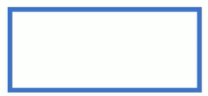
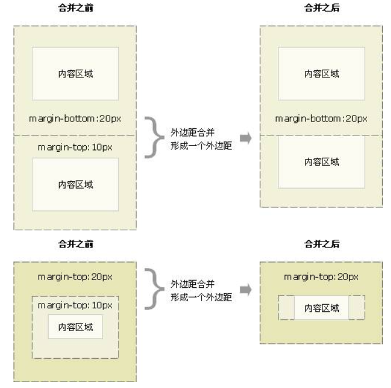
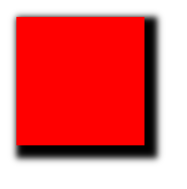
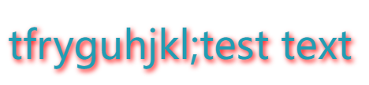
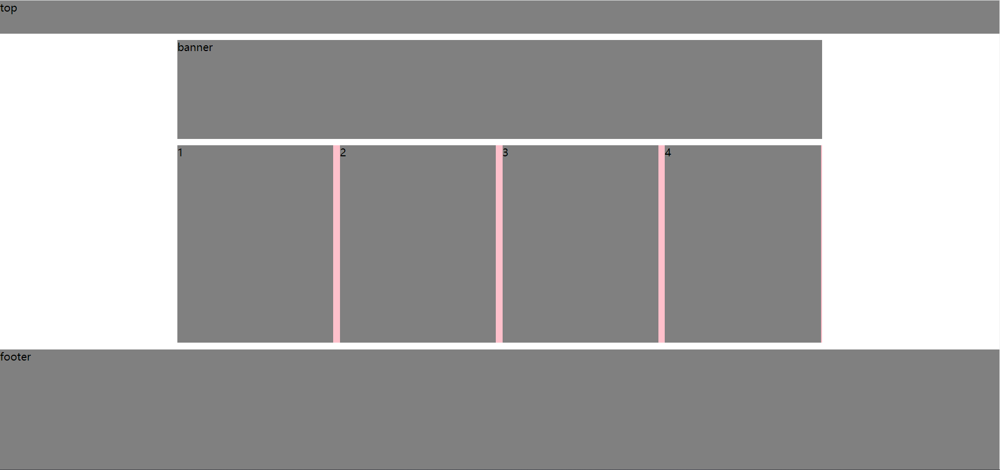

---
# 当前页面内容标题
title: 3. CSS 盒子模型
# 当前页面图标
icon: css
# 分类
category:
  - 前端
  - CSS
# 标签
tag:
  - CSS
  - web
  - CSS盒子模型
sticky: false
# 是否收藏在博客主题的文章列表中，当填入数字时，数字越大，排名越靠前。
star: false
# 是否将该文章添加至文章列表中
article: false
order: 3
# 是否将该文章添加至时间线中
timeline: false
---

> 所有 HTML 元素可以看作盒子，在 CSS 中，"box model"这一术语是用来设计和布局时使用。
> CSS 盒子模型本质上是一个盒子，封装周围的 HTML 元素，它包括：边距，边框，填充，和实际内容。
> 盒模型允许我们在其它元素和周围元素边框之间的空间放置元素

1. 先准备好相关的网页元素，网页元素基本都是盒子 Box。
2. 利用 CSS 设置好的盒子样式，然后摆放到相应的位置。
3. 往盒子里装内容。

## 一、组成


- **Margin(外边距)** - 清除边框外的区域，外边距是透明的。
- **Border(边框)** - 围绕在内边距和内容外的边框。
- **Padding(内边距)** - 清除内容周围的区域，内边距是透明的。
- **Content(内容)** - 盒子的内容，显示文本和图像。

### 1.边框



border 可以设置元素的边框。边框有三部分组成：边框宽度、边框颜色、边框样式

语法：`border :border-width | border-style | border-color`

#### border-style

border-style 属性设置一个元素的四个边框的样式。此属性可以有一到四个值。

实例:

`border-style:dotted solid double dashed;`

- 上边框是点状
- 右边框是实线
- 下边框是双线
- 左边框是虚线

`border-style:dotted solid double;`

- 上边框是点状
- 右边框和左边框是实线
- 下边框是双线

`border-style:dotted solid;`

- 上边框和下边框是点状
- 右边框和左边框是实线

`border-style:dotted;`

- 所有 4 个边框都是点状

---

> ### 属性值
>
> | 值      | 描述                                                                  |
> | :------ | :-------------------------------------------------------------------- |
> | none    | 定义无边框。                                                          |
> | hidden  | 与 "none" 相同。不过应用于表时除外，对于表，hidden 用于解决边框冲突。 |
> | dotted  | 定义点状边框。在大多数浏览器中呈现为实线。                            |
> | dashed  | 定义虚线。在大多数浏览器中呈现为实线。                                |
> | solid   | 定义实线。                                                            |
> | double  | 定义双线。双线的宽度等于 border-width 的值。                          |
> | groove  | 定义 3D 凹槽边框。其效果取决于 border-color 的值。                    |
> | ridge   | 定义 3D 垄状边框。其效果取决于 border-color 的值。                    |
> | inset   | 定义 3D inset 边框。其效果取决于 border-color 的值。                  |
> | outset  | 定义 3D outset 边框。其效果取决于 border-color 的值。                 |
> | inherit | 规定应该从父元素继承边框样式。                                        |

---

#### 边框的复合写法

```css
border: 1px solid red; /* 没有顺序 */
```

#### 表格边框

`border-collapse`属性控制浏览器绘制边框的方式。控制相邻的边框

```css
border-collapse: collapse;
```

- collapse 单词是合并的意思
- `border-collapse: collapse;`表示相邻边框合并在一起

#### CSS 边框属性

| 属性                | 描述                                                                    |
| :------------------ | :---------------------------------------------------------------------- |
| border              | 简写属性，用于把针对四个边的属性设置在一个声明。                        |
| border-style        | 用于设置元素所有边框的样式，或者单独地为各边设置边框样式。              |
| border-width        | 简写属性，用于为元素的所有边框设置宽度，或者单独地为各边边框设置宽度。  |
| border-color        | 简写属性，设置元素的所有边框中可见部分的颜色，或为 4 个边分别设置颜色。 |
| border-bottom       | 简写属性，用于把下边框的所有属性设置到一个声明中。                      |
| border-bottom-color | 设置元素的下边框的颜色。                                                |
| border-bottom-style | 设置元素的下边框的样式。                                                |
| border-bottom-width | 设置元素的下边框的宽度。                                                |
| border-left         | 简写属性，用于把左边框的所有属性设置到一个声明中。                      |
| border-left-color   | 设置元素的左边框的颜色。                                                |
| [order-left-style   | 设置元素的左边框的样式。                                                |
| border-left-width   | 设置元素的左边框的宽度。                                                |
| border-right        | 简写属性，用于把右边框的所有属性设置到一个声明中。                      |
| border-right-color  | 设置元素的右边框的颜色。                                                |
| border-right-style  | 设置元素的右边框的样式。                                                |
| border-right-width  | 设置元素的右边框的宽度。                                                |
| border-top          | 简写属性，用于把上边框的所有属性设置到一个声明中。                      |
| border-top-color    | 设置元素的上边框的颜色。                                                |
| border-top-style    | 设置元素的上边框的样式。                                                |
| border-top-width    | 设置元素的上边框的宽度。                                                |
| border-radius       | 设置圆角的边框。                                                        |

> **边框会影响盒子的实际大小。**

### 2.内边距

`padding`: 边框内容之间的距离

- padding-left
- padding-right
- padding-top
- padding-bottom

#### 内边距的复合写法

`padding: 15px;`

```css
padding: 15px; /* 顺时针 */
padding: 15px 5px;
padding: 15px 3px 5px;
padding: 15px 3px 5px 6px;
```

---

> **内边距会影响盒子的实际大小。** > **如果盒子没有指定 width/height 属性，则此时 padding 不会撑开盒子**

### 3.外边距

`margin` 清除周围的（外边框）元素区域。margin 没有背景颜色，是完全透明的。

`margin` 可以单独改变元素的上，下，左，右边距，也可以一次改变所有的属性。


| 值       | 说明                                         |
| :------- | :------------------------------------------- |
| auto     | 设置浏览器边距。 这样做的结果会依赖于浏览器  |
| _length_ | 定义一个固定的 margin（使用像素，pt，em 等） |
| _%_      | 定义一个使用百分比的边距                     |

```css
margin-top: 100px;
margin-bottom: 100px;
margin-right: 50px;
margin-left: 50px;
```

#### 简写

```css
margin: 100px 50px;
```

#### 外边距典型应用

外边距可以让块级盒子**水平居中**，但是必须满足两个条件：

1. 盒子必须指定宽度
2. 盒子左右的外边距都设为 auto

#### 外边距合并

> 当上下相邻的两个块元素（兄弟关系）相遇时，如果上面的元素有下外边距 `margin-bottom`，下面的元素有 上外边距 `margin-top` ，则他们之间的垂直间距不是 margin-bottom 与 margin-top 之和。而是保留两个值中的较大的

1. 相邻块元素垂直外边距的合并
2. 嵌套块元素垂直外边距的塌陷



> **给父元素添加`overflow: hidden;`解决合并和塌陷问题**

浮动、固定，绝对定位的盒子不会有塌陷问题。

### 4.清除内外边距

```css
* {
  margin: 0;
  padding: 0;
}
```

## 二、圆角边框

CSS3 新增 **圆角边框** 属性，盒子可以变成圆角。

`border-radius` 属性用于设置元素的外边框圆角。

语法

```css
border-radius: length;
```

原理

圆与边框的交集形成的圆角效果。

参数

- 参数值可以为数值或百分比的形式
- 若是正方形，想要设置一个圆，则将数值修改为高度或者宽度的一般即可，或者直接写为 50%
- 若是矩形，设置为 height 的一半就可以做
- 简写属性，跟四个值，分别代表左上角、右上角、右下角、左下角
- 分开来写：`border-top-left-radius`、`border-top-right-radius`、`border-bottom-right-radius`、`border-bottom-left-radius`

## 三、阴影

### 盒子阴影

CSS3 新增盒子阴影，使用 `box-shadow` 属性。

语法

```css
box-shadow: h-shadow v-shadow blur spread color inset;
```

| 值       | 描述                                           |
| -------- | ---------------------------------------------- |
| h-shadow | 必需，水平阴影的位置，允许负值                 |
| v-shadow | 必需，垂直阴影的位置，允许负值                 |
| blur     | 可选，模糊距离                                 |
| spread   | 可选，阴影的尺寸                               |
| color    | 可选，阴影的颜色                               |
| inset    | 可选，将外部阴影改为内部阴影（默认是外部阴影） |

```css
width: 200px;
height: 200px;
background-color: red;
margin: 100px auto;
box-shadow: 10px 10px 10px 10px black;
```



注意：

1. 默认是外阴影，但是不可以写这个单词（outset）
2. 盒子阴影不占空间，不会影响其他盒子排列

### 文字阴影

CSS3 中，使用 `text-shadow` 属性设置文本阴影。

| 值       | 描述                           |
| -------- | ------------------------------ |
| h-shadow | 必需，水平阴影位置。允许负值。 |
| v-shadow | 必须，垂直阴影。允许负值。     |
| blur     | 可选，模糊距离。               |
| color    | 可选，阴影颜色。               |

```css
font-size: 40px;
color: rgb(33, 157, 179);
text-shadow: 2px 2px 5px red;
```



## 四、浮动（float）

> 传统网页布局方式
>
> 网页布局的本质——用 CSS 来摆放盒子，把盒子放到相应位置。
>
> CSS 提供了三种传统布局方式：
>
> - 普通流
> - 浮动
> - 定位

### 1.标准流（普通流/文档流）

所谓的标准流，就是标签按照规定好的默认方式排列。

1. 块级元素会独占一行，从上到下顺序排列 常用元素：`div`、`hr`、`p`、`h1-h6`、`ul`、`ol`、`dl`、`form`、`table`
2. 行内元素会按照顺序，从左到右顺序排列，碰到父元素边缘则自动换行。 常用元素：`span`、`a`、`i`、`em`

标准流是最基本的布局方式。

以上三种方式都是来摆放盒子的，盒子摆到合适位置，布局自然就完成了。

实际开发中，一个页面基本包含三种布局方式。

### 2.浮动

很多布局效果，标准流没办法完成，此时就可以利用浮动完成布局。浮动可以改变元素标签默认排列方式。

- 浮动最典型应用：让多个块级元素一行显示。

- 网页布局第一准则：多个块级元素纵向排列找标准流，多个块级元素找浮动。

- 网页布局第二准则：先设置盒子大小，再设置盒子位置。

`float` 属性用于创建浮动框，将其移动到一边，直到左边缘或右边缘及包含块或另一个浮动框的边缘。

语法

```CSS
float: 属性值;
```

| 属性值 | 描述                  |
| ------ | --------------------- |
| none   | 元素不浮动（default） |
| left   | 元素向左浮动          |
| right  | 元素向右浮动          |

#### 浮动特性（重点）

加了浮动之后的元素，会具有一些特性。

1. 浮动元素会脱离标准流
2. 浮动元素会一行内显示并且元素顶部对齐
3. 浮动的元素会具有**行内块元素**的特性

**重要特性**

1. 脱离文档流的控制（浮）移动到指定位置（动），脱标脱离文档流的盒子，会漂浮在文档流的盒子上面，不占位置。
2. 如果多个盒子都设置了浮动，则它们会按照属性值一行显示并且顶端对齐排列。浮动的元素是相互贴在一起的（没有间隙），若父级宽度放不下盒子，多出的盒子会另起一行对齐。
3. 浮动元素具有行内块元素特性。任何元素都可以浮动，设置了后元素都具有行内块元素性质。
   - 若块级元素没有设置宽度，则默认和父级一样宽
   - 浮动盒子中间无间隙，紧挨着
   - 行内块元素同理

> 浮动元素经常和标准流父级元素搭配使用

为了约束元素位置，一般采取：

先用标准流父元素上下排列位置，之后内部子元素采取浮动排列左右位置，符合网页布局第一准则。

### 3. 常见网页布局

1. 浮动和标准流的父盒子搭配

   先用标准流的父元素排列上下位置，之后内部子元素采取浮动排列左右位置。

2. 一个元素浮动了，理论上其余兄弟元素也要浮动

   一个盒子里有多个盒子，其中一个盒子浮动，其他兄弟也应该浮动，防止引起问题。

   浮动的盒子只会影响浮动盒子后面的标准流，不会引起前面的标准流。

   

### 4. 清除浮动

- 清除浮动的本质是清除浮动元素造成的影响
- 如果父盒子本身具有高度，则不需要清除浮动
- 清除浮动之后，父级会根据浮动的子盒子自动检测高度，父级有了高度，就不会影响下面的标准流了。

语法：

```css
选择器: {
  clear: 属性值;
}
```

| 属性值 | 描述                 |
| ------ | -------------------- |
| left   | 不允许左侧有浮动元素 |
| right  | 不允许右侧有浮动元素 |
| both   | 同时清除左右两侧浮动 |

清除浮动策略：闭合浮动

方法：

1. **额外标签法（隔墙法）**，是 W3C 推荐的方法
2. 父级添加 overflow 属性
3. 父级添加 after 伪元素
4. 父级添加双伪元素

#### 额外标签法

也成为隔墙法，是 W3C 推荐的方法。

额外标签法是在最后一个浮动元素末尾添加一个 **空块级元素**，给其赋以属性 `clear:both;`。

```html
<style>
  clear: both;
</style>
<div class="clear"></div>
```

- 优点：通俗易懂，书写方便
- 缺点：添加许多无意义的标签，结构化差

总结

1. 清除浮动的本质

   清除浮动的本质是清除浮动元素脱离标准流造成的影响

2. 清除浮动的策略

   **闭合浮动**，只让浮动在父盒子内部影响，不影响父盒子外面的其他盒子。

3. 使用场景

   实际开发中可能会遇到，但是不常用。

#### 父级添加 overflow

可以给父级添加 `overflow` 属性，将其属性设置为 `hidden`、`auto`或`scroll`。

注意是给父元素添加代码：

- 优点：代码简洁
- 缺点：无法显示溢出部分

#### :after 伪元素法

实际上也是额外标签法的一种。

```css
.clearfix:after {
  content: "";
  display: block;
  height: 0;
  clear: both;
  visibility: hidden;
}
.clearfix {
  /*IE6、7专有*/
  *zoom: 1;
}
```

#### 双伪元素法

语法

```css
.clearfix::before,
.clearfix::after {
  content: "";
  display: table;
}
.clearfix::after {
  clear: both;
}
.clearfix {
  *zoom: 1;
}
```

- 优点：代码更简洁
- 缺点：照顾低版本浏览器

## 五、定位

> 一些固定盒子的效果，标准流或浮动都无法快速实现，此时需要定位来实现。所以：
>
> 1. 浮动可以让多个块级盒子一行没有缝隙排列显示，经常用于横向排列盒子
> 2. 定位则是可以让盒子自由的在某个盒子内移动位置或者固定屏幕中某个位置，并且可以压住其他盒子。

定位：**定位=定位模式+边偏移**。

### 1.定位模式

定位模式决定元素的定位方式，它通过 CSS 的 position 属性来设置，其值可以分为四个值：

| 值       | 语义     |
| -------- | -------- |
| static   | 静态定位 |
| relative | 相对定位 |
| absolute | 绝对定位 |
| fixed    | 固定定位 |

#### 边偏移

边偏移就是定位的盒子移动到最终位置。有 top， bottom， left 和 right 4 个属性

| 边偏移属性 | 示例           | 描述                                             |
| ---------- | -------------- | ------------------------------------------------ |
| top        | `top:80px`     | 顶端偏移量，定义元素相对于其父元素上边线的距离。 |
| bottom     | `bottom: 80px` | 底部偏移量，定义元素相对于其父元素下边线的距离。 |
| left       | `left： 80px`  | 左侧偏移量，定义元素相对于其父元素左边线的距离。 |
| right      | `right: 80px`  | 右侧偏移量，定义元素相对于其父元素右边线的距离。 |

#### 静态定位 static

静态定位是元素的默认定位方式，无定位的意思。语法：

```css
选择器 {
  position: static;
}
```

静态定位按照标准流特性摆放位置，它没有边偏移静态定位在布局时很少用到。

- 静态定位按照标准流特性摆放位置，它没有边偏移
- 静态定位在布局时很少用到

#### 相对定位 relative

相对定位是元素在移动位置的时候，是相对于它原来的位置来说的（自恋型）。

语法：

```css
选择器 {
  position: relative;
}
```

**相对定位的特点**：

它是相对于自己原来的位置来移动的（移动位置的时候参照点是自己原来的位置）。

1. 原来在标准流的位置继续占有，后面的盒子仍然以标准流的方式对待它。（不脱标，继续保留原来位置因此，相对定位并没有脱标。它最典型的应用是给绝对定位当爹的。

#### 绝对定位 absolute

绝对定位是元素在移动位置的时候，是相对于它祖先元素来说的（拼爹型）。

语法：

```css
选择器 {
  position: absolute;
}
```

绝对定位的特点：

1. 如果 **没有祖先元素** 或者 **祖先元素没有定位**，则以 **浏览器** 为准定位（ Document 文档）。
2. 如果祖先元素有定位（相对、绝对、固定定位） ，则以最近一级的有定位祖先元素为参考点移动位置。
3. 绝对定位不再占有原先的位置。（脱标）

> 子绝父相

- 子级绝对定位，不会占有位置，可以放到父盒子里面的任何一个地方，不会影响其他的兄弟盒子。

- 父盒子需要加定位限制子盒子在父盒子内显示。

- 父盒子布局时，需要占有位置，因此父亲只能是相对定位。

  这就是子绝父相的由来，所以相对定位经常用来作为绝对定位的父级。 总结：因为父级需要占有位置，因此是相对定位，子盒子不需要占有位置，则是绝对定位

#### 固定定位 fixed

固定定位是元素固定于浏览器可视区的位置。主要使用场景：可以在浏览器页面滚动时元素的位置不会改变。

语法：

```css
选择器 {
  position: fixed;
}
```

**固定定位的特点：**

1. 以浏览器的**可视窗口**为参照点移动元素。
   - 跟父元素没有任何关系
   - 不随滚动条滚动
2. 固定定位不占有原先的位置。 固定定位也是脱标的，其实固定定位也可以看做是一种特殊的绝对定位。

> 技巧：固定在版心右侧位置。
>
> 1. 让固定定位的盒子 left： 50%，走到浏览器可视区（也可以看做版心）的一半位置。
> 2. 让固定定位的盒子 margin—left）板心宽度的一半距离。多走版心宽度的一半位置就可以让固定定位的盒子贴着版心右侧对弃了

#### 粘性定位 sticky

粘性定位可以被认为是相对定位和固定定位的混合。Sticky 粘性的 语法：

```css
选择器 {
  position: sticky;
  top: 10px;
}
```

粘性定位的特点：

1. 以浏览器的可视窗口为参照点移动元素（固定定位特点）
2. 粘性定位占有原先的位置（相对定位特点）
3. 必须添加 top， left， right， bottom 其中一个才有效跟页面滚动搭配使用。兼容性较差， IE 不支持。

#### 定位叠放次序 z-index

在使用定位布局时，可能会出现盒子重叠的情况。此时，可以使用 z—index 来控制盒子的前后次序（z 轴）

语法：

```css
选择器 {
  z-index: 1;
}
```

- 数值可以是正整数、负整数或 0，默认是 auto ，数值越大，盒子越靠上
- 如果属性值相同，则按照书写顺序，后来居上
- 数字后面不能加单位
- 只有定位的盒子才有 `z—index` 属性

### 2.拓展

#### (1) 绝对定位的盒子居中

加了绝对定位的盒子不能通过 margin：0auto 水平居中，但是可以通过以下计算方法实现水平和垂直居中。

- `left`： 50% ：让盒子的左侧移动到父级元素的水平中心位置。
- `margin-left`：-100px； ：让盒子向左移动自身宽度的一半。

#### (2) 定位特殊特性

绝对定位和固定定位也和浮动类似。

1. 行内元素添加绝对或者固定定位，可以直接设置高度和完度。
2. 块级元素添加绝对或者固定定位，如果不给宽度或者高度，默认大小是内容的大小。

#### (3) 脱标的盒子不会触发外边距塌陷

浮动元素、绝对定位（固定定位）元素的都不会触发外边距合并的问题。

#### (4) 绝对定位（固定定位）会完全压住盒子

浮动元素不同，只会压住它下面标准流的盒子，但是不会压住下面标准流盒子里面的文字（图片）但是绝对定位（固定定位）会压住下面标准流所有的内容。

浮动之所以不会压住文字，因为浮动产生的目的最初是为了做文字环绕效果的。文字会围绕浮动元素

## 六、元素的显示与隐藏

类似网站广告，当我们点击关闭就不见了，但是我们重新刷新页面，会重新出现！本质：让一个元素在页面中隐藏或者显示出来。

### 1.display 属性

- `display` 属性用于设置一个元素应如何显示。
- `display: none;` 隐藏对象
- `display: block;` 除了转换为块级元素之外，同时还有显示元素的意思 display 隐藏元素后，不再占有原来的位置。

后面应用及其广泛，搭配 JS 可以做很多的网页特效。

### 2.visibility 可见性

- `visibility` 属性用于指定一个元素应可见还是隐藏。`visibility: visible;`元素可视
- `visibility: hidden;`元素隐藏
- `visibility` 隐藏元素后，继续占有原来的位置

如果隐藏元素想要原来位置，就用 `visibility: hidden` 如果隐藏元素不想要原来位置，就用 `display: none` （用处更多重点）

### 3.overflow 溢出

overflow 属性指定了如果内容溢出一个元素的框（超过其指定高度及宽度）时，会发生什么。

| 属性值  | 描述                                           |
| ------- | ---------------------------------------------- |
| visible | 不剪切内容也不添加滚动条                       |
| hidden  | 不显示超过对象尺寸的内容                       |
| scroll  | 超出的部分隐藏掉不管超出内容否，总是显示滚动条 |
| auto    | 超出自动显示滚动条，不超出不显示滚动条         |

一般情况下，我们都不想让溢出的内容显示出来，因为溢出的部分会影响布局。但是如果有定位的盒子，请慎用`overflow:hidden` 因为它会隐藏多余的部分。

## PhotoShop

> PS:
>
> `Ctrl`+`R`：像素标尺 OR 视图 :arrow_right: 标尺
>
> `Ctrl` +`加号(+)`放大视图，`Ctrl`+`减号(-)`缩小视图
>
> 空格键：移动图片
>
> `Ctrl`+`D`：取消选区

## PS 切图

> #### 常见的图片格式
>
> 1. JS 图像格式：JPEG（JPG）对色彩的信息保留较好，高清，颜色较多，产品类的图片经常用到 jpg 格式的。
> 2. gif 图像格式，GIF 格式最多只能存储 256 色，所以通常用来显示简单图形及字体，但是可以保存透明背景和动画效果，实际上经常用于一些图片小动画效果。
> 3. png 图像格式是一种新兴的网络图形格式，结合了 GIF 和 JPEG 的特点，具有存储形式的特点，能够保存透明背景。如果想要切成背景透明的图片，请先择 png 格式。
> 4. PSD 图像格式是 Photoshop 的专用格式，里面可以存放图层、通道、遮罩等多种设计稿。对我们前端人员来说，最大的优点是我们可以上面复制文字，获得图片，还可以测量大小和距离。

#### 图层切图

最简单的切图方式：鼠标点击设置为移动工具->点击图层->快速导出为 PNG。

#### 合并图层

但是很多情况下，需要合并图层并导出：

1. 按住 shift 选中需要合并的图层：图层菜单->合并图层（Ctrl+E）
2. 右击->快速导出为 PNG

最好的方法是：与美工设计沟通。

#### 切片切图

1. 利用切片工具手动划出切片范围

   若要切出透明 logo\.png，则需要将图层下拉至最下面，然后点击小眼睛使背景消失。

2. 文件菜单->导出->存储为 web 设备所用格式->选择我们要的图片格式->存储。

#### PS Cutterman 插件切图

Cutterman 是一款在 PS 中的插件，能够自动将你需要的图层进行输出，以替代传统的手动“导出为 web 所用格式”以及使用切片工具进行挨个切图的繁琐流程。

下载链接：<http://www.cutterman.cn/zh/cutterman>

其他软件: 像素大厨、蓝湖……

## Other

### 属性书写顺序（重点）

1. **布局定位属性**：display/position/float/clear/visibility/overflow（建议 display 第一个写，毕竟关系到模式）
2. **自身属性**：width/height/margin/padding/border/background
3. **文本属性**：color/font/text-decoration/text-align/vertical-align/white-space/break-word
4. **其他属性(CSS3)**：content/cursor/border-radius/box-shadow/text-shadow/background:linear-gradient…

### 导航栏注意点

实际开发中，不会直接用链接 `a` 而是用 `li` 包含链接（li+a）的做法。

1. li+a 语义更清晰，一看就是有条理的列表型内容。
2. 如果直接用 `a`，搜索引擎容易辨别为有堆砌关键字嫌疑（故意堆砌关键字容易被搜索引擎有降权的风险），从而**影响网站排名**。
3. 让导航栏一行显示，给 `li` 加浮动，因为 li 是块级元素，需要一行显示。
4. 这个 nav 导航栏可以不给宽度，将来可以继续添加其余文字。
5. 因为导航栏里面文字不一样多，所以最好给链接 `a` 左右 `padding` 撑开盒子，而不是指定宽度。
6. 浮动的盒子不会有外边距合并的问题.

### 页面布局整体思路

为了提高网页制作的效率，布局时通常有以下的整体思路：

1. 必须确定页面的版心（可视区），我们测量可得知。
2. 分析页面中的行模块，以及每个行模块中的列模块。其实页面布局第一准则，
3. 行中的列模块经常浮动布局，先确定每个列的大小，之后确定列的位置.页面布局第二准则
4. 制作 HTML 结构。我们还是遵循，先有结构，后有样式的原则。结构永远最重要
5. 所以，先理清楚**布局结构**，再写代码尤为重要这需要我们多写多积累
