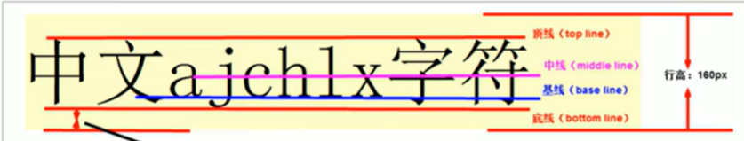

---
# 当前页面内容标题
title: 4. CSS 高级
# 当前页面图标
icon: css
# 分类
category:
  - 前端
  - CSS
# 标签
tag:
  - CSS
  - web
  - CSS高级
sticky: false
# 是否收藏在博客主题的文章列表中，当填入数字时，数字越大，排名越靠前。
star: false
# 是否将该文章添加至文章列表中
article: false
order: 4
# 是否将该文章添加至时间线中
timeline: false
---

## 一、精灵图（Sprites）

一个网页中往往会应用很多小的背景图像作为修饰，当网页中的图像过多时，服务器就会频繁地接收和发送请求图片，造成服务器请求压力过大，这将大大降低页面的加载速度。

因此，**为了有效地减少服务器接收和发送请求的次数，提高页面的加载速度**，出现了 **CSS 精灵技术**（也称 CSS Sprites. CSS 雪碧）。

### 1. 精灵图的使用

使用精灵图核心总结：

1. 精灵图主要针对于小的背景图片使用。
2. 主要借助于背景位置来实现 `background-position`.
3. 一般情况下精灵图都是负值。（千万注意网页中的坐标： x 轴右边走是正值，左边走是负值， y 轴同理）

```css
.box1 {
    width: 60px;
    height: 60px;
    margin: 100px auto;
    background: url(../images/sprites.png) no-repeat -182px 0;
}
```

## 二、字体图标的产生

字体图标使用场景：主要用于显示网页中通用、常用的一些小图标精灵图是有诸多优点的，但是缺点很明显。

1. 图片文件还是比较大的。
2. 图片本身放大和缩小会失真。
3. 一旦图片制作完毕想要更换非常复杂。 此时，有一种技术的出现很好的解决了以上问题，就是字体图标 iconfont 字体图标可以为前端工程师提供一种方便高效的图标使用方式，展示的是图标，本质属于字体。

### 1. 字体图标的优点

轻量级：一个图标字体要比一系列的图像要小。一旦字体加载了，图标就会马上渲染出来，减少了服务器请求灵活性：本质其实是文字，可以很随意的改变颜色、产生阴影、透明效果、旋转等

兼容性：几乎支持所有的浏览器，请放心使用 注意：字体图标不能替代精灵技术，只是对工作中图标部分技术的提升和优化。

总结：

1. 如果遇到一些结构和样式比较简单的小图标，就用字体图标。
2. 如果遇到一些结构和样式复杂一点的小图片，就用精灵图。

### 2. 字体图标的下载

推荐下载网站： icomoon 字体图标库 <http://icomoon.io>

IcoMoon 成立于 2011 年，推出了第一个自定义图标字体生成器，它允许用户选择所需要的图标，使它们成一字型。该字库内容种类繁多，非常全面，唯一的遗憾是国外服务器，打开网速较慢。

阿里 iconfont 字库<http://www.iconfont.cn>这个是阿里妈妈 M2UX 的一个 iconfont 字体图标字库，包含了淘宝图标库和阿里妈妈图标库。可以使用 Al 制作图标上传生成。重点是，免费！

其它：<https://simpleicons.org/>、<https://fontawesome.com.cn/>

### 3. IconMoon 字体图标使用方法

1. 选择字体并下载

2. 将下载文件中的 fonts 文件夹复制到项目根目录下

3. 字体声明，将 `style.css` 文件中的开头的字体声明代码赋值到 html 中

4. 给 `span` 声明字体

   ```css
   span {
     font-family: "icomoon";
   }
   ```

5. 打开 `demo.html`，复制页面中的方框图标到 html 代码中即可。

如何更新/添加字体图标？

上传 `selections.json`，添加字体图标，重新生成。下载，更换 `@font-face` 内容。

> [!tip]
> 不同的平台，引入字体图标的方式有差异，一定要先阅读官方文档。

## 三、CSS 三角图形

```css
.box1 {
  width: 0;
  height: 0;
  border: 10px solid transparent;
  border-left-color: black;
  /* 照顾兼容性 */
  line-height: 0;
  font-size: 0;
}
```

## 4. CSS 用户界面样式

### 4.1 鼠标样式 cursor

```css
cursor: default | pointer | move | text | not-allowed;
```

### 4.2 取消表单轮廓和文本域缩放

```css
input {
  outline: none;
}
textarea {
  outline: none;
  resize: none;
}
```

## 5. vertical-align 的应用

`vertical-align` 指定行内/行内块元素的元素的垂直对齐方式。

```CSS
vertical-align: baseline | top | middle | bottom
```



### 5.1 图片、表单和文字对齐 vertical-align

```css
img {
  vertical-align: middle;
}
li {
  disaplay: inline-block;
  vertical-align: middle;
}
```

### 5.2 解决图片底部默认空白缝隙问题

bug ：图片底侧会有一个空白缝隙，原因是行内块元素会和文字的基线对齐。主要解决方法有两种：

1. 给图片添加 `vertical—align: middle topl bottom;` 等。（提倡使用的）
2. 把图片转换为块级元素 `display: block；`

## 6. 溢出的文字省略号显示

### 6.1 单行文本溢出显示省略号—必须满足三个条件

```css
/*1·先强制一行内显示文本*/
white-space: nowrap;
默认normal 自动换行）
/*2·超出的部分隐藏*/
overflow: hidden;
/*3.文字用省略号替代超出的部分*/
text-overflow: ellipsis;
```

### 6.2 多行溢出文字显示省略号

> [!tip]
> 多行文本溢出显示省略号，有较大兼容性问题，适合于webKit浏览器或移动端（移动端大部分是webkit内核）

```css
overflow: hidden;
text-overflow: ellipsis;
/* 弹性伸缩盒子模型显示 */
display: -webkit-box;
/* 限制在一个块元素显示的文本的行数 */
-webkit-line-clamp: 3;
/* 设置或检索伸缩盒对象的子元素的排列方式 */
-webkit-box-orient: vertical;
```

## 7. margin 负值巧妙利用

1. 解决并排盒子之间的边框宽度加倍问题。 原理：让每个盒子压住前面的盒子，边框叠加。
2. 鼠标移动边框颜色变化效果。

```css
/*如果盒子没有定位，则鼠标经过添加相对定位即可*/
ul li:hover {
  position: relative;
  border: 1px solid orange;
}
/*若li都有定位，则使用 z-index 提高层级*/
ul li {
  z-index: 1;
  border: 1px solid orange;
}
```

## 8. 文字围绕浮动元素巧妙运用

原理：浮动元素不会遮住文字。

```css
div {
  float: left;
}
```

## 9. 行内块元素巧妙运用

行内块元素布局当前页码和 `pre`，`next`盒子，使用 `text-align: center` 居中。

## 10. CSS 初始化

不同浏览器对有些标签的默认值是不同的，为了消除不同浏览器对 HTML 文本呈现的差异，照顾浏览器的兼容，我们需要对 CSS 初始化

简单理解： CSS 初始化是指重设浏览器的样式。（也称为 CSS reset ）每个网页都必须首先进行 CSS 初始化。 这里我们以京东 css 初始化代码为例。

Unicode 编码字体： 把中文字体的名称用相应的 Unicode 编码来代替，这样就可以有效的避免浏览器解释 CSS 代码时候出现乱码的问题。

比如：

- 黑体：`\9ED1\4F53`
- 宋体：`\5B8B\4F53`
- 微软雅黑：`\5FAE\8F6F196C519ED1`

> 京东css初始化

```css
/* 把我们所有标签的内外边距清零 */
* {
    margin: 0;
    padding: 0
}
/* em 和 i 斜体的文字不倾斜 */
em,
i {
    font-style: normal
}
/* 去掉li 的小圆点 */
li {
    list-style: none
}

img {
    /* border 0 照顾低版本浏览器 如果 图片外面包含了链接会有边框的问题 */
    border: 0;
    /* 取消图片底侧有空白缝隙的问题 */
    vertical-align: middle
}

button {
    /* 当我们鼠标经过button 按钮的时候，鼠标变成小手 */
    cursor: pointer
}

a {
    color: #666;
    text-decoration: none
}

a:hover {
    color: #c81623
}

button,
input {
    /* "\5B8B\4F53" 就是宋体的意思 这样浏览器兼容性比较好 */
    font-family: Microsoft YaHei, Heiti SC, tahoma, arial, Hiragino Sans GB, "\5B8B\4F53", sans-serif
}

body {
    /* CSS3 抗锯齿形 让文字显示的更加清晰 */
    -webkit-font-smoothing: antialiased;
    background-color: #fff;
    font: 12px/1.5 Microsoft YaHei, Heiti SC, tahoma, arial, Hiragino Sans GB, "\5B8B\4F53", sans-serif;
    color: #666
}

.hide,
.none {
    display: none
}
/* 清除浮动 */
.clearfix:after {
    visibility: hidden;
    clear: both;
    display: block;
    content: ".";
    height: 0
}

.clearfix {
    *zoom: 1;
}
```
