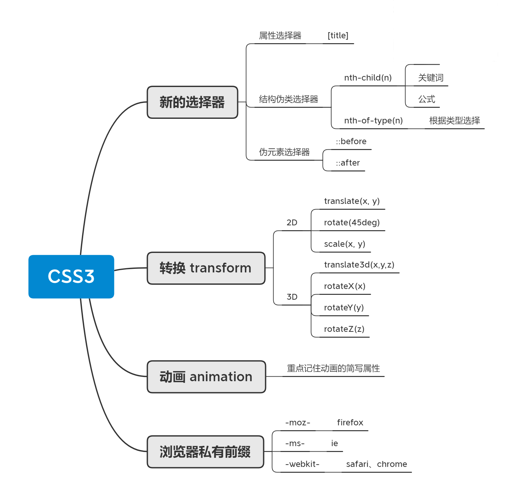

---
# 当前页面内容标题
title: CSS3新增特性
# 当前页面图标
icon: css
# 分类
category:
  - 前端
  - CSS
# 标签
tag:
  - CSS
  - web
  - CSS三大特性
sticky: false
# 是否收藏在博客主题的文章列表中，当填入数字时，数字越大，排名越靠前。
star: false
# 是否将该文章添加至文章列表中
article: false
# 是否将该文章添加至时间线中
timeline: false
---

## 1. CSS3 新特性

> 相关：[HTML5 新增特性](../html/html5.html)

### 1.1 CSS3 新增选择器

CSS3给我们新增了选择器，可以更加便捷，更加自由的选择元素。

1. 属性选择器
2. 结构伪类选择器
3. 伪元素选择器

### 1.2 属性选择器

属性选择器可以根据元素特定属性的来选择元素。这样就可以不用借助于类或者id选择器。(权重是 0,0,1,0)
|简介| 选择|
|-|-|
|`E[att]`|选择具有att属性的E元素|
|`E[att:val`|选择具有att属性且属性值等于val的E元素|
|`E[att^=val]`|匹配具有att属性且值以val开头的E元素|
|`E[att$=val]`|匹配具有att属性且值以val结尾的E元素|
|`E[att*=val]`|匹配具有att属性且值中含有val的E元素|

```css
input[type=text] {
    color: green;
}
```

```HTML
<input type="password">
<input type="text">
```

类选择器、属性选择器、伪类选择器的权重都为 10

### 2.3 结构伪类选择器

结构伪类选择器主要根据文档结构来选择器元素，常用于根据父级选择器里面的子元素。

| 选择符             | 简介                        |
| ------------------ | --------------------------- |
| `E:first-child`    | 匹配父元素中的第一个子元素E |
| `E:last-child`     | 匹配父元素中最后一个E元素   |
| `E:nth-child(n)`   | 匹配父元素中的第n个子元素E  |
| `E:first-of-type`  | 指定类型E的第一个           |
| `E:last-of-type`   | 指定类型E的最后一个         |
| `E:nth-of-type(n)` | 指定类型E的第n个            |

```css
ul li:first-child {
    background-color: pink;
}
ul li:last-child {
    background-color: pink;
}
ul li:nth-child(5) {
    background-color: skyblue;
}
```

重点：`E:nth-child(key)`

- `key` 可以是整数、关键字（`even/odd`）、公式（`n/2n/2n+1`）

|公式|取值|
|-|-|
|2n|偶数|
|2n-1|奇数|
|5n|5 10 15 ...|
|n+|5 6 7 8 ...|
|-n+5|前五个|

关于 `nth-of-type` 与 `nth-of-child`

1. `div:nth-child` 会把所有的盒子都排列序号 
    执行的时候首先看  `:nth-child(1)` 之后回去看 前面 `div`
2.  `div:nth-of-type` 会把指定元素的盒子排列序号
    执行的时候首先看  div指定的元素  之后回去看 `:nth-of-type(1)` 第几个孩子 

区别：
1. `nth-child`对父元素里面所有孩子排序选择（序号是固定的）先找到第n个孩子，然后看看是否和E匹配
2. `nth-of-type`对父元素里面指定子元素进行排序选择。先去匹配E ，然后再根据E找第n个孩子

### 2.4 伪元素选择器

伪元素选择器可以帮助我们利用CSS创建新标签元素，而不需要HTML标签，从而简化HTML结构。

|选择符 |简介|
|-|-|
|`::before` |在元素内部的前面插入内容|
|`::after`|在元素内部的后面插入内容|

注意：
- **before** 和 **after** 创建一个元素，但是属于行内元素
- 新创建的这个元素在文档树中是找不到的，所以我们称为伪元素
- 语法：`element:before{}`
- before 和 after 必须有 **content 属性**
- before 在父元素内容的前面创建元素， after 在父元素内容的后面插入元素
- **伪元素选择器**和**标签选择器**一样，权重为 1

#### 1.4.1 案例一：伪元素字体图标

```css
 div::after {
    position: absolute;
    top: 10px;
    right: 10px;
    font-family: 'icomoon';
    content: '\e91b';
    color: red;
    font-size: 18px;
}
```

#### 1.4.2 案例二：伪元素遮罩层

```css
.tudou::before {
    content: '';
    display: none;
    position: absolute;
    top: 0;
    left: 0;
    width: 100%;
    height: 100%;
    background: rgba(0, 0, 0, .3) url(images/arr.png) no-repeat center;
}
.tudou:hover::before {
    display: block;
}
```

#### 2.4.3 案例三：伪元素清除浮动

```css
.clearfix::after {
    content: '';
    display: block; 
    height: 0;
    clear: both;
    visibility: hidden;
}
```

双伪元素清除浮动

```css
.clearfix::before,
.clearfix::after {
    content: '';
    display: block;
}
.clearfix::after {
    clear: both;
}
```

### 1.5 CSS3盒子模型

CSS3中可以通过 `box-sizing` 来指定盒模型，有2个值：即可指定为 `content-box`，`border-box` ，这样我们计算盒子大小的方式就发生了改变。

可以分成两种情况：

1. `box-sizing: content-box` 盒子大小为 width + padding + border （以前默认的）
2. `box-sizing: border-box` 盒子大小为 width
如果盒子模型我们改为了 `box-sizing: border-box;` ，那`padding` 和 `border`就不会撑大盒子了（前提 `padding` 和 `border` 不会超过 width 宽度）

### 1.6 CSS3 渐变

CSS 渐变是 CSS3 图像模块中添加的新类型的图像。CSS 渐变允许您在 **两个或多个指定颜色之间显示平滑过渡**。
浏览器支持两种类型的渐变：

- 线性渐变（Linear Gradients）：向下/向上/向左/向右/对角方向，用 `linear-gradient()` 函数定义
- 径向渐变（Radial Gradients）：由它们的中心定义，用 `radial-gradient()` 函数定义


#### 1.6.1 线性渐变

语法
```css
background: linear-gradient(direction, color1, color2, ...);
```

参数
- `direction`：指定了颜色过度的方向，不写默认为从上到下，值可以为 `to bottom`、`to top`、`to right`、`to left`、`to bottom right` 等。
- `color1`：可以有多个 `color` 值，指定了颜色变化的范围。

### 1.7 CSS3过渡（重点）

过渡（transition）是CSS3中具有颠覆性的特征之一，我们可以在不使用Flash动画或JavaScript的情况下，当元素从一种样式变换为另一种样式时为元素添加效果。

过渡动画：是从一个状态渐渐的过渡到另外一个状态
可以让我们页面更好看，更动感十足，虽然低版本浏览器不支持（ie9以下版本）但是不会影响页面布局。

我们现在经常和 :hover 一起搭配使用。

#### 1.7.1 transition 的使用

```css
transition: 要过渡的属性 花费时间 运动曲线 何时开始;
```

1. **属性**：想要变化的css属性，宽度高度背景颜色内外边距都可以。如果想要所有的属性都变化过渡，写一个all就可以。
2. **花费时间**：单位是秒（必须写单位）比如 0.5s
3. **运动曲线**：默认是ease （可以省略）
    - `ease`：默认值，缓慢加速，然后缓慢减速的过渡效果。
    - `linear`：匀速过渡效果。
    - `ease-in`：缓慢加速的过渡效果。
    - `ease-out`：缓慢减速的过渡效果。
    - `ease-in-out`：先缓慢加速，再缓慢减速的过渡效果。
    - `cubic-bezier(n,n,n,n)`：自定义的贝塞尔曲线函数，通过四个值来定义曲线的控制点，分别对应 `x1`、`y1`、`x2`、`y2`。
4. **何时开始**：单位是秒（必须写单位）可以设置延迟触发时间默认是Os （可以省略）

```css
div {
    width: 200px;
    height: 100px;
    background-color: pink;
    /* transition: width .5s, height .5s; */
    transition: all .5s;
}
div:hover {
    width: 400px;
    height: 200px;
    background-color: skyblue;
}
```

### 1.8 CSS3 的其他特性

#### 1.8.1 CSS3 滤镜 filter

filter CSS属性将模糊或颜色偏移等图形效果应用于元素。

```css
filter: 函数();
```

例如： `filter： blur(5px);` blur 模糊处理数值越大越模糊

#### 1.8.2 CSS3 calc函数

此 CSS 函数让你在声明CSS属性值时执行一些计算。

```css
width: calc(100%-30px);
/* 子盒子永远比父盒子小30px */
```
括号里面可以使用 `+ - * /` 来进行计算。

## 2. 2D 转换

转换（`transform`）是 CSS3 中具有颠覆性的特征之一，可以实现元素的位移、旋转、缩放等效果。

转换可以理解为变形。

- 移动：`translate`
- 旋转：`rotate`
- 缩放：`scale`

### 3.1 二维坐标系

### 3.2 移动 translate

语法

```css
transform: translate(x, y);
transform: translateX(x);
transform: translateY(y);
```

- 参数 `x, y` 可以是百分数，为盒子自身的宽度或高度。

重点

- 定义 2D 转换中的移动，沿着X和Y轴移动元素
- translate 最大的优点：不会影响到其他元素的位置
- translate 中的百分比单位是相对于 自身元素 的 `trainslate:(50%, 50%)`
- 对行内标签没有效果

### 2.3 让盒子实现水平和垂直居中

```css
/*子绝父相*/
position: absolute;
top: 50%;
left: 50%;
transform: translate(-50%, -50%);
```

### 2.4 旋转 rotate

值为正数则顺时针旋转，为负数则逆时针旋转。

```css
transform: rotate(45deg);
```

### 2.5 2D 转换中心点 transform-origin

我们可以通过设置 `transform-origin` 设置元素转换的中心点。

#### 2.5.1 语法

```css
transform-origin: x y;
```

#### 2.5.2 重点

- 注意后面的参数 x 和 y 用空格隔开
- x y 默认转换的中心点是元素的中心点（50% 50%）
- 还可以给 x y 设置像素或者方位名词（top bottom left right center）

### 2.6 2D 转换之缩放 scale

```css
 transform: scale(x, y);
```

`x, y` 不跟单位的话，是指缩放的倍数。

```css
transform: scale(2,1);
```

- 参数大于 `1` 则放大，小于 `1` 则缩小。
- 可以配合 `transform-origin` 使用，改变缩放中心。
- `scale` 的优势：不占空间

### 2.7 2D 转换综合写法

注意：

1. 同时使用多个转换，其格式为： `transform: translate(), rotate() scale()`
2. 其顺序会影转换的效果。（先旋转会改变坐标轴方向）
3. 当我们同时有位移和其他属性的时候，记得要将位移放到最前.

## 3. 动画

动画( animation ) 是 CSS3 中具有颠覆性的特征之一，可通过设置多个节点来精确控制一个或一组动画，常用来实现复杂的动画效果。
相比较过渡，动画可以实现更多变化，更多控制，连续自动播放等效果。

### 3.1 动画的基本使用

分为两步：

1. 定义动画 (动画序列 `@`)
2. 使用动画

```css
 /* 1. 定义动画 */
@keyframes move {
    /*开始状态*/
    0% {
        transform: translateX(0px);
    }
    /*结束状态*/
    100% {
        transform: translateX(1000px);
    }
}
div {
    width: 200px;
    height: 200px;
    background-color: pink;
    /* 2. 调用动画 */
    /* 动画名称 */
    animation-name: move;
    /* 持续时间 */
    animation-duration: 5s;
}
```

**动画序列**

- 0% 是动画的开始，100% 是动画的完成。这样的规则就是动画序列。
- 在 `@keyframes` 中规定某项 CSS 样式，就能创建由当前样式逐渐改为新样式的动画效果。
- 动画是使元素从一种样式逐渐变化为另一种样式的效果。您可以改变任意多的样式任意多的次数。
- 请用百分比来规定变化发生的时间，或用关键词"`from`"和“`to`”，等同于0%和100%。

注意:

1. 可以做多个状态的变化 `keyframes` 关键帧
2. 百分比必须是整数
3. 百分比是总时间 `animation-duration` 的划分

### 3.2 动画常用属性

|属性|描述|
|-|-|
|`keyframes`|规定动画。|
|`animation`|所有动画属性的简写属性,除了animation-play-state属性。|
|`animation-name`|规定@keyframes动画的名称。(必须的)|
|`animation-duration`|规定动画完成一个周期所花费的秒或毫秒，默认是0。（必须的)|
|`animation-timing-function`|规定动画的速度曲线，默认是“ease” .|
|`animation-delay`|规定动画何时开始，默认是0.|
|`animation-iteration-count`|规定动画被播放的次数，默认是1，还有infinite|
|`animation-direction`|规定动画是否在下一周期逆向播放，默认是 "normal",alternate逆播放|
|`animation-play-state`|规定动画是否正在运行或暂停。默认是"running",还有"paused".|
|`animation-fill-mode`|规定动画结束后状态,保持forwards回到起始backwards|

### 3.3 动画简写属性

```css
animation: 动画名称 持续时间 运动曲线 何时开始 播放次数 是否反方向 动画起始或者结束的状态;
animation: name duration timing-function delay iteration-count direction fill-mode;
```

```css
animation: myfirst 5s linear 2s infinite alternate forwards;
```

- 简写属性里面不包含 `animation-play-state`
- 暂停动画: `animation-play-state: puased;`
- 经常和鼠标经过等其他配合使用想要动画走回来，而不是直接跳回来: `animation-direction: alternate`
- 盒子动画结束后，停在结束位置: `animation-fill-mode: forwards`
- 我们元素可以添加多个动画，用逗号分隔

### 3.4 速度曲线

`animation-timing-function`  规定动画的速度曲线，默认是“ease”

|     值      |                      描述                      |
| :---------: | :--------------------------------------------: |
|   linear    |        动画从头到尾的速度是相同的。匀速        |
|    ease     | 默认。动画以低速开始，然后加快，在结束前变慢。 |
|   ease-in   |                动画以低速开始。                |
|  ease-out   |                动画以低速结束。                |
| ease-in-out |             动画以低速开始和结束。             |
|   steps()   |       指定了时间函数中的间隔数量（步长）       |

## 4. 3D 转换

### 4.1 3D移动

```css
transform: translateZ(100px);
transform: translateX(100px) translateY(100px) translateZ(100px);
transform: translate3d(x, y, z);
```

1. translateZ 沿着Z轴移动
2. translateZ 后面的单位我们一般跟px
3. translateZ(100px) 向外移动100px（向我们的眼睛来移动的）
4. `translate3d(x,y,z)`xyz是不能省略的，如果没有就写0

### 4.2 透视 perspective

<https://developer.mozilla.org/zh-CN/docs/Web/CSS/perspective>

在2D平面产生近大远小视觉立体，但是只是效果二维的

- 如果想要在网页产生3D效果需要透视（理解成3D物体投影在2D平面内）。
- 模拟人类的视觉位置，可认为安排一只眼睛去看
- 透视我们也称为视距：视距就提人的眼睛到屏幕的距离
- 距离视觉点越近的在电脑平面成像越大，越远成像越小
- 透视的单位是像素

**透视写在被观察元素的父盒子上面的**

```css
perspective: 200px;
```

### 4.3 3D旋转

#### 4.4.1 retateX

沿着x轴正方向旋转45度

```css
transform: rotateX(45deg);
```


#### 4.4.2 retateY

沿着y轴正方向旋转45deg

```css
transform: rotateY(45deg);
```


#### 4.4.3 retateZ

沿着Z轴正方向旋转45deg

```css
transform: rotateZ(45deg);
```


#### 4.4.4 自定义轴

沿着自定义轴旋转deg为角度（了解即可）

```css
transform: rotate3d(x, y, z, deg);
transform: rotate3d(1, 1, 1, 45deg);
```

`xyz`是表示旋转轴的矢量，是标示你是否希望沿着该轴旋转，最后一个标示旋转的角度。

- `transform: rotate3d(1,0,0,45deg)` 就是沿看着x轴旋转45deg
- `transform: rotate3d(1,1,0,45deg)` 就是沿看对角线旋转45deg

> [!tip]
> 左手大拇指指向旋转轴的正方向，其余四指指向的就是旋转的方向。

### 4.5 3D 呈现 transfrom-style

<https://developer.mozilla.org/docs/Web/CSS/transform-style>

```css
transform-style: preserve-3d;
```

- 控制子元素是否开启三维立体环境。
- `transform-style: flat;`子元素不开启3d立体空间默认的
- `transform-style: preserve-3d;`子元素开启立体空间
- 代码写给父级，但是影响的是子盒子
- 这个属性很重要，后面必用

4.6 backface-visibility

<https://developer.mozilla.org/zh-CN/docs/Web/CSS/backface-visibility>

 属性 **`backface-visibility`** 指定当元素背面朝向观察者时是否可见。

```css
backface-visibility: visible;	/*可见*/
backface-visibility: hidden;	/*不可见*/
```

元素的背面是其正面的镜像。虽然在 2D 中不可见，但是当变换导致元素在 3D 空间中旋转时，背面可以变得可见。 （此属性对 2D 变换没有影响，它没有透视。）

## 5. 浏览器私有属性

浏览器私有前缀是为了兼容老版本的写法，比较新版本的浏览器无须添加。

1. 私有前缀

    - `-moz-`: 代表firefox浏览器私有属性
    - `-ms-`: 代表ie浏览器私有属性
    - `-webkit-`: 代表safari、chrome私有属性-o-∶代表Opera私有属性

2. 提倡的写法

```css
-moz-border-radius: 10px;
-webkit-border-radius: 10px;
-o-border-radius: 10px;
border-radius: 10px;
```

## 6. CSS3 新特性

