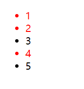

---
# 当前页面内容标题
title: 1. CSS 简介与选择器
# 当前页面图标
icon: css
# 分类
category:
  - 前端
  - CSS
# 标签
tag:
  - CSS
  - web
sticky: false
# 是否收藏在博客主题的文章列表中，当填入数字时，数字越大，排名越靠前。
star: false
# 是否将该文章添加至文章列表中
article: false
order: 1
# 是否将该文章添加至时间线中
timeline: false
---

## CSS层叠样式表

- ==内嵌式，外链式，行内式==

#### 1.内联式

写在\<style>标签中

```html
<style>
        /*选择器{样式}*/
        p{
            color: red;
        }
    </style>
  </head>
  <body>
    <p>css......................................</p>
  </body>
```


#### 2.外链式

样式单独写在CSS文件。

```html
<link rel="stylesheet" href="css文件路径">
```

使用\<link>标签引入这个文件

#### 3.行内式

写在标签内部

```html
<div style="color: red; font-size: 20px;">
    test data
</div>
```


## CSS 选择器

CSS选择器用于选择你想要的元素的样式的模式。

基础选择器有：标签选择器、类选择器

- id选择器
- 通配符选择器

#### 1.标签选择器

选择文件内所有的标签

语法

```css
标签名 {
    样式
}
```

案例

```html
 <style>
      /*标签选择器{样式}*/
      p {
        color: red;
        font-size: 30px;
      }
      div {
        color: pink;
        font-size: 20px;
      }
    </style>
  </head>
  <body>
    <p>css......................................</p>
    <p>css......................................</p>
    <p>css........难.难..........................</p>
    <p>css.................难难难.................</p>
    <div>typescript难难难难..........................</div>
    <div>typescript难难难难..........................</div>
    <div>typescript难难难难..........................</div>
  </body>
```


#### 2.类选择器

差异化选择不同的标签

语法

`.`加`类名`{..}

```css
.类名 {
   样式 
}
```

类名命名可以使用`-`

案例一

```html
<style>
    .red {
      color: red;
    }
  </style>
  <body>
    <ul>
      <li class="red">1</li>
      <li class="red">2</li>
      <li>3</li>
      <li class="red">4</li>
      <li>5</li>
    </ul>
  </body>
```



案例二

```html
<style>
    .red {
      width: 100px;
      height: 50px;
      /* 背景颜色 */
      background-color: red;
    }
    .blue {
      width: 100px;
      height: 50px;
      /* 背景颜色 */
      background-color: blue;
    }
  </style>
  <body>
    <div class="red">红色</div>
    <div class="blue">蓝色</div>
    <div class="red">红色</div>
  </body>
```


> 多类名

- 在标签class属性中写多个类名
- 多个类名中间必须用空格分开

```html
<div class="red font35">阿巴阿巴</div>
```

#### 3.id选择器

```css
#pink {
           color: pink;
        }

<body>
    <div id="pink">qwertyuiop</div>
</body>
```

id选择器只能调用一次

#### 4.通配符选择器

选择所有的标签

```css
<style>
      * {
        color: red;
      }
</style>
```

## CSS字体属性

#### 1.定义文本字体

使用font-famaily定义文本字体。

```css
h2 {
    font-family: '微软雅黑';
}
p {
    font-family: 'Microsoft YaHei',Arial, Helvetica, sans-serif;
}
```

- 各种字体之间用英文状态下的逗号隔开
- 用空格多个单词加单引号
- 尽量使用系统默认字体

#### 2.字体大小

`font-size`

```css
p {
    font-size: 20px;
}
/* 标题标签需要单独指定文字大小 */
```

#### 3.字体粗细

`font-weight:bold;`

```css
.bold {
	font-weight: bold;
}
```

- normal、bold、number
- number：400 等同于normal；700 等同于bold；

#### 3.文字样式

`font-style`

```css
p {
    font-style: normal;
}
```

- normal:正常的
- italic:倾斜的

#### 4.字体复合属性

`font: font-style font-weight font-size/line-height font-family`

不可调换顺序！

必须保留`font-size`和`font-family`

```css
p {
    /* font: font-style font-weight font-size/line-height font-family; */
    font: italic bold 16px/20px 'Microsoft YaHei',Arial,Helvetica, sans-serif;
}
```


| 属性             | 描述                                                         |
| ---------------- | ------------------------------------------------------------ |
| font             | 简写属性。作用是把所有针对字体的属性设置在一个声明中。       |
| font-family      | 设置字体系列。                                               |
| font-size        | 设置字体的尺寸。                                             |
| font-size-adjust | 当首选字体不可用时，对替换字体进行智能缩放。(CSS2.1 已删除该属性。) |
| font-stretch     | 对字体进行水平拉伸。（CSS2.1 已删除该属性。）                |
| font-style       | 设置字体风格。                                               |
| font-variant     | 以小型大写字体或者正常字体显示文本。                         |
| font-weight      | 设置字体的粗细。                                             |

## CSS文本属性

#### 1.文本颜色

`color`属性定义颜色

```css
div {
    color: red
}
```

| 方式           | 属性值              |
| -------------- | ------------------- |
| 预定义的颜色值 | red，green，blue... |
|十六进制|#FF0000，#FF6600，#66CCFF|
|RGB代码|rgb(255,0,0) or rgb(100%,0%,0%)|

#### 2.对齐文本

`text-align`属性用于设置元素内文本内容的水平对齐方式。

#### 3.装饰文本

`text-decoration`属性规定添加到文本的修饰。

可以添加下滑线、删除线、上划线等。

| 属性值       | 描述                       |
| ------------ | -------------------------- |
| none         | 默认，没有装饰线           |
| underline    | 下划线。\<a>链接自带下划线 |
| overline     | 上划线                     |
| line-through | 删除线                     |

#### 4.文本缩进

`text-indent`属性用来指定文本第一行的缩进

```css
div {
    text-indent: 20px;
}
```

- 可以为负值

```css
p {
    text-indent: 2em;
}
```

**em** 是一个相对单位，表示按字符缩进

---

<center>效果</center>


#### 5.行间距

`line-height`

```css
p {
    line-height: 26px;
}
```

## CSS复合选择器

> 1.在css中，可以根据选择器的类型把选择器分为基础选择器和复合选择器
>
> 2.复合选择器是建立在基础选择器之上，对基本选择器进行组合形成的。

#### 1.后代选择器

> 后代选择器又称为包含选择器，可以选择父元素里面的子元素，其写法就是把外层标签写在前面，内层标签写在后面，中间用空格分隔，当标签发生嵌套时，内层标签就成为外层标签的后代。

```css
ol li {
    font-size: 20px;
    color: tomato;
}
```


- **元素1和元素2必须用空格隔开**
- **元素1是父级元素2是子集，最终选择显示的是元素2**

#### 2.子选择器

> 子选择器只能作为某元素的最近一级子元素

基本语法格式： `元素1>元素2{样式声明}`

```css
.nav>a {
    color: red;
}
```


- 元素1和元素2必须用**大于号**隔开
- 元素1是父级元素2是子集，**最终选择显示的是元素2**
- 元素2必须是**亲儿子**，其他的无效

#### 3.并集选择器

并集选择器可以选择多组标签，同时为他们定义相同的样式。通常用于集体声明。

基本语法格式：`元素1,元素2{样式声明}`

```css
div,p{
    color: orange;
}
```


- 元素1元素2之间用**逗号隔开**
- 逗号可以理解为**和**的意思
- 并集选择器**通常用于集体声明**

#### 4.伪类选择器

用于向某些选择器添加特殊效果，比如给链接添加特殊效果，或选择第1个，第n个元素

伪类选择器书写最大的特点是用**冒号(:)表示**，比如: hover:first-child

##### 链接伪类选择器

```css
a:link    /* 选择所有未被访问的链接 */
a:visited /* 选择所有已被访问的链接 */
a:hover   /* 选择鼠标指针位于其上的链接 */
a:active  /* 选择活动链接（鼠标按下未弹起的链接） */
```

```css
a:link {
  color: black;
  text-decoration: none;
}
a:visited {
  color: blue;
}
a:hover {
  color: #66ccff;
}
a:active {
  color: green;
}
```

- 按照<font color="red">LVHA</font>的顺序声明：link - :visited - :hover - :active.

###### focus伪类选择器

匹配获得焦点(光标)的 \<input> 元素

```css
input:focus {
    background-color: yellow;
}
```

## CSS元素显示模式

#### 1.块元素

\<h1>~\<h6>、\<p>、\<div>、\<ul>、\<ol>、\<li>等

**特点**：

1. 独占一行。
2. 高度，宽度，外边距以及内边距都可以控制。
3. 宽度默认是容器（父级宽度）的100%。
4. 是一个容器及盒子，里面可以放**行内**或者**块级元素**。

#### 2.行内元素

\<a>、\<strong>、\<b>、\<em>、\<i>、\<del>、\<s>、\<ins>、\<u>、\<span>等

**特点**：

1. 相邻行内元素在一行上，一行可以显示多个。
2. 高度，宽度无法直接设置。
3. 宽度默认是内容的宽度。
4. 只能容纳文本或其他行内元素。

> \<a>
>
> - 链接里面不能放链接
> - 特殊情况\<a>里面可以放块级元素，但是给\<a>转换一下块级模式最安全

#### 3.行内块元素

行内块元素从文字上看像块级元素和行内元素结合，其实比较特殊，比如\<input>，\，\<td> 可以设置宽高属性，这种就称为行内块元素。

通常有这几个特点。

- **默认宽度是内容宽度**
- **宽度，高度，行高，margin,padding 都可以设置**
- **和行内元素同一行，之间会留白**。

#### 4.元素显示模式的转换

- 转换为块元素`display:block`

- 转换为行内元素`display:inline`
- 转换为行内块元素`display:inline-block`

## CSS背景

> CSS3 中包含几个新的背景属性，提供更大背景元素控制。

设置背景颜色、背景图片、背景平铺、背景图片位置、背景图像固定等。

- background-image
- background-size
- background-origin
- background-clip

#### 1.背景颜色

`background-color`属性定义元素的背景颜色。

语法：`background-color: 颜色值;`

默认值是**transparent（透明）**

```css
div {
    width: 200px;
    height: 200px;
    background-color: #66ccff;
}
```


#### 2.背景图片

`background-image`属性描述了元素的背景图像。

语法：`background-image: none | url (url);`

```css
div {
  width: 300px;
  height: 300px;
  background-image: url(../img/head.jpg);
}
```


#### 3.背景平铺

`background-repeat`

*背景图片默认平铺*

| 属性值    | 说明                                                   |
| :-------- | :----------------------------------------------------- |
| no-repeat | 表示不平铺                                             |
| repeat    | 默认值，表示在水平方向（x轴）和垂直方向（y轴）同时平铺 |
| repeat-x  | 表示在水平方向（x轴）平铺                              |
| repeat-y  | 表示在垂直方向（y轴）平铺                              |

#### 4.背景图片位置

`background-position`属性可以改变图片在背景中的位置。

语法：`background-position: x y;`

可以使用**方位名词**或者**精确单位**

|参数值|说明|
|:----|:--|
|length|百分数 \| 由浮点数和单位标识符组成的长度值|
|position|top \| center \| bottom \| left \| right  方位名词|

```css
body {
    background-image: url(../img/background_img.jpg);
    background-repeat: no-repeat;
    background-position: center top;
    background-size: 1500px;
}
```


#### 5.背景图像固定

`background-attachment`属性设置背景图像是否固定或者随着页面的其余部分滚动。

语法：`background-attachment: scroll | fixed`

| 参数值 | 说明                       |
| :----- | :------------------------- |
| scroll | 背景图像随着对象的内容滚动 |
| fixed  | 背景图像固定               |

#### 6.复合写法

`background`

**没有特定的书写顺序**，一般约定：

background：

- 背景颜色 背景图片地址 背景平铺 背景图像滚动 背景图片位置;

```css
body {
    background: url(../img/background_img.jpg) no-repeat fixed center top;
    background-size: 1500px;
}
```

#### 7.背景色半透明

> CSS3

`background: rgba(0,0,0,0.3);` or background: `rgba(0,0,0,.3);`
