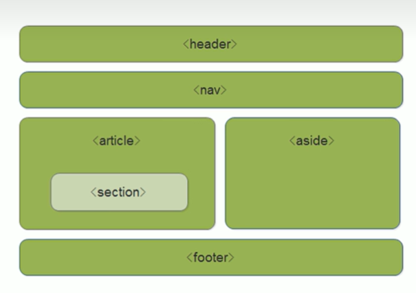
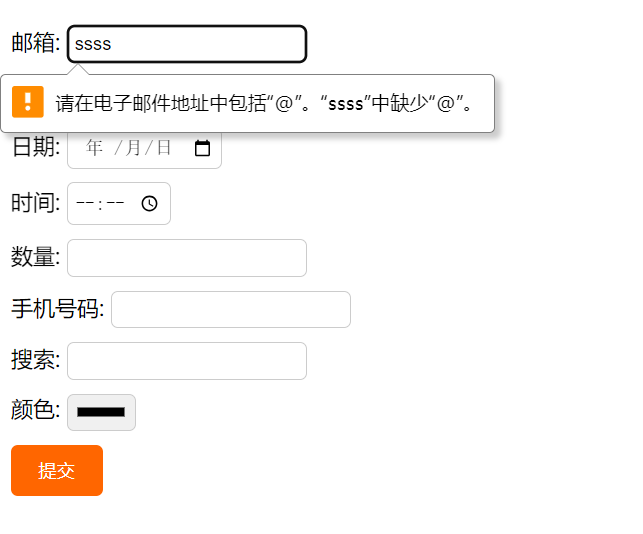

---
# 当前页面内容标题
title: HTML5新增特性
# 当前页面图标
icon: html
# 分类
category:
  - 前端
  - HTML
# 标签
tag:
  - HTML
  - web
sticky: false
# 是否收藏在博客主题的文章列表中，当填入数字时，数字越大，排名越靠前。
star: false
# 是否将该文章添加至文章列表中
article: false
# 是否将该文章添加至时间线中
timeline: false
---

## 1. HTML5新特性

> **HTML5** 的新增特性主要是针对于以前的不足，增加了一些**新的标签**、**新的表单**和**新的表单属性**等。

这些新特性都有兼容性问题，基本是IE9+以上版本的浏览器才支持，如果不考虑兼容性问题，可以大量使用这
些特性。

> 相关：[CSS3 新增特性](../css/新增特性.html)

### 1.1 HTML5新增语义化标签

- `<header>`：头部标签
- `<nav>`：导航标签
- `<article>`：内容标签
- `<section>`：定义文档某个区域
- `<aside>`：侧边栏标签
- `<footer>`：尾部标签



::: tip

- 这种语义化标准主要是针对**搜索引擎**的
- 这些新标签页面中可以**使用多次**
- 在IE9中，需要把这些元素转换为**块级元素**

:::

### 1.2 HTML5新增多媒体标签

#### 1. 视频 `<vedio>`

所有浏览器支持 mp4 格式。

- `autoplay="autoplay"` 
- `controls="controls"` 显示控件
- `width` 设置宽度
- `height` 设置高度
- `loop=loop` 设置循环播放
- `preload="auto/none"` 是否预加载
- `src=url` 视频地址 
- `poster=url` 封面图片
- `muted=muted` 静音播放

| 浏览器            | MP4                                                      | WebM | Ogg  |
| ----------------- | -------------------------------------------------------- | ---- | ---- |
| Internet Explorer | YES                                                      | NO   | NO   |
| Chrome            | YES                                                      | YES  | YES  |
| Firefox           | YES<br/>从Firefox21版本开始<br/>Linux系统从Firefox30开始 | YES  | YES  |
| Safari            | YES                                                      | NO   | NO   |
| Opera             | YES<br/>从Opera25版本开始                                | YES  | YES  |

#### 2. 音频 `<audio>`

所有浏览器支持 mp3 格式。

- `controls`：显示控件
- `autoplay`：（谷歌禁用）
- `loop=loop` 设置循环播放

| 浏览器            | MP3  | Wav  | Ogg  |
| ----------------- | ---- | ---- | ---- |
| Internet Explorer | YES  | NO   | NO   |
| Chrome            | YES  | YES  | YES  |
| Firefox           | YES  | YES  | YES  |
| Safari            | YES  | YES  | NO   |
| Opera             | YES  | YES  | YES  |

### 1.3 HTML5 新增 input 类型

- `type="email"`
- `type="url"`
- `type="date"`
- `type="time"`
- `type="month"`
- `type="week"`
- `type="number"`
- `type="tel"`
- `type="search"`
- `type="color"`

```html
<!DOCTYPE html>
<html lang="en">
<head>
    <meta charset="UTF-8">
    <meta name="viewport" content="width=device-width, initial-scale=1.0">
    <meta http-equiv="X-UA-Compatible" content="ie=edge">
    <title>Document</title>
    <style>
        /* 为了让我们的表单更加美观，我们可以添加一些样式 */
        ul {
            list-style: none;
            padding: 0;
        }

        li {
            margin: 10px 0;
        }

        input {
            padding: 5px;
            border: 1px solid #ccc;
            border-radius: 5px;
        }

        input[type="submit"] {
            background-color: #f60;
            color: #fff;
            border: none;
            border-radius: 5px;
            padding: 10px 20px;
            cursor: pointer;
        }
    </style>
</head>
<body>
    <!-- 我们验证的时候必须添加form表单域 -->
    <form action="">
        <ul>
            <li><label>邮箱: <input type="email" /></label></li>
            <li><label>网址: <input type="url" /></label></li>
            <li><label>日期: <input type="date" /></label></li>
            <li><label>时间: <input type="time" /></label></li>
            <li><label>数量: <input type="number" /></label></li>
            <li><label>手机号码: <input type="tel" /></label></li>
            <li><label>搜索: <input type="search" /> </label></li>
            <li><label>颜色: <input type="color" /></label></li>
            <!-- 当我们点击提交按钮就可以验证表单了 -->
            <li> <input type="submit" value="提交"></li>
        </ul>
    </form>
</body>
</html>
```



### 1.4 HTML5新增的表单属性

|属性 |值 |说明|
|-|-|-|
|required |required |表单拥有该属性表示其内容不能为空，必填|
|**placeholder** |提示文本| 表单的提示信息|
|autofocus |autofocus |自动聚焦属性，页面加载完成自动聚焦到指定表单|
|autocomplete| off/on|当用户在字段开始键入时，浏览器基于之前键入过的值，应该显示出在字段中填写的选项默认已经打开,如autocomplete="on",关闭autocomplete ="off" 需要放在表单内，同时加上name属性，同时成功提交|
|**multiple**|multiple| 可以多选文件|

可以通过以下设置方式修改placeholder里面的字体颜色：

```css
input::placeholder {
    color: pink;
}
```
