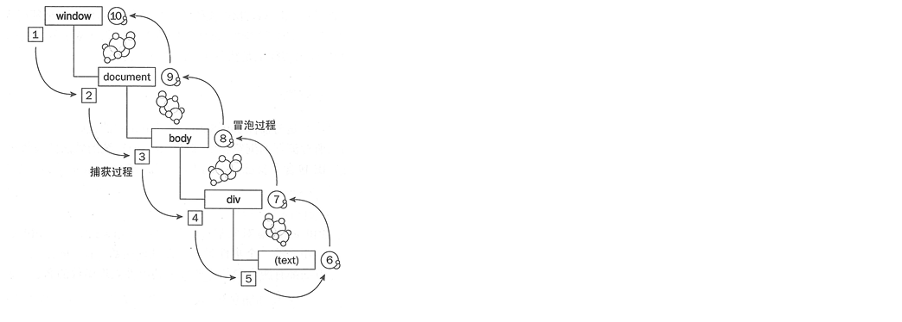

---
# 当前页面内容标题
title: 第五章 事件
# 当前页面图标
icon: javascript 
# 分类
category:
  - 前端
  - JavaScript
# 标签
tag:
  - JavaScript
  - web
sticky: false
# 是否收藏在博客主题的文章列表中，当填入数字时，数字越大，排名越靠前。
star: false
# 是否将该文章添加至文章列表中
article: false
# 是否将该文章添加至时间线中
timeline: false
---

事件是为了让我们更好的去和页面进行交互。

事件一般是定义在元素节点上的，所以我们一般称之为给元素节点绑定一个事件。

## 一 、定义事件

### （1）addEventListener

最常用，大神都是这么写。

康永亮说兼容性问题，大家可以自行查阅资料。

```javascript
var div1 = document.getElementById("div1");
div1.addEventListener('click',function(){
    console.log("click");
})
```

### （2）onclick

一定要知道，能少用就少用把。

```javascript
var div1 = document.getElementById("div1");
div1.onclick = function(){
    console.log("click")
}
```

### （3）标签内使用

也常用

```html
<div class="content aaa" onclick="test(123)" id="div1"  name="bbb"></div>

<script type="text/javascript">
    function test(){
        console.log("test");
    }
</script>
```

## 二、清除事件

### （1）方式一

```javascript
div1.onclick = null
或者
div1.onclick = false
```

### （2）方式二

使用此方法，必须将回调函数定义在外边，不能使用匿名回调

```javascript
var callback = function(){
    console.log("click")
}
var div1 = document.getElementById("div1");
//添加一个事件
div1.addEventListener('click',callback)
//移除一个事件
div1.removeEventListener('click',callback)
```

## 三、事件分类

### （1）鼠标事件

```javascript
（常用）
onclick：点击某个对象时触发
ondblclick：双击某个对象时触发
onmouseover：鼠标移入某个元素时触发
onmouseout：鼠标移出某个元素时触发

（知道，不用）
onmouseenter：鼠标进入某个元素时触发
onmouseleave：鼠标离开某个元素时触发
onmousedown：鼠标按下时触发
onmouseup：鼠标抬起时触发
onmousemove：鼠标被移动时触发
onwheel：鼠标滚轮滚动时触发
oncontextmenu：点击鼠标右键时触发
```

### （2）键盘事件

```javascript
键盘事件
onkeydown：键盘的键按下时触发
onkeyup：键盘的键放开时触发
onkeypress：按下或按住键盘键时触发
```

### （3）表单事件

```javascript
常用
onfocus：元素获得焦点时触发
onblur：元素失去焦点时触发
onchange：元素内容改变时触发
oninput：元素获取用户输入时触发
```

### （4）（文档、浏览器）对象事件

```javascript
会用到
onload：元素加载完时触发

一辈子也用不了几次，知不知道都行
onresize：浏览器窗口大小改变时触发
onabort：图形的加载被中断时触发
onerror：当加载文档或者图片时（没找到）发生的错误时触发
onscroll：文档滚动时触发
onpageshow：用户访问页面时触发
onunload：用户退出页面时触发
```

## 四、事件冒泡和捕获

**1、事件捕获** 捕获型事件(event capturing)：事件从最不精确的对象(document 对象)开始触发，然后到最精确(也可以在窗口级别捕获事件，不过必须由开发人员特别指定)

**2、事件冒泡** 冒泡型事件：事件按照从最特定的事件目标到最不特定的事件目标(document对象)的顺序触发。

**3、捕获和冒泡过程图**



事件是先进行捕获，后进行冒泡！

addEventListener的第三个参数如果是false表示在冒泡阶段处理回调函数，如果是true表示在捕获阶段处理回调函数。

怎么阻止事件冒泡？event.stopPropagation();

```javascript
ul.addEventListener('click',function(event){
            console.log('ul')
            event.stopPropagation();
        },true)
```
